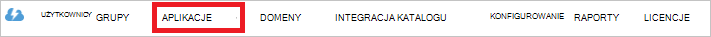

<properties
   pageTitle="Typ poświadczeń uwierzytelniania magazynu Lake danych za pomocą usługi Active Directory | Microsoft Azure"
   description="Dowiedz się, jak uwierzytelnienia z magazynu Lake danych za pomocą usługi Active Directory"
   services="data-lake-store"
   documentationCenter=""
   authors="nitinme"
   manager="jhubbard"
   editor="cgronlun"/>

<tags
   ms.service="data-lake-store"
   ms.devlang="na"
   ms.topic="article"
   ms.tgt_pltfrm="na"
   ms.workload="big-data"
   ms.date="10/17/2016"
   ms.author="nitinme"/>

# Uwierzytelnianie użytkownika końcowego z magazynu Lake danych za pomocą usługi Azure Active Directory

> [AZURE.SELECTOR]
- [Aby usługi uwierzytelniania](data-lake-store-authenticate-using-active-directory.md)
- [Uwierzytelnianie użytkownika końcowego](data-lake-store-end-user-authenticate-using-active-directory.md)

Azure magazynu Lake danych do uwierzytelniania używa usługi Azure Active Directory. Przed do tworzenia aplikacji, która działa z magazynu Lake danych Azure lub Azure danych Lake analizy, należy najpierw wybrać sposób do uwierzytelniania aplikacji z usługą Azure Active Directory (Azure AD). Dwa główne dostępne są następujące opcje:

* Uwierzytelnianie użytkownika końcowego, i 
* Aby usługi uwierzytelniania. 

W aplikacji są do dyspozycji token OAuth 2.0, który jest dołączony do każdego żądania magazynu Lake danych Azure lub Azure danych Lake analizy powoduje obu tych opcji.

Ten artykuł omówiono sposób tworzenia aplikacji sieci web Azure AD dla uwierzytelniania użytkowników końcowych. Aby uzyskać instrukcje dotyczące konfiguracji aplikacji Azure AD dla uwierzytelniania do usługi zobacz [uwierzytelniania do usługi z magazynu Lake danych za pomocą usługi Azure Active Directory](data-lake-store-authenticate-using-active-directory.md).

## Wymagania wstępne

* Subskrypcję usługi Azure. Zobacz [Azure pobrać bezpłatną wersję próbną](https://azure.microsoft.com/pricing/free-trial/).
* Twoja nazwa subskrypcji. Czy można pobrać z Azure Portal. Na przykład jest dostępna z magazynu Lake danych karta konta.

    

* Nazwy domeny Azure AD. Można je podjąć przez umieszczenie wskaźnika myszy wskaźnik myszy w prawym górnym rogu Azure Portal. Na poniższych zrzut ekranu Nazwa domeny jest **contoso.microsoft.com**i identyfikator GUID w nawiasach jest identyfikatorem dzierżawy 

    

## Uwierzytelnianie użytkownika końcowego

Jest to zalecane podejście, jeśli chcesz, aby użytkownik końcowy zalogować się do aplikacji za pośrednictwem Azure AD. Aplikacja będą mieli dostęp do Azure zasoby z tego samego poziomu dostępu jako użytkownik końcowy co zalogowany. Użytkownika końcowego, będzie konieczne poświadczenia okresowo w kolejności aplikacji do obsługi programu access.

Wynik o użytkowników końcowych, zaloguj się to, że aplikacja znajduje się token dostępu i tokenu odświeżania. Token dostępu otrzymuje dołączonych do każdego żądania magazynu Lake danych lub analizy Lake danych i obowiązuje przez godzinę domyślnie. Token odświeżania można uzyskać nowy token dostępu, a jest ważny dla do dwóch tygodni domyślnie użycie regularnie. Za pomocą dwóch różnych metod dla użytkowników końcowych Zaloguj.

### Za pomocą wyskakujące OAuth 2.0

Aplikacja może wyzwolić OAuth 2.0 autoryzacji okno podręczne, w którym użytkownik końcowy może wprowadzić swoje poświadczenia. Ta podręczna działa proces uwierzytelnianie dwuskładnikowe Azure AD (2FA), w razie potrzeby. 

>[AZURE.NOTE] Ta metoda nie jest jeszcze obsługiwane w Azure AD uwierzytelniania biblioteki (ADAL) dla Python lub Java.

### Bezpośrednio przekazywania poświadczeń użytkownika

Aplikacja zapewnia bezpośrednio poświadczeń użytkownika Azure AD. Ta metoda działa tylko z kont użytkowników identyfikator organizacji. nie jest zgodny z osobiste / "live ID" konta użytkowników, łącznie z tymi kończący się @outlook.com lub @live.com. Ponadto ta metoda nie jest zgodny z kont użytkowników, które wymagają uwierzytelnianie dwuskładnikowe Azure AD (2FA).

### Co muszę używać tej metody?

* Nazwa domeny w usłudze Azure AD. To już znajduje się na wymagania wstępne tego artykułu.

* Azure AD **aplikacji sieci web**

* Identyfikator klienta dla aplikacji sieci web Azure AD

* Identyfikator URI odpowiedzi dla aplikacji sieci web Azure AD

* Ustawianie delegowane uprawnień

Aby uzyskać instrukcje dotyczące tworzenia aplikacji sieci web Azure AD i skonfiguruj go na potrzeby wymienionych powyżej zobacz sekcję poniżej [Tworzenie aplikacji usługi Active Directory](#create-an-active-directory-application) . 

## Tworzenie aplikacji usługi Active Directory

W tej sekcji możemy informacje na temat tworzenia i konfigurowania aplikacji sieci web Azure AD dla uwierzytelniania użytkowników końcowych z magazynu Lake danych Azure za pomocą usługi Azure Active Directory.

### Krok 1: Tworzenie aplikacji usługi Azure Active Directory

>[AZURE.NOTE] Azure Portal za pomocą poniższych kroków. Możesz również utworzyć aplikację Azure AD przy użyciu [Programu PowerShell Azure](../resource-group-authenticate-service-principal.md) lub [Polecenie Azure](../resource-group-authenticate-service-principal-cli.md).

1. Zaloguj się do swojego konta Azure za pomocą [portalu klasycznego](https://manage.windowsazure.com/).

2. Wybierz pozycję **Usługi Active Directory** w okienku po lewej stronie.

     
     
3. Wybierz pozycję usługi Active Directory, który ma być używany do tworzenia nowej aplikacji. Jeśli masz więcej niż jeden usługi Active Directory, zazwyczaj chcesz utworzyć aplikację w katalogu, w którym znajduje się Twoja subskrypcja. Tylko można udzielić dostępu do zasobu w ramach subskrypcji dla aplikacji, w tym samym katalogu co subskrypcji.  

     
    
    
3. Aby wyświetlić aplikacje w katalogu, kliknij przycisk **aplikacje**.

     

4. Jeśli nie utworzono aplikację w tym katalogu przed powinna być widoczna coś podobne na poniższej ilustracji. Wybierz polecenie **Dodaj APLIKACJĘ**

     

     Lub kliknij przycisk **Dodaj** w dolnym okienku.

     

6. Podaj nazwę aplikacji, a następnie wybierz typ aplikacji, którą chcesz utworzyć. Ten samouczek tworzenie **Interfejs API sieci WEB i/lub aplikacji sieci WEB** i kliknij przycisk Dalej.

     

7. Wypełnij właściwości aplikacji. Dla **Adresu URL logowania na**przekazać go do witryny sieci web, który opisuje aplikacji. Obecność w witrynie sieci web nie jest sprawdzany. W przypadku **Aplikacji identyfikator URI**zapewnić identyfikator URI, który identyfikuje aplikację.

     

    Kliknij znacznik wyboru, aby zakończyć działanie kreatora i utworzyć aplikację.

### Krok 2: Pobierz identyfikator klienta, Odpowiedz URI i ustawianie uprawnień delegowanych

1. Kliknij kartę **Konfiguruj** , aby skonfigurować hasło aplikacji.

     

2. Skopiuj **identyfikator klienta**.
  
     

3. W sekcji **rejestracji jednokrotnej** Skopiuj **URI odpowiedź**.

    

4. W obszarze **uprawnienia do innych aplikacji**kliknij pozycję **Dodaj aplikację**

    

5. W kreatorze **uprawnienia do innych aplikacji** wybierz **Lake danych Azure** i **systemu Windows** **Azure usługi zarządzania API**, a następnie kliknij znacznik wyboru.

6. Domyślnie **Delegowane uprawnienia** dla nowo dodany usług są ustawione na zero. Kliknij przycisk **Uprawnienia delegowane** listy rozwijanej Lake danych Azure i usługi zarządzania systemu Windows Azure i wybierz dostępne pola wyboru, aby ustawić wartości 1. Wynik powinien wyglądać w ten sposób.

     

7. Kliknij przycisk **Zapisz**.

## Następne kroki

W tym artykule została utworzona Azure AD aplikacji sieci web i zgromadzono informacje, które są potrzebne w aplikacjach klienckich Autor przy użyciu zestawu SDK usługi .NET Java SDK, itp. Teraz można przystąpić do następujących artykułów, które porozmawiać na temat sposobu używania aplikacji sieci web Azure AD do najpierw uwierzytelnienia z magazynu Lake danych, a następnie wykonać inne operacje w magazynie.

- [Rozpoczynanie pracy z magazynu Lake danych Azure przy użyciu zestawu SDK .NET](data-lake-store-get-started-net-sdk.md)
- [Rozpoczynanie pracy z magazynu Lake danych Azure przy użyciu zestawu SDK Java](data-lake-store-get-started-java-sdk.md)
