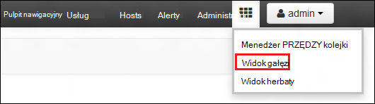
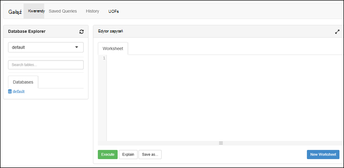

<properties
   pageTitle="Tworzenie klastrów HDInsight z magazynu Lake danych Azure za pomocą portalu | Azure"
   description="Tworzenie i używanie klastrów HDInsight z magazynu Lake danych Azure za pomocą Azure Portal"
   services="data-lake-store,hdinsight" 
   documentationCenter=""
   authors="nitinme"
   manager="jhubbard"
   editor="cgronlun"/>

<tags
   ms.service="data-lake-store"
   ms.devlang="na"
   ms.topic="article"
   ms.tgt_pltfrm="na"
   ms.workload="big-data"
   ms.date="10/21/2016"
   ms.author="nitinme"/>

# Tworzenie klastrze HDInsight z magazynu Lake danych przy użyciu Azure Portal

> [AZURE.SELECTOR]
- [Za pomocą portalu](data-lake-store-hdinsight-hadoop-use-portal.md)
- [Przy użyciu programu PowerShell](data-lake-store-hdinsight-hadoop-use-powershell.md)
- [Korzystanie z Menedżera zasobów](data-lake-store-hdinsight-hadoop-use-resource-manager-template.md)

Dowiedz się, jak utworzyć klaster HDInsight (Hadoop, HBase, Spark lub Burza) z dostępem do magazynu Lake danych Azure za pomocą Azure Portal. Ważne informacje dotyczące tej wersji:

* **Klastrów dla Spark (Linux) i klastrów Hadoop (Windows i Linux)**, magazynu Lake danych można używać tylko jako konto dodatkowego miejsca do magazynowania. Domyślne konto miejsca do magazynowania dla klastrów takie będą nadal Azure magazyn obiektów blob (WASB).

* Zapisywanie danych w topologii Burza można **Burza dla klastrów (Windows i Linux)**, magazynu Lake danych. Również magazynu Lake danych mogą być używane do przechowywania dane źródłowe, które następnie mogą być odczytywane przez topologii Burza. Aby uzyskać więcej informacji zobacz [Używanie danych Lake przechowywanych w topologii Burza](#use-data-lake-store-in-a-storm-topology).

* **HBase dla klastrów (Windows i Linux)**, magazynu Lake danych może służyć jako domyślnego miejsca do magazynowania, a także dodatkowego miejsca do magazynowania. Aby uzyskać więcej informacji zobacz [Używanie magazynu Lake danych z klastrów HBase](#use-data-lake-store-with-hbase-clusters).

> [AZURE.NOTE] Kilka ważnych uwag do noty. 
> 
> * Opcja tworzenia HDInsight klastrów z dostępem do magazynu Lake danych jest dostępna tylko w przypadku wersji HDInsight 3,2 i 3.4 (w przypadku Hadoop, HBase i Burza klastrów na systemie Windows, a także Linux). Dla klastrów Spark w systemie Linux ta opcja jest dostępna na klastrów HDInsight 3.4.
>
> * Jak wcześniej wspomniano, magazynu Lake danych jest dostępna jako domyślnego miejsca do magazynowania dla niektórych typów klaster (HBase) i dodatkowego miejsca do magazynowania dla innych typów klaster (Hadoop, Spark Burza). Przy użyciu magazynu Lake danych przy użyciu konta dodatkowego miejsca do magazynowania nie ma wpływu na wydajność lub możliwość odczytu/zapisu do magazynu w grupie. Scenariusz z używania magazynu Lake danych jako dodatkowego miejsca do magazynowania związanych z klastrem pliki (na przykład dzienniki itp.) są zapisywane w do domyślnego magazynu (BLOB Azure), podczas przetwarzania danych mogą być przechowywane w konta magazynu Lake danych.

## Wymagania wstępne

Przed rozpoczęciem tego samouczka, musisz mieć następujące czynności:

- **Azure subskrypcji**. Zobacz [Azure pobrać bezpłatną wersję próbną](https://azure.microsoft.com/pricing/free-trial/).

- **Konto azure magazynu Lake danych**. Postępuj zgodnie z instrukcjami na [Rozpoczynanie pracy z magazynu Lake danych Azure za pomocą portalu Azure](data-lake-store-get-started-portal.md). 

- **Przekaż kilka przykładowych danych do swojego konta magazynu Lake danych Azure**. Po utworzeniu konta, należy wykonać następujące zadania do przekazania kilka przykładowych danych. Musisz te dane w dalszej części samouczka, aby uruchomić zadania z klaster HDInsight uzyskać dostęp do danych w magazynie Lake danych.

    * [Tworzenie folderu w sklepie Lake danych](data-lake-store-get-started-portal.md#createfolder).
    * [Przekazywanie pliku do sklepu Lake danych](data-lake-store-get-started-portal.md#uploaddata). Jeśli szukasz kilka przykładowych danych do przekazania zostanie wyświetlony folder **Pogotowie danych** z [Repozytorium cyfra Lake danych Azure](https://github.com/Azure/usql/tree/master/Examples/Samples/Data/AmbulanceData).

- **Azure Active Directory usługi kapitału**. Kroki opisane w tym samouczku podano instrukcje dotyczące tworzenia wystawcy usługi w Azure AD. Jednak musisz być administratorem Azure AD, aby można było utworzyć wystawcy usługi. Jeśli jesteś administratorem Azure AD, możesz pominąć te wymagania wstępne i kontynuować samouczek.
    
    **Jeśli nie jesteś administratorem Azure AD**, nie można wykonać czynności wymagane do utworzenia wystawcy usługi. W takim przypadku administrator Azure AD należy najpierw utworzyć wystawcy usługi przed utworzeniem klastrze HDInsight z magazynu Lake danych. Ponadto wystawcy usługi należy utworzyć za pomocą certyfikatu, zgodnie z opisem w [Tworzenie głównej przy użyciu certyfikatu usługi](../resource-group-authenticate-service-principal.md#create-service-principal-with-certificate).

## Możesz się uczyć z klipów wideo?

Obejrzyj następujące klipy wideo, aby dowiedzieć się, jak inicjować obsługę klastrów HDInsight z dostępem do magazynu Lake danych.

* [Tworzenie klastrze HDInsight z dostępem do magazynu Lake danych](https://mix.office.com/watch/l93xri2yhtp2)
* Gdy klaster jest skonfigurowana, [danych programu Access w sklepie Lake danych za pomocą skryptów gałąź i świnka](https://mix.office.com/watch/1n9g5w0fiqv1q)

## Tworzenie klastrze HDInsight z dostępem do magazynu Lake danych Azure

W tej sekcji możesz utworzyć klaster HDInsight Hadoop, która używa magazynu Lake danych jako dodatkowego miejsca do magazynowania. W tej wersji dla klastrze Hadoop magazynu Lake danych można używać tylko jako dodatkowego miejsca do magazynowania dla klaster. Magazyn domyślny będzie nadal obiektów blob platformy Azure przestrzeni dyskowej (WASB). Tak najpierw utworzymy konto miejsca do magazynowania i kontenerów miejsca do magazynowania wymagane dla klaster.

1. Logowanie się do nowego [Azure Portal](https://portal.azure.com).

2. Postępuj zgodnie z instrukcjami w [klastrów tworzenie Hadoop w HDInsight](../hdinsight/hdinsight-provision-clusters.md#create-using-the-preview-portal) , aby rozpocząć inicjowania obsługi administracyjnej klaster HDInsight.

3. Wybierz polecenie karta **Opcjonalnym** **Źródła danych**. W karta **Źródła danych** Określ informacje szczegółowe dla konta miejsca do magazynowania i kontenera magazynu określić **lokalizację** jako **Wschodniej 2**, a następnie kliknij **Klaster AAD tożsamości**.

    ![Dodawanie usługi kapitału do klastrów HDInsight] (./media/data-lake-store-hdinsight-hadoop-use-portal/hdi.adl.1.png "Dodawanie usługi kapitału do klastrów HDInsight")

4. Na karta **Klaster AAD tożsamości** można zaznacz istniejący wystawcy usługi lub Utwórz nowy.

    * **Tworzenie nowego wystawcy usługi**

        * W karta **Klaster AAD tożsamości** kliknij przycisk **Utwórz nowy**, kliknij pozycję **Wystawcy usługi**, a następnie w karta **Tworzenie wystawcy usługi** Podaj wartości w celu utworzenia nowego wystawcy usługi. W związku z tym certyfikat i aplikacji usługi Azure Active Directory również zostanie utworzona. Kliknij przycisk **Utwórz**.

            ![Dodawanie usługi kapitału do klastrów HDInsight] (./media/data-lake-store-hdinsight-hadoop-use-portal/hdi.adl.2.png "Dodawanie usługi kapitału do klastrów HDInsight")

        * Wybierz polecenie karta **Tożsamości AAD klaster** **Zarządzania dostępem ADLS**. W okienku wyświetlane konta magazynu Lake danych skojarzone z subskrypcją. Jednak można ustawić uprawnienia tylko dla konta utworzone przez Ciebie. Wybierz uprawnienia odczytu/zapisu/wykonywanie dla konta, które chcesz skojarzyć z klastrem HDInsight, a następnie kliknij przycisk **Zapisz uprawnienia**.

            ![Dodawanie usługi kapitału do klastrów HDInsight] (./media/data-lake-store-hdinsight-hadoop-use-portal/hdi.adl.3.png "Dodawanie usługi kapitału do klastrów HDInsight")

        * Na karta **Klaster AAD tożsamości** kliknij przycisk **Pobierz certyfikat** do pobrania certyfikat skojarzony z głównej, utworzono usługi. To jest przydatne, jeśli chcesz używać samej wystawcy usługi w przyszłości, podczas tworzenia dodatkowe klastrów HDInsight. Kliknij przycisk **Wybierz**.

            ![Dodawanie usługi kapitału do klastrów HDInsight] (./media/data-lake-store-hdinsight-hadoop-use-portal/hdi.adl.4.png "Dodawanie usługi kapitału do klastrów HDInsight")

    * **Wybierz istniejące wystawcy usługi**

        * W karta **Klaster AAD tożsamości** kliknij pozycję **Użyj istniejącego**, kliknij **Wystawcy usługi**i w karta **Wybierz podmiot zabezpieczeń usługi** wyszukać istniejące wystawcy usługi. Kliknij pozycję główna nazwa usługi, a następnie kliknij przycisk **Wybierz**.

            ![Dodawanie usługi kapitału do klastrów HDInsight] (./media/data-lake-store-hdinsight-hadoop-use-portal/hdi.adl.5.png "Dodawanie usługi kapitału do klastrów HDInsight")

        * Na karta **Tożsamości AAD klaster** Przekaż certyfikatu (pfx) skojarzone z kapitału usługę wybranego, a następnie hasło certyfikatu.

5. Kliknij pozycję **Zarządzaj ADLS dostęp** , a następnie kliknij pozycję **Wybierz uprawnienia do pliku**. 

    ![Dodawanie usługi kapitału do klastrów HDInsight] (./media/data-lake-store-hdinsight-hadoop-use-portal/hdi.adl.5.existing.save.png "Dodawanie usługi kapitału do klastrów HDInsight")

6. W karta **Wybierz uprawnienia do plików** z **konta** listę rozwijaną, wybierz konto magazynu Lake danych, który ma być skojarzone z klastrem HDInsight. Karta Lista plików i folderów, które są dostępne w wybrane konto magazynu Lake danych. 
 
    ![Podaj dostęp do magazynu Lake danych] (./media/data-lake-store-hdinsight-hadoop-use-portal/hdi-adl-permission-1.png "Podaj dostęp do magazynu Lake danych")

    Po wykonaniu tej określić uprawnienia, aby wprowadzić wybrane pliki i foldery. Foldery należy również określić, czy uprawnienia dotyczą do folderu tylko lub folder i wszystkie elementy podrzędne w folderze. Umożliwia wybranie tej opcji, wybierając odpowiednią wartość w polu **Zastosuj do** listy rozwijanej. Aby usunąć uprawnienia, kliknij ikonę **Usuń**

    ![Podaj dostęp do magazynu Lake danych] (./media/data-lake-store-hdinsight-hadoop-use-portal/hdi-adl-permission-2.png "Podaj dostęp do magazynu Lake danych")

    Powtórz te kroki, aby skojarzonych plików i folderów z innych kont magazynu Lake danych. Po zakończeniu przypisywania uprawnień, kliknij przycisk **Zaznacz** w dolnej części karta.

7. W karta **Przypisywanie wybrane uprawnienia** przeglądania uprawnień, które podany, a następnie kliknij przycisk **Uruchom** , aby te uprawnienia.

    ![Podaj dostęp do magazynu Lake danych] (./media/data-lake-store-hdinsight-hadoop-use-portal/hdi-adl-permission-3.png "Podaj dostęp do magazynu Lake danych")

    W kolumnie Stan Wyświetla postęp. Po pomyślnym przypisano wszystkie uprawnienia, kliknij przycisk **Gotowe**. 

6. Kliknij przycisk **Wybierz** na karty **Klaster AAD tożsamości** i **Źródła danych** , a następnie kontynuuj tworzenie klaster zgodnie z opisem w [klastrów tworzenie Hadoop w HDInsight](../hdinsight/hdinsight-hadoop-create-linux-clusters-portal.md).

7. Gdy klaster jest obsługi administracyjnej, można sprawdzić, że wystawcy usługi jest skojarzony z klastrem HDInsight. Aby zrobić z karta klaster, kliknij pozycję **Tożsamości AAD klaster** Zobacz skojarzone wystawcy usługi.

    ![Dodawanie usługi kapitału do klastrów HDInsight] (./media/data-lake-store-hdinsight-hadoop-use-portal/hdi.adl.6.png "Dodawanie usługi kapitału do klastrów HDInsight")

## Uruchamianie zadania testowe w klastrze HDInsight w celu używania magazynu Lake danych Azure

Po skonfigurowaniu klaster HDInsight można uruchamiać zadania test w klastrze, aby sprawdzić, czy klaster HDInsight dostęp do danych w magazynie Lake danych Azure. W tym celu firma Microsoft spowoduje uruchomienie kilku kwerend gałęzi obiektu docelowego magazynu Lake danych.

### Klaster Linux

1. Otwórz karta klaster klaster, który właśnie zainicjowany, a następnie kliknij pozycję **pulpit nawigacyjny**. Spowoduje to otwarcie Ambari klaster Linux. Podczas uzyskiwania dostępu do Ambari, zostanie wyświetlony monit o uwierzytelnienia do witryny. Wprowadź administrator (Administrator domyślne), konta i hasło używane podczas tworzenia klaster.

    ![Uruchamianie klaster pulpitu nawigacyjnego] (./media/data-lake-store-hdinsight-hadoop-use-portal/hdiadlcluster1.png "Uruchamianie klaster pulpitu nawigacyjnego")

    Możesz również przejść bezpośrednio do Ambari, przechodząc do https://CLUSTERNAME.azurehdinsight.net w przeglądarce sieci web (gdzie **NAZWAKLASTRA** jest nazwą klaster HDInsight).

2. Otwórz widok gałęzi. Wybierz zestaw kwadratów z menu strony (obok pozycji link **Administrator** i przycisk po prawej stronie) do listy dostępne widoki. Wybierz widok **gałęzi** .

    

3. Powinien zostać wyświetlony strony podobny do następującego:

    

4. W **Edytorze zapytań** części strony wklej następującą instrukcję HiveQL w arkuszu:

        CREATE EXTERNAL TABLE vehicles (str string) LOCATION 'adl://mydatalakestore.azuredatalakestore.net:443/mynewfolder'

5. Kliknij przycisk **Wykonaj** w dolnej części **Edytora zapytań** , aby uruchomić kwerendę. Sekcja **Wyniki procesu kwerendy** należy wyświetlane poniżej **Edytora zapytań** i wyświetlać informacje o zadaniu.

6. Po zakończeniu kwerendy, sekcji **Proces wyniki** są wyświetlane wyniki operacji. Karta **wyników** powinien zawierać następujące informacje:

7. Uruchom poniższe zapytanie w celu zweryfikowania, że tabela została utworzona.

        SHOW TABLES;

    Karta **wyników** powinien zawierać następujące informacje:

        hivesampletable
        vehicles

    **pojazdy** znajduje się tabela utworzony wcześniej. **hivesampletable** jest dostępna w wszystkich klastrów HDInsight domyślnie przykładową tabelę.

8. Można również uruchomić kwerendę, aby pobrać dane z tabeli **pojazdy** .

        SELECT * FROM vehicles LIMIT 5;

### Klaster systemu Windows

1. Otwórz karta klaster klaster, który właśnie zainicjowany, a następnie kliknij pozycję **pulpit nawigacyjny**.

    ![Uruchamianie klaster pulpitu nawigacyjnego] (./media/data-lake-store-hdinsight-hadoop-use-portal/hdiadlcluster1.png "Uruchamianie klaster pulpitu nawigacyjnego")

    Po wyświetleniu monitu wprowadź poświadczenia administratora klaster.

2. Spowoduje to otwarcie konsoli Microsoft Azure HDInsight kwerendy. Kliknij **gałąź Edytor**.

    ![Otwórz gałęzi edytora] (./media/data-lake-store-hdinsight-hadoop-use-portal/hdiadlcluster2.png "Otwórz gałęzi edytora")

3. W edytorze gałęzi wprowadź poniższe zapytanie, a następnie kliknij przycisk **Prześlij**.

        CREATE EXTERNAL TABLE vehicles (str string) LOCATION 'adl://mydatalakestore.azuredatalakestore.net:443/mynewfolder'

    W tej kwerendzie gałęzi, możemy utworzyć tabelę z danych przechowywanych w magazynie Lake danych w `adl://mydatalakestore.azuredatalakestore.net:443/mynewfolder`. Tej lokalizacji ma przykładowy plik danych powinien zostały przekazane wcześniej.

    Tabela **Sesji zadań** u dołu jest wyświetlany stan zadania Zmienianie z **Inicjowanie** **uruchomiony**, aby **wykonane**. Możesz również kliknąć pozycję **Wyświetlanie szczegółów** , aby wyświetlić więcej informacji na temat ukończonego zadania.

    ![Utwórz tabelę] (./media/data-lake-store-hdinsight-hadoop-use-portal/hdiadlcluster3.png "Utwórz tabelę")

4. Uruchom poniższe zapytanie w celu zweryfikowania, że tabela została utworzona.

        SHOW TABLES;

    Kliknij pozycję **Wyświetl szczegóły** odpowiadające tej kwerendy i wyniki powinny Pokaż następujące elementy:

        hivesampletable
        vehicles

    **pojazdy** znajduje się tabela utworzony wcześniej. **hivesampletable** jest dostępna w wszystkich klastrów HDInsight domyślnie przykładową tabelę.

5. Można również uruchomić kwerendę, aby pobrać dane z tabeli **pojazdy** .

        SELECT * FROM vehicles LIMIT 5;

## Magazyn Lake danych programu Access przy użyciu polecenia HDFS

Po skonfigurowaniu klaster HDInsight w celu używania magazynu Lake danych, możesz uzyskać dostępu do magazynu za pomocą poleceń powłoki HDFS.

### Klaster Linux

W tej sekcji można będzie SSH w klastrze i uruchomienie poleceń HDFS. System Windows nie udostępnia wbudowanego klienta SSH. Firma Microsoft zaleca używanie **Kit**, który można pobrać z [http://www.chiark.greenend.org.uk/~sgtatham/putty/download.html](http://www.chiark.greenend.org.uk/~sgtatham/putty/download.html).

Aby uzyskać więcej informacji na temat korzystania z Kit Zobacz [Używanie SSH z systemem Linux Hadoop na HDInsight z systemu Windows](../hdinsight/hdinsight-hadoop-linux-use-ssh-windows.md).

Po nawiązaniu połączenia użyj następującego polecenia system plików HDFS, aby wyświetlić listę plików w magazynie Lake danych.

    hdfs dfs -ls adl://<Data Lake Store account name>.azuredatalakestore.net:443/

To powinien zawierać plik, który wcześniej przekazane do sklepu Lake danych.

    15/09/17 21:41:15 INFO web.CaboWebHdfsFileSystem: Replacing original urlConnectionFactory with org.apache.hadoop.hdfs.web.URLConnectionFactory@21a728d6
    Found 1 items
    -rwxrwxrwx   0 NotSupportYet NotSupportYet     671388 2015-09-16 22:16 adl://mydatalakestore.azuredatalakestore.net:443/mynewfolder

Można również użyć `hdfs dfs -put` polecenie, aby przekazać pliki do magazynu Lake danych, a następnie użyj `hdfs dfs -ls` Aby sprawdzić, czy pliki zostały pomyślnie przekazane.

### Klaster systemu Windows

1. Logowanie się do nowego [Azure Portal](https://portal.azure.com).

2. Kliknij przycisk **Przeglądaj**, kliknij pozycję **klastrów HDInsight**, a następnie kliknij utworzony klaster HDInsight.

3. W karta klaster kliknij **Pulpitu zdalnego**, a następnie w karta **Pulpitu zdalnego** , kliknij przycisk **Połącz**.

    ![Zdalny w klaster HDI] (./media/data-lake-store-hdinsight-hadoop-use-portal/ADL.HDI.PS.Remote.Desktop.png "Tworzenie grupy zasobów Azure")

    Po wyświetleniu monitu wprowadź poświadczenia, podanych dla użytkownika na pulpicie zdalnym.

4. W sesji zdalnej Uruchom program Windows PowerShell, a lista plików w magazynie Lake Azure danych przy użyciu poleceń systemu plików HDFS.

        hdfs dfs -ls adl://<Data Lake Store account name>.azuredatalakestore.net:443/

    To powinien zawierać plik, który wcześniej przekazane do sklepu Lake danych.

        15/09/17 21:41:15 INFO web.CaboWebHdfsFileSystem: Replacing original urlConnectionFactory with org.apache.hadoop.hdfs.web.URLConnectionFactory@21a728d6
        Found 1 items
        -rwxrwxrwx   0 NotSupportYet NotSupportYet     671388 2015-09-16 22:16 adl://mydatalakestore.azuredatalakestore.net:443/mynewfolder

    Można również użyć `hdfs dfs -put` polecenie, aby przekazać pliki do magazynu Lake danych, a następnie użyj `hdfs dfs -ls` Aby sprawdzić, czy pliki zostały pomyślnie przekazane.

## Użyj magazynu Lake danych z klastrem Spark

W tej sekcji możesz za pomocą notesu Jupyter dostępne klastrów HDInsight Spark do wykonywania zadania, który odczytuje dane z konta magazynu Lake danych, który skojarzony z klastrem HDInsight Spark, zamiast domyślne konto Azure Blob miejsca do magazynowania.

1. Skopiuj przez kilka przykładowych danych z domyślnego konta przestrzeni dyskowej (WASB) skojarzone z klastrem Spark na koncie sklepu Lake danych Azure skojarzone z klastrem. Za pomocą [Narzędzia ADLCopy](http://aka.ms/downloadadlcopy) to zrobić. Pobierz i zainstaluj narzędzie za pomocą łącza.

2. Otwórz wiersz polecenia i przejdź do katalogu, w którym AdlCopy jest zainstalowany, zwykle `%HOMEPATH%\Documents\adlcopy`.

3. Uruchom następujące polecenie, aby skopiować określonych obiektów blob z kontenera źródła do magazynu Lake danych:

        AdlCopy /source https://<source_account>.blob.core.windows.net/<source_container>/<blob name> /dest swebhdfs://<dest_adls_account>.azuredatalakestore.net/<dest_folder>/ /sourcekey <storage_account_key_for_storage_container>

    Ten samouczek, skopiuj przykładowy plik danych **HVAC.csv** w **/HdiSamples/HdiSamples/SensorSampleData/grzewczo-** konto Azure magazynu Lake danych. Wstawkę kodu powinna wyglądać podobnie do:

        AdlCopy /Source https://mydatastore.blob.core.windows.net/mysparkcluster/HdiSamples/HdiSamples/SensorSampleData/hvac/HVAC.csv /dest swebhdfs://mydatalakestore.azuredatalakestore.net/hvac/ /sourcekey uJUfvD6cEvhfLoBae2yyQf8t9/BpbWZ4XoYj4kAS5Jf40pZaMNf0q6a8yqTxktwVgRED4vPHeh/50iS9atS5LQ==

    >[AZURE.WARNING] Upewnij się, które nazwy pliku i ścieżki są z wielkiej litery.

4. Wyświetli monit o podanie poświadczeń dla subskrypcji Azure, w którym masz konto magazynu Lake danych. Zostaną wyświetlone informacje podobne do następujących:

        Initializing Copy.
        Copy Started.
        100% data copied.
        Copy Completed. 1 file copied.

    Plik danych (**HVAC.csv**) zostaną skopiowane w folderze **/hvac** na koncie magazynu Lake danych.

4. [Azure Portal](https://portal.azure.com/), z startboard kliknij Kafelek klaster Spark (jeśli przypięte go do startboard). Możesz również przejść do klaster w obszarze **Przeglądaj wszystkie** > **HDInsight klastrów**.   

2. Z karta klaster Spark kliknij przycisk **Szybkie łącza**, a następnie z karta **Pulpit nawigacyjny klaster** kliknij **Jupyter notesu**. Jeśli zostanie wyświetlony monit, wprowadź poświadczenia administratora klaster.

    > [AZURE.NOTE] Może też osiągnąć notesu Jupyter dla klaster, otwierając następujący adres URL w przeglądarce. Zamień __NAZWAKLASTRA__ nazwę klaster:
    >
    > `https://CLUSTERNAME.azurehdinsight.net/jupyter`

2. Tworzenie nowego notesu. Kliknij pozycję **Nowy**, a następnie kliknij pozycję **PySpark**.

    ![Tworzenie nowego notesu Jupyter] (./media/data-lake-store-hdinsight-hadoop-use-portal/hdispark.note.jupyter.createnotebook.png "Tworzenie nowego notesu Jupyter")

3. Nowy notes zostanie utworzony i otwarty o nazwie **Untitled.pynb**. 

4. Ponieważ utworzono Notes za pomocą jądrze PySpark, nie musisz utworzyć dowolny konteksty jawnie. Konteksty iskrowym i gałąź jest automatycznie tworzona automatycznie po uruchomieniu pierwszą komórkę kodu. Możesz rozpocząć, importując typy wymaganego w tym scenariuszu. Aby to zrobić, wklej następujący fragment kodu w komórce i naciśnij klawisze **SHIFT + ENTER**.

        from pyspark.sql.types import *
        
    Każdorazowo po uruchomieniu zadania w Jupyter tytułu okna przeglądarki sieci web zostanie wyświetlona stanem **(zajęty)** wraz z tytułu notesu. Pojawi się także pełne kółko obok tekstu **PySpark** w prawym górnym rogu. Po zakończeniu zadania spowoduje to zmianę okrąg.

     ![Stan zadania notesu Jupyter] (./media/data-lake-store-hdinsight-hadoop-use-portal/hdispark.jupyter.job.status.png "Stan zadania notesu Jupyter")

4. Ładowanie przykładowych danych do tabeli tymczasowej przy użyciu pliku **HVAC.csv** skopiowany do konta magazynu Lake danych. Można uzyskać dostęp do danych konta magazynu Lake danych za pomocą następującego wzorca adresu URL.

        adl://<data_lake_store_name>.azuredatalakestore.net/<path_to_file>

    W pustej komórce Wklej w poniższym przykładzie, Zamień **MYDATALAKESTORE** nazwę konta magazynu Lake danych i naciśnij klawisze **SHIFT + ENTER**. W tym przykładzie kodu rejestruje dane w tabeli tymczasowej o nazwie **instalacji grzewczo-wentylacyjnych**.

        # Load the data
        hvacText = sc.textFile("adl://MYDATALAKESTORE.azuredatalakestore.net/hvac/HVAC.csv")
        
        # Create the schema
        hvacSchema = StructType([StructField("date", StringType(), False),StructField("time", StringType(), False),StructField("targettemp", IntegerType(), False),StructField("actualtemp", IntegerType(), False),StructField("buildingID", StringType(), False)])
        
        # Parse the data in hvacText
        hvac = hvacText.map(lambda s: s.split(",")).filter(lambda s: s[0] != "Date").map(lambda s:(str(s[0]), str(s[1]), int(s[2]), int(s[3]), str(s[6]) ))
        
        # Create a data frame
        hvacdf = sqlContext.createDataFrame(hvac,hvacSchema)
        
        # Register the data fram as a table to run queries against
        hvacdf.registerTempTable("hvac")

5. Ponieważ używasz jądra PySpark, można teraz bezpośrednio uruchomić zapytania SQL w tabeli tymczasowej **instalacji grzewczo-wentylacyjnych** , która została właśnie utworzona za pomocą `%%sql` magiczną. Aby uzyskać więcej informacji na temat `%%sql` magiczną, a także inne dostępne z jądrze PySpark magics zobacz [jądra dostępne na notesy Jupyter z usługi HDInsight Spark klastrów](hdinsight-apache-spark-jupyter-notebook-kernels.md#why-should-i-use-the-new-kernels).
        
        %%sql
        SELECT buildingID, (targettemp - actualtemp) AS temp_diff, date FROM hvac WHERE date = \"6/1/13\"

5. Po pomyślnym zakończeniu zadania jest domyślnie wyświetlany następujący wynik tabelaryczny.

    ![Tabela danych wyjściowych wynik kwerendy] (./media/data-lake-store-hdinsight-hadoop-use-portal/tabular.output.png "Tabela danych wyjściowych wynik kwerendy")

    Można też wyświetlić wyniki w także inne wizualizacje. Na przykład wykres warstwowy, aby uzyskać ten sam wynik będzie wyglądał jak na następującym przykładzie.

    ![Wykres warstwowy wynik kwerendy] (./media/data-lake-store-hdinsight-hadoop-use-portal/area.output.png "Wykres warstwowy wynik kwerendy")

6. Po zakończeniu uruchamiania aplikacji należy zamknięcia Notes, aby zwolnić zasoby. Aby to zrobić, w menu **plik** Notes, kliknij polecenie **Zamknij i zatrzymanie**. Ten zostanie zamknięty, a następnie zamknij notes.

## Używanie danych Lake przechowywanych w topologii Burza

Zapisywanie danych w topologii Burza służy magazynu Lake danych. Aby uzyskać instrukcje dotyczące osiągnięcia w tym scenariuszu, zobacz [Używanie Azure danych Lake Sklepu przy użyciu Burza Apache z usługi HDInsight](../hdinsight/hdinsight-storm-write-data-lake-store.md).

## Używanie danych Lake Sklepu przy użyciu klastrów HBase

Klastrów HBase można użyć magazynu Lake danych jako domyślnego miejsca do magazynowania, a także dodatkowego miejsca do magazynowania. Aby to zrobić:

1.  W karta **Źródła danych** dla **Lokalizacji danych HBase**wybierz **Magazynu Lake danych** .
2.  Wybierz nazwę magazynu Lake danych, którego chcesz użyć, lub Utwórz nowy.
3.  Na koniec określ **HBase folderu głównego** w magazynie Lake danych. Jeśli konto magazynu Lake danych nie ma folderu głównego, należy utworzyć nową.

    ![HBase z magazynu Lake danych] (./media/data-lake-store-hdinsight-hadoop-use-portal/hbase-data-lake-store.png "Tworzenie grupy zasobów Azure")

### Uwagi dotyczące korzystania z magazynu Lake danych jako domyślnego miejsca do magazynowania dla klastrów HBase

* Za pomocą tego samego konta magazynu Lake danych dla więcej niż jeden klaster HBase. Jednak **Folderu głównego HBase** zapewniających klaster (krok # 4 przechwycony ekran powyżej) muszą być unikatowe. **Nie może** użyć tego samego folderu głównego w dwóch różnych klastrów HBase.
* Mimo że korzystania z magazynu Lake danych konta jako domyślnego miejsca do magazynowania plików dziennika klaster HBase nadal są przechowywane w Azure magazyn obiektów blob (WASB) skojarzone z klastrem. To jest wyróżniona w polu niebieski przechwytywania ekranu powyżej.

## Zobacz też

* [PowerShell: Tworzenie klaster HDInsight w celu używania magazynu Lake danych](data-lake-store-hdinsight-hadoop-use-powershell.md)

[makecert]: https://msdn.microsoft.com/library/windows/desktop/ff548309(v=vs.85).aspx
[pvk2pfx]: https://msdn.microsoft.com/library/windows/desktop/ff550672(v=vs.85).aspx
