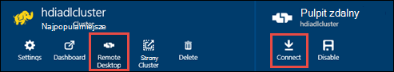

<properties
   pageTitle="Tworzenie klastrów HDInsight z magazynu Lake danych Azure za pomocą Menedżera zasobów szablony | Microsoft Azure"
   description="Tworzenie i używanie klastrów HDInsight z magazynu Lake Azure danych przy użyciu szablonów Azure Menedżera zasobów"
   services="data-lake-store,hdinsight"
   documentationCenter=""
   authors="nitinme"
   manager="jhubbard"
   editor="cgronlun"/>

<tags
   ms.service="data-lake-store"
   ms.devlang="na"
   ms.topic="article"
   ms.tgt_pltfrm="na"
   ms.workload="big-data"
   ms.date="10/21/2016"
   ms.author="nitinme"/>

# <a name="create-an-hdinsight-cluster-with-data-lake-store-using-azure-resource-manager-template"></a>Tworzenie klastrze HDInsight z magazynu Lake danych przy użyciu szablonu Azure Menedżera zasobów

> [AZURE.SELECTOR] - [Za pomocą portalu](data-lake-store-hdinsight-hadoop-use-portal.md) - [przy użyciu programu PowerShell](data-lake-store-hdinsight-hadoop-use-powershell.md) - [za pomocą Menedżera zasobów](data-lake-store-hdinsight-hadoop-use-resource-manager-template.md)

Dowiedz się, jak skonfigurować klaster HDInsight z dostępem do magazynu Lake Azure danych przy użyciu szablonu Azure Menedżera zasobów. Ważne informacje dotyczące tej wersji:

-   **Klastrów dla Spark (Linux) i klastrów Hadoop-Burza (Windows i Linux)**, magazynu Lake danych można używać tylko jako konto dodatkowego miejsca do magazynowania. Domyślne konto miejsca do magazynowania dla klastrów takie będą nadal Azure magazyn obiektów blob (WASB).

-   **HBase dla klastrów (Windows i Linux)**, magazynu Lake danych może służyć jako domyślnego miejsca do magazynowania lub dodatkowego miejsca do magazynowania.

> [AZURE.NOTE] Kilka ważnych uwag do noty.
>
> - Opcja tworzenia HDInsight klastrów z dostępem do magazynu Lake danych jest dostępna tylko w przypadku wersji HDInsight 3,2 i 3.4 (w przypadku Hadoop, HBase i Burza klastrów na systemie Windows, a także Linux). Dla klastrów Spark w systemie Linux ta opcja jest dostępna na klastrów HDInsight 3.4.
>
> - Jak wcześniej wspomniano, magazynu Lake danych jest dostępna jako domyślnego miejsca do magazynowania dla niektórych typów klaster (HBase) i dodatkowego miejsca do magazynowania dla innych typów klaster (Hadoop, Spark Burza). Przy użyciu magazynu Lake danych przy użyciu konta dodatkowego miejsca do magazynowania nie ma wpływu na wydajność lub możliwość odczytu/zapisu do magazynu w grupie. Scenariusz z używania magazynu Lake danych jako dodatkowego miejsca do magazynowania związanych z klastrem pliki (na przykład dzienniki itp.) są zapisywane w do domyślnego magazynu (BLOB Azure), podczas przetwarzania danych mogą być przechowywane w konta magazynu Lake danych.
>

W tym artykule firma Microsoft obsługi administracyjnej klastrze Hadoop z magazynu Lake danych jako dodatkowego miejsca do magazynowania.

## <a name="prerequisites"></a>Wymagania wstępne

Przed rozpoczęciem tego samouczka, musisz mieć następujące czynności:

-   **Azure subskrypcji**. Zobacz [Azure pobrać bezpłatną wersję próbną](https://azure.microsoft.com/pricing/free-trial/).

-   **Azure PowerShell wersji 1.0 lub nowszej**. Dowiedz się, [jak zainstalować i skonfigurować Azure programu PowerShell](../powershell-install-configure.md).

- **Azure Active Directory usługi kapitału**. Kroki opisane w tym samouczku podano instrukcje dotyczące tworzenia wystawcy usługi w Azure AD. Jednak musisz być administratorem Azure AD, aby można było utworzyć wystawcy usługi. Jeśli jesteś administratorem Azure AD, możesz pominąć te wymagania wstępne i kontynuować samouczek.
    
    **Jeśli nie jesteś administratorem Azure AD**, nie można wykonać czynności wymagane do utworzenia wystawcy usługi. W takim przypadku administrator Azure AD należy najpierw utworzyć wystawcy usługi przed utworzeniem klastrze HDInsight z magazynu Lake danych. Ponadto wystawcy usługi należy utworzyć za pomocą certyfikatu, zgodnie z opisem w [Tworzenie głównej przy użyciu certyfikatu usługi](../resource-group-authenticate-service-principal.md#create-service-principal-with-certificate).

## <a name="create-an-hdinsight-cluster-with-azure-data-lake-store"></a>Tworzenie klastrze HDInsight z magazynu Lake danych Azure

Szablon Menedżera zasobów i wymagania wstępne dotyczące korzystania z szablonu, są dostępne na GitHub na [Rozmieszczanie klastrze HDInsight Linux z nowego sklepu Lake danych](https://github.com/Azure/azure-quickstart-templates/tree/master/201-hdinsight-datalake-store-azure-storage). Postępuj zgodnie z instrukcjami na to łącze, aby utworzyć klaster HDInsight z magazynu Lake Azure danych jako dodatkowego miejsca do magazynowania.

Instrukcje dotyczące łącze wymienionych powyżej wymagają programu PowerShell. Przed rozpoczęciem pracy z tych instrukcji, upewnij się, że Zaloguj się do swojego konta Azure. Z pulpitu Otwórz nowe okno programu PowerShell Azure, a następnie wprowadź następujące wstawki. Gdy zostanie wyświetlony monit, aby się zalogować, upewnij się, że możesz zalogować się jako jeden z admininistrators właścicielem subskrypcji:

```
# Log in to your Azure account
Login-AzureRmAccount

# List all the subscriptions associated to your account
Get-AzureRmSubscription

# Select a subscription
Set-AzureRmContext -SubscriptionId <subscription ID>
```

## <a name="upload-sample-data-to-the-azure-data-lake-store"></a>Przekazywanie przykładowych danych do magazynu Lake danych Azure

Szablon Menedżera zasobów tworzy nowe konto magazynu Lake danych i przypisuje klaster HDInsight. Przykładowe dane musi teraz przekazać do magazynu Lake danych. Musisz te dane w dalszej części samouczka, aby uruchomić zadania z klaster HDInsight uzyskać dostęp do danych w magazynie Lake danych. Aby uzyskać instrukcje na temat przekazywania danych zobacz [Przekazywanie pliku do sklepu Lake danych](data-lake-store-get-started-portal.md#uploaddata). Jeśli szukasz kilka przykładowych danych do przekazania zostanie wyświetlony folder **Pogotowie danych** z [Repozytorium cyfra Lake danych Azure](https://github.com/Azure/usql/tree/master/Examples/Samples/Data/AmbulanceData).

## <a name="set-relevant-acls-on-the-sample-data"></a>Ustaw odpowiednie ACL na przykładowych danych

Aby upewnić się, że dane przykładowe, przekazane są dostępne w grupie HDInsight, użytkownik musi upewnij się, że aplikacji Azure AD, która jest używana do ustalania tożsamości między HDInsight klaster i magazynu Lake danych ma dostęp do plików i folder, który próbujesz uzyskać dostęp. W tym celu należy wykonać następujące czynności.

1.  Znajdź nazwę aplikacji Azure AD, która jest skojarzony z klastrem HDInsight i magazynie Lake danych. Jednym ze sposobów odszukaj nazwę jest otwieranie karta klaster HDInsight utworzone za pomocą tego szablonu Menedżera zasobów, kliknij kartę **Tożsamość AAD klaster** i poszukaj wartość **Kapitału usługi nazwa wyświetlana**.

2.  Teraz zapewniają dostęp do tej aplikacji Azure AD na plik/folder, który ma do nich dostęp z klaster HDInsight. Aby ustawić prawo ACL plik/folder w magazynie Lake danych, zobacz [Zabezpieczanie danych w magazynie Lake danych](data-lake-store-secure-data.md#assign-users-or-security-group-as-acls-to-the-azure-data-lake-store-file-system).

## <a name="run-test-jobs-on-the-hdinsight-cluster-to-use-the-data-lake-store"></a>Uruchamianie zadania testowe w klastrze HDInsight w celu używania magazynu Lake danych

Po skonfigurowaniu klaster HDInsight można uruchamiać zadania test w klastrze, aby sprawdzić, czy klaster HDInsight dostęp do magazynu Lake danych. Aby to zrobić, możemy uruchomi zadanie gałęzi próbki, które tworzy tabelę przy użyciu przekazanego wcześniej do sklepu Lake danych przykładowych danych.

### <a name="for-a-linux-cluster"></a>Klaster Linux

W tej sekcji będą SSH w klastrze i uruchom przykładowa kwerenda gałęzi. System Windows nie udostępnia wbudowane klienta SSH. Firma Microsoft zaleca używanie **Kit**, który można pobrać z [http://www.chiark.greenend.org.uk/~sgtatham/putty/download.html](http://www.chiark.greenend.org.uk/~sgtatham/putty/download.html).

Aby uzyskać więcej informacji na temat korzystania z Kit Zobacz [Używanie SSH z systemem Linux Hadoop na HDInsight z systemu Windows ](../hdinsight/hdinsight-hadoop-linux-use-ssh-windows.md).

1.  Po połączeniu, uruchom polecenie gałęzi przy użyciu następującego polecenia:

    ```
    hive
    ```

2.  Za pomocą interfejsu wiersza polecenia, wprowadź poniższe instrukcje, aby utworzyć nową tabelę o nazwie **pojazdy** przy użyciu przykładowych danych w magazynie Lake danych:

    ```
    DROP TABLE vehicles;
    CREATE EXTERNAL TABLE vehicles (str string) LOCATION 'adl://<mydatalakestore>.azuredatalakestore.net:443/';
    SELECT * FROM vehicles LIMIT 10;
    ```

    Powinien zostać wyświetlony wynik podobny do następującego:

    ```
    1,1,2014-09-14 00:00:03,46.81006,-92.08174,51,S,1
    1,2,2014-09-14 00:00:06,46.81006,-92.08174,13,NE,1
    1,3,2014-09-14 00:00:09,46.81006,-92.08174,48,NE,1
    1,4,2014-09-14 00:00:12,46.81006,-92.08174,30,W,1
    1,5,2014-09-14 00:00:15,46.81006,-92.08174,47,S,1
    1,6,2014-09-14 00:00:18,46.81006,-92.08174,9,S,1
    1,7,2014-09-14 00:00:21,46.81006,-92.08174,53,N,1
    1,8,2014-09-14 00:00:24,46.81006,-92.08174,63,SW,1
    1,9,2014-09-14 00:00:27,46.81006,-92.08174,4,NE,1
    1,10,2014-09-14 00:00:30,46.81006,-92.08174,31,N,1
    ```

### <a name="for-a-windows-cluster"></a>Klaster systemu Windows

Aby uruchomić kwerendę gałęzi za pomocą następujące polecenia cmdlet. W tej kwerendzie możemy utworzyć tabelę z danych w magazynie Lake danych, a następnie uruchom kwerendę wybierającą na utworzonej tabeli.

```
$queryString = "DROP TABLE vehicles;" + "CREATE EXTERNAL TABLE vehicles (str string) LOCATION 'adl://$dataLakeStoreName.azuredatalakestore.net:443/';" + "SELECT * FROM vehicles LIMIT 10;"

$hiveJobDefinition = New-AzureRmHDInsightHiveJobDefinition -Query $queryString

$hiveJob = Start-AzureRmHDInsightJob -ResourceGroupName $resourceGroupName -ClusterName $clusterName -JobDefinition $hiveJobDefinition -ClusterCredential $httpCredentials

Wait-AzureRmHDInsightJob -ResourceGroupName $resourceGroupName -ClusterName $clusterName -JobId $hiveJob.JobId -ClusterCredential $httpCredentials
```

Ma to następujące wyniki. **ExitValue** 0 w wyniku kwerendy sugerowanie pomyślnie wykonano zadanie.

```
Cluster         : hdiadlcluster.
HttpEndpoint    : hdiadlcluster.azurehdinsight.net
State           : SUCCEEDED
JobId           : job_1445386885331_0012
ParentId        :
PercentComplete :
ExitValue       : 0
User            : admin
Callback        :
Completed       : done
```

Pobierz dane wyjściowe z zadania przy użyciu następującego polecenia cmdlet:

```
Get-AzureRmHDInsightJobOutput -ClusterName $clusterName -JobId $hiveJob.JobId -DefaultContainer $containerName -DefaultStorageAccountName $storageAccountName -DefaultStorageAccountKey $storageAccountKey -ClusterCredential $httpCredentials
```

Wynik zadania podobny do następującego:

```
1,1,2014-09-14 00:00:03,46.81006,-92.08174,51,S,1
1,2,2014-09-14 00:00:06,46.81006,-92.08174,13,NE,1
1,3,2014-09-14 00:00:09,46.81006,-92.08174,48,NE,1
1,4,2014-09-14 00:00:12,46.81006,-92.08174,30,W,1
1,5,2014-09-14 00:00:15,46.81006,-92.08174,47,S,1
1,6,2014-09-14 00:00:18,46.81006,-92.08174,9,S,1
1,7,2014-09-14 00:00:21,46.81006,-92.08174,53,N,1
1,8,2014-09-14 00:00:24,46.81006,-92.08174,63,SW,1
1,9,2014-09-14 00:00:27,46.81006,-92.08174,4,NE,1
1,10,2014-09-14 00:00:30,46.81006,-92.08174,31,N,1
```

## <a name="access-data-lake-store-using-hdfs-commands"></a>Magazyn Lake danych programu Access przy użyciu polecenia HDFS

Po skonfigurowaniu klaster HDInsight w celu używania magazynu Lake danych, możesz uzyskać dostępu do magazynu za pomocą poleceń powłoki HDFS.

### <a name="for-a-linux-cluster"></a>Klaster Linux

W tej sekcji można będzie SSH w klastrze i uruchomienie poleceń HDFS. System Windows nie udostępnia wbudowane klienta SSH. Firma Microsoft zaleca używanie **Kit**, który można pobrać z [http://www.chiark.greenend.org.uk/~sgtatham/putty/download.html](http://www.chiark.greenend.org.uk/~sgtatham/putty/download.html).

Aby uzyskać więcej informacji na temat korzystania z Kit Zobacz [Używanie SSH z systemem Linux Hadoop na HDInsight z systemu Windows ](../hdinsight/hdinsight-hadoop-linux-use-ssh-windows.md).

Po nawiązaniu połączenia użyj następującego polecenia system plików HDFS, aby wyświetlić listę plików w magazynie Lake danych.

```
hdfs dfs -ls adl://<Data Lake Store account name>.azuredatalakestore.net:443/
```

To powinien zawierać plik, który wcześniej przekazane do sklepu Lake danych.

```
15/09/17 21:41:15 INFO web.CaboWebHdfsFileSystem: Replacing original urlConnectionFactory with org.apache.hadoop.hdfs.web.URLConnectionFactory@21a728d6
Found 1 items
-rwxrwxrwx   0 NotSupportYet NotSupportYet     671388 2015-09-16 22:16 adl://mydatalakestore.azuredatalakestore.net:443/mynewfolder
```

Można również użyć `hdfs dfs -put` polecenie, aby przekazać pliki do magazynu Lake danych, a następnie użyj `hdfs dfs -ls` Aby sprawdzić, czy pliki zostały pomyślnie przekazane.

### <a name="for-a-windows-cluster"></a>Klaster systemu Windows

1.  Logowanie się do nowego [Azure Portal](https://portal.azure.com).

2.  Kliknij przycisk **Przeglądaj**, kliknij pozycję **klastrów HDInsight**, a następnie kliknij utworzony klaster HDInsight.

3.  W karta klaster kliknij **Pulpitu zdalnego**, a następnie w karta **Pulpitu zdalnego** , kliknij przycisk **Połącz**.

    

    Po wyświetleniu monitu wprowadź poświadczenia, podanych dla użytkownika na pulpicie zdalnym.

4.  W sesji zdalnej Uruchom program Windows PowerShell, a lista plików w magazynie Lake Azure danych przy użyciu poleceń systemu plików HDFS.

    ```
    hdfs dfs -ls adl://<Data Lake Store account name>.azuredatalakestore.net:443/
    ```

    To powinien zawierać plik, który wcześniej przekazane do sklepu Lake danych.

    ```
    15/09/17 21:41:15 INFO web.CaboWebHdfsFileSystem: Replacing original urlConnectionFactory with org.apache.hadoop.hdfs.web.URLConnectionFactory@21a728d6
    Found 1 items
    -rwxrwxrwx   0 NotSupportYet NotSupportYet     671388 2015-09-16 22:16 adl://mydatalakestore.azuredatalakestore.net:443/vehicle1_09142014.csv
    ```

    Można również użyć `hdfs dfs -put` polecenie, aby przekazać pliki do magazynu Lake danych, a następnie użyj `hdfs dfs -ls` Aby sprawdzić, czy pliki zostały pomyślnie przekazane.

## <a name="next-steps"></a>Następne kroki

-   [Skopiuj dane z obiektami blob miejsca do magazynowania Azure do magazynu Lake danych](data-lake-store-copy-data-wasb-distcp.md)
