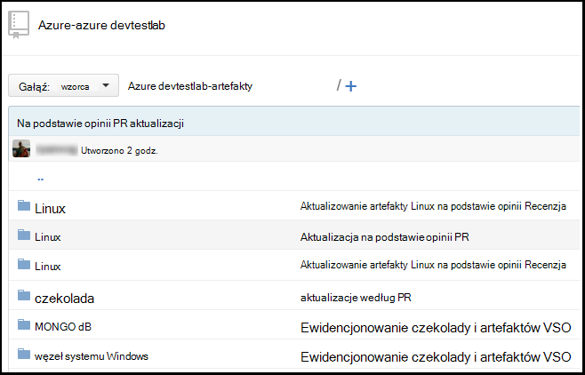
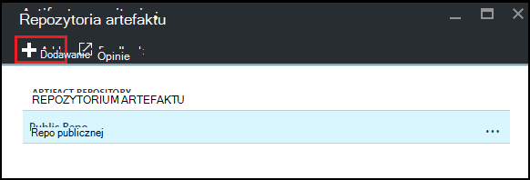
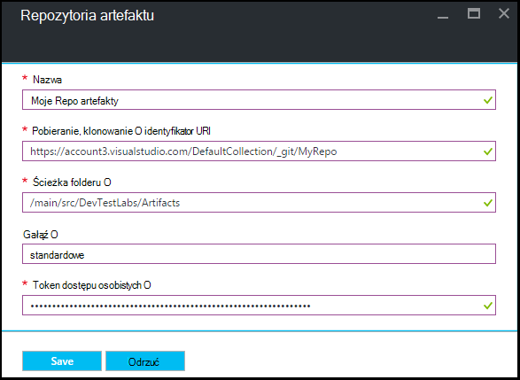

<properties
    pageTitle="Dodawanie repozytorium artefaktu cyfra do ćwiczenia w laboratoriach DevTest Azure | Microsoft Azure"
    description="Dodawanie repozytorium GitHub lub program Visual Studio zespołu usługi cyfra źródła niestandardowego artefaktów w laboratoriach DevTest Azure"
    services="devtest-lab,virtual-machines,visual-studio-online"
    documentationCenter="na"
    authors="tomarcher"
    manager="douge"
    editor=""/>

<tags
    ms.service="devtest-lab"
    ms.workload="na"
    ms.tgt_pltfrm="na"
    ms.devlang="na"
    ms.topic="article"
    ms.date="09/06/2016"
    ms.author="tarcher"/>

# Dodawanie repozytorium artefaktu cyfra do ćwiczenia w laboratoriach DevTest Azure

> [AZURE.VIDEO how-to-add-your-private-artifacts-repository-in-a-devtest-lab]

W Labs DevTest Azure artefakty są *Akcje* — takie jak instalowanie oprogramowania lub uruchomionego skrypty i polecenia — po utworzeniu maszyny. Domyślnie ćwiczenia zawiera artefakty z oficjalnym repozytorium artefaktu Azure DevTest Labs. Repozytorium artefaktu cyfra można dodać do swojej ćwiczenia do uwzględnienia artefaktów tworzonych przez zespół. Repozytorium można obsługiwać na [GitHub](https://github.com) lub [Program Visual Studio zespołu usługi (VSTS)](https://visualstudio.com).

- Aby dowiedzieć się, jak utworzyć repozytorium GitHub, zobacz [GitHub Bootcamp](https://help.github.com/categories/bootcamp/).
- Aby dowiedzieć się, jak utworzyć usług zespołu projektu przy użyciu repozytorium cyfra, zobacz [Łączenie z programu Visual Studio Team Services](https://www.visualstudio.com/get-started/setup/connect-to-visual-studio-online).

Na poniższym zrzucie ekranu przedstawiono przykład repozytorium zawierające artefakty może wyglądać w GitHub:  

## Uzyskiwanie informacji o repozytorium i poświadczenia

Aby dodać repozytorium artefaktu do swojego ćwiczenia, zostanie wyświetlony pewne informacje z repozytorium. Poniższe sekcje poprowadzą Cię wprowadzenie tych informacji dotyczących repozytoria artefaktu hostowana w GitHub i Visual Studio Team Services.

### Uzyskiwanie adresu URL klonowanie repozytorium GitHub i osobiste dostęp tokenu

Aby uzyskać klonowanie repozytorium GitHub adres URL i token dostępu osobistych, wykonaj następujące czynności:

1. Przejdź do strony głównej repozytorium GitHub, który zawiera definicje artefaktu.

1. Zaznacz **klonowanie lub plik do pobrania**.

1. Wybierz przycisk, aby skopiować **HTTPS klonowanie adres url** do Schowka, a następnie Zapisz adres URL do późniejszego użycia.

1. Zaznacz obraz profilu w prawym górnym rogu GitHub, a następnie wybierz pozycję **Ustawienia**.

1. W menu **Ustawienia osobiste** po lewej stronie wybierz pozycję **tokeny dostępu osobistych**.

1. Wybierz pozycję **Generuj nowy token**.

1. Na stronie **Nowy token dostępu osobistych** wprowadź **Opis Token**, zaakceptuj domyślne ustawienia **Wybierz zakresy**, a następnie wybierz **Wygenerować tokenu**.

1. Zapisz wygenerowane token, jak była potrzebna później.

1. Teraz możesz zamknąć GitHub.   

1. Przejdź do sekcji [Połącz z ćwiczenia do repozytorium artefaktu](#connect-your-lab-to-the-artifact-repository) .

### Uzyskiwanie adresu URL klonowanie repozytorium programu Visual Studio Team Services i dostępu do osobistego tokenu

Aby uzyskać adres URL klonowanie repozytorium programu Visual Studio Team Services i token dostępu osobistych, wykonaj następujące czynności:

1. Otwórz stronę główną zbioru zespołu (na przykład `https://contoso-web-team.visualstudio.com`), a następnie wybierz pozycję projektu artefaktu.

1. Na stronie głównej programu project wybierz **Kod**.

1. Aby wyświetlić adres URL klonowanie na stronie **Kod** projektu, wybierz pozycję **klonowanie**.

1. Zapisywanie adresu URL potrzebną w dalszej części tego samouczka.

1. Aby utworzyć osobistych Token dostępu, wybierz **Mój profil** z menu rozwijanego konta użytkownika.

1. Na stronie informacje o profilu wybierz pozycję **Zabezpieczenia**.

1. Na karcie **Zabezpieczenia** wybierz pozycję **Dodaj**.

1. Na stronie **Tworzenie tokenu dostępu osobistych** :

    - Wprowadź **Opis** dla tokenu.
    - Z listy **Wygaśnie w** wybierz **180 dni** .
    - Wybierz **wszystkie dostępne konta** z listy **kont** .
    - Wybierz opcję **wszystkie zakresy** .
    - Wybierz pozycję **Utwórz Token**.

1. Po zakończeniu nowy token zostanie wyświetlona na liście **Osobistych tokeny dostępu** . Wybierz pozycję **Kopiuj Token**, a następnie zapisz token wartość do późniejszego użycia.

1. Przejdź do sekcji [Połącz z ćwiczenia do repozytorium artefaktu](#connect-your-lab-to-the-artifact-repository) .

##Nawiązywanie połączenia z ćwiczenia do repozytorium artefaktu

1. Zaloguj się do [portalu Azure](http://go.microsoft.com/fwlink/p/?LinkID=525040).

1. Wybierz pozycję **Więcej usług**, a następnie wybierz **DevTest Labs** z listy.

1. Na liście labs zaznacz odpowiednie ćwiczenia.   

1. Na karta ćwiczenia wybierz **konfiguracji**.

1. Na karta **konfiguracji** ćwiczenia wybierz **Repozytoria artefakty**.

1. Na karta **Repozytoria artefakty** wybierz **+ Dodaj**.

    
 
1. Na drugim karta **Repozytoria artefakty** określ następujące elementy:

    - **Nazwa** - wprowadź nazwę repozytorium.
    - **Adres Url klonowanie cyfra** — wprowadź adres URL klonowanie cyfra HTTPS, skopiowany wcześniej z GitHub lub program Visual Studio Team Services. 
    - **Ścieżka folderu** - wprowadź ścieżkę folderu względem klonowanie adres URL, który zawiera definicji artefaktu.
    - **Rozgałęzienie** — wprowadź gałąź, aby przejść do definicji artefaktu.
    - **Token dostępu osobiste** — wprowadź token dostępu osobistych uzyskany wcześniej z GitHub lub program Visual Studio Team Services. 
     
    

1. Wybierz przycisk **Zapisz**.

[AZURE.INCLUDE [devtest-lab-try-it-out](../../includes/devtest-lab-try-it-out.md)]

## Wpisów w blogu pokrewne
- [Jak rozwiązywać problemy z kończy się niepowodzeniem artefaktów w AzureDevTestLabs](http://www.visualstudiogeeks.com/blog/DevOps/How-to-troubleshoot-failing-artifacts-in-AzureDevTestLabs)
- [Dołączanie do maszyny do istniejącej domeny AD przy użyciu szablonu ARM w Azure deweloperów testowym](http://www.visualstudiogeeks.com/blog/DevOps/Join-a-VM-to-existing-AD-domain-using-ARM-template-AzureDevTestLabs)