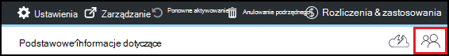

<properties
    pageTitle="Dodawanie właścicieli i użytkowników w Azure DevTest Labs | Microsoft Azure"
    description="Dodawanie właścicieli i użytkowników w Labs DevTest Azure za pomocą Azure portal lub programu PowerShell"
    services="devtest-lab,virtual-machines"
    documentationCenter="na"
    authors="tomarcher"
    manager="douge"
    editor=""/>

<tags
    ms.service="devtest-lab"
    ms.workload="na"
    ms.tgt_pltfrm="na"
    ms.devlang="na"
    ms.topic="article"
    ms.date="09/12/2016"
    ms.author="tarcher"/>

# Dodawanie właścicieli i użytkowników w Azure DevTest Labs

> [AZURE.VIDEO how-to-set-security-in-your-devtest-lab]

Dostęp w laboratoriach DevTest Azure steruje [Azure Role-Based kontroli dostępu (RBAC)](../active-directory/role-based-access-control-what-is.md). Przy użyciu RBAC, możesz można oddzielnie różnic obowiązków w obrębie organizacji do *ról* w miejsce, w którym udzielić tylko ilość niezbędne do użytkowników do wykonywania zadań w programie access. Są trzy role te RBAC *właściciela*, *DevTest Labs użytkownika*i *trybu współautora*. W tym artykule można dowiedzieć się, jakie czynności można wykonywać w każdej z trzech głównych ról RBAC. W tym miejscu możesz dowiedzieć się, jak dodawać użytkowników do ćwiczenia — zarówno za pośrednictwem portalu, jak i za pomocą skryptu programu PowerShell oraz jak dodawać użytkowników na poziomie subskrypcji.

## Akcje, które mogą być wykonywane w każdej roli

Istnieją trzy główne role, że można przypisać do użytkownika:

- Właściciel
- DevTest Labs użytkownika
- Trybu współautora

W poniższej tabeli przedstawiono akcje, które mogą być wykonywane przez użytkowników w każdej z tych ról:

| **Akcje użytkownicy w tej roli mogą wykonywać** | **DevTest Labs użytkownika**            | **Właściciel** | **Trybu współautora** |
|---|---|---|---|
| **Ćwiczenia zadania**                          |                              |       |             |
| Dodawanie użytkowników do ćwiczenia                     | Brak                           | Tak   | Brak          |
| Aktualizowanie ustawień koszt                   | Brak                           | Tak   | Tak         |
| **Maszyn wirtualnych podstawowych zadań**                      |                              |       |             |
| Dodawanie i usuwanie niestandardowych obrazów           | Brak                           | Tak   | Tak         |
| Dodawanie, aktualizowanie i usuwanie formuł       | Tak                          | Tak   | Tak         |
| Obrazy listy sprawdzonej Azure Marketplace     | Brak                           | Tak   | Tak         |
| **Zadania maszyn wirtualnych**                           |                              |       |             |
| Tworzenie maszyny wirtualne                             | Tak                          | Tak   | Tak         |
| Rozpocznij, Zatrzymaj i Usuń maszyny wirtualne            | Tylko maszyny wirtualne utworzone przez użytkownika | Tak   | Tak         |
| Aktualizowanie zasad maszyn wirtualnych                     | Brak                           | Tak   | Tak         |
| Dodawanie/usuwanie dyski danych z maszyny wirtualne      | Tylko maszyny wirtualne utworzone przez użytkownika | Tak   | Tak         |
| **Artefaktu zadania**                     |                              |       |             |
| Dodawanie i usuwanie repozytoria artefaktu   | Brak                           | Tak   | Tak         |
| Stosowanie artefakty                        | Tak                          | Tak   | Tak         |

> [AZURE.NOTE] Gdy użytkownik tworzy maszyny, tego użytkownika jest automatycznie przypisywany do roli **właściciela** utworzonego maszyn wirtualnych.

## Dodawanie właściciela lub użytkownika na poziomie ćwiczenia

Właściciele i użytkowników można dodać na poziomie ćwiczenia przez Azure portal. W tym użytkownikom zewnętrznym przy użyciu prawidłowego [konta Microsoft (MSA)](devtest-lab-faq.md#what-is-a-microsoft-account).
Poniższe czynności ułatwiają dodawanie właściciela lub użytkownika do ćwiczenia w laboratoriach DevTest Azure:

1. Zaloguj się do [portalu Azure](http://go.microsoft.com/fwlink/p/?LinkID=525040).

1. Wybierz pozycję **więcej usług**, a następnie wybierz **DevTest Labs** z listy.

1. Na liście labs zaznacz odpowiednie ćwiczenia.

1. Na karta ćwiczenia wybierz **konfiguracji**. 

1. Na karta **konfiguracji** wybierz **użytkowników**.

1. Na karta **użytkowników** wybierz pozycję **+ Dodaj**.

    

1. Na karta **Wybierz rolę,** wybierz odpowiednią rolę. W sekcji [Akcje, które mogą być wykonywane w każdej roli](#actions-that-can-be-performed-in-each-role) listy różne akcje, które mogą być wykonywane przez użytkowników w właściciela, DevTest użytkowników i ról współautorów.

1. Na karta **Dodawaj użytkowników** wprowadź adres e-mail lub nazwę użytkownika, którego chcesz dodać do roli określonej. Jeśli nie można odnaleźć użytkownika, komunikat o błędzie omówiono problem. Jeśli użytkownik zostanie znaleziony, ten użytkownik jest na liście i wybrać. 

1. Wybierz pozycję **Wybierz**.

1. Wybierz **przycisk OK** , aby zamknąć karta **Dodaj dostęp** .

1. Po powrocie do karta **użytkowników** , użytkownik został dodany.  

## Dodawanie użytkowników zewnętrznych do ćwiczenia przy użyciu programu PowerShell

Oprócz dodawania użytkowników w portalu Azure, możesz dodać użytkownika zewnętrznego do swojego ćwiczenia za pomocą skryptu programu PowerShell. W poniższym przykładzie po prostu zmodyfikuj wartości parametru pod komentarzem **wartości w celu zmiany** .
Można podjąć `subscriptionId`, `labResourceGroup`, i `labName` wartości z karta ćwiczenia w portalu Azure.

> [AZURE.NOTE]
> Przykładowy skrypt założono, że dany użytkownik został dodany jako gość w usłudze Active Directory i zakończy się niepowodzeniem, jeśli nie jest to wielkość liter. Aby dodać użytkownika do ćwiczenia nie w usłudze Active Directory, umożliwia przypisywanie użytkowników do roli, jak pokazano w sekcji [Dodawanie właściciela lub użytkownika na poziomie ćwiczenia](#add-an-owner-or-user-at-the-lab-level)Azure portal.   

    # Add an external user in DevTest Labs user role to a lab
    # Ensure that guest users can be added to the Azure Active directory:
    # https://azure.microsoft.com/en-us/documentation/articles/active-directory-create-users/#set-guest-user-access-policies

    # Values to change
    $subscriptionId = "<Enter Azure subscription ID here>"
    $labResourceGroup = "<Enter lab's resource name here>"
    $labName = "<Enter lab name here>"
    $userDisplayName = "<Enter user's display name here>"

    # Log into your Azure account
    Login-AzureRmAccount
    
    # Select the Azure subscription that contains the lab. 
    # This step is optional if you have only one subscription.
    Select-AzureRmSubscription -SubscriptionId $subscriptionId
    
    # Retrieve the user object
    $adObject = Get-AzureRmADUser -SearchString $userDisplayName
    
    # Create the role assignment. 
    $labId = ('subscriptions/' + $subscriptionId + '/resourceGroups/' + $labResourceGroup + '/providers/Microsoft.DevTestLab/labs/' + $labName)
    New-AzureRmRoleAssignment -ObjectId $adObject.Id -RoleDefinitionName 'DevTest Labs User' -Scope $labId

## Dodawanie właściciela lub użytkownika na poziomie subskrypcji

Azure uprawnienia są propagowane z zakresu nadrzędnego do podrzędnego zakres Azure. W związku z tym właściciele subskrypcji usługi Azure, która zawiera labs są automatycznie właścicieli tych labs. Są również właścicielami maszyny wirtualne i inne zasoby utworzone przez użytkowników ćwiczenia i usługa Azure DevTest Labs. 

Możesz dodać dodatkowe właścicieli do ćwiczenia przez karta ćwiczenia w [Azure portal](http://go.microsoft.com/fwlink/p/?LinkID=525040). Zakres właściciela dodano administracji jest jednak wąskie więcej niż zakres właścicielem subskrypcji. Na przykład dodano właściciele nie ma pełny dostęp do niektórych zasobów, które są tworzone w subskrypcji przez usługę DevTest Labs. 

Aby dodać właściciela do subskrypcji usługi Azure, wykonaj następujące czynności:

1. Zaloguj się do [portalu Azure](http://go.microsoft.com/fwlink/p/?LinkID=525040).

1. Wybierz pozycję **Więcej usług**, a następnie z listy wybierz pozycję **Subskrypcje** .

1. Wybierz odpowiednie subskrypcję.

1. Wybierz ikonę **programu Access** . 

    

1. Na karta **użytkowników** wybierz pozycję **Dodaj**.

    

1. Na karta **Wybierz rolę** wybierz **właściciela**.

1. Na karta **Dodawaj użytkowników** wprowadź adres e-mail lub nazwę użytkownika, którego chcesz dodać jako właściciel. Jeśli nie można odnaleźć użytkownika, zostanie wyświetlony komunikat o błędzie z wyjaśnieniem, ten problem. Jeśli użytkownik zostanie znaleziony, tego użytkownika jest wyświetlana w polu tekstowym **użytkownika** .

1. Wybierz nazwę użytkownika znajduje.

1. Wybierz pozycję **Wybierz**.

1. Wybierz **przycisk OK** , aby zamknąć karta **Dodaj dostęp** .

1. Po powrocie do karta **użytkowników** , użytkownik został dodany jako właściciel. Ten użytkownik jest teraz właściciela labs, wszelkie utworzone na podstawie tej subskrypcji, a więc można wykonywać zadania właściciela. 

[AZURE.INCLUDE [devtest-lab-try-it-out](../../includes/devtest-lab-try-it-out.md)]
