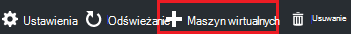
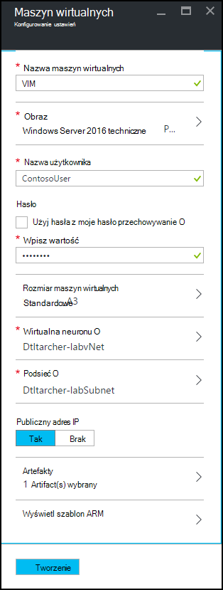
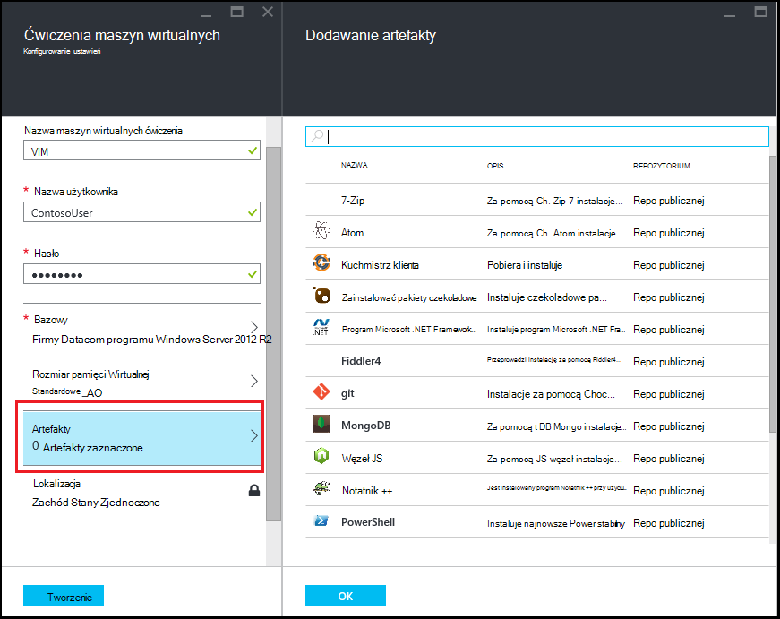
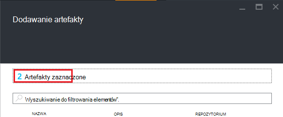

<properties
    pageTitle="Dodawanie maszyny z artefakty do ćwiczenia w laboratoriach DevTest Azure | Microsoft Azure"
    description="Dowiedz się, jak dodać maszyn wirtualnych z artefaktów w laboratoriach DevTest Azure"
    services="devtest-lab,virtual-machines"
    documentationCenter="na"
    authors="tomarcher"
    manager="douge"
    editor=""/>

<tags
    ms.service="devtest-lab"
    ms.workload="na"
    ms.tgt_pltfrm="na"
    ms.devlang="na"
    ms.topic="article"
    ms.date="08/30/2016"
    ms.author="tarcher"/>

# Dodawanie maszyny z artefakty do ćwiczenia w laboratoriach DevTest Azure

> [AZURE.VIDEO how-to-create-vms-with-artifacts-in-a-devtest-lab]

Do tworzenia maszyny ćwiczenia z *podstawowego* [obraz niestandardowy](./devtest-lab-create-template.md), [formułę](./devtest-lab-manage-formulas.md)lub [obraz Marketplace](./devtest-lab-configure-marketplace-images.md).

DevTest Labs *artefakty* pozwalają określić *Akcje* , które są wykonywane po utworzeniu maszyn wirtualnych. 

Akcje artefaktu mogą wykonywać procedury, takich jak uruchamianie skryptów programu Windows PowerShell: uruchamianie poleceń imprezie i instalowanie oprogramowania. 

Artefaktu *Parametry* umożliwiają dostosowywanie artefaktu dla określonego rozwiązania.

W tym artykule pokazano, jak utworzyć maszyny w swojej ćwiczenia z artefaktów.

## Dodawanie maszyny z artefaktów

1. Zaloguj się do [portalu Azure](http://go.microsoft.com/fwlink/p/?LinkID=525040).

1. Wybierz pozycję **Więcej usług**, a następnie wybierz **DevTest Labs** z listy.

1. Na liście labs zaznacz ćwiczenia, w której chcesz utworzyć maszyn wirtualnych.  

1. Na karta **Przegląd** ćwiczenia wybierz pozycję **+ maszyn wirtualnych**.  
    

1. Na karta **Wybierz przy podstawie** wybierz podstawę dla maszyn wirtualnych.

1. Na karta **maszyn wirtualnych** wprowadź nazwę dla nowej maszyny wirtualnej w polu tekstowym **Nazwa maszyn wirtualnych** .

    

1. Wprowadź **Nazwę użytkownika** , która zostanie udzielony uprawnień administratora na tym komputerze wirtualnych.  

1. Jeśli chcesz za pomocą hasła przechowywane w *tajny sklepu*wybierz opcję **Użyj hasła ze sklepem tajne**, a określenie wartości klucza, która odpowiada poufnych (hasło). W przeciwnym razie wystarczy wprowadzić hasło w polu tekstowym **Wpisz wartość**etykietą.
 
1. Wybierz **rozmiar maszyn wirtualnych** i wybierz jedną z wstępnie zdefiniowane elementy, które określić rdzenie procesora, rozmiar pamięci RAM i rozmiaru dysku twardego maszyn wirtualnych w celu utworzenia.

1. Wybierz **wirtualnej sieci** i wybierz żądany wirtualnej sieci.

1. Wybierz **podsieci** , a następnie wybierz pozycję podsieci.

1. Jeśli zasady ćwiczenia są ustawione umożliwia publicznych adresów IP dla wybranej podsieci, określ, czy adres IP ma być publiczny, wybierając pozycję **Tak** lub **nie**. W przeciwnym razie ta opcja jest wyłączona i wybrać jako **Brak**. 

1. Wybierz **artefakty** i — wybierz z listy artefaktów - i skonfiguruj artefaktów, które chcesz dodać do obrazu. 
**Uwaga:** Jeśli jesteś nowym użytkownikiem DevTest Labs lub konfigurowanie artefaktów, przejdź do sekcji [Dodaj istniejące struktura do maszyny](#add-an-existing-artifact-to-a-vm) , a następnie powróć tutaj po zakończeniu.

1. Jeśli chcesz wyświetlić lub skopiuj szablon Menedżera zasobów Azure, przejdź do sekcji [Menedżer zasobów Azure Zapisz szablon](#save-arm-template) i wrócić tutaj po zakończeniu.

1. Wybierz pozycję **Utwórz** , aby dodać określony maszyn wirtualnych do ćwiczenia.

1. Karta ćwiczenia jest wyświetlany stan tworzenia maszyn; najpierw jako **Tworzenie**, następnie jako **uruchomiony** po maszyn wirtualnych został uruchomiony.

1. Przejdź do sekcji [Następne kroki](#next-steps) . 

## Dodawanie istniejącego struktura do maszyn wirtualnych

Podczas tworzenia maszyny, możesz dodać istniejące artefakty. Każdy ćwiczenia zawiera artefakty z publicznej DevTest Labs artefaktu repozytorium, a także artefaktów, które zostały utworzone i dodane do repozytorium artefaktu.
Aby odkryć, jak utworzyć artefakty, zapoznaj się z artykułem [Dowiedz się, jak tworzyć własne artefakty do użytku z DevTest Labs](devtest-lab-artifact-author.md).

1. Na karta **maszyn wirtualnych** wybierz **artefakty**. 

1. Na karta **artefakty Dodaj** wybierz żądane artefaktu.  

    

1. Wprowadź wartości parametrów wymaganych i opcjonalnych parametrów, które są potrzebne.  

1. Wybierz pozycję **Dodaj** , aby dodać artefaktu i powrócić do karta **Dodawanie artefakty** .

1. Kontynuuj dodawanie artefakty, stosownie do potrzeb dla swojego maszyn wirtualnych.

1. Po dodaniu swojej artefakty, możesz [zmienić kolejność uruchamiania artefaktów](#change-the-order-in-which-artifacts-are-run). Możesz również przejść wstecz do [wyświetlania lub modyfikowania struktura](#view-or-modify-an-artifact).

## Zmienianie kolejności, w której są uruchamiane artefakty

Domyślnie akcje artefaktów są wykonywane w kolejności, w której są one dodawane do maszyn wirtualnych. Poniższe kroki pokazują jak zmienić kolejność uruchamiania artefaktów.

1. W górnej części karta **Dodawanie artefakty** wybierz łącze, wskazująca liczbę artefaktów, które zostały dodane do maszyn wirtualnych.

    

1. Aby określić kolejność uruchamiania artefaktów, przeciągnij i upuść artefaktów w odpowiedniej kolejności. **Uwaga:** Jeśli masz problemy z przeciągając artefaktu, upewnij się, że jest przeciągany z lewej strony artefaktu. 

1. Wybierz przycisk **OK** po zakończeniu.  

## Wyświetlanie i modyfikowanie struktura

Poniższe kroki pokazują jak wyświetlić lub zmodyfikować parametry struktura:

1. W górnej części karta **Dodawanie artefakty** wybierz łącze, wskazująca liczbę artefaktów, które zostały dodane do maszyn wirtualnych.

    

1. Na karta **Zaznaczone artefakty** wybierz artefaktu, który chcesz wyświetlić lub edytować.  

1. Na karta **Dodawanie artefaktu** wprowadź wszelkie potrzebne zmiany i wybierz **przycisk OK** , aby zamknąć karta **Dodawanie artefaktu** .

1. Wybierz **przycisk OK** , aby zamknąć karta **Artefakty zaznaczone** .

## Zapisywanie szablonu Azure Menedżera zasobów

Szablon programu Menedżer zasobów Azure umożliwia deklaracyjnych Definiowanie powtarzalnych wdrożenia. Poniższe kroki wyjaśniono, jak zapisać szablon Azure Menedżera zasobów dla maszyn wirtualnych, tworzenia.
Po zapisaniu służy szablon Menedżera zasobów Azure, aby [wdrożyć nowe maszyny wirtualne przy użyciu programu PowerShell Azure](../azure-resource-manager/resource-group-overview.md#template-deployment).

1. Na karta **maszyn wirtualnych** wybierz **Szablon ARM widok**.

1. Na **Karta Wyświetl Azure Menedżera zasobów szablon**zaznacz tekst, szablon.

1. Kopiowanie zaznaczonego tekstu do Schowka.

1. Wybierz **przycisk OK** , aby zamknąć **Karta Wyświetl Azure Menedżera zasobów szablon**.

1. Otwórz Edytor tekstu.

1. Wklej tekst szablon ze Schowka.

1. Zapisz plik w celu późniejszego użycia.

[AZURE.INCLUDE [devtest-lab-try-it-out](../../includes/devtest-lab-try-it-out.md)]

## Następne kroki

- Po utworzeniu maszyn wirtualnych można nawiązać maszyn wirtualnych, wybierając pozycję **Połącz** na karta maszyn wirtualnych.
- Dowiedz się, jak [tworzyć niestandardowe artefaktów dla maszyn wirtualnych usługi DevTest Labs](devtest-lab-artifact-author.md).
- Eksplorowanie w [galerii szablonów Szybki Start ARM Labs DevTest](https://github.com/Azure/azure-devtestlab/tree/master/ARMTemplates)