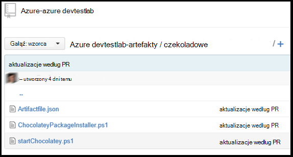

<properties 
    pageTitle="Tworzenie niestandardowego artefaktów dla maszyn wirtualnych usługi DevTest Labs | Microsoft Azure"
    description="Dowiedz się, jak tworzyć własne artefakty do użytku z DevTest Labs"
    services="devtest-lab,virtual-machines"
    documentationCenter="na"
    authors="tomarcher"
    manager="douge"
    editor=""/>

<tags
    ms.service="devtest-lab"
    ms.workload="na"
    ms.tgt_pltfrm="na"
    ms.devlang="na"
    ms.topic="article"
    ms.date="08/25/2016"
    ms.author="tarcher"/>

#Tworzenie niestandardowego artefaktów dla maszyn wirtualnych usługi DevTest Labs

> [AZURE.VIDEO how-to-author-custom-artifacts] 

## Omówienie
**Artefakty** są używane do wdrażania i konfigurowania aplikacji, po maszyny jest obsługi administracyjnej. Struktura składa się z pliku definicji artefaktu i inne pliki skryptów, które są przechowywane w folderze w repozytorium cyfra. Pliki definicji artefaktu składają się z JSON i wyrażeń, których można określić, co chcesz zainstalować na maszyny. Na przykład można zdefiniować nazwę artefaktu, polecenia i parametry, które są dostępne po uruchomieniu polecenia. Można używać odwołań do innych plików skryptów w pliku definicji artefaktu według nazwy.

##Format pliku definicji artefaktu
W poniższym przykładzie pokazano sekcje, które tworzą podstawowa struktura pliku definicji.

    {
      "$schema": "https://raw.githubusercontent.com/Azure/azure-devtestlab/master/schemas/2015-01-01/dtlArtifacts.json",
      "title": "",
      "description": "",
      "iconUri": "",
      "targetOsType": "",
      "parameters": {
        "<parameterName>": {
          "type": "",
          "displayName": "",
          "description": ""
        }
      },
      "runCommand": {
        "commandToExecute": ""
      }
    }

| Nazwa elementu | Wymagane? | Opis
| ------------ | --------- | -----------
| $schema      | Brak        | Lokalizacja pliku schematu JSON, który ułatwia testowanie poprawności pliku definicji.
| Tytuł        | Tak       | Nazwa artefaktu wyświetlane w ćwiczenia.
| Opis  | Tak       | Opis artefaktu wyświetlane w ćwiczenia.
| iconUri      | Brak        | Identyfikator URI ikona wyświetlana w ćwiczenia.
| targetOsType | Tak       | System operacyjny maszyn wirtualnych, zainstalowanym artefaktu. Opcje obsługiwane są: Windows i Linux.
| Parametry   | Brak        | Wartości, które znajdują się po uruchomieniu polecenia Zainstaluj artefaktu na komputerze. Dzięki temu dostosowywania swojego artefaktu.
| UruchomPolecenie (RunCommand)   | Tak       | W celu zainstalowania artefaktu polecenie, które jest wykonywane na maszyny.

###Parametry artefaktu

W sekcji Parametry pliku definicji należy określić wartości, które użytkownik może wprowadzić podczas instalowania Struktura. Możesz znaleźć te wartości w poleceniu artefaktu instalacji.

Definiowanie parametrów będzie następującą strukturę.

    "parameters": {
        "<parameterName>": {
          "type": "<type-of-parameter-value>",
          "displayName": "<display-name-of-parameter>",
          "description": "<description-of-parameter>"
        }
      }

| Nazwa elementu | Wymagane? | Opis
| ------------ | --------- | -----------
| Typ         | Tak       | Typ wartości parametru. Zobacz listę poniżej dla dozwolonych typów:
| displayName tak       | Nazwa parametru jest wyświetlane użytkownikowi w ćwiczenia.
| Opis  | Tak       | Opis parametr, który jest wyświetlany w ćwiczenia.

Dozwolone typy to:

- ciąg — dowolne prawidłowe JSON
- int — dowolną prawidłową liczbą całkowitą JSON
- wartość logiczna — dowolne prawidłowe JSON logiczna
- Macierz — prawidłowych tablicy JSON

##Funkcje i wyrażeń artefaktu

Można użyć wyrażeń i funkcji, aby utworzyć artefaktu Zainstaluj polecenia.
Wyrażenia są ujęte w nawiasy ([i]) i są obliczane po zainstalowaniu artefaktu. Wyrażenia mogą występować w dowolnym miejscu wartość ciągu JSON i zawsze zwraca inną wartość JSON. Jeśli należy użyć literałów ciąg, który zaczyna się od nawias kwadratowy [, należy użyć dwóch nawiasy kwadratowe [[.
Zazwyczaj umożliwia wyrażenia z funkcjami skonstruowania wartości. Podobnie jak w JavaScript, funkcja połączeń zostały sformatowane jako functionName(arg1,arg2,arg3)

Poniższa lista zawiera typowe funkcje.

- parameters(parameterName) - zwraca wartość parametru, która znajduje się po uruchomieniu polecenia artefaktu.
- "concat" (argument1, argument2, arg3,...) - łączy wiele wartości ciągu. Ta funkcja może być dowolna liczba argumentów.

W poniższym przykładzie pokazano, jak za pomocą wyrażeń i funkcji skonstruowania wartości.

    runCommand": {
         "commandToExecute": "[concat('powershell.exe -File startChocolatey.ps1'
    , ' -RawPackagesList ', parameters('packages')
    , ' -Username ', parameters('installUsername')
    , ' -Password ', parameters('installPassword'))]"
    }

##Tworzenie niestandardowego artefaktu

Utwórz usługi artefakt niestandardowe, wykonując następujące czynności:

1. Instalowanie edytora JSON — konieczne będzie Edytor JSON, aby pracować z plikami definicji artefaktu. Zalecamy używanie [Kod Visual Studio](https://code.visualstudio.com/), która jest dostępna dla systemu Windows i Linux oraz OS X.

1. Uzyskiwanie artifactfile.json próbki — wyewidencjonowanie artefakty utworzone przez zespół Azure DevTest Labs w naszym [repozytorium GitHub](https://github.com/Azure/azure-devtestlab) miejsce, w którym został utworzony sformatowanego biblioteki artefaktów, która ułatwi tworzenie własnych artefakty. Pobierz plik definicji artefaktu i wprowadzanie zmian w go, aby utworzyć własny artefakty.

1. Upewnij się, użyj funkcji IntelliSense — dźwigni IntelliSense, aby wyświetlić prawidłową elementy, które można utworzyć plik definicji artefaktu. Można również Zobacz różne opcje dla wartości elementu. Na przykład IntelliSense pokazano jeden z dwóch sposobów systemu Windows i Linux oraz podczas edytowania elementu **targetOsType** .

1. Magazyn artefaktu w repozytorium cyfra
    1. Tworzenie osobnych katalogów dla każdego artefaktu miejsce, w którym nazwa katalogu jest taka sama jak nazwa artefaktu.
    1. Plik definicji artefaktu (artifactfile.json) należy przechowywać w katalogu, który został utworzony.
    1. Przechowywanie skryptów, które pochodzą z polecenia instalacji artefaktu.

    Poniżej przedstawiono przykładowy wygląd folderu artefaktu:

    

1. Dodawanie repozytorium artefakty do ćwiczenia — zapoznaj się z artykułem, [Dodaj repozytorium artefaktu cyfra do ćwiczenia](devtest-lab-add-artifact-repo.md).

[AZURE.INCLUDE [devtest-lab-try-it-out](../../includes/devtest-lab-try-it-out.md)]

## Wpisów w blogu pokrewne
- [Jak rozwiązywać problemy z kończy się niepowodzeniem artefaktów w AzureDevTestLabs](http://www.visualstudiogeeks.com/blog/DevOps/How-to-troubleshoot-failing-artifacts-in-AzureDevTestLabs)
- [Dołączanie do maszyny do istniejącej domeny AD przy użyciu szablonu ARM w Azure deweloperów testowym](http://www.visualstudiogeeks.com/blog/DevOps/Join-a-VM-to-existing-AD-domain-using-ARM-template-AzureDevTestLabs)

## Następne kroki

- Dowiedz się, jak [dodać repozytorium artefaktu cyfra do ćwiczenia](devtest-lab-add-artifact-repo.md).
