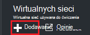
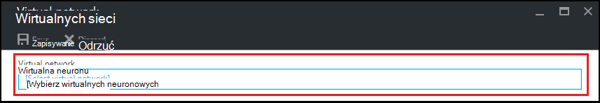
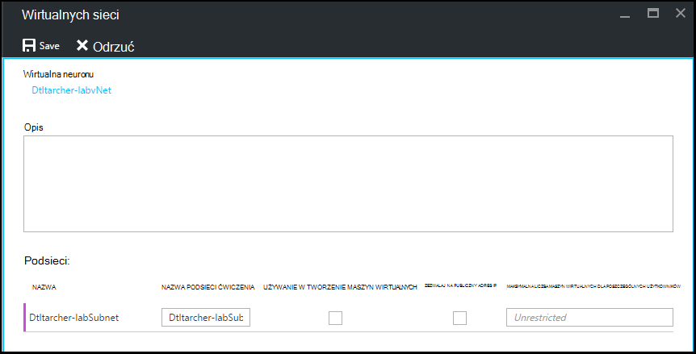

<properties
    pageTitle="Konfigurowanie sieci wirtualnej w Azure DevTest Labs | Microsoft Azure"
    description="Dowiedz się, jak skonfigurować istniejące wirtualnej sieci i podsieci i używanie ich w maszyn wirtualnych z Azure DevTest Labs"
    services="devtest-lab,virtual-machines"
    documentationCenter="na"
    authors="tomarcher"
    manager="douge"
    editor=""/>

<tags
    ms.service="devtest-lab"
    ms.workload="na"
    ms.tgt_pltfrm="na"
    ms.devlang="na"
    ms.topic="article"
    ms.date="09/06/2016"
    ms.author="tarcher"/>

# Konfigurowanie sieci wirtualnej w Azure DevTest Labs

Zgodnie z opisem w artykule [Dodawanie maszyny z artefaktów na ćwiczenia](devtest-lab-add-vm-with-artifacts.md), podczas tworzenia maszyn wirtualnych w ćwiczenia można określić skonfigurowaną wirtualną sieć. Jeden scenariusz w ten sposób to, czy jest potrzebny dostęp do zasobów corpnet z Twojej maszyny wirtualne za pomocą wirtualnej sieci, który skonfigurowano VPN witryny do witryny lub ExpressRoute. Poniżej przedstawiono Dodawanie istniejącej sieci wirtualnego do ustawienia wirtualnej sieci ćwiczenia, tak aby była należy wybierać podczas tworzenia maszyny wirtualne.

## Konfigurowanie sieci wirtualnego do ćwiczenia, za pomocą portalu Azure
Następujące czynności przeprowadził Cię przez proces dodawania istniejących wirtualną sieć (i podsieci) ćwiczenia tak, aby można używać podczas tworzenia maszyn wirtualnych w tym samym ćwiczenia. 

1. Zaloguj się do [portalu Azure](http://go.microsoft.com/fwlink/p/?LinkID=525040).

1. Wybierz pozycję **Więcej usług**, a następnie wybierz **DevTest Labs** z listy.

1. Na liście labs zaznacz odpowiednie ćwiczenia. 

1. Na karta ćwiczenia wybierz **konfiguracji**.

1. Na karta **konfiguracji** ćwiczenia wybierz **wirtualne sieci**.

1. Na karta **wirtualne sieci** zostanie wyświetlona lista wirtualnych sieci skonfigurowane dla bieżącego ćwiczenia, a także wirtualnej sieci domyślne utworzonego dla swojego ćwiczenia. 

1. Wybierz pozycję **+ Add**.

    
    
1. Na karta **wirtualnej sieci** wybierz **[wybierz wirtualną sieć]**.

    
    
1. Na karta **Wybierz wirtualną sieć** wybierz żądane wirtualnej sieci. Karta zawiera wszystkie wirtualnych sieci, które znajdują się w tym samym regionie subskrypcji jako ćwiczenia.  

1. Po wybraniu wirtualnej sieci, są zwracane do karta **wirtualnej sieci** i kilka pól są włączone.  

    

1. Podaj opis wirtualnych sieci i kombinacji ćwiczenia.

1. Aby umożliwić podsieć do użycia w ćwiczenia tworzenia maszyn wirtualnych, wybierz pozycję **Tworzenie maszyn wirtualnych w użyciu**.

1. Aby umożliwić publicznych adresów IP w podsieci, wybierz pozycję **Zezwalaj na PUBLICZNY adres IP**.

1. W polu **Maksymalna liczba maszyn wirtualnych na użytkownika** określić maksymalny maszyny wirtualne dla poszczególnych użytkowników dla każdej podsieci. Jeśli chcesz nieograniczony liczbę maszyny wirtualne, pozostaw to pole puste.

1. Wybierz przycisk **Zapisz**.

1. Teraz, gdy skonfigurowano wirtualnej sieci, można wybrać, podczas tworzenia maszyn wirtualnych. Aby zobaczyć, jak tworzyć maszyny i określ wirtualnej sieci, zapoznaj się z artykułem, [Dodaj maszyn wirtualnych z artefaktów na ćwiczenia](devtest-lab-add-vm-with-artifacts.md). 

[AZURE.INCLUDE [devtest-lab-try-it-out](../../includes/devtest-lab-try-it-out.md)]

## Następne kroki

Po dodaniu odpowiedniej wirtualnej sieci do usługi ćwiczenia następnym krokiem jest [dodanie maszyn wirtualnych do swojego ćwiczenia](devtest-lab-add-vm-with-artifacts.md).