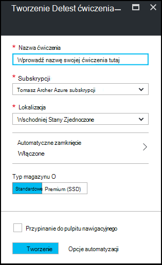

<properties
    pageTitle="Tworzenie ćwiczenia w Azure DevTest Labs | Microsoft Azure"
    description="Tworzenie ćwiczenia w Azure DevTest Labs dla maszyn wirtualnych"
    services="devtest-lab,virtual-machines"
    documentationCenter="na"
    authors="tomarcher"
    manager="douge"
    editor=""/>

<tags
    ms.service="devtest-lab"
    ms.workload="na"
    ms.tgt_pltfrm="na"
    ms.devlang="na"
    ms.topic="get-started-article"
    ms.date="09/12/2016"
    ms.author="tarcher"/>

# Tworzenie ćwiczenia w Azure DevTest Labs

## Wymagania wstępne

Aby utworzyć ćwiczenia, należy następująco:

- Subskrypcję usługi Azure. Aby zapoznać się z opcjami zakupu Azure, zobacz [jak kupić Azure](https://azure.microsoft.com/pricing/purchase-options/) lub [bezpłatną wersję próbną jednego miesiąca](https://azure.microsoft.com/pricing/free-trial/). Musi być właścicielem subskrypcji, aby utworzyć ćwiczenia.

## Procedura tworzenia ćwiczenia w Azure DevTest Labs

Poniższe kroki zilustrować sposób użycia Azure portal tworzenie ćwiczenia w Azure DevTest Labs. 

1. Zaloguj się do [portalu Azure](http://go.microsoft.com/fwlink/p/?LinkID=525040).

1. Wybierz pozycję **więcej usług**, a następnie wybierz **DevTest Labs** z listy.

1. Na karta **DevTest Labs** wybierz pozycję **Dodaj**.

    

1. Na karta **Tworzenie ćwiczenia DevTest** :

    1. Wprowadź **Nazwę ćwiczenia** dla nowych ćwiczenia.
    
    1. Wybierz **subskrypcję** , aby skojarzyć z ćwiczenia.
    
    1. Wybierz **lokalizację** , w którym chcesz przechowywać ćwiczenia.
    
    1. Wybierz pozycję **Automatyczne zamknięcie systemu** , aby określić, jeśli chcesz włączyć - i definiowanie parametrów-automatycznego wyłączania wszystkich ćwiczenia przez maszyny wirtualne.
    
    1. Wybierz **Typ magazynu** wskaż typ dysku miejsca do magazynowania dla maszyny wirtualne ćwiczenia. 
    
    1. Wybierz polecenie **Utwórz**.

    

[AZURE.INCLUDE [devtest-lab-try-it-out](../../includes/devtest-lab-try-it-out.md)]

## Następne kroki

Po utworzeniu usługi ćwiczenia, Oto niektóre następne kroki:

- [Bezpieczny dostęp do ćwiczenia](devtest-lab-add-devtest-user.md).

- [Ustawianie zasad ćwiczenia](devtest-lab-set-lab-policy.md).

- [Tworzenie szablonu ćwiczenia](devtest-lab-create-template.md).

- [Tworzenie niestandardowego artefaktów dla swojego maszyny wirtualne](devtest-lab-artifact-author.md).

- [Dodawanie maszyny z artefaktów na ćwiczenia](devtest-lab-add-vm-with-artifacts.md).