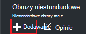
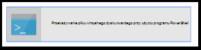
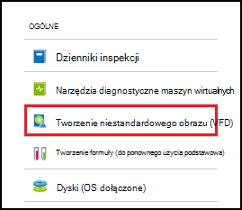
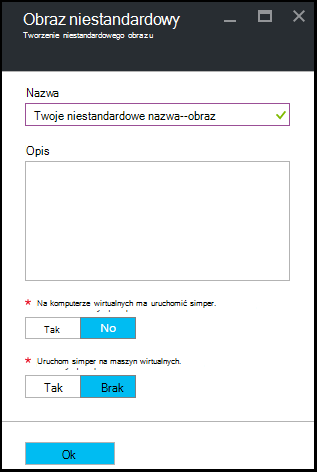

<properties
    pageTitle="Zarządzanie Azure DevTest Labs niestandardowych obrazów w celu utworzenia maszyny wirtualne | Microsoft Azure"
    description="Dowiedz się, jak utworzyć niestandardowy obraz z pliku wirtualnego dysku twardego lub z istniejących maszyn wirtualnych w laboratoriach DevTest Azure"
    services="devtest-lab,virtual-machines"
    documentationCenter="na"
    authors="tomarcher"
    manager="douge"
    editor=""/>

<tags
    ms.service="devtest-lab"
    ms.workload="na"
    ms.tgt_pltfrm="na"
    ms.devlang="na"
    ms.topic="article"
    ms.date="09/07/2016"
    ms.author="tarcher"/>

# Zarządzanie Azure DevTest Labs niestandardowych obrazów w celu utworzenia maszyny wirtualne

W laboratoriach DevTest Azure niestandardowych obrazów umożliwiają szybkie tworzenie maszyny wirtualne nie czekając oprogramowanie wymagane do zainstalowania na komputerze docelowym. Obrazy niestandardowe umożliwiają wstępnie instalować oprogramowania, które są potrzebne w pliku wirtualnego dysku twardego, a następnie użyj pliku wirtualnego dysku twardego Tworzenie maszyn wirtualnych. Ponieważ oprogramowania jest już zainstalowany, podczas tworzenia maszyn wirtualnych jest znacznie szybsze. Ponadto niestandardowe obrazy są używane do klonowanie maszyny wirtualne Tworzenie niestandardowego obrazu z maszyny, a następnie tworząc maszyny wirtualne z danego niestandardowego obrazu.

W tym artykule omówiono sposób:

- [Tworzenie niestandardowego obrazu z pliku wirtualnego dysku twardego](#create-a-custom-image-from-a-vhd-file) tak, aby maszyny następnie można utworzyć z danego niestandardowego obrazu. 
- [Tworzenie niestandardowego obrazu z maszyny](#create-a-custom-image-from-a-vm) dla szybkiego klonowanie maszyn wirtualnych.

## Tworzenie niestandardowego obrazu z pliku wirtualnego dysku twardego

W tej sekcji można Zobacz, jak utworzyć niestandardowy obraz z pliku wirtualnego dysku twardego.
Potrzebny jest dostęp do pliku wirtualnego dysku twardego wykonywanie wszystkich kroków w tej sekcji.   

1. Zaloguj się do [portalu Azure](http://go.microsoft.com/fwlink/p/?LinkID=525040).

1. Wybierz pozycję **więcej usług**, a następnie wybierz **DevTest Labs** z listy.

1. Na liście labs zaznacz odpowiednie ćwiczenia.  

1. Na karta ćwiczenia wybierz **konfiguracji**. 

1. Na ćwiczenia karta **konfiguracji** wybierz **niestandardowych obrazów**.

1. Na karta **niestandardowych obrazów** wybierz **+ obraz niestandardowy**.

    

1. Wpisz nazwę niestandardowego obrazu. Ta nazwa jest wyświetlana na liście obrazy podstawowe podczas tworzenia maszyn wirtualnych.

1. Wprowadź opis obrazu niestandardowego. Opis ten jest wyświetlany na liście obrazy podstawowe podczas tworzenia maszyn wirtualnych.

1. Wybierz **plik wirtualnego dysku twardego**.

1. Jeśli masz dostęp do pliku wirtualny dysk twardy, który nie znajduje się je dodać, postępując zgodnie z instrukcjami w sekcji [Przekazywanie pliku wirtualnego dysku twardego](#upload-a-vhd-file) i wrócić tutaj po zakończeniu.

1. Wybierz odpowiedni plik wirtualnego dysku twardego.

1. Wybierz **przycisk OK** , aby zamknąć karta **Plik wirtualnego dysku twardego** .

1. Wybierz pozycję **Konfiguracja systemu operacyjnego**.

1. Na karcie **Konfiguracja systemu operacyjnego** wybierz **systemu Windows** i **Linux oraz**.

1. Jeśli **systemu Windows** jest zaznaczone, określ przy użyciu pola wyboru czy *Sysprep* zostało uruchomione na komputerze.

1. Wybierz **przycisk OK** , aby zamknąć karta **Konfiguracji systemu operacyjnego** .

1. Wybierz **przycisk OK** , aby utworzyć obraz niestandardowy.

1. Przejdź do sekcji [Następne kroki](#next-steps) .

###Przekazywanie pliku wirtualnego dysku twardego

Aby dodać obraz niestandardowy, musisz mieć dostęp do pliku wirtualnego dysku twardego.

1. Na karta **Plik wirtualnego dysku twardego** wybierz **Przekazywanie pliku wirtualnego dysku twardego przy użyciu programu PowerShell**.

    

1. Karta następnego wyświetli instrukcje dotyczące modyfikowania i uruchamianie skryptu programu PowerShell przekazująca subskrypcji Azure pliku wirtualnego dysku twardego. 
**Uwaga:** Ten proces może być długiej w zależności od rozmiaru pliku wirtualnego dysku twardego i szybkości połączenia.

## Tworzenie niestandardowego obrazu z maszyny
Maszyn wirtualnych, który jest już skonfigurowany można utworzyć obraz niestandardowy z tym maszyn wirtualnych, a następnie tworzenie innych identyczne maszyny wirtualne przy użyciu niestandardowego obrazu. Poniższe kroki pokazują jak utworzyć obraz niestandardowy z maszyny:

1. Zaloguj się do [portalu Azure](http://go.microsoft.com/fwlink/p/?LinkID=525040).

1. Wybierz pozycję **więcej usług**, a następnie wybierz **DevTest Labs** z listy.

1. Na liście labs zaznacz odpowiednie ćwiczenia.  

1. Na karta ćwiczenia wybierz pozycję **Moje maszyn wirtualnych**.
 
1. Na karta **Moje maszyn wirtualnych** wybierz maszyn wirtualnych, z którego chcesz utworzyć obraz niestandardowy.

1. Na karta maszyn wirtualnych wybierz **Tworzenie niestandardowego obrazu (wirtualnego dysku twardego)**.

    

1. Na karta **Utwórz obraz** wprowadź nazwę i opis obraz niestandardowy. Te informacje są wyświetlane na liście podstawach podczas tworzenia maszyn wirtualnych.

    

1. Określ, czy sysprep zostało uruchomione na maszyn wirtualnych. Jeśli sysprep nie zostało uruchomione na maszyn wirtualnych, określ, czy sysprep było uruchamiane po maszyny został utworzony na podstawie ten obraz niestandardowy.

1. Wybierz przycisk **OK** po zakończeniu Tworzenie niestandardowego obrazu.

[AZURE.INCLUDE [devtest-lab-try-it-out](../../includes/devtest-lab-try-it-out.md)]

## Wpisów w blogu pokrewne

- [Niestandardowe obrazy lub formuł?](https://blogs.msdn.microsoft.com/devtestlab/2016/04/06/custom-images-or-formulas/)
- [Kopiowanie niestandardowych obrazów między Labs Azure DevTest](http://www.visualstudiogeeks.com/blog/DevOps/How-To-Move-CustomImages-VHD-Between-AzureDevTestLabs#copying-custom-images-between-azure-devtest-labs)

##Następne kroki

Po dodaniu obrazu niestandardowego do użytku podczas tworzenia maszyny następnym krokiem jest [dodanie maszyn wirtualnych do swojego ćwiczenia](./devtest-lab-add-vm-with-artifacts.md).