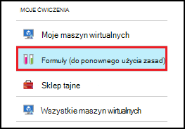
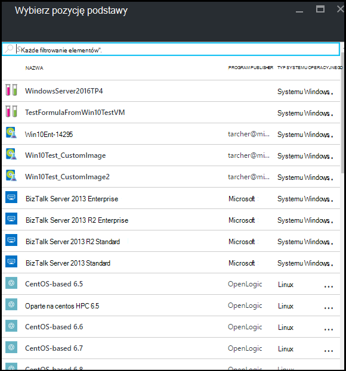
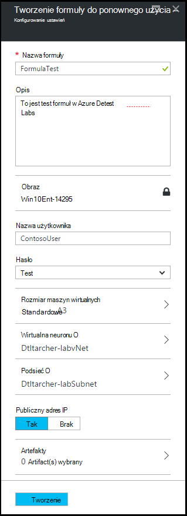
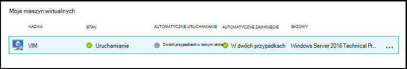
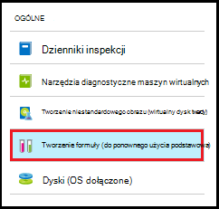
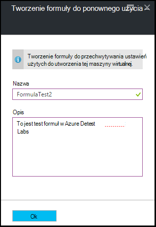
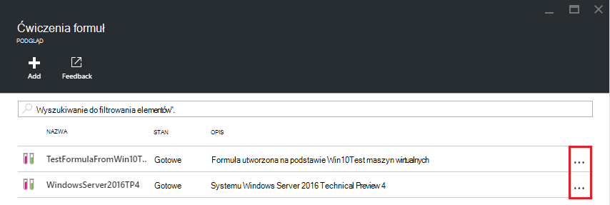
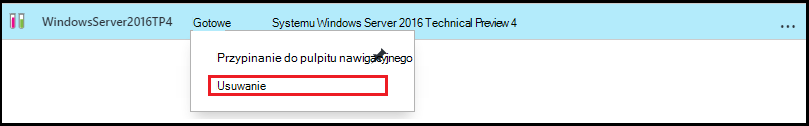

<properties
    pageTitle="Zarządzanie formuł w Labs DevTest Azure, aby utworzyć maszyny wirtualne | Microsoft Azure"
    description="Dowiedz się, jak tworzenie, aktualizowanie, usuwanie formuł Azure DevTest Labs i używać ich do tworzenia nowych maszyny wirtualne."
    services="devtest-lab,virtual-machines"
    documentationCenter="na"
    authors="tomarcher"
    manager="douge"
    editor=""/>

<tags
    ms.service="devtest-lab"
    ms.workload="na"
    ms.tgt_pltfrm="na"
    ms.devlang="na"
    ms.topic="article"
    ms.date="08/30/2016"
    ms.author="tarcher"/>

# Zarządzanie DevTest Labs formuły, aby utworzyć maszyny wirtualne

Formuła w laboratoriach DevTest Azure jest listę domyślnych wartości właściwości użyte do utworzenia maszyny wirtualnej (maszyn wirtualnych). Podczas tworzenia maszyny formuły, wartości domyślne mogą być używane jako- lub zmodyfikowany. Podobnie jak [niestandardowych obrazów](./devtest-lab-create-template.md) i [obrazy Marketplace](./devtest-lab-configure-marketplace-images.md)formuł umożliwiają szybkie inicjowania obsługi maszyn wirtualnych.  

W tym artykule dowiesz się, jak wykonywać następujące zadania:

- [Tworzenie formuły](#create-a-formula)
- [Inicjowanie obsługi maszyn wirtualnych za pomocą formuły](#use-a-formula-to-provision-a-vm)
- [Modyfikowanie formuły](#modify-a-formula)
- [Usuwanie formuły](#delete-a-formula)

> [AZURE.NOTE] Formuły — takie jak [obrazy niestandardowe](./devtest-lab-create-template.md) - umożliwiają tworzenie podstawowego obrazu z pliku wirtualnego dysku twardego. Następnie można obrazu do zapewniania obsługi nowych maszyn wirtualnych. Aby łatwej zdecydować, która jest odpowiednia dla danego środowiska, zapoznaj się z artykułem, [Opis niestandardowych obrazów i formuł w laboratoriach DevTest](./devtest-lab-comparing-vm-base-image-types.md).

## Tworzenie formuły
Każda osoba mająca uprawnienia DevTest Labs *użytkowników* jest można tworzyć przy użyciu formuły jako podstawy maszyny wirtualne. Istnieją dwa sposoby tworzenia formuł: 

- Na podstawie — należy użyć zdefiniowanie wszystkie formuły.
- Z istniejących ćwiczenia maszyn wirtualnych — gdy chcesz utworzyć formułę na podstawie ustawień istniejącego maszyn wirtualnych.

### Tworzenie formuły z podstawy
Poniższe czynności ułatwiają tworzenie formuły z obraz niestandardowy, obraz Marketplace lub inną formułę.

1. Zaloguj się do [portalu Azure](http://go.microsoft.com/fwlink/p/?LinkID=525040).

1. Wybierz pozycję **Więcej usług**, a następnie wybierz **DevTest Labs** z listy.

1. Na liście labs zaznacz odpowiednie ćwiczenia.  

1. Na karta ćwiczenia wybierz **formuł (do ponownego użycia zasad)**.

    

1. Na karta **formuły ćwiczenia** wybierz **+ Dodaj**.

    

1. Na karta **Wybierz przy podstawie** wybierz base (obraz niestandardowy, Marketplace obrazu lub formuły), z którego chcesz utworzyć formułę.

    

1. Na karta **Tworzenie formuły** określ następujące wartości:

    - **Nazwa formuły** - wprowadź nazwę formuły. Wartość ta pojawi się na liście obrazy podstawowe podczas tworzenia maszyn wirtualnych. Nazwa jest sprawdzany, wpisz go, a jeśli jest nieprawidłowy, wiadomości będzie wskazywać wymagań dotyczących prawidłową nazwę.
    - **Opis** — wpisz użyteczny opis formuły. Ta wartość jest dostępna z menu kontekstowego tej formuły, podczas tworzenia maszyn wirtualnych.
    - **Nazwa użytkownika** — wprowadź nazwę użytkownika, który zostanie udzielony uprawnienia administratora.
    - **Hasła** — wprowadź - lub wybierz z menu rozwijanego - wartość, która jest skojarzony z hasło, którego chcesz używać dla określonego użytkownika.  
    - **Obraz** — w tym polu Wyświetla nazwę wybranego obrazu na poprzedniej karta. 
    - **Rozmiar maszyn wirtualnych** — wybierz jedną z wstępnie zdefiniowane elementy, które określić rdzenie procesora, rozmiar pamięci RAM i rozmiaru dysku twardego maszyn wirtualnych w celu utworzenia.
    - **Wirtualna sieć** — określ odpowiednie wirtualnej sieci.
    - **Podsieć** - określ odpowiednie podsieci.
    - **Publiczny adres IP** — Jeśli zasady ćwiczenia są ustawione aby umożliwić publicznych adresów IP dla wybranej podsieci, określ, czy adres IP ma być publiczny, wybierając pozycję **Tak** lub **nie**. W przeciwnym razie ta opcja jest wyłączona i wybrać jako **Brak**.
    - **Artefakty** — wybierz i skonfiguruj artefaktów, które chcesz dodać do obrazu. Bezpieczny ciąg, który wartości nie są zapisywane z formułą. W związku z tym parametry artefaktu, które są ciągami bezpiecznego nie są wyświetlane. 

        

1. Wybierz pozycję **Utwórz** , aby utworzyć formułę.

### Tworzenie formuły z maszyny
Poniższe kroki pomagają tworzenia formuły oparte na istniejące maszyn wirtualnych. 

> [AZURE.NOTE] Aby utworzyć formułę z maszyny, maszyn wirtualnych utworzonych po 30 marca 2016. 

1. Zaloguj się do [portalu Azure](http://go.microsoft.com/fwlink/p/?LinkID=525040).

1. Wybierz pozycję **Więcej usług**, a następnie wybierz **DevTest Labs** z listy.

1. Na liście labs zaznacz odpowiednie ćwiczenia.  

1. Na karta **Przegląd** ćwiczenia wybierz maszyn wirtualnych, z którego chcesz utworzyć formułę.

    

1. Na karta maszyn wirtualnych wybierz **Tworzenie formuły (do ponownego użycia podstawowa)**.

    

1. Na karta **Tworzenie formuły** wprowadź **nazwę** i **Opis** dla nowej formuły.

    

1. Wybierz **przycisk OK** , aby utworzyć formułę.

## Inicjowanie obsługi maszyn wirtualnych za pomocą formuły
Po utworzeniu formuły, możesz utworzyć maszyny na podstawie tej formuły. Sekcję [Dodawanie maszyny z artefaktów](devtest-lab-add-vm-with-artifacts.md#add-a-vm-with-artifacts) przeprowadzi Cię przez proces.

## Modyfikowanie formuły
Aby zmodyfikować formułę, wykonaj następujące czynności:

1. Zaloguj się do [portalu Azure](http://go.microsoft.com/fwlink/p/?LinkID=525040).

1. Wybierz pozycję **Więcej usług**, a następnie wybierz **DevTest Labs** z listy.

1. Na liście labs zaznacz odpowiednie ćwiczenia.  

1. Na karta ćwiczenia wybierz **formuł (do ponownego użycia zasad)**.

    

1. Na karta **formuły ćwiczenia** zaznacz formułę, którą chcesz zmodyfikować.

1. Na karta **Aktualizuj formułę,** wprowadź żądane zmiany i wybierz pozycję **Update**.

## Usuwanie formuły 
Aby usunąć formułę, wykonaj następujące kroki:

1. Zaloguj się do [portalu Azure](http://go.microsoft.com/fwlink/p/?LinkID=525040).

1. Wybierz pozycję **Więcej usług**, a następnie wybierz **DevTest Labs** z listy.

1. Na liście labs zaznacz odpowiednie ćwiczenia.  

1. Na ćwiczenia karta **Ustawienia** wybierz **formuł**.

    

1. Na karta **formuły ćwiczenia** wybierz wielokropek po prawej stronie formułę, którą chcesz usunąć.

    

1. W menu kontekstowym tej formuły wybierz pozycję **Usuń**.

    

1. Wybierz pozycję **Tak** , aby okno dialogowe potwierdzenia usunięcia.

[AZURE.INCLUDE [devtest-lab-try-it-out](../../includes/devtest-lab-try-it-out.md)]

## Wpisów w blogu pokrewne

- [Niestandardowe obrazy lub formuł?](https://blogs.msdn.microsoft.com/devtestlab/2016/04/06/custom-images-or-formulas/)

## Następne kroki
Po utworzeniu formuły do użytku podczas tworzenia maszyny następnym krokiem jest [dodanie maszyn wirtualnych do swojego ćwiczenia](./devtest-lab-add-vm-with-artifacts.md).