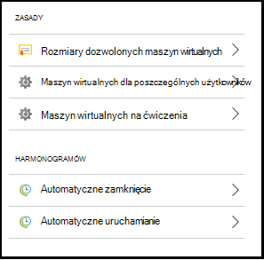
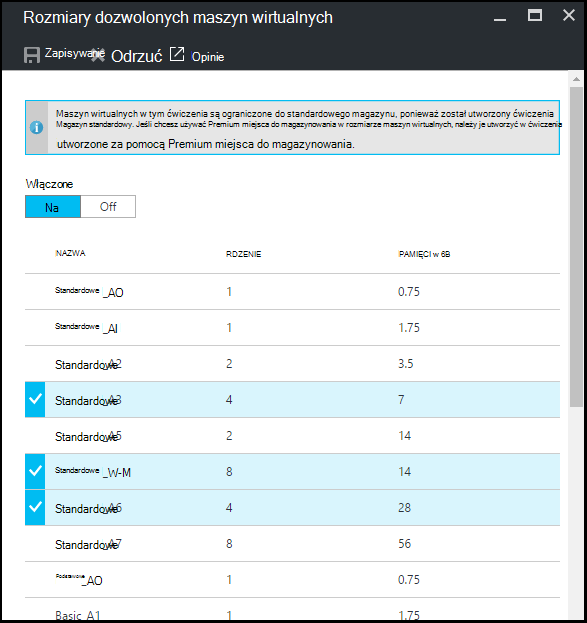
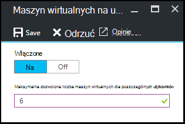
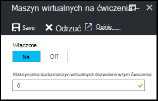
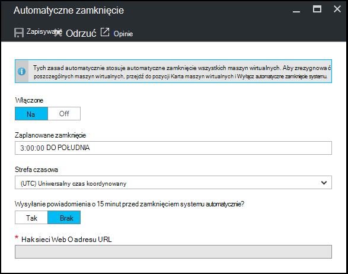
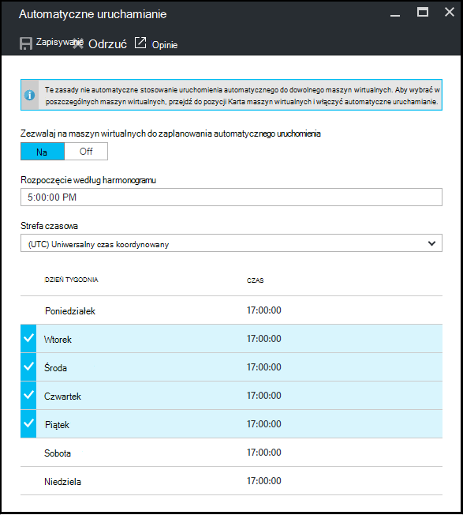

<properties
    pageTitle="Definiowanie zasad ćwiczenia w laboratoriach DevTest Azure | Microsoft Azure"
    description="Dowiedz się, jak zdefiniować zasady ćwiczenia, takich jak rozmiarów maszyn wirtualnych, maksymalna maszyny wirtualne na użytkownika i zamknięcie automatyzacji."
    services="devtest-lab,virtual-machines"
    documentationCenter="na"
    authors="tomarcher"
    manager="douge"
    editor=""/>

<tags
    ms.service="devtest-lab"
    ms.workload="na"
    ms.tgt_pltfrm="na"
    ms.devlang="na"
    ms.topic="article"
    ms.date="09/12/2016"
    ms.author="tarcher"/>

# Definiowanie zasad ćwiczenia w laboratoriach DevTest Azure

> [AZURE.VIDEO how-to-set-vm-policies-in-a-devtest-lab]

Azure DevTest Labs umożliwia określenie klucza zasady, które ułatwiają kontrolowanie kosztów i zminimalizować odpadów w swojej labs. Te zasady ćwiczenia obejmują maksymalna liczba maszyny wirtualne utworzone dla poszczególnych użytkowników lub ćwiczenia i różnych opcji Automatyczne zamknięcie systemu i automatycznego uruchamiania. 

## Uzyskiwanie dostępu do zasad ćwiczenia w laboratoriach DevTest Azure

Poniższe kroki poprowadzą Cię Konfigurowanie zasad dla ćwiczenia w laboratoriach DevTest Azure:

Aby wyświetlić (i zmienianie) zasad dla ćwiczenia, wykonaj następujące czynności:

1. Zaloguj się do [portalu Azure](http://go.microsoft.com/fwlink/p/?LinkID=525040).

1. Wybierz pozycję **więcej usług**, a następnie wybierz **DevTest Labs** z listy.

1. Na liście labs zaznacz odpowiednie ćwiczenia.   

1. Wybierz pozycję **Ustawienia zasad**.

1. Karta **Ustawienia zasad** zawiera menu Ustawienia, które można określić: 

    

    Aby uzyskać więcej informacji o ustawianiu zasady, wybierz go z poniższej listy:

    - [Dozwolone rozmiary maszyn wirtualnych](#set-allowed-virtual-machine-sizes) — wybierz listę rozmiarów maszyn wirtualnych dozwolone w ćwiczenia. Użytkownik może utworzyć maszyny wirtualne tylko z tej listy.

    - [Maszyn wirtualnych na użytkownika](#set-virtual-machines-per-user) — Określ maksymalną liczbę maszyny wirtualne, które mogą być utworzone przez użytkownika. 

    - [Maszyn wirtualnych na ćwiczenia](#set-virtual-machines-per-lab) - Określ maksymalną liczbę maszyny wirtualne, które można tworzyć ćwiczenia. 

    - [Automatyczne zamknięcie](#set-auto-shutdown) - określić czas, po bieżącym ćwiczenia jest maszyny wirtualne automatycznie zamknięte.

    - [Automatyczne uruchamianie](#set-auto-start) - określić czas, kiedy maszyny wirtualne bieżącego ćwiczenia automatycznie uruchamiać program.

## Ustawianie dozwolone rozmiary wirtualne urządzenie

Zasady dotyczące konfigurowania dozwolone rozmiary maszyn wirtualnych pomaga w celu zminimalizowania odpadów ćwiczenia, umożliwiając Określanie rozmiarów maszyn wirtualnych, które są dozwolone w ćwiczenia. Jeśli ta zasada jest aktywna, tylko maszyn wirtualnych rozmiarów z tej listy można utworzyć maszyny wirtualne.

1. Na karta **Ustawienia zasad** ćwiczenia wybierz **rozmiary maszyn wirtualnych dozwolone**.

    
 
1. Wybierz **na** Aby włączyć te zasady, a także **wyłączyć** je wyłączyć.

1. Po włączeniu tych zasad, wybierz jeden lub więcej rozmiary maszyn wirtualnych, które można utworzyć w swojej ćwiczenia.

1. Wybierz przycisk **Zapisz**.

## Konfigurowanie maszyn wirtualnych dla poszczególnych użytkowników

Zasady dla **maszyn wirtualnych na użytkownika** można określić maksymalną liczbę maszyny wirtualne, które mogą być utworzone przez danego użytkownika. Jeśli użytkownik będzie próbował tworzenie maszyny, gdy została osiągnięta limit użytkowników, pojawi się komunikat informujący, że nie można utworzyć maszyn wirtualnych. 

1. Na karta **Ustawienia zasad** ćwiczenia wybierz **maszyn wirtualnych dla poszczególnych użytkowników**.

    

1. Wybierz **na** Aby włączyć te zasady, a także **wyłączyć** je wyłączyć.

1. Po włączeniu tych zasad, wprowadź wartość liczbową wskazująca maksymalną liczbę maszyny wirtualne, które mogą być utworzone przez użytkownika. Jeśli zostanie wprowadzona liczba, która nie jest prawidłowa, interfejs Wyświetla maksymalną liczbę dopuszczalną dla tego pola.

1. Wybierz przycisk **Zapisz**.

## Konfigurowanie maszyn wirtualnych na ćwiczenia

Zasady dla **maszyn wirtualnych na ćwiczenia** umożliwia określenie maksymalna liczba maszyny wirtualne utworzone dla bieżącego ćwiczenia. Jeśli użytkownik będzie próbował tworzenie maszyny, gdy została osiągnięta limit ćwiczenia, pojawi się komunikat informujący, że maszyn wirtualnych nie można utworzyć. 

1. Na karta **Ustawienia zasad** ćwiczenia wybierz **maszyn wirtualnych na ćwiczenia**.

    

1. Wybierz **na** Aby włączyć te zasady, a także **wyłączyć** je wyłączyć.

1. Po włączeniu tych zasad, wprowadź wartość liczbową wskazująca maksymalną liczbę maszyny wirtualne utworzone dla bieżącego ćwiczenia. Jeśli zostanie wprowadzona liczba, która nie jest prawidłowa, interfejs Wyświetla maksymalną liczbę dopuszczalną dla tego pola.

1. Wybierz przycisk **Zapisz**.

## Ustawianie automatycznego zamknięcie

Zasady zamykania automatyczne umożliwia minimalizowanie odpadów ćwiczenia pozwala określić czas, jaki ten ćwiczenia maszyny wirtualne zamknięty.

1. Na karta **Ustawienia zasad** ćwiczenia wybierz **Automatyczne zamknięcie systemu**.

    

1. Wybierz **na** Aby włączyć te zasady, a także **wyłączyć** je wyłączyć.

1. Jeśli ta zasada jest włączona, określ czas lokalny, aby zamknąć wszystkie maszyny wirtualne w bieżącym ćwiczenia.

1. Wybierz przycisk **Zapisz**.

1. Domyślnie po włączeniu tych zasad dotyczy wszystkich maszyny wirtualne w bieżącym ćwiczenia. Aby usunąć to ustawienie z określonym maszyn wirtualnych, otwórz karta maszyn wirtualnych i zmień ustawienie jego **automatycznego zamknięcia** 

## Ustawianie Autostart

Zasady automatycznego uruchamiania pozwala określić, kiedy mają być uruchamiane maszyny wirtualne w bieżącym ćwiczenia.  

1. Na ćwiczenia karta **Ustawienia zasad** wybierz opcję **automatycznego uruchamiania**.

    

1. Wybierz **na** Aby włączyć te zasady, a także **wyłączyć** je wyłączyć.

1. Po włączeniu tych zasad określanie lokalnego zaplanowane dni tygodnia, do którego odnosi się czas i godzina rozpoczęcia. 

1. Wybierz przycisk **Zapisz**.

1. Po włączeniu tych zasad nie jest automatycznie stosowane do dowolnego maszyny wirtualne w bieżącym ćwiczenia. Aby zastosować ustawienie do określonego maszyn wirtualnych, otwórz karta maszyn wirtualnych i zmień ustawienie jego **automatycznego uruchamiania** 

[AZURE.INCLUDE [devtest-lab-try-it-out](../../includes/devtest-lab-try-it-out.md)]

## Następne kroki

Po zdefiniowane i zastosować różne ustawienia zasad maszyn wirtualnych dla swojego ćwiczenia, Oto dalej spróbuj wykonać poniższe czynności:

- [Konfigurowanie zarządzania koszt](./devtest-lab-configure-cost-management.md) — ilustruje sposób użycia wykresu **Miesięczny szacowany koszt trendu**  
Aby wyświetlić bieżący miesiąc jest szacowany koszt do daty i koszt planowany koniec miesiąca.
- [Tworzenie niestandardowego obrazu](./devtest-lab-create-template.md) — po utworzeniu maszyny, można określić przy podstawie, który może być obraz niestandardowy lub obraz Marketplace. W tym artykule pokazano, jak utworzyć niestandardowy obraz z pliku wirtualnego dysku twardego.
- [Konfigurowanie Marketplace obrazy](./devtest-lab-configure-marketplace-images.md) - Azure DevTest Labs obsługuje tworzenie maszyny wirtualne oparte na obrazy Azure Marketplace. W tym artykule pokazano, jak określić, które ewentualne obrazy Azure Marketplace może być używany podczas tworzenia maszyny wirtualne w ćwiczenia.
- [Tworzenie maszyn wirtualnych w ćwiczenia](./devtest-lab-add-vm-with-artifacts.md) - przedstawiono procedurę tworzenia maszyn wirtualnych z podstawowego obrazu (albo niestandardowy z aplikacjami) oraz jak pracować z artefaktów w swojej maszyn wirtualnych.
