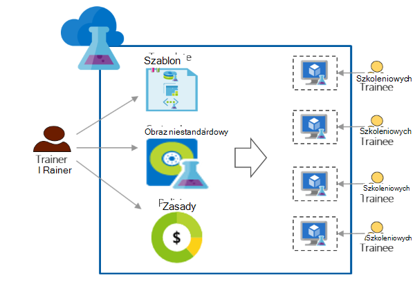

<properties
    pageTitle="Używanie Azure DevTest Labs szkoleń | Microsoft Azure"
    description="Dowiedz się, jak używać Azure DevTest Labs szkolenie scenariuszach."
    services="devtest-lab,virtual-machines"
    documentationCenter="na"
    authors="steved0x"
    manager="douge"
    editor=""/>

<tags
    ms.service="devtest-lab"
    ms.workload="na"
    ms.tgt_pltfrm="na"
    ms.devlang="na"
    ms.topic="article"
    ms.date="09/12/2016"
    ms.author="sdanie"/>

# Używanie Azure DevTest Labs szkoleń

Azure DevTest Labs może służyć do wykonania wielu kluczowe scenariusze oprócz deweloperów/testowanie. Jedną z tych scenariuszy jest skonfigurować ćwiczenia szkoleń. Azure DevTest Labs umożliwia tworzenie ćwiczenia, w którym można przekazywać szablony niestandardowe, które każdego szkoleniowych umożliwia tworzenie identyczne i są one odizolowane środowiskach szkoleń. Zapewnia środowiskach szkolenia są dostępne dla każdego szkoleniowych, tylko wtedy, gdy potrzebne i zawierają za mało zasobów — takie jak maszyn wirtualnych - wymagane szkolenia. Ponadto można łatwo udostępniać ćwiczenia praktykantów, które mogą uzyskać dostęp za pomocą jednego kliknięcia.   

Azure DevTest Labs spełnia następujące wymagania wymaganych do prowadzenia szkoleń w dowolnym środowisku wirtualnej: 

-   Praktykantów nie widać utworzona przez inne praktykantów maszyny wirtualne
-   Każdym komputerze szkolenia powinny być identyczne.
-   Praktykantów umożliwia szybkie obsługę swoich środowiskach szkolenia
-   Kontrolowanie koszt za zapewnienie, że praktykantów nie można pobrać więcej maszyny wirtualne nie są potrzebne do szkolenia jak również zamknięcia maszyny wirtualne ich nie używają
-   Udostępniaj ćwiczenia szkolenie z każdego szkoleniowych
-   Wielokrotnego ponownego użycia ćwiczenia szkolenia

W tym artykule informacje o różne funkcje Azure DevTest Labs, które mogą być używane do spełnia wymagania opisane wcześniej szkolenia i uzyskać szczegółowe instrukcje, które można wykonać, aby skonfigurować ćwiczenia szkoleń.  

## Implementacji szkolenia Azure DevTest Labs

1. **Tworzenie ćwiczenia** 

    Labs to punkt początkowy w laboratoriach DevTest Azure. Po utworzeniu ćwiczenia, można wykonywać zadania takie jak dodawanie użytkowników (praktykantów) do ćwiczenia, ustawić zasady do sterowania kosztów, definiowanie obrazów maszyn wirtualnych, które można szybko tworzyć i nie tylko.   

    Dowiedz się więcej, klikając łącza w poniższej tabeli:

  	| Zadanie                                                            | Zdobyte informacje                                                    |
|-----------------------------------------------------------------|----------------------------------------------------------------------|
| [Tworzenie ćwiczenia w Azure DevTest Labs](devtest-lab-create-lab.md) | Dowiedz się, jak tworzyć ćwiczenia w laboratoriach DevTest Azure w portalu Azure. |

2. **Tworzenie maszyny wirtualne szkolenie w minutach przy użyciu obrazów gotowych marketplace i niestandardowych obrazów** 
    
    Możesz wybierz gotowych obrazów z wielu różnych obrazów w Azure Marketplace i uzyskiwać do nich dostęp dla praktykantów w ćwiczenia. Jeśli gotowych obrazów nie spełnia wymagań, możesz utworzyć obraz niestandardowy, tworząc ćwiczenia maszyn wirtualnych przy użyciu jednego z gotowych obrazów z usługi Azure Marketplace, instalowanie oprogramowania, należy obraz niestandardowy w ćwiczenia szkolenia i zapisywanie maszyn wirtualnych. 

    Dowiedz się więcej, klikając łącza w poniższej tabeli:

  	| Zadanie                                                                              | Zdobyte informacje                                                                                                                                  |
|-----------------------------------------------------------------------------------|-------------------------------------------------------------------------------------------------------------------------------------------------|
| [Konfigurowanie obrazów Azure Marketplace](devtest-lab-configure-marketplace-images.md) | Dowiedz się, jak listy sprawdzonej Azure Marketplace obrazów; Udostępnianie do zaznaczenia tylko obrazy chcesz szkolenia.                 |
| [Tworzenie niestandardowego obrazu](devtest-lab-create-template.md)                           | Utwórz obraz niestandardowy, wstępnie instalowanie oprogramowania, potrzebne do szkolenia, tak aby praktykantów można szybko utworzyć maszyny przy użyciu niestandardowego obrazu. |

3. **Tworzenie szablonów do ponownego użycia w przypadku komputerów szkolenia** 

    Formuła w laboratoriach DevTest Azure jest listę domyślnych wartości właściwości użyte do utworzenia maszyny. Formuły można utworzyć w ćwiczenia, wybierając obrazu, rozmiar pamięci Wirtualnej (kombinacja Procesora i pamięci RAM) i wirtualnej sieci. Każdy szkoleniowych można wyświetlać formuły w ćwiczenia i za jej pomocą tworzyć maszyny. 

    Dowiedz się więcej, klikając łącza w poniższej tabeli:

  	| Zadanie                                                                         | Zdobyte informacje                                                                                                          |
|------------------------------------------------------------------------------|-------------------------------------------------------------------------------------------------------------------------|
| [Zarządzanie DevTest Labs formuły, aby utworzyć maszyny wirtualne](devtest-lab-manage-formulas.md) | Dowiedz się, jak można utworzyć formułę, wybierając obrazu, rozmiar pamięci Wirtualnej (kombinacja Procesora i pamięci RAM) i wirtualną sieć. |

4. **Kontrola kosztów**

    Azure DevTest Labs pozwala ustawić zasady w ćwiczenia, aby określić maksymalną liczbę maszyny wirtualne, które mogą być tworzone przez szkoleniowych w ćwiczenia. 

    Jeśli prowadzisz wielodniowego szkolenia i chcesz zatrzymać maszyny wirtualne w określonym czasie dnia, a następnie automatycznie uruchom ich ponownie następnego dnia, można łatwo wykonywać który przez ustawienie automatyczne zamknięcie systemu i Autostart zasady w ćwiczenia. 

    Na koniec po ukończeniu szkolenia możesz usunąć wszystkie maszyny wirtualne jednocześnie, uruchamiając pojedynczy skrypt programu PowerShell. 

    Dowiedz się więcej, klikając łącza w poniższej tabeli:

  	| Zadanie                                                                                                                                    | Zdobyte informacje                                                      |
|-----------------------------------------------------------------------------------------------------------------------------------------|---------------------------------------------------------------------|
| [Definiowanie zasad ćwiczenia](devtest-lab-set-lab-policy.md)                                                                                    | Sterowanie kosztów przez ustawienie zasad w ćwiczenia.                       |
| [Usuwanie wszystkich ćwiczenia maszyny wirtualne za pomocą skryptu programu PowerShell](devtest-lab-faq.md#how-can-i-automate-the-process-of-deleting-all-the-vms-in-my-lab) | Usuwanie wszystkich labs w jednej operacji po ukończeniu szkolenia. |

5. **Udostępnianie ćwiczenia każdej szkoleniowych**

    Labs można bezpośrednio dostępne za pomocą łącza, współużytkowanych z Twojej praktykantów. Usługi praktykantów nie nawet muszą mieć konto Azure, jak mają [konta Microsoft](devtest-lab-faq.md#what-is-a-microsoft-account). Praktykantów nie widać maszyny wirtualne utworzone przez innych praktykantów.  

    Dowiedz się więcej, klikając łącza w poniższej tabeli:

  	| Zadanie                                                                                                                                | Zdobyte informacje                                                   |
|-------------------------------------------------------------------------------------------------------------------------------------|------------------------------------------------------------------|
| [Dodawanie szkoleniowych do ćwiczenia w laboratoriach DevTest Azure](devtest-lab-add-devtest-user.md)                                                     | Azure portal umożliwia dodawanie praktykantów do swojego ćwiczenia szkolenie.       |
| [Dodawanie praktykantów do ćwiczenia, za pomocą skryptu programu PowerShell](devtest-lab-add-devtest-user.md#add-an-external-user-to-a-lab-using-powershell) | Aby zautomatyzować Dodawanie praktykantów do swojego ćwiczenia szkolenie za pomocą programu PowerShell. |
| [Uzyskaj link do ćwiczenia](devtest-lab-faq.md#how-do-i-share-a-direct-link-to-my-lab)                                                  | Dowiedz się, jak ćwiczenia są bezpośrednio dostępne za pośrednictwem hiperłącza.        |

6. **Wielokrotnego ponownego użycia ćwiczenia** 

    Można zautomatyzować tworzenie ćwiczenia, w tym ustawienia niestandardowe, tworząc szablonu Menedżera zasobów i korzystania z niego ponownie i ponownego tworzenia labs identyczne. 

    Dowiedz się więcej, klikając łącza w poniższej tabeli:

  	| Zadanie                                                                                                                               | Zdobyte informacje                                                      |
|------------------------------------------------------------------------------------------------------------------------------------|---------------------------------------------------------------------|
| [Tworzenie ćwiczenia przy użyciu szablonu Menedżera zasobów](devtest-lab-faq.md#how-do-i-create-a-lab-from-an-azure-resource-manager-template) | Tworzenie labs w laboratoriach DevTest Azure korzystania z szablonów Menedżera zasobów. |

[AZURE.INCLUDE [devtest-lab-try-it-out](../../includes/devtest-lab-try-it-out.md)]  

