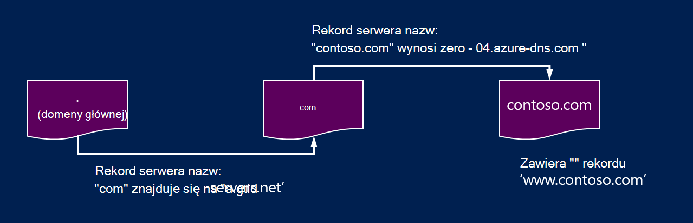
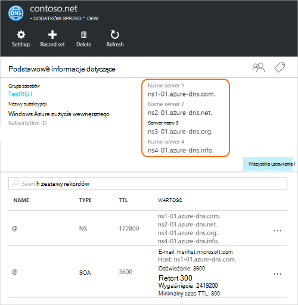

<properties
   pageTitle="Delegowanie domeny DNS Azure | Microsoft Azure"
   description="Zrozumieć, jak zmieniać Delegowanie domeny i serwery Azure DNS za pomocą zapewnienie hostingu domeny."
   services="dns"
   documentationCenter="na"
   authors="sdwheeler"
   manager="carmonm"
   editor=""/>

<tags
   ms.service="dns"
   ms.devlang="na"
   ms.topic="get-started-article"
   ms.tgt_pltfrm="na"
   ms.workload="infrastructure-services"
   ms.date="06/30/2016"
   ms.author="sewhee"/>

# Delegowanie domeny DNS Azure

Azure DNS pozwala znajdować się strefa DNS i zarządzania rekordami DNS dla domeny w Azure. W kolejności dla kwerend DNS dla domeny do osiągnięcia Azure DNS domeny musi przekazać Azure DNS z domeny nadrzędnej. Należy pamiętać, Azure DNS nie jest rejestratora domen. W tym artykule wyjaśniono, jak działa delegowanie domen i sposobu delegowania domen DNS Azure.

## Jak działa delegowanie DNS

### Domeny i strefy

Domain Name System jest hierarchię domen. Hierarchia zaczyna się od domeny "głównej", którego nazwa jest po prostu**.**.  Poniżej pochodzą domen najwyższego poziomu, takich jak "com", "netto", "schemat", "USA" lub "jp".  Poniżej tych są domen drugiego poziomu, takich jak "org.uk" lub "co.jp".  I tak dalej. Domen w hierarchii DNS są obsługiwane przy użyciu oddzielnych strefy DNS. Te strefy globalnie są rozdzielane, obsługiwanych przez serwery DNS na świecie.

**Strefy DNS**

Domena jest unikatową nazwę w systemie nazw domen, na przykład "contoso.com". Strefy DNS służy do przechowywania rekordów DNS dla danej domeny. Na przykład domeny "contoso.com" może zawierać wiele rekordów DNS, takie jak "mail.contoso.com" (dla serwera poczty) i "www.contoso.com" (dla witryny sieci Web).

**Rejestratora domen**

Rejestratora domen jest firmy, który udostępnia nazwy domen internetowych. Ta osoba sprawdzi Jeśli domeny internetowej, który ma być wyświetlany jest dostępny i można ją kupić. Gdy nazwa domeny jest zarejestrowana, będzie prawne właścicielem nazwy domeny. Jeśli masz już domenę internetową, będzie przekazać Azure DNS za pomocą bieżący rejestrator domen.

>[AZURE.NOTE] Aby dowiedzieć się więcej informacji na właścicielu nazwę danej domeny lub informacje na temat kupowanie domeny, zobacz [Zarządzanie domeny Internet w Azure AD](https://msdn.microsoft.com/library/azure/hh969248.aspx).

### Rozdzielczość i udzielania pełnomocnictwa

Istnieją dwa typy serwerów DNS:

- _Autorytatywny_ serwer DNS obsługuje strefy DNS. Kwerendy DNS odpowiada dla rekordów tylko te strefy.
- Serwer DNS _cykliczne_ nie obsługuje strefy DNS. Wszystkie kwerendy DNS odpowiada dzwoniąc autorytatywnych serwerów DNS do zbierania danych, które są niezbędne.

>[AZURE.NOTE] Azure DNS oferuje autorytatywne usługi DNS.  Nie oferuje usługa DNS cykliczne.

> Usługami w chmurze i maszyny wirtualne platformy Azure są konfigurowane automatycznie używać usługi DNS cykliczne, które znajduje się oddzielnie jako część infrastruktury Azure firmy.  Aby uzyskać informacje na temat zmieniania ustawień DNS Zobacz [Rozpoznawanie nazw w Azure](../virtual-network/virtual-networks-name-resolution-for-vms-and-role-instances.md#name-resolution-using-your-own-dns-server).

Klienci DNS na komputerach i urządzeniach przenośnych zazwyczaj połączeń serwera DNS cykliczne, aby wykonać kwerendy DNS potrzebne w aplikacjach klienckich.

Gdy serwera DNS cykliczne odbiera zapytanie dotyczące rekordu DNS, takie jak "www.contoso.com", należy najpierw Znajdź nazwę serwera obsługującego strefy dla domeny "contoso.com". W tym celu należy go zaczyna się od głównych serwerów nazw, a stamtąd znajduje serwery nazw obsługujący strefę "com". Zapytanie serwery nazw "com", aby znaleźć serwery nazw obsługujący strefę "contoso.com".  Na koniec będzie mógł kwerendy te serwery nazw dla "www.contoso.com".

Jest to rozpoznawania nazw DNS. Mówiąc ściśle rozpoznawania nazw DNS zawiera dodatkowe czynności, takie jak następujące rekordów CNAME, ale nie jest ważne do zrozumienia, jak działa delegowanie DNS.

Jak strefę nadrzędną "punkt" serwery nazw dla strefy podrzędnej? Jest to za pomocą specjalnego typu rekordu DNS nazywany rekordem serwera nazw (NS zawiera "Nazwa serwera"). Na przykład strefy głównej zawiera rekordom "com" i zawiera serwery nazw dla strefy "com". Z kolei strefa "com" zawiera rekordom DNS dla "contoso.com", który pokazuje serwery nazw dla strefy "contoso.com". Aby skonfigurować rekordom DNS dla strefy podrzędnej w strefie nadrzędnej nosi nazwę delegowana domena.

Każda delegacja ma w rzeczywistości dwie kopie rekordom DNS; jedna w strefie nadrzędnej, wskazująca podrzędne, a drugi w samej strefie podrzędne. Strefa "contoso.com" zawiera rekordom DNS dla "contoso.com" (oprócz rekordów serwera nazw w "com"). Te są nazywane autorytatywne rekordów serwera nazw i znajdują się u wierzchołka strefy podrzędnej.

## Delegowanie domeny DNS Azure

Po utworzeniu swoją strefę DNS w systemie DNS Azure należy skonfigurować rekordów serwera nazw w strefie nadrzędnej nawiązać autorytatywne źródło rozpoznawanie nazw strefy Azure DNS. Zakupiony od rejestratora domen rejestratora oferuje opcję, aby skonfigurować te rekordy serwera nazw.

>[AZURE.NOTE] Nie masz właścicielem domeny w celu utworzenia strefy DNS przy użyciu tej nazwy domeny w usłudze DNS Azure. Należy jednak własności do domeny, aby skonfigurować delegowanie Azure DNS u rejestratora.

Załóżmy na przykład, kupowanie domeny "contoso.com" i Utwórz strefę o nazwie "contoso.com" w systemie DNS Azure. Jako właściciel domeny rejestratora zaoferuje opcję, aby skonfigurować adresy serwerów nazw (czyli rekordów SN) dla swojej domeny. Rejestrator będzie przechowywana tych rekordów serwera nazw w domenie nadrzędnej, w tym przypadku ".com". Klienci na świecie następnie będzie kierowany do domeny w strefie Azure DNS, podczas próby rozwiązanie rekordów DNS w "contoso.com".

### Znajdowanie nazwy serwera

Przed możesz delegować swoją strefę DNS DNS Azure, najpierw należy ustalić nazwy serwerów nazw strefy. Azure DNS przydziela serwery nazw z puli za każdym razem, gdy strefa jest tworzona.

Najprostszym sposobem na wyświetlenie serwerów nazw przypisane do strefy jest przez Azure portal.  W tym przykładzie strefie "contoso.net" przypisano serwery nazw "ns1-01.azure-dns.com", "ns2 01.azure dns .net", "ns3-01.azure-dns.org", i "ns4-01.azure-dns.info":

 

Azure DNS automatycznie tworzy autorytatywne rekordów serwera nazw w strefie zawierającej serwerów nazw przypisane.  Aby wyświetlić nazwy serwerów nazw za pośrednictwem Azure programu PowerShell lub interfejsu wiersza polecenia Azure, wystarczy w celu pobrania tych rekordów.

Przy użyciu programu PowerShell Azure, autorytatywne rekordom można pobrać w następujący sposób. Należy zauważyć, że nazwa rekordu “@” jest używany w odniesieniu do rekordów u wierzchołka strefę czasową.

    PS> $zone = Get-AzureRmDnsZone –Name contoso.net –ResourceGroupName MyResourceGroup
    PS> Get-AzureRmDnsRecordSet –Name “@” –RecordType NS –Zone $zone

    Name              : @
    ZoneName          : contoso.net
    ResourceGroupName : MyResourceGroup
    Ttl               : 3600
    Etag              : 5fe92e48-cc76-4912-a78c-7652d362ca18
    RecordType        : NS
    Records           : {ns1-01.azure-dns.com, ns2-01.azure-dns.net, ns3-01.azure-dns.org,
                        ns4-01.azure-dns.info}
    Tags              : {}

Za pomocą polecenie Azure i platform do pobierania autorytatywne rekordom i w związku z tym wykrywania serwerów nazw przypisane do strefy:

    C:\> azure network dns record-set show MyResourceGroup contoso.net @ NS
    info:    Executing command network dns record-set show
        + Looking up the DNS Record Set "@" of type "NS"
    data:    Id                              : /subscriptions/.../resourceGroups/MyResourceGroup/providers/Microsoft.Network/dnszones/contoso.net/NS/@
    data:    Name                            : @
    data:    Type                            : Microsoft.Network/dnszones/NS
    data:    Location                        : global
    data:    TTL                             : 172800
    data:    NS records
    data:        Name server domain name     : ns1-01.azure-dns.com.
    data:        Name server domain name     : ns2-01.azure-dns.net.
    data:        Name server domain name     : ns3-01.azure-dns.org.
    data:        Name server domain name     : ns4-01.azure-dns.info.
    data:
    info:    network dns record-set show command OK

### Aby skonfigurować delegowanie

Każdy rejestrator ma własne narzędzia do zarządzania DNS na zmianę rekordów serwerów nazw dla domeny. Na stronie zarządzania DNS rejestratora w edytować rekordy serwera nazw i zamienić rekordom te, które są tworzone Azure DNS.

Delegowanie domeny DNS Azure, należy użyć nazwy serwerów nazw dostarczony przez Azure DNS.  Zawsze należy używać wszystkich 4 nazwę serwera nazw, bez względu na to nazwa Twojej domeny.  Delegowanie domeny nie wymaga nazwę serwera nazw, aby użyć tej samej domeny najwyższego poziomu jako domeny.

Nie należy używać "przyklejanie rekordy", aby wskazywały Azure nazw DNS server adresy IP, ponieważ te adresy IP może się zmienić w przyszłości. W systemie DNS Azure delegowania przy użyciu serwera nazwy własne w strefie, nazywane "serwery nazw vanity", nie są obecnie obsługiwane.

### Aby zweryfikować rozpoznawanie nazw działa

Po zakończeniu przedstawicielstwa, można sprawdzić, czy rozpoznawanie nazw działa za pomocą narzędzi, takich jak "nslookup" zbadać rekordzie SOA strefy (który jest tworzony automatycznie po utworzeniu strefy).

Zauważ, że nie masz określone serwery nazw Azure DNS, ponieważ normalny proces rozwiązywania DNS spowoduje znalezienie serwery nazw automatycznie jeśli przedstawicielstwo został skonfigurowany poprawnie.

    nslookup –type=SOA contoso.com

    Server: ns1-04.azure-dns.com
    Address: 208.76.47.4

    contoso.com
    primary name server = ns1-04.azure-dns.com
    responsible mail addr = msnhst.microsoft.com
    serial = 1
    refresh = 900 (15 mins)
    retry = 300 (5 mins)
    expire = 604800 (7 days)
    default TTL = 300 (5 mins)

## Delegowanie domeny podrzędne w systemie DNS Azure

Jeśli chcesz skonfigurować strefy podrzędnej osobnych, możesz delegować podrzędny domeny w usłudze Azure DNS. Na przykład o Konfigurowanie i delegowanej "contoso.com" w systemie DNS Azure, załóżmy, że chcesz skonfigurować strefę osobnych podrzędny "partnerzy.contoso.com".

Konfigurowanie poddomenę wykonuje podobny proces jako normalny delegowanie. Jedyną różnicą jest w kroku 3, rekordom muszą zostać utworzone w strefie nadrzędnej "contoso.com" w Azure DNS, zamiast konfigurowany przez rejestratora domen.

1. Tworzenie strefy podrzędnej "partnerzy.contoso.com" w systemie DNS Azure.
2. Wyszukiwanie autorytatywne rekordom w strefie podrzędne uzyskanie obsługującego strefę podrzędną w systemie DNS Azure serwerów nazw.
3. Delegowanie strefy podrzędnej przez skonfigurowanie rekordów serwera nazw w strefie nadrzędnej wskazująca strefy podrzędnej.

### Aby delegować poddomenę

W poniższym przykładzie programu PowerShell przedstawiono, jak to działa. Te same czynności mogą być wykonywane przez Azure Portal lub za pośrednictwem polecenie Azure między platformami.

#### Krok 1. Tworzenie elementy nadrzędne i podrzędne strefy

Najpierw tworzymy elementy nadrzędne i podrzędne strefy. Może to być w tej samej grupy zasobów lub różnych grup zasobów.

    $parent = New-AzureRmDnsZone -Name contoso.com -ResourceGroupName RG1
    $child = New-AzureRmDnsZone -Name partners.contoso.com -ResourceGroupName RG1

#### Krok 2. Pobierz rekordom

Następnie pobieranie autorytatywne rekordom z strefy podrzędnej, jak pokazano w przykładzie dalej.  Ta strona zawiera serwerów nazw przypisane do strefy podrzędnej.

    $child_ns_recordset = Get-AzureRmDnsRecordSet -Zone $child -Name "@" -RecordType NS

#### Krok 3. Delegowanie strefy podrzędnej

Utwórz odpowiedni rekord serwera nazw Ustaw w strefie nadrzędnej do wykonania przedstawicielstwa. Należy zauważyć, że nazwa zestawu rekordów w strefie nadrzędnej odpowiada nazwie strefy podrzędne, w tym przypadku "Partnerzy".

    $parent_ns_recordset = New-AzureRmDnsRecordSet -Zone $parent -Name "partners" -RecordType NS -Ttl 3600
    $parent_ns_recordset.Records = $child_ns_recordset.Records
    Set-AzureRmDnsRecordSet -RecordSet $parent_ns_recordset

### Aby zweryfikować rozpoznawanie nazw działa

Można sprawdzić, czy wszystko jest poprawnie skonfigurowany przez wyszukiwanie rekordzie SOA strefy podrzędnej.

    nslookup –type=SOA partners.contoso.com

    Server: ns1-08.azure-dns.com
    Address: 208.76.47.8

    partners.contoso.com
        primary name server = ns1-08.azure-dns.com
        responsible mail addr = msnhst.microsoft.com
        serial = 1
        refresh = 900 (15 mins)
        retry = 300 (5 mins)
        expire = 604800 (7 days)
        default TTL = 300 (5 mins)

## Następne kroki

[Zarządzanie strefy DNS](dns-operations-dnszones.md)

[Zarządzanie rekordami DNS](dns-operations-recordsets.md)

