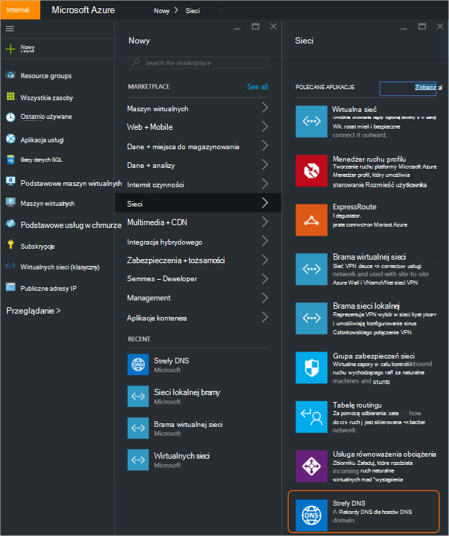
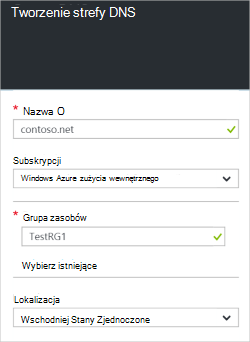
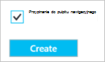
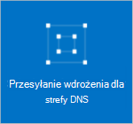
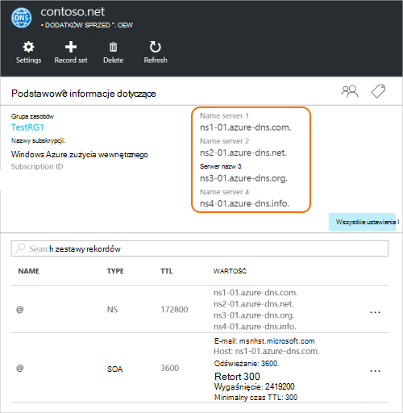
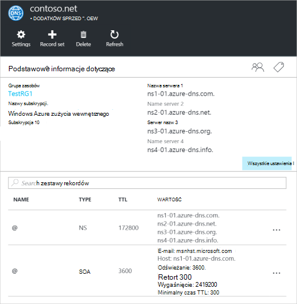

<properties
   pageTitle="Jak tworzyć i zarządzać nimi strefy DNS w portalu Azure | Microsoft Azure"
   description="Dowiedz się, jak utworzyć strefy DNS dla usługi Azure DNS. Jest to przewodnik krok po kroku, aby utworzyć i zarządzała systemem DNS pierwszy i rozpocząć, hostingu DNS domeny za pomocą portalu Azure."
   services="dns"
   documentationCenter="na"
   authors="sdwheeler"
   manager="carmonm"
   editor=""
   tags="azure-resource-manager"/>

<tags
   ms.service="dns"
   ms.devlang="na"
   ms.topic="article"
   ms.tgt_pltfrm="na"
   ms.workload="infrastructure-services"
   ms.date="08/16/2016"
   ms.author="sewhee"/>

# Tworzenie strefy DNS w portalu Azure

> [AZURE.SELECTOR]
- [Azure Portal](dns-getstarted-create-dnszone-portal.md)
- [Programu PowerShell](dns-getstarted-create-dnszone.md)
- [Polecenie Azure](dns-getstarted-create-dnszone-cli.md)

W tym artykule będzie szczegółową procedurę tworzenia strefy DNS za pomocą portalu Azure. Można także tworzyć strefy DNS przy użyciu programu PowerShell lub interfejsu wiersza polecenia.

[AZURE.INCLUDE [dns-create-zone-about](../../includes/dns-create-zone-about-include.md)]

### Tagi Azure DNS — informacje

Znaczniki są Lista par wartości z pola Nazwa i są używane przez Menedżera zasobów Azure do zasobów etykiety na potrzeby rozliczeń lub grupowania. Aby uzyskać więcej informacji na temat znaczników zobacz artykuł [Używanie znaczników w celu organizowania Azure zasobów](../resource-group-using-tags.md).

Możesz dodać znaczniki w portalu Azure za pomocą karta **Ustawienia** strefy DNS.

## Tworzenie strefy DNS

1. Zaloguj się do portalu Azure

2. W menu Centrum kliknij pozycję, a następnie kliknij pozycję **Nowy > Sieć >** , a następnie kliknij pozycję **strefy DNS** , aby otworzyć karta strefy DNS.

    

3. Karta **strefy DNS** wybierz polecenie **Utwórz** u dołu. Spowoduje to otwarcie karta **strefy DNS tworzenie** .

    

4. Na karta **strefy DNS tworzenie** nazw z strefy DNS. Na przykład *contoso.com*. Zobacz [Temat nazwy strefy DNS](#names) w poprzedniej sekcji.

5. Następnie określ, grupa zasobów, którego chcesz użyć. Możesz utworzyć nową grupę zasobów lub wybrać jedną, która już istnieje.

6. Z menu rozwijanego **Lokalizacja** Określ lokalizację grupy zasobów. Zauważ, że to ustawienie określa położenie grupy zasobów nie lokalizacji dla strefy DNS. Rzeczywisty zasobów strefy DNS jest automatycznie "globalny" i nie jest coś, co można (lub musisz) określ w portalu.

7. Możesz pozostawić pole wyboru **numer Pin do pulpitu nawigacyjnego** jest zaznaczone, jeśli chcesz łatwo zlokalizować do nowej strefy do pulpitu nawigacyjnego. Następnie kliknij przycisk **Utwórz**.

    

8. Po kliknięciu przycisku Utwórz pojawi się do nowej strefy konfigurowany na pulpicie nawigacyjnym.

    

9. Po utworzeniu do nowej strefy karta nowej strefy zostanie otwarte na pulpicie nawigacyjnym.

## Wyświetl rekordy

Tworzenie strefy DNS tworzy również następujące rekordy:

- "Uruchom z" rekordu SOA (). SOA znajduje się w katalogu głównym każdej strefy DNS.
- Autorytatywne rekordów serwera nazw (SN). Pokaż tych, które serwerów nazw znajdują się strefy. Azure DNS używa puli serwerów nazw, a więc różnych serwerów nazw może być przypisana do innej strefy w systemie DNS Azure. Aby uzyskać więcej informacji, zobacz [pełnomocnika domeny DNS Azure](dns-domain-delegation.md) .

Możesz wyświetlić rekordy z portalem Azure

1. Usługi karta **strefy DNS** na kliknij **wszystkie ustawienia** , aby otworzyć **Karta Ustawienia** dla strefy DNS.

    

2. W dolnej części okienka Essentials możesz sprawdzić, czy rekord ustawia dla strefy DNS.

    

## Test

Za pomocą narzędzia systemu DNS, takich jak nslookup, wykopanie lub [polecenia cmdlet programu PowerShell Nazwa_dns rozwiązania problemu](https://technet.microsoft.com/library/jj590781.aspx), możesz przetestować swoją strefę DNS.

Jeśli jeszcze nie delegowane domeny do nowej strefy w systemie DNS Azure za pomocą, będzie konieczne bezpośredni kwerendy DNS bezpośrednio do jednego z serwerów nazw strefy. Serwery nazw strefy podano w rekordów serwera nazw, zgodnie z treścią `Get-AzureRmDnsRecordSet` powyżej. Upewnij się, że zastępczych poprawne wartości dla Twojej strefy na poniższe polecenie.

    nslookup
    > set type=SOA
    > server ns1-01.azure-dns.com
    > contoso.com

    Server: ns1-01.azure-dns.com
    Address:  208.76.47.1

    contoso.com
            primary name server = ns1-01.azure-dns.com
            responsible mail addr = msnhst.microsoft.com
            serial  = 1
            refresh = 900 (15 mins)
            retry   = 300 (5 mins)
            expire  = 604800 (7 days)
            default TTL = 300 (5 mins)

## Usuwanie strefy DNS

Możesz usunąć strefy DNS bezpośrednio z poziomu portalu. Przed usunięciem strefy DNS w systemie DNS Azure, należy usunąć wszystkie zestawy rekordów, z wyjątkiem NS i SOA rekordy w katalogu głównym strefy, które zostały utworzone automatycznie podczas tworzenia strefy.

1. Znajdź karta **strefy DNS** dla strefy, którą chcesz usunąć, a następnie kliknij polecenie **Usuń** w górnej części karta.

2. Zostanie wyświetlony komunikat informujące, że musisz usunąć wszystkie zestawy rekordów, z wyjątkiem NS i SOA rekordy, które zostały utworzone automatycznie. Jeśli został usunięty z zestawy rekordów, kliknij przycisk **Tak**. Należy zauważyć, że podczas usuwania strefy DNS z portalu, grupa zasobów, z którą jest skojarzony strefy DNS nie zostaną usunięte.

## Następne kroki

Po utworzeniu strefy DNS, utworzyć [zestawy rekordów i rekordy](dns-getstarted-create-recordset-portal.md) uruchomić rozpoznawanie nazw dla domeny internetowej.
