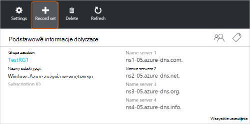
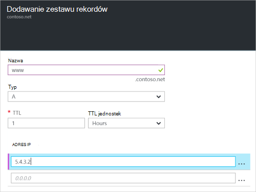

<properties
   pageTitle="Tworzenie zestawu rekordów i rekordy strefy DNS za pomocą portalu Azure | Microsoft Azure"
   description="Jak utworzyć rekordy hosta DNS Azure i tworzenie zestawów rekordów i rekordów przy użyciu Azure portal"
   services="dns"
   documentationCenter="na"
   authors="sdwheeler"
   manager="carmonm"
   editor=""
   tags="azure-resource-manager"/>

<tags
   ms.service="dns"
   ms.devlang="na"
   ms.topic="article"
   ms.tgt_pltfrm="na"
   ms.workload="infrastructure-services"
   ms.date="08/16/2016"
   ms.author="sewhee"/>

# Tworzenie zestawów rekordów DNS i rekordów przy użyciu Azure portal

> [AZURE.SELECTOR]
- [Azure Portal](dns-getstarted-create-recordset-portal.md)
- [Programu PowerShell](dns-getstarted-create-recordset.md)
- [Polecenie Azure](dns-getstarted-create-recordset-cli.md)

W tym artykule przeprowadzi Cię przez proces tworzenia rekordów i zestawów rekordów za pomocą portalu Azure. Po utworzeniu do strefy DNS, możesz dodać rekordy DNS dla swojej domeny. Aby to zrobić, najpierw należy zrozumieć rekordów DNS i zestawy rekordów.

[AZURE.INCLUDE [dns-about-records-include](../../includes/dns-about-records-include.md)]

## Tworzenie zestawu rekordów i rekordu

Poniższy przykład przeprowadzi Cię przez proces tworzenia zestawu rekordów i rekord za pomocą portalu Azure. Użyjemy typu rekordu DNS "A".

1. Zaloguj się do portalu.

2. Przejdź do karta **strefy DNS** , w której chcesz utworzyć zestaw rekordów.

3. U góry karta **strefy DNS** wybierz **zestaw rekordów** , aby otworzyć karta **zestaw rekordów dodatku** .

    

4. Na karta **zestaw rekordów Dodaj** nazwę zestawu rekordów. Można na przykład nazwę swojego zestawu rekordów "**www**".

    

5. Wybierz typ rekordu, który chcesz utworzyć. Na przykład zaznacz **odpowiedzi**.

6. Ustawianie **pola TTL**. Domyślny czas wygaśnięcia w portalu jest godzinę.

7. Dodaj adresy IP, adresów IP dla każdego wiersza. Korzystając z sugerowanych zestawu rekordów nazwa i typ rekordu opisanych wcześniej, możesz dodać adresy IP protokołu IPv4 **rekord "www" zestawu rekordów** .

8. Po zakończeniu dodawania adresów IP, wybierz przycisk **OK** u dołu karta. Zostanie utworzona zestawu rekordów DNS.

## Następne kroki

Do zarządzania zestawu rekordów i rekordów, zobacz [rekordy DNS zarządzanie i rekord zestawów przy użyciu Azure portal](dns-operations-recordsets-portal.md).

Aby uzyskać więcej informacji o usłudze DNS Azure zobacz [Omówienie Azure systemu DNS](dns-overview.md).
