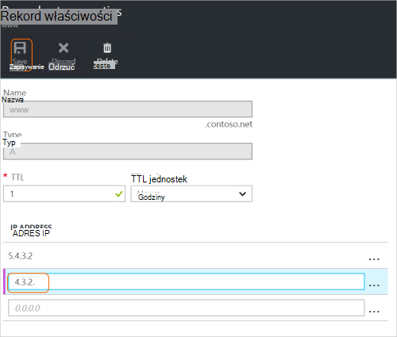
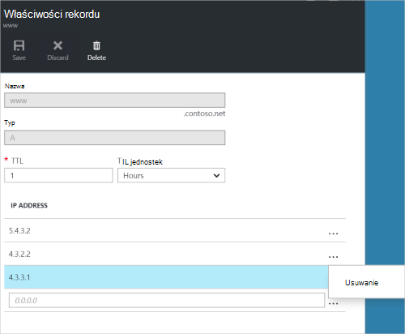

<properties
   pageTitle="Zarządzanie zestawy rekordów DNS i rekordów przy użyciu Azure portal | Microsoft Azure"
   description="Zarządzanie DNS rekord ustawia i rekordów, gdy hostingu własną domeną w usłudze Azure DNS."
   services="dns"
   documentationCenter="na"
   authors="sdwheeler"
   manager="carmonm"
   editor=""
   tags="azure-resource-manager"/>

<tags
   ms.service="dns"
   ms.devlang="na"
   ms.topic="article"
   ms.tgt_pltfrm="na"
   ms.workload="infrastructure-services"
   ms.date="08/16/2016"
   ms.author="sewhee"/>

# Zarządzanie rekordami DNS i rekord zestawy przy użyciu Azure portal

> [AZURE.SELECTOR]
- [Azure Portal](dns-operations-recordsets-portal.md)
- [Polecenie Azure](dns-operations-recordsets-cli.md)
- [Programu PowerShell](dns-operations-recordsets.md)

W tym artykule pokazano, jak zarządzać zestawy rekordów i rekordy strefy DNS za pomocą portalu Azure.

Należy opis różnic między zestawy rekordów DNS i poszczególnych rekordów DNS. Zestaw rekordów to zbiór rekordów w strefie, które mają taką samą nazwę i tego samego typu. Aby uzyskać więcej informacji zobacz [zestawy rekordów DNS Utwórz i rekordów przy użyciu Azure portal](dns-getstarted-create-recordset-portal.md).

## Tworzenie nowego zestawu rekordów i rekordu

Aby utworzyć rekord w portalu Azure, zobacz [Tworzenie rekordów DNS za pomocą portalu Azure.](dns-getstarted-create-recordset-portal.md)

## Wyświetlanie zestawu rekordów

1. W portalu Azure przejdź do karta **strefy DNS** .

2. Wyszukiwanie zestawu rekordów i zaznacz go. Spowoduje to otwarcie właściwości zestawu rekordów.

    

## Dodawanie nowego rekordu do zestawu rekordów

Możesz dodać maksymalnie 20 rekordów do dowolnego zestawu rekordów. Zestaw rekordów nie może zawierać dwa rekordy identyczne. Pusty zestawy rekordów (z zero rekordów) można utworzyć, ale nie są wyświetlane na serwerów nazw Azure DNS. Zestawy rekordów CNAME typu może zawierać najwyżej jeden rekord.

1. Wybierz polecenie zestaw rekordów, który chcesz dodać rekord z karta **rekordu ustawić właściwości** strefy DNS.

    

2. Określ rekord właściwości zestawu, wypełniając w polach.

    

2. Kliknij przycisk **Zapisz** w górnej części karta Aby zapisać ustawienia. Następnie zamknij karta.

3. W rogu zostanie wyświetlony zapisuje rekord.

    

Po zapisaniu rekordu wartości w karta **strefy DNS** zostaną zastosowane nowego rekordu.

## Zaktualizuj rekord

Gdy zaktualizujesz rekord w istniejącym zestawie rekordów, pola, które można aktualizować zależy od typu rekordu podczas pracy z.

1. Wyszukać rekord na karta **rekordu ustawić właściwości** dla zestawu rekordów.

2. Modyfikowanie rekordu. Po zmodyfikowaniu rekord, możesz zmienić ustawienia dostępne dla rekordu. W poniższym przykładzie jest zaznaczone pole **adres IP** , a adres IP trwa modyfikowany.

    

3. Kliknij przycisk **Zapisz** w górnej części karta Aby zapisać ustawienia. W prawym górnym rogu zostanie wyświetlone powiadomienie, który został zapisany rekord.

    

Po zapisaniu rekordu wartości rekordu ustawiać karta **strefy DNS** zostaną zastosowane zaktualizowany rekord.

## Usuwanie rekordu z zestawu rekordów

Azure portal umożliwia usuwanie rekordów w zestawie rekordów. Należy zauważyć, że usunięcie ostatni rekord w zestawie rekordów nie powoduje usunięcia zestawu rekordów.

1. Wyszukać rekord na karta **rekordu ustawić właściwości** dla zestawu rekordów.

2. Kliknij rekord, który chcesz usunąć. Następnie kliknij przycisk **Usuń**.

    

3. Kliknij przycisk **Zapisz** w górnej części karta Aby zapisać ustawienia.

3. Po usunięciu rekordu wartości rekordu na karta **strefy DNS** zostaną zastosowane usuwania.

## Usuwanie zestawu rekordów

1. W **rekordzie ustawić właściwości** karta dla rekordu zestawu, kliknij przycisk **Usuń**.

    

2. Pojawi się komunikat z pytaniem, czy chcesz usunąć zestawu rekordów.

3. Upewnij się, że nazwa odpowiada zestaw rekordów, który chcesz usunąć, a następnie kliknij przycisk **Tak**.

4. Na karta **strefy DNS** upewnij się, że zestaw rekordów nie jest widoczny.

## Praca z rekordami NS i SOA

NS i SOA rekordy, które są tworzone automatycznie są zarządzane inaczej z innych typów rekordów.

### Modyfikowanie rekordy SOA

Nie można dodawać i usuwać rekordy z ustawioną wierzchołka strefy automatycznie utworzony rekord SOA (nazwa = "@"). Jednak można modyfikować dowolne parametrów w rekordzie SOA (z wyjątkiem "Host") i TTL zestaw rekordów.

### Modyfikowanie rekordów serwera nazw u wierzchołka strefy

Nie można dodawać, usuwać lub modyfikować rekordy w rekordzie NS tworzonych automatycznie ustawioną wierzchołki strefy (nazwa = "@"). Tylko zmiany, które są dozwolone, jest zmodyfikowanie zestawu rekordów TTL.

### Usuwanie SOA i NS zestawy rekordów

Nie można usunąć SOA i rekord NS zestawy u wierzchołka strefy (nazwa = "@") które są tworzone automatycznie po utworzeniu strefy. Są usuwane automatycznie po usunięciu strefy.

## Następne kroki

-   Aby uzyskać więcej informacji o usłudze DNS Azure zobacz [Omówienie Azure systemu DNS](dns-overview.md).
-   Aby uzyskać więcej informacji na temat automatyzowania DNS Zobacz [Tworzenie stref i rekord zestawów przy użyciu zestawu SDK .NET](dns-sdk.md).
-   Aby uzyskać więcej informacji na temat odwrotnej rekordy DNS Zobacz [jak zarządzać odwrotnej rekordy DNS dla usług przy użyciu programu PowerShell](dns-reverse-dns-record-operations-ps.md).
