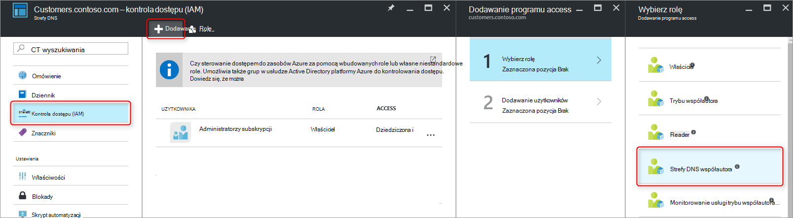

<properties 
   pageTitle="Ochrona strefy DNS i rekordy | Microsoft Azure" 
   description="Sposoby ochrony strefy DNS i zestawy rekordów w programie Microsoft Azure DNS." 
   services="dns" 
   documentationCenter="na" 
   authors="jtuliani" 
   manager="carmonm" 
   editor=""/>

<tags
   ms.service="dns"
   ms.devlang="na"
   ms.topic="article"
   ms.tgt_pltfrm="na"
   ms.workload="infrastructure-services" 
   ms.date="10/20/2016"
   ms.author="jtuliani"/>

# Jak chronić strefy DNS i rekordy

Strefy DNS i rekordy są krytyczne zasobów. Usuwanie strefy DNS lub nawet tylko jeden rekord DNS może powodować awarię usług sumy.  Ważne jest, w związku z tym że krytyczne strefy DNS i rekordy są chronione przed nieautoryzowanym lub przypadkowe zmiany.

W tym artykule wyjaśniono, jak Azure DNS umożliwia chronienie strefy DNS i rekordy przed zmianach.  Stosujemy dwóch funkcji zaawansowanych zabezpieczeń oferowanych przez Menedżera zasobów Azure: [Kontrola dostępu oparta na rolach](../active-directory/role-based-access-control-what-is.md) i [blokowania zasobów](../resource-group-lock-resources.md).

## Kontrola dostępu oparta na rolach

Azure oparta na rolach programu Access Control (RBAC) umożliwia zarządzanie szerokiego dostępu dla użytkowników Azure, grupy i zasoby. Przy użyciu RBAC, możesz przyznać dokładnie ilość dostęp użytkownicy muszą wykonać swoje zadania. Aby uzyskać więcej informacji na temat sposobu RBAC ułatwia zarządzanie dostępem zobacz [Co to jest kontrola dostępu oparta na rolach](../active-directory/role-based-access-control-what-is.md).

### Rola "Współautora strefy DNS"

Rola "Współautora strefy DNS" jest wbudowany roli przewidziane przez Azure zarządzania zasobami DNS.  Przypisywanie uprawnień współautora strefy DNS użytkownikowi lub grupie włącza tę grupę do zarządzania zasobami DNS, ale nie zasobów innego typu.

Załóżmy, że grupa zasobów "myzones" zawiera pięć stref firma Contoso. Udzielenie administratora serwera DNS uprawnienia "Współautorów strefy DNS" do tej grupy zasobów, umożliwia pełną kontrolę nad tymi strefy DNS. Również pozwala uniknąć, udzielanie uprawnień niepotrzebne, na przykład administratora serwera DNS nie można tworzyć ani zatrzymywanie maszyn wirtualnych.

Najłatwiejszym sposobem, aby przypisać uprawnienia RBAC jest [przez Azure portal](../active-directory/role-based-access-control-configure.md).  Otwórz karta uwierzytelnienie (IAM) dla grupy zasobów, następnie kliknij pozycję "Dodaj", a następnie wybierz rolę, "Współautora strefy DNS" i wybierz wymagane użytkowników lub grupy, aby udzielić uprawnień.

Uprawnienia mogą być także [przyznane przy użyciu programu PowerShell Azure](../active-directory/role-based-access-control-manage-access-powershell.md):

    # Grant 'DNS Zone Contributor' permissions to all zones in a resource group
    New-AzureRmRoleAssignment -SignInName <user email address> -RoleDefinitionName "DNS Zone Contributor" -ResourceGroupName <resource group name>

Polecenie odpowiadające mu jest również [dostępne za pośrednictwem interfejsu wiersza polecenia Azure](../active-directory/role-based-access-control-manage-access-azure-cli.md):

    # Grant 'DNS Zone Contributor' permissions to all zones in a resource group
    azure role assignment create --signInName  <user email address> --roleName "DNS Zone Contributor" --resourceGroup <resource group name>

### Poziomu strefy RBAC

Azure RBAC reguły można stosować do subskrypcji, grupa zasobów lub poszczególnych zasobów. W przypadku Azure DNS tego zasobu można poszczególne strefy DNS lub nawet poszczególnych zestawu rekordów.

Załóżmy, że grupa zasobów "myzones" zawiera strefie contoso.com i subzone "customers.contoso.com" w którym są tworzone rekordy CNAME dla każdego konta odbiorcy.  Konto używane do zarządzania te rekordy CNAME powinny być przypisane uprawnienia do utworzenia rekordów w tej strefie "customers.contoso.com", nie powinny mieć dostępu do innych stref.

Uprawnienia na poziomie strefy RBAC mogą być udzielane przez Azure portal.  Otwórz karta uwierzytelnienie (IAM) dla strefy, następnie kliknij pozycję "Dodaj", a następnie wybierz rolę, "Współautora strefy DNS" i wybierz wymagane użytkowników lub grupy, aby udzielić uprawnień.

Uprawnienia mogą być także [przyznane przy użyciu programu PowerShell Azure](../active-directory/role-based-access-control-manage-access-powershell.md):

    # Grant 'DNS Zone Contributor' permissions to a specific zone
    New-AzureRmRoleAssignment -SignInName <user email address> -RoleDefinitionName "DNS Zone Contributor" -ResourceGroupName <resource group name> -ResourceName <zone name> -ResourceType Microsoft.Network/DNSZones

Polecenie odpowiadające mu jest również [dostępne za pośrednictwem interfejsu wiersza polecenia Azure](../active-directory/role-based-access-control-manage-access-azure-cli.md):

    # Grant 'DNS Zone Contributor' permissions to a specific zone
    azure role assignment create --signInName <user email address> --roleName "DNS Zone Contributor" --resource-name <zone name> --resource-type Microsoft.Network/DNSZones --resource-group <resource group name>

### Poziom RBAC zestaw rekordów

Firma Microsoft wykonaj krok dalej. Należy rozważyć, czy przez administratora poczty dla Contoso Corporation, który musi mieć dostęp do rekordów MX i TXT na wierzchołek strefie "contoso.com".  Użytkownik nie musi dostęp do innych rekordów MX lub TXT lub rekordy innego typu.  Azure DNS umożliwia przypisywanie uprawnień na poziomie zestawu rekordów dokładnie przez administratora poczty musi mieć dostęp do rekordami.  Administrator poczty otrzymuje precyzyjnie kontrolować, użytkownik musi i nie może wprowadzić inne zmiany.
  
Uprawnienia na poziomie RBAC zestaw rekordów można skonfigurować za pośrednictwem portalu Azure za pomocą przycisku "Użytkownicy" w zestawie rekordów karta:

Uprawnienia na poziomie RBAC zestaw rekordów mogą być także [przyznane przy użyciu programu PowerShell Azure](../active-directory/role-based-access-control-manage-access-powershell.md):

    # Grant permissions to a specific record set
    New-AzureRmRoleAssignment -SignInName <user email address> -RoleDefinitionName "DNS Zone Contributor" -Scope "/subscriptions/<subscription id>/resourceGroups/<resource group name>/providers/Microsoft.Network/dnszones/<zone name>/<record type>/<record name>" 

Polecenie odpowiadające mu jest również [dostępne za pośrednictwem interfejsu wiersza polecenia Azure](../active-directory/role-based-access-control-manage-access-azure-cli.md):

    # Grant permissions to a specific record set
    azure role assignment create --signInName <user email address> --roleName "DNS Zone Contributor" --scope "/subscriptions/<subscription id>/resourceGroups/<resource group name>/providers/Microsoft.Network/dnszones/<zone name>/<record type>/<record name>"

### Role niestandardowe

Wbudowane roli "Współautora strefy DNS" umożliwia pełną kontrolę nad zasobów DNS. Użytkownik może również tworzyć własne klienta Azure role, w celu przeprowadzenia nawet precyzyjny system kontroli.

Należy rozważyć, czy ponownie przykład, w którym jest tworzony rekord CNAME w strefie "customers.contoso.com" dla każdego konta odbiorcy firma Contoso.  Konto używane do zarządzania tych rekordów CNAME powinny mieć uprawnienie do zarządzania tylko rekordy CNAME.  Następnie jest nie można zmodyfikować rekordy innego typu (na przykład zmieniając rekordy MX) lub wykonywania operacji na poziomie strefy takie jak usuwanie strefy.

W poniższym przykładzie pokazano definicji roli niestandardowych do zarządzania tylko rekordy CNAME:

    {
        "Name": "DNS CNAME Contributor",
        "Id": "",
        "IsCustom": true,
        "Description": "Can manage DNS CNAME records only.",
        "Actions": [
            "Microsoft.Network/dnsZones/CNAME/*",
            "Microsoft.Network/dnsZones/read",
            "Microsoft.Authorization/*/read",
            "Microsoft.Insights/alertRules/*",
            "Microsoft.ResourceHealth/availabilityStatuses/read",
            "Microsoft.Resources/deployments/*",
            "Microsoft.Resources/subscriptions/resourceGroups/read",
            "Microsoft.Support/*"
        ],
        "NotActions": [
        ],
        "AssignableScopes": [
            "/subscriptions/ c276fc76-9cd4-44c9-99a7-4fd71546436e"
        ]
    }

Właściwości akcji definiuje następujące uprawnienia specyficzne dla DNS:

- `Microsoft.Network/dnsZones/CNAME/*`dotacje pełną kontrolę nad rekordów CNAME
- `Microsoft.Network/dnsZones/read`udziela uprawnień do odczytu strefy DNS, ale nie można zmodyfikować, co pozwala wyświetlić strefę, w której jest tworzona CNAME.

Pozostałe akcje są kopiowane z [wbudowanych Rola współautora strefy DNS](../active-directory/role-based-access-built-in-roles.md#dns-zone-contributor).

>[AZURE.NOTE] Za pomocą niestandardowych roli RBAC aby zapobiec usuwanie zestawów rekordów, umożliwiając nadal będzie aktualizowany nie jest skutecznej kontroli. Przed usunięciem zapobiega zestawy rekordów, ale go nie jest skonfigurowane przed modyfikacją.  Modyfikacje dozwolonych obejmują dodawanie i usuwanie rekordów z zestawu rekordów, w tym usunięcie wszystkich rekordów do opuszczenia "empty" zestawu rekordów. To działa tak samo jak usunięcie rekordu Ustawianie z punktu widzenia rozdzielczość DNS.

Definicje ról niestandardowych obecnie nie można zdefiniować za pomocą portalu Azure. Rolę niestandardową, na podstawie tej definicji roli można tworzyć przy użyciu programu PowerShell Azure:

    # Create new role definition based on input file
    New-AzureRmRoleDefinition -InputFile <file path>

Można go również utworzyć za pośrednictwem interfejsu wiersza polecenia Azure:

    # Create new role definition based on input file
    azure role create –inputfile <file path>

Następnie można przypisywać rolę w taki sam sposób jak wbudowany role, zgodnie z opisem w tym artykule.

Aby uzyskać więcej informacji na temat tworzenia zarządzać i przypisywanie ról niestandardowych, zobacz [Niestandardowe ról w Azure RBAC](../active-directory/role-based-access-control-custom-roles.md).

## Blokowania zasobów

Oprócz RBAC Menedżer zasobów Azure obsługuje innego rodzaju kontroli zabezpieczeń, takich jak możliwość zasobów 'lock'. Gdy reguły RBAC umożliwiają kontrolowanie akcje określonym użytkownikom i grupom blokowania zasobów są stosowane do zasobu, a obowiązują we wszystkich użytkowników i ról. Aby uzyskać więcej informacji zobacz [Blokowanie zasoby przy użyciu Menedżera zasobów Azure](../resource-group-lock-resources.md).

Istnieją dwa typy Blokada zasobu: **DoNotDelete** i **tylko do odczytu**. Mogą być stosowane do strefy DNS lub do poszczególnych zestawu rekordów.  W poniższych sekcjach opisano kilka typowych scenariuszy oraz sposobu ich obsługuje przy użyciu blokowania zasobów.

### Ochrona przed wszystkie zmiany

Aby uniemożliwić jakiekolwiek zmiany, zastosuj blokada tylko do odczytu do strefy.  To zapobiega nowe zestawy rekordów utworzone i istniejących zestawów rekordów z modyfikacji lub usunięte.

Strefa blokowania bilansowanie zasobów mogą być tworzone przez Azure portal.  Karta strefy DNS, kliknij "Blokad", następnie "Dodaj":

Strefa poziom zasobów, które blokady można również utworzyć przy użyciu programu PowerShell Azure:

    # Lock a DNS zone
    New-AzureRmResourceLock -LockLevel <lock level> -LockName <lock name> -ResourceName <zone name> -ResourceType Microsoft.Network/DNSZones -ResourceGroupName <resource group name> 

Konfigurowanie blokowania zasobów Azure nie jest obecnie obsługiwana przez polecenie Azure.

### Ochrona poszczególnych rekordów
Aby zapobiec istniejącego rekordu DNS Ustawianie przed zmianami, należy zastosować blokada tylko do odczytu do zestawu rekordów.

>[AZURE.NOTE] Zastosowanie blokada DoNotDelete zestaw rekordów nie jest skutecznej kontroli. Zapobiega zestawu przed usunięciem rekordów, ale go nie uniemożliwia przed modyfikacją.  Modyfikacje dozwolonych obejmują dodawanie i usuwanie rekordów z zestawu rekordów, w tym usunięcie wszystkich rekordów do opuszczenia "empty" zestawu rekordów. To działa tak samo jak usunięcie rekordu Ustawianie z punktu widzenia rozdzielczość DNS.

Zestaw rekordów blokowania bilansowanie zasobów można obecnie tylko skonfigurowana przy użyciu programu PowerShell Azure.  Nie są obsługiwane w Azure portal lub polecenie Azure.

    # Lock a DNS record set
    New-AzureRmResourceLock -LockLevel <lock level> -LockName <lock name> -ResourceName <zone name>/<record set name> -ResourceType Microsoft.Network/DNSZones/<record type> -ResourceGroupName <resource group name> 

### Ochrona przed usunięciem strefy

Po usunięciu strefy Azure DNS usuwane są również wszystkie zestawy rekordów w tej strefie.  Nie można cofnąć tej operacji.  Przypadkowego usunięcia strefę krytyczna ma możliwość mają wpływ firma.  W związku z tym jest bardzo ważnych ochrony przed usunięciem przypadkowe strefy.

Stosowanie blokada DoNotDelete do strefy zapobiega strefy zostaną usunięte.  Jednak ponieważ blokady są dziedziczone przez wszystkie zasoby podrzędny, zapobiega także dowolnych zestawach rekordów w strefie przed usunięciem, które mogą być niepożądane.  Ponadto zgodnie z opisem w nocie powyżej, jest również nieskuteczne w związku z istniejących zestawów rekordów nadal można usuwać rekordy.

Alternatywnie rozważyć zastosowanie blokada DoNotDelete do rekordu w strefie, takich jak SOA zestawu rekordów.  Ponieważ nie można usunąć strefy bez usuwania również zestawy rekordów, chroni to przed usunięciem strefy, umożliwiając zestawy rekordów w strefie do zmodyfikowania swobodnie. Jeśli próby usunięcia strefy, Menedżer zasobów Azure wykrywa to również chcesz usunąć zestaw rekordów SOA i blokuje połączenia, ponieważ SOA jest zablokowany.  Zestawy nie są usuwane.

Następujące polecenia programu PowerShell tworzy DoNotDelete Zablokuj możliwość rekordzie SOA danej strefy:

    # Protect against zone delete with DoNotDelete lock on the record set
    New-AzureRmResourceLock -LockLevel DoNotDelete -LockName <lock name> -ResourceName <zone name>/@ -ResourceType Microsoft.Network/DNSZones/SOA -ResourceGroupName <resource group name> 

Innym sposobem uniknięcia strefy przypadkowego usunięcia jest przy użyciu rolę niestandardową w celu zapewnienia operator i konta usługi służące do zarządzania stref nie będą miały strefy usuwanie uprawnień. Gdy trzeba usunąć strefę, można wymusić Usuń dwuetapowa, pierwszy udzielanie strefy uprawnienia do usuwania (w tym zakresie strefy, aby zapobiec usuwanie problem strefy) i drugiego usuwania strefy.

Ta druga metoda przewaga odpowiadającą dla wszystkich stref dostęp do tych kont, bez konieczności Pamiętaj, aby utworzyć wszystkie blokady. Ma wadą, że wszystkie konta z uprawnieniami Usuń strefy, takich jak właściciel subskrypcji można nadal przypadkowego usunięcia strefę krytyczne.

Istnieje możliwość używania obie metody — blokowania zasobów i ról niestandardowych — w tym samym czasie, co podejściu obrony w głębi do ochrony strefy DNS.

## Następne kroki

- Aby uzyskać więcej informacji na temat pracy z RBAC zobacz [Wprowadzenie do zarządzania dostępu w portalu Azure](../active-directory/role-based-access-control-what-is.md). 
- Aby uzyskać więcej informacji na temat pracy z blokowania zasobów zobacz [Blokowanie zasoby przy użyciu Menedżera zasobów Azure](../resource-group-lock-resources.md).
- Aby uzyskać więcej informacji o zabezpieczaniu Azure zasobów zobacz [Zagadnienia dotyczące zabezpieczeń dla Menedżera zasobów Azure](../best-practices-resource-manager-security.md).
