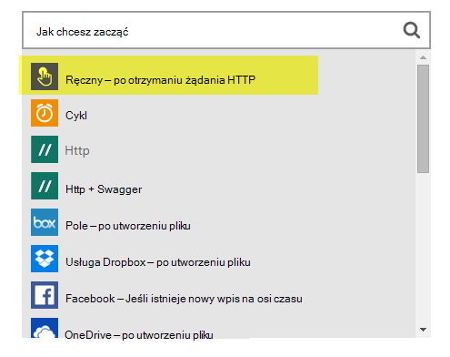

<properties 
    pageTitle="DocumentDB Zmienianie powiadomienia przy użyciu aplikacji logika | Microsoft Azure" 
    description="." 
    keywords="powiadomienie o zmianie"
    services="documentdb" 
    authors="hedidin" 
    manager="jhubbard" 
    editor="mimig" 
    documentationCenter=""/>

<tags 
    ms.service="documentdb" 
    ms.workload="data-services" 
    ms.tgt_pltfrm="na" 
    ms.devlang="rest-api" 
    ms.topic="article" 
    ms.date="09/23/2016" 
    ms.author="b-hoedid"/>

# <a name="notifications-for-new-or-changed-documentdb-resources-using-logic-apps"></a>Powiadomienia o nowych lub zmienionych zasobów DocumentDB, za pomocą aplikacji warunków logicznych

W tym artykule pochodzi pytanie I pokazano opublikowany w jedną na forach społeczności Azure DocumentDB. Pytanie zostało **DocumentDB czy obsługuje powiadomienia dla zasobów zmienione**?

I pracy z serwera BizTalk przez wiele lat, a jest bardzo typowy scenariusz, korzystając z [Karty LOB WCF](https://msdn.microsoft.com/library/bb798128.aspx). Dlatego I zdecydowała Zobacz jeśli można zduplikować tę funkcję w DocumentDB dla nowych i/lub zmodyfikowane dokumenty.

W tym artykule omówiono składniki rozwiązania powiadomienie o zmiany, które zawiera [wyzwalacza](documentdb-programming.md#trigger) i [Logiczny aplikacji](../app-service-logic/app-service-logic-what-are-logic-apps.md). Ważne fragmenty kodu znajdują się w tekście i całe rozwiązanie jest dostępny na [GitHub](https://github.com/HEDIDIN/DocDbNotifications).

## <a name="use-case"></a>Przypadek użycia

Następujący artykuł jest przypadków użycia, w tym artykule.

DocumentDB to repozytorium dokumentów kondycji poziom siedem międzynarodowe (HL7) szybkie służba zdrowia współdziałania zasobów (FHIR). Załóżmy, że DocumentDB bazy danych łączone z Twojej aplikacji logiki i interfejsu API uzupełnić serwer FHIR HL7.  Obiekt ochrony zdrowia jest przechowywanie danych pacjentów w DocumentDB "Pacjentów" bazy danych. Istnieje kilka kolekcji w pacjentów bazy danych. Kliniczne, identyfikacja, itp. Informacje o pacjentów podlega identyfikacji.  Masz kolekcję o nazwie "Pacjentów".

Dział Cardiology są śledzone danych osobowych zdrowia i wykonywanie. Wyszukiwanie rekordów pacjentów nowe lub zmodyfikowane jest czasochłonne. Ich monit działu informatycznego, jeśli został sposób ich otrzymują powiadomienie o nowej lub zmodyfikowanej pacjentów rekordów.  

Dział INFORMATYCZNY said, że można łatwo zapewniają to. Ta osoba mówi, że ich może przekazać dokumenty do [Magazyn obiektów Blob platformy Azure](https://azure.microsoft.com/services/storage/) , dział Cardiology można łatwo uzyskiwać do nich dostęp.

## <a name="how-the-it-department-solved-the-problem"></a>Jak rozwiązać ten problem, działu informatycznego

W celu utworzenia tej aplikacji, przez pracownika działu informatycznego danego modelu je najpierw.  Element i o używaniu Business Process Model and Notation (BPMN) jest zarówno technicznych, jak i zarówno osoby mogą go łatwo zrozumieć. Ten proces całego powiadomienie jest traktowany jako procesów biznesowych. 

## <a name="high-level-view-of-notification-process"></a>Ogólny widok procesu powiadamiania

1. Możesz uruchomić przy użyciu aplikacji logiczny, zawierający wyzwalacz czasomierza. Domyślnie program wyzwalacz jest uruchamiany co godzinę.
2. Następnie wykonaj HTTP POST do aplikacji logicznych.
3. Aplikacja logiczny wykonuje całą pracę.


### <a name="lets-take-a-look-at-what-this-logic-app-does"></a>Spójrzmy na działanie tej aplikacji warunków logicznych
Jeśli wyglądają na poniższej ilustracji istnieje kilka czynności w ramach przepływu pracy LogicApp.


Dostępne są następujące czynności:

1. Musisz uzyskać bieżącej daty/godziny UTC z aplikacji interfejsu API.  Wartość domyślna to godzinę poprzedniego.

2. Daty/godziny UTC jest konwertowana na format sygnatury czasowej systemu Unix. To jest domyślny format sygnatury czasowe w DocumentDB.

3. Publikowanie wartość dla aplikacji interfejsu API, która DocumentDB kwerendy. Wartość jest używane w kwerendzie.

    ```SQL
        SELECT * FROM Patients p WHERE (p._ts >= @unixTimeStamp)
    ```

    > [AZURE.NOTE] _Ts reprezentuje metadanych sygnatura czasowa dla wszystkich zasobów DocumentDB.

4. W przypadku znalezionych dokumentów treść odpowiedzi są wysyłane do usługi Magazyn obiektów Blob platformy Azure.

    > [AZURE.NOTE] Magazyn obiektów blob wymaga konta magazynu platformy Azure. Musisz obsługi administracyjnej konta magazyn obiektów Blob platformy Azure i dodawanie nowych obiektów Blob o nazwie pacjentów. Aby uzyskać więcej informacji zobacz [temat Azure miejsca do magazynowania kont](../storage/storage-create-storage-account.md) i [rozpocząć pracę z magazynem obiektów Blob platformy Azure](../storage/storage-dotnet-how-to-use-blobs.md).

5. Na koniec, który powiadomi odbiorcę liczby znalezionych dokumentów zostanie wysłana wiadomość e-mail. Jeśli nie znaleziono dokumentów, treść wiadomości e-mail będzie "0 znalezione dokumenty". 

Teraz, gdy masz ogólny obraz tego, co oznacza przepływ pracy, więc możemy przejść do w jaki sposób wdrożyć.

### <a name="lets-start-with-the-main-logic-app"></a>Zacznijmy od głównym aplikacji warunków logicznych

Jeśli nie znasz logiki aplikacji, są one dostępne w [Azure Marketplace](https://portal.azure.com/)i Dowiedz się więcej o ich w [Co to są aplikacje logiczny?](../app-service-logic/app-service-logic-what-are-logic-apps.md)

Po utworzeniu nowej aplikacji logiczny, zostanie wyświetlony monit **jak chcesz rozpocząć?**

Po kliknięciu wewnątrz pola tekstowego, masz do wyboru zdarzeń. Dla tej aplikacji logika wybierz pozycję **ręcznie - żądania HTTP po odebraniu** , tak jak pokazano poniżej.



### <a name="design-view-of-your-completed-logic-app"></a>Projektowanie widoku złożonym aplikacji warunków logicznych
Określanie przejść i Przeglądanie widoku złożonym projektu dla aplikacji logika nosi nazwę DocDB.


Podczas edytowania akcji w Projektancie aplikacji logiczny, masz wybrać **wyjść** z żądania HTTP lub poprzedniej akcji, jak pokazano poniżej akcji sendMail.


Przed każdej akcji w przepływie pracy można podejmowania decyzji; **Dodaj akcję** lub **Dodaj warunek** , jak pokazano na poniższym rysunku.


Po wybraniu **Dodaj warunek**, jak pokazano na poniższym rysunku, aby wprowadzić logiki są prezentowane przy użyciu formularza.  W zasadzie jest reguł biznesowych.  Po kliknięciu wewnątrz pola, masz do wyboru wybrać parametry poprzedniej akcji. Możesz również wprowadzić wartości bezpośrednio.


> [AZURE.NOTE] Istnieje również możliwość wprowadź wszystkie elementy w widoku kodu.

Spójrzmy na złożonym aplikacji logicznych w widoku kodu.  

```JSON
   
    "$schema": "https://schema.management.azure.com/providers/Microsoft.Logic/schemas/2015-08-01-preview/workflowdefinition.json#",
    "actions": {
        "Conversion": {
            "conditions": [
                {
                    "dependsOn": "GetUtcDate"
                }
            ],
            "inputs": {
                "method": "post",
                "queries": {
                    "currentdateTime": "@{body('GetUtcDate')}"
                },
                "uri": "https://docdbnotificationapi-debug.azurewebsites.net/api/Conversion"
            },
            "metadata": {
                "apiDefinitionUrl": "https://docdbnotificationapi-debug.azurewebsites.net/swagger/docs/v1",
                "swaggerSource": "custom"
            },
            "type": "Http"
        },
        "Createfile": {
            "conditions": [
                {
                    "expression": "@greater(length(body('GetDocuments')), 0)"
                },
                {
                    "dependsOn": "GetDocuments"
                }
            ],
            "inputs": {
                "body": "@body('GetDocuments')",
                "host": {
                    "api": {
                        "runtimeUrl": "https://logic-apis-westus.azure-apim.net/apim/azureblob"
                    },
                    "connection": {
                        "name": "@parameters('$connections')['azureblob']['connectionId']"
                    }
                },
                "method": "post",
                "path": "/datasets/default/files",
                "queries": {
                    "folderPath": "/patients",
                    "name": "Patient_@{guid()}.json"
                }
            },
            "type": "ApiConnection"
        },
        "GetDocuments": {
            "conditions": [
                {
                    "dependsOn": "Conversion"
                }
            ],
            "inputs": {
                "method": "post",
                "queries": {
                    "unixTimeStamp": "@body('Conversion')"
                },
                "uri": "https://docdbnotificationapi-debug.azurewebsites.net/api/Patient"
            },
            "metadata": {
                "apiDefinitionUrl": "https://docdbnotificationapi-debug.azurewebsites.net/swagger/docs/v1",
                "swaggerSource": "custom"
            },
            "type": "Http"
        },
        "GetUtcDate": {
            "conditions": [],
            "inputs": {
                "method": "get",
                "queries": {
                    "hoursBack": "@{int(triggerBody()['GetUtcDate_HoursBack'])}"
                },
                "uri": "https://docdbnotificationapi-debug.azurewebsites.net/api/Authorization"
            },
            "metadata": {
                "apiDefinitionUrl": "https://docdbnotificationapi-debug.azurewebsites.net/swagger/docs/v1",
                "swaggerSource": "custom"
            },
            "type": "Http"
        },
        "sendMail": {
            "conditions": [
                {
                    "dependsOn": "GetDocuments"
                }
            ],
            "inputs": {
                "body": "api_user=@{triggerBody()['sendgridUsername']}&api_key=@{triggerBody()['sendgridPassword']}&from=@{parameters('fromAddress')}&to=@{triggerBody()['EmailTo']}&subject=@{triggerBody()['Subject']}&text=@{int(length(body('GetDocuments')))} Documents Found",
                "headers": {
                    "Content-type": "application/x-www-form-urlencoded"
                },
                "method": "POST",
                "uri": "https://api.sendgrid.com/api/mail.send.json"
            },
            "type": "Http"
        }
    },
    "contentVersion": "1.0.0.0",
    "outputs": {
        "Results": {
            "type": "String",
            "value": "@{int(length(body('GetDocuments')))} Records Found"
        }
    },
    "parameters": {
        "$connections": {
            "defaultValue": {},
            "type": "Object"
        },
        "fromAddress": {
            "defaultValue": "user@msn.com",
            "type": "String"
        },
        "toAddress": {
            "defaultValue": "XXXXX@XXXXXXX.net",
            "type": "String"
        }
    },
    "triggers": {
        "manual": {
            "inputs": {
                "schema": {
                    "properties": {},
                    "required": [],
                    "type": "object"
                }
            },
            "type": "Manual"
        }
    
```

Jeśli nie znasz z różnych sekcjach w kodzie reprezentuje, możesz wyświetlić dokumentacji [Języka definicji logiki aplikacji przepływu pracy](http://aka.ms/logicappsdocs) .

Dla tego przepływu pracy są przy użyciu [Protokołu HTTP Webhook wyzwalacza](https://sendgrid.com/blog/whats-webhook/). Podczas przeglądania w kodzie powyżej, zostanie wyświetlony parametrów jak w następującym przykładzie.

```C#

    =@{triggerBody()['Subject']}

```

`triggerBody()` Reprezentuje parametry, które znajdują się w treści WPIS pozostałych do interfejsu API usługi REST aplikacji logicznych. `()['Subject']` Reprezentuje pole. Po wyświetleniu wszystkich tych parametrów uzupełnić JSON sformatowane treści. 

> [AZURE.NOTE] Za pomocą haczyka sieci Web, możesz mieć pełny dostęp do nagłówka i treści wezwania wyzwalacza. W tej aplikacji, która ma treści.

Jak już wspomniano, może używać projektanta, aby przypisać parametry lub w widoku kodu.
Jeśli możesz wykonać w widoku kodu, następnie do definiowania właściwości, które wymagają wartości, jak pokazano w poniższym przykładzie kodu. 

```JSON

    "triggers": {
        "manual": {
            "inputs": {
            "schema": {
                "properties": {
            "Subject": {
                "type" : "String"   

            }
            },
                "required": [
            "Subject"
                 ],
                "type": "object"
            }
            },
            "type": "Manual"
        }
        }
```

Co robią jest utworzenie schematu JSON, w którym będą przekazywane w z treści HTTP POST.
Uruchomienie wyzwalacz, konieczne będzie zwrotnego adresu URL.  Będzie się, jak do wygenerowania w dalszej części samouczka.  

## <a name="actions"></a>Akcje
Zobaczmy, co oznacza każdej akcji w naszym logikę aplikacji.

### <a name="getutcdate"></a>GetUTCDate

**Widok projektanta**


**Wyświetlanie kodu**

```JSON

    "GetUtcDate": {
            "conditions": [],
            "inputs": {
            "method": "get",
            "queries": {
                "hoursBack": "@{int(triggerBody()['GetUtcDate_HoursBack'])}"
            },
            "uri": "https://docdbnotificationapi-debug.azurewebsites.net/api/Authorization"
            },
            "metadata": {
            "apiDefinitionUrl": "https://docdbnotificationapi-debug.azurewebsites.net/swagger/docs/v1"
            },
            "type": "Http"
        },

```

Ta akcja HTTP wykonuje operację GET.  Wywołuje metodę interfejsu API aplikacji GetUtcDate. Identyfikator Uri użyto właściwości "GetUtcDate_HoursBack" przekazane do treści wyzwalacza.  Wartość "GetUtcDate_HoursBack" jest ustawiona w pierwszej aplikacji logicznych. Dowiesz się więcej o aplikacji logika wyzwalacza w dalszej części samouczka.

Ta akcja połączeń aplikacji interfejsu API zwraca wartość ciągu daty UTC.

#### <a name="operations"></a>Operacje

**Żądanie**

```JSON

    {
        "uri": "https://docdbnotificationapi-debug.azurewebsites.net/api/Authorization",
        "method": "get",
        "queries": {
          "hoursBack": "24"
        }
    }

```

**Odpowiedź**

```JSON

    {
        "statusCode": 200,
        "headers": {
          "pragma": "no-cache",
          "cache-Control": "no-cache",
          "date": "Fri, 26 Feb 2016 15:47:33 GMT",
          "server": "Microsoft-IIS/8.0",
          "x-AspNet-Version": "4.0.30319",
          "x-Powered-By": "ASP.NET"
        },
        "body": "Fri, 15 Jan 2016 23:47:33 GMT"
    }

```

Następnym krokiem jest do konwertowania wartości daty/godziny UTC na sygnatury czasowej systemu Unix, czyli typu Podwójna .NET.

### <a name="conversion"></a>Konwersja

##### <a name="designer-view"></a>Widok projektanta


##### <a name="code-view"></a>Wyświetlanie kodu

```JSON

    "Conversion": {
        "conditions": [
        {
            "dependsOn": "GetUtcDate"
        }
        ],
        "inputs": {
        "method": "post",
        "queries": {
            "currentDateTime": "@{body('GetUtcDate')}"
        },
        "uri": "https://docdbnotificationapi-debug.azurewebsites.net/api/Conversion"
        },
        "metadata": {
        "apiDefinitionUrl": "https://docdbnotificationapi-debug.azurewebsites.net/swagger/docs/v1"
        },
        "type": "Http"
    },

```

W tym kroku należy przekazać w wartości zwracanej z GetUTCDate.  Ma warunku dependsOn, co oznacza, że akcja GetUTCDate musi zostać pomyślnie ukończona. Jeśli nie, następnie ta akcja jest pomijany. 

Ta akcja połączeń aplikacji interfejsu API do obsługi konwersji.

#### <a name="operations"></a>Operacje

##### <a name="request"></a>Żądanie

```JSON

    {
        "uri": "https://docdbnotificationapi-debug.azurewebsites.net/api/Conversion",
        "method": "post",
        "queries": {
        "currentDateTime": "Fri, 15 Jan 2016 23:47:33 GMT"
        }
    }   
```

##### <a name="response"></a>Odpowiedź

```JSON

    {
        "statusCode": 200,
        "headers": {
          "pragma": "no-cache",
          "cache-Control": "no-cache",
          "date": "Fri, 26 Feb 2016 15:47:33 GMT",
          "server": "Microsoft-IIS/8.0",
          "x-AspNet-Version": "4.0.30319",
          "x-Powered-By": "ASP.NET"
        },
        "body": 1452901653
    }
```

W następnej akcji będzie wykonywać operacji WPIS na naszych aplikacji interfejsu API.

### <a name="getdocuments"></a>GetDocuments 

##### <a name="designer-view"></a>Widok projektanta


##### <a name="code-view"></a>Wyświetlanie kodu

```JSON

    "GetDocuments": {
        "conditions": [
        {
            "dependsOn": "Conversion"
        }
        ],
        "inputs": {
        "method": "post",
        "queries": {
            "unixTimeStamp": "@{body('Conversion')}"
        },
        "uri": "https://docdbnotificationapi-debug.azurewebsites.net/api/Patient"
        },
        "metadata": {
        "apiDefinitionUrl": "https://docdbnotificationapi-debug.azurewebsites.net/swagger/docs/v1"
        },
        "type": "Http"
    },

```

Akcja GetDocuments ma w celu przekazania w treści odpowiedzi od akcji konwersji. Jest to parametr w identyfikator Uri:

 
```C#

    unixTimeStamp=@{body('Conversion')}

```

Akcja QueryDocuments wykonuje operacje HTTP POST do aplikacji interfejsu API. 

Metoda o nazwie jest **QueryForNewPatientDocuments**.

#### <a name="operations"></a>Operacje

##### <a name="request"></a>Żądanie

```JSON

    {
        "uri": "https://docdbnotificationapi-debug.azurewebsites.net/api/Patient",
        "method": "post",
        "queries": {
        "unixTimeStamp": "1452901653"
        }
    }
```

##### <a name="response"></a>Odpowiedź

```JSON

    {
        "statusCode": 200,
        "headers": {
        "pragma": "no-cache",
        "cache-Control": "no-cache",
        "date": "Fri, 26 Feb 2016 15:47:35 GMT",
        "server": "Microsoft-IIS/8.0",
        "x-AspNet-Version": "4.0.30319",
        "x-Powered-By": "ASP.NET"
        },
        "body": [
        {
            "id": "xcda",
            "_rid": "vCYLAP2k6gAXAAAAAAAAAA==",
            "_self": "dbs/vCYLAA==/colls/vCYLAP2k6gA=/docs/vCYLAP2k6gAXAAAAAAAAAA==/",
            "_ts": 1454874620,
            "_etag": "\"00007d01-0000-0000-0000-56b79ffc0000\"",
            "resourceType": "Patient",
            "text": {
            "status": "generated",
            "div": "<div>\n      \n      <p>Henry Levin the 7th</p>\n    \n    </div>"
            },
            "identifier": [
            {
                "use": "usual",
                "type": {
                "coding": [
                    {
                    "system": "http://hl7.org/fhir/v2/0203",
                    "code": "MR"
                    }
                ]
                },
                "system": "urn:oid:2.16.840.1.113883.19.5",
                "value": "12345"
            }
            ],
            "active": true,
            "name": [
            {
                    "family": [
                        "Levin"
                    ],
                    "given": [
                        "Henry"
                    ]
                }
            ],
            "gender": "male",
            "birthDate": "1932-09-24",
            "managingOrganization": {
                "reference": "Organization/2.16.840.1.113883.19.5",
                "display": "Good Health Clinic"
            }
        },

```

Kolejną czynnością jest zapisywać dokumenty w [blogu Azure miejsca do magazynowania](https://azure.microsoft.com/services/storage/). 

> [AZURE.NOTE] Magazyn obiektów blob wymaga konta magazynu platformy Azure. Musisz obsługi administracyjnej konta magazyn obiektów Blob platformy Azure i dodawanie nowych obiektów Blob o nazwie pacjentów. Aby uzyskać więcej informacji zobacz [Rozpoczynanie pracy z magazynem obiektów Blob platformy Azure](../storage/storage-dotnet-how-to-use-blobs.md).

### <a name="create-file"></a>Tworzenie pliku

##### <a name="designer-view"></a>Widok projektanta


##### <a name="code-view"></a>Wyświetlanie kodu

```JSON

    {
    "host": {
        "api": {
            "runtimeUrl": "https://logic-apis-westus.azure-apim.net/apim/azureblob"
        },
        "connection": {
            "name": "subscriptions/fxxxxxc079-4e5d-b002-xxxxxxxxxx/resourceGroups/Api-Default-Central-US/providers/Microsoft.Web/connections/azureblob"
        }
    },
    "method": "post",
    "path": "/datasets/default/files",
    "queries": {
        "folderPath": "/patients",
        "name": "Patient_17513174-e61d-4b56-88cb-5cf383db4430.json"
    },
    "body": [
        {
            "id": "xcda",
            "_rid": "vCYLAP2k6gAXAAAAAAAAAA==",
            "_self": "dbs/vCYLAA==/colls/vCYLAP2k6gA=/docs/vCYLAP2k6gAXAAAAAAAAAA==/",
            "_ts": 1454874620,
            "_etag": "\"00007d01-0000-0000-0000-56b79ffc0000\"",
            "resourceType": "Patient",
            "text": {
                "status": "generated",
                "div": "<div>\n      \n      <p>Henry Levin the 7th</p>\n    \n    </div>"
            },
            "identifier": [
                {
                    "use": "usual",
                    "type": {
                        "coding": [
                            {
                                "system": "http://hl7.org/fhir/v2/0203",
                                "code": "MR"
                            }
                        ]
                    },
                    "system": "urn:oid:2.16.840.1.113883.19.5",
                    "value": "12345"
                }
            ],
            "active": true,
            "name": [
                {
                    "family": [
                        "Levin"
                    ],
                    "given": [
                        "Henry"
                    ]
                }
            ],
            "gender": "male",
            "birthDate": "1932-09-24",
            "managingOrganization": {
                "reference": "Organization/2.16.840.1.113883.19.5",
                "display": "Good Health Clinic"
            }
        },

```

Kod jest generowany z akcji w projektancie. Nie trzeba modyfikować kodu.

Jeśli nie znasz z za pomocą interfejsu API obiektów Blob platformy Azure, zobacz [Rozpoczynanie pracy z magazynem obiektów blob platformy Azure interfejsu API](../connectors/connectors-create-api-azureblobstorage.md).

#### <a name="operations"></a>Operacje

##### <a name="request"></a>Żądanie

```JSON

    "host": {
        "api": {
            "runtimeUrl": "https://logic-apis-westus.azure-apim.net/apim/azureblob"
        },
        "connection": {
            "name": "subscriptions/fxxxxxc079-4e5d-b002-xxxxxxxxxx/resourceGroups/Api-Default-Central-US/providers/Microsoft.Web/connections/azureblob"
        }
    },
    "method": "post",
    "path": "/datasets/default/files",
    "queries": {
        "folderPath": "/patients",
        "name": "Patient_17513174-e61d-4b56-88cb-5cf383db4430.json"
    },
    "body": [
        {
            "id": "xcda",
            "_rid": "vCYLAP2k6gAXAAAAAAAAAA==",
            "_self": "dbs/vCYLAA==/colls/vCYLAP2k6gA=/docs/vCYLAP2k6gAXAAAAAAAAAA==/",
            "_ts": 1454874620,
            "_etag": "\"00007d01-0000-0000-0000-56b79ffc0000\"",
            "resourceType": "Patient",
            "text": {
                "status": "generated",
                "div": "<div>\n      \n      <p>Henry Levin the 7th</p>\n    \n    </div>"
            },
            "identifier": [
                {
                    "use": "usual",
                    "type": {
                        "coding": [
                            {
                                "system": "http://hl7.org/fhir/v2/0203",
                                "code": "MR"
                            }
                        ]
                    },
                    "system": "urn:oid:2.16.840.1.113883.19.5",
                    "value": "12345"
                }
            ],
            "active": true,
            "name": [
                {
                    "family": [
                        "Levin"
                    ],
                    "given": [
                        "Henry"
                    ]
                }
            ],
            "gender": "male",
            "birthDate": "1932-09-24",
            "managingOrganization": {
                "reference": "Organization/2.16.840.1.113883.19.5",
                "display": "Good Health Clinic"
            }
        },….


```

##### <a name="response"></a>Odpowiedź

```JSON

    {
        "statusCode": 200,
        "headers": {
        "pragma": "no-cache",
        "x-ms-request-id": "2b2f7c57-2623-4d71-8e53-45c26b30ea9d",
        "cache-Control": "no-cache",
        "date": "Fri, 26 Feb 2016 15:47:36 GMT",
        "set-Cookie": "ARRAffinity=29e552cea7db23196f7ffa644003eaaf39bc8eb6dd555511f669d13ab7424faf;Path=/;Domain=127.0.0.1",
        "server": "Microsoft-HTTPAPI/2.0",
        "x-AspNet-Version": "4.0.30319",
        "x-Powered-By": "ASP.NET"
        },
        "body": {
        "Id": "0B0nBzHyMV-_NRGRDcDNMSFAxWFE",
        "Name": "Patient_47a2a0dc-640d-4f01-be38-c74690d085cb.json",
        "DisplayName": "Patient_47a2a0dc-640d-4f01-be38-c74690d085cb.json",
        "Path": "/Patient/Patient_47a2a0dc-640d-4f01-be38-c74690d085cb.json",
        "LastModified": "2016-02-26T15:47:36.215Z",
        "Size": 65647,
        "MediaType": "application/octet-stream",
        "IsFolder": false,
        "ETag": "\"c-g_a-1OtaH-kNQ4WBoXLp3Zv9s/MTQ1NjUwMTY1NjIxNQ\"",
        "FileLocator": "0B0nBzHyMV-_NRGRDcDNMSFAxWFE"
        }
    }
```

Ostatnim krokiem jest wysłanie wiadomości e-mail z powiadomieniem

### <a name="sendemail"></a>WyślijWiadomośćEmail

##### <a name="designer-view"></a>Widok projektanta


##### <a name="code-view"></a>Wyświetlanie kodu

```JSON


    "sendMail": {
        "conditions": [
        {
            "dependsOn": "GetDocuments"
        }
        ],
        "inputs": {
        "body": "api_user=@{triggerBody()['sendgridUsername']}&api_key=@{triggerBody()['sendgridPassword']}&from=@{parameters('fromAddress')}&to=@{triggerBody()['EmailTo']}&subject=@{triggerBody()['Subject']}&text=@{int(length(body('GetDocuments')))} Documents Found",
        "headers": {
            "Content-type": "application/x-www-form-urlencoded"
        },
        "method": "POST",
        "uri": "https://api.sendgrid.com/api/mail.send.json"
        },
        "type": "Http"
    }
```

Ta akcja służy do wysyłania wiadomości e-mail z powiadomieniem.  W przypadku korzystania z [SendGrid](https://sendgrid.com/marketing/sendgrid-services?cvosrc=PPC.Bing.sendgrib&cvo_cid=SendGrid%20-%20US%20-%20Brand%20-%20&mc=Paid%20Search&mcd=BingAds&keyword=sendgrib&network=o&matchtype=e&mobile=&content=&search=1&utm_source=bing&utm_medium=cpc&utm_term=%5Bsendgrib%5D&utm_content=%21acq%21v2%2134335083397-8303227637-1649139544&utm_campaign=SendGrid+-+US+-+Brand+-+%28English%29).   

Kod ten został wygenerowany logiki aplikacji i SendGrid w [repozytorium Github 101-logiczny aplikacji sendgrid](https://github.com/Azure/azure-quickstart-templates/tree/master/101-logic-app-sendgrid)przy użyciu szablonu.
 
Operacja HTTP jest WPIS. 

Parametry autoryzacji są we właściwościach wyzwalacza

```JSON

    },
        "sendgridPassword": {
             "type": "SecureString"
         },
         "sendgridUsername": {
            "type": "String"
         }

        In addition, other parameters are static values set in the Parameters section of the Logic App. These are:
        },
        "toAddress": {
            "defaultValue": "XXXX@XXXX.com",
            "type": "String"
        },
        "fromAddress": {
            "defaultValue": "XXX@msn.com",
            "type": "String"
        },
        "emailBody": {
            "defaultValue": "@{string(concat(int(length(actions('QueryDocuments').outputs.body)) Records Found),'/n', actions('QueryDocuments').outputs.body)}",
            "type": "String"
        },

```

EmailBody jest łączenia liczbę dokumentów zwrócone przez kwerendę, która może być "0" lub więcej, razem z, "Znaleziono rekordów". Pozostałe parametry są skonfigurowane z parametrów wyzwalacza.

Ta akcja zależy od akcji **GetDocuments** .

#### <a name="operations"></a>Operacje

##### <a name="request"></a>Żądanie
```JSON

    {
        "uri": "https://api.sendgrid.com/api/mail.send.json",
        "method": "POST",
        "headers": {
        "Content-type": "application/x-www-form-urlencoded"
        },
        "body": "api_user=azureuser@azure.com&api_key=Biz@Talk&from=user@msn.com&to=XXXX@XXXX.com&subject=New Patients&text=37 Documents Found"
    }

```

##### <a name="response"></a>Odpowiedź

```JSON

    {
        "statusCode": 200,
        "headers": {
        "connection": "keep-alive",
        "x-Frame-Options": "DENY,DENY",
        "access-Control-Allow-Origin": "https://sendgrid.com",
        "date": "Fri, 26 Feb 2016 15:47:35 GMT",
        "server": "nginx"
        },
        "body": {
        "message": "success"
        }
    }
```

Ponadto ma być widoczne wyniki z Twojej aplikacji logicznych w Azure Portal. Aby to zrobić, możesz dodać parametr do sekcji wyjściowe.


```JSON

    "outputs": {
        "Results": {
            "type": "String",
            "value": "@{int(length(actions('QueryDocuments').outputs.body))} Records Found"
        }

```

To zwraca tej samej wartości, które są wysyłane w treści wiadomości e-mail. Na poniższej ilustracji pokazano przykład, w którym "29 rekordów znaleziono".


## <a name="metrics"></a>Metryki
Możesz skonfigurować monitorowania głównym aplikacji logicznych w portalu. Umożliwia wyświetlanie opóźnienie uruchamianie i inne zdarzenia, jak wyświetlić na poniższym rysunku.


## <a name="docdb-trigger"></a>DocDb wyzwalacza

Ta aplikacja logiczny jest wyzwalacz uruchomić przepływ pracy na głównym aplikacji logicznych.

Na poniższej ilustracji pokazano widok projektanta.


```JSON

    {
        "$schema": "https://schema.management.azure.com/providers/Microsoft.Logic/schemas/2015-08-01-preview/workflowdefinition.json#",
        "actions": {
        "Http": {
            "conditions": [],
            "inputs": {
            "body": {
                "EmailTo": "XXXXXX@XXXXX.net",
                "GetUtcDate_HoursBack": "24",
                "Subject": "New Patients",
                "sendgridPassword": "********",
                "sendgridUsername": "azureuser@azure.com"
            },
            "method": "POST",
            "uri": "https://prod-01.westus.logic.azure.com:443/workflows/12a1de57e48845bc9ce7a247dfabc887/triggers/manual/run?api-version=2015-08-01-preview&sp=%2Ftriggers%2Fmanual%2Frun&sv=1.0&sig=ObTlihr529ATIuvuG-dhxOgBL4JZjItrvPQ8PV6973c"
            },
            "type": "Http"
        }
        },
        "contentVersion": "1.0.0.0",
        "outputs": {
        "Results": {
            "type": "String",
            "value": "@{body('Http')['status']}"
        }
        },
        "parameters": {},
        "triggers": {
        "recurrence": {
            "recurrence": {
            "frequency": "Hour",
            "interval": 24
            },
            "type": "Recurrence"
        }
        }
    }

```

Wyzwalacz zostanie ustawiony dla cyklu 24 godziny. Akcja jest WPIS HTTP w korzystającego zwrotnego adresu URL głównym aplikacji logika. Treść zawiera parametry, które są określane w schemacie JSON. 

#### <a name="operations"></a>Operacje

##### <a name="request"></a>Żądanie

```JSON

    {
        "uri": "https://prod-01.westus.logic.azure.com:443/workflows/12a1de57e48845bc9ce7a247dfabc887/triggers/manual/run?api-version=2015-08-01-preview&sp=%2Ftriggers%2Fmanual%2Frun&sv=1.0&sig=ObTlihr529ATIuvuG-dhxOgBL4JZjItrvPQ8PV6973c",
        "method": "POST",
        "body": {
        "EmailTo": "XXXXXX@XXXXX.net",
        "GetUtcDate_HoursBack": "24",
        "Subject": "New Patients",
        "sendgridPassword": "********",
        "sendgridUsername": "azureuser@azure.com"
        }
    }

```

##### <a name="response"></a>Odpowiedź

```JSON

    {
        "statusCode": 202,
        "headers": {
        "pragma": "no-cache",
        "x-ms-ratelimit-remaining-workflow-writes": "7486",
        "x-ms-ratelimit-burst-remaining-workflow-writes": "1248",
        "x-ms-request-id": "westus:2d440a39-8ba5-4a9c-92a6-f959b8d2357f",
        "cache-Control": "no-cache",
        "date": "Thu, 25 Feb 2016 21:01:06 GMT"
        }
    }
```

Teraz Przyjrzyjmy się z aplikacji interfejsu API.

## <a name="docdbnotificationapi"></a>DocDBNotificationApi

Mimo że istnieje kilka czynności w aplikacji, tylko zamierzasz używać trzech.

* GetUtcDate
* ConvertToTimeStamp
* QueryForNewPatientDocuments

### <a name="docdbnotificationapi-operations"></a>Operacje DocDBNotificationApi
Zapoznajmy się z dokumentacją Swagger

> [AZURE.NOTE] Aby umożliwić nawiązywanie połączenia operacje na zewnątrz, musisz dodać CORS dozwolona wartość origin "*" (bez cudzysłowów) w obszarze Ustawienia aplikacji interfejsu API jak pokazano na poniższym rysunku.


#### <a name="getutcdate"></a>GetUtcDate


#### <a name="converttotimestamp"></a>ConvertToTimeStamp


#### <a name="queryfornewpatientdocuments"></a>QueryForNewPatientDocuments


Spójrzmy na kodu źródłowego tej operacji.

#### <a name="getutcdate"></a>GetUtcDate

```C#

    /// <summary>
    /// Gets the current UTC Date value
    /// </summary>
    /// <returns></returns>
    [H ttpGet]
    [Metadata("GetUtcDate", "Gets the current UTC Date value minus the Hours Back")]
    [SwaggerOperation("GetUtcDate")]
    [SwaggerResponse(HttpStatusCode.OK, type: typeof (string))]
    [SwaggerResponse(HttpStatusCode.InternalServerError, "Internal Server Operation Error")]
    public string GetUtcDate(
       [Metadata("Hours Back", "How many hours back from the current Date Time")] int hoursBack)
    {


        return DateTime.UtcNow.AddHours(-hoursBack).ToString("r");
    }
```

Operacja po prostu zwraca dane bieżącej daty/godziny UTC minus wartość HoursBack.

#### <a name="converttotimestamp"></a>ConvertToTimeStamp

``` C#

        /// <summary>
        ///     Converts DateTime to double
        /// </summary>
        /// <param name="currentdateTime"></param>
        /// <returns></returns>
        [Metadata("Converts Universal DateTime to number")]
        [SwaggerResponse(HttpStatusCode.OK, null, typeof (double))]
        [SwaggerResponse(HttpStatusCode.BadRequest, "DateTime is invalid")]
        [SwaggerResponse(HttpStatusCode.InternalServerError)]
        [SwaggerOperation(nameof(ConvertToTimestamp))]
        public double ConvertToTimestamp(
            [Metadata("currentdateTime", "DateTime value to convert")] string currentdateTime)
        {
            double result;

            try
            {
                var uncoded = HttpContext.Current.Server.UrlDecode(currentdateTime);

                var newDateTime = DateTime.Parse(uncoded);
                //create Timespan by subtracting the value provided from the Unix Epoch
                var span = newDateTime - new DateTime(1970, 1, 1, 0, 0, 0, 0).ToLocalTime();

                //return the total seconds (which is a UNIX timestamp)
                result = span.TotalSeconds;
            }
            catch (Exception e)
            {
                throw new Exception("unable to convert to Timestamp", e.InnerException);
            }

            return result;
        }

```

Operacja konwertuje odpowiedzi z operacji GetUtcDate na wartość podwójną.

#### <a name="queryfornewpatientdocuments"></a>QueryForNewPatientDocuments

```C#

        /// <summary>
        ///     Query for new Patient Documents
        /// </summary>
        /// <param name="unixTimeStamp"></param>
        /// <returns>IList</returns>
        [Metadata("QueryForNewDocuments",
            "Query for new Documents where the Timestamp is greater than or equal to the DateTime value in the query parameters."
            )]
        [SwaggerOperation("QueryForNewDocuments")]
        [SwaggerResponse(HttpStatusCode.OK, type: typeof (Task<IList<Document>>))]
        [SwaggerResponse(HttpStatusCode.BadRequest, "The syntax of the SQL Statement is incorrect")]
        [SwaggerResponse(HttpStatusCode.NotFound, "No Documents were found")]
        [SwaggerResponse(HttpStatusCode.InternalServerError, "Internal Server Operation Error")]
        // ReSharper disable once ConsiderUsingAsyncSuffix
        public IList<Document> QueryForNewPatientDocuments(
            [Metadata("UnixTimeStamp", "The DateTime value used to search from")] double unixTimeStamp)
        {
            var context = new DocumentDbContext();
            var filterQuery = string.Format(InvariantCulture, "SELECT * FROM Patient p WHERE p._ts >=  {0}",
                unixTimeStamp);
            var options = new FeedOptions {MaxItemCount = -1};


            var collectionLink = UriFactory.CreateDocumentCollectionUri(DocumentDbContext.DatabaseId,
                DocumentDbContext.CollectionId);

            var response =
                context.Client.CreateDocumentQuery<Document>(collectionLink, filterQuery, options).AsEnumerable();

            return response.ToList();
    }

```

Operacja używa [DocumentDB.NET SDK](documentdb-sdk-dotnet.md) utworzyć kwerendę dokumentu. 

```C#
     CreateDocumentQuery<Document>(collectionLink, filterQuery, options).AsEnumerable();
```

Odpowiedzi z operacji ConvertToTimeStamp (unixTimeStamp) jest przekazywana. Operacja zwraca listę dokumentów, `IList<Document>`.

Wcześniej zajmowaliśmy CallbackURL. Aby uruchomić przepływ pracy w głównym aplikacji logiczny, należy nawiązać połączenie przy użyciu CallbackURL.

## <a name="callbackurl"></a>CallbackURL

Aby rozpocząć, musisz tokenu usługi Azure AD.  Może być trudne uzyskać dostęp do tej token. Została szukasz metody proste i Hollan Marcin, kto jest menedżerem programu Azure logiki aplikacji, zaleca się przy użyciu [armclient](http://blog.davidebbo.com/2015/01/azure-resource-manager-client.html) w programie PowerShell.  Możesz zainstalować go, wykonując instrukcje podane.

Operacje, który ma być wyświetlany są logowania i połączeń interfejsu API ARM.
 
Nazwa użytkownika: Użyj tych samych poświadczeń do logowania do Azure Portal. 

Operacja połączeń interfejsu Api ARM jest generowany z CallBackURL.

W programie PowerShell połączenia ją w następujący sposób:  

```powershell

    ArmClient.exe post https://management.azure.com/subscriptions/[YOUR SUBSCRIPTION ID/resourcegroups/[YOUR RESOURCE GROUP]/providers/Microsoft.Logic/workflows/[YOUR LOGIC APP NAME/triggers/manual/listcallbackurl?api-version=2015-08-01-preview

```

Wynik powinna wyglądać następująco:

```powershell

    https://prod-02.westus.logic.azure.com:443/workflows/12a1de57e48845bc9ce7a247dfabc887/triggers/manual/run?api-version=2015-08-01-prevaiew&sp=%2Ftriggers%2Fmanual%2Frun&sv=1.0&sig=XXXXXXXXXXXXXXXXXXX

```

Narzędzie, takie jak [postman](http://www.getpostman.com/) umożliwia testowanie głównym aplikacji logika jak pokazano na poniższym rysunku.


W poniższej tabeli wymieniono parametry wyzwalacza, które składają się części aplikacji logika wyzwalacza DocDB.

Parametr | Opis 
--- | --- 
GetUtcDate_HoursBack | Można określić liczbę godzin daty rozpoczęcia wyszukiwania
sendgridUsername | Można określić liczbę godzin daty rozpoczęcia wyszukiwania
sendgridPassword | Nazwa użytkownika siatki wysyłanie wiadomości e-mail
Wiadomość e-mail, aby | Adres e-mail, które będą otrzymywać powiadomienia e-mail
Temat | Temat wiadomości e-mail

## <a name="viewing-the-patient-data-in-the-azure-blob-service"></a>Wyświetlanie danych pacjentów w usłudze obiektów Blob platformy Azure

Przejdź do swojego konta magazynu platformy Azure, a następnie wybierz obiektów blob w obszarze usług, jak pokazano na poniższym rysunku.

 

Będzie można wyświetlać informacje o pliku pacjentów obiektów blob tak jak pokazano poniżej.


## <a name="summary"></a>Podsumowanie

W tym przykładzie użytkownik nauczył się następujące czynności:

* Istnieje możliwość wprowadzenia w życie powiadomienia w DocumentDB.
* Za pomocą aplikacji logiczny, można zautomatyzować proces.
* Za pomocą aplikacji logiczny, można zmniejszyć czas potrzebny do przeprowadzania aplikacji.
* Za pośrednictwem protokołu HTTP łatwe mogą używać aplikacji interfejsu API w aplikacji logicznych.
* Możesz łatwo utworzyć CallBackURL, który zastępuje odbiornika protokołu HTTP.
* Przy użyciu projektanta aplikacji logika łatwo można utworzyć niestandardowe przepływy pracy.

Klucz jest planowanie i modelowanie przepływu pracy.

## <a name="next-steps"></a>Następne kroki
Pobierz i przy użyciu kodu aplikacji logika opisane na [Github](https://github.com/HEDIDIN/DocDbNotifications). Zaprosić do tworzenia aplikacji i przesyłanie zmian repo. 

Aby dowiedzieć się więcej na temat DocumentDB, odwiedź stronę [Ścieżka nauki](https://azure.microsoft.com/documentation/learning-paths/documentdb/).
