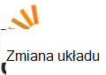

<properties
  pageTitle="DocumentDB społeczności użytkowników i grup dyskusyjnych | Microsoft Azure"
  description="Dołącz do społeczności Azure DocumentDB do tworzenia relacji, zaprezentowania pracy i sprecyzowania swoje umiejętności."
  services="documentdb"
  documentationCenter=""
  authors="aliuy"
  manager="johnmac"
  editor="mimig"/>

<tags
  ms.service="documentdb"
  ms.devlang="na"
  ms.topic="article"
  ms.tgt_pltfrm="na"
  ms.workload="data-services"
  ms.date="09/26/2016"
  ms.author="andrl"/>

# Portal Społecznościowy

## Polecane społeczności

Pozwól nam promowanie projektu! Pokazują klienci projektu, nad którymi pracuje z DocumentDB, a pomożemy udostępniać swojej genius na świecie. Aby przesłać projektu, Wyślij do nas wiadomość e-mail na: [askdocdb@microsoft.com](mailto:askdocdb@microsoft.com).

### documentdb-lumenize

*przez Larry Maccherone*

Agregacje (Grupuj według, Tabela przestawna, a N-wymiarowe modułu) i Rejestrowanie chronometrażu przekształcenia serii jako procedur składowanych w DocumentDB.

Wyewidencjonuj ją na [Github](https://github.com/lmaccherone/documentdb-lumenize) i [npm](https://www.npmjs.com/package/lumenize).

### DocumentDB Studio

*przez Ming Liu*

Klient zarządzania podglądu Eksploratora usługi Microsoft Azure DocumentDB.

Wyewidencjonuj ją na [Github](https://github.com/mingaliu/DocumentDBStudio).

### DoQmentDB

*przez Ariel Mashraki*

DoQmentDB jest Node.js opartych na zobowiązanie klientem, która zapewnia warstwy MongoDB przypominających u góry DocumentDB.

Wyewidencjonuj ją na [Github](https://github.com/a8m/doqmentdb) i [npm](https://www.npmjs.com/package/doqmentdb).

### Swagger dla DocumentDB interfejsu API usługi REST

*przez Edidin Howarda*

Plik DocumentDB pozostałych interfejsu API Swagger, który można łatwo wdrożyć jako aplikacji interfejsu API.

Wyewidencjonuj ją na [Github](https://github.com/HEDIDIN/DocumentDB-REST/tree/master/DocumentDBRestApi).

### Fluent documentdb wtyczki

*przez Yoichi Kawasaki*

Fluent documentdb dodatek jest dodatek Fluentd wyprowadzania do Azure DocumentDB.

Wyewidencjonuj ją na [Github](https://github.com/yokawasa/fluent-plugin-documentdb) i [rubygems](https://rubygems.org/gems/fluent-plugin-documentdb).

*Znajdź więcej Otwórz źródło projekty DocumentDB na [GitHub](https://github.com/search?p=4&q=documentdb&type=Repositories).*

## Wiadomości, blogów i artykuły

Możesz pozostawać w DocumentDB najnowsze i funkcje, następujące [blog poświęcony](https://azure.microsoft.com/blog/tag/documentdb/).

**Wpisów społeczności:**

- [**Rozpoczęcie społecznościowych z DocumentDB**](https://blogs.msdn.microsoft.com/mvpawardprogram/2016/03/15/going-social-with-documentdb/) - *przez Matias Quarantaas*

- [**UWP, usługi aplikacji Azure i zup DocumentDB: udostępnianie fotografii aplikacji**](https://blogs.windows.com/buildingapps/2016/03/17/uwp-azure-app-services-and-documentdb-soup-a-photo-sharing-app/) - *przez Langland marek*

- [**Powiadomienia o nowych lub zmienionych zasobów DocumentDB, za pomocą aplikacji logika**](documentdb-change-notification.md) - *przez Edidin Howarda*

- [**Zbieranie dzienników w celu DocumentDB Azure za pomocą fluent documentdb dodatek**](http://unofficialism.info/posts/collecting-logs-into-azure-documentdb-using-fluent-plugin-documentdb/) - *przez Yoichi Kawasaki*

- [**DocumentDB poprawione część 1/2 — teorii**](https://peterintheazuresky.wordpress.com/2016/02/19/documentdb-revisited-part-12-the-theory/) - *przez Mannerhult Peterowi*

- [**Co należy lubisz a wypowiedzi szerzące o DocumentDB Azure i**](http://blog.falafel.com/4-what-to-love-and-hate-about-azures-documentdb/) - *przez Jerzy Saadeh*

- [**Azure DocumentDB po stronie serwera skryptów**](https://www.simple-talk.com/cloud/cloud-data/azure-documentdb-server-side-scripting/) - *przez Roberta Sheldon*

- [**Zlew DocumentDB jako źródła danych dla analizy strumieniu Azure**](http://janatdevelopment.com/2015/12/11/documentdb-as-a-data-sink-for-azure-stream-analytics/?utm_source=twitterfeed&utm_medium=twitter) - *przez Hentschel sty*

- [**Azure DocumentDB produkcji!** ](http://blog.nexapp.ca/2015/11/30/azure-documentdb-in-production/)  -  *Walsha Alexandre i Duval Olivier Marcowi*

- [**Indeksatory Azure wyszukiwania — DocumentDB zapytań (hiszpański)**](http://www.ealsur.com.ar/wp/index.php/2015/11/19/azure-search-indexers-documentdb-queries/) - *przez Matthias Quaranta*

- [**Azure DocumentDB SQL kwerendy — informacje podstawowe (japoński)**](http://beachside.hatenablog.com/entry/2015/12/06/000045) - *przez Atsushi Yokohama*

- [**Punkty danych — Aurelia spełnia DocumentDB: Podróży Matchmaker**](https://msdn.microsoft.com/magazine/mt620011.aspx) - *przez Lerman Aneta*

- [**Infrastruktura jako kod i ciągły wdrażania Node.js + Azure rozwiązanie DocumentDB**](http://www.talmeida.net/blog/2015/10/26/infrastructure-as-code-and-continuous-deployment-of-a-nodejs-azure-documentdb-solution) - *przez Thiago Almedia*

- [**Dlaczego DocumentDb sens dobrego biznesowego w przypadku niektórych projektów**](http://www.iquestllc.com/blogs/read/405/why-documentdb-makes-good-business-sense-for-some-projects) - *przez Samuel Uresin*

- [**Azure DocumentDB rozwoju przenoszony do przodu — rozwoju klasy klienta (1, 2) (japoński)**](http://beachside.hatenablog.com/entry/2015/10/01/202734) - *przez Atsushi Yokohama*

- [**Co należy wiedzieć podczas korzystania z platformy Azure DocumentDB (japoński)**](http://beachside.hatenablog.com/entry/2015/10/01/202734) - *przez Atsushi Yokohama*

- [**Zajmujących się RequestRateTooLarge błędów w Azure DocumentDB i testowanie wydajności**](http://blogs.msdn.com/b/bigdatasupport/archive/2015/09/02/dealing-with-requestratetoolarge-errors-in-azure-documentdb-and-testing-documentdb-performance.aspx) - *przez Azim Uddin*

- [**Punkty danych — omówienie platformy Microsoft Azure DocumentDB**](https://msdn.microsoft.com/magazine/mt147238.aspx) - *przez Lerman Aneta*

- [**Za pomocą DocumentDB F #**](https://jamessdixon.wordpress.com/2014/12/30/using-documentdb-with-f/) - *przez Dixon Joanna*

- [**Dzienniki aplikacji analizy z DocumentDB**](http://vincentlauzon.com/2015/09/06/analysing-application-logs-with-documentdb/) - *przez Vincent Philippe Lauzon*

- [**Azure DocumentDB — punktu w czasie wykonywania kopii zapasowych**](http://softwarejuancarlos.com/2015/09/06/azure-documentdb-point-in-time-backups/) - *, Juan Artur Sanchez*

*Czy masz wpisu w blogu, przykładowy kod lub analiza przypadku, który chcesz udostępnić? [Powiedz nam](mailto:askdocdb@microsoft.com)!*

## Zdarzenia i nagrania

### Ostatnich i informacje o nadchodzących wydarzeniach

| Nazwa zdarzenia                                                                                                                 | Głośnik                                                     | Lokalizacja             | Data                     | Hashtagu |
| -------------------------------------------------------------------------------------------------------------------------- | ----------------------------------------------------------- | -------------------- | ------------------------ | ------- |
| [Zapalają 2016](https://myignite.microsoft.com/sessions?q=documentdb)  [Głównych: Transformacja cyfrowy nadmierne efektywność działań związanych z A.C.I.D za pomocą Sirosh Josephowi Włącz](https://myignite.microsoft.com/sessions/34953)  [Sesja: DocumentDB Azure na ogromną skalę: desenie sukcesu i projektu klienta z Syam Kumar Nair i Liu osoby o imieniu Andrzej](https://myignite.microsoft.com/sessions/3066)  [Sesja: Zarządzanie zasobami IoT za pomocą Node.js i DocumentDB z Ciesielska Marcin](https://myignite.microsoft.com/sessions/39704)  [Sesja: Tworzenie sprawniejszą i skalowalność aplikacji usługi bazy danych Microsoft Azure za pomocą Tara Jana i Moshe Gutman](https://myignite.microsoft.com/sessions/2633)| Osoby o imieniu Andrzej Liu, Syam Kumar Nair i Tara Jana | Atlanta, GA | 26-30 września 2016 | [#MSIgnite](https://twitter.com/MS_Ignite) |
| [Meetup u Ignite: DocumentDB: zaawansowane funkcje dla aplikacji na dużą skalę](http://www.meetup.com/Azure-in-the-ATL/events/234252070/) | Osoby o imieniu Andrzej Liu, Syam Kumar Nair |  Atlanta, GA | 27 września 2016 | [#MSIgnite](https://twitter.com/MS_Ignite)[@FlatironCity](https://twitter.com/FlatironCity) |
| [Strata + Hadoop świata](http://conferences.oreilly.com/strata/hadoop-big-data-ny/?cmp=kn-data-confreg-home-stny16_bing_branded) | Zostanie dodane później, odwiedź nasz stoiska! | Warszawa, Polska | 26 – 29 września 2016 | [#StrataConf](https://twitter.com/strataconf) |
| [Grupa Użytkownicy kapitału miasto .NET](http://www.meetup.com/tally-dot-net/events/233768568/) | Santosh Hari | Tallahassee, FL | 3 listopada 2016 | n/d! |

*Czy czytanie w czy hostingu zdarzenia? [Powiedz nam](mailto:askdocdb@microsoft.com) jak możemy pomóc!*

### Poprzednie zdarzenia i nagrania

| Nazwa zdarzenia                                                                                                                 | Głośnik                                                     | Lokalizacja             | Data                   | Rejestrowanie |
| -------------------------------------------------------------------------------------------------------------------------- | ----------------------------------------------------------- | -------------------- | ---------------------- | --------- |
| [DevTeach](http://devteach.com/) | Ken Cenerelli  | Kanadzie Montrealu | 4-8 lipca 2016 | [NoSQL żadnych problemów, przy użyciu Azure DocumentDB](http://www.slideshare.net/KenCenerelli) |
| [Integracja i IoT](http://www.btug.be/events) | Eldert Grootenboer | Kontich, Belgia | 30 czerwca 2016 | n/d! |
| [MongoDB świata 2016](https://www.mongodb.com/world16) | Kirill Gavrylyuk | Nowy Jork, Nowy Jork | 28-29 czerwca 2016 | n/d! |
| [Integracja z programem grupy użytkowników](http://www.integrationusergroup.com/do-logic-apps-support-error-handling/) | Howard S. Edidin | Emisja w sieci Web | 20 czerwca 2016 | [Logika aplikacje obsługują obsługi błędów?](http://www.integrationusergroup.com/do-logic-apps-support-error-handling/) |
| [Meetup: Grupy użytkowników Azure USA](http://www.meetup.com/UKAzureUserGroup/events/229673468/)| Liu osoby o imieniu Andrzej  | Londyn, Zjednoczone Królestwo | 12 maja 2016 | n/d!
|[Meetup: ONETUG - grupy użytkowników .NET Orlando](http://www.meetup.com/ONETUG/events/230797164/)| Santosh Hari| Orlando, FL| 12 maja 2016| n/d! 
| [SQLBits XV](https://sqlbits.com/)                                                                                         | Osoby o imieniu Andrzej Liu, Aravind Ramachandran                            | Liverpool, Zjednoczone Królestwo        | 4-7 maja 2016            | n/d!| 
| [Meetup: Grupy Deweloperzy .NET Warszawa](http://www.meetup.com/NYC-NET-Developers/events/230396260/)                            | Leonard Lobel                                               | Nowy Jork, NY    | 21 kwietnia 2016           | n/d! |
| [Integracja z programem grupy użytkowników](http://www.integrationusergroup.com/#)                                                            | Edidin Howarda                                               | Seminarium w sieci Web              | 25 kwietnia 2016           | n/d! |
| [Globalne Azure Bootcamp: SoCal](http://xprs.imcreator.com/free/vishalishere/gab2016)                                        | Leonard Lobel                                               | Pomarańczowy, urząd certyfikacji           | 16 kwietnia 2016           | n/d! |
| [Globalne Bootcamp Azure: Redmond](https://www.eventbrite.com/e/2016-global-azure-bootcamp-redmond-wa-tickets-21387752343)   | David Makogon                                               | Redmond, WA          | 16 kwietnia 2016           | n/d! |
| [SQL sobota 481 # - Izrael 2016](http://www.sqlsaturday.com/481/Sessions/Details.aspx?sid=40912)                          | Leonard Lobel                                               | HaMerkaz, Israel     | 04 kwietnia 2016         | n/d! |
| [Tworzenie 2016](https://build.microsoft.com/)                                                                                 | Jan Macintyre                                              | Łódź, urząd certyfikacji    | 31 marca 2016         | [Dostarczanie aplikacji w skali DocumentDB, bazy danych i Azure NoSQL dokumentu](https://channel9.msdn.com/Events/Build/2016/B840)
| [SQL sobota 505 # - Belgia 2016](http://www.sqlsaturday.com/505/Sessions/Details.aspx?sid=44217)                         | Mihail Mateev                                               | Antwerpia, Belgia     | 19 marca 2016         | n/d! |
| [Meetup: CloudTalk](http://www.meetup.com/CloudTalk/events/227963695/)                                                     | Kirat Pandya                                                | Międzyzdrojach, WA         | 3 marca 2016          | n/d! |
| [Meetup: Austin Azure](http://www.meetup.com/azureaustin/events/228209275/)                                                | Merwan Chinta                                               | Austin, TX           | 28 stycznia 2016 r.       | n/d! |
| [Meetup: msdevmtl](http://www.meetup.com/msdevmtl/events/223839818/)                                                       | Lauzon Vincent Philippe                                     | Montrealu QC, Kanadzie | 1 grudnia 2015 r.       | n/d! |
| [Meetup: SeattleJS](http://www.meetup.com/seattlejs/events/220102664/)                                                     | David Makogon                                               | Seattle, WA          | 12 listopada 2015 r.      | n/d! |
| [PRZEKAZAĆ Szczyt 2015 r.](http://www.sqlpass.org/summit/2015/)                                                                    | Marcin Renz, osoby o imieniu Andrzej Hoh, Aravind Ramachandran, Jan Macintyre | Seattle, WA          | Października 2015 r 27-30    | [Tworzenie aplikacji nowoczesny Azure](https://www.youtube.com/watch?v=k5Z24HX-RyQ) |
| [CloudDevelop 2015 r.](http://www.clouddevelop.org/)                                                                          | David Makogon, Crawcour: marek                                | Columbus, OH         | 23 października 2015 r.       | n/d! |
| [SQL sobota 454 # - Turyn 2015 r.](http://www.sqlsaturday.com/454/Sessions/Details.aspx?sid=40130)                           | Nittis De makr                                             | Turyn, Włochy         | 10 października 2015 r.       | n/d! |
| [SQL sobota 430 # - Sofii 2015 r.](http://www.sqlsaturday.com/430/Sessions/Details.aspx?sid=36090)                           | Leonard Lobel                                               | Sofia, Bułgaria      | 10 października 2015 r.       | n/d! |
| [SQL sobota 444 # - Kansas City 2015 r.](http://www.sqlsaturday.com/444/Sessions/Details.aspx?sid=38576)                     | Marcin Renz                                                   | Kansas City, MIE      | 3 października 2015 r.        | n/d! |
| [SQL sobota 429 # - Porto 2015 r.](http://www.sqlsaturday.com/429/Sessions/Details.aspx?sid=36089)                          | Leonard Lobel                                               | Porto, Portugalia     | 3 października 2015 r.        | n/d! |
| [AzureCon](https://azure.microsoft.com/azurecon/)                                                                          | David Makogon, Crawcour: marek, Jan Macintyre                | Wydarzenie wirtualne        | 29 września 2015 r.     | [Azure platformy danych i analizy](https://channel9.msdn.com/events/Microsoft-Azure/AzureCon-2015/ACON207) [Praca z danymi NoSQL w DocumentDB](https://channel9.msdn.com/Events/Microsoft-Azure/AzureCon-2015/ACON338) |
| [SQL sobota 434 # — Holandia 2015 r.](http://www.sqlsaturday.com/434/Sessions/Details.aspx?sid=36413)                         | Leonard Lobel                                               | Utrecht, Holandia | 26 września 2015 r.     | [Wprowadzenie do Azure DocumentDB](https://channel9.msdn.com/Blogs/Windows-Azure/SQL-Saturday-Holland-2015-Introduction-to-Azure-DocumentDB) |
| [SQL sobota 441 # - Zakopanego 2015 r.](http://www.sqlsaturday.com/441/Sessions/Details.aspx?sid=39191)                          | Marcin Renz                                                   | Zakopanego, CO           | 19 września 2015 r.     | n/d! |
| [Meetup: Obszar San Francisco kieszeni deweloperów Azure](http://www.meetup.com/bayazure/events/223943785/)                        | Liu osoby o imieniu Andrzej                                                  | Łódź, urząd certyfikacji    | 15 września 2015 r.     | n/d! |
| [Grupy użytkowników Azure Białoruś spełniają Up](https://www.facebook.com/events/786540124800276/)                                       | Zyl Macieja                                                    | Mińsk, Białoruś       | 9 września 2015 r.      | [Wprowadzenie do DocumentDB omówienie pojęcia, poziomy spójności, strategie sharding](https://www.youtube.com/watch?v=Uc_qwWzJKH8) |
| [Teraz NoSQL!](http://nosql2015.dataversity.net/)                                                                            | David Makogon, Crawcour: marek                                | San Jose, CA         | Sierpnia 18-20, 2015 r.     | n/d! |
| [@ScaleSeattle](http://www.atscaleconference.com/)                                                                        | Dharma Shukla                                               | Seattle, WA          | 17 czerwca 2015 r.          | [Niezależne od schematu indeksowania przy użyciu Azure DocumentDB](https://www.youtube.com/watch?v=VJQ_5qFFVP4) |
| [Odświeżanie tech 2015 r.](https://channel9.msdn.com/Events/DXPortugal/Tech-Refresh-2015)                                         | Bruno Lopes                                                 | Lizbona, Portugalia     | 15 czerwca 2015 r.          | [DocumentDB 101](https://channel9.msdn.com/Events/DXPortugal/Tech-Refresh-2015/DPDEV01) |
| [SQL sobota 417 # - Sri Lanki 2015 r.](http://www.sqlsaturday.com/417/Sessions/Details.aspx?sid=21415)                       | Mihail Mateev                                               | Kolombo, Sri Lanki   | 06 czerwca 2015 r.          | n/d! |
| [Meetup: Meetup skalowalność Seattle](http://www.meetup.com/Seattle-Scalability-Meetup/events/204010442/)                    | Dharma Shukla                                               | Seattle, WA          | 27 maj 2015 r.           | n/d! |
| [SQL sobota 377 # - Kijowie 2015 r.](http://www.sqlsaturday.com/377/Sessions/Details.aspx?sid=20322)                            | Mihail Mateev                                               | Kijowie, Ukraina        | 23 maj 2015 r.           | n/d! |
| [Miesiąc bazy danych](http://www.databasemonth.com/database/azure-documentdb)                                                   | Dharma Shukla                                               | Warszawa, Polska         | 19 maj 2015 r.           | [Azure DocumentDB: Usługa bazy danych znacznym stopniu skalowalna, dzierżawy wielu dokumentów](https://www.youtube.com/watch?v=iZsqBc3Dkbk) |
| [Meetup: Grupy użytkowników Londyn SQL Server](http://www.meetup.com/London-SQL-Server-User-Group/events/221525058/)               | Allan Bento                                              | Londyn, Zjednoczone Królestwo           | 19 maj 2015 r.           | n/d! |
| [DevIntersection](https://devintersection.com/)                                                                            | Liu osoby o imieniu Andrzej                                                  | Scottsdale, w-m       | Maj 18-21 2015 r.        | n/d! |
| [Meetup: Grupy Deweloperzy aplikacji sieci Web Seattle](http://www.meetup.com/Seattle-Web-App-Developers-Group/events/220591071/)       | Liu osoby o imieniu Andrzej                                                  | Seattle, WA          | 14 maj 2015 r.           | n/d! |
| [Zapalają](http://ignite.microsoft.com/)                                                                                     | Osoby o imieniu Andrzej Hoh, Jan Macintyre                                  | Chicago, IL          | Maj 4-8 2015 r.          | [Wybierz najnowszą z DocumentDB wideo](https://azure.microsoft.com/documentation/videos/microsoft-ignite-2015-select-latest-from-microsoft-azure-documentdb/) [DocumentDB i Azure HDInsight: razem lepiej wideo](https://azure.microsoft.com/documentation/videos/microsoft-ignite-2015-microsoft-azure-documentdb-and-azure-hdinsight-better-together/) |
| [Tworzenie 2015 r.](http://www.buildwindows.com/)                                                                                 | Crawcour: marek                                               | Łódź, urząd certyfikacji    | Kwiecień 29 – 1 maj 2015 r. | [Tworzenie następne rozwiązanie duży z usługą NoSQL Azure firmy: DocumentDB](https://channel9.msdn.com/Events/Build/2015/2-729) |
| [Globalne Azure Bootcamp 2015 r - Hiszpania](http://azurebootcamp.es/)                                                             | Luis Ruiz Pavon, Gonzales Roberto                           | Madryt, Hiszpania        | 25 kwietnia 2015 r.         | [#DEAN DocumentDB + Express + AngularJS + NodeJS uruchomionych Azure](https://channel9.msdn.com/events/Developers-Spain-Events/Global-Azure-Bootcamp-2015/DEAN-DocumentDB--Express--AngularJS--NodeJS-running-on-Azure) |
| [Meetup: Dania Azure GrupaUżytkowników](http://www.meetup.com/Azure-Usergroup-Denmark/events/221026670/)                         | Ewa Holm Diget                                        | Kopenhaga, Dania  | 16 kwietnia 2015 r.         | n/d! |
| [Meetup: Chmury firmy Microsoft Charlotte](http://www.meetup.com/Charlotte-Microsoft-Cloud/events/221503519/)                     | Joanna Rance                                                 | Charlotte, NC        | 8 kwietnia 2015 r.          | n/d! |
| [SQL sobota 375 # - Dolinie Krzemowej 2015 r.](http://www.sqlsaturday.com/375/Sessions/Details.aspx?sid=15289)                  | IKE Ellis                                                   | Widok gór, urząd certyfikacji    | 28 marca 2015 r.         | n/d! |
| [Meetup: Stambuł Azure Meetup](http://www.meetup.com/istanbul-azure-meetup/events/220325538/)                             | Daron Yondem                                                | Istambuł, Turcja     | 7 marca 2015 r.          | n/d! |
| [Meetup: grupy użytkowników .net obszar lak Wielkiej](http://www.meetup.com/Great-Lakes-Area-NET-User-Group-MIGANG/events/220364576/) | Jacek Collier                                             | Southfield, MI       | 18 lutego 2015 r.      | n/d! |
| [TechX Azure](https://www.youtube.com/channel/UCDRlI2E4z5qmHsBXTrFOE2Q)                                                    | Magnus Mårtensson                                           | Sztokholm, Szwecja    | Stycznia 2015 r 28-29    | [DocumentDB platformy Azure NoSQL nowych opcji dla chmury](https://www.youtube.com/watch?v=Hw7hDYoChNI) |

### Klipy wideo i podkasty

| Pokaż                                        | Głośnik                     | Data               | Odcinka |
| ------------------------------------------- | --------------------------- | ------------------ | ------- |
| Kanał 9: Firma Microsoft + Otwórz źródło          | Jose Miguel Parrella         | 14 kwietnia 2016    | [Od wartości średniej do DEAN platformy Azure z Bitnami, zestawy skali maszyn wirtualnych i DocumentDB](https://channel9.msdn.com/Blogs/Open/From-MEAN-to-DEAN-in-Azure-with-Bitnami-VM-Scale-Sets-and-DocumentDB) |
| Wired2WinWebinar                            | Sai Sankar Kunnathukuzhiyil | 9 marca 2016      | [Tworzenie rozwiązań przy użyciu Azure DocumentDB](https://www.youtube.com/watch?v=xKttEwXv_bs)
| Integracja z programem grupy użytkowników                      | Hanowi Wong                    | 17 lutego 2016  | [Analizowanie i wizualizowanie danych-relacyjnych za pomocą DocumentDB + Power BI](http://www.integrationusergroup.com/analyze-visualize-non-relational-data-documentdb-power-bi/) |
| Azure podkastów                           | Skaluj Teeter                 | 14 stycznia 2016 r.   | [Odcinka 110: Za pomocą DocumentDB i wyszukiwania](http://azpodcast.azurewebsites.net/post/Episode-110-Using-DocumentDB-Search) |
| Kanał 9: Nowoczesne aplikacje              | Tara Shankar Jana           | 13 grudnia 2016  | [Sporządzanie nowoczesny podejście do danych w aplikacji](https://channel9.msdn.com/Series/Modern-Applications/Take-a-modern-approach-to-data-in-your-apps) |
| NinjaTips                                   | Miguel Quintero             | 10 grudnia 2015 r.  | [DocumentDB - vistazo wyczyść ogólne](https://channel9.msdn.com/Series/Ninja-Tips/31-NinjaTips-Desarrollo-DocumentDB-1-Vistazo-general) |
| Integracja z programem grupy użytkowników                      | Edidin Howarda               | 9 listopada 2015 r.   | [Azure DocumentDB integracji ochrony zdrowia — część 2](http://www.integrationusergroup.com/azure-documentdb-for-healthcare-integration-part-2/) |
| Integracja z programem grupy użytkowników                      | Edidin Howarda               | 5 października 2015 r.    | [Azure DocumentDB ochrony zdrowia integracji](http://www.integrationusergroup.com/?event=azure-documentdb-and-biztalk) |
| Włochy DX - #TecHeroes                       | Alessandro Melchiori        | 2 października 2015 r.    | [#TecHeroes — DocumentDB](https://channel9.msdn.com/Shows/TecHeroes/TecHeroes-DocumentDB) |
| Pokaż chmury firmy Microsoft — podkastów              | Liu osoby o imieniu Andrzej                  | 30 września 2015 r. | [099 odcinka - Azure DocumentDB z Liu osoby o imieniu Andrzej](http://www.microsoftcloudshow.com/podcast/Episodes/099-azure-documentdb-with-andrew-liu) |
| Skały .NET!  -Podkastów                      | Crawcour: marek               | 29 września 2015 r. | [Dane dotyczące DocumentDB z CrawCour: marek](https://www.dotnetrocks.com/?show=1197) |
| Dane podsumowującymi                                | Crawcour: marek               | 28 września 2015 r. | [Co nowego w programie Azure DocumentDB od GA](https://channel9.msdn.com/Shows/Data-Exposed/Whats-New-with-Azure-DocumentDB-Since-GA) |
| Azure podkastów                           | Skaluj Teeter                 | 17 września 2015 r. | [94 odcinka: azpodcast.com Zmień — architektura](http://azpodcast.azurewebsites.net/post/Episode-94-azpodcastcom-re-architecture) |
| Strona tytułowa chmury                                 | Crawcour: marek               | 4 września 2015 r.  | [Odcinka 185: Zaktualizowana DocumentDB CrawCour: marek](https://channel9.msdn.com/Shows/Cloud+Cover/Episode-185-DocDB-Updates-with-Ryan-CrawCour) |
| CodeChat 033                                | Gregowi Doerr                  | 28 lipca 2015 r.      | [Gregowi Doerr na Azure DocumentDB](https://channel9.msdn.com/Shows/codechat/033) |
| Centralny NoSql                               | Wilder króla                 | 25 maj 2015 r.       | [Śledzenie Golf — omówienie wideo na temat tworzenia aplikacji sieci web u góry AngularJS, WebApi 2 i DocumentDB.](http://www.nosqlcentral.net/Story/Details/videos/kahanu/1-documentdb-golf-tracker-overview) |
| Wirtualna rozdziału przebiegu technologii w pamięci | Stephen Baron               | 25 maj 2015 r.       | [Witaj DocumentDB](https://www.youtube.com/watch?v=itFXQCd9-dI) |
| Dane podsumowującymi                                | Crawcour: marek               | 8 kwietnia 2015 r.      | [Dostępność ogólne DocumentDB i co nowego.](https://channel9.msdn.com/Shows/Data-Exposed/DocumentDB-General-Availability-and-Whats-New) |
| Dane podsumowującymi                                | Liu osoby o imieniu Andrzej                  | 17 marca 2015 r.     | [Java SDK dla DocumentDB](https://channel9.msdn.com/Shows/Data-Exposed/Java-SDK-for-DocumentDB) |
| #DevHangout                                 | Gustaw Alzate Sandoval     | 11 marca 2015 r.     | [DocumentDB, la bazowy datos de NoSql de Microsoft Azure](https://www.youtube.com/watch?v=8Ud3jB8KOBA) |
| Architektura danych wirtualnych przebiegu rozdziałów      | IKE Ellis                   | 25 lutego 2015 r.  | [Wprowadzenie do DocumentDB](https://www.youtube.com/watch?v=7BQYdFUkz6s) |

### Zajęcia online

| Nauka partnera                                                                                                                                                                      | Opis |
| ------------------------------------------------------------------------------------------------------------------------------------------------------------------------------------- | ----------- |
|  | [**Microsoft Virtual Academy**](https://mva.microsoft.com/en-US/training-courses/deploying-web-apps-to-azure-app-service-16629) umożliwia szkolenia od osób, które ułatwia tworzenie Azure DocumentDB. |
|                                                       | [**Pluralsight**](http://www.pluralsight.com/courses/azure-documentdb-introduction) jest kluczowym partnerem firmy Microsoft usługi Azure szkoleniowe. Jeśli subskrybentów MSDN, aby uzyskać dostęp do szkolenia Microsoft Azure za pomocą z zalet. |
|                                                  | [**OpsGility**](https://www.opsgility.com/courses/player/introduction_to_azure_documentdb) zawiera szkolenie głębokich techniczne dotyczące Microsoft Azure. Uzyskaj przez instruktora szkolenia na miejscu lub za pośrednictwem zdalnego klasy przez ich instruktorów potwierdzone branży. |

## Dyskusji

### Twitter

Obserwuj nam w serwisie twitter [@DocumentDB](https://twitter.com/DocumentDB) i bądź na bieżąco z najnowszych konwersacji na hashtagu [#DocumentDB](https://twitter.com/hashtag/DocumentDB) .

### Fora usługi online

| Forum dostawcy                                                                                                                  | Opis |
| ------------------------------------------------------------------------------------------------------------------------------- | ----------- |
|  | Niezależny od języka wspólnie edytować pytanie i odpowiedzi witryny dla programistów. Obserwowanie znacznika naszych: [azure documentdb](http://stackoverflow.com/questions/tagged/azure-documentdb) |
|                                 | Dobre miejsce do pomocy technicznej i opinie dotyczące funkcji Microsoft Azure i usług, takich jak witryny sieci Web, DocumentDB itd. |

## Skontaktuj się z zespołem

Potrzebujesz pomocy? Masz pytania? Zastanawiasz się, czy NoSQL jest właściwie dobierane za Ciebie? Możesz [Harmonogram rozmów 1:1, bezpośrednio z zespół inżynierów DocumentDB](http://www.askdocdb.com/). Można także premia nam wiadomość [e-mail](mailto:askdocdb@microsoft.com) lub tweet z nami u [@DocumentDB](https://twitter.com/DocumentDB). 

## Otwórz źródło projektów

Projekty te aktywnie są tworzone przez zespół Azure DocumentDB we współpracy z naszej społeczności Otwórz źródło.

### SDK

| Platformy | Github                                                                      | Pakiet |
| -------- | --------------------------------------------------------------------------- | ------- |
| Node.js  | [Azure documentdb węzła](https://github.com/Azure/azure-documentdb-node)     | [npm](https://www.npmjs.com/package/documentdb) |
| Java     | [Azure-documentdb-java](https://github.com/Azure/azure-documentdb-java)     | [Środowiska maven](http://search.maven.org/#search%7Cga%7C1%7Ca%3A%22azure-documentdb%22) |
| Python   | [Azure-documentdb-python](https://github.com/Azure/azure-documentdb-python) | [PyPI](https://pypi.python.org/pypi/pydocumentdb) |

### Innych projektów

| Nazwa                | Github                                                                                            | Witryna sieci Web |
| ------------------- | ------------------------------------------------------------------------------------------------- | ------- |
| Dokumentacja       | [zawartość Azure](https://github.com/Azure/azure-content/tree/master/articles/documentdb)           | [Dokumentacja witryny sieci Web](https://azure.microsoft.com/documentation/services/documentdb/) |
| Łącznik Hadoop    | [Azure — documentdb — hadoop](https://github.com/Azure/azure-documentdb-hadoop)                       | [Środowiska maven](http://search.maven.org/#search%7Cga%7C1%7Ca%3A%22azure-documentdb-hadoop%22) |
| Narzędzia do migracji danych | [Azure-documentdb-datamigrationtool](https://github.com/Azure/azure-documentdb-datamigrationtool) | [Centrum pobierania Microsoft](http://www.microsoft.com/en-us/download/details.aspx?id=46436) |

## Kreatorzy DocumentDB

Kreatorzy DocumentDB są kierownicy społeczności, które zostały jawne przykładowy zaangażowanie ułatwienia innych osób w pełni wykorzystać doświadczeniami z Azure DocumentDB. Ich udostępnianie ich szczególnych męczennica, wiedzy rzeczywistych i wiedzy technicznej społeczności i zespołowi DocumentDB.

Kreator | Obraz 
 --- | --- 
 [Allan Bento](https://twitter.com/allansqlis) |  
 [Mieszadło Mac](https://twitter.com/jenstirrup) |             
 [Lenni Lobel](https://twitter.com/lennilobel) |  |          
 [Mihail Mateev](https://twitter.com/mihailmateev) |  |
 [Larry Maccherone](https://twitter.com/lmaccherone) |  
 [Edidin Howarda](https://twitter.com/hsedidin) |  
 [Santosh Hari](https://twitter.com/_s_hari) |  

Chcesz się Kreator DocumentDB? W trakcie nie wzorzec dla staje się Kreator DocumentDB kryteriów, który jest ustalenie należą wpływu nominacji służąca do forów online, takich jak zdarzeń StackOverflow i MSDN; witryny typu wiki i zawartości online; konferencje i grup użytkowników; podkasty, witryny, blogi i społecznościowych; i artykuły i książek. Można wyznaczyć samodzielnie lub inną osobę, wysyłając [wiadomość e-mail](mailto:askdocdb@microsoft.com).
