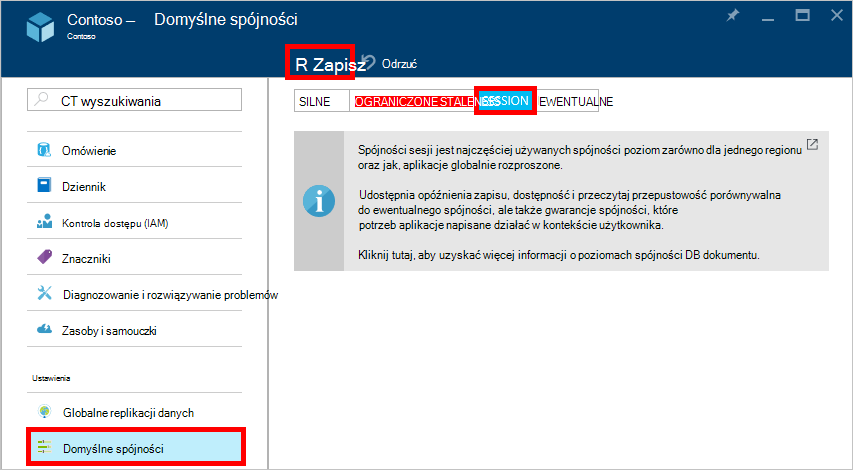

<properties
    pageTitle="Poziomy spójności w DocumentDB | Microsoft Azure"
    description="DocumentDB składa się z czterech poziomów spójności ułatwiające spójności ewentualne saldo, dostępność i opóźnienie korzystnych rozwiązań."
    keywords="ewentualne spójności, documentdb azure, Microsoft azure"
    services="documentdb"
    authors="syamkmsft"
    manager="jhubbard"
    editor="cgronlun"
    documentationCenter=""/>

<tags
    ms.service="documentdb"
    ms.workload="data-services"
    ms.tgt_pltfrm="na"
    ms.devlang="na"
    ms.topic="article"
    ms.date="08/24/2016"
    ms.author="syamk"/>

# Poziomy spójności w DocumentDB

Azure DocumentDB zaprojektowano od podstaw w górę z rozkładem globalnej pamiętać. Jest przeznaczony do oferowania gwarancje przewidywalne krótki czas oczekiwania, SLA dostępność 99,99% i wiele modeli przejrzyste obniżone spójności. Obecnie DocumentDB zawiera cztery poziomy spójności: silne, ograniczone staleness, sesji i ewentualne. Oprócz **znaczący** i **ewentualnego spójności** modeli często oferowane przez innych NoSQL baz danych, DocumentDB również oferuje dwie modeli spójności starannie wersja i operationalized — **ograniczony staleness** i **sesji**i potwierdził ich użyteczności przed przypadków użycia rzeczywistych. Zbiorowo poziomy te cztery spójności umożliwiają tworzenie dobrze uzasadnieniem korzystnych rozwiązań między spójności, dostępność i opóźnienie. 

## Zakres spójności

Szczegółowości spójności jest ograniczone do żądania pojedynczego użytkownika. Żądanie zapisu może odpowiadać Wstawianie, Zamień, upsert lub usunąć transakcji (z lub bez wykonywania skojarzone wyzwalacza pre lub post). Lub żądania zapisu może odpowiadać transakcji wykonanie procedury JavaScript przechowywane pracy nad wiele dokumentów w partycją. Podobnie jak w przypadku zapisu, transakcji odczytu/kwerenda jest również ograniczone na żądanie pojedynczego użytkownika. Użytkownik może być konieczna podzielony na strony nad duży zestaw wyników, obejmujące wiele partycje, ale czytanie każdej transakcji jest ograniczone do jednej strony i obsługiwane w obrębie jedną partycją.

## Poziomy zgodności

Domyślny poziom spójności można skonfigurować na Twoim koncie bazy danych, zastosowany do wszystkich zbiorów (we wszystkich baz danych) na koncie bazy danych. Domyślnie wszystkie Odczyt i kwerendach wydane przed zasobów zdefiniowane przez użytkownika będzie używany domyślny poziom spójności określony na koncie bazy danych. Można jednak odpoczynku poziom spójności żądanie określonych odczytu/kwerendy, określając nagłówku żądania [[x-ms spójności poziom]](https://msdn.microsoft.com/library/azure/mt632096.aspx) . Istnieją cztery typy poziomów spójności obsługiwane przez protokół replikacji DocumentDB, które zapewniają wyczyść zależność między gwarancje określone spójności i wydajność, zgodnie z poniższym opisem.

![Dobrze DocumentDB oferuje wiele określona modeli spójności (obniżone) do wyboru][1]

**Silne**: 

- Silne spójności oferuje gwarancję [linearizability](https://aphyr.com/posts/313-strong-consistency-models) z odczytywane gwarantowana zwraca najbardziej aktualną wersję dokumentu. 
- Silne spójności gwarantuje, że zapisu tylko jest widoczny, gdy zostanie trwale zatwierdzone przez kworum Większość replik. Zapisu albo synchronicznie stara trwale podstawowych i kworum pomocnicze lub została przerwana. Odczytu jest zawsze potwierdzone przez większość przeczytaj kworum, klienta nigdy nie widzą zapisu niezatwierdzonym lub jego części i zawsze jest gwarantowana odczytywanie najnowszych uznanego zapisu. 
- DocumentDB konta, które zostały skonfigurowane do używania silnych spójności nie można skojarzyć więcej niż jeden region Azure przy użyciu swojego konta DocumentDB. 
- Koszt operacja odczytu (pod względem [jednostki żądania](documentdb-request-units.md) zużyte) z silnych spójności jest wyższy niż sesji i ewentualnego, ale samo jak staleness ograniczona.
 

**Bounded staleness**: 

- Ograniczone gwarancje spójności staleness, które odczytywane może zwłoki za zapisy przez co najwyżej *K* wersji i prefiksy dokumentu lub *t* przedziału czasu. 
- W związku z tym podczas wybierania ograniczone staleness, "staleness" można skonfigurować na dwa sposoby: 
    - Numer wersji *K* dokumentu, w którym odczytywane zwłoki za zapisy
    - Interwał *t* 
- Ograniczone staleness ofert globalny zamówienia z wyjątkiem w oknie"staleness". Należy zauważyć, że gwarancje monotoniczna odczytu istnieje w regionie zarówno wewnątrz, jak i spoza "staleness okna". 
- Ograniczone staleness zapewnia gwarancję spójności silniejszego niż sesji lub ewentualne zgodności. Globalne rozłożone aplikacji zalecamy, ograniczone staleness możesz używać dla scenariuszy, miejsce, w którym chcesz mieć znaczący spójności, ale również chcesz 99,99% dostępności i małe opóźnienia. 
- Z kont DocumentDB DocumentDB konta, które skonfigurowano spójności ograniczonych staleness można skojarzyć dowolną liczbę Azure regionów. 
- Koszt operacja odczytu (pod względem RUs zużyte) z ograniczoną staleness jest większa niż sesji i ewentualnego spójności, ale taka sama, jak silne spójności.

**Sesji**: 

- W przeciwieństwie do oferowanych przez staleness znaczący i ograniczonych spójności poziomy modeli globalną spójność spójności sesji jest ograniczone do sesji klienta. 
- Spójności sesji to idealne rozwiązanie w przypadku wszystkich scenariuszy, gdzie urządzenie lub użytkownika sesji polega ponieważ gwarantuje monotoniczna Odczyt, monotoniczna zapisu oraz Odczyt gwarantuje własne zapisy (RYW). 
- Spójności sesji zapewnia spójność przewidywalne sesji, a maksymalna przeczytaj przepustowość zapewniając przy tym zapisy opóźnienie najniższych i Odczyt. 
- Z kont DocumentDB DocumentDB konta, które zostały skonfigurowane z sesji spójności można skojarzyć dowolną liczbę Azure regionów. 
- Koszt operacja odczytu (pod względem RUs zużyte) z poziomu spójności sesji jest mniejsze niż znaczący i ograniczonych staleness, ale więcej niż ewentualne spójności
 

**Ewentualne**: 

- Ewentualne spójności gwarantuje, że w przypadku braku wszelkie dodatkowe zapisy repliki należący do grupy zostanie po pewnym czasie zbieżne. 
- Ewentualne spójności jest formularzu najsłabszego spójności miejsce, w którym klient może zostać wyświetlony wartości, które są starsze niż te, które miały pojawiały.
- Ewentualne spójności zapewnia najsłabszego spójność odczytu, ale zapewnia najniższe opóźnienie dla odczytu i zapisu.
- Z kont DocumentDB DocumentDB konta, które skonfigurowano ewentualne spójności można skojarzyć dowolną liczbę Azure regionów. 
- Koszt operacja odczytu (pod względem RUs zużyte) z ewentualne spójności jest najniższe wszystkich poziomów spójności DocumentDB poziom.

## Gwarancje zgodności

Poniższa tabela przechwytuje różnych gwarancje spójności odpowiadające spójności czterech poziomów.

| Gwarancji                                                         |    Silne                                       |    Ograniczone Staleness                                                                           |    Sesji                                       |    Ewentualne                                 |
|----------------------------------------------------------|-------------------------------------------------|------------------------------------------------------------------------------------------------|--------------------------------------------------|--------------------------------------------------|
|    **Globalne zamówienia**                                |    Tak                                          |    Tak, poza okna"staleness"                                                      |    Nie, kolejność częściowego "sesji"                   |    Brak                                            |
|    **Spójne prefiks gwarancji**                       |    Tak                                          |    Tak                                                                                         |    Tak                                           |    Tak                                           |
|    **Odczyt monotoniczna**                                   |    Tak                                          |    Tak, w regionach poza okno staleness i w obszarze cały czas.     |    Tak, dla danej sesji                    |    Brak                                            |
|    **Zapisywanie monotoniczna**                                  |    Tak                                          |    Tak                                                                                         |    Tak                                           |    Tak                                           |
|    **Przeczytaj do zapisu**                                  |    Tak                                          |    Tak                                                                                         |    Tak (w obszarze zapisu)                      |    Brak                                            |

## Konfigurowanie domyślnego poziomu spójności

1.  W [portalu Azure](https://portal.azure.com/)w Jumpbar kliknij przycisk **DocumentDB (NoSQL)**.

2. W karta **DocumentDB (NoSQL)** wybierz konto bazy danych, aby zmodyfikować.

3. W karta konta kliknij przycisk **domyślne spójności**.

4. W karta **Spójności domyślny** wybierz nowy poziom spójności i kliknij przycisk **Zapisz**.

    

## Poziomy spójności dla kwerend

Domyślnie dla zasobów zdefiniowane przez użytkownika poziomu spójności dla kwerend jest taki sam poziom spójności do odczytu. Domyślnie indeks jest aktualizowana synchronicznie na każdym insert, Zamień lub Usuń dokument do kolekcji. Dzięki temu kwerendy przestrzegać tego samego poziomu spójności, który odczytuje dokumentu. A DocumentDB jest zapisu zoptymalizowana pod obsługuje stałej ilości zapisu dokumentu, konserwacji synchroniczne indeksu i serwowania spójne kwerend, można skonfigurować określonych zbiorów lazily zaktualizować ich indeksu. Indeksowanie z opóźnieniem dodatkowo zwiększa wydajność zapisu i jest idealne rozwiązanie w przypadku scenariuszy spożyciu zbiorcze, gdy obciążenie pracą jest przede wszystkim dużej odczytu.  

Tryb indeksowania|  Odczytuje|  Kwerendy  
-------------|-------|---------
Takie samo (ustawienie domyślne)|   Wybierz jedną z staleness znaczący, ograniczone, sesji lub ostateczną|    Wybierz jedną z staleness znaczący, ograniczone, sesji lub ewentualne|
Leniwego|   Wybierz jedną z staleness znaczący, ograniczone, sesji lub ostateczną|    Ewentualne  

Jako żądaniami odczytu, można obniżanie poziomu spójności żądanie określonej kwerendy, określając nagłówek [x-ms spójności poziom](https://msdn.microsoft.com/library/azure/mt632096.aspx) .

## Następne kroki

Jeśli chcesz wykonać odczytu więcej o poziomach spójności oraz kompromisów, zaleca się następujące zasoby:

-   Terry Dougowi. Omówienie zreplikowanej spójności danych za pośrednictwem baseball (wideo).   
[https://www.youtube.com/watch?v=gluIh8zd26I](https://www.youtube.com/watch?v=gluIh8zd26I)
-   Terry Dougowi. Omówienie zreplikowanej spójności danych za pośrednictwem baseball.   
[http://Research.microsoft.com/pubs/157411/ConsistencyAndBaseballReport.PDF](http://research.microsoft.com/pubs/157411/ConsistencyAndBaseballReport.pdf)
-   Terry Dougowi. Gwarancje sesji słabo spójnych danych zreplikowanej.   
[http://DL.ACM.org/CITATION.cfm?id=383631](http://dl.acm.org/citation.cfm?id=383631)
-   Krzysztof Abadi. Kompromisów spójności w nowoczesne projektowania systemów baz danych Distributed: zakończenie jest tylko część artykułu ".   
[http://Computer.org/CSDL/mags/co/2012/02/mco2012020037-ABS.HTML](http://computer.org/csdl/mags/co/2012/02/mco2012020037-abs.html)
-   Peterowi Bailis Shivaram Venkataraman, Michael J. Franklin, Josephowi M. Hellerstein, jon Stoica. Prawdopodobieństwa ograniczone Staleness (Telefonicznych) praktyczne kworum częściowej.   
[http://vldb.org/pvldb/vol5/p776_peterbailis_vldb2012.PDF](http://vldb.org/pvldb/vol5/p776_peterbailis_vldb2012.pdf)
-   Werner Vogels. Ewentualne spójne — poprawione.    
[http://allthingsdistributed.com/2008/12/eventually_consistent.HTML](http://allthingsdistributed.com/2008/12/eventually_consistent.html)

[1]: ./media/documentdb-consistency-levels/consistency-tradeoffs.png
