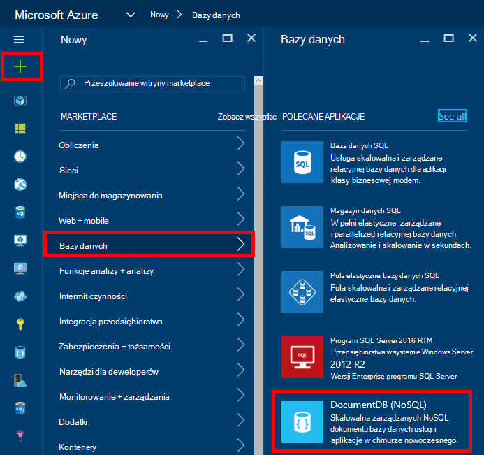
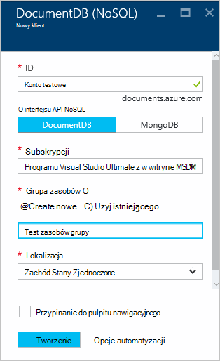
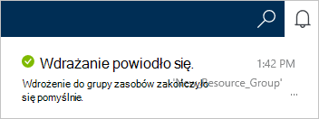
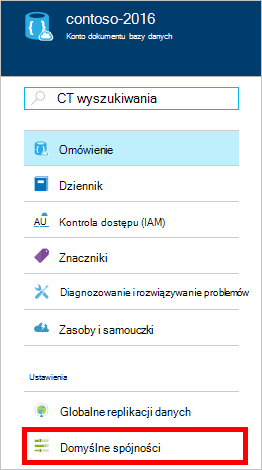
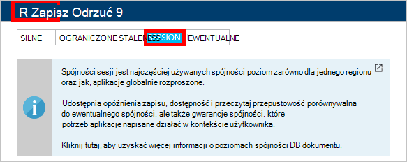

<properties
    pageTitle="Jak utworzyć konto DocumentDB | Microsoft Azure"
    description="Tworzenie bazy danych NoSQL za pomocą Azure DocumentDB. Wykonaj te instrukcje, aby utworzyć konto DocumentDB i rozpocząć tworzenie niesamowitą szybkie, globalna skala NoSQL bazy danych." 
    keywords="Tworzenie bazy danych"
    services="documentdb"
    documentationCenter=""
    authors="mimig1"
    manager="jhubbard"
    editor="monicar"/>

<tags
    ms.service="documentdb"
    ms.workload="data-services"
    ms.tgt_pltfrm="na"
    ms.devlang="na"
    ms.topic="get-started-article"
    ms.date="10/17/2016"
    ms.author="mimig"/>

# Jak utworzyć konto DocumentDB NoSQL przy użyciu Azure portal

> [AZURE.SELECTOR]
- [Azure portal](documentdb-create-account.md)
- [Polecenie Azure i Azure Menedżera zasobów](documentdb-automation-resource-manager-cli.md)

Aby utworzyć bazy danych za pomocą programu Microsoft Azure DocumentDB, należy:

- Mają konto Azure. Jeśli nie masz już, możesz uzyskać [bezpłatne konto Azure](https://azure.microsoft.com/free) . 
- Utwórz konto DocumentDB.  

Możesz utworzyć konto DocumentDB przy użyciu albo Azure portal, szablony Menedżera zasobów Azure lub Azure interfejs wiersza polecenia (polecenie). W tym artykule pokazano, jak utworzyć konto DocumentDB przy użyciu Azure portal. Aby utworzyć konto za pomocą Menedżera zasobów Azure lub polecenie Azure, zobacz [Tworzenie konta Automatyzowanie DocumentDB bazy danych](documentdb-automation-resource-manager-cli.md).

Jesteś nowym użytkownikiem DocumentDB? Obejrzyj [ten](https://azure.microsoft.com/documentation/videos/create-documentdb-on-azure/) klip wideo 4 minutowe przez Scotta Hanselman na temat sposobu wykonywanie typowych zadań w portalu online.

1.  Zaloguj się do [portalu Azure](https://portal.azure.com/).
2.  W Jumpbar kliknij przycisk **Nowy**, kliknij pozycję **bazami danych**, a następnie kliknij **DocumentDB (NoSQL)**. 

      

3. W karta **nowego konta** określ żądaną konfiguracją konta DocumentDB.

    

    - W polu **identyfikator** wprowadź nazwę identyfikującą konta DocumentDB.  Po uwierzytelnieniu **identyfikator** w polu **identyfikator** zostanie wyświetlony zielony znacznik wyboru. Wartość **Identyfikatora** staje się nazwa hosta w identyfikator URI. **Identyfikator** może zawierać tylko małe litery, cyfry oraz "-" znak, a musi być od 3 do 50 znaków. Należy zauważyć, że nazwa punktu końcowego, wybrane, której wynikiem staje się punkt końcowy konta DocumentDB widnieje tego *documents.azure.com* .

    - W oknie dialogowym **Interfejsu API NoSQL** wybierz model programowania umożliwia:
        - **DocumentDB**: DocumentDB interfejsu API jest dostępna za pośrednictwem .NET, języka Java, Node.js, Python i JavaScript [SDK](documentdb-sdk-dotnet.md), a także HTTP [odpoczynku](https://msdn.microsoft.com/library/azure/dn781481.aspx)i oferuje programowy dostęp do wszystkich funkcji DocumentDB. 
       
        - **MongoDB**: DocumentDB oferuje [Protokół poziom obsługi](documentdb-protocol-mongodb.md) dla **MongoDB** interfejsów API. Po wybraniu opcji interfejsu API MongoDB, można użyć istniejących SDK MongoDB i [Narzędzia](documentdb-mongodb-mongochef.md) aby porozmawiać z DocumentDB. Możesz [przenieść](documentdb-import-data.md) istniejące aplikacje MongoDB w taki sposób, aby DocumentDB, za pomocą [kodu wymagane żadne zmiany](documentdb-connect-mongodb-account.md)i korzystać w pełni zarządzaną bazy danych jako usługa, przy użyciu skali nieograniczony, globalnej replikacji i inne możliwości.

    - Dla **subskrypcji**wybierz Azure subskrypcję, do której chcesz użyć dla konta DocumentDB. Jeśli Twoje konto zawiera tylko jedną subskrypcję, to konto jest zaznaczona domyślnie.

    - **Grupa zasobów**wybierz lub Utwórz grupę zasobów dla Twojego konta DocumentDB.  Domyślnie jest tworzony nowej grupy zasobów. Aby uzyskać więcej informacji zobacz [Używanie portal Azure do zarządzania zasobami Azure](../articles/azure-portal/resource-group-portal.md).

    - Umożliwia określenie geograficzną lokalizację, w której do obsługi konta DocumentDB **lokalizacji** . 

4.  Skonfigurowane nowych opcji konta DocumentDB kliknij przycisk **Utwórz**. Aby sprawdzić stan wdrożenia, sprawdź Centrum powiadomień.  

      

    

5.  Po utworzeniu konta DocumentDB jest gotowa do użycia z ustawień domyślnych. Spójności domyślnego konta DocumentDB jest ustawiona do **sesji**.  Możesz dostosować spójności domyślne, klikając pozycję **Spójności domyślny** w menu zasobów. Aby uzyskać więcej informacji o poziomach spójności oferowanych przez DocumentDB, zobacz [poziomy spójności w DocumentDB](documentdb-consistency-levels.md).

      

      

[How to: Create a DocumentDB account]: #Howto
[Next steps]: #NextSteps
[documentdb-manage]:../articles/documentdb/documentdb-manage.md

## Następne kroki

Teraz, gdy masz konto DocumentDB, następnym krokiem jest utworzenie zbiór DocumentDB i baza danych. 

Można utworzyć nowy zbiór i bazy danych przy użyciu jednej z następujących czynności:

- Portal Azure w sposób opisany w [Tworzenie zbioru DocumentDB za pomocą portalu Azure](documentdb-create-collection.md).
- Samouczki włączający wszystko, które zawierają dane przykładowe: [.NET](documentdb-get-started.md), [.NET MVC](documentdb-dotnet-application.md), [języka Java](documentdb-java-application.md), [Node.js](documentdb-nodejs-application.md)lub [Python](documentdb-python-application.md).
- [.NET](documentdb-dotnet-samples.md#database-examples), [Node.js](documentdb-nodejs-samples.md#database-examples)lub [Python](documentdb-python-samples.md#database-examples) przykładowy kod dostępne w GitHub.
- [.NET](documentdb-sdk-dotnet.md), [Node.js](documentdb-sdk-node.md) [Java](documentdb-sdk-java.md), [Python](documentdb-sdk-python.md)i [Pozostałe](https://msdn.microsoft.com/library/azure/mt489072.aspx) SDK.

Po utworzeniu bazy danych i kolekcji, musisz [dodać dokumenty](documentdb-view-json-document-explorer.md) do kolekcji.

Po umieszczeniu dokumentów w kolekcji, przed dokumentów za pomocą [DocumentDB SQL](documentdb-sql-query.md) do [wykonywania kwerend](documentdb-sql-query.md#executing-queries) . Za pomocą [Eksploratora kwerendy](documentdb-query-collections-query-explorer.md) w portalu, [Interfejsu API usługi REST](https://msdn.microsoft.com/library/azure/dn781481.aspx)lub jeden z [SDK](documentdb-sdk-dotnet.md)można wykonywać kwerendy.

### Dowiedz się więcej

Aby dowiedzieć się więcej na temat DocumentDB, zapoznaj się z następujących zasobów:

-   [Ścieżka nauki dla DocumentDB](https://azure.microsoft.com/documentation/learning-paths/documentdb/)
-   [Model hierarchiczny zasobu DocumentDB i pojęć](documentdb-resources.md)
