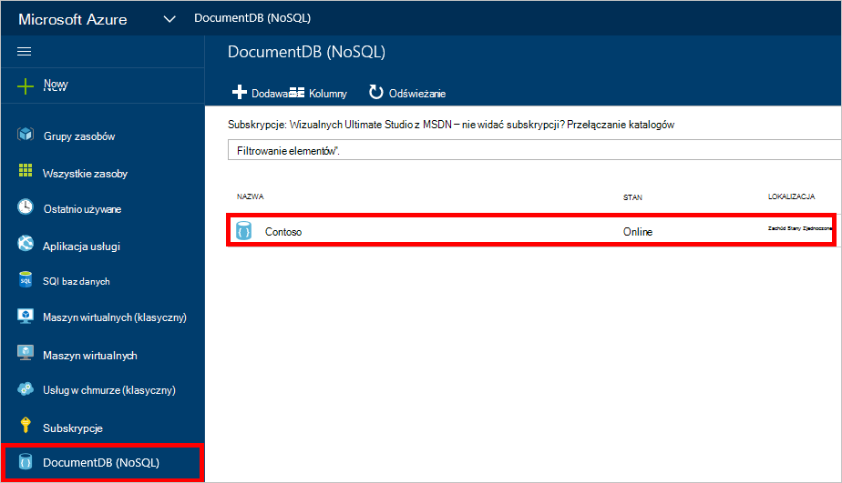
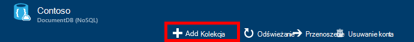
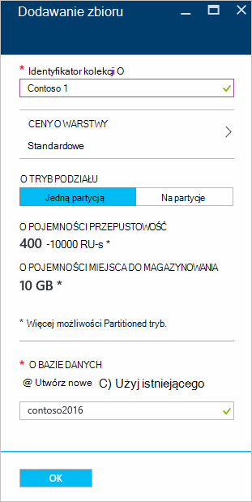
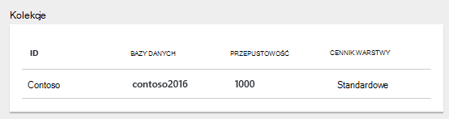
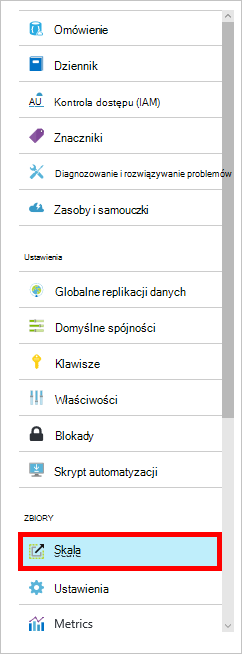

<properties 
    pageTitle="Tworzenie bazy danych DocumentDB i zbioru | Microsoft Azure" 
    description="Dowiedz się, jak utworzyć NoSQL bazy danych i JSON zbiory dokumentu za pomocą portalu online usługi dla Azure DocumentDB chmurowych dokumentu bazy danych. Pobierz bezpłatną wersję próbną dzisiaj." 
    services="documentdb" 
    authors="mimig1" 
    manager="jhubbard" 
    editor="monicar" 
    documentationCenter=""/>

<tags 
    ms.service="documentdb" 
    ms.workload="data-services" 
    ms.tgt_pltfrm="na" 
    ms.devlang="na" 
    ms.topic="article" 
    ms.date="10/17/2016" 
    ms.author="mimig"/>

# Jak utworzyć zbiór DocumentDB i bazy danych przy użyciu Azure portal

Aby użyć programu Microsoft Azure DocumentDB, musi mieć [konto DocumentDB](documentdb-create-account.md), bazy danych, zbioru i dokumentów. W tym temacie opisano, jak utworzyć zbiór DocumentDB w portalu Azure. 

Nie wiesz, jakie zbioru jest? Zobacz [Co to jest zbiór DocumentDB?](#what-is-a-documentdb-collection)

1.  W [Azure portal](https://portal.azure.com/)w Jumpbar kliknij **DocumentDB (NoSQL)**, a następnie wybierz konto, w której chcesz dodać zbioru w karta **DocumentDB (NoSQL)** . Jeśli nie masz kont na liście, musisz [utworzyć konto DocumentDB](documentdb-create-account.md).

    
    
    Jeśli **DocumentDB (NoSQL)** nie są widoczne w Jumpbar, kliknij przycisk **Więcej usług** , a następnie kliknij pozycję **DocumentDB (NoSQL)**. Jeśli nie masz wszystkie konta na liście, musisz [utworzyć konto DocumentDB](documentdb-create-account.md).

2. W karta **DocumentDB konta** dla wybranego konta kliknij przycisk **Dodaj kolekcji**.

    

3. W karta **Dodaj kolekcji** , w polu **identyfikator** wprowadź identyfikator nowej kolekcji. Nazwy kolekcji musi być od 1 do 255 znaków i nie mogą zawierać `/ \ # ?` lub spacji. Po uwierzytelnieniu nazwę w polu Identyfikator zostanie wyświetlony zielony znacznik wyboru.

    

4. Domyślnie **Ceny warstwa** jest równa **Standardowy** , aby można dostosować przepustowość i miejsca do magazynowania dla zbioru. Aby uzyskać więcej informacji o warstwie cennik zobacz [poziomy wydajności w DocumentDB](documentdb-performance-levels.md).  

5. Wybierz **Tryb partycjonowanie** zbierania **Jedną partycją** lub **Partitioned**. 

    **Jedną partycją** występują zastrzeżone pojemności 10 GB i nie może mieć poziomy przepustowości z 10 000 400 żądanie jednostek/s (RU-s). Jeden RU odpowiada przepustowości odczytu dokumentu 1KB. Aby uzyskać więcej informacji o jednostkach żądanie zobacz [żądanie jednostki](documentdb-request-units.md). 

    **Podzielony na partycje zbioru** można skalować obsługę nieograniczoną ilość miejsca do magazynowania na wielu partycje i nie może mieć poziomy przepustowość, rozpoczynając od 10,100 RU-s. W portalu największych magazynowania, który można zarezerwować jest 250 GB i przepustowość większości, które można zarezerwować to 250 000 RU-s. Aby zwiększyć albo przydziału, zgłoszenie żądania, zgodnie z opisem w [wezwanie na zwiększenie DocumentDB konta przydziałów](documentdb-increase-limits.md). Aby uzyskać więcej informaiton dotyczące kolekcji podzielone na partycje Zobacz [jedną partycją i podzielone na partycje zbiorów](documentdb-partition-data.md#single-partition-and-partitioned-collections).

    Domyślnie przepustowości dla nowego zbioru jedną partycją wynosi 1000 RU/s o pojemności 10 GB. W zbiorze podzielone na partycje przepustowość zbioru ustawiono 10100 RU/s o pojemności 250 GB. Po utworzeniu kolekcji możesz zmienić przepustowość i miejsca do magazynowania dla zbioru. 

6. Jeśli tworzysz podzielone na partycje zbioru wybierz **Klucz Partition** kolekcji. Wybieranie klucza poprawne partycją jest ważna w tworzenie kolekcji performant. Aby uzyskać więcej informacji na temat wybierania klucza partition zobacz [Projektowanie do podziału](documentdb-partition-data.md#designing-for-partitioning).

7. W karta **bazy danych** Utwórz nową bazę danych lub użycie istniejącej. Nazwy bazy danych musi mieć od 1 do 255 znaków i nie mogą zawierać `/ \ # ?` lub spacji. Aby sprawdzić poprawność nazwy, kliknij poza polem tekstowym. Po uwierzytelnieniu nazwę w polu zostanie wyświetlony zielony znacznik wyboru.

8. Kliknij **przycisk OK** u dołu ekranu, aby utworzyć nowy zbiór. 

9. Teraz nowy zbiór pojawia się w obiektyw **zbiorów** na karta **Przegląd** .
 
    

10. **Opcjonalne:** Aby zmodyfikować przepustowość zbioru w portalu, kliknij polecenie **Skala** w menu zasobów. 

    

## Co to jest zbiór DocumentDB? 

Kolekcja jest kontenerem JSON dokumentów i skojarzone logiki kodu JavaScript w aplikacji. Kolekcja jest podmiot fakturowanego miejsce, w którym [Koszt](documentdb-performance-levels.md) jest określona przez ustanawianie przepustowość zbioru. Kolekcje może obejmować jeden lub więcej partycje serwerów i można skalować obsługę praktycznie nieograniczoną ilości miejsca do magazynowania lub przepustowość.

Kolekcje są automatycznie podzielone na jeden lub więcej serwerów fizycznych przez DocumentDB. Po utworzeniu zbioru można określić ustanawianie przepustowość pod względem jednostki wezwanie na sekundę i właściwość klucza partition. Wartości tej właściwości będą używane przez DocumentDB do rozpowszechniania dokumentów między partycje i rozsyłanie żądań jak zapytania. Wartość klucza partition pełnić rolę granicy transakcji dla procedur składowanych i wyzwalaczy. Każda z kolekcji ma zastrzeżone ilość przepustowość specyficzne dla tej kolekcji, które nie są udostępniane z innych zbiorów z tego samego konta. W związku z tym można skalować się aplikacja zarówno w odniesieniu do miejsca do magazynowania i przepustowość. 

Kolekcje nie są taka sama, jak tabele w relacyjnych baz danych. Kolekcje nie Wymuszaj schemat, w rzeczywistości DocumentDB nie wymusza wszelkie schematy jest wolne schematem bazy danych. W związku z tym mogą zawierać różne rodzaje dokumentów za pomocą różnych schematów do tego samego zbioru. Możesz przechowywać obiektów jednego typu jak w przypadku tabel za pomocą kolekcji. Najlepsze modelu zależy od tylko jak dane są wyświetlane razem w kwerendach i transakcje.

## Inne sposoby tworzenia zbioru DocumentDB

Kolekcje nie mają zostać utworzone za pomocą portalu, można także utworzyć za pomocą [SDK DocumentDB](documentdb-sdk-dotnet.md) i interfejsu API usługi REST. 

- Aby C# próbki kodu zobacz [próbki zbioru C#](documentdb-dotnet-samples.md#collection-examples). 
- Przykładowy kod Node.js zobacz [Node.js zbioru próbki](documentdb-nodejs-samples.md#collection-examples).
- Przykładowy kod Python zobacz [Python zbioru próbki](documentdb-python-samples.md#collection-examples).
- Przykładowy interfejsu API usługi REST zobacz [Tworzenie kolekcji](https://msdn.microsoft.com/library/azure/mt489078.aspx).

## Rozwiązywanie problemów

Jeśli **Dodaj kolekcji** jest wyłączona w portalu Azure, oznacza to, że Twoje konto jest wyłączony, które zazwyczaj występuje w przypadku wszystkich środków zalet na miesiąc.   

## Następne kroki

Teraz, gdy masz zbiór, następnym krokiem jest dodawanie dokumentów lub importowanie dokumentów do kolekcji. Jeśli chodzi o dodawanie dokumentów do kolekcji, masz kilka możliwości:

- Możesz [dodać dokumentów](documentdb-view-json-document-explorer.md) przy użyciu Eksploratora dokumentu w portalu.
- Możesz [Importowanie dokumenty i dane](documentdb-import-data.md) przy użyciu DocumentDB danych narzędzia do migracji, która umożliwia importowanie plików JSON i CSV, a także dane z programu SQL Server, MongoDB, Magazyn tabel platformy Azure i innych zbiorów DocumentDB. 
- Lub możesz dodać dokumentów przy użyciu jednego z [SDK DocumentDB](documentdb-sdk-dotnet.md). DocumentDB ma .NET, języka Java, Python, Node.js i SDK interfejsu API języka JavaScript. Aby uzyskać C# przedstawiający, jak pracować z dokumentami przy użyciu zestawu SDK .NET DocumentDB przykłady kodu zobacz [C# próbki dokumentu](documentdb-dotnet-samples.md#document-examples). Aby uzyskać przykłady kodu Node.js przedstawiający, jak pracować z dokumentami przy użyciu zestawu SDK Node.js DocumentDB zobacz [Node.js próbki dokumentu](documentdb-nodejs-samples.md#document-examples).

Po umieszczeniu dokumentów w zbiorze umożliwia [DocumentDB SQL](documentdb-sql-query.md) [wykonywać kwerendy](documentdb-sql-query.md#executing-queries) przed dokumentów za pomocą [Eksploratora kwerendy](documentdb-query-collections-query-explorer.md) w portalu, [Interfejsu API usługi REST](https://msdn.microsoft.com/library/azure/dn781481.aspx)lub jeden z [SDK](documentdb-sdk-dotnet.md). 
