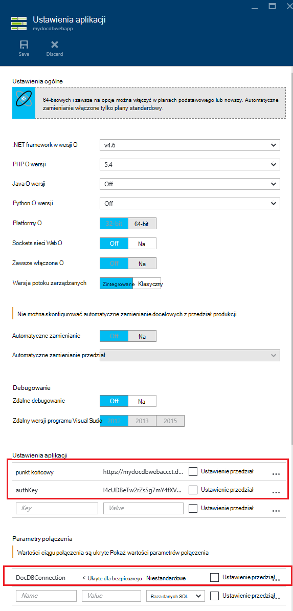

<properties 
    pageTitle="Wdrażanie DocumentDB i Azure usługi sieci Web aplikacji przy użyciu szablonu Menedżera zasobów Azure | Microsoft Azure" 
    description="Dowiedz się, jak wdrożyć konto DocumentDB, Azure aplikacji usługi sieci Web i aplikacji sieci web próbki przy użyciu szablonu Azure Menedżera zasobów." 
    services="documentdb, app-service\web" 
    authors="h0n" 
    manager="jhubbard" 
    editor="monicar" 
    documentationCenter=""/>

<tags 
    ms.service="documentdb" 
    ms.workload="data-services" 
    ms.tgt_pltfrm="na" 
    ms.devlang="na" 
    ms.topic="article" 
    ms.date="08/02/2016" 
    ms.author="hawong"/>

# Wdrażanie DocumentDB i Azure usługi sieci Web aplikacji przy użyciu szablonu Menedżera zasobów Azure

Ten samouczek pokazano, jak za pomocą szablonu Menedżera zasobów Azure wdrażanie i integracja [Microsoft Azure DocumentDB](https://azure.microsoft.com/services/documentdb/), [Usługa Azure aplikacji](http://go.microsoft.com/fwlink/?LinkId=529714) web app i przykładowej aplikacji sieci web.

Korzystanie z Menedżera zasobów Azure szablonów, można łatwo zautomatyzować wdrażania i konfigurowania Azure zasobów.  Ten samouczek pokazano, jak wdrażać aplikacji sieci web i automatycznie skonfigurować informacje o połączeniu kont DocumentDB.

Ten samouczek można odpowiedzieć na następujące pytania:  

-   Jak używać szablonu Menedżera zasobów Azure wdrażać i zintegrować konto DocumentDB i aplikacji sieci web w usłudze Azure aplikacji?
-   Jak używać szablonu Menedżera zasobów Azure wdrażać i integracja konto DocumentDB, aplikacji sieci web w aplikacji sieci Web usług i aplikacji Webdeploy?

## Wymagania wstępne
> [AZURE.TIP] Podczas tego samouczka, nie przyjmuje doświadczenia z szablonów Menedżera zasobów Azure lub JSON, należy, który chcesz zmodyfikować odwołania szablony i opcje wdrażania następnie wiedzy o każdym z tych obszarów będzie wymagane.

Przed zgodnie z instrukcjami zawartymi w tym samouczku, upewnij się, że masz następujące czynności:

- Subskrypcję usługi Azure. Azure jest platformą subskrybowanej.  Aby uzyskać więcej informacji na temat uzyskiwania subskrypcji zobacz [Opcji zakupu](https://azure.microsoft.com/pricing/purchase-options/), [Oferuje członka](https://azure.microsoft.com/pricing/member-offers/)lub [Bezpłatnej wersji próbnej](https://azure.microsoft.com/pricing/free-trial/).

##Krok 1: Pobieranie plików szablonów ##
Zacznijmy od pobierania plików szablonu, który użyjemy w tym samouczku.

1. Pobieranie szablonu [utworzyć konto DocumentDB aplikacji sieci Web i wdrażanie aplikacji próbki pokaz](https://portalcontent.blob.core.windows.net/samples/DocDBWebsiteTodo.json) z lokalnym folderem (np. C:\DocumentDBTemplates). Ten szablon zostanie wdrożyć konto DocumentDB, aplikacji sieci web aplikacji usług i aplikacji sieci web.  Również automatycznie skonfiguruje aplikacji sieci web w celu nawiązania połączenia z kontem DocumentDB.

2. Pobieranie szablonu [Utwórz konto DocumentDB i przykładowe aplikacje sieci Web](https://portalcontent.blob.core.windows.net/samples/DocDBWebSite.json) do folderu lokalnego (np. C:\DocumentDBTemplates). Ten szablon zostanie wdrożony konto DocumentDB aplikacji sieci web programu aplikacji usługi i będzie modyfikowanie ustawień aplikacji witryny łatwe udostępnienie informacji o połączeniu DocumentDB, ale nie zawiera aplikacji sieci web.  

##Krok 2: Wdrażanie konto DocumentDB, aplikacji usługi sieci web app i pokaz aplikacji próbki

Teraz Przyjrzyjmy wdrażanie nasz pierwszy szablon.

> [AZURE.TIP] Szablon nie Sprawdź, czy nazwa aplikacji sieci web i nazwa konta DocumentDB wprowadzone poniżej są) prawidłowe i b) dostępne.  Zdecydowanie zaleca się sprawdzenie dostępności nazwy, które mają być podanie przed przesłaniem wdrożenia.

1. Zaloguj się do [Azure Portal](https://portal.azure.com), kliknij przycisk Nowy i wyszukaj "Rozmieszczania szablonu".
    

2. Zaznacz element wdrożenia szablonu, a następnie kliknij przycisk **Utwórz**
    

3.  Kliknij przycisk **Edytuj szablon**, Wklej zawartość pliku szablonu DocDBWebsiteTodo.json i kliknij przycisk **Zapisz**.
    

4. Kliknij przycisk **Edytuj parametry**, podaj wartości dla każdego z parametrów obowiązkowe i kliknij **przycisk OK**.  Parametry są następujące:

    1. Nazwa witryny: Nazwa aplikacji usługi sieci web app i służy do tworzenia adres URL, który będzie korzystać, aby uzyskać dostęp do aplikacji sieci web (np. Jeśli określić "mydemodocdbwebapp", a następnie adres URL, w którym będzie dostęp do aplikacji sieci web będzie mydemodocdbwebapp.azurewebsites.net).

    2. HOSTINGPLANNAME: Nazwa aplikacji usługi hostingu zamierzasz tworzyć.

    3. Lokalizacja: Określa lokalizację Azure, w której chcesz utworzyć zasoby dotyczące aplikacji sieci web i DocumentDB.

    4. DATABASEACCOUNTNAME: Nazwa konta DocumentDB, aby utworzyć.   

    

5. Wybieranie istniejącej grupy zasobów lub podaj nazwę, aby wprowadzić nową grupę zasobów i wybierz lokalizację dla grupy zasobów.
    
  
6.  Kliknij pozycję **Recenzja warunki prawne**, **zakupu**, a następnie kliknij przycisk **Utwórz** , aby rozpocząć rozmieszczenia.  Zaznacz pozycję **Przypnij do pulpitu nawigacyjnego** , aby wyniku wdrożenia jest widoczny na stronie głównej portalu Azure.
    

7.  Po zakończeniu rozmieszczania karta Grupa zasobów zostanie otwarty.
      

8.  Aby użyć aplikacji, po prostu przejdź do adresu URL aplikacji sieci web (w powyższym przykładzie adres URL jest http://mydemodocdbwebapp.azurewebsites.net).  Zostanie wyświetlony następujący aplikacji sieci web:

    

9. Zrealizuj i utworzyć kilka zadań w aplikacji sieci web, a następnie powróć do karta Grupa zasobów w portalu Azure. Kliknij pozycję Zasób konta DocumentDB na liście zasoby, a następnie kliknij pozycję **Eksplorator kwerendy**.
      

10. Uruchom kwerendę domyślną, "SELECT *FROM c" i sprawdź wyniki.  Zwróć uwagę, że kwerenda pobraniu reprezentacją JSON zadań do wykonania, który został utworzony w kroku 7 powyżej.  Zachęcamy do eksperymentować zapytania; na przykład, spróbuj uruchomić wybierz* z c.isComplete gdzie c = true zwraca wszystkich zadań do wykonania, które zostały oznaczone jako zakończone.

    

11. Zachęcamy do Eksplorowanie obsługi portalu DocumentDB lub modyfikowanie przykładowej aplikacji zadania.  Gdy wszystko będzie już gotowe, Przejdźmy wdrożyć inny szablon.
    
 
## Krok 3: Wdrażanie przykładowych aplikacji sieci web i konta dokumentu

Teraz przejdźmy wdrażanie naszych drugiego szablonu.  Ten szablon jest przydatne pokazać, jak możesz można wprowadzić informacje o połączeniu DocumentDB takich jak konta punktu końcowego i klucza głównego do aplikacji sieci web jako ustawienia aplikacji lub parametry połączenia niestandardowe. Na przykład być może masz własną aplikacji sieci web, którą chcesz wdrożyć za pomocą konta DocumentDB i że masz informacje o połączeniu wypełnione automatycznie podczas wdrażania.

> [AZURE.TIP] Szablon nie Sprawdź, czy nazwa aplikacji sieci web i nazwa konta DocumentDB wprowadzone poniżej są) prawidłowe i b) dostępne.  Zdecydowanie zaleca się sprawdzenie dostępności nazwy, które mają być podanie przed przesłaniem wdrożenia.

1. W [Azure Portal](https://portal.azure.com)kliknij pozycję Nowy i wyszukaj "Rozmieszczania szablonu".
    

2. Zaznacz element wdrożenia szablonu, a następnie kliknij przycisk **Utwórz**
    

3.  Kliknij przycisk **Edytuj szablon**, Wklej zawartość pliku szablonu DocDBWebSite.json i kliknij przycisk **Zapisz**.
    

4. Kliknij przycisk **Edytuj parametry**, podaj wartości dla każdego z parametrów obowiązkowe i kliknij **przycisk OK**.  Parametry są następujące:

    1. Nazwa witryny: Nazwa aplikacji usługi sieci web app i służy do tworzenia adres URL, który będzie korzystać, aby uzyskać dostęp do aplikacji sieci web (np. Jeśli określić "mydemodocdbwebapp", a następnie adres URL, w którym będzie dostęp do aplikacji sieci web będzie mydemodocdbwebapp.azurewebsites.net).

    2. HOSTINGPLANNAME: Nazwa aplikacji usługi hostingu zamierzasz tworzyć.

    3. Lokalizacja: Określa lokalizację Azure, w której chcesz utworzyć zasoby dotyczące aplikacji sieci web i DocumentDB.

    4. DATABASEACCOUNTNAME: Nazwa konta DocumentDB, aby utworzyć.   

    

5. Wybieranie istniejącej grupy zasobów lub podaj nazwę, aby wprowadzić nową grupę zasobów i wybierz lokalizację dla grupy zasobów.
    
  
6.  Kliknij pozycję **Recenzja warunki prawne**, **zakupu**, a następnie kliknij przycisk **Utwórz** , aby rozpocząć wdrożenia.  Zaznacz pozycję **Przypnij do pulpitu nawigacyjnego** , aby wyniku wdrożenia jest widoczny na stronie głównej portalu Azure.
    

7.  Po zakończeniu rozmieszczania karta Grupa zasobów zostanie otwarty.
      

8. Kliknij pozycję zasób aplikacji sieci Web na liście zasoby, a następnie kliknij pozycję **Ustawienia aplikacji**
      

9. Zauważ, jak są Prezentuj punktu końcowego DocumentDB oraz wszystkich kluczy głównych DocumentDB ustawienia aplikacji.
      

10. Zachęcamy do nadal poznawanie Azure Portal, lub wykonaj jedną z naszych DocumentDB [próbki](http://go.microsoft.com/fwlink/?LinkID=402386) utworzyć aplikację DocumentDB.

    
    

## Następne kroki

Gratulacje! Został wdrożony DocumentDB aplikacji usługi sieci web app oraz aplikacji sieci web próbki przy użyciu szablonów Azure Menedżera zasobów.

- Aby dowiedzieć się więcej na temat DocumentDB, kliknij [tutaj](http://azure.com/docdb).
- Aby dowiedzieć się więcej o aplikacjach sieci Web usługi aplikacji Azure, kliknij [tutaj](http://go.microsoft.com/fwlink/?LinkId=325362).
- Aby dowiedzieć się więcej na temat szablonów Azure Menedżera zasobów, kliknij [tutaj](https://msdn.microsoft.com/library/azure/dn790549.aspx).

## Informacje o zmianach
* Przewodnika do zmiany z witryn sieci Web do usługi aplikacji Zobacz: [Usługa Azure aplikacji i jego wpływ na istniejące usługi Azure](http://go.microsoft.com/fwlink/?LinkId=529714)
* Przewodnika do zmiany portalu starego do nowego portalu zobacz: [odwołanie do nawigowania między Portal klasyczny Azure](http://go.microsoft.com/fwlink/?LinkId=529715)

>[AZURE.NOTE] Jeśli chcesz rozpocząć pracę z Azure aplikacji usługi przed utworzeniem konta dla konta Azure, przejdź do [Spróbuj aplikacji usługi](http://go.microsoft.com/fwlink/?LinkId=523751), którym natychmiast można utworzyć aplikację sieci web krótkotrwałe starter w aplikacji usługi. Nie kart kredytowych wymagane; nie zobowiązania.
 
