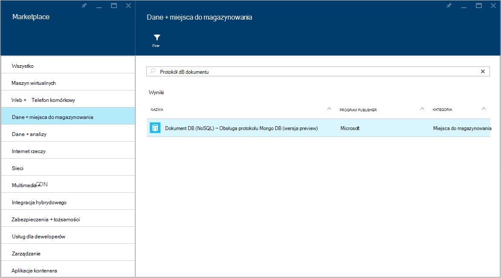
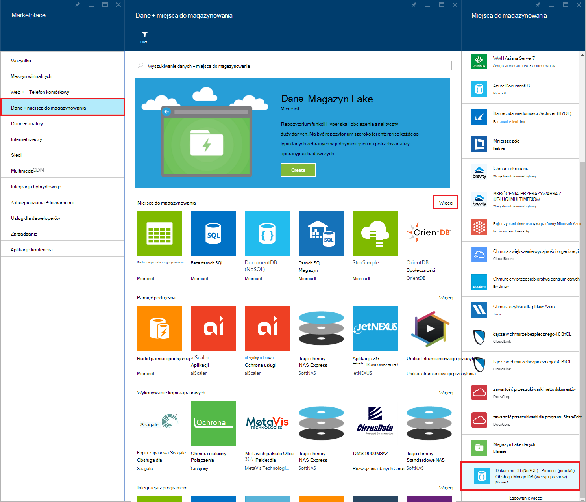
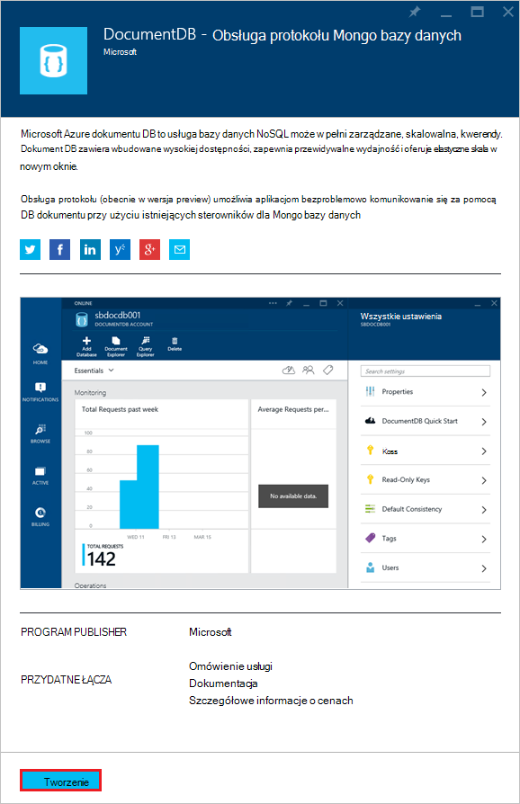
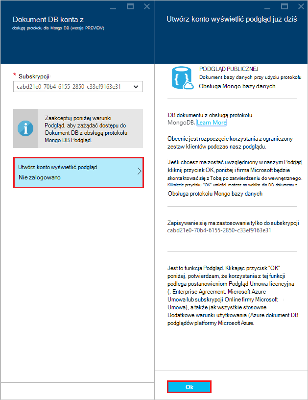
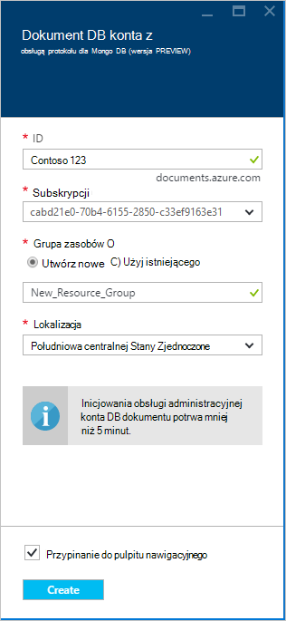
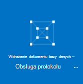
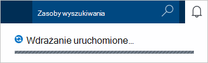
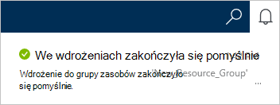
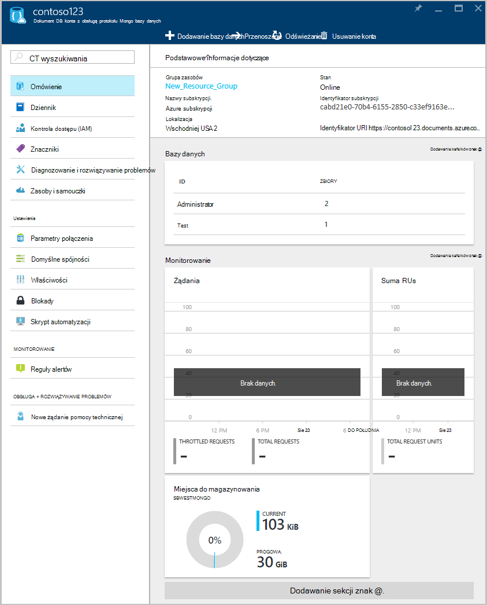

<properties 
    pageTitle="Tworzenie konta DocumentDB z obsługą protokołu MongoDB | Microsoft Azure" 
    description="Dowiedz się, jak utworzyć konto DocumentDB z obsługą protokołu MongoDB, teraz dostępna do podglądu." 
    services="documentdb" 
    authors="AndrewHoh" 
    manager="jhubbard" 
    editor="" 
    documentationCenter=""/>

<tags 
    ms.service="documentdb" 
    ms.workload="data-services" 
    ms.tgt_pltfrm="na" 
    ms.devlang="na" 
    ms.topic="article" 
    ms.date="10/20/2016" 
    ms.author="anhoh"/>

# Jak utworzyć konto DocumentDB z obsługą protokołu MongoDB za pomocą portalu Azure

Aby utworzyć konto Azure DocumentDB z obsługą protokołu MongoDB, należy:

- Mają konto Azure. Jeśli nie masz już, możesz uzyskać [bezpłatne konto Azure](https://azure.microsoft.com/free/) .

## Tworzenie konta  

Aby utworzyć konto DocumentDB z obsługą protokołu MongoDB, należy wykonać następujące czynności.

1. W nowym oknie Zaloguj się do usługi [Azure Portal](https://portal.azure.com).
2. Kliknij przycisk **Nowy**, kliknij **danych + miejsca do magazynowania**, kliknij **wyświetlić wszystkie**, a następnie wyszukaj kategorii **danych + miejsca do magazynowania** protokołu"DocumentDB". Kliknij pozycję **DocumentDB — Obsługa protokołu MongoDB**.

    

3. Możesz również w kategorii **danych + miejsce** , w obszarze **miejsca do magazynowania**, kliknij przycisk **więcej**, a następnie kliknij **Ładowanie więcej** co najmniej raz do wyświetlenia **DocumentDB — Obsługa protokołu MongoDB**. Kliknij pozycję **DocumentDB — Obsługa protokołu MongoDB**.

    

4. W karta **DocumentDB - obsługę protokołu MongoDB (wersja preview)** kliknij przycisk **Utwórz** , aby uruchomić proces zapisywania wersji preview.

    

5. W karta **DocumentDB konta** kliknij przycisk **Utwórz konto wyświetlić podgląd**. Przeczytaj informacje, a następnie kliknij **przycisk OK**.

    

6.  Po zaakceptowaniu warunków podglądu, zostaną zwrócone do karta tworzenie.  W karta **konta DocumentDB** określ żądaną konfiguracją konta.

    

    - W polu **identyfikator** wprowadź nazwę identyfikującą konta.  Po uwierzytelnieniu **identyfikator** w polu **identyfikator** zostanie wyświetlony zielony znacznik wyboru. Wartość **Identyfikatora** staje się nazwa hosta w identyfikator URI. **Identyfikator** może zawierać tylko małe litery, cyfry oraz "-" znak, a musi być od 3 do 50 znaków. Należy zauważyć, że ten *documents.azure.com* widnieje nazwa punktu końcowego, wybrane, której wynikiem będzie punkt końcowy konta.

    - Dla **subskrypcji**wybierz Azure subskrypcję, do której chcesz użyć dla konta. Jeśli Twoje konto zawiera tylko jedną subskrypcję, to konto jest zaznaczona domyślnie.

    - **Grupa zasobów**wybierz lub Utwórz grupę zasobów dla konta.  Domyślnie zostanie wybrany istniejącej grupy zasobów w obszarze Azure subskrypcji.  Użytkownik może jednak wybierz, aby utworzyć nową grupę zasobów, do której chcesz dodać konto. Aby uzyskać więcej informacji zobacz [Korzystanie portal Azure do zarządzania zasobami Azure](resource-group-portal.md).

    - Umożliwia określenie geograficzną lokalizację, w której do obsługi konta **lokalizacji** .
    
    - Opcjonalnie: Sprawdź **numer Pin do pulpitu nawigacyjnego**. Jeśli przypięta do pulpitu nawigacyjnego, wykonaj **krok 8** poniżej wyświetlanie nawigacji po lewej stronie nowego konta.

7.  Skonfigurowane nowych opcji konta kliknij przycisk **Utwórz**.  Może potrwać kilka minut, aby utworzyć konto.  Jeśli przypięta do pulpitu nawigacyjnego, można monitorować postęp obsługi administracyjnej Startboard.  
      

    Jeśli nie przypięta do pulpitu nawigacyjnego, można monitorować postęp z poziomu Centrum powiadomienia.  

      

    

8.  Aby uzyskać dostęp do nowego konta, kliknij pozycję **DocumentDB (NoSQL)** w menu po lewej stronie. Na liście zwykłą DocumentDB i DocumentDB z kontami obsługi protokołu Mongo kliknij nazwę nowego konta.

9.  Jest teraz gotowy do użycia z ustawieniami domyślnymi. 

    
    

## Następne kroki

- Dowiedz się, jak [Nawiązywanie połączenia](documentdb-connect-mongodb-account.md) z kontem DocumentDB z protokołem obsługę MongoDB.

 
