<properties 
    pageTitle="Samouczek ASP.NET MVC dla DocumentDB: programowania aplikacji sieci Web | Microsoft Azure" 
    description="Samouczek ASP.NET MVC tworzenie aplikacji sieci web MVC przy użyciu DocumentDB. Można przechowywać JSON i uzyskać dostęp do danych za pomocą aplikacji zadania hostowana w witrynach Azure - MVC netto ASP samouczek krok po kroku." 
    keywords="Samouczek mvc ASP.NET, programowania aplikacji sieci web, aplikacji sieci web mvc, asp netto mvc samouczek krok po kroku"
    services="documentdb" 
    documentationCenter=".net" 
    authors="syamkmsft" 
    manager="jhubbard" 
    editor="cgronlun"/>

<tags 
    ms.service="documentdb" 
    ms.workload="data-services" 
    ms.tgt_pltfrm="na" 
    ms.devlang="dotnet" 
    ms.topic="hero-article" 
    ms.date="08/25/2016" 
    ms.author="syamk"/>

# Programu ASP.NET MVC samouczek: Programowania aplikacji sieci Web z DocumentDB

> [AZURE.SELECTOR]
- [.NET](documentdb-dotnet-application.md)
- [Node.js](documentdb-nodejs-application.md)
- [Java](documentdb-java-application.md)
- [Python](documentdb-python-application.md) 

Aby wyróżnić jak efektywnie wykorzystać DocumentDB Azure do przechowywania i dokumentów JSON kwerendy, ten artykuł zawiera samouczek zakończenia do końca przedstawiająca do tworzenia aplikacji dla zadania przy użyciu Azure DocumentDB. Zadania będą przechowywane jako dokumenty JSON w Azure DocumentDB.

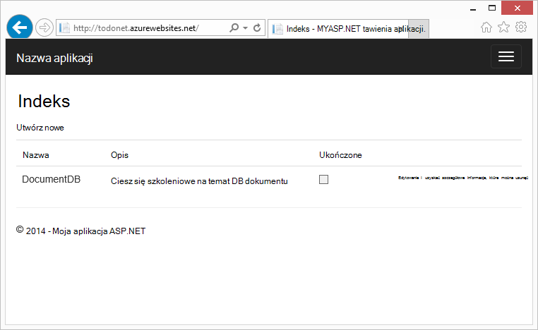

Ten samouczek pokazano, jak korzystać z usługi DocumentDB Azure do przechowywania i udostępniania danych z aplikacji sieci web programu ASP.NET MVC hostowanej Azure. Jeśli szukasz samouczek tylko omawiający DocumentDB, bez składników ASP.NET MVC zobacz [Tworzenie aplikacji konsoli DocumentDB C#](documentdb-get-started.md).

> [AZURE.TIP] Tego samouczka przyjęto założenie, że masz wcześniejszego doświadczenia w korzystaniu ASP.NET MVC i Azure witryn sieci Web. Jeśli jesteś nowym użytkownikiem programu ASP.NET lub [Narzędzia wstępne](#_Toc395637760), zalecamy pobieranie ukończone przykładowy projekt z [GitHub][] i postępując zgodnie z instrukcjami w tym przykładzie. Po umieszczeniu go utworzono, możesz przejrzeć ten artykuł, aby uzyskać omówienie kod w kontekście projektu.

## Wymagania wstępne dotyczące tego samouczka bazy danych

Przed zgodnie z instrukcjami zawartymi w tym artykule, należy się upewnić, że masz następujące czynności:

- Konto Azure active. Jeśli nie masz konta, możesz utworzyć bezpłatne konto wersji próbnej na kilka minut. Aby uzyskać szczegółowe informacje zobacz [Azure bezpłatnej wersji próbnej](https://azure.microsoft.com/pricing/free-trial/).
- [Visual Studio 2015](http://www.visualstudio.com/) lub programu Visual Studio 2013 aktualizacji 4 lub nowszym. Jeśli programu Visual Studio 2013, należy zainstalować [pakiet nuget Microsoft.Net.Compilers](https://www.nuget.org/packages/Microsoft.Net.Compilers/) , aby dodać obsługę C# 6.0. 
- Azure SDK dla środowiska .NET wersji 2.5.1 lub nowszy, dostępne za pośrednictwem [Instalatora platformy sieci Web firmy Microsoft][].

Za pomocą programu Visual Studio 2013 aktualizacji 4 zastosowane oraz Azure SDK dla środowiska .NET wersji 2.5.1 nastąpi przeniesienie wszystkich zrzutów ekranu w tym artykule. Jeśli system jest skonfigurowany z różnymi wersjami jest możliwe, że opcje i ekrany nie odpowiada całkowicie, ale jeśli są spełnione powyżej wymagania wstępne dotyczące tego rozwiązania powinna działać.

## Krok 1: Utwórz konto DocumentDB bazy danych

Zacznijmy od Tworzenie konta DocumentDB. Jeśli masz już konto, można przejść do [Utwórz nową aplikację ASP.NET MVC](#_Toc395637762).

[AZURE.INCLUDE [documentdb-create-dbaccount](../../includes/documentdb-create-dbaccount.md)]

[AZURE.INCLUDE [documentdb-keys](../../includes/documentdb-keys.md)]

 
Teraz możemy przeprowadzi przez jak utworzyć nową aplikację ASP.NET MVC od podstaw. 

## Krok 2: Tworzenie nowej aplikacji MVC programu ASP.NET

Teraz, gdy masz konto usługi tworzenie nasz nowy projekt programu ASP.NET.

1. W programie Visual Studio, w menu **plik** wskaż polecenie **Nowy**, a następnie kliknij **Projekt**.

    Zostanie wyświetlone okno dialogowe **Nowy projekt** .
2. W okienku **typów projektów** rozwiń **szablonów** **programu Visual C#**, **sieci Web**, a następnie wybierz **Aplikację sieci Web programu ASP.NET**.

    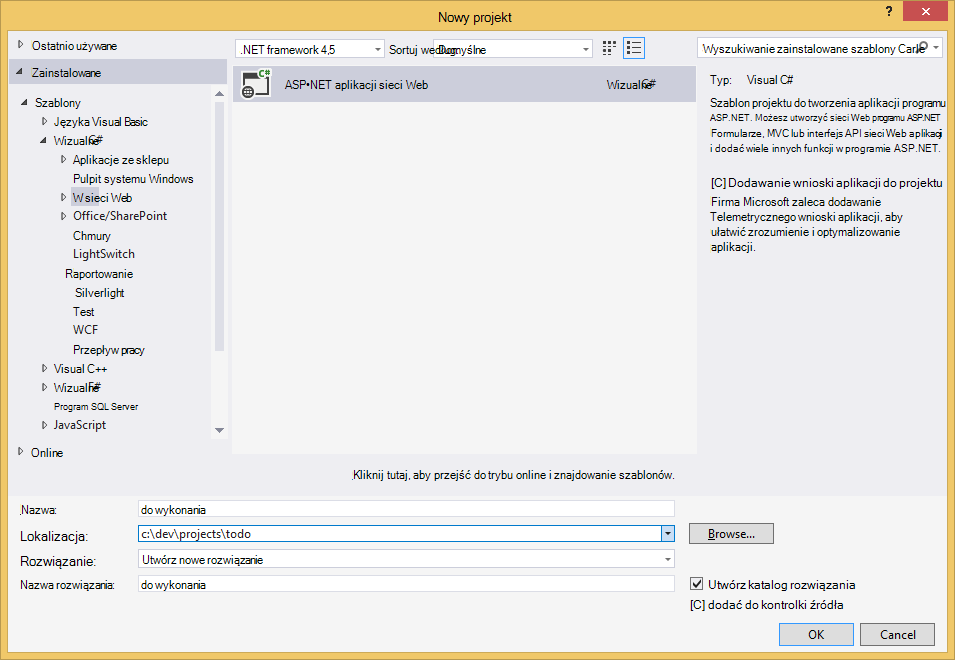

3. W polu **Nazwa** wpisz nazwę projektu. Samouczku nazwę "zadania". Jeśli zdecydujesz się na użycie innej niż to, w miejsce, w którym ten samouczek zawiera informacje o nazw zadania, należy dopasować dostarczonych przykłady używania inną nazwę aplikacji. 

4. Kliknij przycisk **Przeglądaj,** aby przejść do folderu, w którym chcesz utworzyć projekt, a następnie kliknij **przycisk OK**.

    Zostanie wyświetlone okno dialogowe **Nowy projekt programu ASP.NET** .

    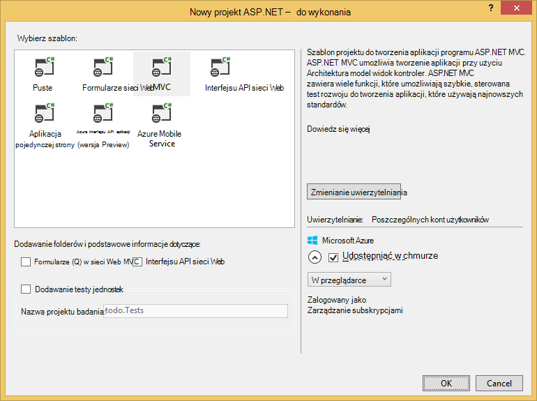

5. W okienku szablony wybierz **MVC**.

6. Jeśli planujesz obsługę aplikacji platformy Azure, zaznacz **hosta w chmurze** w prawej dolnej mają Azure obsługujący aplikację. Firma Microsoft jest zaznaczona do przechowywania w chmurze, a także do uruchamiania aplikacji w witrynie sieci Web Azure. Zaznaczenie tej opcji preprovision Azure witryny sieci Web dla Ciebie i życia znacznie ułatwić, gdy nadejdzie czas na wdrożyć aplikację roboczych wersję ostateczną. Jeśli chcesz udostępnić ten gdzie indziej, lub nie chcesz, aby skonfigurować Azure ustalonymi, po prostu wyczyść **hosta w chmurze**.

7. Kliknij **przycisk OK** i umożliwić Visual Studio takim jej działaniu wokół scaffolding pustego szablonu ASP.NET MVC. 

8. Jeśli chcesz udostępnić ten w chmurze pojawi się co najmniej jeden ekran dodatkowe zapytaniem, aby zalogować się do konta Azure i podaj niektórych wartości dla nowej witryny sieci Web. Podać dodatkowe wartości i Kontynuuj. 

    Można nie jeszcze wybrany "serwer bazy danych" poniżej ponieważ firma Microsoft nie korzystasz z serwera bazy danych SQL Azure poniżej, firma Microsoft mają być tworzenie nowego konta Azure DocumentDB później w Azure Portal.

    Aby uzyskać więcej informacji na temat wybierania **plan usług aplikacji** i **Grupa zasobów**zobacz [Omówienie szczegółowo planów Azure aplikacji usługi](../app-service/azure-web-sites-web-hosting-plans-in-depth-overview.md).

    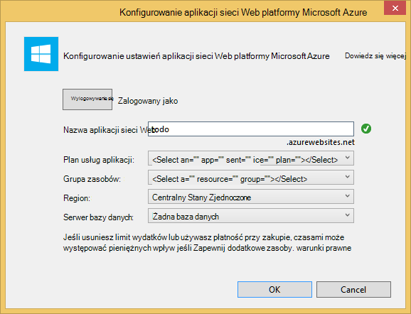

9. Po zakończeniu programu Visual Studio, tworzenie standardowy aplikacji MVC masz pustej aplikacji ASP.NET, które można uruchomić lokalnie.

    Będzie pominąć, uruchomiony projektu lokalnie, ponieważ mam pewności, możemy wszystkie zobaczył ASP.NET "Witaj świecie" aplikacji. Przyjrzyjmy się bezpośrednio do dodawania DocumentDB do tego projektu i tworzenie naszych aplikacji.

## Krok 3: Dodawanie DocumentDB do MVC projektu aplikacji sieci web

Teraz, gdy mamy większość wodociągowych ASP.NET MVC, jaka jest potrzebna dla tego rozwiązania korzystaj z rzeczywistą celem tego samouczka, dodając Azure DocumentDB do naszych MVC aplikacji sieci web.

1. DocumentDB .NET SDK jest dostarczana i distributed jako pakiet NuGet. Aby uzyskać pakiet NuGet w programie Visual Studio, za pomocą Menedżera pakietu NuGet w programie Visual Studio prawym przyciskiem myszy nad projektem w **Eksploratorze rozwiązań** , a następnie klikając przycisk **Zarządzaj pakietów NuGet**.

    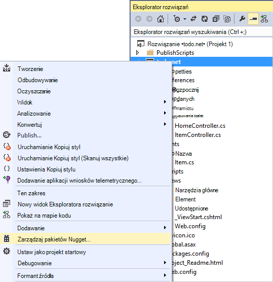

    Zostanie wyświetlone okno dialogowe **Zarządzanie pakietami NuGet** .

2. W oknie dialogowym NuGet **Przeglądanie** wpisz ***Azure DocumentDB***.
    
    Na liście wyników należy zainstalować pakiet **Microsoft Azure DocumentDB klienta biblioteki** . To będzie Pobierz i zainstaluj pakiet DocumentDB, a także wszystkie zależności, takich jak Newtonsoft.Json. Po kliknięciu przycisku **OK** w oknie **podglądu** **akceptuję** w oknie **Akceptacji licencji** do ukończenia instalacji.

    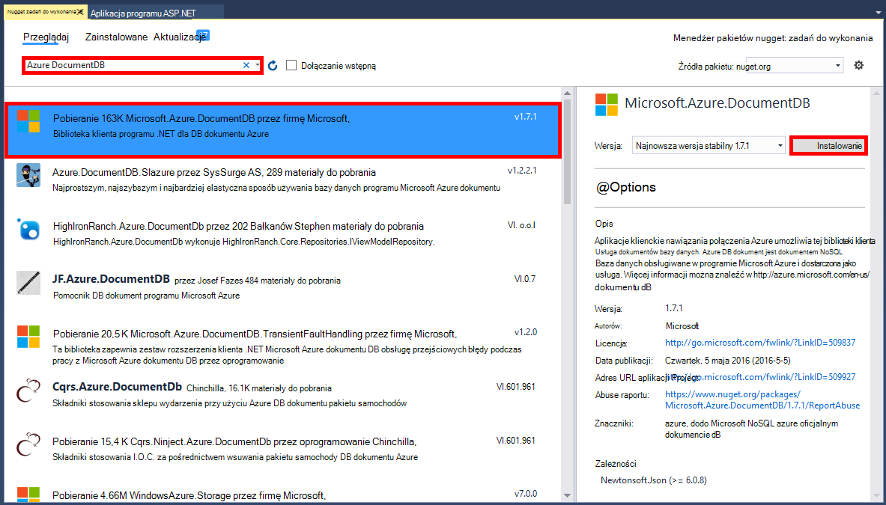

    Za pomocą konsoli Menedżera pakietów można również zainstalować pakiet. Aby to zrobić, w menu **Narzędzia** kliknij polecenie **Menedżer pakiet NuGet**, a następnie kliknij **Konsoli Menedżera pakietów**. W wierszu polecenia wpisz poniższe polecenie.

        Install-Package Microsoft.Azure.DocumentDB

3. Po zainstalowaniu pakietu rozwiązania programu Visual Studio powinna wyglądać podobnie następujących dwóch nowych odwołań dodane, Microsoft.Azure.Documents.Client i Newtonsoft.Json.

    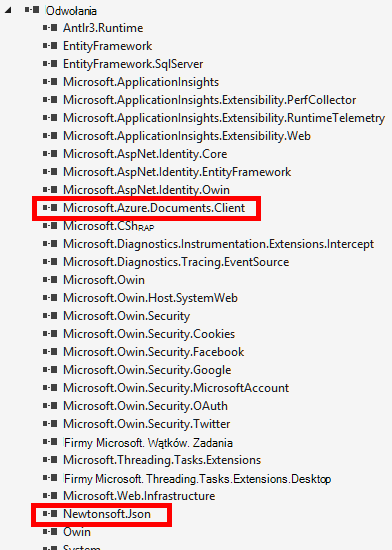

##Krok 4: Konfigurowanie aplikacji MVC programu ASP.NET
 
Teraz Dodawanie modeli, widoków i kontrolerów do tej aplikacji MVC:

- [Dodaj model](#_Toc395637764).
- [Dodawanie kontrolera](#_Toc395637765).
- [Dodawanie widoków](#_Toc395637766).

### Dodawanie JSON modelu danych

Zacznijmy od utworzenia **M** w MVC, modelu. 

1. W **Eksploratorze rozwiązań**kliknij prawym przyciskiem myszy folder **modeli** , kliknij przycisk **Dodaj**, a następnie kliknij **zajęć**.

    Zostanie wyświetlone okno dialogowe **Dodawanie nowego elementu** .

2. Określ nazwę nowej klasy **Item.cs** i kliknij przycisk **Dodaj**. 

3. W tym nowego pliku **Item.cs** Dodaj następujący po ostatniej *za pomocą instrukcji*.
        
        using Newtonsoft.Json;
    
4. Teraz zamienić kod 
        
        public class Item
        {
        }

    przy użyciu następującego kodu.

        public class Item
        {
            [JsonProperty(PropertyName = "id")]
            public string Id { get; set; }
             
            [JsonProperty(PropertyName = "name")]
            public string Name { get; set; }

            [JsonProperty(PropertyName = "description")]
            public string Description { get; set; }

            [JsonProperty(PropertyName = "isComplete")]
            public bool Completed { get; set; }
        }

    Wszystkie dane w DocumentDB jest przekazywane przez sieć i przechowywane jako JSON. Aby kontrolować sposób obiekty są seryjnych i rozszeregować przez JSON.NET można użyć atrybutu **JsonProperty** , jak pokazano w klasie **elementu** , który właśnie utworzony. Możesz nie **mieć** zrobić to ale chcę upewnić się, że Moja właściwości wykonaj konwencje nazewnictwa camelCase JSON. 
    
    Nie tylko możesz sterować format nazwy właściwości trafia do JSON, ale można całkowicie zmienić nazwę właściwości .NET, jak to zostało I właściwość **Opis** . 
    

### Dodawanie kontrolera

Który ma zwracać **M**teraz Przejdźmy tworzenie **C** w MVC, klasy kontrolerze.

1. W **Eksploratorze rozwiązań**kliknij prawym przyciskiem myszy folder **kontrolerów** , kliknij przycisk **Dodaj**, a następnie kliknij **Kontroler**.

    Zostanie wyświetlone okno dialogowe **Dodawanie Scaffold** .

2. Wybierz **MVC kontroler 5 - puste** , a następnie kliknij przycisk **Dodaj**.

    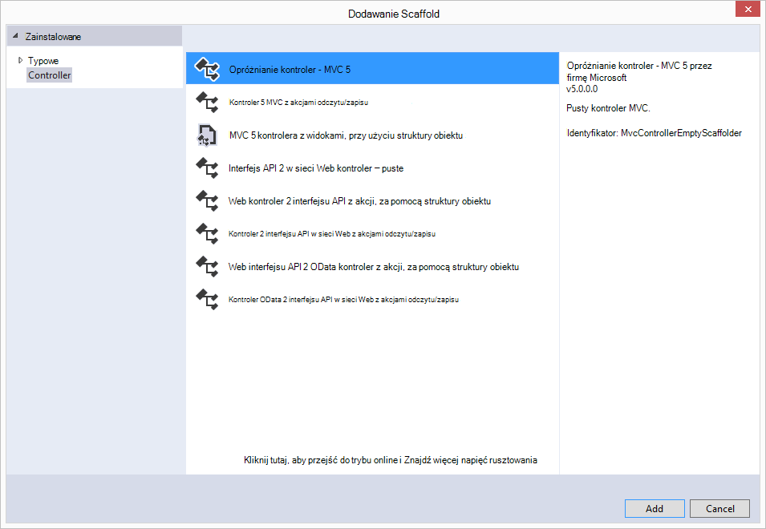

3. Nadaj nazwę nowej kontrolerze, **ItemController.**

    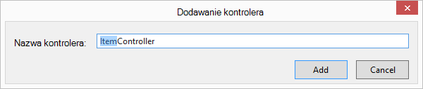

    Po utworzeniu pliku rozwiązania programu Visual Studio powinien przypominać następujący nowy plik ItemController.cs w **Eksploratorze rozwiązań**. Wyświetlane są również nowy plik Item.cs utworzony wcześniej.

    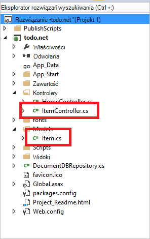

    Możesz zamknąć ItemController.cs, firma Microsoft będzie powracanie do niego. 

### Dodawanie widoków

Teraz tworzenie **V** w MVC, widoków:

- [Dodaj widok indeksu elementu](#AddItemIndexView).
- [Dodawanie widoku nowy element](#AddNewIndexView).
- [Dodaj widok Edytuj element](#_Toc395888515).

#### Dodawanie widoku indeksu elementu

1. W **Eksploratorze rozwiązań**rozwiń folder **Widoki** , kliknij prawym przyciskiem myszy Opróżnij folder **elementu** , który Visual Studio utworzony, gdy dodano **ItemController** wcześniej, kliknij przycisk **Dodaj**, a następnie kliknij **Widok**.

    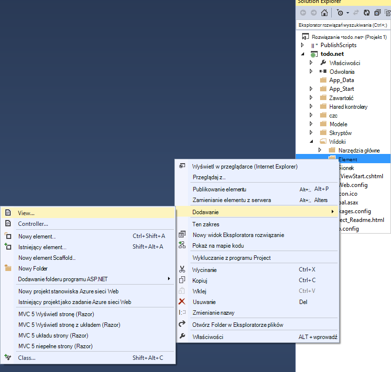

2. W oknie dialogowym **Dodawanie widoku** wykonaj następujące czynności:
    - W polu **Nazwa widoku** wpisz ***indeksu***.
    - W polu **szablonu** wybierz ***listę***.
    - W polu **Klasa modelu** wybierz ***elementu (zadania. Modele)***.
    - Pozostaw pole **klasy kontekst danych** jest puste. 
    - W polu Układ strony wpisz ***~/Views/Shared/_Layout.cshtml***.
    
    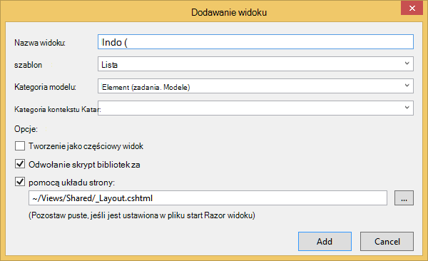

3. Po ustawieniu te wartości, kliknij przycisk **Dodaj** , a następnie umożliwić Visual Studio umożliwia utworzenie nowego widoku szablonu. Po zakończeniu, zostanie otwarta plik cshtml, który został utworzony. Możemy zamknąć tego pliku w programie Visual Studio, jak firma Microsoft będzie powracanie do niego.

#### Dodawanie widoku nowego elementu

Podobnie jak możemy utworzyć widok **Indeksu elementu** , zostanie teraz utworzony nowy widok do tworzenia nowych **elementów**.

1. W **Eksploratorze rozwiązań**ponownie kliknij prawym przyciskiem myszy folder **elementu** , kliknij przycisk **Dodaj**, a następnie kliknij **Widok**.

2. W oknie dialogowym **Dodawanie widoku** wykonaj następujące czynności:
    - W polu **Nazwa widoku** wpisz ***Utwórz***.
    - W polu **szablon** wybierz pozycję ***Utwórz***.
    - W polu **Klasa modelu** wybierz ***elementu (zadania. Modele)***.
    - Pozostaw pole **klasy kontekst danych** jest puste.
    - W polu Układ strony wpisz ***~/Views/Shared/_Layout.cshtml***.
    - Kliknij przycisk **Dodaj**.

#### Dodawanie widoku Edytuj element

A na koniec dodać jeden ostatniego widoku do edycji **elementu** w taki sam sposób, jak przed.

1. W **Eksploratorze rozwiązań**ponownie kliknij prawym przyciskiem myszy folder **elementu** , kliknij przycisk **Dodaj**, a następnie kliknij **Widok**.

2. W oknie dialogowym **Dodawanie widoku** wykonaj następujące czynności:
    - W polu **Nazwa widoku** wpisz ***edytować***.
    - W polu **szablonu** kliknij przycisk ***Edytuj***.
    - W polu **Klasa modelu** wybierz ***elementu (zadania. Modele)***.
    - Pozostaw pole **klasy kontekst danych** jest puste. 
    - W polu Układ strony wpisz ***~/Views/Shared/_Layout.cshtml***.
    - Kliknij przycisk **Dodaj**.

Gdy jest to możliwe, zamknij wszystkie dokumenty cshtml w programie Visual Studio, jak będziemy z powrotem do tych widoków później.

## Krok 5: Instalacji elektrycznej DocumentDB w górę

Teraz, gdy jest wykonywane obsługę standardowy rzeczy MVC, Przejdźmy przejdź do dodawania kodu dla DocumentDB. 

W tej sekcji będziemy dodawać kod obsługujący następujące czynności:

- [Wyświetlanie elementów niekompletna](#_Toc395637770).
- [Dodawanie elementów](#_Toc395637771).
- [Edytowanie elementów](#_Toc395637772).

### Wyświetlanie niepełne elementy w aplikacji sieci web MVC

Najpierw tutaj jest dodawanie klasa, która zawiera wszystkie logiki do łączenia się i używanie DocumentDB. Ten samouczek firma Microsoft będzie umieszczać wszystkich ten reguł w celu klasy repozytorium o nazwie DocumentDBRepository. 

1. W **Eksploratorze rozwiązań**kliknij prawym przyciskiem myszy w projekcie, kliknij przycisk **Dodaj**, a następnie kliknij **zajęć**. Określ nazwę nowej klasy **DocumentDBRepository** i kliknij przycisk **Dodaj**.
 
2. W nowo utworzonych **DocumentDBRepository** klasy i dodaj następujące *przy użyciu instrukcji* powyżej deklaracji *przestrzeń nazw*
        
        using Microsoft.Azure.Documents; 
        using Microsoft.Azure.Documents.Client; 
        using Microsoft.Azure.Documents.Linq; 
        using System.Configuration;
        using System.Linq.Expressions;
        using System.Threading.Tasks;

    Teraz zamienić kod 

        public class DocumentDBRepository
        {
        }

    przy użyciu następującego kodu.

        public static class DocumentDBRepository<T> where T : class
        {
            private static readonly string DatabaseId = ConfigurationManager.AppSettings["database"];
            private static readonly string CollectionId = ConfigurationManager.AppSettings["collection"];
            private static DocumentClient client;
    
            public static void Initialize()
            {
                client = new DocumentClient(new Uri(ConfigurationManager.AppSettings["endpoint"]), ConfigurationManager.AppSettings["authKey"]);
                CreateDatabaseIfNotExistsAsync().Wait();
                CreateCollectionIfNotExistsAsync().Wait();
            }
    
            private static async Task CreateDatabaseIfNotExistsAsync()
            {
                try
                {
                    await client.ReadDatabaseAsync(UriFactory.CreateDatabaseUri(DatabaseId));
                }
                catch (DocumentClientException e)
                {
                    if (e.StatusCode == System.Net.HttpStatusCode.NotFound)
                    {
                        await client.CreateDatabaseAsync(new Database { Id = DatabaseId });
                    }
                    else
                    {
                        throw;
                    }
                }
            }
    
            private static async Task CreateCollectionIfNotExistsAsync()
            {
                try
                {
                    await client.ReadDocumentCollectionAsync(UriFactory.CreateDocumentCollectionUri(DatabaseId, CollectionId));
                }
                catch (DocumentClientException e)
                {
                    if (e.StatusCode == System.Net.HttpStatusCode.NotFound)
                    {
                        await client.CreateDocumentCollectionAsync(
                            UriFactory.CreateDatabaseUri(DatabaseId),
                            new DocumentCollection { Id = CollectionId },
                            new RequestOptions { OfferThroughput = 1000 });
                    }
                    else
                    {
                        throw;
                    }
                }
            }
        }

    > [AZURE.TIP] Podczas tworzenia nowego DocumentCollection należy podać parametr RequestOptions opcjonalnie OfferType, dzięki czemu można określić poziom wydajności nowej kolekcji. Jeśli ten parametr nie jest przekazywany zostanie użyty domyślny typ oferty. Aby uzyskać więcej informacji na temat DocumentDB typów oferty, zapoznaj się [Poziomy wydajności DocumentDB](documentdb-performance-levels.md)

3. Firma Microsoft czytasz niektórych wartości z konfiguracji, dlatego Otwórz plik **Web.config** aplikacji i dodaj następujące wiersze w `<AppSettings>` sekcji.
    
        <add key="endpoint" value="enter the URI from the Keys blade of the Azure Portal"/>
        <add key="authKey" value="enter the PRIMARY KEY, or the SECONDARY KEY, from the Keys blade of the Azure  Portal"/>
        <add key="database" value="ToDoList"/>
        <add key="collection" value="Items"/>
    
4. Teraz zaktualizować wartości dla *punktu końcowego* i *authKey* przy użyciu karta klawiszy: Azure Portal. Za pomocą **identyfikatora URI** z karta klawiszy jako wartość ustawienia punktu końcowego i użyć **Klucza podstawowego**lub **Klucza POMOCNICZEGO** z karta klawiszy jako wartość ustawienia authKey.

    Gdy care ma części połączeń zapasowej repozytorium DocumentDB teraz Przejdźmy dodać naszym logikę aplikacji.

5. Najpierw chcemy, aby można było zrobić z aplikacją listy zadania są wyświetlane niepełne elementy.  Skopiuj i wklej następujące wstawkę kodu w dowolnym miejscu w klasie **DocumentDBRepository** .

        public static async Task<IEnumerable<T>> GetItemsAsync(Expression<Func<T, bool>> predicate)
        {
            IDocumentQuery<T> query = client.CreateDocumentQuery<T>(
                UriFactory.CreateDocumentCollectionUri(DatabaseId, CollectionId))
                .Where(predicate)
                .AsDocumentQuery();

            List<T> results = new List<T>();
            while (query.HasMoreResults)
            {
                results.AddRange(await query.ExecuteNextAsync<T>());
            }

            return results;
        }

6. Otwórz **ItemController** firma Microsoft nie zostały dodane wcześniej i dodaj następujące *przy użyciu instrukcji* powyżej deklarację nazw.

        using System.Net;
        using System.Threading.Tasks;
        using todo.Models;

    Jeśli projekt nie ma nazwę "zadania", należy zaktualizować za pomocą "zadania. Modeli"; tak, aby odzwierciedlała nazwy projektu.

    Teraz zamienić kod

        //GET: Item
        public ActionResult Index()
        {
            return View();
        }

    przy użyciu następującego kodu.

        [ActionName("Index")]
        public async Task<ActionResult> IndexAsync()
        {
            var items = await DocumentDBRepository<Item>.GetItemsAsync(d => !d.Completed);
            return View(items);
        }
    
7. Otwórz **Global.asax.cs** i Dodaj następujący wiersz do metody **Application_Start** 
 
        DocumentDBRepository<todo.Models.Item>.Initialize();
    
W tym momencie rozwiązanie powinno być możliwe do utworzenia bez błędów.

Jeśli po uruchomieniu aplikacji teraz, czy możesz przejść do **HomeController** i widoku **indeksu** tego kontrolera. Jest to zachowanie domyślne dla wybranych na początku projektu szablonu MVC, ale nie chcemy, który! Zmienianie Przejdźmy routingu w tej aplikacji MVC, aby zmienić to zachowanie.

Otwórz ***aplikacji\_Start\RouteConfig.cs*** i odszukaj wiersz, zaczynając od "ustawień domyślnych:" i zmień ją na podobne do następujących.

        defaults: new { controller = "Item", action = "Index", id = UrlParameter.Optional }

Ten teraz informuje MVC ASP.NET, przez Jeśli nie wybrano wartość w polu adres URL umożliwiający sterowanie działaniem routingu to zamiast tego **Narzędzia główne**, **element** jako kontroler i użytkownika **indeks** jako widok.

Teraz po uruchomieniu aplikacji nawiąże połączenie do swojego **ItemController** nawiązywanie połączenia klasie repozytorium i zwrócić niepełne elementy do **widoków**za pomocą metody GetItems\\**elementu**\\widoku**indeksu** . 

Jeśli tworzenie i uruchom teraz tego projektu, możesz powinien zostać wyświetlony w zawartości, która wygląda następująco.    

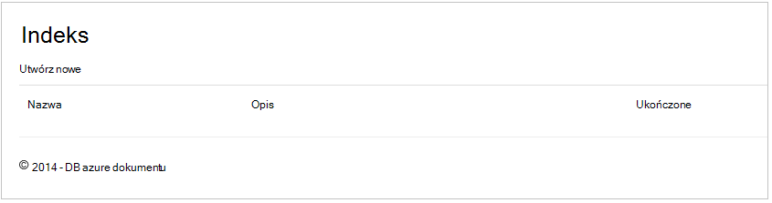

### Dodawanie elementów

Załóżmy umieścić niektórych elementów do naszej bazy danych, aby coś więcej niż puste siatkę, aby przeglądać mamy.

Dodawanie kodu do DocumentDBRepository i ItemController, aby rekordu w DocumentDB.

1.  Dodaj następujące metody do swojej klasy **DocumentDBRepository** .

        public static async Task<Document> CreateItemAsync(T item)
        {
            return await client.CreateDocumentAsync(UriFactory.CreateDocumentCollectionUri(DatabaseId, CollectionId), item);
        }

    Tej metody można użyć po prostu przejście przekazywane do niej obiektu i będzie nadal występował DocumentDB.

2. Otwórz plik ItemController.cs i Dodaj następujący fragment kodu w klasie. Jest to, jak ASP.NET MVC wie, co należy zrobić akcji **utworzenie** . W tym przypadku można renderowania widoku Create.cshtml skojarzonego utworzony wcześniej.

        [ActionName("Create")]
        public async Task<ActionResult> CreateAsync()
        {
            return View();
        }

    Teraz potrzebujemy więcej kodu w tym kontroler, który akceptuje przesyłania z poziomu widoku **Tworzenie** .

2. Dodaj następny blok kodu do klasy ItemController.cs, wskazująca ASP.NET MVC, co zrobić z formularzem WPIS dla tego kontrolera.
    
        [HttpPost]
        [ActionName("Create")]
        [ValidateAntiForgeryToken]
        public async Task<ActionResult> CreateAsync([Bind(Include = "Id,Name,Description,Completed")] Item item)
        {
            if (ModelState.IsValid)
            {
                await DocumentDBRepository<Item>.CreateItemAsync(item);
                return RedirectToAction("Index");
            }

            return View(item);
        }

    Ten kod połączeń w celu DocumentDBRepository i używa metody CreateItemAsync pozostać nowej pozycji zadania w bazie danych. 
 
    **Uwaga dotycząca zabezpieczeń**: atrybut **ValidateAntiForgeryToken** jest używana w tym miejscu chronić tej aplikacji atakami fałszowaniu żądanie między witrynami. To wszystko do niego niż tylko dodanie ten atrybut, widoków konieczności pracy z ten token przeciw fałszowaniu. Aby uzyskać więcej informacji na temat oraz przykłady jak poprawnie zobacz [Zapobieganie fałszowaniu żądanie między witrynami][]. Kod źródłowy na [GitHub][] ma pełnego wykonania w miejscu.

    **Uwaga dotycząca zabezpieczeń**: również używamy atrybutu **powiązać** na parametr metody chronić przed nadmiernie opublikowanie atakami. Aby uzyskać więcej informacji, zobacz [Podstawowe OBSŁUGIWAŁ operacje w ASP.NET MVC][].

Zakończenie kodu wymaganego do dodawania nowych elementów do naszych bazy danych.

### Edytowanie elementów

Jest jedno ostatniej dla nam robić i to możliwości edytowania **elementów** w bazie danych i oznaczone jako zakończone. Widok do edycji został już dodany do projektu, potrzebujemy tylko dodawanie kodu do naszych kontrolera i klasy **DocumentDBRepository** ponownie.

1. Dodaj następującą wartość do klasy **DocumentDBRepository** .

        public static async Task<Document> UpdateItemAsync(string id, T item)
        {
            return await client.ReplaceDocumentAsync(UriFactory.CreateDocumentUri(DatabaseId, CollectionId, id), item);
        }

        public static async Task<T> GetItemAsync(string id)
        {
            try
            {
                Document document = await client.ReadDocumentAsync(UriFactory.CreateDocumentUri(DatabaseId, CollectionId, id));
                return (T)(dynamic)document;
            }
            catch (DocumentClientException e)
            {
                if (e.StatusCode == HttpStatusCode.NotFound)
                {
                    return null;
                }
                else
                {
                    throw;
                }
            }
        }
    
    Pierwsza z tych metod **GetItem** pobiera element z DocumentDB, który jest przekazywany do **ItemController** , a następnie do **edytowania** widoku.
    
    Druga metod właśnie dodaliśmy zastępuje przekazanych **dokumentów** w DocumentDB przy użyciu wersji **dokumentu** w z **ItemController**.

2. Dodaj następującą wartość do klasy **ItemController** .

        [HttpPost]
        [ActionName("Edit")]
        [ValidateAntiForgeryToken]
        public async Task<ActionResult> EditAsync([Bind(Include = "Id,Name,Description,Completed")] Item item)
        {
            if (ModelState.IsValid)
            {
                await DocumentDBRepository<Item>.UpdateItemAsync(item.Id, item);
                return RedirectToAction("Index");
            }

            return View(item);
        }

        [ActionName("Edit")]
        public async Task<ActionResult> EditAsync(string id)
        {
            if (id == null)
            {
                return new HttpStatusCodeResult(HttpStatusCode.BadRequest);
            }

            Item item = await DocumentDBRepository<Item>.GetItemAsync(id);
            if (item == null)
            {
                return HttpNotFound();
            }

            return View(item);
        }
    
    Pierwsza metoda obsługuje Http GET występująca wówczas, gdy użytkownik kliknie łącze **Edytuj** w widoku **indeksu** . Ta metoda pobiera [**dokumentu**](http://msdn.microsoft.com/library/azure/microsoft.azure.documents.document.aspx) z DocumentDB i przekazuje je do **edytowania** widoku.

    W widoku **edycji** wykona następnie Http POST **IndexController**. 
    
    Druga metoda dodana uchwyty przekazywania zaktualizowany obiekt do DocumentDB, aby być zachowywane w bazie danych.

To wszystko, który jest wszystko, co trzeba uruchomić nasz aplikację, lista niepełne **elementy**dodawane nowe **elementy**i edytowanie **elementów**.

## Krok 6: Uruchom aplikację lokalnie

Aby przetestować aplikację na komputerze lokalnym, wykonaj następujące czynności:

1. Wybierz przycisk F5 w programie Visual Studio do tworzenia aplikacji w trybie debugowania. Powinien utworzenie aplikacji i uruchamianie przeglądarki ze stroną pustego siatki, którą przedstawiono możemy wcześniej:

    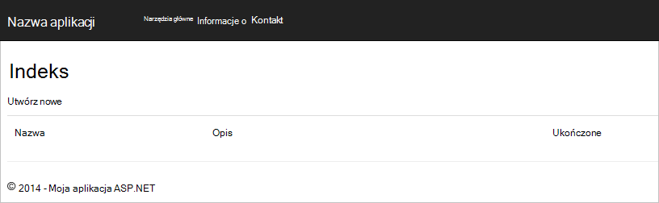

    Jeśli używasz programu Visual Studio 2013 i występuje błąd "Nie można oczekiwać w treści klauzulę efektywnej." należy zainstalować [pakiet nuget Microsoft.Net.Compilers](https://www.nuget.org/packages/Microsoft.Net.Compilers/). Możesz również porównać kodzie przed przykładowy projekt na [GitHub][]. 

2. Kliknij pozycję **Utwórz nowe** łącze i dodawanie wartości w polach **Nazwa** i **Opis** . Opuść **wykonane** zaznacz pole niezaznaczone w przeciwnym razie nowy **element** zostanie dodany zakończony i nie będą wyświetlane na liście początkowej.

    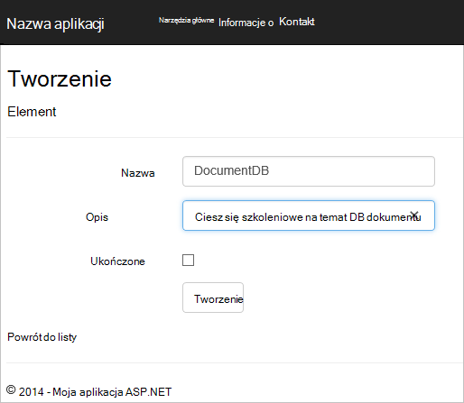

3. Kliknij pozycję **Utwórz** i nastąpi przekierowanie do widoku **indeks** , a **element** zostanie wyświetlona na liście.

    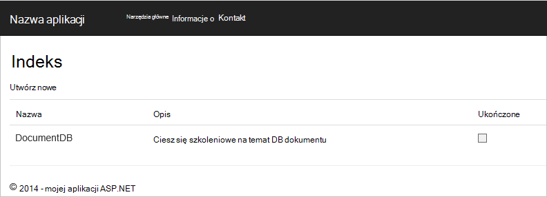

    Zachęcamy dodać kilka więcej **elementów** do listy zadania.

3. Kliknij przycisk **Edytuj** obok **elementu** na liście i są pobierane do **edytowania** widoku, w którym można aktualizować dowolnej właściwości obiektu, łącznie z flagi **ukończone** . Jeśli oznaczyć flagą **Wykonano** i kliknij przycisk **Zapisz**, **element** zostanie usunięty z listy zadania nieukończone.

    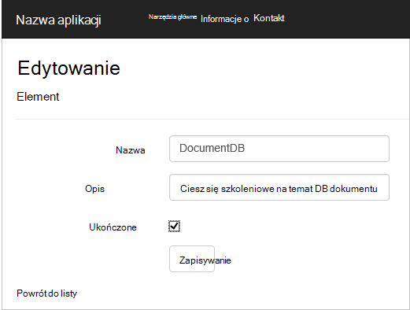

4. Po przetestowaniu aplikacji, naciśnij klawisze Ctrl + F5 do Zatrzymaj debugowanie aplikacji. Gotowe do wdrożenia!

## Krok 7: Wdrażanie aplikacji do witryn sieci Web Azure

Teraz, gdy masz pełną aplikacji działają poprawnie z DocumentDB możemy zacząć wdrażanie tej aplikacji sieci web do Azure witryn sieci Web. W przypadku wybrania **hosta w chmurze** , tworząc pusty projekt ASP.NET MVC Visual Studio ułatwia to naprawdę i wykonuje większość pracy. 

1. Aby opublikować tej aplikacji jest wszystko, co należy zrobić kliknij prawym przyciskiem myszy nad projektem w **Eksploratorze rozwiązań** i kliknij przycisk **Publikuj**.

    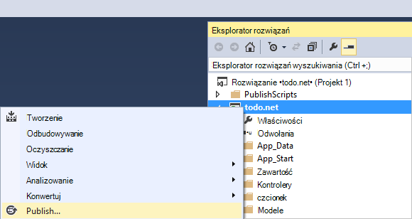

2. Wszystkie elementy powinny być już skonfigurowane według poświadczenia; w rzeczywistości witryny sieci Web już istnieje w Azure dla Ciebie na adres **Docelowy adres URL** widoczny, wszystko, co należy zrobić to, kliknij pozycję **Publikuj**.

    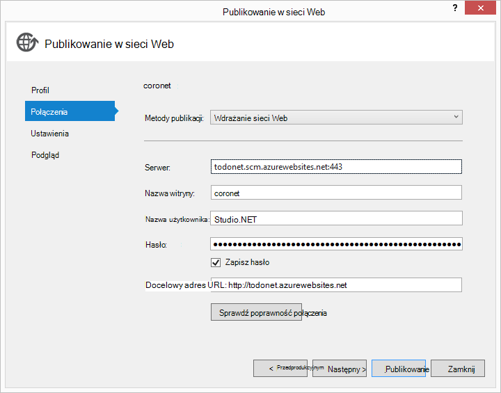

W ciągu kilku sekund Visual Studio Zakończ publikowanie aplikacji sieci web i przeglądarki, w której są wyświetlane pod ręką pracy z platformy Azure!

## Następne kroki

Gratulacje! Po prostu wbudowany do pierwszej MVC ASP.NET aplikacji sieci web przy użyciu Azure DocumentDB i opublikowany go do Azure witryn sieci Web. Kod źródłowy wykonania aplikacji, w tym szczegóły i usuń funkcje, które nie zostały uwzględnione w tym samouczku można pobrać lub sklonowany z [GitHub][]. Dlatego jeśli interesują Cię dodawania który do aplikacji, chwyć kod i dodać go do tej aplikacji.

Aby dodać dodatkowe funkcje dla aplikacji, przejrzyj dostępne w [Bibliotece .NET DocumentDB](https://msdn.microsoft.com/library/azure/dn948556.aspx) API i zachęcamy do współtworzenia biblioteki .NET DocumentDB na [GitHub][]. 

[\*]: https://microsoft.sharepoint.com/teams/DocDB/Shared%20Documents/Documentation/Docs.LatestVersions/PicExportError
[Visual Studio Express]: http://www.visualstudio.com/products/visual-studio-express-vs.aspx
[Instalator platformy Microsoft w sieci Web]: http://www.microsoft.com/web/downloads/platform.aspx
[Zapobieganie fałszowaniu żądanie między witrynami]: http://go.microsoft.com/fwlink/?LinkID=517254
[Podstawowe OBSŁUGIWAŁ operacje w MVC programu ASP.NET]: http://go.microsoft.com/fwlink/?LinkId=317598
[GitHub]: https://github.com/Azure-Samples/documentdb-net-todo-app
