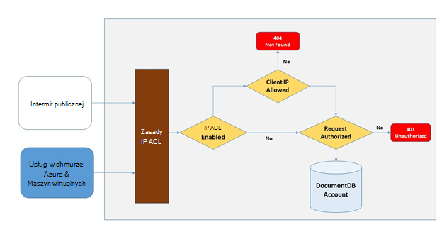
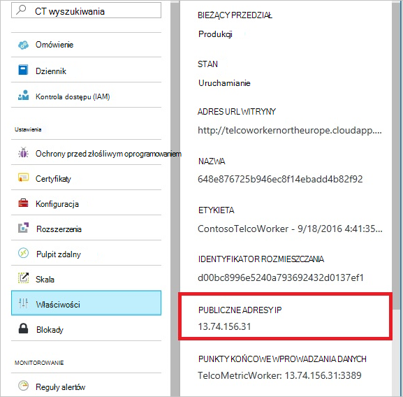
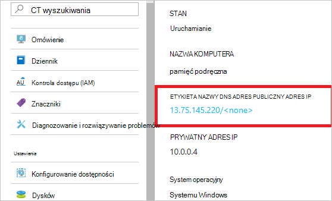
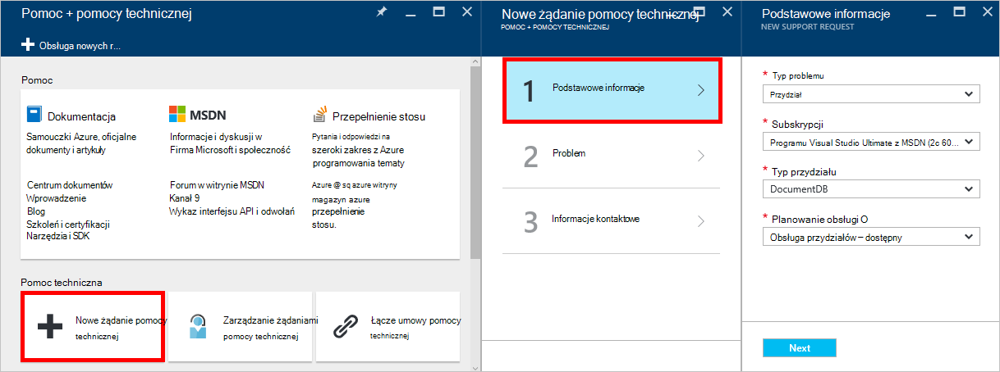
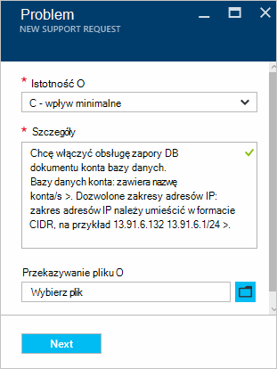

<properties
    pageTitle="Obsługa zapory DocumentDB | Microsoft Azure"
    description="Dowiedz się, jak używać zasad kontroli dostępu IP zaporę systemu Azure DocumentDB konta bazy danych."
    keywords="Kontrola dostępu IP, obsługa zapory"
    services="documentdb"
    authors="shahankur11"
    manager="jhubbard"
    editor=""
    tags="azure-resource-manager"
    documentationCenter=""/>

<tags 
    ms.service="documentdb" 
    ms.workload="data-services" 
    ms.tgt_pltfrm="na" 
    ms.devlang="na" 
    ms.topic="article" 
    ms.date="10/17/2016" 
    ms.author="ankshah; kraman"/>

# Obsługa zapory DocumentDB

Aby zabezpieczyć dane przechowywane w konto Azure DocumentDB bazy danych, DocumentDB przewiduje pomocy technicznej tajne podstawie [modelu autoryzacji](https://msdn.microsoft.com/library/azure/dn783368.aspx) używającego kod uwierzytelniania silnych wiadomości oparty na procesie mieszania (HMAC). Oprócz modelu tajne autoryzacji oparte na plikach DocumentDB obsługuje teraz, zasady pracy opartych na uzyskiwanie dostępu do formantów obsługę zapory dla ruchu przychodzącego. Ten model jest bardzo podobne do reguły zapory systemu tradycyjnych bazy danych i zapewnia dodatkowy poziom zabezpieczeń konta DocumentDB bazy danych. W tym modelu można teraz konfigurować konta DocumentDB bazy danych są dostępne tylko z zatwierdzony zestawu maszyn i/lub usług w chmurze. Dostęp do zasobów DocumentDB z tych zatwierdzonych zestawów komputery i usługi wymagają nadal rozmówcy do prezentowania tokenu ważne zezwolenie.

## Omówienie kontroli dostępu IP

Domyślnie konto DocumentDB bazy danych jest dostępne za pośrednictwem publicznego Internetu, jak żądanie towarzyszy tokenu ważne zezwolenie. Aby skonfigurować kontroli dostępu na podstawie zasad IP, użytkownik musi obsługiwać zestaw adresów IP lub zakresy adresów IP w formularzu CIDR do włączenia na liście dozwolone adresy IP klienta dla konta bazy danych. Po zastosowaniu tej konfiguracji wszystkie żądania pochodzące z komputerów spoza tej listy dozwolonych zostaną zablokowane przez serwer.  Na poniższym diagramie opisano połączenia, przetwarzanie przepływu kontrola dostępu opartego na protokole.

## Połączenia z usługami w chmurze

W Azure usług w chmurze są często sposób obsługi logiczny usługi warstwy środkowej przy użyciu DocumentDB. Aby włączyć dostęp do konta DocumentDB bazy danych z usługi w chmurze, publiczny adres IP usługi w chmurze musi zostać dodana do listy dozwolonych adresów IP skojarzonego z kontem DocumentDB bazy danych, [kontaktując się z Azure pomocy technicznej](#configure-ip-policy).  Gwarantuje to, że wszystkie wystąpienia roli usług w chmurze uzyskiwania dostępu do konta DocumentDB bazy danych. Można pobrać adresów IP dla usługi cloud w portalu usługi Azure, jak pokazano w poniższej zrzut ekranu. 

W przypadku skalowania się usługa w chmurze, dodając dodatkowe roli wystąpienia tych nowych wystąpień automatycznie uzyskuje dostęp do DocumentDB konto bazy danych, ponieważ są one częścią samej usługi w chmurze.

## Połączenia z maszyn wirtualnych

[Maszyn wirtualnych](https://azure.microsoft.com/services/virtual-machines/) lub [Ustawia skali maszyn wirtualnych](../virtual-machine-scale-sets/virtual-machine-scale-sets-overview.md) można również udostępniać usług warstwy środkowej przy użyciu DocumentDB.  Aby skonfigurować DocumentDB konto bazy danych, aby umożliwić dostęp z maszyn wirtualnych, publiczne adresy IP maszyn wirtualnych i/lub maszyn wirtualnych Skala Ustaw musi być skonfigurowany w jednym z dozwolonych adresów IP dla Twojego konta bazy danych DocumentDB, [kontaktując się z Azure pomocy technicznej](#configure-ip-policy). Można pobrać adresów IP dla maszyn wirtualnych w portalu usługi Azure, jak pokazano w poniższej zrzut ekranu.

Wystąpienia dodatkowe maszyn wirtualnych można dodać do grupy, są automatycznie dostarczane uzyskiwania dostępu do konta DocumentDB bazy danych.

## Połączenia z Internetem

Podczas uzyskiwania dostępu do konta DocumentDB bazy danych przy użyciu komputera w Internecie, adres IP klienta lub zakres adresów IP komputera musi zostać dodana do listy dozwolonych adresów IP dla konta DocumentDB bazy danych. 

## Konfigurowanie zasad kontroli dostępu IP

Azure portal umożliwia zgłoszenie żądania z [Obsługą Azure](https://portal.azure.com/?#blade/Microsoft_Azure_Support/HelpAndSupportBlade) umożliwiające zasadami kontroli dostępu IP na Twoim koncie bazy danych.

1. W karta [pomocy + pomocy technicznej](https://portal.azure.com/?#blade/Microsoft_Azure_Support/HelpAndSupportBlade) wybierz **Nowy obsługuje żądania**.
2. W karta **Nowy obsługuje żądania** wybierz **podstawy**.
3. W karta **podstawy** wybierz następujące czynności:
    - **Typ problemu**: przydziału
    - **Subskrypcja**: subskrypcji skojarzone z kontem, w której chcesz dodać zasadami kontroli dostępu adresów IP.
    - **Typ przydziału**: DocumentDB
    - **Planowanie obsługi**: Obsługa przydziałów — dostępny.
4. Karta **Problem** wykonaj następujące czynności:
    - **Ważności**: zaznacz C - wpływ minimalnego
    - **Szczegóły**: Skopiuj następujący tekst w polu, a obejmują sekundę nazwę konta i adres IP i es: "Chcę włączyć obsługę zapory DocumentDB konta bazy danych. Bazy danych konta: *konto Dołącz nazwę/s*. Dozwolone zakresy adresów IP: *zawiera zakres adresów IP-CIDR, na przykład w formacie 13.91.6.132, 13.91.6.1/24*. "
    - Kliknij przycisk **Dalej**. 
5. Karta **informacje kontaktowe** i w w informacji o kontakcie kliknij przycisk **Utwórz**. 

Po otrzymaniu żądania kontroli dostępu IP powinna być włączona w ciągu 24 godzin. Po zakończeniu żądanie, otrzymasz powiadomienie.

## Rozwiązywanie problemów z zasadami kontroli dostępu IP

### Operacje portalu

Po włączeniu zasad kontroli dostępu adresów IP dla konta DocumentDB bazy danych, wszystkie uzyskiwania dostępu do konta DocumentDB bazy danych z komputerów poza skonfigurowaną dozwolone, blokowanych listę zakresów adresów IP. Na podstawie tego modelu przeglądania operacji płaszczyzny danych z portalu zostaną również zablokowane do zapewnienia integralności kontroli dostępu. 

### Interfejs API SDK i pozostałe

Aby uzyskać ze względów bezpieczeństwa, dostępu za pośrednictwem SDK lub interfejsu API usługi REST z komputerów nie ma na liście dozwolonych zwróci ogólnego 404 odpowiedzi nie można odnaleźć z żadne dodatkowe szczegóły. Sprawdź, czy skonfigurowane dla Twojego konta bazy danych DocumentDB listy dozwolonych adresów IP mieć pewność, że konfiguracja zasad poprawne zostanie zastosowany do konta DocumentDB bazy danych.

## Następne kroki

Informacji o sieci porad dotyczących wydajności pokrewne, zobacz [porady dotyczące wydajności](documentdb-performance-tips.md).