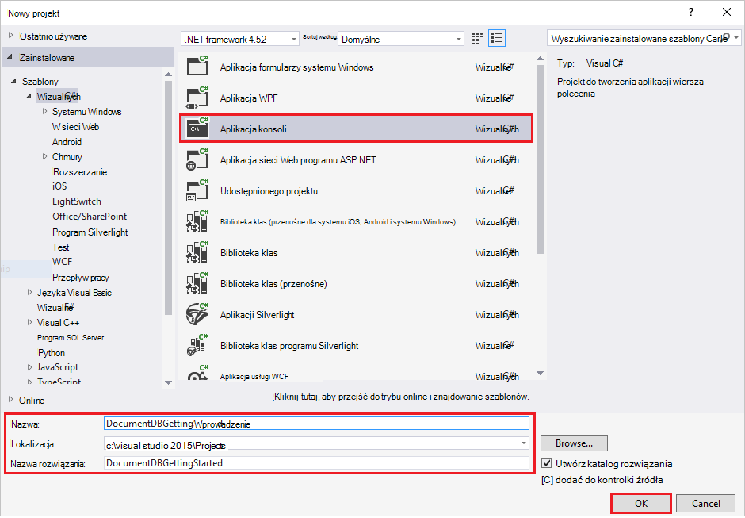
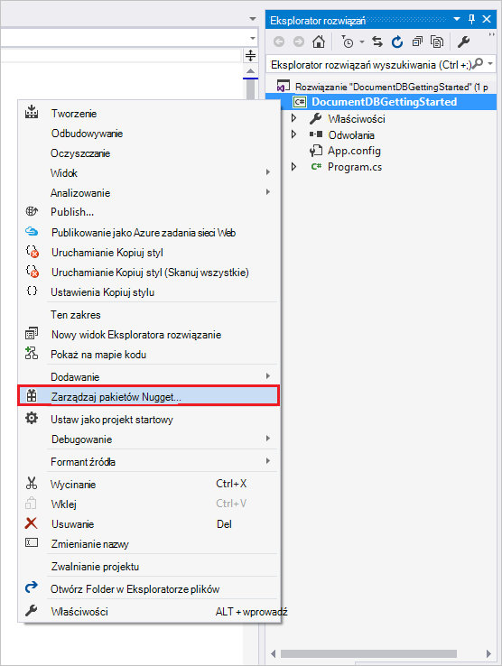
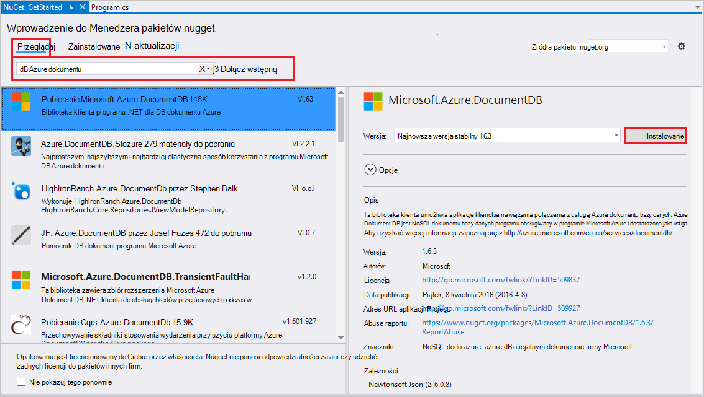
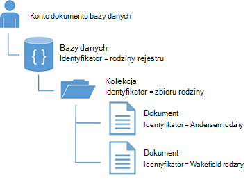
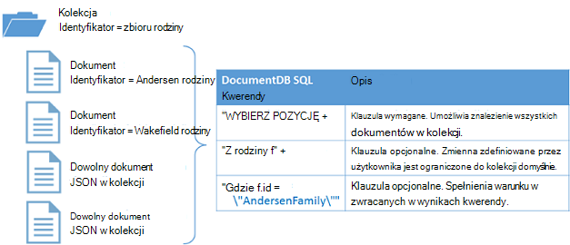

<properties
    pageTitle="Samouczek NoSQL: DocumentDB .NET SDK | Microsoft Azure"
    description="Samouczek NoSQL tworzące online bazy danych i C# aplikacji konsoli przy użyciu zestawu SDK .NET DocumentDB. DocumentDB jest NoSQL bazy danych w celu JSON."
    keywords="nosql samouczek online bazy danych aplikacji konsoli c#"
    services="documentdb"
    documentationCenter=".net"
    authors="AndrewHoh"
    manager="jhubbard"
    editor="monicar"/>

<tags
    ms.service="documentdb"
    ms.workload="data-services"
    ms.tgt_pltfrm="na"
    ms.devlang="dotnet"
    ms.topic="hero-article"
    ms.date="08/29/2016"
    ms.author="anhoh"/>

# NoSQL samouczek: tworzenie C DocumentDB # aplikacji konsoli

> [AZURE.SELECTOR]
- [.NET](documentdb-get-started.md)
- [Node.js](documentdb-nodejs-get-started.md)

Zapraszamy do samouczka NoSQL dla zestawu SDK .NET DocumentDB Azure! Po wykonaniu tego samouczka, będą dostępne tworzonej aplikacji konsoli i kwerend DocumentDB zasobów.

Omówiono:

- Tworzenie i nawiązywanie połączenia z kontem DocumentDB
- Konfigurowanie rozwiązania programu Visual Studio
- Tworzenie bazy danych w trybie online
- Tworzenie kolekcji
- Tworzenie dokumentów JSON
- Kwerenda kolekcji
- Zastępowanie dokumentu
- Usuwanie dokumentu
- Usuwanie bazy danych

Nie masz czasu? Nie martw się! Kompleksowym rozwiązaniem jest dostępna na [GitHub](https://github.com/Azure-Samples/documentdb-dotnet-getting-started). Szybkie przejście do [Uzyskiwanie sekcji kompleksowym rozwiązaniem](#GetSolution) dla szybkie instrukcje.

Później użyj przycisków głosowania u góry lub u dołu strony, aby przekazać nam opinię. Jeśli chcesz, abyśmy skontaktować się z Tobą bezpośrednio, zachęcamy do Podaj swój adres e-mail w komentarzach.

Teraz Zaczynamy!

## Wymagania wstępne

Upewnij się, że masz następujące czynności:

- Konto Azure active. Jeśli nie istnieje, możesz zalogować [bezpłatne konto](https://azure.microsoft.com/free/).
- [Program visual Studio 2013 / Visual Studio 2015 r](http://www.visualstudio.com/).
- .NET framework 4.6

## Krok 1: Tworzenie konta DocumentDB

Tworzenie konta DocumentDB. Jeśli masz już konto, którego chcesz użyć, można przejść dalej do [konfiguracji rozwiązania programu Visual Studio](#SetupVS).

[AZURE.INCLUDE [documentdb-create-dbaccount](../../includes/documentdb-create-dbaccount.md)]

## Krok 2: Skonfiguruj rozwiązania programu Visual Studio

1. Otwórz **program Visual Studio 2015** na Twoim komputerze.
2. W menu **plik** wybierz pozycję **Nowy**, a następnie wybierz **Projekt**.
3. W oknie dialogowym **Nowy projekt** , wybierz **Szablony** / **Visual C#** / **Aplikacji konsoli**nazwę projektu, a następnie kliknij **przycisk OK**.

4. W **Eksploratorze rozwiązań**kliknij prawym przyciskiem myszy nowej aplikacji konsoli, który znajduje się w obszarze rozwiązania programu Visual Studio.
5. Bez wychodzenia z menu, kliknij pozycję przesyłek **Zarządzanie NuGet...** 
 
6. Na karcie **Nuget** kliknij przycisk **Przeglądaj**, a następnie w polu wyszukiwania wpisz **azure documentdb** .
7. W wynikach Znajdź **Microsoft.Azure.DocumentDB** i kliknij przycisk **Zainstaluj**.
Identyfikator pakietu w bibliotece klienta DocumentDB jest [Microsoft.Azure.DocumentDB](https://www.nuget.org/packages/Microsoft.Azure.DocumentDB)

Doskonałe! Teraz, gdy mamy na koniec konfiguracji Zacznijmy napisanie kodu. Projekt kodu złożonym tego samouczka można znaleźć w [GitHub](https://github.com/Azure-Samples/documentdb-dotnet-getting-started/blob/master/src/Program.cs).

## Krok 3: Nawiązywanie połączenia z kontem DocumentDB

Najpierw należy dodać te odwołania do początku C# aplikacji, w pliku Plik Program.cs:

    using System;
    using System.Linq;
    using System.Threading.Tasks;

    // ADD THIS PART TO YOUR CODE
    using System.Net;
    using Microsoft.Azure.Documents;
    using Microsoft.Azure.Documents.Client;
    using Newtonsoft.Json;

> [AZURE.IMPORTANT] Aby można było użyć tego samouczka NoSQL, upewnij się, że możesz dodać zależności powyżej.

Dodanie tych dwóch stałych i do zmiennej *klienta* pod swojej publicznej klasy *programu*.

    public class Program
    {
        // ADD THIS PART TO YOUR CODE
        private const string EndpointUri = "<your endpoint URI>";
        private const string PrimaryKey = "<your key>";
        private DocumentClient client;

Następny głowy [Azure Portal](https://portal.azure.com) do swojego identyfikatora URI i klucza podstawowego. Identyfikator URI DocumentDB i klucza podstawowego są niezbędne dla aplikacji dowiedzieć się, gdzie można nawiązać połączenie oraz DocumentDB zaufać aplikacji połączenia.

W portalu Azure przejdź do swojego konta DocumentDB, a następnie kliknij **klawiszy**.

Skopiuj identyfikator URI z portalu i wklej je do `<your endpoint URI>` w pliku plik program.cs. Następnie skopiuj klucz podstawowy z portalu i wklej je do `<your key>`.

![Zrzut ekranu: Portal Azure używany przez samouczek NoSQL do tworzenia aplikacji konsoli C#. Zawiera konto DocumentDB z Centrum aktywne wyróżniony, przycisk klawiszy na karta konta DocumentDB wyróżniony i wartości identyfikatora URI, klucz podstawowy i POMOCNICZY klucz wyróżnione w karta klawiszy][keys]

Pobieranie aplikacji wprowadzenie początek przez utworzenie nowego wystąpienia programu **DocumentClient**.

Poniżej metody **główne** dodać to nowe zadanie asynchroniczne o nazwie **GetStartedDemo**, które będzie wystąpienia naszych nowych **DocumentClient**.

    static void Main(string[] args)
    {
    }

    // ADD THIS PART TO YOUR CODE
    private async Task GetStartedDemo()
    {
        this.client = new DocumentClient(new Uri(EndpointUri), PrimaryKey);
    }

Dodaj następujący kod uruchomienia asynchroniczne zadanie z metodę **głównego** . Metoda **główne** przechwytywać wyjątków, a następnie zapisać je do konsoli.

    static void Main(string[] args)
    {
            // ADD THIS PART TO YOUR CODE
            try
            {
                    Program p = new Program();
                    p.GetStartedDemo().Wait();
            }
            catch (DocumentClientException de)
            {
                    Exception baseException = de.GetBaseException();
                    Console.WriteLine("{0} error occurred: {1}, Message: {2}", de.StatusCode, de.Message, baseException.Message);
            }
            catch (Exception e)
            {
                    Exception baseException = e.GetBaseException();
                    Console.WriteLine("Error: {0}, Message: {1}", e.Message, baseException.Message);
            }
            finally
            {
                    Console.WriteLine("End of demo, press any key to exit.");
                    Console.ReadKey();
            }

Naciśnij klawisz **F5** , aby uruchomić aplikację.

Gratulacje! Pomyślnie połączono z konta DocumentDB, teraz Przyjrzyjmy pracy z zasobami DocumentDB.  

## Krok 4: Tworzenie bazy danych
Przed dodaniem kod tworzenia bazy danych należy dodać metodę Pomocnik pomocne przy tworzeniu do konsoli.

Kopiowanie i wklejanie metodę **WriteToConsoleAndPromptToContinue** pod metody **GetStartedDemo** .

    // ADD THIS PART TO YOUR CODE
    private void WriteToConsoleAndPromptToContinue(string format, params object[] args)
    {
            Console.WriteLine(format, args);
            Console.WriteLine("Press any key to continue ...");
            Console.ReadKey();
    }

DocumentDB [bazy danych](documentdb-resources.md#databases) można utworzyć przy użyciu metody [CreateDatabaseAsync](https://msdn.microsoft.com/library/microsoft.azure.documents.client.documentclient.createdatabaseasync.aspx) klasy **DocumentClient** . Baza danych jest kontenerze logiczne przechowywania dokumentów JSON podzielona między zbiorami.

Kopiowanie i wklejanie metodę **CreateDatabaseIfNotExists** pod metody **WriteToConsoleAndPromptToContinue** .

    // ADD THIS PART TO YOUR CODE
    private async Task CreateDatabaseIfNotExists(string databaseName)
    {
            // Check to verify a database with the id=FamilyDB does not exist
            try
            {
                    await this.client.ReadDatabaseAsync(UriFactory.CreateDatabaseUri(databaseName));
                    this.WriteToConsoleAndPromptToContinue("Found {0}", databaseName);
            }
            catch (DocumentClientException de)
            {
                    // If the database does not exist, create a new database
                    if (de.StatusCode == HttpStatusCode.NotFound)
                    {
                            await this.client.CreateDatabaseAsync(new Database { Id = databaseName });
                            this.WriteToConsoleAndPromptToContinue("Created {0}", databaseName);
                    }
                    else
                    {
                            throw;
                    }
            }
    }

Skopiuj i wklej następujący kod do metody **GetStartedDemo** pod tworzenia klienta. Spowoduje to utworzenie bazy danych o nazwie *FamilyDB*.

    private async Task GetStartedDemo()
    {
        this.client = new DocumentClient(new Uri(EndpointUri), PrimaryKey);

        // ADD THIS PART TO YOUR CODE
        await this.CreateDatabaseIfNotExists("FamilyDB_oa");

Naciśnij klawisz **F5** , aby uruchomić aplikację.

Gratulacje! Pomyślnie utworzono DocumentDB bazy danych.  

## Krok 5: Tworzenie zbioru  

> [AZURE.WARNING] **CreateDocumentCollectionAsync** utworzy nowy zbiór z przepustowości zastrzeżone, który ma wpływ ceny. Aby uzyskać więcej informacji odwiedź stronę naszych [ceny strony](https://azure.microsoft.com/pricing/details/documentdb/).

[Kolekcja](documentdb-resources.md#collections) mogą być tworzone przy użyciu metody [CreateDocumentCollectionAsync](https://msdn.microsoft.com/library/microsoft.azure.documents.client.documentclient.createdocumentcollectionasync.aspx) klasy **DocumentClient** . Kolekcja jest kontenerem JSON dokumentów i skojarzone logiki aplikacji języka JavaScript.

Kopiowanie i wklejanie metodę **CreateDocumentCollectionIfNotExists** pod metodę **CreateDatabaseIfNotExists** .

    // ADD THIS PART TO YOUR CODE
    private async Task CreateDocumentCollectionIfNotExists(string databaseName, string collectionName)
    {
        try
        {
            await this.client.ReadDocumentCollectionAsync(UriFactory.CreateDocumentCollectionUri(databaseName, collectionName));
            this.WriteToConsoleAndPromptToContinue("Found {0}", collectionName);
        }
        catch (DocumentClientException de)
        {
            // If the document collection does not exist, create a new collection
            if (de.StatusCode == HttpStatusCode.NotFound)
            {
                DocumentCollection collectionInfo = new DocumentCollection();
                collectionInfo.Id = collectionName;

                // Configure collections for maximum query flexibility including string range queries.
                collectionInfo.IndexingPolicy = new IndexingPolicy(new RangeIndex(DataType.String) { Precision = -1 });

                // Here we create a collection with 400 RU/s.
                await this.client.CreateDocumentCollectionAsync(
                    UriFactory.CreateDatabaseUri(databaseName),
                    collectionInfo,
                    new RequestOptions { OfferThroughput = 400 });

                this.WriteToConsoleAndPromptToContinue("Created {0}", collectionName);
            }
            else
            {
                throw;
            }
        }
    }

Skopiuj i wklej następujący kod do metody **GetStartedDemo** pod tworzenia bazy danych. Spowoduje to utworzenie kolekcji dokument o nazwie *FamilyCollection_oa*.

        this.client = new DocumentClient(new Uri(EndpointUri), PrimaryKey);

        await this.CreateDatabaseIfNotExists("FamilyDB_oa");

        // ADD THIS PART TO YOUR CODE
        await this.CreateDocumentCollectionIfNotExists("FamilyDB_oa", "FamilyCollection_oa");

Naciśnij klawisz **F5** , aby uruchomić aplikację.

Gratulacje! Kolekcja dokumentów DocumentDB został utworzony pomyślnie.  

## Krok 6: Tworzenie dokumentów JSON
[Dokument](documentdb-resources.md#documents) można utworzyć przy użyciu metody [CreateDocumentAsync](https://msdn.microsoft.com/library/microsoft.azure.documents.client.documentclient.createdocumentasync.aspx) klasy **DocumentClient** . Dokumenty są to zdefiniowane przez użytkownika (dowolnego) zawartości JSON. Pracujemy obecnie wstawiać jeden lub więcej dokumentów. Jeśli masz już dane, które mają być przechowywane w bazie danych, można użyć w DocumentDB [Narzędzia do migracji danych](documentdb-import-data.md).

Najpierw należy utworzyć klasę **rodziny** reprezentujące obiektów przechowywanych w DocumentDB w tym przykładzie. Zostanie również utworzony **nadrzędnej**, **podrzędnej**, **Pet**podklas **adres** , które są używane w ramach **rodziny**. Należy zauważyć, że dokumenty musi mieć właściwość **identyfikator** seryjny jako **identyfikator** w formacie JSON. Tworzenie tych klas, dodając następujące wewnętrznych klasy podrzędne po metody **GetStartedDemo** .

Kopiowanie i wklejanie **rodziny**, **nadrzędnej**, **podrzędny**, **Pet**i klas **adresów** poniżej metody **WriteToConsoleAndPromptToContinue** .

    private void WriteToConsoleAndPromptToContinue(string format, params object[] args)
    {
        Console.WriteLine(format, args);
        Console.WriteLine("Press any key to continue ...");
        Console.ReadKey();
    }

    // ADD THIS PART TO YOUR CODE
    public class Family
    {
        [JsonProperty(PropertyName = "id")]
        public string Id { get; set; }
        public string LastName { get; set; }
        public Parent[] Parents { get; set; }
        public Child[] Children { get; set; }
        public Address Address { get; set; }
        public bool IsRegistered { get; set; }
        public override string ToString()
        {
                return JsonConvert.SerializeObject(this);
        }
    }

    public class Parent
    {
        public string FamilyName { get; set; }
        public string FirstName { get; set; }
    }

    public class Child
    {
        public string FamilyName { get; set; }
        public string FirstName { get; set; }
        public string Gender { get; set; }
        public int Grade { get; set; }
        public Pet[] Pets { get; set; }
    }

    public class Pet
    {
        public string GivenName { get; set; }
    }

    public class Address
    {
        public string State { get; set; }
        public string County { get; set; }
        public string City { get; set; }
    }

Kopiowanie i wklejanie metodę **CreateFamilyDocumentIfNotExists** pod metodę **CreateDocumentCollectionIfNotExists** .

    // ADD THIS PART TO YOUR CODE
    private async Task CreateFamilyDocumentIfNotExists(string databaseName, string collectionName, Family family)
    {
        try
        {
            await this.client.ReadDocumentAsync(UriFactory.CreateDocumentUri(databaseName, collectionName, family.Id));
            this.WriteToConsoleAndPromptToContinue("Found {0}", family.Id);
        }
        catch (DocumentClientException de)
        {
            if (de.StatusCode == HttpStatusCode.NotFound)
            {
                await this.client.CreateDocumentAsync(UriFactory.CreateDocumentCollectionUri(databaseName, collectionName), family);
                this.WriteToConsoleAndPromptToContinue("Created Family {0}", family.Id);
            }
            else
            {
                throw;
            }
        }
    }

I Wstaw dwa dokumenty, jedną dla rodziny Andersen i rodziny Wakefield.

Skopiuj i wklej następujący kod do metody **GetStartedDemo** pod Tworzenie zbioru dokumentów.

    await this.CreateDatabaseIfNotExists("FamilyDB_oa");

    await this.CreateDocumentCollectionIfNotExists("FamilyDB_oa", "FamilyCollection_oa");

    // ADD THIS PART TO YOUR CODE
    Family andersenFamily = new Family
    {
            Id = "Andersen.1",
            LastName = "Andersen",
            Parents = new Parent[]
            {
                    new Parent { FirstName = "Thomas" },
                    new Parent { FirstName = "Mary Kay" }
            },
            Children = new Child[]
            {
                    new Child
                    {
                            FirstName = "Henriette Thaulow",
                            Gender = "female",
                            Grade = 5,
                            Pets = new Pet[]
                            {
                                    new Pet { GivenName = "Fluffy" }
                            }
                    }
            },
            Address = new Address { State = "WA", County = "King", City = "Seattle" },
            IsRegistered = true
    };

    await this.CreateFamilyDocumentIfNotExists("FamilyDB_oa", "FamilyCollection_oa", andersenFamily);

    Family wakefieldFamily = new Family
    {
            Id = "Wakefield.7",
            LastName = "Wakefield",
            Parents = new Parent[]
            {
                    new Parent { FamilyName = "Wakefield", FirstName = "Robin" },
                    new Parent { FamilyName = "Miller", FirstName = "Ben" }
            },
            Children = new Child[]
            {
                    new Child
                    {
                            FamilyName = "Merriam",
                            FirstName = "Jesse",
                            Gender = "female",
                            Grade = 8,
                            Pets = new Pet[]
                            {
                                    new Pet { GivenName = "Goofy" },
                                    new Pet { GivenName = "Shadow" }
                            }
                    },
                    new Child
                    {
                            FamilyName = "Miller",
                            FirstName = "Lisa",
                            Gender = "female",
                            Grade = 1
                    }
            },
            Address = new Address { State = "NY", County = "Manhattan", City = "NY" },
            IsRegistered = false
    };

    await this.CreateFamilyDocumentIfNotExists("FamilyDB_oa", "FamilyCollection_oa", wakefieldFamily);

Naciśnij klawisz **F5** , aby uruchomić aplikację.

Gratulacje! Dwa dokumenty DocumentDB został utworzony pomyślnie.  

##Krok 7: Zasoby DocumentDB kwerendy

DocumentDB obsługuje zaawansowanych [kwerend](documentdb-sql-query.md) JSON dokumentów przechowywanych w każdego zbioru.  Następujący kod zawiera różne kwerendy - przy użyciu zarówno składni języka SQL DocumentDB oraz LINQ - że firma Microsoft może zostać uruchomiony przed dokumenty możemy wstawione w poprzednim kroku.

Kopiowanie i wklejanie metodę **ExecuteSimpleQuery** pod metodę **CreateFamilyDocumentIfNotExists** .

    // ADD THIS PART TO YOUR CODE
    private void ExecuteSimpleQuery(string databaseName, string collectionName)
    {
        // Set some common query options
        FeedOptions queryOptions = new FeedOptions { MaxItemCount = -1 };

            // Here we find the Andersen family via its LastName
            IQueryable<Family> familyQuery = this.client.CreateDocumentQuery<Family>(
                    UriFactory.CreateDocumentCollectionUri(databaseName, collectionName), queryOptions)
                    .Where(f => f.LastName == "Andersen");

            // The query is executed synchronously here, but can also be executed asynchronously via the IDocumentQuery<T> interface
            Console.WriteLine("Running LINQ query...");
            foreach (Family family in familyQuery)
            {
                    Console.WriteLine("\tRead {0}", family);
            }

            // Now execute the same query via direct SQL
            IQueryable<Family> familyQueryInSql = this.client.CreateDocumentQuery<Family>(
                    UriFactory.CreateDocumentCollectionUri(databaseName, collectionName),
                    "SELECT * FROM Family WHERE Family.LastName = 'Andersen'",
                    queryOptions);

            Console.WriteLine("Running direct SQL query...");
            foreach (Family family in familyQueryInSql)
            {
                    Console.WriteLine("\tRead {0}", family);
            }

            Console.WriteLine("Press any key to continue ...");
            Console.ReadKey();
    }

Skopiuj i wklej następujący kod do metody **GetStartedDemo** pod drugim Tworzenie dokumentów.

    await this.CreateFamilyDocumentIfNotExists("FamilyDB_oa", "FamilyCollection_oa", wakefieldFamily);

    // ADD THIS PART TO YOUR CODE
    this.ExecuteSimpleQuery("FamilyDB_oa", "FamilyCollection_oa");

Naciśnij klawisz **F5** , aby uruchomić aplikację.

Gratulacje! Kwerenda pomyślnie przed zbioru DocumentDB.

Na poniższym diagramie przedstawiono, jak SQL DocumentDB składnię nosi nazwę przed kolekcji utworzonej oraz tej samej logiki stosowane do danej kwerendy LINQ.

Słowo kluczowe [FROM](documentdb-sql-query.md#from-clause) jest opcjonalne w kwerendzie, ponieważ kwerendy DocumentDB już są ograniczone do jednego zbioru. Dlatego "Z rodziny f" może się miejscami z "Z głównego r" lub do innej zmiennej nazwy możesz wybrać. DocumentDB będzie ustalić tej rodziny, katalog główny lub wybrana nazwa zmiennej, odwołanie bieżącej kolekcji domyślnie.

##Krok 8: Zamień JSON dokumentu

DocumentDB dokumentów zastąpienie JSON.  

Kopiowanie i wklejanie metodę **ReplaceFamilyDocument** pod metodę **ExecuteSimpleQuery** .

    // ADD THIS PART TO YOUR CODE
    private async Task ReplaceFamilyDocument(string databaseName, string collectionName, string familyName, Family updatedFamily)
    {
        try
        {
            await this.client.ReplaceDocumentAsync(UriFactory.CreateDocumentUri(databaseName, collectionName, familyName), updatedFamily);
            this.WriteToConsoleAndPromptToContinue("Replaced Family {0}", familyName);
        }
        catch (DocumentClientException de)
        {
            throw;
        }
    }

Skopiuj i wklej następujący kod do metody **GetStartedDemo** pod wykonywanie kwerendy. Po zamieniania dokumentu, zostanie uruchomiony tę samą kwerendę ponownie, aby wyświetlić dokument zmienione.

    await this.CreateFamilyDocumentIfNotExists("FamilyDB_oa", "FamilyCollection_oa", wakefieldFamily);

    this.ExecuteSimpleQuery("FamilyDB_oa", "FamilyCollection_oa");

    // ADD THIS PART TO YOUR CODE
    // Update the Grade of the Andersen Family child
    andersenFamily.Children[0].Grade = 6;

    await this.ReplaceFamilyDocument("FamilyDB_oa", "FamilyCollection_oa", "Andersen.1", andersenFamily);

    this.ExecuteSimpleQuery("FamilyDB_oa", "FamilyCollection_oa");

Naciśnij klawisz **F5** , aby uruchomić aplikację.

Gratulacje! Zostały pomyślnie zastąpiony dokumentem DocumentDB.

##Krok 9: Usuwanie JSON dokumentu

DocumentDB dokumentów usuwania JSON.  

Kopiowanie i wklejanie metodę **DeleteFamilyDocument** pod metodę **ReplaceFamilyDocument** .

    // ADD THIS PART TO YOUR CODE
    private async Task DeleteFamilyDocument(string databaseName, string collectionName, string documentName)
    {
        try
        {
            await this.client.DeleteDocumentAsync(UriFactory.CreateDocumentUri(databaseName, collectionName, documentName));
            Console.WriteLine("Deleted Family {0}", documentName);
        }
        catch (DocumentClientException de)
        {
            throw;
        }
    }

Skopiuj i wklej następujący kod do metody **GetStartedDemo** pod drugim wykonywanie kwerendy.

    await this.ReplaceFamilyDocument("FamilyDB_oa", "FamilyCollection_oa", "Andersen.1", andersenFamily);

    this.ExecuteSimpleQuery("FamilyDB_oa", "FamilyCollection_oa");

    // ADD THIS PART TO CODE
    await this.DeleteFamilyDocument("FamilyDB_oa", "FamilyCollection_oa", "Andersen.1");

Naciśnij klawisz **F5** , aby uruchomić aplikację.

Gratulacje! Dokument DocumentDB zostały usunięte.

##Krok 10: Usuwanie bazy danych

Usunięcie bazy danych utworzonej spowoduje usunięcie bazy danych i wszystkie zasoby dzieci (zbiory, dokumenty itp.).

Skopiuj i wklej następujący kod do metody **GetStartedDemo** poniżej dokumentu Usuń, aby usunąć całą bazę danych i wszystkie zasoby dzieci.

    this.ExecuteSimpleQuery("FamilyDB_oa", "FamilyCollection_oa");

    await this.DeleteFamilyDocument("FamilyDB_oa", "FamilyCollection_oa", "Andersen.1");

    // ADD THIS PART TO CODE
    // Clean up/delete the database
    await this.client.DeleteDatabaseAsync(UriFactory.CreateDatabaseUri("FamilyDB_oa"));

Naciśnij klawisz **F5** , aby uruchomić aplikację.

Gratulacje! Zostały usunięte DocumentDB bazy danych.

##Krok 11: Uruchom C# konsoli aplikacji wszystko w jednym!

Wybierz przycisk F5 w programie Visual Studio do tworzenia aplikacji w trybie debugowania.

Powinien zostać wyświetlony wynik pobieranie aplikacji wprowadzenie. Dane wyjściowe wyświetli wyniki kwerend, firma Microsoft nie zostały dodane i powinny być zgodne przykładowy tekst poniżej.

    Created FamilyDB_oa
    Press any key to continue ...
    Created FamilyCollection_oa
    Press any key to continue ...
    Created Family Andersen.1
    Press any key to continue ...
    Created Family Wakefield.7
    Press any key to continue ...
    Running LINQ query...
        Read {"id":"Andersen.1","LastName":"Andersen","District":"WA5","Parents":[{"FamilyName":null,"FirstName":"Thomas"},{"FamilyName":null,"FirstName":"Mary Kay"}],"Children":[{"FamilyName":null,"FirstName":"Henriette Thaulow","Gender":"female","Grade":5,"Pets":[{"GivenName":"Fluffy"}]}],"Address":{"State":"WA","County":"King","City":"Seattle"},"IsRegistered":true}
    Running direct SQL query...
        Read {"id":"Andersen.1","LastName":"Andersen","District":"WA5","Parents":[{"FamilyName":null,"FirstName":"Thomas"},{"FamilyName":null,"FirstName":"Mary Kay"}],"Children":[{"FamilyName":null,"FirstName":"Henriette Thaulow","Gender":"female","Grade":5,"Pets":[{"GivenName":"Fluffy"}]}],"Address":{"State":"WA","County":"King","City":"Seattle"},"IsRegistered":true}
    Replaced Family Andersen.1
    Press any key to continue ...
    Running LINQ query...
        Read {"id":"Andersen.1","LastName":"Andersen","District":"WA5","Parents":[{"FamilyName":null,"FirstName":"Thomas"},{"FamilyName":null,"FirstName":"Mary Kay"}],"Children":[{"FamilyName":null,"FirstName":"Henriette Thaulow","Gender":"female","Grade":6,"Pets":[{"GivenName":"Fluffy"}]}],"Address":{"State":"WA","County":"King","City":"Seattle"},"IsRegistered":true}
    Running direct SQL query...
        Read {"id":"Andersen.1","LastName":"Andersen","District":"WA5","Parents":[{"FamilyName":null,"FirstName":"Thomas"},{"FamilyName":null,"FirstName":"Mary Kay"}],"Children":[{"FamilyName":null,"FirstName":"Henriette Thaulow","Gender":"female","Grade":6,"Pets":[{"GivenName":"Fluffy"}]}],"Address":{"State":"WA","County":"King","City":"Seattle"},"IsRegistered":true}
    Deleted Family Andersen.1
    End of demo, press any key to exit.

Gratulacje! Po ukończeniu tego samouczka NoSQL i masz aplikację roboczych C# konsoli!

##Uzyskiwanie kompleksowym rozwiązaniem samouczka NoSQL
Aby utworzyć rozwiązanie GetStarted, które zawiera wszystkie próbki w tym artykule, będą potrzebne następujące elementy:

- Konto Azure active. Jeśli nie istnieje, możesz zalogować [bezpłatne konto](https://azure.microsoft.com/free/).
-   [Konto DocumentDB][documentdb-create-account].
-   Rozwiązanie [GetStarted](https://github.com/Azure-Samples/documentdb-dotnet-getting-started) dostępne na GitHub.

Aby przywrócić odwołania do zestawu SDK .NET DocumentDB w programie Visual Studio, kliknij prawym przyciskiem myszy rozwiązanie **GetStarted** w Eksploratorze rozwiązań, a następnie kliknij **Włącz Przywracanie pakietu NuGet**. Następnie w pliku App.config zaktualizuj wartości EndpointUrl i AuthorizationKey zgodnie z opisem w [Nawiązywanie połączenia z kontem DocumentDB](#Connect).

## Następne kroki

- Potrzebujesz bardziej złożone samouczek ASP.NET MVC NoSQL? Zobacz [Tworzenie aplikacji sieci web z MVC ASP.NET przy użyciu DocumentDB](documentdb-dotnet-application.md).
- Chcesz wykonać skalę i testowania z DocumentDB? Zobacz [Wydajność i skali testowanie za pomocą Azure DocumentDB](documentdb-performance-testing.md)
-   Dowiedz się, jak [monitor konto DocumentDB](documentdb-monitor-accounts.md).
-   Wykonywane są kwerendy naszych zestawu danych przykładowych w [Playground kwerendy](https://www.documentdb.com/sql/demo).
-   Więcej informacji o modelu programowania w sekcji rozwoju [DocumentDB dokumentacji strony](https://azure.microsoft.com/documentation/services/documentdb/).

[documentdb-create-account]: documentdb-create-account.md
[documentdb-manage]: documentdb-manage.md
[keys]: media/documentdb-get-started/nosql-tutorial-keys.png
