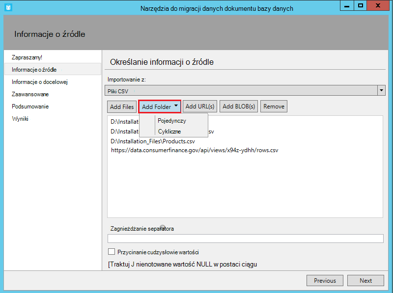
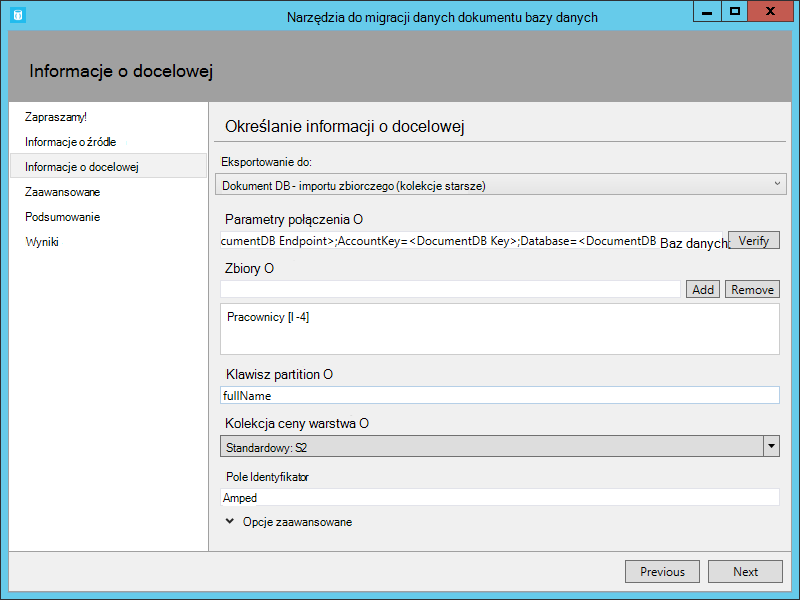

<properties
    pageTitle="Narzędzia do migracji bazy danych dla DocumentDB | Microsoft Azure"
    description="Dowiedz się, jak za pomocą narzędzia do migracji danych Otwórz źródło DocumentDB do DocumentDB importować dane z różnych źródeł, w tym pliki MongoDB, SQL Server, tabela miejsca do magazynowania, Amazon DynamoDB, CSV i JSON. CSV do konwersji JSON."
    keywords="CSV do formatu json, narzędzia do migracji bazy danych, konwertowanie csv json"
    services="documentdb"
    authors="andrewhoh"
    manager="jhubbard"
    editor="monicar"
    documentationCenter=""/>

<tags
    ms.service="documentdb"
    ms.workload="data-services"
    ms.tgt_pltfrm="na"
    ms.devlang="na"
    ms.topic="article"
    ms.date="10/06/2016"
    ms.author="anhoh"/>

# Importowanie danych do DocumentDB za pomocą narzędzia do migracji bazy danych

W tym artykule pokazano, jak za pomocą narzędzia do migracji danych oficjalnym Otwórz źródło DocumentDB do [Firmy Microsoft Azure DocumentDB](https://azure.microsoft.com/services/documentdb/) importować dane z różnych źródeł, takich jak JSON plików CSV, SQL, MongoDB, Magazyn tabel platformy Azure, Amazon DynamoDB i DocumentDB kolekcji.

Po przeczytaniem tego artykułu, będziesz mieć możliwość odpowiedzieć na następujące pytania:  

-   Jak mogę zaimportować plik JSON, plik CSV, dane programu SQL Server lub MongoDB danych do DocumentDB?
-   Jak mogę importować dane z tabeli Azure miejsca do magazynowania, Amazon DynamoDB i HBase do DocumentDB?
-   Jak przeprowadzić migrację danych między zbiorami DocumentDB?

##Wymagania wstępne

Przed zgodnie z instrukcjami zawartymi w tym artykule, upewnij się, że masz zainstalowane następujące elementy:

- [Program Microsoft .NET Framework 4.51](https://www.microsoft.com/download/developer-tools.aspx) lub nowszym.

##Omówienie narzędzia do migracji danych DocumentDB

Narzędzia do migracji danych DocumentDB to rozwiązanie Otwórz źródło, które importuje dane do DocumentDB z różnych źródeł, takich jak:

- Pliki JSON
- MongoDB
- Program SQL Server
- Pliki CSV
- Magazyn tabel platformy Azure
- Amazon DynamoDB
- HBase
- Kolekcje DocumentDB

Podczas importowania narzędziu graficznego interfejsu użytkownika (dtui.exe), mogą być określane również z poziomu wiersza polecenia (dt.exe). W rzeczywistości ma opcji wyjścia skojarzone polecenie po skonfigurowaniu importowania za pośrednictwem interfejsu użytkownika. Dane źródłowe tabeli (np. pliki programu SQL Server lub w formacie CSV) może służyć tak, aby podczas importowania można tworzyć relacje hierarchiczne (podrzędnych). Zachowaj odczytu, aby dowiedzieć się więcej na temat opcji źródła, przykładowe wiersze polecenia do importowania z każdego źródła, opcje docelowej i importowanie wyświetlania wyników.

##Instalowanie narzędzia do migracji danych DocumentDB

Kod źródłowy narzędzia do migracji w [tym repozytorium](https://github.com/azure/azure-documentdb-datamigrationtool) znajduje się na GitHub i skompilowana wersja jest dostępna w Centrum [pobierania Microsoft](http://www.microsoft.com/downloads/details.aspx?FamilyID=cda7703a-2774-4c07-adcc-ad02ddc1a44d). Może być skompilować rozwiązanie lub po prostu Pobierz i Wyodrębnij skompilowany wersję do katalogu wybranych przez użytkownika. Następnie uruchom albo:

- **Dtui.exe**: wersja graficznego interfejsu użytkownika
- **DT.exe**: wersji wiersza polecenia narzędzia

##Importowanie plików JSON

Opcji importera JSON pliku źródłowego umożliwia importowanie jedną lub więcej pojedynczy dokument JSON pliki lub JSON aby zawierał każdej tablicy dokumentów JSON. Podczas dodawania foldery, które zawierają JSON plików do zaimportowania, masz opcję lokalizacji wyszukiwania plików w podfolderach.

Oto niektóre przykłady wiersza polecenia, aby zaimportować pliki JSON:

    #Import a single JSON file
    dt.exe /s:JsonFile /s.Files:.\Sessions.json /t:DocumentDBBulk /t.ConnectionString:"AccountEndpoint=<DocumentDB Endpoint>;AccountKey=<DocumentDB Key>;Database=<DocumentDB Database>;" /t.Collection:Sessions /t.CollectionThroughput:2500

    #Import a directory of JSON files
    dt.exe /s:JsonFile /s.Files:C:\TESessions\*.json /t:DocumentDBBulk /t.ConnectionString:" AccountEndpoint=<DocumentDB Endpoint>;AccountKey=<DocumentDB Key>;Database=<DocumentDB Database>;" /t.Collection:Sessions /t.CollectionThroughput:2500

    #Import a directory (including sub-directories) of JSON files
    dt.exe /s:JsonFile /s.Files:C:\LastFMMusic\**\*.json /t:DocumentDBBulk /t.ConnectionString:" AccountEndpoint=<DocumentDB Endpoint>;AccountKey=<DocumentDB Key>;Database=<DocumentDB Database>;" /t.Collection:Music /t.CollectionThroughput:2500

    #Import a directory (single), directory (recursive), and individual JSON files
    dt.exe /s:JsonFile /s.Files:C:\Tweets\*.*;C:\LargeDocs\**\*.*;C:\TESessions\Session48172.json;C:\TESessions\Session48173.json;C:\TESessions\Session48174.json;C:\TESessions\Session48175.json;C:\TESessions\Session48177.json /t:DocumentDBBulk /t.ConnectionString:"AccountEndpoint=<DocumentDB Endpoint>;AccountKey=<DocumentDB Key>;Database=<DocumentDB Database>;" /t.Collection:subs /t.CollectionThroughput:2500

    #Import a single JSON file and partition the data across 4 collections
    dt.exe /s:JsonFile /s.Files:D:\\CompanyData\\Companies.json /t:DocumentDBBulk /t.ConnectionString:"AccountEndpoint=<DocumentDB Endpoint>;AccountKey=<DocumentDB Key>;Database=<DocumentDB Database>;" /t.Collection:comp[1-4] /t.PartitionKey:name /t.CollectionThroughput:2500

##Importowanie z MongoDB

Opcja importera źródła MongoDB umożliwia importowanie z poszczególnych kolekcji MongoDB i również filtrować dokumentów za pomocą kwerendy i/lub modyfikowanie struktury dokumentu przy użyciu rzut.  

Standardowy format MongoDB jest parametry połączenia:

    mongodb://<dbuser>:<dbpassword>@<host>:<port>/<database>

> [AZURE.NOTE] Użyj polecenia Sprawdź, aby upewnić się, że wystąpienie MongoDB określonego w polu Parametry połączenia są dostępne.

Wprowadź nazwę kolekcji, z której zostaną zaimportowane dane. Opcjonalnie możesz określić lub udostępnić plik kwerendy (np. {pop: {$gt: 5000}}) i/lub rzut (np. {loc:0}) zarówno filtrowanie i kształtowanie danych do zaimportowania.

Oto niektóre przykłady wiersza polecenia do importowania z MongoDB:

    #Import all documents from a MongoDB collection
    dt.exe /s:MongoDB /s.ConnectionString:mongodb://<dbuser>:<dbpassword>@<host>:<port>/<database> /s.Collection:zips /t:DocumentDBBulk /t.ConnectionString:"AccountEndpoint=<DocumentDB Endpoint>;AccountKey=<DocumentDB Key>;Database=<DocumentDB Database>;" /t.Collection:BulkZips /t.IdField:_id /t.CollectionThroughput:2500

    #Import documents from a MongoDB collection which match the query and exclude the loc field
    dt.exe /s:MongoDB /s.ConnectionString:mongodb://<dbuser>:<dbpassword>@<host>:<port>/<database> /s.Collection:zips /s.Query:{pop:{$gt:50000}} /s.Projection:{loc:0} /t:DocumentDBBulk /t.ConnectionString:"AccountEndpoint=<DocumentDB Endpoint>;AccountKey=<DocumentDB Key>;Database=<DocumentDB Database>;" /t.Collection:BulkZipsTransform /t.IdField:_id/t.CollectionThroughput:2500

##Importowanie plików eksportu MongoDB

Opcji importera źródła pliku MongoDB eksportu JSON umożliwia importowanie z narzędzia mongoexport jeden lub więcej plików JSON.  

Podczas dodawania foldery, które zawierają MongoDB Eksportuj JSON plików do zaimportowania, masz opcję lokalizacji wyszukiwania plików w podfolderach.

Oto przykładowa wiersza polecenia do importowania z MongoDB eksportu JSON plików:

    dt.exe /s:MongoDBExport /s.Files:D:\mongoemployees.json /t:DocumentDBBulk /t.ConnectionString:"AccountEndpoint=<DocumentDB Endpoint>;AccountKey=<DocumentDB Key>;Database=<DocumentDB Database>;" /t.Collection:employees /t.IdField:_id /t.Dates:Epoch /t.CollectionThroughput:2500

##Importowanie z programu SQL Server

Opcja importera źródła SQL umożliwia importowanie z poszczególnych bazy danych programu SQL Server i opcjonalnie filtrowanie rekordów w celu zaimportowania przy użyciu kwerendy. Ponadto można zmodyfikować w strukturze dokumentu, określając separator zagnieżdżania (więcej informacji na temat której za chwilę).  

Format ciągu połączenia jest standardowy format ciągu połączenia SQL.

> [AZURE.NOTE] Użyj polecenia Sprawdź, aby upewnić się, że wystąpienie programu SQL Server w polu Parametry połączenia są dostępne.

Zagnieżdżanie właściwość separator jest używana w celu utworzenia relacji hierarchii (dokumenty podrzędne) podczas importowania. Rozważmy następujące zapytanie SQL:

*Wybierz pozycję CAST (jako BusinessEntityID varchar) jako identyfikator, nazwę, typ adresu jako [Address.AddressType], AddressLine1 jako [Address.AddressLine1], Miasto jako [Address.Location.City], Nazwastanuprowincji jako [Address.Location.StateProvinceName], kod_pocztowy jako [Address.PostalCode], CountryRegionName jako [Address.CountryRegionName] z Sales.vStoreWithAddresses miejsce, w którym typ adresu = "Główny urząd"*

Która zwraca następujące wyniki (częściowa):

Uwaga aliasy, takich jak Address.AddressType i Address.Location.StateProvinceName. Określając zagnieżdżania separator z ".", narzędzie importowania tworzy podrzędnych adres i Address.Location podczas importowania. Oto przykład wyniku dokumentu w DocumentDB:

*{"identyfikator": "956", "Nazwa": "Precyzyjniej zarządzać i usługi sprzedaży", "Adres": {"typ adresu": "Office główne", "AddressLine1": "#500 75 O'Connor ulica", "Położenie": {"Miasto": "Ottawie", "Nazwastanuprowincji": "Ontario"}, "Kod_pocztowy": "K4B 1S2", "CountryRegionName": "Kanada"}}*

Oto niektóre przykłady wiersza polecenia do importowania z programu SQL Server:

    #Import records from SQL which match a query
    dt.exe /s:SQL /s.ConnectionString:"Data Source=<server>;Initial Catalog=AdventureWorks;User Id=advworks;Password=<password>;" /s.Query:"select CAST(BusinessEntityID AS varchar) as Id, * from Sales.vStoreWithAddresses WHERE AddressType='Main Office'" /t:DocumentDBBulk /t.ConnectionString:" AccountEndpoint=<DocumentDB Endpoint>;AccountKey=<DocumentDB Key>;Database=<DocumentDB Database>;" /t.Collection:Stores /t.IdField:Id /t.CollectionThroughput:2500

    #Import records from sql which match a query and create hierarchical relationships
    dt.exe /s:SQL /s.ConnectionString:"Data Source=<server>;Initial Catalog=AdventureWorks;User Id=advworks;Password=<password>;" /s.Query:"select CAST(BusinessEntityID AS varchar) as Id, Name, AddressType as [Address.AddressType], AddressLine1 as [Address.AddressLine1], City as [Address.Location.City], StateProvinceName as [Address.Location.StateProvinceName], PostalCode as [Address.PostalCode], CountryRegionName as [Address.CountryRegionName] from Sales.vStoreWithAddresses WHERE AddressType='Main Office'" /s.NestingSeparator:. /t:DocumentDBBulk /t.ConnectionString:" AccountEndpoint=<DocumentDB Endpoint>;AccountKey=<DocumentDB Key>;Database=<DocumentDB Database>;" /t.Collection:StoresSub /t.IdField:Id /t.CollectionThroughput:2500

##Importowanie plików CSV - konwertowanie CSV do formatu JSON

Opcja importera źródła pliku CSV umożliwia importowanie jeden lub więcej plików CSV. Podczas dodawania foldery, które zawierają plików CSV do zaimportowania, masz opcję lokalizacji wyszukiwania plików w podfolderach.

Podobnie jak w źródle SQL, zagnieżdżania właściwość separator można utworzyć relacje hierarchiczne (dokumenty podrzędne) podczas importowania. Należy rozważyć następujące nagłówka CSV wierszy danych i wierszy:

Uwaga aliasy, takich jak DomainInfo.Domain_Name i RedirectInfo.Redirecting. Określając zagnieżdżania separator z ".", narzędzie importowania utworzy podrzędnych DomainInfo i RedirectInfo podczas importowania. Oto przykład wyniku dokumentu w DocumentDB:

*{"DomainInfo": {"Nazwa_domeny": "ACUS.GOV", "Domain_Name_Address": "http://www.ACUS.GOV"}, "Agencji Federal": "administracyjne konferencji ze Stanów Zjednoczonych", "RedirectInfo": {"Przekierowywanie": "0", "Redirect_Destination": ""}, "identyfikator": "9cc565c5-ebcd-1c03-ebd3-cc3e2ecd814d"}*

Narzędzie do importowania spróbuje ustalić informacje o typie nie ujęty w cudzysłów wartości w plikach CSV (wartości cudzysłowie zawsze są traktowane jako ciągi).  Typy są oznaczone w następującej kolejności: liczba, Data/Godzina, wartość logiczna.  

Istnieją dwie możliwości uwagi na temat importowania CSV:

1.  Domyślnie nie ujęty w cudzysłów wartości są zawsze dostosowane pod kątem znaki tabulacji i spacje, gdy wartości w cudzysłowach są zachowywane jako-jest. Ten problem może zostać zastąpiona przycięcia cytowane wartości pola wyboru lub /s.TrimQuoted wiersza polecenia.

2.  Domyślnie nie ujęty w cudzysłów null jest traktowana jako wartość null. Ten problem może zostać zastąpiona (to znaczy Potraktuj nie ujęty w cudzysłów null jako ciąg "pusty") z Traktuj nienotowane NULL jako ciąg wyboru lub opcja wiersza polecenia /s.NoUnquotedNulls.

Oto przykładowa wiersza polecenia dla CSV import:

    dt.exe /s:CsvFile /s.Files:.\Employees.csv /t:DocumentDBBulk /t.ConnectionString:"AccountEndpoint=<DocumentDB Endpoint>;AccountKey=<DocumentDB Key>;Database=<DocumentDB Database>;" /t.Collection:Employees /t.IdField:EntityID /t.CollectionThroughput:2500

##Importowanie z magazynem tabel platformy Azure

Opcja importera źródła magazynowania tabeli Azure umożliwia importowanie z poszczególnych Azure miejsca do magazynowania tabela i również filtrować podmioty tabeli do zaimportowania.  

Format tabeli Azure parametry połączenia miejsca do magazynowania jest:

    DefaultEndpointsProtocol=<protocol>;AccountName=<Account Name>;AccountKey=<Account Key>;

> [AZURE.NOTE] Użyj polecenia Sprawdź, aby upewnić się, że wystąpienia miejsca do magazynowania Azure tabeli określonej w polu Parametry połączenia są dostępne.

Wprowadź nazwę tabeli Azure, z której zostaną zaimportowane dane. Opcjonalnie można określić [Filtr](https://msdn.microsoft.com/library/azure/ff683669.aspx).

Opcja importera źródła magazynowania tabeli Azure dostępne są następujące opcje dodatkowe:

1. Dołącz do wewnętrznego pola
    2. Wszystkie — uwzględniać wszystkich pól wewnętrznych (PartitionKey, RowKey i sygnatury czasowej)
    3. Brak — wykluczyć wszystkie pola wewnętrzne
    4. RowKey - zawierać tylko pola RowKey
3. Zaznacz kolumny
    1. Filtry miejsca do magazynowania w usłudze Azure tabel nie obsługują prognozy. Jeśli chcesz zaimportować tylko określonych właściwości obiektu Azure tabeli, dodaj je na liście Wybierz kolumny. Wszystkie inne właściwości obiektu będą ignorowane.

Oto przykładowa wiersza polecenia do importowania z magazynem tabel platformy Azure:

    dt.exe /s:AzureTable /s.ConnectionString:"DefaultEndpointsProtocol=https;AccountName=<Account Name>;AccountKey=<Account Key>" /s.Table:metrics /s.InternalFields:All /s.Filter:"PartitionKey eq 'Partition1' and RowKey gt '00001'" /s.Projection:ObjectCount;ObjectSize  /t:DocumentDBBulk /t.ConnectionString:" AccountEndpoint=<DocumentDB Endpoint>;AccountKey=<DocumentDB Key>;Database=<DocumentDB Database>;" /t.Collection:metrics /t.CollectionThroughput:2500

##Importowanie z Amazon DynamoDB

Opcja importera źródła Amazon DynamoDB umożliwia importowanie z pojedynczej tabeli Amazon DynamoDB i opcjonalnie Filtrowanie obiektów do zaimportowania. Kilka szablonów znajdują się tak, aby konfigurowania importu jest tak proste jak to możliwe.

Format parametrów połączenia Amazon DynamoDB jest:

    ServiceURL=<Service Address>;AccessKey=<Access Key>;SecretKey=<Secret Key>;

> [AZURE.NOTE] Użyj polecenia Sprawdź, aby upewnić się, że określonego w polu Parametry połączenia wystąpienia Amazon DynamoDB są dostępne.

Oto przykładowa wiersza polecenia do importowania z Amazon DynamoDB:

    dt.exe /s:DynamoDB /s.ConnectionString:ServiceURL=https://dynamodb.us-east-1.amazonaws.com;AccessKey=<accessKey>;SecretKey=<secretKey> /s.Request:"{   """TableName""": """ProductCatalog""" }" /t:DocumentDBBulk /t.ConnectionString:"AccountEndpoint=<DocumentDB Endpoint>;AccountKey=<DocumentDB Key>;Database=<DocumentDB Database>;" /t.Collection:catalogCollection /t.CollectionThroughput:2500

##Importowanie plików z magazynem obiektów Blob platformy Azure

Plik JSON, MongoDB Eksportuj plik i opcje importera źródła pliku CSV umożliwiają importowanie jeden lub więcej plików z magazynem obiektów Blob platformy Azure. Po określeniu adresu URL kontenera obiektów Blob i klucz konta, po prostu podaj wyrażenie zaznacz pliki do zaimportowania.

Oto przykładowy wiersza polecenia można zaimportować pliki JSON z magazynem obiektów Blob platformy Azure:

    dt.exe /s:JsonFile /s.Files:"blobs://<account key>@account.blob.core.windows.net:443/importcontainer/.*" /t:DocumentDBBulk /t.ConnectionString:"AccountEndpoint=<DocumentDB Endpoint>;AccountKey=<DocumentDB Key>;Database=<DocumentDB Database>;" /t.Collection:doctest

##Importowanie z DocumentDB

Opcja importera źródła DocumentDB umożliwia importowanie danych z jedną lub więcej zbiorów DocumentDB i opcjonalnie filtrowanie dokumentów przy użyciu kwerendy.  

Format parametrów połączenia DocumentDB jest:

    AccountEndpoint=<DocumentDB Endpoint>;AccountKey=<DocumentDB Key>;Database=<DocumentDB Database>;

DocumentDB, którego parametry połączenia konta można pobrać z karta klawiszy portalu Azure, zgodnie z opisem w temacie [jak zarządzać konto DocumentDB](documentdb-manage-account.md), jednak nazwę bazy danych należy zostanie dołączony do ciągu połączenia w następującym formacie:

    Database=<DocumentDB Database>;

> [AZURE.NOTE] Użyj polecenia Sprawdź, aby upewnić się, że wystąpienie DocumentDB określonego w polu Parametry połączenia są dostępne.

Aby zaimportować z pojedynczą kolekcję DocumentDB, wprowadź nazwę kolekcji, z której zostaną zaimportowane dane. Aby zaimportować z wielu zbiorów DocumentDB, podaj wyrażenie zgodnie z jednej lub kilku nazw zbioru (np. collection01 | collection02 | collection03). Może być Opcjonalnie określ lub udostępnić plik dla zapytania zarówno filtr i kształtu dane do zaimportowania.

> [AZURE.NOTE] Ponieważ pole zbioru zaakceptuje wyrażeń regularnych, Jeśli importujesz z jednego zbioru, którego nazwa zawiera znaki wyrażeń regularnych, te znaki musi wyjściowym odpowiednio.

Opcja importera źródło DocumentDB występują następujące opcje zaawansowane:

1. Zawierają pola wewnętrznego: Określa, czy nie zawiera właściwości systemu dokumentu DocumentDB eksportu (_rid, _ts).
2. Liczba prób w przypadku niepowodzenia: Określa liczbę razy, aby ponowić próbę DocumentDB połączenia w przypadku przejściowych błędy (np. przerwy łączności sieci).
3. Interwał ponawiania: Określa jak długo należy czekać między ponawianie próby połączenia z DocumentDB w przypadku przejściowych awarii (np. przerwy łączności sieci).
4. Tryb połączenia: Określa tryb połączenia do użytku z DocumentDB. Dostępne opcje są DirectTcp, DirectHttps i bramy. Tryby bezpośredniego połączenia są szybciej, przy włączonym trybie bramy więcej zapory przyjazną jako korzysta tylko na porcie 443.

> [AZURE.TIP] Narzędzie do importowania domyślnie tryb połączenia DirectTcp. Jeśli występują problemy z zapory, przejdź do trybu połączenia bramy, i wymaga tylko na porcie 443.

Oto niektóre przykłady wiersza polecenia do importowania z DocumentDB:

    #Migrate data from one DocumentDB collection to another DocumentDB collections
    dt.exe /s:DocumentDB /s.ConnectionString:"AccountEndpoint=<DocumentDB Endpoint>;AccountKey=<DocumentDB Key>;Database=<DocumentDB Database>;" /s.Collection:TEColl /t:DocumentDBBulk /t.ConnectionString:" AccountEndpoint=<DocumentDB Endpoint>;AccountKey=<DocumentDB Key>;Database=<DocumentDB Database>;" /t.Collection:TESessions /t.CollectionThroughput:2500

    #Migrate data from multiple DocumentDB collections to a single DocumentDB collection
    dt.exe /s:DocumentDB /s.ConnectionString:"AccountEndpoint=<DocumentDB Endpoint>;AccountKey=<DocumentDB Key>;Database=<DocumentDB Database>;" /s.Collection:comp1|comp2|comp3|comp4 /t:DocumentDBBulk /t.ConnectionString:"AccountEndpoint=<DocumentDB Endpoint>;AccountKey=<DocumentDB Key>;Database=<DocumentDB Database>;" /t.Collection:singleCollection /t.CollectionThroughput:2500

    #Export a DocumentDB collection to a JSON file
    dt.exe /s:DocumentDB /s.ConnectionString:"AccountEndpoint=<DocumentDB Endpoint>;AccountKey=<DocumentDB Key>;Database=<DocumentDB Database>;" /s.Collection:StoresSub /t:JsonFile /t.File:StoresExport.json /t.Overwrite /t.CollectionThroughput:2500

##Importowanie z HBase

Opcja importera źródła HBase umożliwia importowanie danych z tabeli HBase i również filtrować dane. Kilka szablonów znajdują się tak, aby konfigurowania importu jest tak proste jak to możliwe.

Format parametrów połączenia HBase Stargate jest:

    ServiceURL=<server-address>;Username=<username>;Password=<password>

> [AZURE.NOTE] Użyj polecenia Sprawdź, aby upewnić się, że wystąpienie HBase określonego w polu Parametry połączenia są dostępne.

Oto przykładowa wiersza polecenia do importowania z HBase:

    dt.exe /s:HBase /s.ConnectionString:ServiceURL=<server-address>;Username=<username>;Password=<password> /s.Table:Contacts /t:DocumentDBBulk /t.ConnectionString:"AccountEndpoint=<DocumentDB Endpoint>;AccountKey=<DocumentDB Key>;Database=<DocumentDB Database>;" /t.Collection:hbaseimport

##Importowanie do DocumentDB (importu zbiorczego)

Importer zbiorcze DocumentDB umożliwia importowanie z jednej z opcji dostępnych źródeł, za pomocą procedury DocumentDB przechowywane w celu zwiększenia wydajności. Narzędzie to obsługuje importowania jedną partycją jednego zbioru DocumentDB, a także importowanie sharded, zgodnie z którą danych jest podzielona przez wielu zbiorów DocumentDB partycją pojedyncze. Aby uzyskać więcej informacji na temat podziału danych zobacz [partycjonowanie i skalowanie w Azure DocumentDB](documentdb-partition-data.md). Narzędzie będzie utworzyć, wykonywanie, a następnie usuń procedura składowana z zbiory docelowej.  

Format parametrów połączenia DocumentDB jest:

    AccountEndpoint=<DocumentDB Endpoint>;AccountKey=<DocumentDB Key>;Database=<DocumentDB Database>;

DocumentDB, którego parametry połączenia konta można pobrać z karta klawiszy portalu Azure, zgodnie z opisem w temacie [jak zarządzać konto DocumentDB](documentdb-manage-account.md), jednak nazwę bazy danych należy zostanie dołączony do ciągu połączenia w następującym formacie:

    Database=<DocumentDB Database>;

> [AZURE.NOTE] Użyj polecenia Sprawdź, aby upewnić się, że wystąpienie DocumentDB określonego w polu Parametry połączenia są dostępne.

Aby zaimportować do jednego zbioru, wprowadź nazwę kolekcji, do którego zostaną zaimportowane dane i kliknij przycisk Dodaj. Aby zaimportować do wielu zbiorów, wprowadź nazwę każdego zbioru pojedynczo lub użyć następującej składni, aby określić wielu zbiorów: *collection_prefix*[start indeks - Indeks końcowy]. Określając wielu zbiorów za pośrednictwem wyżej składnią pamiętać o następujących czynności:

1. Obsługiwane są tylko liczby całkowitej desenie nazwę zakresu. Na przykład, określając zbioru [0-3] spowodują następujące kolekcje: collection0, collection1, collection2, collection3.
2. Możesz użyć skróconej składni: [3] zbioru będzie emitować ten sam zestaw zbiorów wymienionych w kroku 1.
3. Może być udostępniana więcej niż jednego z elementów zastępczych. Na przykład kolekcji [0-1] [0-9] wygeneruje 20 nazwy kolekcji z zerami wiodącymi (collection01,... 02... 03).

Po zostały określone nazwy kolekcji, wybierz żądaną przepustowość zbiory (400 RUs do 10 000 RUs). Aby uzyskać optymalną wydajność importu wybierz wyższej przepustowości. Aby uzyskać więcej informacji na temat poziomów wydajności Zobacz [poziomy wydajności w DocumentDB](documentdb-performance-levels.md).

> [AZURE.NOTE] Ustawienie przepustowości wydajności dotyczy tylko Tworzenie zbioru. Jeśli istnieje już określonej kolekcji, nie można zmodyfikować jego wydajność.

Podczas importu do wielu zbiorów, mieszania obsługuje importowanie narzędzie podstawie sharding. W tym scenariuszu określ właściwość dokumentu chcesz użyć jako klucza Partition (Jeśli klucz partycją jest puste, dokumenty będą sharded losowo między zbiorami docelowej).

Opcjonalnie można określić pole, które w źródle importu powinien być używany jako właściwość identyfikator dokumentu DocumentDB podczas importowania (należy zauważyć, że jeśli dokumentów nie zawierają tę właściwość, następnie narzędzie importowania wygeneruje GUID jako wartości właściwości identyfikatora).

Podczas importowania dostępne są dostępne opcje zaawansowane. Najpierw podczas to narzędzie zawiera importu zbiorczego domyślne procedura składowana (BulkInsert.js), można określić własne procedury importu przechowywane:

 

Ponadto importując typy dat (np. z programu SQL Server lub MongoDB), można wybrać trzy opcje importowania:

 

-   Ciąg: Zachowywane jako wartość ciągu
-   Epoka: Zachowywane jako wartość liczbową epoka.
-   Oba: Zachowywane zarówno Epoch wartości liczbowe, jak i parametry. Ta opcja utworzy dokument podrzędny, na przykład: "date_joined": {"Wartość": "2013-10-21T21:17:25.2410000Z", "Epoch": 1382390245}

Importer DocumentDB zbiorczej ma następujące dodatkowe opcje zaawansowane:

1. Rozmiar partii: Narzędzie domyślnie wielkości 50.  W przypadku dużych dokumentów, które mają zostać zaimportowane, warto rozważyć zmniejszyć rozmiar partii. I odwrotnie jeśli dokumentów, które mają być importowane są małe, warto rozważyć zwiększenie rozmiaru partii.
2. Maksymalny rozmiar skryptu (bajtów): narzędzie domyślne skrypt maksymalny rozmiar 512 KB
3. Wyłącz automatyczne generowanie identyfikator: Jeśli każdy dokument do zaimportowania zawiera pole Identyfikator, następnie wybranie tej opcji może zwiększyć wydajność. Brak pola Unikatowy identyfikator dokumentów nie zostaną zaimportowane.
4. Aktualizuj istniejące dokumenty: Narzędzie domyślnie nie zastępowanie istniejących dokumentów konflikt identyfikatorów. Zaznaczenie tej opcji umożliwi zastępowania istniejących dokumentów z dopasowanymi identyfikatorów. Ta funkcja jest przydatna w przypadku migracji danych według harmonogramu, które zaktualizować istniejące dokumenty.
5. Liczba prób w przypadku niepowodzenia: Określa liczbę razy, aby ponowić próbę DocumentDB połączenia w przypadku przejściowych błędy (np. przerwy łączności sieci).
6. Interwał ponawiania: Określa jak długo należy czekać między ponawianie próby połączenia z DocumentDB w przypadku przejściowych błędy (np. przerwy łączności sieci).
7. Tryb połączenia: Określa tryb połączenia do użytku z DocumentDB. Dostępne opcje są DirectTcp, DirectHttps i bramy. Tryby bezpośredniego połączenia są szybciej, przy włączonym trybie bramy więcej zapory przyjazną jako korzysta tylko na porcie 443.

> [AZURE.TIP] Narzędzie do importowania domyślnie tryb połączenia DirectTcp. Jeśli występują problemy z zapory, przejdź do trybu połączenia bramy, i wymaga tylko na porcie 443.

##Importowanie do DocumentDB (importowanie kolejny rekord)

Importer kolejny rekord DocumentDB umożliwia importowanie z jednej z opcji dostępnych źródeł na podstawie rekordu na podstawie. Może być wybierz tę opcję, jeśli chcesz zaimportować do istniejącego zbioru osiągnięciu przydziału procedur składowanych. Narzędzie to obsługuje importowanie pojedynczej (jedną partycją i wielu partition) zbioru DocumentDB, a także jak sharded importowanie zgodnie z którą danych jest podzielona przez wielu zbiorów DocumentDB jedną partycją i/lub wielu partycją. Aby uzyskać więcej informacji na temat podziału danych zobacz [partycjonowanie i skalowanie w Azure DocumentDB](documentdb-partition-data.md).

Format parametrów połączenia DocumentDB jest:

    AccountEndpoint=<DocumentDB Endpoint>;AccountKey=<DocumentDB Key>;Database=<DocumentDB Database>;

DocumentDB, którego parametry połączenia konta można pobrać z karta klawiszy portalu Azure, zgodnie z opisem w temacie [jak zarządzać konto DocumentDB](documentdb-manage-account.md), jednak nazwę bazy danych należy zostanie dołączony do ciągu połączenia w następującym formacie:

    Database=<DocumentDB Database>;

> [AZURE.NOTE] Użyj polecenia Sprawdź, aby upewnić się, że wystąpienie DocumentDB określonego w polu Parametry połączenia są dostępne.

Aby zaimportować do jednego zbioru, wprowadź nazwę kolekcji, do którego zostaną zaimportowane dane i kliknij przycisk Dodaj. Aby zaimportować do wielu zbiorów, wprowadź nazwę każdego zbioru pojedynczo lub użyć następującej składni, aby określić wielu zbiorów: *collection_prefix*[start indeks - Indeks końcowy]. Określając wielu zbiorów za pośrednictwem wyżej składnią pamiętać o następujących czynności:

1. Obsługiwane są tylko liczby całkowitej desenie nazwę zakresu. Na przykład, określając zbioru [0-3] spowodują następujące kolekcje: collection0, collection1, collection2, collection3.
2. Możesz użyć skróconej składni: [3] zbioru będzie emitować ten sam zestaw zbiorów wymienionych w kroku 1.
3. Może być udostępniana więcej niż jednego z elementów zastępczych. Na przykład kolekcji [0-1] [0-9] wygeneruje 20 nazwy kolekcji z zerami wiodącymi (collection01,... 02... 03).

Po zostały określone nazwy kolekcji, wybierz żądaną przepustowość zbiory (400 RUs do 250 000 RUs). Aby uzyskać optymalną wydajność importu wybierz wyższej przepustowości. Aby uzyskać więcej informacji na temat poziomów wydajności Zobacz [poziomy wydajności w DocumentDB](documentdb-performance-levels.md). Wszelkie importowania zbiorów z przepustowości > 10 000 RUs wymaga klucza partycją. Jeśli wybierzesz więcej niż 250 000 RUs, zobacz [zwiększenia limity konta DocumentDB](documentdb-increase-limits.md).

> [AZURE.NOTE] Ustawienie przepustowości dotyczy tylko Tworzenie zbioru. Jeśli istnieje już określonej kolekcji, nie można zmodyfikować jego wydajność.

Podczas importu do wielu zbiorów, mieszania obsługuje importowanie narzędzie podstawie sharding. W tym scenariuszu określ właściwość dokumentu chcesz użyć jako klucza Partition (Jeśli klucz partycją jest puste, dokumenty będą sharded losowo między zbiorami docelowej).

Opcjonalnie można określić pole, które w źródle importu powinien być używany jako właściwość identyfikator dokumentu DocumentDB podczas importowania (należy zauważyć, że jeśli dokumentów nie zawierają tę właściwość, następnie narzędzie importowania wygeneruje GUID jako wartości właściwości identyfikatora).

Podczas importowania dostępne są dostępne opcje zaawansowane. Najpierw importując typy dat (np. z programu SQL Server lub MongoDB), można wybrać trzy opcje importowania:

 

-   Ciąg: Zachowywane jako wartość ciągu
-   Epoka: Zachowywane jako wartość liczbową epoka.
-   Oba: Zachowywane zarówno Epoch wartości liczbowe, jak i parametry. Ta opcja utworzy dokument podrzędny, na przykład: "date_joined": {"Wartość": "2013-10-21T21:17:25.2410000Z", "Epoch": 1382390245}

DocumentDB - importer kolejny rekord ma następujące dodatkowe opcje zaawansowane:

1. Liczba żądań równoległych: narzędzie domyślne zleceń równoległe 2. Jeśli dokumentów, które mają być importowane są małe, warto rozważyć zwiększenie liczba żądań równoległych. Należy zauważyć, że jeśli ten potęgi zbyt dużo, importowanie mogą występować ograniczania.
2. Wyłącz automatyczne generowanie identyfikator: Jeśli każdy dokument do zaimportowania zawiera pole Identyfikator, następnie wybranie tej opcji może zwiększyć wydajność. Brak pola Unikatowy identyfikator dokumentów nie zostaną zaimportowane.
3. Aktualizuj istniejące dokumenty: Narzędzie domyślnie nie zastępowanie istniejących dokumentów konflikt identyfikatorów. Zaznaczenie tej opcji umożliwi zastępowania istniejących dokumentów z dopasowanymi identyfikatorów. Ta funkcja jest przydatna w przypadku migracji danych według harmonogramu, które zaktualizować istniejące dokumenty.
4. Liczba prób w przypadku niepowodzenia: Określa liczbę razy, aby ponowić próbę DocumentDB połączenia w przypadku przejściowych błędy (np. przerwy łączności sieci).
5. Interwał ponawiania: Określa jak długo należy czekać między ponawianie próby połączenia z DocumentDB w przypadku przejściowych awarii (np. przerwy łączności sieci).
6. Tryb połączenia: Określa tryb połączenia do użytku z DocumentDB. Dostępne opcje są DirectTcp, DirectHttps i bramy. Tryby bezpośredniego połączenia są szybciej, przy włączonym trybie bramy więcej zapory przyjazny jako korzysta tylko na porcie 443.

> [AZURE.TIP] Narzędzie do importowania domyślnie tryb połączenia DirectTcp. Jeśli występują problemy z zapory, przejdź do trybu połączenia bramy, i wymaga tylko na porcie 443.

##Określanie zasad indeksowania podczas tworzenia zbiorów DocumentDB

Gdy umożliwia tworzenie zbiorów podczas importowania narzędzia do migracji można określić indeksowania zasady kolekcji. W obszarze Zaawansowane opcje importowanie sekcji zbiorcze DocumentDB i DocumentDB sekwencyjne opcje nagrywania, przejdź do sekcji zasady indeksowania.

Za pomocą opcji zaawansowanej zasady indeksowania, wybierz plik indeksowania zasady, ręcznie wprowadź indeksowania zasady lub z zestaw szablonów domyślny wybierz (klikając prawym przyciskiem myszy w polu tekstowym indeksowania zasady).

Szablony zasad, który udostępnia narzędzia są:

- Domyślny. Tych zasad jest zalecane, gdy jesteś wykonywania kwerend równości dla ciągów i przy użyciu ORDER BY, zakres i równości kwerendy dla liczb. Ta zasada ma mniejszym obciążeniu miejsca do magazynowania indeksu niż zakres.
- Zakres. Zasada ta jest zalecane, że używasz ORDER BY, zakres i równości kwerend na ciągi i cyfry. Zasady te mają wyższą ogólnych miejsca do magazynowania indeksu niż domyślny lub skrótu.

> [AZURE.NOTE] Jeśli nie określisz indeksowania zasady, domyślnych zasad zostaną zastosowane. Aby uzyskać więcej informacji na temat indeksowania zasad zobacz [zasady indeksowania DocumentDB](documentdb-indexing-policies.md).

## Eksportowanie do pliku JSON

Eksporter DocumentDB JSON umożliwia eksportowanie jednej z opcji dostępnych źródeł do pliku JSON, zawierający tablicę dokumentów JSON. Narzędzie obsługi eksportu dla Ciebie, lub możesz wybrać do wyświetlania wyniku polecenia migracji i uruchom polecenie samodzielnie. Utworzony plik JSON mogą być przechowywane lokalnie lub w magazynie obiektów Blob platformy Azure.

Opcjonalnie można wybrać opcję prettify wyniku JSON, które zwiększa rozmiar utworzonego dokumentu podczas tworzenia zawartości więcej do odczytu.

    Standard JSON export
    [{"id":"Sample","Title":"About Paris","Language":{"Name":"English"},"Author":{"Name":"Don","Location":{"City":"Paris","Country":"France"}},"Content":"Don's document in DocumentDB is a valid JSON document as defined by the JSON spec.","PageViews":10000,"Topics":[{"Title":"History of Paris"},{"Title":"Places to see in Paris"}]}]

    Prettified JSON export
    [
    {
    "id": "Sample",
    "Title": "About Paris",
    "Language": {
      "Name": "English"
    },
    "Author": {
      "Name": "Don",
      "Location": {
        "City": "Paris",
        "Country": "France"
      }
    },
    "Content": "Don's document in DocumentDB is a valid JSON document as defined by the JSON spec.",
    "PageViews": 10000,
    "Topics": [
      {
        "Title": "History of Paris"
      },
      {
        "Title": "Places to see in Paris"
      }
    ]
    }]

## Konfiguracja zaawansowana

Na ekranie konfiguracji zaawansowanej Określ lokalizację pliku dziennika, do którego chcesz błędy zapisywane. Na tej stronie stosowane następujące reguły:

1.  Jeśli nazwa pliku nie jest określona, wszystkie błędy zostaną zwrócone na stronie wyników.
2.  Jeśli nazwa pliku bez katalogu, zostanie następnie plik utworzony (lub są zastępowane) w bieżącym katalogu środowiska.
3.  Jeśli wybierzesz istniejący plik, a następnie plik zostanie zastąpiony, nie jest wyświetlana opcja Dołącz.

Następnie określ, czy do logowania wszystkich krytycznych, lub bez komunikatów o błędach. Na koniec określ, jak często na komunikat przesyłania ekranu zostanie zaktualizowana z postępem jego wykonania.

    

## Potwierdzanie ustawień importowania i wiersza polecenia Widok

1. Po określeniu informacje o źródle, informacje docelowej i Konfiguracja zaawansowana, Przejrzyj podsumowanie migracji i opcjonalnie Wyświetl kopię wyniku polecenia migracji (kopiowanie polecenie jest przydatne zautomatyzować operacje importowania):

    

    

2. Po zakończeniu źródłowej i docelowej opcje kliknij pozycję **Importuj**. Czas, liczba przeniesionych i informacje błąd (Jeśli nie podasz nazwy pliku w konfiguracji zaawansowanej) zostanie zaktualizowany podczas importowania jest w toku. Po zakończeniu wyniki można wyeksportować (np. na zajęcie się wszystkie błędy importu).

    

3. Możesz także rozpocząć nowy import pamiętając istniejących ustawień (wybór informacji, źródłowej i docelowej parametry połączenia, itd.) albo zresetowanie wszystkich wartości.

    

## Następne kroki

- Aby dowiedzieć się więcej na temat DocumentDB, zobacz [Ścieżka nauki](https://azure.microsoft.com/documentation/learning-paths/documentdb/).
