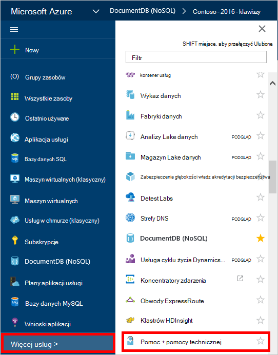
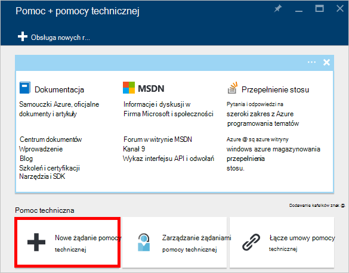
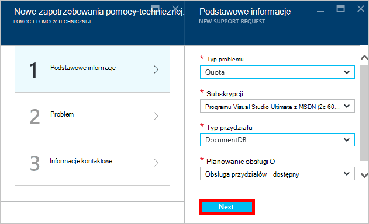
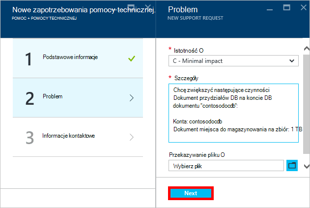
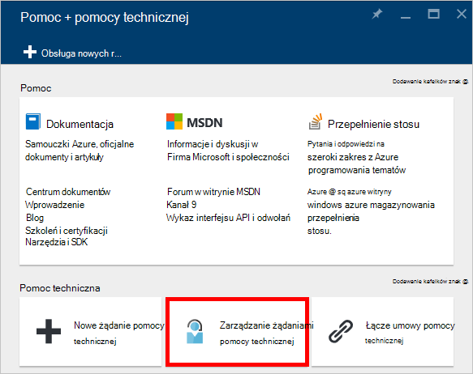

<properties
    pageTitle="Żądanie zwiększone przydziałów konta DocumentDB | Microsoft Azure"
    description="Dowiedz się, jak zażądać korektę DocumentDB przydziałów bazy danych, takich jak przechowywanie dokumentów i przepustowość na zbiór."
    services="documentdb"
    authors="AndrewHoh"
    manager="jhubbard"
    editor="monicar"
    documentationCenter=""/>

<tags
    ms.service="documentdb"
    ms.workload="data-services"
    ms.tgt_pltfrm="na"
    ms.devlang="na"
    ms.topic="article"
    ms.date="08/25/2016"
    ms.author="anhoh"/>

# Zwiększona limity konta DocumentDB żądania

[Microsoft Azure DocumentDB](https://azure.microsoft.com/services/documentdb/) ma zestaw domyślne przydziały, które można dostosować, kontaktując się z Azure pomocy technicznej.  W tym artykule pokazano, jak zażądać Zwiększ przydziału.

Po przeczytaniem tego artykułu, będziesz mieć możliwość odpowiedzieć na następujące pytania:  

-   Które DocumentDB przydziałów bazy danych można dostosować, kontaktując się z Azure pomocy technicznej?
-   Jak można zażądać dostosowania przydziału DocumentDB konta?

##DocumentDB konta przydziałów

W poniższej tabeli opisano przydziałów DocumentDB. Przydziałów, zawierających gwiazdkę (*) można dostosować, kontaktując się z Azure pomocy technicznej:

[AZURE.INCLUDE [azure-documentdb-limits](../../includes/azure-documentdb-limits.md)]

##Żądanie zmiany przydziału
Poniższe kroki pokazują jak zażądać zmiany przydziałów.

1. W [portalu Azure](https://portal.azure.com)kliknij pozycję **Więcej usług**, a następnie kliknij **Pomoc + pomocy technicznej**.

    

2. Karta **Pomoc + pomocy technicznej** kliknij **Nowy obsługuje żądania**.

    

3. Karta **Nowy obsługuje żądania** kliknij **podstawy**. Następny, ustaw **Typ problemu** do **przydziału**, **subskrypcji** do subskrypcji, obsługującego usługi DocumentDB konta **typu przydziału** do **DocumentDB**i **plan pomocy technicznej** do **Zasobów pomocy technicznej — dostępny w**. Następnie kliknij przycisk **Dalej**.

    

4. W karta **Problem** wybierz pozycję ważności i zawierają informacje o swojej Zwiększ przydział w **Szczegóły**. Kliknij przycisk **Dalej**.

    

5. Na koniec Podaj swoje informacje kontaktowe w karta **informacje kontaktowe** i kliknij pozycję **Utwórz**.

Po utworzeniu bilet pomocy technicznej powinien zostać wyświetlony numer żądanie pomocy technicznej za pośrednictwem poczty e-mail.  Żądanie pomocy technicznej można także wyświetlić, klikając pozycję **żądania obsługi Zarządzanie** karta **pomocy + pomocy technicznej** .

##Następne kroki
- Aby dowiedzieć się więcej na temat DocumentDB, kliknij [tutaj](http://azure.com/docdb).
