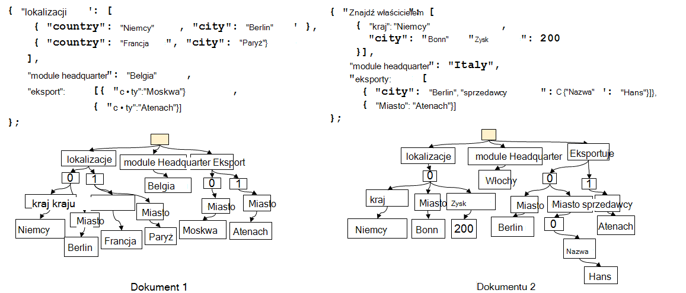
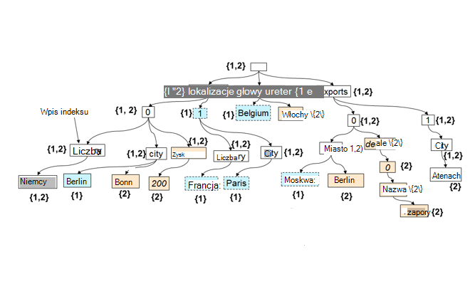

<properties 
    pageTitle="Automatyczne indeksowanie w DocumentDB | Microsoft Azure" 
    description="Informacje na temat sposobu automatycznego indeksowania sprawdza się w Azure DocumentDB." 
    services="documentdb" 
    authors="arramac" 
    manager="jhubbard" 
    editor="mimig" 
    documentationCenter=""/>

<tags 
    ms.service="documentdb" 
    ms.workload="data-services" 
    ms.tgt_pltfrm="na" 
    ms.devlang="na" 
    ms.topic="article" 
    ms.date="10/27/2016" 
    ms.author="arramac"/>
    
# Automatyczne indeksowania w Azure DocumentDB

Ten artykuł jest fragmentem książki papieru ["niezależne od schematu indeksowania z Azure DocumentDB"](http://www.vldb.org/pvldb/vol8/p1668-shukla.pdf) , która zostanie wyświetlona na [41st wewnętrznych konferencji bardzo dużych baz danych](http://www.vldb.org/2015/) między 31 sierpnia - 4 września 2015 r., i jest wprowadzenie do jak indeksowanie works w Azure DocumentDB. 

Po zapoznaniu się to, będzie odpowiedzieć na następujące pytania:

- Jak DocumentDB ustalić schemat z dokumentu JSON?
- Jak DocumentDB Tworzenie indeksu w różnych dokumentów?
- Jak DocumentDB wykonywać automatyczne indeksowanie w skali?

##Jak działa DocumentDB indeksowania

[Microsoft Azure DocumentDB](https://azure.microsoft.com/services/documentdb/) jest w celu PRAWDA wolny schemat bazy danych utworzoną dla JSON. Nie oczekiwać lub wymagają schematu ani definicje indeksów pomocniczych zindeksować danych w skali. Pozwala na szybkie definiowanie i przejść na modelach danych aplikacji przy użyciu DocumentDB. Po dodaniu dokumentów do kolekcji DocumentDB automatycznie zindeksowane wszystkie właściwości dokumentu tak, aby były dostępne do kwerendy. Automatyczne indeksowanie pozwala na przechowywanie dokumentów należących do całkowicie dowolnego schematy, nie martwiąc się schematy lub indeksów pomocniczych.

Mając na celu aby wyeliminować impedancji niezgodność bazy danych i modele programowania aplikacji DocumentDB wykorzystuje prostotę JSON, a brak specyfikacji schematu. Przekształca żadnych założeń o dokumentach i umożliwia dokumenty w obrębie zbioru DocumentDB się różnić w schemacie, oprócz wartości określonych wystąpienia. W odróżnieniu od innych dokumentów bazy danych aparat bazy danych w DocumentDB działa bezpośrednio na poziomie JSON gramatyka pozostała o niesprecyzowanym pojęcia schemat dokumentu i Rozmycie granicy między wartościami struktury i wystąpienie dokumentów. To, w przewracania, umożliwia go, aby automatycznie indeks dokumenty bez konieczności schematu lub indeksów pomocniczych.

Indeksowanie w DocumentDB korzysta z faktu, że gramatyki JSON umożliwia dokumentów **przedstawione w postaci drzewa**. Dokument JSON przedstawione w postaci drzewa węzła głównego fikcyjna musi można utworzyć, które parents pozostałą część rzeczywista węzły w dokumencie poniżej. Każda etykieta tym indeksy tablicy w dokumencie JSON staje się węzeł drzewa. Na poniższym rysunku przedstawiono przykładowy dokument JSON i jego odpowiednich reprezentacja drzewa.

>[AZURE.NOTE] Ponieważ JSON jest już opisane to znaczy każdy dokument zawiera zarówno schematu (metadane), jak i dane, np. `{"locationId": 5, "city": "Moscow"}` wykryje, że są dwie właściwości `locationId` i `city`, i mają wartości liczbowych i parametry. DocumentDB będzie mógł ustalić schemat dokumenty i indeksowania podczas wstawienia lub zastąpione, bez wychodzenia z definiowanie schematów lub indeksów pomocniczych.

**JSON dokumentów w postaci drzewa:**

Na przykład w powyższym przykładzie:

- Właściwość JSON `{"headquarters": "Belgium"}` właściwość w powyższym przykładzie odpowiada ścieżkę i headquarters Belgia.
- Tablica JSON `{"exports": [{"city": “Moscow"}`, `{"city": Athens"}]}` odpowiada ścieżki `/exports/[]/city/Moscow` i `/exports/[]/city/Athens`.

Z automatyczną indeksowania (1) każdej ścieżki w drzewie dokumentu jest indeksowane (chyba że deweloper jawnie skonfigurował indeksowania zasady wykluczyć niektórych desenie ścieżkę). (2) każdej aktualizacji dokumentu do kolekcji DocumentDB prowadzi do aktualizacji struktury indeks (to znaczy powoduje dodanie lub usunięcie węzłów). Jedną z podstawowe wymagania dotyczące automatyczne indeksowanie dokumentów ma upewnij się, że koszt indeksu i kwerendy dokumentu ze strukturą mocno zagnieżdżonych, na przykład 10 poziomów, jest taki sam jak prostym dokumentu JSON składający się z pary klucz wartość tylko głębokości jeden poziom. W związku z tym reprezentacja znormalizowaną ścieżka jest podstawą, na której są przeznaczone zarówno automatyczne podsystemów indeksowania i kwerendy.

Ważne implikacją traktowanie obie wartości schematu i wystąpienie równomiernie w odniesieniu do ścieżki jest logicznie, jak poszczególne dokumenty, indeks dwóch dokumentów pokazane, który zachowuje mapy między ścieżek i identyfikatorów dokumentów zawierających ta ścieżka może być również reprezentowana jako drzewa. DocumentDB używa ten fakt do utworzenia drzewo indeks, w którym jest tworzona z Unii wszystkich drzew reprezentującą poszczególnych dokumentów w zbiorze. Drzewa indeksu w zbiorach DocumentDB zwiększa rozmiar czasie nowe dokumenty dodane uzyskiwanie aktualizacji do kolekcji.

**Indeks DocumentDB jako drzewo:**

Mimo wolny schematu, SQL i JavaScript w DocumentDB kwerendy języków udostępnianie relacyjnych planów i filtry, hierarchii nawigacji w dokumentów, przestrzenna operacje i wywoływanie funkcji zdefiniowanych przez użytkownika, całkowicie napisana JavaScript. Środowisko uruchomieniowe kwerendy DocumentDB będzie mógł obsługuje te zapytania, ponieważ może działać bezpośrednio przed tym indeks drzewa reprezentację danych.

Domyślną zasadę indeksowania automatycznie indeksy wszystkie właściwości wszystkie dokumenty i zapewnia spójne zapytań (oznacza to synchronicznie aktualizacji indeksu zapisu dokumentu). W jaki sposób DocumentDB obsługuje spójne aktualizacje drzewa indeksu w większej skali DocumentDB używa zapisu zoptymalizowane, lock bezpłatne i dziennika strukturę techniki konserwacji indeksu. Oznacza to, że DocumentDB może obsługiwać stałej liczby szybkie zapisywanie podczas nadal serwowania spójne kwerendy. 

Indeksowanie w DocumentDB zaprojektowano w celu zwiększenia wydajności miejsca do magazynowania i obsługi wielu dzierżawy. Skuteczność kosztów ogólnych na ilość miejsca do magazynowania indeksu jest niska i przewidywalne. Aktualizacje indeks również są wykonywane w ramach budżetu przydzielonego na zbiór DocumentDB zasoby systemowe.

##Następne kroki
- Pobierz ["niezależne od schematu indeksowania z Azure DocumentDB"](http://www.vldb.org/pvldb/vol8/p1668-shukla.pdf)mają zostać przedstawione na 41st konferencji wewnętrznych bardzo duże, 31 sierpnia - 4 września 2015 r.
- [Kwerenda z DocumentDB SQL](documentdb-sql-query.md)
- Dowiedz się, jak dostosować indeks DocumentDB [tutaj](documentdb-indexing-policies.md)
 
