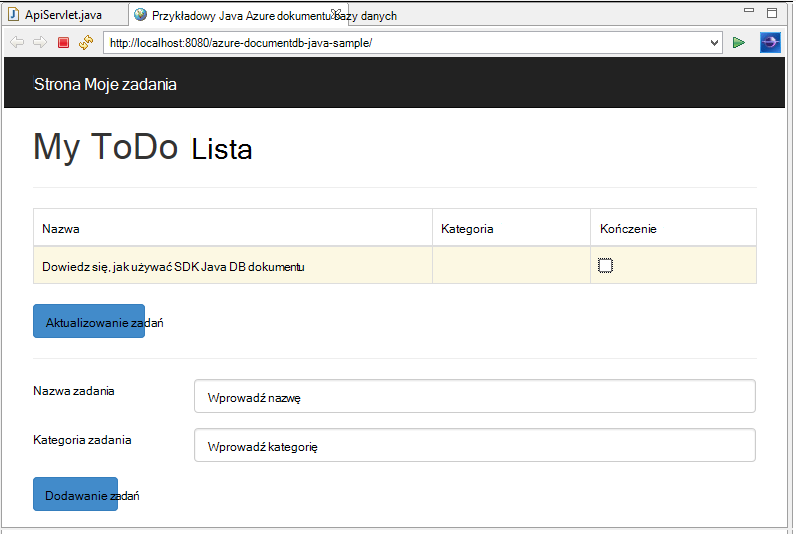
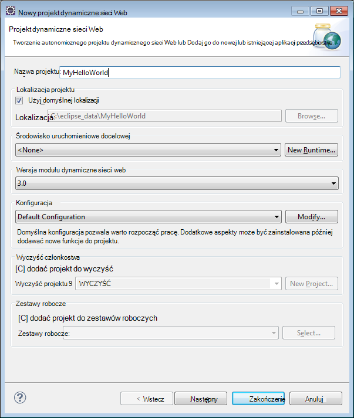
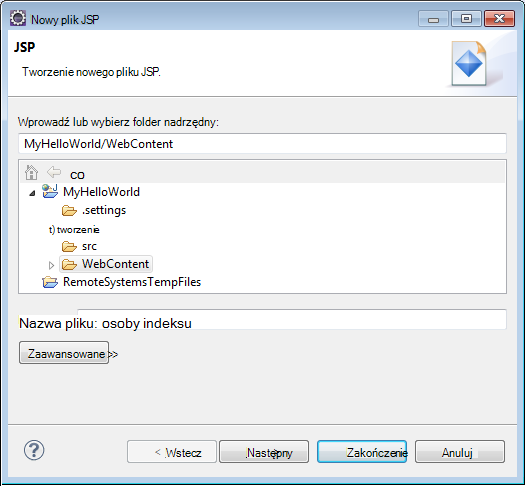
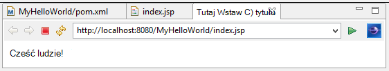
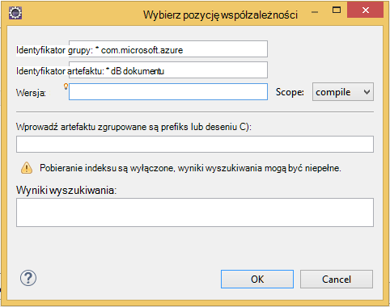

<properties
    pageTitle="Samouczek opracowywania aplikacji Java przy użyciu DocumentDB | Microsoft Azure"
    description="Ten samouczek aplikacji sieci web Java pokazano, jak korzystać z usługi Azure DocumentDB do przechowywania i danych programu access z aplikacji Java hostowana w witrynach Azure."
    keywords="Opracowywania aplikacji, samouczek bazy danych, aplikacja języka java, java samouczek aplikacji sieci web, documentdb, azure, platformy Microsoft azure"
    services="documentdb"
    documentationCenter="java"
    authors="dennyglee"
    manager="jhubbard"
    editor="mimig"/>

<tags
    ms.service="documentdb"
    ms.devlang="java"
    ms.topic="hero-article"
    ms.tgt_pltfrm="NA"
    ms.workload="data-services"
    ms.date="08/24/2016"
    ms.author="denlee"/>

# Tworzenie aplikacji sieci web Java przy użyciu DocumentDB

> [AZURE.SELECTOR]
- [.NET](documentdb-dotnet-application.md)
- [Node.js](documentdb-nodejs-application.md)
- [Java](documentdb-java-application.md)
- [Python](documentdb-python-application.md)

Ten samouczek aplikacji sieci web Java pokazano, jak korzystać z usługi [Microsoft Azure DocumentDB](https://portal.azure.com/#gallery/Microsoft.DocumentDB) do przechowywania i danych programu access z aplikacji Java hostowana w witrynach Azure. W tym temacie dowiesz się:

- Jak utworzyć podstawowy aplikacji JSP w Zaćmienie.
- Jak pracować z usługą Azure DocumentDB przy użyciu [Zestawu SDK Java DocumentDB](https://github.com/Azure/azure-documentdb-java).

Ten samouczek aplikacji Java pokazano, jak utworzyć aplikacji zarządzania zadaniami oparte na sieci web, która umożliwia do tworzenia, pobierania i oznaczenie zadania jako wykonanego, jak pokazano na poniższej ilustracji. Wszystkie zadania na liście zadania są przechowywane jako dokumenty JSON w Azure DocumentDB.

> [AZURE.TIP] Ten samouczek opracowywania aplikacji przyjęto założenie, że masz doświadczenia przy użyciu języka Java. Jeśli jesteś nowym użytkownikiem Java lub [Narzędzia wstępne](#Prerequisites), zalecamy pobieranie wykonania [zadania](https://github.com/Azure-Samples/documentdb-java-todo-app) projektu z GitHub i budowania zgodnie [z instrukcjami zawartymi na końcu tego artykułu](#GetProject). Po umieszczeniu go utworzono, możesz przejrzeć tego artykułu, aby uzyskać omówienie kod w kontekście projektu.  

##Wymagania wstępne dotyczące tego samouczka aplikacji sieci web języka Java
Przed rozpoczęciem tego samouczka opracowywania aplikacji, musi mieć następujące czynności:

- Konto Azure active. Jeśli nie masz konta, możesz utworzyć bezpłatne konto wersji próbnej na kilka minut. Aby uzyskać szczegółowe informacje zobacz [Azure bezpłatnej wersji próbnej](https://azure.microsoft.com/pricing/free-trial/).
- [Java Development Kit (JDK) 7 +](http://www.oracle.com/technetwork/java/javase/downloads/index.html).
- [Zaćmienie IDE dla deweloperów Estonia Java.](http://www.eclipse.org/downloads/packages/eclipse-ide-java-ee-developers/lunasr1)
- [Azure witrynę sieci Web ze środowiska wykonawczego języka Java (na przykład Tomcat lub molo) włączone.](../app-service-web/web-sites-java-get-started.md)

Jeśli instalujesz te narzędzia po raz pierwszy, coreservlets.com zawiera omówienie procesu instalacji w sekcji Szybkie uruchamianie ich [Samouczek: Instalowanie TomCat7 i korzystania z Zaćmienie](http://www.coreservlets.com/Apache-Tomcat-Tutorial/tomcat-7-with-eclipse.html) artykuł.

##Krok 1: Utwórz konto DocumentDB bazy danych

Zacznijmy od Tworzenie konta DocumentDB. Jeśli masz już konto, możesz przejść do [Krok 2: tworzenie aplikacji Java JSP](#CreateJSP).

[AZURE.INCLUDE [documentdb-create-dbaccount](../../includes/documentdb-create-dbaccount.md)]

[AZURE.INCLUDE [documentdb-keys](../../includes/documentdb-keys.md)]

##Krok 2: Tworzenie aplikacji Java JSP

Aby utworzyć aplikację JSP:

1. Najpierw początek przez utworzenie projektu języka Java. Rozpoczynanie Zaćmienie, a następnie kliknij pozycję **plik**, kliknij pozycję **Nowy**, a następnie kliknij **Dynamiczne projektu sieci Web**. Jeśli nie widzisz **Dynamiczne projektu sieci Web** na liście dostępne projektu, wykonaj następujące czynności: kliknij pozycję **plik**, kliknij przycisk **Nowy**, kliknij pozycję **Projekt**..., rozwiń **sieci Web**, kliknij pozycję **Project Web dynamiczne**i kliknij przycisk **Dalej**.

    

2. Wprowadź nazwę projektu, w polu **Nazwa projektu** , a następnie w menu rozwijanym **Runtime docelowej** , opcjonalnie wybierz wartość (np. Apache Tomcat 7.0), a następnie kliknij przycisk **Zakończ**. Wybieranie runtime docelowej umożliwia przejście projektu lokalnie Zaćmienie.
3. W Zaćmienie w widoku Eksplorator projektu, rozwiń projektu. Kliknij prawym przyciskiem myszy **sieć Web, zawartość**, kliknij pozycję **Nowy**, a następnie kliknij **Plik JSP**.
4. W oknie dialogowym **Nowy plik JSP** nazwę pliku **index.jsp**. Zachowaj folder nadrzędny jako **sieć Web, zawartość**, jak pokazano na poniższej ilustracji, a następnie kliknij przycisk **Dalej**.

    

5. W oknie dialogowym **Wybierz szablon JSP** do tego samouczka wybierz **Nowy plik JSP (html)**, a następnie kliknij **Zakończ**.

6. Po otwarciu pliku index.jsp w Zaćmienie, dodać tekst do wyświetlenia **Witaj świecie!** w istniejącej <body> elementu. Usługi zaktualizowanych <body> zawartości powinna wyglądać podobnie do następującego kodu:

        <body>
            <% out.println("Hello World!"); %>
        </body>

8. Zapisz plik index.jsp.
9. Jeśli ustawisz runtime docelowej w kroku 2, możesz też kliknąć **projektu** , a następnie **Uruchom** na uruchomienie aplikacji JSP lokalnie:

    

##Krok 3: Instalowanie DocumentDB Java SDK ##

Najłatwiejszym sposobem uwzględniał DocumentDB Java SDK i jego zależności jest za pośrednictwem [Środowiska Maven Apache](http://maven.apache.org/).

Aby to zrobić, należy przekonwertować projektu do projektu środowiska maven, wykonując następujące czynności:

1. Kliknij prawym przyciskiem myszy projektu w oknie Eksploratora projektu, kliknij przycisk **Konfiguruj**, kliknij polecenie **Konwertuj na środowiska Maven projektu**.
2. W oknie **Tworzenie nowych POM** Zaakceptuj ustawienia domyślne, a następnie kliknij przycisk **Zakończ**.
3. W **Programie Project Explorer**Otwórz plik pom.xml.
4. Na karcie **zależności** w okienku **zależności** kliknij przycisk **Dodaj**.
4. W oknie **Wybierz współzależności** wykonaj następujące czynności:
 - W polu **Identyfikator grupy** wprowadź com.microsoft.azure.
 - W polu **Identyfikator artefaktu** wprowadź azure documentdb.
 - W polu **wersja** wprowadź: 1.5.1.

    

    Lub Dodawanie współzależności XML dla identyfikator grupy i ArtifactId bezpośrednio do pom.xml za pomocą edytora tekstu:

        <dependency>
            <groupId>com.microsoft.azure</groupId>
            <artifactId>azure-documentdb</artifactId>
            <version>1.5.1</version>
        </dependency>

5. Kliknij przycisk **Ok** i środowiska Maven zainstaluje DocumentDB Java SDK.
6. Zapisz plik pom.xml.

##Krok 4: Przy użyciu usługi DocumentDB w aplikacji języka Java

1. Najpierw Przyjrzyjmy Definiowanie obiektu TodoItem:

        @Data
        @Builder
        public class TodoItem {
            private String category;
            private boolean complete;
            private String id;
            private String name;
        }

    W tym projekcie użyto [Lombok projektu](http://projectlombok.org/) do generowania konstruktora, pobierające ustawiające i konstruktora. Można też ręcznie napisać kod lub mają IDE wygenerowania.

2. Aby wywoływanie usługi DocumentDB, trzeba utworzyć wystąpienie nowego **DocumentClient**. Ogólnie najlepiej jest ponowne używanie **DocumentClient** — zamiast tworzenia nowego klienta dla każdego kolejne żądania. Firma Microsoft można ponownie użyć klienta w cudzysłowach klienta w **DocumentClientFactory**. Jest to również, której chcesz wkleić wartość identyfikatora URI i klucz podstawowy, zapisane w usłudze Schowku w [kroku 1](#CreateDB). Zamienianie [jego\_punktu KOŃCOWEGO\_tutaj] przy użyciu identyfikatora URI i Zamień [jego\_klucz\_tutaj] przy użyciu klucza podstawowego.

        private static final String HOST = "[YOUR_ENDPOINT_HERE]";
        private static final String MASTER_KEY = "[YOUR_KEY_HERE]";

        private static DocumentClient documentClient;

        public static DocumentClient getDocumentClient() {
            if (documentClient == null) {
                documentClient = new DocumentClient(HOST, MASTER_KEY,
                        ConnectionPolicy.GetDefault(), ConsistencyLevel.Session);
            }

            return documentClient;
        }

3. Teraz tworzenie obiektu DAO (Data Access) do abstrakcyjne utrzymuje naszych zadań do wykonania do DocumentDB.

    Aby zapisać zadań do wykonania do kolekcji, należy wiedzieć, które bazy danych i zbioru do innej witryny do klienta (jako wskazaną przez siebie łączy). Zazwyczaj najlepiej pamięci podręcznej bazy danych i zbioru, jeśli to możliwe uniknąć dodatkowych przesyłania danych do bazy danych.

    Poniższy kod przedstawia sposób pobierania naszych bazy danych i zbioru, jeśli istnieje, lub utworzyć nową, jeśli nie istnieje:

        public class DocDbDao implements TodoDao {
            // The name of our database.
            private static final String DATABASE_ID = "TodoDB";

            // The name of our collection.
            private static final String COLLECTION_ID = "TodoCollection";

            // The DocumentDB Client
            private static DocumentClient documentClient = DocumentClientFactory
                    .getDocumentClient();

            // Cache for the database object, so we don't have to query for it to
            // retrieve self links.
            private static Database databaseCache;

            // Cache for the collection object, so we don't have to query for it to
            // retrieve self links.
            private static DocumentCollection collectionCache;

            private Database getTodoDatabase() {
                if (databaseCache == null) {
                    // Get the database if it exists
                    List<Database> databaseList = documentClient
                            .queryDatabases(
                                    "SELECT * FROM root r WHERE r.id='" + DATABASE_ID
                                            + "'", null).getQueryIterable().toList();

                    if (databaseList.size() > 0) {
                        // Cache the database object so we won't have to query for it
                        // later to retrieve the selfLink.
                        databaseCache = databaseList.get(0);
                    } else {
                        // Create the database if it doesn't exist.
                        try {
                            Database databaseDefinition = new Database();
                            databaseDefinition.setId(DATABASE_ID);

                            databaseCache = documentClient.createDatabase(
                                    databaseDefinition, null).getResource();
                        } catch (DocumentClientException e) {
                            // TODO: Something has gone terribly wrong - the app wasn't
                            // able to query or create the collection.
                            // Verify your connection, endpoint, and key.
                            e.printStackTrace();
                        }
                    }
                }

                return databaseCache;
            }

            private DocumentCollection getTodoCollection() {
                if (collectionCache == null) {
                    // Get the collection if it exists.
                    List<DocumentCollection> collectionList = documentClient
                            .queryCollections(
                                    getTodoDatabase().getSelfLink(),
                                    "SELECT * FROM root r WHERE r.id='" + COLLECTION_ID
                                            + "'", null).getQueryIterable().toList();

                    if (collectionList.size() > 0) {
                        // Cache the collection object so we won't have to query for it
                        // later to retrieve the selfLink.
                        collectionCache = collectionList.get(0);
                    } else {
                        // Create the collection if it doesn't exist.
                        try {
                            DocumentCollection collectionDefinition = new DocumentCollection();
                            collectionDefinition.setId(COLLECTION_ID);

                            collectionCache = documentClient.createCollection(
                                    getTodoDatabase().getSelfLink(),
                                    collectionDefinition, null).getResource();
                        } catch (DocumentClientException e) {
                            // TODO: Something has gone terribly wrong - the app wasn't
                            // able to query or create the collection.
                            // Verify your connection, endpoint, and key.
                            e.printStackTrace();
                        }
                    }
                }

                return collectionCache;
            }
        }

4. Następnym krokiem jest pisanie kodu do innej witryny TodoItems w do kolekcji. W tym przykładzie użyjemy [Gson](https://code.google.com/p/google-gson/) szeregować i Anuluj szeregować Java obiektów (POJOs) TodoItem zwykły starych dokumentów JSON. [Jacksona](http://jackson.codehaus.org/) lub własne niestandardowe serializatora są również doskonałe rozwiązania alternatywne dla szeregowania POJOs.

        // We'll use Gson for POJO <=> JSON serialization for this example.
        private static Gson gson = new Gson();

        @Override
        public TodoItem createTodoItem(TodoItem todoItem) {
            // Serialize the TodoItem as a JSON Document.
            Document todoItemDocument = new Document(gson.toJson(todoItem));

            // Annotate the document as a TodoItem for retrieval (so that we can
            // store multiple entity types in the collection).
            todoItemDocument.set("entityType", "todoItem");

            try {
                // Persist the document using the DocumentClient.
                todoItemDocument = documentClient.createDocument(
                        getTodoCollection().getSelfLink(), todoItemDocument, null,
                        false).getResource();
            } catch (DocumentClientException e) {
                e.printStackTrace();
                return null;
            }

            return gson.fromJson(todoItemDocument.toString(), TodoItem.class);
        }

5. Przykład DocumentDB baz danych i zbiorów odwołuje się również dokument przez siebie łączy. Poniższa funkcja Pomocnik pozwoli pobieranie dokumentów na inny atrybut (np. "identyfikator"), a nie własny łącze:

        private Document getDocumentById(String id) {
            // Retrieve the document using the DocumentClient.
            List<Document> documentList = documentClient
                    .queryDocuments(getTodoCollection().getSelfLink(),
                            "SELECT * FROM root r WHERE r.id='" + id + "'", null)
                    .getQueryIterable().toList();

            if (documentList.size() > 0) {
                return documentList.get(0);
            } else {
                return null;
            }
        }

6. Firma Microsoft użyj metody Pomocnik w kroku 5, aby pobrać dokument TodoItem JSON według identyfikatorów i deserializacji go do POJO:

        @Override
        public TodoItem readTodoItem(String id) {
            // Retrieve the document by id using our helper method.
            Document todoItemDocument = getDocumentById(id);

            if (todoItemDocument != null) {
                // De-serialize the document in to a TodoItem.
                return gson.fromJson(todoItemDocument.toString(), TodoItem.class);
            } else {
                return null;
            }
        }

7. Firma Microsoft umożliwia DocumentClient się zbioru lub listy TodoItems za pomocą DocumentDB SQL:

        @Override
        public List<TodoItem> readTodoItems() {
            List<TodoItem> todoItems = new ArrayList<TodoItem>();

            // Retrieve the TodoItem documents
            List<Document> documentList = documentClient
                    .queryDocuments(getTodoCollection().getSelfLink(),
                            "SELECT * FROM root r WHERE r.entityType = 'todoItem'",
                            null).getQueryIterable().toList();

            // De-serialize the documents in to TodoItems.
            for (Document todoItemDocument : documentList) {
                todoItems.add(gson.fromJson(todoItemDocument.toString(),
                        TodoItem.class));
            }

            return todoItems;
        }

8. Istnieje wiele sposobów aktualizowania dokumentu z DocumentClient. W naszym aplikacji listy zadania chcemy mieć możliwość przełącza TodoItem zostało zakończone. Można to osiągnąć aktualizując atrybutu "ukończone" w dokumencie:

        @Override
        public TodoItem updateTodoItem(String id, boolean isComplete) {
            // Retrieve the document from the database
            Document todoItemDocument = getDocumentById(id);

            // You can update the document as a JSON document directly.
            // For more complex operations - you could de-serialize the document in
            // to a POJO, update the POJO, and then re-serialize the POJO back in to
            // a document.
            todoItemDocument.set("complete", isComplete);

            try {
                // Persist/replace the updated document.
                todoItemDocument = documentClient.replaceDocument(todoItemDocument,
                        null).getResource();
            } catch (DocumentClientException e) {
                e.printStackTrace();
                return null;
            }

            return gson.fromJson(todoItemDocument.toString(), TodoItem.class);
        }

9. Na koniec potrzebna jest możliwość usuwania TodoItem z naszej listy. Aby to zrobić, możemy Użyj metodę Pomocnik, która wcześniej napisane możemy pobrać własny łącze i następnie określić klienta, aby go usunąć:

        @Override
        public boolean deleteTodoItem(String id) {
            // DocumentDB refers to documents by self link rather than id.

            // Query for the document to retrieve the self link.
            Document todoItemDocument = getDocumentById(id);

            try {
                // Delete the document by self link.
                documentClient.deleteDocument(todoItemDocument.getSelfLink(), null);
            } catch (DocumentClientException e) {
                e.printStackTrace();
                return false;
            }

            return true;
        }

##Krok 5: Połączeń pozostałą część projektu opracowywania aplikacji Java razem

Teraz, gdy zakończenia nieźle bity — wszystkie lewy jest utworzenie szybkie użytkownika interfejs i szkielety go do naszych DAO.

1. Najpierw Zacznijmy konstruowania kontroler połączenie naszych DAO:

        public class TodoItemController {
            public static TodoItemController getInstance() {
                if (todoItemController == null) {
                    todoItemController = new TodoItemController(TodoDaoFactory.getDao());
                }
                return todoItemController;
            }

            private static TodoItemController todoItemController;

            private final TodoDao todoDao;

            TodoItemController(TodoDao todoDao) {
                this.todoDao = todoDao;
            }

            public TodoItem createTodoItem(@NonNull String name,
                    @NonNull String category, boolean isComplete) {
                TodoItem todoItem = TodoItem.builder().name(name).category(category)
                        .complete(isComplete).build();
                return todoDao.createTodoItem(todoItem);
            }

            public boolean deleteTodoItem(@NonNull String id) {
                return todoDao.deleteTodoItem(id);
            }

            public TodoItem getTodoItemById(@NonNull String id) {
                return todoDao.readTodoItem(id);
            }

            public List<TodoItem> getTodoItems() {
                return todoDao.readTodoItems();
            }

            public TodoItem updateTodoItem(@NonNull String id, boolean isComplete) {
                return todoDao.updateTodoItem(id, isComplete);
            }
        }

    W aplikacji bardziej złożone kontroler serwerach mogą znajdować się skomplikowane warunków logicznych na bieżąco DAO.

2. Następnie utworzymy servlet rozsyłanie żądań HTTP na kontrolerze:

        public class TodoServlet extends HttpServlet {
            // API Keys
            public static final String API_METHOD = "method";

            // API Methods
            public static final String CREATE_TODO_ITEM = "createTodoItem";
            public static final String GET_TODO_ITEMS = "getTodoItems";
            public static final String UPDATE_TODO_ITEM = "updateTodoItem";

            // API Parameters
            public static final String TODO_ITEM_ID = "todoItemId";
            public static final String TODO_ITEM_NAME = "todoItemName";
            public static final String TODO_ITEM_CATEGORY = "todoItemCategory";
            public static final String TODO_ITEM_COMPLETE = "todoItemComplete";

            public static final String MESSAGE_ERROR_INVALID_METHOD = "{'error': 'Invalid method'}";

            private static final long serialVersionUID = 1L;
            private static final Gson gson = new Gson();

            @Override
            protected void doGet(HttpServletRequest request,
                    HttpServletResponse response) throws ServletException, IOException {

                String apiResponse = MESSAGE_ERROR_INVALID_METHOD;

                TodoItemController todoItemController = TodoItemController
                        .getInstance();

                String id = request.getParameter(TODO_ITEM_ID);
                String name = request.getParameter(TODO_ITEM_NAME);
                String category = request.getParameter(TODO_ITEM_CATEGORY);
                boolean isComplete = StringUtils.equalsIgnoreCase("true",
                        request.getParameter(TODO_ITEM_COMPLETE)) ? true : false;

                switch (request.getParameter(API_METHOD)) {
                case CREATE_TODO_ITEM:
                    apiResponse = gson.toJson(todoItemController.createTodoItem(name,
                            category, isComplete));
                    break;
                case GET_TODO_ITEMS:
                    apiResponse = gson.toJson(todoItemController.getTodoItems());
                    break;
                case UPDATE_TODO_ITEM:
                    apiResponse = gson.toJson(todoItemController.updateTodoItem(id,
                            isComplete));
                    break;
                default:
                    break;
                }

                response.getWriter().println(apiResponse);
            }

            @Override
            protected void doPost(HttpServletRequest request,
                    HttpServletResponse response) throws ServletException, IOException {
                doGet(request, response);
            }
        }

3. Potrzebujemy interfejs użytkownika sieci Web do wyświetlenia dla użytkownika. Załóżmy ponownie zapisu index.jsp utworzone wcześniej:

        <html>
        <head>
          <meta http-equiv="Content-Type" content="text/html; charset=ISO-8859-1">
          <meta http-equiv="X-UA-Compatible" content="IE=edge;" />
          <title>Azure DocumentDB Java Sample</title>

          <!-- Bootstrap -->
          <link href="//ajax.aspnetcdn.com/ajax/bootstrap/3.2.0/css/bootstrap.min.css" rel="stylesheet">

          
        </head>
        <body>
          <!-- Nav Bar -->
          

            

              

                <a class="navbar-brand" href="#">My Tasks</a>
              

            

          

          <!-- Body -->
          

            <h1>My ToDo List</h1>

            

            <!-- The ToDo List -->
            

              <table class="table table-bordered table-striped" id="todoItems">
                <thead>
                  <tr>
                    <th>Name</th>
                    <th>Category</th>
                    <th>Complete</th>
                  </tr>
                </thead>
                <tbody>
                </tbody>
              </table>

              <!-- Update Button -->
              

                <form class="form-horizontal" role="form">
                  <button type="button" class="btn btn-primary">Update Tasks</button>
                </form>
              

            

            

            <!-- Item Input Form -->
            

              <form class="form-horizontal" role="form">
                

                  <label for="inputItemName" class="col-sm-2">Task Name</label>
                  

                    <input type="text" class="form-control" id="inputItemName" placeholder="Enter name">
                  

                

                

                  <label for="inputItemCategory" class="col-sm-2">Task Category</label>
                  

                    <input type="text" class="form-control" id="inputItemCategory" placeholder="Enter category">
                  

                

                <button type="button" class="btn btn-primary">Add Task</button>
              </form>
            

          

          <!-- Placed at the end of the document so the pages load faster -->
          
          
          
        </body>
        </html>

4. I na koniec zapisu niektórych Javascript po stronie klienta powiązać interfejs użytkownika sieci web i servlet razem:

        var todoApp = {
          /*
           * API methods to call Java backend.
           */
          apiEndpoint: "api",

          createTodoItem: function(name, category, isComplete) {
            $.post(todoApp.apiEndpoint, {
                "method": "createTodoItem",
                "todoItemName": name,
                "todoItemCategory": category,
                "todoItemComplete": isComplete
              },
              function(data) {
                var todoItem = data;
                todoApp.addTodoItemToTable(todoItem.id, todoItem.name, todoItem.category, todoItem.complete);
              },
              "json");
          },

          getTodoItems: function() {
            $.post(todoApp.apiEndpoint, {
                "method": "getTodoItems"
              },
              function(data) {
                var todoItemArr = data;
                $.each(todoItemArr, function(index, value) {
                  todoApp.addTodoItemToTable(value.id, value.name, value.category, value.complete);
                });
              },
              "json");
          },

          updateTodoItem: function(id, isComplete) {
            $.post(todoApp.apiEndpoint, {
                "method": "updateTodoItem",
                "todoItemId": id,
                "todoItemComplete": isComplete
              },
              function(data) {},
              "json");
          },

          /*
           * UI Methods
           */
          addTodoItemToTable: function(id, name, category, isComplete) {
            var rowColor = isComplete ? "active" : "warning";

            todoApp.ui_table().append($("<tr>")
              .append($("<td>").text(name))
              .append($("<td>").text(category))
              .append($("<td>")
                .append($("<input>")
                  .attr("type", "checkbox")
                  .attr("id", id)
                  .attr("checked", isComplete)
                  .attr("class", "isComplete")
                ))
              .addClass(rowColor)
            );
          },

          /*
           * UI Bindings
           */
          bindCreateButton: function() {
            todoApp.ui_createButton().click(function() {
              todoApp.createTodoItem(todoApp.ui_createNameInput().val(), todoApp.ui_createCategoryInput().val(), false);
              todoApp.ui_createNameInput().val("");
              todoApp.ui_createCategoryInput().val("");
            });
          },

          bindUpdateButton: function() {
            todoApp.ui_updateButton().click(function() {
              // Disable button temporarily.
              var myButton = $(this);
              var originalText = myButton.text();
              $(this).text("Updating...");
              $(this).prop("disabled", true);

              // Call api to update todo items.
              $.each(todoApp.ui_updateId(), function(index, value) {
                todoApp.updateTodoItem(value.name, value.value);
                $(value).remove();
              });

              // Re-enable button.
              setTimeout(function() {
                myButton.prop("disabled", false);
                myButton.text(originalText);
              }, 500);
            });
          },

          bindUpdateCheckboxes: function() {
            todoApp.ui_table().on("click", ".isComplete", function(event) {
              var checkboxElement = $(event.currentTarget);
              var rowElement = $(event.currentTarget).parents('tr');
              var id = checkboxElement.attr('id');
              var isComplete = checkboxElement.is(':checked');

              // Toggle table row color
              if (isComplete) {
                rowElement.addClass("active");
                rowElement.removeClass("warning");
              } else {
                rowElement.removeClass("active");
                rowElement.addClass("warning");
              }

              // Update hidden inputs for update panel.
              todoApp.ui_updateForm().children("input[name='" + id + "']").remove();

              todoApp.ui_updateForm().append($("<input>")
                .attr("type", "hidden")
                .attr("class", "updateComplete")
                .attr("name", id)
                .attr("value", isComplete));

            });
          },

          /*
           * UI Elements
           */
          ui_createNameInput: function() {
            return $(".todoForm #inputItemName");
          },

          ui_createCategoryInput: function() {
            return $(".todoForm #inputItemCategory");
          },

          ui_createButton: function() {
            return $(".todoForm button");
          },

          ui_table: function() {
            return $(".todoList table tbody");
          },

          ui_updateButton: function() {
            return $(".todoUpdatePanel button");
          },

          ui_updateForm: function() {
            return $(".todoUpdatePanel form");
          },

          ui_updateId: function() {
            return $(".todoUpdatePanel .updateComplete");
          },

          /*
           * Install the TodoApp
           */
          install: function() {
            todoApp.bindCreateButton();
            todoApp.bindUpdateButton();
            todoApp.bindUpdateCheckboxes();

            todoApp.getTodoItems();
          }
        };

        $(document).ready(function() {
          todoApp.install();
        });

5. Klienci! Teraz wszystkie opcje, które zostało jest przetestować aplikację. Lokalnie uruchomić aplikację, a następnie dodaj niektórych zadań do wykonania, wypełniając w polu Nazwa elementu i kategorii, a następnie klikając pozycję **Dodaj zadanie**.

6. Gdy pojawi się element, możesz zaktualizować czy jest wykonane, przełączanie pole wyboru i klikając **Aktualizowanie zadań**.

##Krok 6: Wdrażanie aplikacji Java do witryn sieci Web Azure

Azure witryn sieci Web służy do wdrażania aplikacji Java prosty sposób eksportowania aplikacji jako pliku też i przekazania go albo za pomocą kontrolki źródła (na przykład CYFRA) lub FTP.

1. Aby wyeksportować aplikacji jako też, kliknij prawym przyciskiem myszy nad projektem w **Programie Project Explorer**, kliknij przycisk **Eksportuj**, a następnie kliknij **Plik też**.
2. W oknie **Też eksportu** wykonaj następujące czynności:
 - W polu project Web wprowadź azure documentdb-java próbki.
 - W polu miejsce docelowe wybierz miejsce do zapisania pliku też.
 - Kliknij przycisk **Zakończ**.

3. Teraz, gdy masz w pliku też, możesz po prostu przekazać go do witryny Azure **Używanie** katalogu. Aby uzyskać instrukcje dotyczące przekazywania pliku zobacz [Dodawanie aplikacji do witryny Java Azure](../app-service-web/web-sites-java-add-app.md).

    Po przekazaniu pliku też do katalogu używanie środowiska wykonawczego wykryje dodano go, a następnie automatycznie pobierze go.
4. Aby wyświetlić swój produkt ukończona, przejdź do http://YOUR\_witryny\_NAME.azurewebsites.net/azure-documentdb-java-sample/, a następnie Rozpocznij dodawanie zadań!

##Pobieranie projektu z GitHub

Wszystkie próbki w tym samouczku znajdują się w programie project [zadania](https://github.com/Azure-Samples/documentdb-java-todo-app) na GitHub. Aby zaimportować projektu zadania do Zaćmienie, upewnij się, że masz oprogramowania i zasobów wymienionych w sekcji [wymagania wstępne](#Prerequisites) , a następnie wykonaj następujące czynności:

1. Zainstaluj [Lombok projektu](http://projectlombok.org/). Lombok służy do generowania konstruktory, pobierające i ustawiające w projekcie. Pobrany plik lombok.jar go dwukrotnie, aby go zainstalować lub zainstalować go z poziomu wiersza polecenia.
2. Jeśli Zaćmienie jest otwarty, zamknij go i ponownie uruchom go, aby załadować Lombok.
3. W Zaćmienie w menu **plik** kliknij polecenie **Importuj**.
4. W oknie **importu** kliknij **cyfra**, kliknij pozycję **projekty z cyfra**, a następnie kliknij przycisk **Dalej**.
5. Na ekranie **Wybierz źródło repozytorium** kliknij **Klonowanie identyfikatora URI**.
6. Na ekranie **Repozytorium cyfra źródła** w polu **identyfikator URI** wprowadź https://github.com/Azure-Samples/documentdb-java-todo-app.git, a następnie kliknij przycisk **Dalej**.
7. Na ekranie **Wyboru gałąź** upewnij się, tego **wzorca** jest zaznaczone, a następnie kliknij przycisk **Dalej**.
8. Na ekranie **Lokalne docelowym** kliknij przycisk **Przeglądaj** , aby wybrać folder miejsce, w którym można skopiować repozytorium, a następnie kliknij przycisk **Dalej**.
9. Na ekranie **Wybierz przez Kreatora importowania projektów** upewnij się, że **Importowanie istniejących projektów** jest zaznaczone i kliknij przycisk **Dalej**.
10. Na ekranie **Importu projektów** Usuń zaznaczenie projektu **DocumentDB** i kliknij przycisk **Zakończ**. Projekt DocumentDB zawiera SDK Java DocumentDB, która zostanie dodana jako zależność zamiast tego.
11. W **Programie Project Explorer**przejdź do azure-documentdb-java-sample\src\com.microsoft.azure.documentdb.sample.dao\DocumentClientFactory.java i Zamień wartości hosta i MASTER_KEY URI i klucza podstawowego dla Twojego konta DocumentDB, a następnie zapisz plik. Aby uzyskać więcej informacji zobacz [kroku 1. Tworzenie konta bazy danych DocumentDB](#CreateDB).
12. W **Programie Project Explorer** **azure documentdb-java próbkami**kliknij prawym przyciskiem myszy, kliknij przycisk **Konstruuj ścieżkę**, a następnie kliknij **Konfigurowanie Tworzenie ścieżki**.
13. Na ekranie **Java Tworzenie ścieżki** w okienku po prawej stronie wybierz kartę **biblioteki** , a następnie kliknij **Dodaj JARs zewnętrznych**. Przejdź do lokalizacji pliku lombok.jar i kliknij przycisk **Otwórz**, a następnie kliknij **przycisk OK**.
14. Ponownie otwórz okno **Właściwości** za pomocą krok 12, a następnie w okienku po lewej stronie kliknij **Przeznaczona programów**.
15. Na ekranie **Przeznaczona programów** kliknij pozycję **Nowy**, wybierz **Apache Tomcat 7.0**, a następnie kliknij **przycisk OK**.
16. Ponownie otwórz okno **Właściwości** za pomocą krok 12, a następnie w okienku po lewej stronie kliknij **Aspekty projektu**.
17. Na ekranie **Aspekty projektu** wybierz **Dynamiczne moduł sieci Web** i **Java**, a następnie kliknij **przycisk OK**.
18. Na karcie **Serwery** u dołu ekranu kliknij prawym przyciskiem myszy **Tomcat 7.0 Server u hosta lokalnego** , a następnie kliknij przycisk **Dodaj i Usuń**.
19. W oknie **Dodawanie i usuwanie** Przenieś **azure documentdb-java próbkami** do pola **skonfigurowane** , a następnie kliknij przycisk **Zakończ**.
20. Na karcie **serwer** kliknij prawym przyciskiem myszy **Tomcat 7.0 Server u hosta lokalnego**, a następnie kliknij przycisk **Uruchom**.
21. W przeglądarce, przejdź do 8080/azure-documentdb-java — przykładowe- i zacząć dodawać do listy zadań. Zauważ, że zmiana domyślne wartości portu, zmienianie 8080 na wybraną wartość.
22. Aby wdrożyć projektu Azure witryny sieci web, zobacz [kroku 6. Wdrażanie aplikacji do witryn sieci Web Azure](#Deploy).

[1]: media/documentdb-java-application/keys.png
