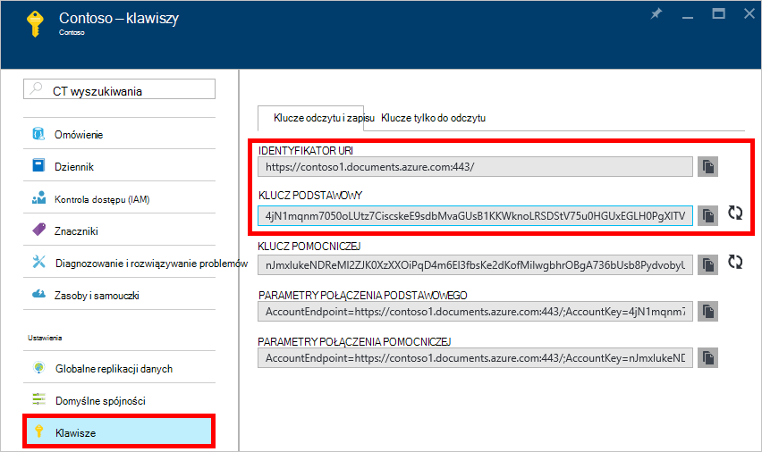
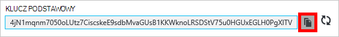
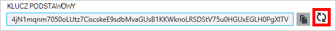
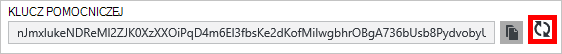
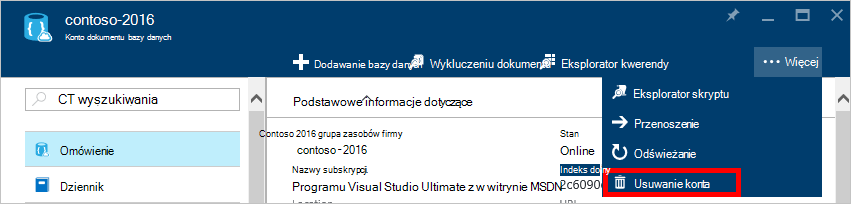
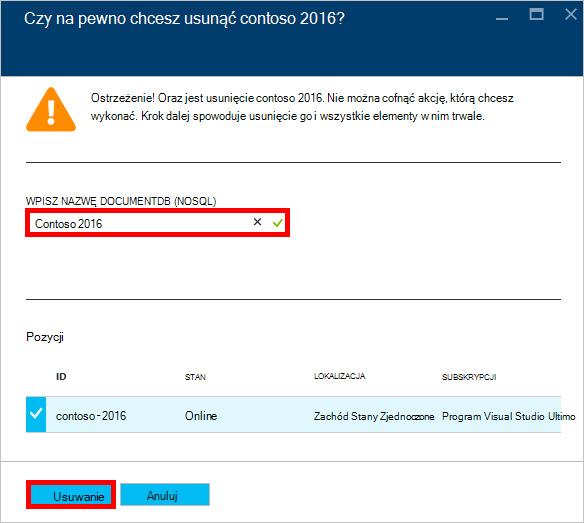

<properties
    pageTitle="Zarządzanie kontem DocumentDB przez Azure Portal | Microsoft Azure"
    description="Dowiedz się, jak zarządzać swoim kontem DocumentDB przez Azure Portal. Przewodnik na wyświetlanie, kopiowanie, usuwanie i uzyskać dostęp do konta za pomocą Azure Portal."
    keywords="Portal Azure, documentdb, azure, platformy Microsoft azure"
    services="documentdb"
    documentationCenter=""
    authors="kirillg"
    manager="jhubbard"
    editor="cgronlun"/>

<tags
    ms.service="documentdb"
    ms.workload="data-services"
    ms.tgt_pltfrm="na"
    ms.devlang="na"
    ms.topic="article"
    ms.date="10/14/2016"
    ms.author="kirillg"/>

# Jak zarządzać konta DocumentDB

Dowiedz się, jak ustawić globalną spójność, Praca z klawiszami i usunąć konto DocumentDB w portalu Azure.

## Zarządzanie ustawieniami spójności DocumentDB

Wybieranie poziomu spójności prawo zależy od znaczeń właściwych aplikacji. Należy zapoznać się z poziomu spójności dostępne w DocumentDB, czytając [Używanie poziomów spójności maksymalizować dostępności i wydajności w DocumentDB] [consistency]. DocumentDB zawiera spójności, dostępność i gwarancje wykonania na każdym poziomie spójności dostępne dla Twojego konta bazy danych. Konfigurowanie konta bazy danych z poziomu spójności silne wymaga, czy dane zamkniętej jeden z regionów Azure i nie są dostępne globalnie. Z drugiej strony, poziomy obniżone spójności - staleness ograniczona, sesji lub Włącz ewentualnego można skojarzyć dowolną liczbę regionów Azure za pomocą konta bazy danych. Proste czynności pokazano, jak wybrać domyślny poziom spójności dla Twojego konta bazy danych. 

### Aby określić spójności domyślnego konta DocumentDB

1. W [portalu Azure](https://portal.azure.com/)uzyskiwania dostępu do konta DocumentDB.
2. W karta konta kliknij przycisk **domyślne spójności**.
3. W karta **Spójności domyślny** wybierz nowy poziom spójności i kliknij przycisk **Zapisz**.
    ![Domyślne spójności sesji][5]

## Wyświetlanie, kopiowanie i ponownie wygenerować klawiszy dostępu
Po utworzeniu konta DocumentDB usługę generuje dwóch klawiszy dostępu wzorca, które mogą być używane do uwierzytelniania podczas uzyskiwania dostępu do konta DocumentDB. Udostępniając dwa klawisze dostępu, DocumentDB umożliwia ponownie wygenerować klucze identycznego z kontem DocumentDB. 

W [portalu Azure](https://portal.azure.com/)dostęp karta **klawiszy** z menu zasobów karta **DocumentDB konto** , aby wyświetlić, kopiowanie i ponownie wygenerować klawisze dostępu, które są używane do uzyskiwania dostępu do konta DocumentDB.

> [AZURE.NOTE] Karta **klawiszy** także parametry połączenia głównego i pomocniczego, których można używać do nawiązywania połączenia z kontem z [Narzędzia do migracji danych](documentdb-import-data.md).

Klucze tylko do odczytu są również dostępne w tym karta. Odczyt i kwerend tworzy podczas operacji tylko do odczytu, aby usunąć, i nie są zastępowane.

### Kopiowanie klawisz dostępu w Azure Portal

Na karta **klawiszy** kliknij przycisk **Kopiuj** , aby po prawej stronie klucz, który chcesz skopiować.

### Ponownie wygenerować klawiszy dostępu

Należy zmienić klawisze dostępu do konta DocumentDB okresowo, aby zabezpieczyć połączenia. Aby możliwe było obsługiwać połączenia z kontem DocumentDB przy użyciu jednego klucza dostępu, podczas Generuj kod dostępu są przypisywane dwóch klawiszy dostępu.

> [AZURE.WARNING] Ponowne generowanie kluczy dostępu ma wpływ na wszystkie aplikacje, które są zależne od bieżącego klucza. Można zaktualizować wszystkich klientów, którzy przy użyciu klucza dostępu do uzyskania dostępu do konta DocumentDB przy użyciu nowego klucza.

Jeśli masz, aplikacji i usług w chmurze przy użyciu konta DocumentDB, zostaną utracone połączenia jeśli Generuj klawiszy, chyba że użycia kluczy. Poniższe czynności w konspekcie proces stopniowych kluczy.

1. Aktualizowanie klawisz dostępu w kodzie aplikacji, aby odwołać klawisz dostępu pomocniczej konta DocumentDB.
2. Odtworzyć klucz podstawowy dostępu do konta DocumentDB. W [Azure Portal](https://portal.azure.com/)uzyskiwania dostępu do konta DocumentDB.
3. W karta **Konta DocumentDB** kliknij **klawiszy**.
4. Na karta **klawiszy** kliknij przycisk wyniku, a następnie kliknij przycisk **Ok** aby potwierdzić, że chcesz wygenerować nowy klucz.
    

5. Po upewnieniu się, że nowy klucz jest dostępny do użytku (około 5 minut po ponownego wygenerowania), zaktualizuj klawisz dostępu w kodzie aplikacji, aby odwołać się nowy klucz podstawowy dostęp.
6. Generuj kod dostępu pomocniczą.

    

> [AZURE.NOTE] Może potrwać kilka minut, zanim wygenerowanym klucz może służyć do uzyskiwania dostępu do konta DocumentDB.

## Pobieranie parametrów połączenia

Aby pobrać ciąg połączenia, wykonaj następujące czynności: 

1. W [portalu Azure](https://portal.azure.com)uzyskiwania dostępu do konta DocumentDB.
2. W menu zasobów kliknij **klawiszy**.
3. Kliknij przycisk **Kopiuj** obok pola **Podstawowego parametry połączenia** lub **Pomocnicza parametry połączenia** . 

Jeśli korzystasz z parametrów połączenia za pomocą [Narzędzia do migracji DocumentDB bazy danych](documentdb-import-data.md), Dołącz nazwę bazy danych na końcu parametry połączenia. `AccountEndpoint=< >;AccountKey=< >;Database=< >`.

## Usuwanie konta DocumentDB
Aby usunąć konto DocumentDB z Portal Azure, którego nie są już używasz, polecenie **Usuń konto** na karta **DocumentDB konta** .

1. W [portalu Azure](https://portal.azure.com/)dostęp do konta DocumentDB, które chcesz usunąć.
2. Na karta **DocumentDB konta** kliknij przycisk **więcej**, a następnie kliknij **Usuń konto**. Lub, kliknij prawym przyciskiem myszy nazwę bazy danych, a następnie kliknij pozycję **Usuń konto**.
3. W wyniku karta potwierdzenia wpisz nazwę konta DocumentDB, aby potwierdzić, że chcesz usunąć konto.
4. Kliknij przycisk **Usuń** .

## Następne kroki

Dowiedz się, jak [rozpocząć pracę z kontem usługi DocumentDB](http://go.microsoft.com/fwlink/p/?LinkId=402364).

Aby dowiedzieć się więcej na temat DocumentDB, zapoznaj się z dokumentacją Azure DocumentDB na [azure.com](http://go.microsoft.com/fwlink/?LinkID=402319&clcid=0x409).

<!--Image references-->
[1]: ./media/documentdb-manage-account/documentdb_add_region-1.png
[2]: ./media/documentdb-manage-account/documentdb_add_region-2.png
[3]: ./media/documentdb-manage-account/documentdb_change_write_region-1.png
[4]: ./media/documentdb-manage-account/documentdb_change_write_region-2.png
[5]: ./media/documentdb-manage-account/documentdb_change_consistency-1.png
[6]: ./media/documentdb-manage-account/chooseandsaveconsistency.png

<!--Reference style links - using these makes the source content way more readable than using inline links-->
[bcdr]: https://azure.microsoft.com/documentation/articles/best-practices-availability-paired-regions/
[consistency]: https://azure.microsoft.com/documentation/articles/documentdb-consistency-levels/
[azureregions]: https://azure.microsoft.com/en-us/regions/#services
[offers]: https://azure.microsoft.com/en-us/pricing/details/documentdb/
