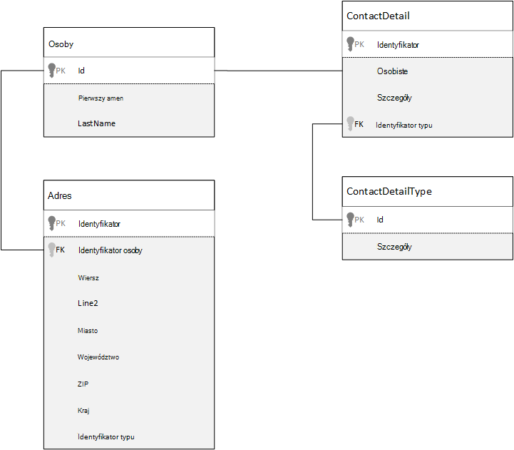
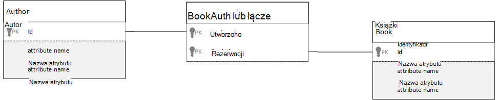

<properties 
    pageTitle="Modelowanie danych w Azure DocumentDB | Microsoft Azure" 
    description="Informacje na temat modelowania danych dla DocumentDB, dokumentu NoSQL bazy danych." 
    keywords="modelowanie danych"
    services="documentdb" 
    authors="kiratp" 
    manager="jhubbard" 
    editor="mimig1" 
    documentationCenter=""/>

<tags 
    ms.service="documentdb" 
    ms.workload="data-services" 
    ms.tgt_pltfrm="na" 
    ms.devlang="na" 
    ms.topic="article" 
    ms.date="08/05/2016" 
    ms.author="kipandya"/>

#Modelowanie danych w DocumentDB#
Podczas bazy wolny schematu danych, takich jak Azure DocumentDB był bardzo łatwa obejmować zmiany w modelu danych powinien nadal poświęconej niektórych myślenie czasu o danych. 

Jak danych ma być przechowywane? Jak będzie aplikacji do pobierania i kwerendy danych Jest intensywnie aplikacji pogrubiona odczytu lub zapisu? 

Po zapoznaniu się w tym artykule, można odpowiedzieć na następujące pytania:

- Jak należy wziąć pod uwagę dokumentu w bazie danych dla dokumentu?
- Co to jest modelowanie danych i dlaczego warto zwracać? 
- Czym różni się modelowanie danych w bazie danych dla dokumentu w relacyjnej bazie danych?
- Jak express relacji między danymi-relacyjnej bazy danych?
- Gdy osadzanie danych i kiedy umieścić łącze do danych?

##Osadzanie danych##
Po uruchomieniu modelowanie danych w sklepie dokumentu, takie jak DocumentDB, spróbuj traktowania obiekty jako **Samodzielne dokumenty** przedstawione w formacie JSON.

Przed firma Microsoft zagłębić się zbyt dużo dodatkowo Pozwól nam ponownie wykonać kilka kroków i przejrzyj w jak firma Microsoft może innej relacyjnej bazy danych, temat, który już zaznajomieni wielu osób z modelu. W poniższym przykładzie pokazano, jak osoby mogą być przechowywane w relacyjnej bazie danych. 

Podczas pracy z relacyjnych baz danych, firma Microsoft została zostały nauczanych lata znormalizować znormalizować, znormalizować.

Normalizowanie danych zwykle obejmuje korzystających z jednostką, takich jak osoby i rozdzielić osobnych fragmentów danych. W powyższym przykładzie osoba może mieć wiele rekordów szczegóły kontaktu, a także wielu rekordów adresu. Firma Microsoft nawet wykonaj krok dalej i podzielić dane kontaktowe po wyodrębnieniu dalsze typowych typu, takich jak pola. Takie same dla adresu, w tym miejscu każdy rekord ma typu, takich jak *dla użytkowników domowych* lub *firm* 

Kierowanie środowisko lokalne w przypadku normalizowanie danych **Unikaj przechowywania powtarzających się danych** dla poszczególnych rekordów oraz wolisz używać odwołań do danych. W tym przykładzie czytanie osoby, z wszystkie swoje informacje kontaktowe i adresy, należy użyć SPRZĘŻEŃ, aby efektywnie agregowanie danych w czasie wykonywania.

    SELECT p.FirstName, p.LastName, a.City, cd.Detail
    FROM Person p
    JOIN ContactDetail cd ON cd.PersonId = p.Id
    JOIN ContactDetailType on cdt ON cdt.Id = cd.TypeId
    JOIN Address a ON a.PersonId = p.Id

Aktualizowanie jedna osoba z swoje informacje kontaktowe i adresy wymaga operacji zapisu w wielu tabel. 

Teraz Przyjrzyjmy jak możemy modelu te same dane jako podmiot niezależny w bazie danych dla dokumentu.
        
    {
        "id": "1",
        "firstName": "Thomas",
        "lastName": "Andersen",
        "addresses": [
            {            
                "line1": "100 Some Street",
                "line2": "Unit 1",
                "city": "Seattle",
                "state": "WA",
                "zip": 98012
            }
        ],
        "contactDetails": [
            {"email: "thomas@andersen.com"},
            {"phone": "+1 555 555-5555", "extension": 5555}
        ] 
    }

Metoda powyżej mamy teraz **nieznormalizowany** osoby rekord gdzie możemy **osadzone** wszystkie informacje dotyczące tej osobie, takie jak swoje informacje kontaktowe i adresy, w jednym dokumencie JSON.
Ponadto ponieważ firma Microsoft nie są ograniczone do środka schematu mamy możliwość wykonywania operacji całkowicie jakby dane kontaktowe różnych kształtach. 

Pobieranie rekordu pełną osoby z bazy danych jest teraz pojedynczego operacja przed pojedynczą kolekcję i dla pojedynczego dokumentu odczytu. Aktualizowanie rekordu osoby z swoje informacje kontaktowe i adresy, jest również operacji zapisu pojedynczy przed pojedynczy dokument.

Denormalizing danych, aplikacja może być konieczne problemu mniej kwerendy i na zakończenie typowych operacji aktualizacji. 

###Aby można było osadzić

Na ogół używany danych osadzonych modeli, gdy:

- Istnieje **zawiera** relacje między obiektami.
- Istnieje **jeden z kilku** relacje między obiektami.
- Ma danych osadzonych tej **zmiany rzadko**.
- Jest osadzony danych nie będą powiększanie **bez powiązanych**.
- Istnieje osadzone dane, które są **integralną** z danymi w dokumencie.

> [AZURE.NOTE] Zazwyczaj modeli danych nieznormalizowany zapewnić lepszą wydajność **odczytu** .

###Jeśli nie chcesz osadzić

Gdy zasada w bazie danych dla dokumentu jest denormalize wszystko i osadzanie wszystkich danych w jednym dokumencie, może to prowadzić do niektórych sytuacjach, których należy unikać.

Skorzystaj z tego wstawek JSON.

    {
        "id": "1",
        "name": "What's new in the coolest Cloud",
        "summary": "A blog post by someone real famous",
        "comments": [
            {"id": 1, "author": "anon", "comment": "something useful, I'm sure"},
            {"id": 2, "author": "bob", "comment": "wisdom from the interwebs"},
            …
            {"id": 100001, "author": "jane", "comment": "and on we go ..."},
            …
            {"id": 1000000001, "author": "angry", "comment": "blah angry blah angry"},
            …
            {"id": ∞ + 1, "author": "bored", "comment": "oh man, will this ever end?"},
        ]
    }

Może to być, jak podmiot wpisu z komentarzami osadzony będzie wyglądać jeśli zostały możemy modelowania typowe blogu lub CMS, system. Problem z w tym przykładzie jest tablicą komentarze **bez ograniczeń**, co oznacza, że jest nieograniczony (praktyczne) z liczbą komentarzy może zawierać dowolny pojedynczy wpis. Problem będzie jako rozmiar dokumentu może znacznie powiększyć.

> [AZURE.TIP] Dokumenty w DocumentDB zawierają maksymalny rozmiar. Więcej informacji można znaleźć w [DocumentDB ograniczenia](documentdb-limits.md).

W miarę rozmiar dokumentu możliwość przesyłania danych przez przewodowy, a także do czytania i aktualizowanie dokument, w skali, będzie mieć negatywny wpływ.

W tym przypadku może być lepsze brać pod uwagę następujące modelu.
        
    Post document:
    {
        "id": "1",
        "name": "What's new in the coolest Cloud",
        "summary": "A blog post by someone real famous",
        "recentComments": [
            {"id": 1, "author": "anon", "comment": "something useful, I'm sure"},
            {"id": 2, "author": "bob", "comment": "wisdom from the interwebs"},
            {"id": 3, "author": "jane", "comment": "....."}
        ]
    }

    Comment documents:
    {
        "postId": "1"
        "comments": [
            {"id": 4, "author": "anon", "comment": "more goodness"},
            {"id": 5, "author": "bob", "comment": "tails from the field"},
            ...
            {"id": 99, "author": "angry", "comment": "blah angry blah angry"}
        ]
    },
    {
        "postId": "1"
        "comments": [
            {"id": 100, "author": "anon", "comment": "yet more"},
            ...
            {"id": 199, "author": "bored", "comment": "will this ever end?"}
        ]
    }

Ten model zawiera trzy najnowsze komentarze osadzony na wpis, który jest tablicą ze stałą powiązana tym razem. Inne komentarze są pogrupowane w celu partie 100 komentarze i przechowywane w różnych dokumentów. Rozmiar partii została wybrana jako 100, ponieważ nasze fikcyjny aplikacji umożliwia użytkownikowi załadować 100 komentarzy naraz.  

Innym przypadku, gdy osadzanie danych nie jest dobrym pomysłem jest w przypadku danych osadzonych często używane w dokumentach i powodują zmianę często. 

Skorzystaj z tego wstawek JSON.

    {
        "id": "1",
        "firstName": "Thomas",
        "lastName": "Andersen",
        "holdings": [
            {
                "numberHeld": 100,
                "stock": { "symbol": "zaza", "open": 1, "high": 2, "low": 0.5 }
            },
            {
                "numberHeld": 50,
                "stock": { "symbol": "xcxc", "open": 89, "high": 93.24, "low": 88.87 }
            }
        ]
    }

To może reprezentować portfel akcji innej osoby. Firma Microsoft wybrano osadzanie giełdowy informacji w każdym dokumencie portfela. W środowisku, gdzie powiązanych danych jest często się zmieniają takich jak zasobu trading aplikacji, osadzanie danych ulega częstym zmianom będzie oznacza, że nieustannie aktualizujesz każdego dokumentu portfela każdorazowo zasobu jest obrocie.

Giełdowy *zaza* potraktować setki wiele razy w jeden dzień i tysiące użytkowników może mieć *zaza* na ich portfela. Z modelem danych, takich jak powyżej trzeba zaktualizować tysiące dokumentów portfela wielokrotnie codziennie prowadzące do systemu którego nie skalowanie dobrze. 

##Odwoływanie się do danych##

Tak osadzanie danych właściwego działa w większości przypadków, ale jest wyczyszczone, czy istnieją scenariusze, gdy denormalizing danych spowoduje problemy więcej niż przedmiotu. Dlatego co możemy zrobić? 

Relacyjne bazy danych nie są tylko miejsce, w którym można tworzyć relacje między obiektami. W bazie danych dla dokumentu mogą zawierać informacje w jednym dokumencie faktycznie powiązanych z danymi w innych dokumentach. Teraz mogę jestem nie postulować przez nawet minutę budowy systemów, które może okazać się lepiej dostosowane do relacyjnej bazy danych w DocumentDB lub dowolną inną bazę danych dokumentu, że proste relacje nie jest uszkodzona i może być bardzo przydatne. 

W poniższych JSON Wybraliśmy korzystać w przykładzie portfel akcji z wcześniej, ale tym razem firma Microsoft dotyczą giełdowy elementu na portfela zamiast osadzania. Dzięki temu podczas zmianie giełdowy elementu często w ciągu dnia tylko dokument, który należy zaktualizować jest pojedynczy dokument giełdowy. 

    Person document:
    {
        "id": "1",
        "firstName": "Thomas",
        "lastName": "Andersen",
        "holdings": [
            { "numberHeld":  100, "stockId": 1},
            { "numberHeld":  50, "stockId": 2}
        ]
    }
    
    Stock documents:
    {
        "id": "1",
        "symbol": "zaza",
        "open": 1,
        "high": 2,
        "low": 0.5,
        "vol": 11970000,
        "mkt-cap": 42000000,
        "pe": 5.89
    },
    {
        "id": "2",
        "symbol": "xcxc",
        "open": 89,
        "high": 93.24,
        "low": 88.87,
        "vol": 2970200,
        "mkt-cap": 1005000,
        "pe": 75.82
    }
    

Natychmiastowe Wadą podwyższonego do tej metody jest jednak, jeśli aplikacja jest wymagana, aby wyświetlić informacje o każdej akcji, które odbywa się podczas wyświetlania portfela osoby; w tym przypadku należy wprowadzić wiele podróży bazy danych, aby załadować dane dla każdego dokumentu giełdowy. W tym miejscu wprowadziliśmy decyzji, aby zwiększyć wydajność operacji zapisu, które się zdarzyć, często w ciągu dnia, ale z kolei zostało naruszone na operacje odczytu, które potencjalnie mają mniej wpływ na wydajność systemu określonego.

> [AZURE.NOTE] Znormalizowanych danych modele **może wymagać więcej niepotrzebnej** na serwerze.

### Co z otwieraniem kluczy obcych?
Ponieważ istnieje obecnie nie znają pojęcia ograniczenia, klucz obcy lub w inny sposób wszystkie relacje między dokumentu, znajdujących się w dokumentach skutecznej "powiązania między" i nie będzie weryfikowane przez samej bazy danych. Jeśli chcesz upewnij się, że dane, które dokumentu odwołuje się do faktycznie istnieje, należy to zrobić w aplikacji lub za pomocą wyzwalaczy po stronie serwera lub procedur składowanych na DocumentDB.

###Kiedy odwołań
Na ogół używany znormalizowaną danych modeli, gdy:

- Przedstawiających relacji **jeden do wielu** .
- Przedstawiających relacji **wiele do wielu** .
- Dane **często zmiany**dotyczące.
- Odwołania danych może być **bez ograniczeń**.

> [AZURE.NOTE] Zazwyczaj normalizowanie zapewnia lepszą wydajność **zapisu** .

###Gdzie umieścić relacji?
REGEXPW relacji będzie pomagają w określeniu, które dokumentu na potrzeby przechowywania odwołanie.

Jeśli przyjrzymy się poniżej JSON, który modeli wydawcy i książek.

    Publisher document:
    {
        "id": "mspress",
        "name": "Microsoft Press",
        "books": [ 1, 2, 3, ..., 100, ..., 1000]
    }

    Book documents:
    {"id": "1", "name": "DocumentDB 101" }
    {"id": "2", "name": "DocumentDB for RDBMS Users" }
    {"id": "3", "name": "Taking over the world one JSON doc at a time" }
    ...
    {"id": "100", "name": "Learn about Azure DocumentDB" }
    ...
    {"id": "1000", "name": "Deep Dive in to DocumentDB" }

W przypadku małych ograniczony wzrost numer książki na program publisher, może być przydatne następnie przechowywanie odwołania książki w dokumencie programu publisher. Jednak w przypadku bez ograniczeń liczbę ksiąg dla programu publisher, ten model danych może prowadzić do tych, rozwijających tablic, tak jak na przykład dokument programu publisher powyżej. 

Przenoszenie elementów wokół nieco doprowadziłaby w modelu, który nadal przedstawia te same dane, ale teraz pozwala uniknąć tych dużych zbiorów tych.

    Publisher document: 
    {
        "id": "mspress",
        "name": "Microsoft Press"
    }
    
    Book documents: 
    {"id": "1","name": "DocumentDB 101", "pub-id": "mspress"}
    {"id": "2","name": "DocumentDB for RDBMS Users", "pub-id": "mspress"}
    {"id": "3","name": "Taking over the world one JSON doc at a time"}
    ...
    {"id": "100","name": "Learn about Azure DocumentDB", "pub-id": "mspress"}
    ...
    {"id": "1000","name": "Deep Dive in to DocumentDB", "pub-id": "mspress"}

W powyższym przykładzie możemy przerwać kolekcji bez ograniczeń w dokumencie programu publisher. Zamiast tego po prostu mamy odwołanie do programu publisher w każdym dokumencie księgi.

###Jak modelu relacji wiele: wiele?
W relacyjnej bazie relacji *wiele: wiele* są często modelowania z tabelami sprzężenie, które właśnie łączenia rekordów z innych tabel. 

Być może wydawać się odtworzyć ten sam efekt przy użyciu dokumentów i przygotowywania modelu danych, który jest podobny do następującego.

    Author documents: 
    {"id": "a1", "name": "Thomas Andersen" }
    {"id": "a2", "name": "William Wakefield" }
    
    Book documents:
    {"id": "b1", "name": "DocumentDB 101" }
    {"id": "b2", "name": "DocumentDB for RDBMS Users" }
    {"id": "b3", "name": "Taking over the world one JSON doc at a time" }
    {"id": "b4", "name": "Learn about Azure DocumentDB" }
    {"id": "b5", "name": "Deep Dive in to DocumentDB" }
    
    Joining documents: 
    {"authorId": "a1", "bookId": "b1" }
    {"authorId": "a2", "bookId": "b1" }
    {"authorId": "a1", "bookId": "b2" }
    {"authorId": "a1", "bookId": "b3" }

To będzie działać. Jednak ładowania albo autor z ich książki lub ładowania książki z jego autorem zawsze wymaga co najmniej dwie dodatkowe kwerendy w bazie danych. Jednej kwerendy do łączenia dokumentu, a następnie innej kwerendy do pobierania oryginalnego dokumentu jest dołączony. 

Jeśli to wszystko, co robi ta tabela sprzężenia przyklejanie razem dwoma fragmentami danych, dlaczego nie upuszczenie go całkowicie?
Należy rozważyć następujące kwestie.

    Author documents:
    {"id": "a1", "name": "Thomas Andersen", "books": ["b1, "b2", "b3"]}
    {"id": "a2", "name": "William Wakefield", "books": ["b1", "b4"]}
    
    Book documents: 
    {"id": "b1", "name": "DocumentDB 101", "authors": ["a1", "a2"]}
    {"id": "b2", "name": "DocumentDB for RDBMS Users", "authors": ["a1"]}
    {"id": "b3", "name": "Learn about Azure DocumentDB", "authors": ["a1"]}
    {"id": "b4", "name": "Deep Dive in to DocumentDB", "authors": ["a2"]}

Teraz gdyby Autor, od razu wiedzieć książki zostały one zapisane i odwrotnie gdyby załadowanego dokumentu książki czy wiem identyfikatory autorów. Spowoduje to zapisanie tego pośredniczącego zapytanie zmniejszania tabeli Dołącz numer serwera przekazywanych którego aplikacja ma być. 

##Hybrydowe modeli danych##
Firma Microsoft już teraz tablicą osadzanie (lub denormalizing) odwołujący się (normalizowanie danych lub), mieć ich upsides i mieć kompromisów jak możemy umieścić. 

Nie zawsze musi być lub nie być Przerażony nieco mieszania elementy w górę. 

Na podstawie określonych upodobania i obciążenie pracą, które mogą wystąpić przypadki, w której mieszanie osadzona aplikacji i sens, której dotyczy odwołanie danych może prowadzić do prostsze logiki aplikacji z serwerem mniej przekazywanych zachowując jednocześnie dobry poziom wydajności.

Należy rozważyć następujące JSON. 

    Author documents: 
    {
        "id": "a1",
        "firstName": "Thomas",
        "lastName": "Andersen",     
        "countOfBooks": 3,
        "books": ["b1", "b2", "b3"],
        "images": [
            {"thumbnail": "http://....png"}
            {"profile": "http://....png"}
            {"large": "http://....png"}
        ]
    },
    {
        "id": "a2",
        "firstName": "William",
        "lastName": "Wakefield",
        "countOfBooks": 1,
        "books": ["b1"],
        "images": [
            {"thumbnail": "http://....png"}
        ]
    }
    
    Book documents:
    {
        "id": "b1",
        "name": "DocumentDB 101",
        "authors": [
            {"id": "a1", "name": "Thomas Andersen", "thumbnailUrl": "http://....png"},
            {"id": "a2", "name": "William Wakefield", "thumbnailUrl": "http://....png"}
        ]
    },
    {
        "id": "b2",
        "name": "DocumentDB for RDBMS Users",
        "authors": [
            {"id": "a1", "name": "Thomas Andersen", "thumbnailUrl": "http://....png"},
        ]
    }

W tym miejscu możemy (przeważnie) zostały wykonane osadzonego modelu, której danych z innych jednostek są osadzone w dokumencie najwyższego poziomu, ale odwołuje się do innych danych. 

Jeśli możesz przeglądać dokument książki widać kilka sekcja pól, gdy przyjrzymy się tablicę autorów. Pole *identyfikator* , czyli pole, które firma Microsoft korzysta z dotyczyć autora dokumentu, standardowy ćwiczeń w modelu znormalizowaną, ale możemy również wybrać *nazwę* i *thumbnailUrl*. Firma Microsoft może został właśnie za *identyfikator* i aplikacji, aby uzyskać dodatkowe informacje potrzebne z odpowiednich autora dokumentu za pomocą "łącza" w lewo, ale ponieważ nasze aplikacja wyświetla imię i nazwisko autora i obraz z każdej książki wyświetlane podróż można zapisać na serwerze na książki na liście przez denormalizing **część** danych z autora.

Wiesz czy zmienić nazwy autora ich potrzeb zaktualizować jego zdjęcie, trzeba przejść aktualizacji każda książka one kiedykolwiek publikowane, ale nasze stosowania oparte na założeniu, że autorzy nie rzadko, zmieniać ich nazwy jest to dopuszczalne decyzję.  

W tym przykładzie istnieje **wstępnie obliczona agregacji** wartości, aby zapisać drogich przetwarzanie na operacja odczytu. W tym przykładzie niektóre dane osadzone w dokumencie Autor się dane, które jest obliczana w czasie wykonywania. Za każdym razem, gdy nowy skoroszyt jest publikowany, książki tworzony jest dokument **, a** pole countOfBooks jest ustawiona na wartość obliczona na podstawie liczby dokumentów księgi, istniejące dla konkretnego autora. Optymalizacja będzie w odczytu systemów intensywnie miejsce, w którym firma Microsoft może możesz wykonać obliczenia dla zapisów w celu zoptymalizowania odczytuje.

Możliwość modelu z pól obliczeniowych wstępnie jest możliwe, ponieważ DocumentDB obsługuje **Transakcje wiele dokumentów**. Sklepów NoSQL nie można wykonać transakcji w dokumentach i w związku z tym wspierają decyzje projektowe, takie jak "zawsze można osadzić wszystkie", ze względu na to ograniczenie. Przy użyciu DocumentDB można użyć wyzwalacze po stronie serwera lub procedur składowanych, które książek wstawiać i aktualizować autorów w kwasu transakcji. Teraz możesz nie **mieć** do osadzania wszystko do jednego dokumentu po prostu upewnij się, że dane jest taki sam.

##Następne kroki

Największą takeaways z tego artykułu jest zrozumienie równie ważne wciąż modelowanie danych w świecie wolny schematu. 

Tak jak jest jednym sposobem przedstawiania fragmentu danych na ekranie, jest jednym sposobem modelu danych. Możesz potrzebujesz należy rozumieć aplikacji i jak go spowodują, używanie i przetwarzania danych. Następnie przez zastosowanie niektórych wytyczne przedstawione w tym miejscu można ustawić informacji o tworzeniu modelu, który dotyczy natychmiastowej wymagań aplikacji. Gdy aplikacji konieczna zmiana, mogą korzystać z możliwości zwolnienia schemat bazy danych obejmuje zmiany, które łatwo są obsługiwane w modelu danych. 

Aby dowiedzieć się więcej na temat Azure DocumentDB, skorzystaj z strony [dokumentacji](https://azure.microsoft.com/documentation/services/documentdb/) usługi. 

Aby dowiedzieć się o określania indeksów w Azure DocumentDB, zapoznaj się z artykułem indeksowania [zasady](documentdb-indexing-policies.md).

Aby dowiedzieć się, jak do shard danych w wielu partycje odwołują się do [Podziału danych w DocumentDB](documentdb-partition-data.md). 

I na koniec wskazówki dotyczące sharding dla dzierżawy wielu aplikacji i modelowanie danych, zapoznaj się z [skalowania aplikacja wielu dzierżawy o Azure DocumentDB](http://blogs.msdn.com/b/documentdb/archive/2014/12/03/scaling-a-multi-tenant-application-with-azure-documentdb.aspx).
 
