<properties 
    pageTitle="Używanie MongoChef przy użyciu konta DocumentDB z obsługą protokołu MongoDB | Microsoft Azure" 
    description="Dowiedz się, jak za pomocą MongoChef przy użyciu konta DocumentDB z obsługą protokołu MongoDB teraz dostępna do podglądu." 
    keywords="mongochef"
    services="documentdb" 
    authors="AndrewHoh" 
    manager="jhubbard" 
    editor="" 
    documentationCenter=""/>

<tags 
    ms.service="documentdb" 
    ms.workload="data-services" 
    ms.tgt_pltfrm="na" 
    ms.devlang="na" 
    ms.topic="article" 
    ms.date="08/25/2016" 
    ms.author="anhoh"/>

# Używanie MongoChef przy użyciu konta DocumentDB z obsługą protokołu MongoDB

Aby połączyć się z klientem Azure DocumentDB z obsługą protokołu MongoDB przy użyciu MongoChef, należy:

- Pobieranie i instalowanie [MongoChef](http://3t.io/mongochef)
- Konta DocumentDB z obsługą protokołu MongoDB informacje [parametrów połączenia](documentdb-connect-mongodb-account.md)

## Tworzenie połączenia w MongoChef  

Aby dodać konto DocumentDB z obsługą protokołu MongoDB MongoChef Menedżera połączeń, wykonaj następujące czynności.

1. Pobieranie programu DocumentDB z obsługą protokołu informacji o połączeniu MongoDB zgodnie z instrukcjami zawartymi [w tym miejscu](documentdb-connect-mongodb-account.md).

    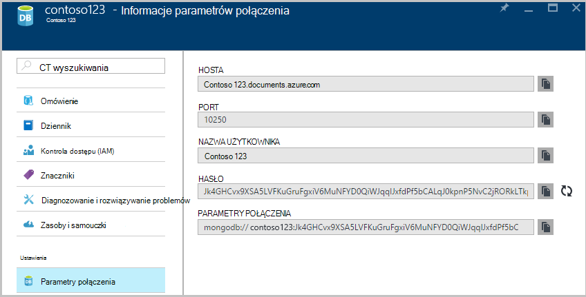

2. Kliknij przycisk **Połącz** , aby otworzyć Menedżera połączeń, a następnie kliknij polecenie **Nowe połączenie**

    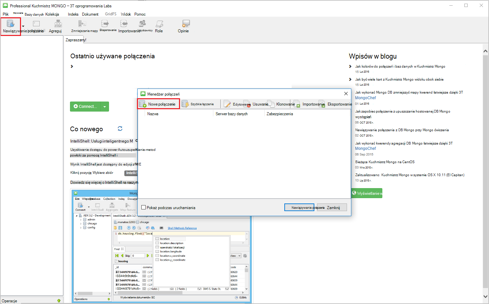
    
2. W oknie **Nowe połączenie** , na karcie **serwer** wprowadź hosta (FQDN) konta DocumentDB z obsługą protokołu MongoDB oraz portu.
    
    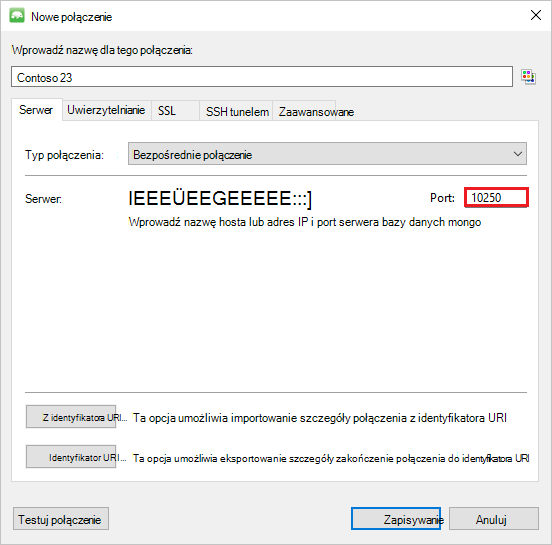

3. W oknie **Nowe połączenie** , na karcie **Uwierzytelnianie** wybierz tryb uwierzytelniania **standardu (MONGODB CR lub SCARM-Agent kondycji systemu-1)** i wprowadź nazwę użytkownika i hasło.  Zaakceptuj domyślne db uwierzytelniania (Administrator) lub podać własną wartość.

    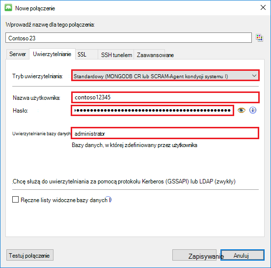

4. W oknie **Nowe połączenie** , na karcie **SSL** zaznacz pole wyboru **Użyj protokołu SSL protokół, aby połączyć** i przycisk radiowy **certyfikatów SSL z podpisem własnym Zaakceptuj** .

    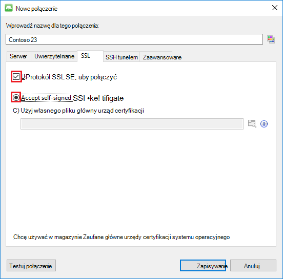

5. Kliknij przycisk **Testuj połączenie** , aby sprawdzić poprawność informacji o połączeniu, kliknij **przycisk OK** , aby powrócić do okna nowe połączenie, a następnie kliknij przycisk **Zapisz**.

    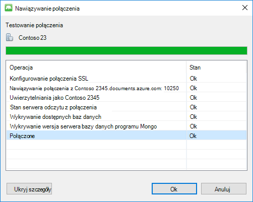

## Tworzenie bazy danych, zbioru i dokumentów przy użyciu MongoChef  

Aby utworzyć bazę danych, zbierania i dokumentów przy użyciu MongoChef, wykonaj następujące czynności.

1. W oknie **Connection Manager**wyróżnianie połączenie, a następnie kliknij przycisk **Połącz**.

    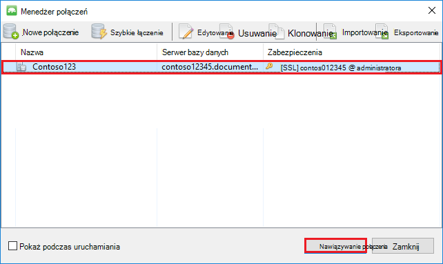

2. Kliknij prawym przyciskiem myszy hosta i wybierz pozycję **Dodaj bazy danych**.  Wprowadź nazwę bazy danych i kliknij **przycisk OK**.
    
    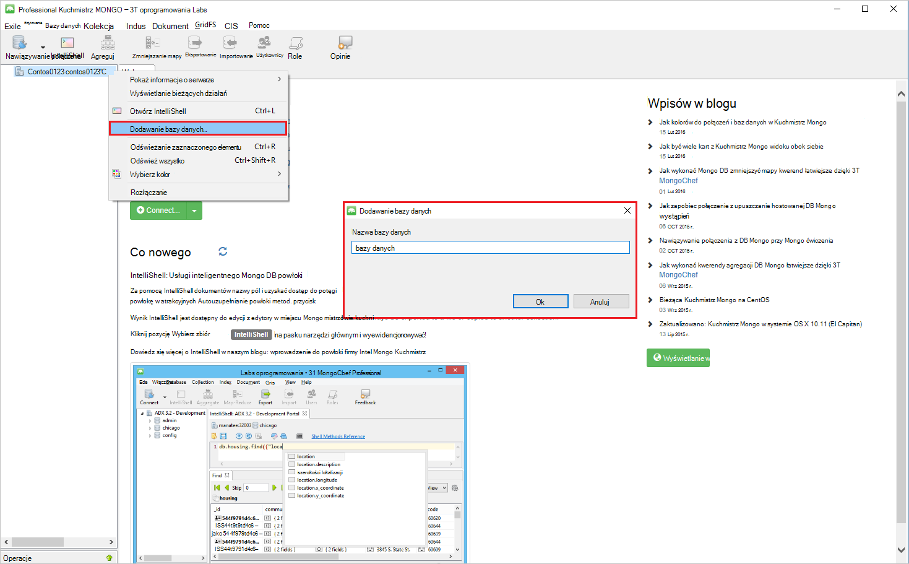

3. Kliknij prawym przyciskiem myszy bazę danych i wybierz pozycję **Dodaj kolekcji**.  Podaj nazwę kolekcji, a następnie kliknij przycisk **Utwórz**.

    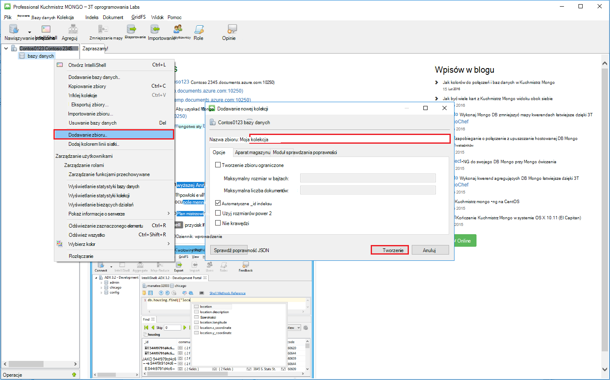

4. Kliknij element menu **kolekcji** , a następnie kliknij pozycję **Dodaj dokument**.

    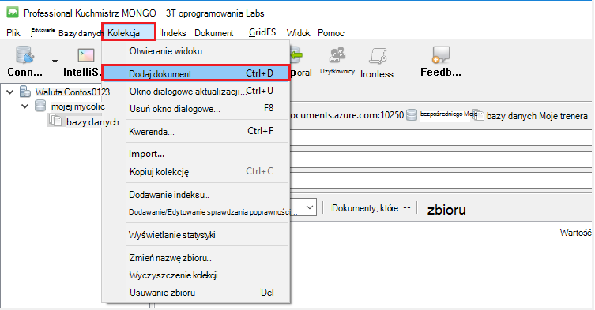

5. W oknie dialogowym Dodawanie dokumentu Wklej następujący ciąg, a następnie kliknij pozycję **Dodaj dokument**.

        {
        "_id": "AndersenFamily",
        "lastName": "Andersen",
        "parents": [
            { "firstName": "Thomas" },
            { "firstName": "Mary Kay"}
        ],
        "children": [
        {
            "firstName": "Henriette Thaulow", "gender": "female", "grade": 5,
            "pets": [{ "givenName": "Fluffy" }]
        }
        ],
        "address": { "state": "WA", "county": "King", "city": "seattle" },
        "isRegistered": true
        }

    
6. Dodawanie innego dokumentu, w tym razem o następującej treści.

        {
        "_id": "WakefieldFamily",
        "parents": [
            { "familyName": "Wakefield", "givenName": "Robin" },
            { "familyName": "Miller", "givenName": "Ben" }
        ],
        "children": [
            {
                "familyName": "Merriam", 
                "givenName": "Jesse", 
                "gender": "female", "grade": 1,
                "pets": [
                    { "givenName": "Goofy" },
                    { "givenName": "Shadow" }
                ]
            },
            { 
                "familyName": "Miller", 
                "givenName": "Lisa", 
                "gender": "female", 
                "grade": 8 }
        ],
        "address": { "state": "NY", "county": "Manhattan", "city": "NY" },
        "isRegistered": false
        }

7. Wykonywanie kwerendy próbki. Na przykład wyszukaj dla rodzin z nazwisko "Andersen" i zwrócić rodziców i pola stan.

    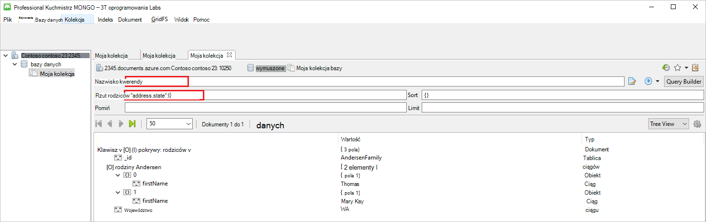
    

## Następne kroki

- Poznaj DocumentDB z obsługą protokołu MongoDB [próbki](documentdb-mongodb-samples.md).

 
