<properties
    pageTitle="Monitorowanie DocumentDB żądania i miejsca do magazynowania | Microsoft Azure"
    description="Dowiedz się, jak można monitorować konta DocumentDB wskaźniki, takie jak żądania i błędów serwera i zastosowania miar, takich jak zużycie miejsca do magazynowania."
    services="documentdb"
    documentationCenter=""
    authors="mimig1"
    manager="jhubbard"
    editor="cgronlun"/>

<tags
    ms.service="documentdb"
    ms.workload="data-services"
    ms.tgt_pltfrm="na"
    ms.devlang="na"
    ms.topic="article"
    ms.date="10/17/2016"
    ms.author="mimig"/>

# Monitorowanie żądania DocumentDB, zastosowania i przechowywania

Można monitorować konta Azure DocumentDB w [Azure portal](https://portal.azure.com/). Dla każdego konta DocumentDB oba wskaźniki wydajności, takich jak żądania i błędów serwera oraz zastosowania miar, takich jak zużycie miejsca do magazynowania, są dostępne.

Metryki można sprawdzić na karta konta lub na nowe karta metryki.

## Wskaźniki widoku na karta metryki

1. W nowym oknie Otwórz [Azure portal](https://portal.azure.com/), kliknij pozycję **Więcej usług**, kliknij pozycję **DocumentDB (NoSQL)**, a następnie kliknij nazwę konta DocumentDB, dla której chcesz wyświetlić wskaźniki.
2. W menu zasobów kliknij **metryki**.

Zostanie wyświetlona karta metryki i możesz wybrać kolekcji, aby zapoznać się z. Można przeglądać metryki dostępność, żądania przepustowość i miejsca do magazynowania i porównaj je z poziomu DocumentDB.

## Wskaźniki widoku na karta konta
1.  W nowym oknie Otwórz [Azure portal](https://portal.azure.com/), kliknij pozycję **Więcej usług**, kliknij pozycję **DocumentDB (NoSQL)**, a następnie kliknij nazwę konta DocumentDB, dla której chcesz wyświetlić wskaźniki.

2.  Obiektyw **monitorowania** są domyślnie wyświetlane Kafelki następujące czynności:
    *   Suma żądań dla bieżącego dnia.
    *   Magazyn używany.

    Jeśli tabela zawiera **dane nie są dostępne** i masz pewność, że jest danych w bazie danych, zobacz sekcję [Rozwiązywanie problemów](#troubleshooting) .

    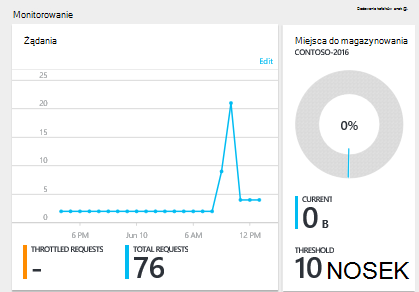

3.  Klikając **żądania** lub **miejsce do magazynowania** kafelków zostanie wyświetlona karta szczegółowe **metryki** .
4.  Karta **Metryka** zawiera szczegółowe informacje o metryki, który wybrano.  W górnej części karta jest wykres żądania co godzinę na wykresie, a pod nim jest tabelę, która zawiera wartości agregacji żądania ograniczonej i sumy.  Karta metryczne również wyświetlana na liście alertów, które zostały określone, filtrowany dla miar, które są wyświetlane na bieżącej karta metryczne (dzięki temu, jeśli masz wiele alertów, widoczne tylko w znaczenie przedstawione poniżej).   

    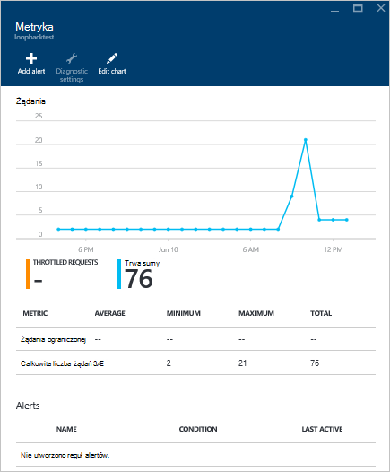

## Dostosowywanie widoków metryczne wydajności w portalu

1.  Aby dostosować metryk wyświetlania w szczególności na wykresie, kliknij wykres, aby go otworzyć w karta **Metryka** , a następnie kliknij **Edytuj wykres**.  
    

2.  Na karta **Edytowanie wykresu** istnieją opcje, aby zmodyfikować metryki wyświetlanych w wykresie, a także ich zakres czasu.  
    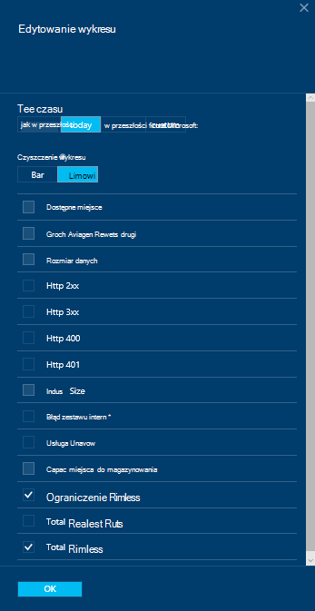

3.  Aby zmienić metryki wyświetlane w obszarze, zaznacz lub wyczyść dostępne wskaźniki, a następnie kliknij **przycisk OK** u dołu karta.  
4.  Aby zmienić zakres czasu, wybierz inny zakres (na przykład **niestandardowe**), a następnie kliknij przycisk **OK** u dołu karta.  

    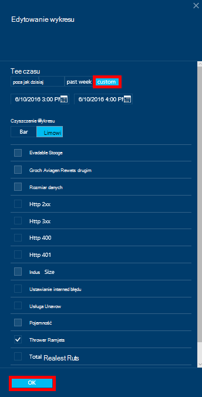

## Tworzenie wykresów obok siebie w portalu
Azure Portal umożliwia tworzenie wykresów metryczne obok siebie.  

1.  Najpierw kliknij prawym przyciskiem myszy wykres, który chcesz skopiować, a następnie wybierz opcję **Dostosuj**.

    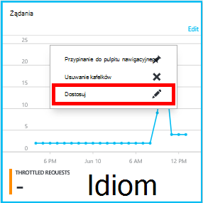

2.  Menu wybierz polecenie **klonowanie** do skopiowania części, a następnie kliknij przycisk **Gotowe, dostosowywanie**.

    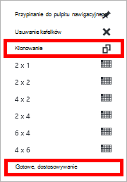  

Tej części mogą teraz traktować jako drugiej strony metryczne, dostosowywanie wyświetlane w obszarze zakres metryki i godziny.  Dzięki temu widać dwa różne wskaźniki wykresu przez siebie w tym samym czasie.  
    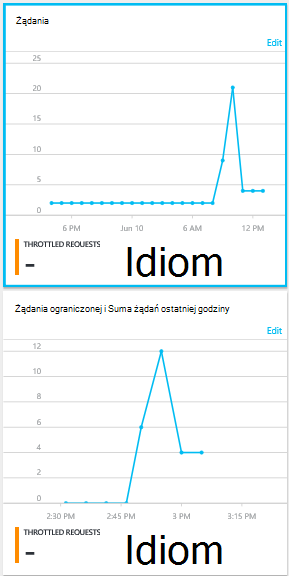  

## Ustawianie alertów w portalu
1.  W [portalu Azure](https://portal.azure.com/)kliknij pozycję **Więcej usług**, kliknij pozycję **DocumentDB (NoSQL)**, a następnie kliknij nazwę konta DocumentDB, dla której chcesz skonfigurować alerty Metryka wydajności.

2.  W menu zasobów kliknij pozycję **Reguły alertów** , aby otworzyć karta reguł alertów.  
    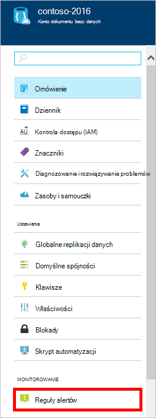

3.  W karta **reguły alertów** kliknij przycisk **Dodaj alert**.  
    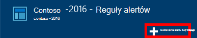

4.  W karta **dodać regułę alertu** określ:
    *   Nazwa reguły alertu, którą konfigurujesz.
    *   Opis nowej reguły alertu.
    *   Metryka dla reguły alertu.
    *   Warunek, próg i okres określające, kiedy uaktywnia alert. Na przykład błąd serwera zliczyć większa niż 5 w ciągu ostatnich 15 minut.
    *   Czy administrator usługi i coadministrators wysyłane są po alert.
    *   Kolejnych adresów e-mail dla alertów.  
    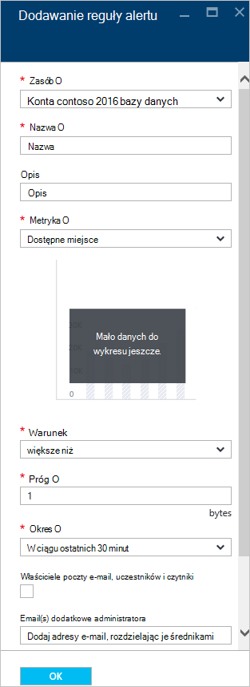

## Monitorowanie DocumentDB filmowych
Dostępne w portalu, takich jak żądania zastosowania i sumy konta miejsca do magazynowania, metryki poziomu konta nie są dostępne za pośrednictwem interfejsów API DocumentDB. Jednak można pobrać danych dotyczących użycia na poziomie zbioru przy użyciu interfejsów API DocumentDB. Aby pobrać dane poziomu zbioru, wykonaj następujące czynności:

- Aby użyć interfejsu API usługi REST, [Wykonywanie GET w zbiorze](https://msdn.microsoft.com/library/mt489073.aspx). Informacje o przydział i użycia dla zbioru jest zwracana w nagłówkach x-ms--przydziału zasobów i x-ms--użycie zasobu w odpowiedzi.
- Aby użyć .NET SDK, użyj metody [DocumentClient.ReadDocumentCollectionAsync](https://msdn.microsoft.com/library/microsoft.azure.documents.client.documentclient.readdocumentcollectionasync.aspx) , która zwraca zawiera liczbę zastosowania właściwości, takie jak **CollectionSizeUsage**, **DatabaseUsage**, **DocumentUsage**i [ResourceResponse](https://msdn.microsoft.com/library/dn799209.aspx) .

Aby uzyskać dostęp do dodatkowych metryki, użyj [Azure Monitor SDK](https://www.nuget.org/packages/Microsoft.Azure.Insights). Dostępne definicje metryczne mogą być pobierane, dzwoniąc:

    https://management.azure.com/subscriptions/{SubscriptionId}/resourceGroups/{ResourceGroup}/providers/Microsoft.DocumentDb/databaseAccounts/{DocumentDBAccountName}/metricDefinitions?api-version=2015-04-08

Kwerendy, aby pobrać pojedyncze metryki Użyj następującego formatu:

    https://management.azure.com/subscriptions/{SubecriptionId}/resourceGroups/{ResourceGroup}/providers/Microsoft.DocumentDb/databaseAccounts/{DocumentDBAccountName}/metrics?api-version=2015-04-08&$filter=%28name.value%20eq%20%27Total%20Requests%27%29%20and%20timeGrain%20eq%20duration%27PT5M%27%20and%20startTime%20eq%202016-06-03T03%3A26%3A00.0000000Z%20and%20endTime%20eq%202016-06-10T03%3A26%3A00.0000000Z

Aby uzyskać więcej informacji zobacz [Pobieranie metryki zasobów za pośrednictwem interfejsu API usługi REST monitorze Azure](https://blogs.msdn.microsoft.com/cloud_solution_architect/2016/02/23/retrieving-resource-metrics-via-the-azure-insights-api/). Należy zauważyć, że "Azure Inights" zmieniono "Azure Monitor".  Ten wpis w blogu odwołuje się do nazwy starsze.

## Rozwiązywanie problemów
Jeśli monitorowania kafelków wyświetlanie komunikatu **dane nie są dostępne** , a ostatnio wprowadzone żądania lub dodane do bazy danych, możesz edytować kafelków, aby odzwierciedlała bieżące użycie.

### Edytowanie kafelka, aby odświeżyć bieżące dane
1.  Aby dostosować metryki wyświetlanych w określonej części, kliknij wykres, aby otworzyć karta **metryczne** , a następnie kliknij **Edytuj wykresu**.  
    

2.  Na karta **Edytowanie wykresu** , w sekcji **Zakres czasu** kliknij **poza godzinę**, a następnie kliknij **przycisk OK**.  
    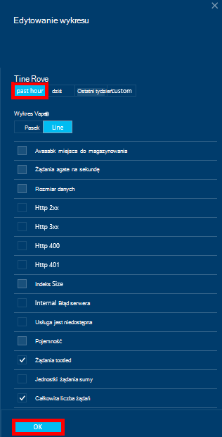

3.  Kafelka powinna teraz odświeżanie przedstawiający bieżącego danych i zastosowania.  
    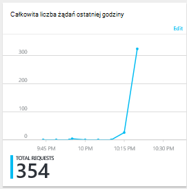

## Następne kroki
Aby dowiedzieć się więcej na temat możliwości DocumentDB, zobacz [Zarządzanie DocumentDB wydajność](documentdb-manage.md).
