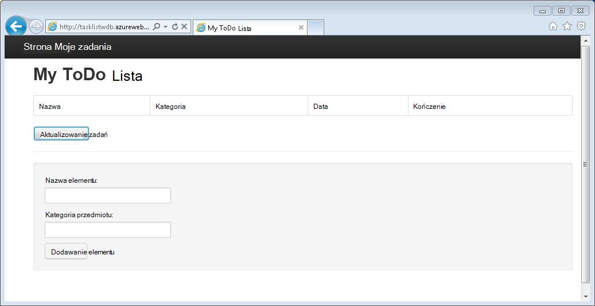
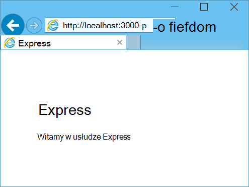
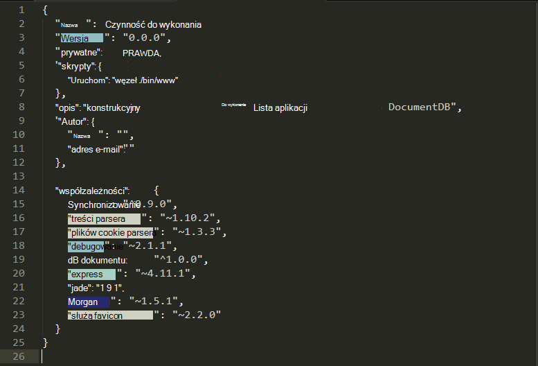
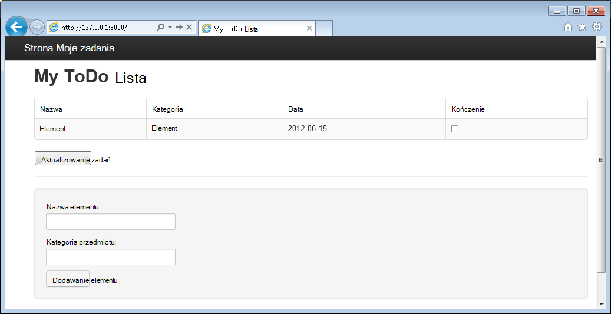

<properties 
    pageTitle="Dowiedz się Node.js - samouczek Node.js DocumentDB | Microsoft Azure" 
    description="Dowiedz się Node.js! Samouczek opisuje jak za pomocą programu Microsoft Azure DocumentDB do przechowywania i danych programu access z aplikacji sieci web Node.js Express hostowana w witrynach Azure." 
    keywords="Projektowanie aplikacji, baza danych — samouczek, Dowiedz się, node.js samouczek node.js, documentdb, azure, platformy Microsoft azure"
    services="documentdb" 
    documentationCenter="nodejs" 
    authors="syamkmsft" 
    manager="jhubbard" 
    editor="cgronlun"/>

<tags 
    ms.service="documentdb" 
    ms.workload="data-services" 
    ms.tgt_pltfrm="na" 
    ms.devlang="nodejs" 
    ms.topic="hero-article" 
    ms.date="08/25/2016" 
    ms.author="syamk"/>

# Tworzenie aplikacji sieci web Node.js przy użyciu DocumentDB

> [AZURE.SELECTOR]
- [.NET](documentdb-dotnet-application.md)
- [Node.js](documentdb-nodejs-application.md)
- [Java](documentdb-java-application.md)
- [Python](documentdb-python-application.md)

W tym samouczku Node.js pokazano, jak korzystać z usługi Azure DocumentDB do przechowywania i danych programu access z aplikacji Node.js Express hostowana w witrynach Azure.

Zaleca się wprowadzenie obserwując poniższym klipie wideo miejsce, w którym przedstawiono sposoby obsługi administracyjnej konta Azure DocumentDB bazy danych i przechowywanie dokumentów JSON w aplikacji Node.js. 

> [AZURE.VIDEO azure-demo-getting-started-with-azure-documentdb-on-nodejs-in-linux]

Następnie powróć do tego samouczka Node.js której poznasz odpowiedzi na następujące pytania:

- Jak pracować z DocumentDB za pomocą modułu npm documentdb?
- Jak wdrożyć aplikacji sieci web z witryny sieci Web Azure?

Wykonując tego samouczka bazy danych zostanie utworzona aplikacji prosty oparte na sieci web — Zarządzanie zadaniami, która umożliwia tworzenia, pobierania i wykonywania zadań. Zadania będą przechowywane jako dokumenty JSON w Azure DocumentDB.

Nie masz czasu na kończenie samouczka i chcesz tylko pobrać kompleksowym rozwiązaniem? Nie problemu, możesz uzyskać rozwiązanie całą próbkę z [GitHub][].

## Wymagania wstępne

> [AZURE.TIP] Ten samouczek Node.js przyjęto założenie, że niektóre wcześniejszego doświadczenia w korzystaniu Node.js i Azure witryn sieci Web.

Przed zgodnie z instrukcjami zawartymi w tym artykule, należy się upewnić, że masz następujące czynności:

- Konto Azure active. Jeśli nie masz konta, możesz utworzyć bezpłatne konto wersji próbnej na kilka minut. Aby uzyskać szczegółowe informacje zobacz [Azure bezpłatnej wersji próbnej](https://azure.microsoft.com/pricing/free-trial/).
- [Node.js][] wersji v0.10.29 lub nowszej.
- [Generator Express](http://www.expressjs.com/starter/generator.html) (można zainstalować to za pośrednictwem `npm install express-generator -g`)
- [Cyfra][].

## Krok 1: Utwórz konto DocumentDB bazy danych

Zacznijmy od Tworzenie konta DocumentDB. Jeśli masz już konto, możesz przejść do [Krok 2: Tworzenie nowej aplikacji Node.js](#_Toc395783178).

[AZURE.INCLUDE [documentdb-create-dbaccount](../../includes/documentdb-create-dbaccount.md)]

[AZURE.INCLUDE [documentdb-keys](../../includes/documentdb-keys.md)]

## Krok 2: Dowiedz się, jak utworzyć nową aplikację Node.js

Teraz Przyjrzyjmy Dowiedz się, jak utworzyć podstawowy projekt Node.js Witaj świecie użyciu struktury [Express](http://expressjs.com/) .

1. Otwórz okno usługi terminalowe Ulubione.

2. Express generator umożliwia generowanie nowej aplikacji o nazwie **zadania**.

        express todo

3. Otwieranie nowego katalogu **zadania** i zainstaluj zależności.

        cd todo
        npm install

4. Uruchamianie nowej aplikacji.

        npm start

5. Można wyświetlić nowej aplikacji przechodząc [http://localhost:3000](http://localhost:3000)przy użyciu przeglądarki.

    

## Krok 3: Instalowanie dodatkowych modułów

Plik **package.json** jest jednym z pliki utworzone w katalogu głównym projektu. Ten plik zawiera listę dodatkowych modułów, które są wymagane do aplikacji Node.js. Później podczas wdrażania tę aplikację do witryn sieci Web Azure ten plik jest używany do określenia, które moduły musi być zainstalowany Azure do obsługi aplikacji. Nadal trzeba zainstalować dwóch pakietów więcej dla tego samouczka.

1. W programie terminal należy zainstalować moduł **asynchroniczne** za pośrednictwem npm.

        npm install async --save

1. Zainstaluj moduł **documentdb** za pośrednictwem npm. To jest moduł miejsce, w którym wszystkie Magia DocumentDB się dzieje.

        npm install documentdb --save

3. Szybkie sprawdzenie pliku **package.json** aplikacji powinny być wyświetlane dodatkowe moduły. Ten plik informuje Azure, które pakiety, aby pobrać i zainstalować podczas uruchamiania aplikacji. W poniższym przykładzie powinna być.

    

    Informuje to węzeł (i nowszy Azure) czy aplikacja zależy od tych dodatkowych modułów.

## Krok 4: Przy użyciu usługi DocumentDB w aplikacji węzeł

Która przyjmuje należy początkowej konfiguracji i konfiguracja, Przejdźmy get w dół Dlaczego tutaj znajdziesz, a to pisanie kodu przy użyciu Azure DocumentDB.

### Tworzenie modelu

1. W katalogu projektu należy utworzyć nowy katalog o nazwie **modeli**.
2. W katalogu **modeli** Utwórz nowy plik o nazwie **taskDao.js**. Ten plik zawiera modelu dla zadania utworzone przez naszych aplikacji.
3. W tym samym katalogu **modeli** Utwórz nowy plik o nazwie **docdbUtils.js**. Ten plik zawiera kilka przydatnych, przeznaczone do wielokrotnego użytku, kod, który użyjemy w naszym aplikacji. 
4. Skopiuj poniższy kod w celu **docdbUtils.js**

        var DocumentDBClient = require('documentdb').DocumentClient;
            
        var DocDBUtils = {
            getOrCreateDatabase: function (client, databaseId, callback) {
                var querySpec = {
                    query: 'SELECT * FROM root r WHERE r.id= @id',
                    parameters: [{
                        name: '@id',
                        value: databaseId
                    }]
                };
        
                client.queryDatabases(querySpec).toArray(function (err, results) {
                    if (err) {
                        callback(err);
        
                    } else {
                        if (results.length === 0) {
                            var databaseSpec = {
                                id: databaseId
                            };
        
                            client.createDatabase(databaseSpec, function (err, created) {
                                callback(null, created);
                            });
        
                        } else {
                            callback(null, results[0]);
                        }
                    }
                });
            },
        
            getOrCreateCollection: function (client, databaseLink, collectionId, callback) {
                var querySpec = {
                    query: 'SELECT * FROM root r WHERE r.id=@id',
                    parameters: [{
                        name: '@id',
                        value: collectionId
                    }]
                };             
                
                client.queryCollections(databaseLink, querySpec).toArray(function (err, results) {
                    if (err) {
                        callback(err);
        
                    } else {        
                        if (results.length === 0) {
                            var collectionSpec = {
                                id: collectionId
                            };
                            
                            client.createCollection(databaseLink, collectionSpec, function (err, created) {
                                callback(null, created);
                            });
        
                        } else {
                            callback(null, results[0]);
                        }
                    }
                });
            }
        };
                
        module.exports = DocDBUtils;

    > [AZURE.TIP] createCollection przyjmuje parametr requestOptions opcjonalne, który może być używany, aby określić typ oferty dla zbioru. Jeśli dostarczono żadnej wartości requestOptions.offerType następnie kolekcji zostanie utworzony przy użyciu domyślnego typu oferty.
    >
    > Więcej informacji na temat typów oferty DocumentDB można znaleźć w [poziomy wydajności w DocumentDB](documentdb-performance-levels.md) 
        
3. Zapisz i zamknij plik **docdbUtils.js** .

4. Na początku pliku **taskDao.js** , Dodaj następujący kod, aby odwołać się **DocumentDBClient** i **docdbUtils.js** utworzonego powyżej:

        var DocumentDBClient = require('documentdb').DocumentClient;
        var docdbUtils = require('./docdbUtils');

4. Następnie dodasz kod, aby zdefiniować i eksportowania obiektu zadania. To jest odpowiedzialny za inicjowania naszych obiektu zadania i konfigurowania bazy danych i kolekcji dokumentów, które użyjemy.

        function TaskDao(documentDBClient, databaseId, collectionId) {
          this.client = documentDBClient;
          this.databaseId = databaseId;
          this.collectionId = collectionId;
        
          this.database = null;
          this.collection = null;
        }
        
        module.exports = TaskDao;

5. Następnie dodaj następujący kod, aby zdefiniować dodatkowe metody obiektu zadania umożliwiające interakcje z danymi przechowywanymi w DocumentDB.

        TaskDao.prototype = {
            init: function (callback) {
                var self = this;
        
                docdbUtils.getOrCreateDatabase(self.client, self.databaseId, function (err, db) {
                    if (err) {
                        callback(err);
                    } else {
                        self.database = db;
                        docdbUtils.getOrCreateCollection(self.client, self.database._self, self.collectionId, function (err, coll) {
                            if (err) {
                                callback(err);
        
                            } else {
                                self.collection = coll;
                            }
                        });
                    }
                });
            },
        
            find: function (querySpec, callback) {
                var self = this;
        
                self.client.queryDocuments(self.collection._self, querySpec).toArray(function (err, results) {
                    if (err) {
                        callback(err);
        
                    } else {
                        callback(null, results);
                    }
                });
            },
        
            addItem: function (item, callback) {
                var self = this;
        
                item.date = Date.now();
                item.completed = false;
        
                self.client.createDocument(self.collection._self, item, function (err, doc) {
                    if (err) {
                        callback(err);
        
                    } else {
                        callback(null, doc);
                    }
                });
            },
        
            updateItem: function (itemId, callback) {
                var self = this;
        
                self.getItem(itemId, function (err, doc) {
                    if (err) {
                        callback(err);
        
                    } else {
                        doc.completed = true;
        
                        self.client.replaceDocument(doc._self, doc, function (err, replaced) {
                            if (err) {
                                callback(err);
        
                            } else {
                                callback(null, replaced);
                            }
                        });
                    }
                });
            },
        
            getItem: function (itemId, callback) {
                var self = this;
        
                var querySpec = {
                    query: 'SELECT * FROM root r WHERE r.id = @id',
                    parameters: [{
                        name: '@id',
                        value: itemId
                    }]
                };
        
                self.client.queryDocuments(self.collection._self, querySpec).toArray(function (err, results) {
                    if (err) {
                        callback(err);
        
                    } else {
                        callback(null, results[0]);
                    }
                });
            }
        };

6. Zapisz i zamknij plik **taskDao.js** . 

### Tworzenie administratora

1. W katalogu **przekierowuje** projektu Utwórz nowy plik o nazwie **tasklist.js**. 
2. Dodaj następujący kod do **tasklist.js**. Służy do ładowania DocumentDBClient i asynchroniczna modułów, które są używane przez **tasklist.js**. To także zdefiniowane funkcji **TaskList** , który jest przekazywany wystąpienia obiektu **zadania** , możemy wcześniej zdefiniowanych przez:

        var DocumentDBClient = require('documentdb').DocumentClient;
        var async = require('async');
        
        function TaskList(taskDao) {
          this.taskDao = taskDao;
        }
        
        module.exports = TaskList;

3. Kontynuuj dodawanie do pliku **tasklist.js** , dodając metod **showTasks, addTask**i **completeTasks**:
        
        TaskList.prototype = {
            showTasks: function (req, res) {
                var self = this;
        
                var querySpec = {
                    query: 'SELECT * FROM root r WHERE r.completed=@completed',
                    parameters: [{
                        name: '@completed',
                        value: false
                    }]
                };
        
                self.taskDao.find(querySpec, function (err, items) {
                    if (err) {
                        throw (err);
                    }
        
                    res.render('index', {
                        title: 'My ToDo List ',
                        tasks: items
                    });
                });
            },
        
            addTask: function (req, res) {
                var self = this;
                var item = req.body;
        
                self.taskDao.addItem(item, function (err) {
                    if (err) {
                        throw (err);
                    }
        
                    res.redirect('/');
                });
            },
        
            completeTask: function (req, res) {
                var self = this;
                var completedTasks = Object.keys(req.body);
        
                async.forEach(completedTasks, function taskIterator(completedTask, callback) {
                    self.taskDao.updateItem(completedTask, function (err) {
                        if (err) {
                            callback(err);
                        } else {
                            callback(null);
                        }
                    });
                }, function goHome(err) {
                    if (err) {
                        throw err;
                    } else {
                        res.redirect('/');
                    }
                });
            }
        };

4. Zapisz i zamknij plik **tasklist.js** .
 
### Dodawanie config.js

1. W katalogu projektu Utwórz nowy plik o nazwie **config.js**.
2. Dodaj następujący tekst na **config.js**. Definiuje ustawienia i wartości potrzebnych dla naszych aplikacji.

        var config = {}
        
        config.host = process.env.HOST || "[the URI value from the DocumentDB Keys blade on http://portal.azure.com]";
        config.authKey = process.env.AUTH_KEY || "[the PRIMARY KEY value from the DocumentDB Keys blade on http://portal.azure.com]";
        config.databaseId = "ToDoList";
        config.collectionId = "Items";
        
        module.exports = config;

3. W pliku **config.js** aktualizacja wartości hosta i AUTH_KEY przy użyciu wartości zapisanych w karta klawiszy konta DocumentDB w [Portalu Microsoft Azure](https://portal.azure.com):

4. Zapisz i zamknij plik **config.js** .
 
### Modyfikowanie app.js

1. Otwórz plik **app.js** w katalogu projektu. Ten plik został utworzony wcześniej, podczas tworzenia aplikacji sieci web Express.
2. Dodaj następujący kod do górnej części **app.js**
    
        var DocumentDBClient = require('documentdb').DocumentClient;
        var config = require('./config');
        var TaskList = require('./routes/tasklist');
        var TaskDao = require('./models/taskDao');

3. Ten kod określa plik konfiguracji, który ma być używany oraz przechodzi do odczytu wartości z tego pliku w, aby niektóre zmienne użyjemy szybko.
4. Zastąp następujące dwa wiersze w pliku **app.js** :

        app.use('/', routes);
        app.use('/users', users); 

      z wstawkę następujące czynności:

        var docDbClient = new DocumentDBClient(config.host, {
            masterKey: config.authKey
        });
        var taskDao = new TaskDao(docDbClient, config.databaseId, config.collectionId);
        var taskList = new TaskList(taskDao);
        taskDao.init();
        
        app.get('/', taskList.showTasks.bind(taskList));
        app.post('/addtask', taskList.addTask.bind(taskList));
        app.post('/completetask', taskList.completeTask.bind(taskList));
        app.set('view engine', 'jade');

6. Te wiersze Definiowanie nowego wystąpienia naszych obiektu **TaskDao** , przy użyciu nowego połączenia DocumentDB (za pomocą wartości odczyt **config.js**), zainicjować obiektu zadania i następnie powiązać akcje formularza z metod w naszym kontrolerze **TaskList** . 

7. Na koniec Zapisz i zamknij plik **app.js** , możemy niemal gotowe.
 
## Krok 5: Tworzenie interfejsu użytkownika

Teraz Przyjrzyjmy Włączanie naszych uwagę do tworzenia interfejsu użytkownika, aby użytkownik faktycznie można wchodzić w interakcje z naszych aplikacji. Aplikacja Express utworzonego używa **Jade** jako aparatu widoku. Więcej informacji na temat Jade można znaleźć w [http://jade-lang.com/](http://jade-lang.com/).

1. Plik **layout.jade** w katalogu **Widoki** służy jako szablon globalny do innych plików **.jade** . W tym kroku należy zmodyfikować go, aby za pomocą [Serwisu Twitter początkowego](https://github.com/twbs/bootstrap), która jest zestaw narzędzi, który ułatwia projektowanie i witryny sieci Web wyglądzie. 
2. Otwórz plik **layout.jade** w folderze **Widoki** i zastąpić zawartość z następujących czynności:
    
        doctype html
        html
          head
            title= title
            link(rel='stylesheet', href='//ajax.aspnetcdn.com/ajax/bootstrap/3.3.2/css/bootstrap.min.css')
            link(rel='stylesheet', href='/stylesheets/style.css')
          body
            nav.navbar.navbar-inverse.navbar-fixed-top
              div.navbar-header
                a.navbar-brand(href='#') My Tasks
            block content
            script(src='//ajax.aspnetcdn.com/ajax/jQuery/jquery-1.11.2.min.js')
            script(src='//ajax.aspnetcdn.com/ajax/bootstrap/3.3.2/bootstrap.min.js')

    To skutecznie informuje aparat **Jade** do renderowania kod HTML dla naszych aplikacji i tworzy **Blok** o nazwie **zawartość** , w którym możemy umieścić układ dla naszych zawartości strony.
    Zapisz i zamknij plik **layout.jade** .

4. Teraz Otwórz plik **index.jade** , widok, który będzie używany przez naszych aplikacji i zastąpić zawartości pliku z następujących czynności:

        extends layout
        
        block content
          h1 #{title}
          br
        
          form(action="/completetask", method="post")
            table.table.table-striped.table-bordered
              tr
                td Name
                td Category
                td Date
                td Complete
              if (typeof tasks === "undefined")
                tr
                  td
              else
                each task in tasks
                  tr
                    td #{task.name}
                    td #{task.category}
                    - var date  = new Date(task.date);
                    - var day   = date.getDate();
                    - var month = date.getMonth() + 1;
                    - var year  = date.getFullYear();
                    td #{month + "/" + day + "/" + year}
                    td
                      input(type="checkbox", name="#{task.id}", value="#{!task.completed}", checked=task.completed)
            button.btn(type="submit") Update tasks
          hr
          form.well(action="/addtask", method="post")
            label Item Name:
            input(name="name", type="textbox")
            label Item Category:
            input(name="category", type="textbox")
            br
            button.btn(type="submit") Add item

    Rozszerza układu i przewiduje symbol zastępczy **zawartości** , który firma Microsoft pokazano w pliku **layout.jade** wcześniej zawartości.
    
    W tym układzie możemy utworzyć dwa formularzy HTML. 
    Pierwszy formularz zawiera tabelę dla naszych danych i przycisk, który umożliwia aktualizowanie elementów przez publikowanie wpisów metody **/completetask** naszych kontrolera.
    Drugi formularz zawiera dwa pola wprowadzania i przycisk, który umożliwia utworzenie nowego elementu przez publikowanie wpisów metody **/addtask** naszych kontrolera.
    
    Powinny być wszystkie potrzebnej dla naszych aplikacji do pracy.

5. Otwórz plik **style.css** w katalogu **public\stylesheets** i zastąpić następujące czynności:

        body {
          padding: 50px;
          font: 14px "Lucida Grande", Helvetica, Arial, sans-serif;
        }
        a {
          color: #00B7FF;
        }
        .well label {
          display: block;
        }
        .well input {
          margin-bottom: 5px;
        }
        .btn {
          margin-top: 5px;
          border: outset 1px #C8C8C8;
        }

    Zapisz i zamknij plik **style.css** .

## Krok 6: Uruchomienie aplikacji lokalnie

1. Aby przetestować aplikacji na komputerze lokalnym, uruchom `npm start` w terminal do uruchamiania aplikacji i uruchamianie przeglądarki ze stroną, który wygląda jak na poniższej ilustracji:

    

2. Wprowadzanie informacji za pomocą dostępnych polach dla elementu, nazwa elementu i kategorii, a następnie kliknij **Dodaj element**.

3. Aby wyświetlić nowo utworzony element na liście zadania należy zaktualizować strony.

    

4. Aby wykonać zadania, po prostu zaznacz pole wyboru w kolumnie wykonano, a następnie kliknij **Aktualizowanie zadań**.

## Krok 7: Wdrażanie projektu opracowywania aplikacji do witryn sieci Web Azure

1. Jeśli jeszcze tego nie zrobiono, należy włączyć repozytorium cyfra Azure witryny sieci Web. Instrukcje można znaleźć w jak to zrobić w tym temacie [Lokalnego wdrożenia cyfra usłudze Azure w aplikacji](../app-service-web/app-service-deploy-local-git.md) .

2. Dodawanie witryny sieci Web Azure jako cyfra zdalnym.

        git remote add azure https://username@your-azure-website.scm.azurewebsites.net:443/your-azure-website.git

3. Wdrażanie przez naciśnięcie do komputera zdalnego.

        git push azure master

4. W ciągu kilku sekund cyfra Zakończ publikowanie aplikacji sieci web i przeglądarki, w której są wyświetlane pod ręką pracy z platformy Azure!

## Następne kroki

Gratulacje! Możesz po prostu utworzone pierwszego Node.js Express aplikacji sieci Web przy użyciu Azure DocumentDB i opublikowany go do Azure witryn sieci Web.

Kod źródłowy aplikacji pełne odwołanie można pobrać z [GitHub][].

Aby uzyskać więcej informacji zobacz [Centrum deweloperów Node.js](https://azure.microsoft.com/develop/nodejs/).

[Node.js]: http://nodejs.org/
[Cyfra]: http://git-scm.com/
[Github]: https://github.com/Azure-Samples/documentdb-node-todo-app
 
