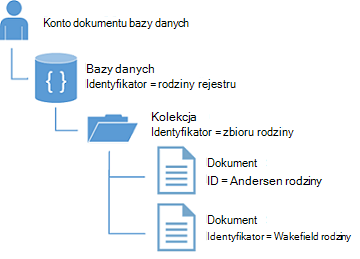
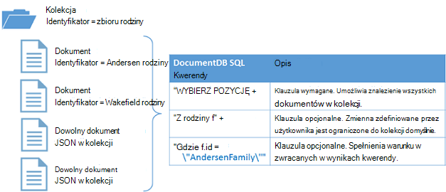

<properties
  pageTitle="Samouczek NoSQL Node.js dla DocumentDB | Microsoft Azure"
  description="Samouczek NoSQL Node.js, który tworzy aplikację bazy danych i konsoli węzeł przy użyciu zestawu SDK Node.js DocumentDB. DocumentDB jest NoSQL bazy danych w celu JSON."
    keywords="Samouczek node.js, węzeł bazy danych"
  services="documentdb"
  documentationCenter="node.js"
  authors="AndrewHoh"
  manager="jhubbard"
  editor="monicar"/>

<tags
  ms.service="documentdb"
  ms.workload="data-services"
  ms.tgt_pltfrm="na"
  ms.devlang="node"
  ms.topic="hero-article"
  ms.date="08/11/2016"
  ms.author="anhoh"/>

# <a name="nosql-nodejs-tutorial-documentdb-nodejs-console-application"></a>Samouczek NoSQL Node.js: aplikacji konsoli DocumentDB Node.js  

> [AZURE.SELECTOR]
- [.NET](documentdb-get-started.md)
- [Node.js](documentdb-nodejs-get-started.md)

Zapraszamy do samouczka Node.js dla zestawu SDK Node.js DocumentDB Azure! Po wykonaniu tego samouczka, konieczne będzie tworzonej aplikacji konsoli i kwerend DocumentDB zasobów, w tym węzeł bazy danych.

Omówiono:

- Tworzenie i nawiązywanie połączenia z kontem DocumentDB
- Konfigurowanie aplikacji
- Tworzenie bazy danych węzła
- Tworzenie kolekcji
- Tworzenie dokumentów JSON
- Kwerenda kolekcji
- Zastępowanie dokumentu
- Usuwanie dokumentu
- Usuwanie bazy danych węzła

Nie masz czasu? Nie martw się! Kompleksowym rozwiązaniem jest dostępna na [GitHub](https://github.com/Azure-Samples/documentdb-node-getting-started). Szybkie instrukcje, zobacz [Uzyskiwanie kompleksowym rozwiązaniem](#GetSolution) .

Po wykonaniu samouczek Node.js, użyj przycisków głosowania u góry i u dołu tej strony Aby wysłać nam swoją opinię. Jeśli chcesz, abyśmy skontaktować się z Tobą bezpośrednio, zachęcamy do Podaj swój adres e-mail w komentarzach.

Teraz Zaczynamy!

## <a name="prerequisites-for-the-nodejs-tutorial"></a>Wymagania wstępne dotyczące samouczek Node.js

Upewnij się, że masz następujące czynności:

- Konto Azure active. Jeśli nie masz, można Załóż [Bezpłatną wersję próbną Azure](https://azure.microsoft.com/pricing/free-trial/).
- [Node.js](https://nodejs.org/) wersji v0.10.29 lub nowszej.

## <a name="step-1-create-a-documentdb-account"></a>Krok 1: Tworzenie konta DocumentDB

Tworzenie konta DocumentDB. Jeśli masz już konto, którego chcesz użyć, można przejść dalej do [instalacji aplikacji Node.js](#SetupNode).

[AZURE.INCLUDE [documentdb-create-dbaccount](../../includes/documentdb-create-dbaccount.md)]

## <a id="SetupNode"></a>Krok 2: Skonfiguruj aplikacji Node.js

1. Otwórz okno usługi terminalowe Ulubione.
2. Zlokalizuj folder lub miejsce, w którym chcesz zapisać aplikacji Node.js katalogu.
3. Utwórz dwa pustych plików JavaScript z następujących poleceń:
  - System Windows:
      * ```fsutil file createnew app.js 0```
        * ```fsutil file createnew config.js 0```
  - Linux-OS X:
      * ```touch app.js```
        * ```touch config.js```
4. Zainstaluj moduł documentdb za pośrednictwem npm. Użyj następującego polecenia:
    * ```npm install documentdb --save```

Doskonałe! Teraz, gdy zakończeniu konfigurowania Zacznijmy napisanie kodu.

## <a id="Config"></a>Krok 3: Ustawianie konfiguracji Twojej aplikacji

Otwórz ```config.js``` w edytorze tekstu Ulubione.

Następnie, Kopiuj i wklej poniższe wstawkę kodu i ustawianie właściwości ```config.endpoint``` i ```config.primaryKey``` DocumentDB uri punktu końcowego i klucza podstawowego. Obu tych konfiguracji można znaleźć w [Azure Portal](https://portal.azure.com).

![Samouczek node.js — zrzut ekranu przedstawiający Portal Azure, przedstawiający konto DocumentDB z Centrum aktywne wyróżniony, przycisk klawiszy na karta konta DocumentDB wyróżniony i wartości identyfikatora URI, klucz podstawowy i POMOCNICZY klucz wyróżnione w karta klawiszy - węzeł bazy danych][keys]

    // ADD THIS PART TO YOUR CODE
    var config = {}

    config.endpoint = "~your DocumentDB endpoint uri here~";
    config.primaryKey = "~your primary key here~";

Kopiowanie i wklejanie ```database id```, ```collection id```, i ```JSON documents``` do swojego ```config``` obiekt poniżej miejsce, w którym możesz ustawić swojej ```config.endpoint``` i ```config.authKey``` właściwości. Jeśli masz już dane, które mają być przechowywane w bazie danych, można użyć [Narzędzia do migracji danych](documentdb-import-data.md) firmy DocumentDB zamiast dodawać definicji dokumentu.

    config.endpoint = "~your DocumentDB endpoint uri here~";
    config.primaryKey = "~your primary key here~";

    // ADD THIS PART TO YOUR CODE
    config.database = {
        "id": "FamilyDB"
    };

    config.collection = {
        "id": "FamilyColl"
    };

    config.documents = {
        "Andersen": {
            "id": "Anderson.1",
            "lastName": "Andersen",
            "parents": [{
                "firstName": "Thomas"
            }, {
                    "firstName": "Mary Kay"
                }],
            "children": [{
                "firstName": "Henriette Thaulow",
                "gender": "female",
                "grade": 5,
                "pets": [{
                    "givenName": "Fluffy"
                }]
            }],
            "address": {
                "state": "WA",
                "county": "King",
                "city": "Seattle"
            }
        },
        "Wakefield": {
            "id": "Wakefield.7",
            "parents": [{
                "familyName": "Wakefield",
                "firstName": "Robin"
            }, {
                    "familyName": "Miller",
                    "firstName": "Ben"
                }],
            "children": [{
                "familyName": "Merriam",
                "firstName": "Jesse",
                "gender": "female",
                "grade": 8,
                "pets": [{
                    "givenName": "Goofy"
                }, {
                        "givenName": "Shadow"
                    }]
            }, {
                    "familyName": "Miller",
                    "firstName": "Lisa",
                    "gender": "female",
                    "grade": 1
                }],
            "address": {
                "state": "NY",
                "county": "Manhattan",
                "city": "NY"
            },
            "isRegistered": false
        }
    };


Bazy danych, zbierania i definicji dokumentów będą działać jako usługi DocumentDB ```database id```, ```collection id```i danych dokumentów.

Na koniec eksportowanie do ```config``` obiektu, dlatego możesz odwoływać się do niej w ```app.js``` pliku.

            },
            "isRegistered": false
        }
    };

    // ADD THIS PART TO YOUR CODE
    module.exports = config;

##<a id="Connect"></a>Krok 4: Nawiązywanie połączenia z kontem DocumentDB

Otwieranie programu Opróżnij ```app.js``` plik w edytorze tekstów. Kopiowanie i wklejanie kodu poniżej, aby zaimportować ```documentdb``` moduł i nowo utworzonego ```config``` modułu.

    // ADD THIS PART TO YOUR CODE
    "use strict";

    var documentClient = require("documentdb").DocumentClient;
    var config = require("./config");
    var url = require('url');

Kopiowanie i wklejanie kodu w celu użycia zapisanego wcześniej ```config.endpoint``` i ```config.primaryKey``` do tworzenia nowych DocumentClient.

    var config = require("./config");
    var url = require('url');

    // ADD THIS PART TO YOUR CODE
    var client = new documentClient(config.endpoint, { "masterKey": config.primaryKey });

Teraz, gdy masz kod, aby zainicjować klienta documentdb, Przyjrzyjmy pracy z zasobami DocumentDB.

## <a name="step-5-create-a-node-database"></a>Krok 5: Tworzenie węzeł bazy danych
Skopiuj i Wklej kod poniżej, aby ustawić stan HTTP dla nie można odnaleźć adresu url bazy danych i adres url zbioru. Te adresy URL są, jak klienta DocumentDB spowoduje znalezienie zbieranie i prawy bazy danych.

    var client = new documentClient(config.endpoint, { "masterKey": config.primaryKey });

    // ADD THIS PART TO YOUR CODE
    var HttpStatusCodes = { NOTFOUND: 404 };
    var databaseUrl = `dbs/${config.database.id}`;
    var collectionUrl = `${databaseUrl}/colls/${config.collection.id}`;

Bazą [bazy danych](documentdb-resources.md#databases) można utworzyć za pomocą funkcji [createDatabase](https://azure.github.io/azure-documentdb-node/DocumentClient.html) klasy **DocumentClient** . Baza danych jest kontenerze logiczne przechowywania dokumentów podzielona między zbiorami.

Kopiowanie i wklejanie funkcji **getDatabase** do tworzenia nowej bazy danych w pliku app.js ```id``` określonych w ```config``` obiektu. Funkcja sprawdzi, jeśli baza danych o tej samej ```FamilyRegistry``` identyfikator jeszcze nie istnieje. Jeśli istnieje, będzie zwróconych zamiast tworzenia nowej bazy danych.

    var collectionUrl = `${databaseUrl}/colls/${config.collection.id}`;

    // ADD THIS PART TO YOUR CODE
    function getDatabase() {
        console.log(`Getting database:\n${config.database.id}\n`);

        return new Promise((resolve, reject) => {
            client.readDatabase(databaseUrl, (err, result) => {
                if (err) {
                    if (err.code == HttpStatusCodes.NOTFOUND) {
                        client.createDatabase(config.database, (err, created) => {
                            if (err) reject(err)
                            else resolve(created);
                        });
                    } else {
                        reject(err);
                    }
                } else {
                    resolve(result);
                }
            });
        });
    }

Skopiuj i Wklej kod, pod którym możesz ustawić funkcję **getDatabase** , aby dodać, Pomocnik funkcja **zakończyć** drukowania wiadomości wyjścia i wywołanie funkcji **getDatabase** .

                } else {
                    resolve(result);
                }
            });
        });
    }

    // ADD THIS PART TO YOUR CODE
    function exit(message) {
        console.log(message);
        console.log('Press any key to exit');
        process.stdin.setRawMode(true);
        process.stdin.resume();
        process.stdin.on('data', process.exit.bind(process, 0));
    }

    getDatabase()
    .then(() => { exit(`Completed successfully`); })
    .catch((error) => { exit(`Completed with error ${JSON.stringify(error)}`) });

W swojej terminal, Znajdź usługi ```app.js``` plik, i uruchom polecenie:```node app.js```

Gratulacje! Pomyślnie utworzono DocumentDB bazy danych.

##<a id="CreateColl"></a>Krok 6: Tworzenie zbioru  

> [AZURE.WARNING] **CreateDocumentCollectionAsync** spowoduje utworzenie nowego zbioru ma wpływ ceny. Aby uzyskać więcej informacji odwiedź stronę naszych [ceny strony](https://azure.microsoft.com/pricing/details/documentdb/).

[Kolekcja](documentdb-resources.md#collections) mogą być tworzone przy użyciu funkcji [createCollection](https://azure.github.io/azure-documentdb-node/DocumentClient.html) klasy **DocumentClient** . Kolekcja jest kontenerem JSON dokumentów i skojarzone logiki aplikacji języka JavaScript.

Kopiowanie i wklejanie funkcji **getCollection** poniżej funkcji **getDatabase** do tworzenia nowej kolekcji z ```id``` określonych w ```config``` obiektu. Ponownie, firma Microsoft będzie Sprawdź zbiór o tej samej ```FamilyCollection``` identyfikator już nie istnieje. Jeśli istnieje, będzie zwróconych kolekcji zamiast tworzenia nowej witryny.

                } else {
                    resolve(result);
                }
            });
        });
    }

    // ADD THIS PART TO YOUR CODE
    function getCollection() {
        console.log(`Getting collection:\n${config.collection.id}\n`);

        return new Promise((resolve, reject) => {
            client.readCollection(collectionUrl, (err, result) => {
                if (err) {
                    if (err.code == HttpStatusCodes.NOTFOUND) {
                        client.createCollection(databaseUrl, config.collection, { offerThroughput: 400 }, (err, created) => {
                            if (err) reject(err)
                            else resolve(created);
                        });
                    } else {
                        reject(err);
                    }
                } else {
                    resolve(result);
                }
            });
        });
    }

Skopiuj i Wklej kod poniżej połączenie **getDatabase** do wykonania funkcji **getCollection** .

    getDatabase()

    // ADD THIS PART TO YOUR CODE
    .then(() => getCollection())
    // ENDS HERE

    .then(() => { exit(`Completed successfully`); })
    .catch((error) => { exit(`Completed with error ${JSON.stringify(error)}`) });

W swojej terminal, Znajdź usługi ```app.js``` plik, i uruchom polecenie:```node app.js```

Gratulacje! Kolekcja DocumentDB został utworzony pomyślnie.

##<a id="CreateDoc"></a>Krok 7: Tworzenie dokumentu
[Dokument](documentdb-resources.md#documents) można utworzyć przy użyciu funkcji [createDocument](https://azure.github.io/azure-documentdb-node/DocumentClient.html) klasy **DocumentClient** . Dokumenty są to zdefiniowane przez użytkownika (dowolnego) zawartości JSON. Teraz można wstawić dokument do DocumentDB.

Kopiowanie i wklejanie funkcji **getFamilyDocument** poniżej funkcji **getCollection** dotyczące tworzenia dokumentów zawierających dane JSON zapisane w ```config``` obiektu. Ponownie firma Microsoft będzie Sprawdź, upewnij się, że dokument z tym samym identyfikatorem już istnieje.

                } else {
                    resolve(result);
                }
            });
        });
    }

    // ADD THIS PART TO YOUR CODE
    function getFamilyDocument(document) {
        let documentUrl = `${collectionUrl}/docs/${document.id}`;
        console.log(`Getting document:\n${document.id}\n`);

        return new Promise((resolve, reject) => {
            client.readDocument(documentUrl, { partitionKey: document.district }, (err, result) => {
                if (err) {
                    if (err.code == HttpStatusCodes.NOTFOUND) {
                        client.createDocument(collectionUrl, document, (err, created) => {
                            if (err) reject(err)
                            else resolve(created);
                        });
                    } else {
                        reject(err);
                    }
                } else {
                    resolve(result);
                }
            });
        });
    };

Skopiuj i Wklej kod poniżej połączenie **getCollection** do wykonania funkcji **getFamilyDocument** .

    getDatabase()
    .then(() => getCollection())

    // ADD THIS PART TO YOUR CODE
    .then(() => getFamilyDocument(config.documents.Andersen))
    .then(() => getFamilyDocument(config.documents.Wakefield))
    // ENDS HERE

    .then(() => { exit(`Completed successfully`); })
    .catch((error) => { exit(`Completed with error ${JSON.stringify(error)}`) });

W swojej terminal, Znajdź usługi ```app.js``` plik, i uruchom polecenie:```node app.js```

Gratulacje! Dokumenty DocumentDB został utworzony pomyślnie.



##<a id="Query"></a>Krok 8: Zasoby DocumentDB kwerendy

DocumentDB obsługuje [zaawansowanych kwerend](documentdb-sql-query.md) JSON dokumentów przechowywanych w każdego zbioru. Następujący kod zawiera kwerendy, które można uruchomić przed dokumentów w zbiorze.

Kopiowanie i wklejanie funkcji **queryCollection** poniżej funkcji **getFamilyDocument** . DocumentDB obsługuje przypominających SQL kwerendy, jak pokazano poniżej. Aby uzyskać więcej informacji dotyczących tworzenia złożonych kwerend zapoznaj się z [Playground kwerendy](https://www.documentdb.com/sql/demo) i [dokumentacji zapytania](documentdb-sql-query.md).

                } else {
                    resolve(result);
                }
            });
        });
    }

    // ADD THIS PART TO YOUR CODE
    function queryCollection() {
        console.log(`Querying collection through index:\n${config.collection.id}`);

        return new Promise((resolve, reject) => {
            client.queryDocuments(
                collectionUrl,
                'SELECT VALUE r.children FROM root r WHERE r.lastName = "Andersen"'
            ).toArray((err, results) => {
                if (err) reject(err)
                else {
                    for (var queryResult of results) {
                        let resultString = JSON.stringify(queryResult);
                        console.log(`\tQuery returned ${resultString}`);
                    }
                    console.log();
                    resolve(results);
                }
            });
        });
    };


Na poniższym diagramie przedstawiono, jak składnię kwerendy DocumentDB SQL nosi nazwę przed kolekcji zostanie utworzona.



Słowo kluczowe [FROM](documentdb-sql-query.md#from-clause) jest opcjonalne w kwerendzie, ponieważ kwerendy DocumentDB już są ograniczone do jednego zbioru. Dlatego "Z rodziny f" może się miejscami z "Z głównego r" lub do innej zmiennej nazwy możesz wybrać. DocumentDB będzie ustalić tej rodziny, katalog główny lub wybrana nazwa zmiennej, odwołanie bieżącej kolekcji domyślnie.

Skopiuj i Wklej kod poniżej połączenie **getFamilyDocument** do wykonania funkcji **queryCollection** .

    .then(() => getFamilyDocument(config.documents.Andersen))
    .then(() => getFamilyDocument(config.documents.Wakefield))

    // ADD THIS PART TO YOUR CODE
    .then(() => queryCollection())
    // ENDS HERE

    .then(() => { exit(`Completed successfully`); })
    .catch((error) => { exit(`Completed with error ${JSON.stringify(error)}`) });

W swojej terminal, Znajdź usługi ```app.js``` plik, i uruchom polecenie:```node app.js```

Gratulacje! Pomyślnie kwerenda DocumentDB dokumentów.

##<a id="ReplaceDocument"></a>Krok 9: Zastąp dokument
DocumentDB dokumentów zastąpienie JSON.

Kopiowanie i wklejanie funkcji **replaceDocument** poniżej funkcji **queryCollection** .

                    }
                    console.log();
                    resolve(result);
                }
            });
        });
    }

    // ADD THIS PART TO YOUR CODE
    function replaceFamilyDocument(document) {
        let documentUrl = `${collectionUrl}/docs/${document.id}`;
        console.log(`Replacing document:\n${document.id}\n`);
        document.children[0].grade = 6;

        return new Promise((resolve, reject) => {
            client.replaceDocument(documentUrl, document, (err, result) => {
                if (err) reject(err);
                else {
                    resolve(result);
                }
            });
        });
    };

Skopiuj i Wklej kod poniżej połączenie **queryCollection** do wykonania funkcji **replaceDocument** . Ponadto dodać kod połączenie **queryCollection** ponownie, aby sprawdzić, czy dokument pomyślnie uległa zmianie.

    .then(() => getFamilyDocument(config.documents.Andersen))
    .then(() => getFamilyDocument(config.documents.Wakefield))
    .then(() => queryCollection())

    // ADD THIS PART TO YOUR CODE
    .then(() => replaceFamilyDocument(config.documents.Andersen))
    .then(() => queryCollection())
    // ENDS HERE

    .then(() => { exit(`Completed successfully`); })
    .catch((error) => { exit(`Completed with error ${JSON.stringify(error)}`) });

W swojej terminal, Znajdź usługi ```app.js``` plik, i uruchom polecenie:```node app.js```

Gratulacje! Zostały pomyślnie zastąpiony dokumentem DocumentDB.

##<a id="DeleteDocument"></a>Krok 10: Usuwanie dokumentu
DocumentDB dokumentów usuwania JSON.

Kopiowanie i wklejanie funkcji **deleteDocument** poniżej funkcji **replaceDocument** .

                else {
                    resolve(result);
                }
            });
        });
    };

    // ADD THIS PART TO YOUR CODE
    function deleteFamilyDocument(document) {
        let documentUrl = `${collectionUrl}/docs/${document.id}`;
        console.log(`Deleting document:\n${document.id}\n`);

        return new Promise((resolve, reject) => {
            client.deleteDocument(documentUrl, (err, result) => {
                if (err) reject(err);
                else {
                    resolve(result);
                }
            });
        });
    };

Skopiuj i Wklej kod poniżej połączenie do drugiego **queryCollection** do wykonania funkcji **deleteDocument** .

    .then(() => queryCollection())
    .then(() => replaceFamilyDocument(config.documents.Andersen))
    .then(() => queryCollection())

    // ADD THIS PART TO YOUR CODE
    .then(() => deleteFamilyDocument(config.documents.Andersen))
    // ENDS HERE

    .then(() => { exit(`Completed successfully`); })
    .catch((error) => { exit(`Completed with error ${JSON.stringify(error)}`) });

W swojej terminal, Znajdź usługi ```app.js``` plik, i uruchom polecenie:```node app.js```

Gratulacje! Dokument DocumentDB zostały usunięte.

##<a id="DeleteDatabase"></a>Krok 11: Usuwanie węzeł bazy danych

Usunięcie bazy danych utworzonej spowoduje usunięcie bazy danych i wszystkie zasoby dzieci (zbiory, dokumenty itp.).

Skopiuj i wklej następujący fragment kodu (funkcja **oczyszczania**) usuwania bazy danych i wszystkie zasoby elementów podrzędnych.

                else {
                    resolve(result);
                }
            });
        });
    };

    // ADD THIS PART TO YOUR CODE
    function cleanup() {
        console.log(`Cleaning up by deleting database ${config.database.id}`);

        return new Promise((resolve, reject) => {
            client.deleteDatabase(databaseUrl, (err) => {
                if (err) reject(err)
                else resolve(null);
            });
        });
    }

Skopiuj i Wklej kod poniżej połączenie **deleteDocument** do wykonania funkcji **oczyszczania** .

    .then(() => deleteFamilyDocument(config.documents.Andersen))

    // ADD THIS PART TO YOUR CODE
    .then(() => cleanup())
    // ENDS HERE

    .then(() => { exit(`Completed successfully`); })
    .catch((error) => { exit(`Completed with error ${JSON.stringify(error)}`) });

##<a id="Run"></a>Krok 12: Uruchom wszystko w jednym aplikacji Node.js!

Sekwencji do nawiązywania połączeń z funkcji powinna wyglądać następująco:

    getDatabase()
    .then(() => getCollection())
    .then(() => getFamilyDocument(config.documents.Andersen))
    .then(() => getFamilyDocument(config.documents.Wakefield))
    .then(() => queryCollection())
    .then(() => replaceFamilyDocument(config.documents.Andersen))
    .then(() => queryCollection())
    .then(() => deleteFamilyDocument(config.documents.Andersen))
    .then(() => cleanup())
    .then(() => { exit(`Completed successfully`); })
    .catch((error) => { exit(`Completed with error ${JSON.stringify(error)}`) });

W swojej terminal, Znajdź usługi ```app.js``` plik, i uruchom polecenie:```node app.js```

Powinien zostać wyświetlony wynik pobieranie aplikacji wprowadzenie. Wyniki powinny być zgodne przykładowy tekst poniżej.

    Getting database:
    FamilyDB

    Getting collection:
    FamilyColl

    Getting document:
    Anderson.1

    Getting document:
    Wakefield.7

    Querying collection through index:
    FamilyColl
        Query returned [{"firstName":"Henriette Thaulow","gender":"female","grade":5,"pets":[{"givenName":"Fluffy"}]}]

    Replacing document:
    Anderson.1

    Querying collection through index:
    FamilyColl
        Query returned [{"firstName":"Henriette Thaulow","gender":"female","grade":6,"pets":[{"givenName":"Fluffy"}]}]

    Deleting document:
    Anderson.1

    Cleaning up by deleting database FamilyDB
    Completed successfully
    Press any key to exit

Gratulacje! Utworzoną koniec samouczka Node.js i mieć pierwszej aplikacji konsoli DocumentDB!

## <a id="GetSolution"></a>Uzyskiwanie kompleksowym rozwiązaniem samouczka Node.js
Aby utworzyć rozwiązanie GetStarted, które zawiera wszystkie próbki w tym artykule, będą potrzebne następujące elementy:

-   [Konto DocumentDB][documentdb-create-account].
-   Rozwiązanie [GetStarted](https://github.com/Azure-Samples/documentdb-node-getting-started) dostępne na GitHub.

Zainstaluj moduł **documentdb** za pośrednictwem npm. Użyj następującego polecenia:
* ```npm install documentdb --save```

Dalej w ```config.js``` plików, zaktualizuj wartości config.endpoint i config.authKey w sposób opisany w [Krok 3: Ustawianie konfiguracji Twojej aplikacji](#Config).

## <a name="next-steps"></a>Następne kroki

-   Potrzebujesz bardziej złożone próbki Node.js? Zobacz [Tworzenie aplikacji sieci web Node.js przy użyciu DocumentDB](documentdb-nodejs-application.md).
-  Dowiedz się, jak [monitor konto DocumentDB](documentdb-monitor-accounts.md).
-  Wykonywane są kwerendy naszych zestawu danych przykładowych w [Playground kwerendy](https://www.documentdb.com/sql/demo).
-  Więcej informacji o modelu programowania w sekcji rozwoju [DocumentDB dokumentacji strony](https://azure.microsoft.com/documentation/services/documentdb/).

[documentdb-create-account]: documentdb-create-account.md
[documentdb-manage]: documentdb-manage.md

[keys]: media/documentdb-nodejs-get-started/node-js-tutorial-keys.png
