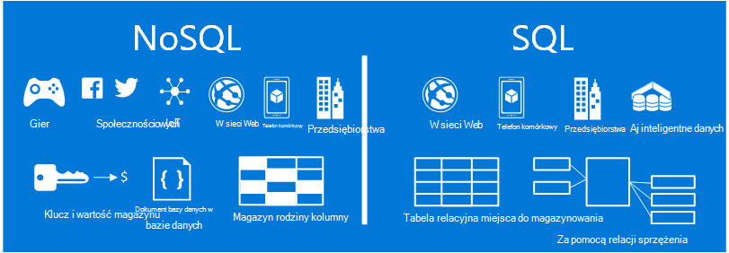
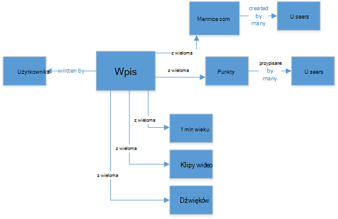
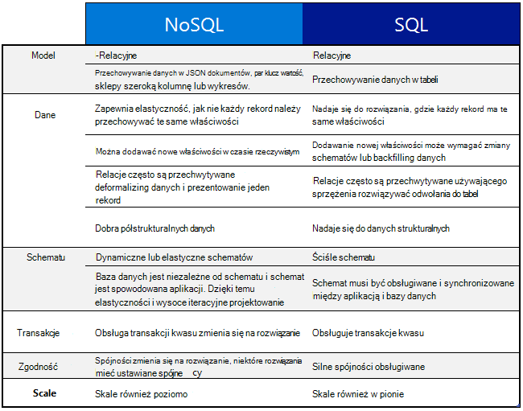
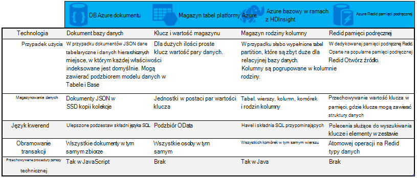

<properties
    pageTitle="Kiedy należy używać w porównaniu z NoSQL SQL | Microsoft Azure"
    description="Porównanie korzyści wynikające z używania NoSQL-relacyjnych rozwiązań i rozwiązań SQL. Dowiedz się, czy ogólnej usługi Microsoft Azure NoSQL lub SQL Server najlepsze rozwiązania."
    keywords="sql w porównaniu z nosql, kiedy należy używać NoSQL, nosql w porównaniu z sql"
    services="documentdb"
    documentationCenter=""
    authors="mimig1"
    manager="jhubbard"
    editor=""/>

<tags
    ms.service="documentdb"
    ms.workload="data-services"
    ms.tgt_pltfrm="na"
    ms.devlang="dotnet"
    ms.topic="article" 
    ms.date="06/24/2016"
    ms.author="mimig"/>

# W porównaniu z NoSQL SQL

Program SQL Server i relacyjnych baz danych (RDBMS) zostały przejdź do bazy danych dla ponad dwudziestu lat. Jednak lepszą potrzeby procesu wyższe wielkości i odmian danych szybko zmienił rodzaj danych potrzeb miejsca do magazynowania dla deweloperów aplikacji. W celu umożliwienia w tym scenariuszu, NoSQL baz danych, które umożliwiają przechowywanie danych niestrukturalne i niejednorodnymi w skali uzyskały w popularności. 

NoSQL jest kategorią odmienne z bazy danych programu SQL baz danych. Aby odwołać się do systemy zarządzania danymi, które są podejście do zarządzania danymi, zawierającego "SQL nie tylko" lub "Nie SQL" często używany NoSQL. Istnieje wiele technologii w kategorii NoSQL, włącznie z baz danych dokumentu, sklepy wartości klucza, kolumnie rodziny są przechowywane i wykres bazy danych, które są popularne z gier społecznościowe, i IoT aplikacji.

Celem tego artykułu jest pomocne informacje o różnicach między NoSQL i SQL i umożliwiają wprowadzenie do oferty NoSQL i SQL firmy Microsoft.  

## Kiedy należy używać NoSQL?

Załóżmy Załóżmy, że tworzysz nową witrynę zaangażowania społecznościowych. Użytkownicy mogą tworzyć wpisy i dodać do nich obrazy, klipy wideo i muzyki. Inni użytkownicy mogą komentarzy do ogłoszeń i nadaj punktów ("Lubię to"), aby ocenić wpisy. Strona początkowa uzyskuje kanał wpisów, które użytkownicy mogą udostępniać i interakcję. 

W jaki sposób przechowywania danych? Jeśli znasz program SQL, aby uruchomić rysunek podobną do następującej:

Dlatego wygrywasz, ale teraz wziąć pod uwagę strukturę pojedynczy wpis i jego wyświetlania. Jeśli chcesz wyświetlić wpis i skojarzone obrazy, audio, wideo, komentarzy, punktów i informacje o użytkowniku na witrynę sieci Web lub aplikacji, trzeba wykonać kwerendy z ośmioma sprzężenia tabeli tylko do pobrania zawartości. Teraz załóżmy strumienia wpisów dynamicznie ładowanie i są wyświetlane na ekranie i można łatwo przewidywania, że będzie wymagać tysięcy kwerend i wielu sprzężeń do wykonania określonego zadania.

Teraz można użyć relacyjnych rozwiązanie, takich jak program SQL Server w celu przechowywania danych —, ale ma inną opcję, opcja NoSQL, która upraszcza podejście. Przekształcanie wpis w dokumencie JSON, takie jak następujące i przechowywaniu go w DocumentDB, usługą Azure NoSQL dokumentu bazy danych można zwiększyć wydajność i pobrać całego wpisu z jednej kwerendy i nie sprzężenia. Jest prostsze, bardziej utrudnione, a wynik więcej performant.

    {
        "id":"ew12-res2-234e-544f",
        "title":"post title",
        "date":"2016-01-01",
        "body":"this is an awesome post stored on NoSQL",
        "createdBy":User,
        "images":["http://myfirstimage.png","http://mysecondimage.png"],
        "videos":[
            {"url":"http://myfirstvideo.mp4", "title":"The first video"},
            {"url":"http://mysecondvideo.mp4", "title":"The second video"}
        ],
        "audios":[
            {"url":"http://myfirstaudio.mp3", "title":"The first audio"},
            {"url":"http://mysecondaudio.mp3", "title":"The second audio"}
        ]
    }

Ponadto te dane można podzielona przez identyfikator wpisu oferujący dane do skalowania w sposób naturalny i skorzystać z właściwości skali NoSQL. Również systemy NoSQL umożliwiają programistom Poluzuj spójności i oferują wysoce dostępnych aplikacji.  Na koniec tego rozwiązania nie wymaga deweloperów zdefiniować, zarządzanie i obsługa schematu w warstwie danych, co pozwala na szybkie iteracji.

Następnie można tworzyć na tym rozwiązaniu korzystanie z innych usług Azure:

- [Azure wyszukiwania](https://azure.microsoft.com/services/search/) może służyć za pośrednictwem aplikacji sieci web, aby umożliwić użytkownikom wyszukiwanie wpisów.
- [Usługi aplikacji Azure](https://azure.microsoft.com/services/app-service/) może służyć do obsługi aplikacji i procesy w tle.
- [Magazyn obiektów Blob platformy Azure](https://azure.microsoft.com/services/storage/) może służyć do przechowywania profilów użytkowników pełny tym obrazów.
- [Bazy danych SQL Azure](https://azure.microsoft.com/services/sql-database/) może służyć do przechowywania dużych ilości danych, takie jak informacje o logowaniu, a dane dotyczące analizy użycia.
- [Azure maszynowego uczenia](https://azure.microsoft.com/services/machine-learning/) może służyć do utworzenia wiedzy i analizy, który przekazywanie opinii do procesu i zapewniają zawartość jest właściwa do odpowiednich użytkowników.

Ta witryna społecznościowych zaangażowania jest tylko jeden jeden scenariusz, w którym NoSQL bazy danych jest model danych po prawej stronie zadania. Jeśli Interesujesz się więcej o tym scenariuszu i modelu danych dla DocumentDB w aplikacjach społecznościowych odczytu, zobacz, [przechodząc społecznościowych z DocumentDB](documentdb-social-media-apps.md). 

## Porównanie SQL w porównaniu z NoSQL

W poniższej tabeli porównano główne różnice między NoSQL i SQL. 

Jeśli bazy danych NoSQL najlepiej pasuje do wymagań, przejdź do następnej sekcji, aby dowiedzieć się więcej o usługach NoSQL udostępniła Azure. W przeciwnym razie jeśli bazy danych SQL, najlepiej odpowiada potrzebom użytkownika, przejdź do [Co to są ofertą Microsoft SQL?](#what-are-the-microsoft-sql-offerings)

## Co to są ofertą Microsoft Azure NoSQL?

Azure zawiera cztery w pełni zarządzane usługi NoSQL: 

- [Azure DocumentDB](https://azure.microsoft.com/services/documentdb/)
- [Magazyn tabel platformy Azure](https://azure.microsoft.com/services/storage/)
- [Azure HBase jako część HDInsight](https://azure.microsoft.com/services/hdinsight/)
- [Azure Redis pamięci podręcznej](https://azure.microsoft.com/services/cache/)

Następujące Porównanie mapy się klucza wyróżniającymi dla każdej usługi. Które z nich najlepiej pasujący pasuje do wymagań aplikacji? 

Jeśli co najmniej jeden z tych usług może nie spełnia wymagań aplikacji, Dowiedz się więcej o następujące zasoby: 

- [Ścieżka nauki DocumentDB](https://azure.microsoft.com/documentation/learning-paths/documentdb/) i [przypadki użycia DocumentDB](documentdb-use-cases.md)
- [Rozpoczynanie pracy z magazynem tabel platformy Azure](../storage/storage-dotnet-how-to-use-tables.md)
- [Co to jest HBase w HDInsight](../hdinsight/hdinsight-hbase-overview.md)
- [Redis pamięci podręcznej ścieżka nauki](https://azure.microsoft.com/documentation/learning-paths/redis-cache/)

Następnie przejdź do sekcji [Następne kroki](#next-steps) bezpłatnej wersji próbnej informacji.

## Co to są ofertą Microsoft SQL?

Firma Microsoft udostępnia pięć ofertą SQL: 

- [Baza danych SQL Azure](https://azure.microsoft.com/services/sql-database/)
- [Program SQL Server w przypadku Azure maszyn wirtualnych](https://azure.microsoft.com/services/virtual-machines/sql-server/)
- [Program SQL Server](https://www.microsoft.com/server-cloud/products/sql-server-2016/)
- [Program SQL Azure Data Warehouse (wersja Preview)](https://azure.microsoft.com/services/sql-data-warehouse/)
- [System analiz platformy (urządzenia lokalne)](https://www.microsoft.com/en-us/server-cloud/products/analytics-platform-system/)

Jeśli interesują Cię programu SQL Server na maszyn wirtualnych lub bazy danych SQL, następnie przeczytaj [Wybierz chmury opcja programu SQL Server: bazy danych SQL Azure (PaaS) lub SQL Server na Azure maszyny wirtualne (IaaS)](../sql-database/sql-database-paas-vs-sql-server-iaas.md) Aby dowiedzieć się więcej o różnicach między nimi.

Jeśli SQL dźwięki, takie jak najlepszym rozwiązaniem, przejdź do [Programu SQL Server](https://www.microsoft.com/server-cloud/products/) , aby dowiedzieć się więcej na temat programu Microsoft SQL produktów i usług mają do oferowania.

Następnie przejdź do [następnych kroków](#next-steps) bezpłatnie wersji próbnej i oceny łącza.

## Następne kroki

Aby dowiedzieć się więcej na temat oferowanych produktów SQL i NoSQL przez testujesz bezpłatnie Zapraszamy. 

- Dla wszystkich usług Azure można Załóż [bezpłatne miesięczny okres próbny](https://azure.microsoft.com/pricing/free-trial/) i odbierać 200 zł wydatki na usług Azure.
    - [Azure DocumentDB](https://azure.microsoft.com/services/documentdb/)
    - [Azure HBase jako część HDInsight](https://azure.microsoft.com/services/hdinsight/)
    - [Azure Redis pamięci podręcznej](https://azure.microsoft.com/services/cache/)
    - [Program SQL Azure Data Warehouse (wersja Preview)](https://azure.microsoft.com/services/sql-data-warehouse/)
    - [Baza danych SQL Azure](https://azure.microsoft.com/services/sql-database/)
    - [Magazyn tabel platformy Azure](https://azure.microsoft.com/services/storage/)

- Możesz aż [wersji próbnej programu SQL Server 2016 na komputerze wirtualnych](https://azure.microsoft.com/marketplace/partners/microsoft/sqlserver2016ctp33evaluationwindowsserver2012r2/) lub pobrać [wersji próbnej programu SQL Server](https://www.microsoft.com/en-us/evalcenter/evaluate-sql-server-2016).
    - [Program SQL Server](https://www.microsoft.com/server-cloud/products/sql-server-2016/)
    - [Program SQL Server w przypadku Azure maszyn wirtualnych](https://azure.microsoft.com/services/virtual-machines/sql-server/)

