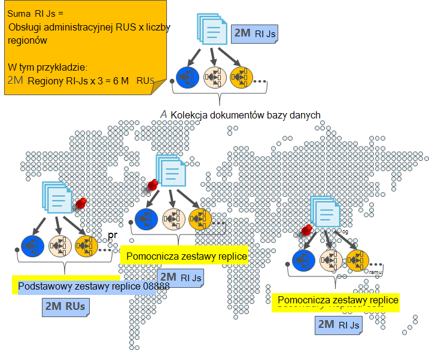
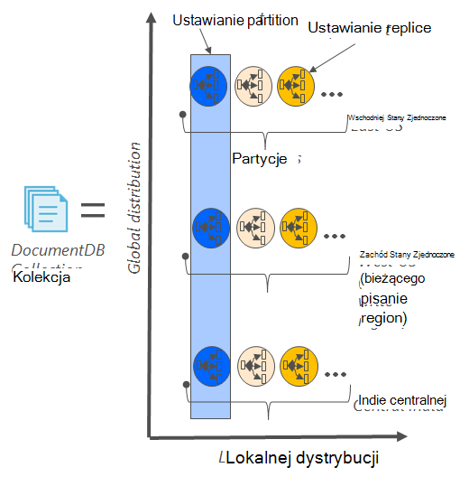
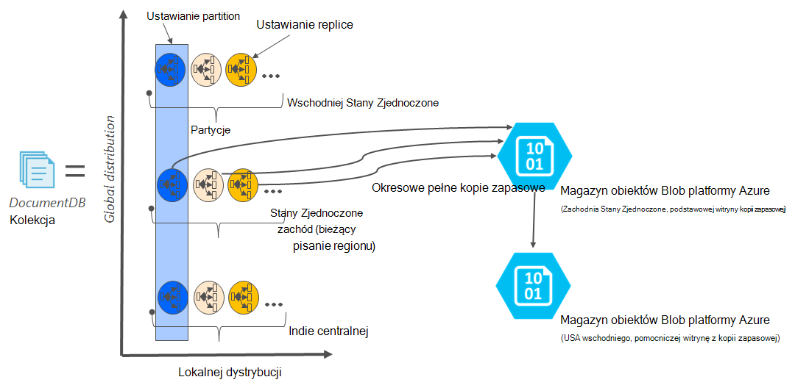

<properties
    pageTitle="Online kopia zapasowa i przywracanie z DocumentDB | Microsoft Azure"
    description="Dowiedz się, jak wykonać automatyczne wykonywanie kopii zapasowych i przywracanie NoSQL baz danych z Azure DocumentDB."
    keywords="wykonywanie kopii zapasowych i przywracanie, kopii zapasowej online"
    services="documentdb"
    documentationCenter=""
    authors="RahulPrasad16"
    manager="jhubbard"
    editor="monicar"/>

<tags
    ms.service="documentdb"
    ms.workload="data-services"
    ms.tgt_pltfrm="na"
    ms.devlang="multiple"
    ms.topic="article"
    ms.date="09/23/2016"
    ms.author="raprasa"/>

# Automatyczne online kopia zapasowa i przywracanie z DocumentDB 

Azure DocumentDB automatycznie wykonuje kopie zapasowe wszystkich danych w regularnych odstępach czasu. Automatyczne kopie zapasowe są pobierane bez wpływu na wydajność i dostępność NoSQL operacji bazy danych. Kopie zapasowe są przechowywane osobno w innej usłudze miejsca do magazynowania i kopie zapasowe globalnie są replikowane dla ochrony przed regionalne awarii. Automatycznych kopii zapasowych są przeznaczone dla scenariuszy po przypadkowego usunięcia kolekcji DocumentDB i później wymagają odzyskiwanie danych lub rozwiązania odzyskiwania po awarii.  

W tym artykule zaczyna się od szybkie recap nadmiarowości danych i dostępność w DocumentDB, a następnie w tym artykule omówiono kopie zapasowe. 

## Wysokiej dostępności z DocumentDB - recap

DocumentDB ma być [rozpowszechniane na globalnie](documentdb-distribute-data-globally.md) — umożliwia skalowanie przepustowość u wielu regionów Azure wraz z zasad zmiennych awaryjnego i przezroczysty wielu interfejsów API. Jako systemu baz danych, oferuje [99,99% dostępności zwiększany](https://azure.microsoft.com/support/legal/sla/documentdb/v1_0/)wszystkie zapisy w DocumentDB są trwale przekazywane do lokalnych dyskach przez kworum replik w centrum danych lokalnych przed potwierdzeniem do klienta. Zauważ, że wysoki poziom dostępności DocumentDB zależy od magazynu lokalnego i nie zależy od dowolnego technologie magazynowania zewnętrznych. Ponadto jeśli Twoje konto bazy danych jest skojarzone z więcej niż jednego regionu Azure, w innych regionach także są replikowane do zapisu. Przeskalować przepustowość i dostępu do danych w niskiej opóźnienia, można mieć wiele czytania regionów skojarzonego z kontem bazy danych, jak chcesz. W każdym regionie odczytu danych (zreplikowanej) jest trwale zachowywane w zestawie replice.  

Jak pokazano na poniższym diagramie, pojedynczą kolekcję DocumentDB jest [podzielona w poziomie](documentdb-partition-data.md). "Partycją" jest oznaczany okrąg na poniższym diagramie i każdego partition udostępniono wysoce przy użyciu zestawu replice. Jest to lokalnej dystrybucji w jednym regionie Azure (oznaczona osi X). Ponadto każdy partition (wraz z ich odpowiednich zestawem replice) jest następnie globalnie rozkładany wielu regionów skojarzonego z kontem bazy danych (na przykład w tym ilustracji trzy regionów — wschodniego Stanów Zjednoczonych, USA Zachodnia i Indie centralnej). Zestaw"partition" jest globalnie rozłożone jednostki obejmujące wielu kopii danych w każdym z regionów (oznaczona oś Y). Priority (priorytet) można przypisać do regionów skojarzonego z kontem bazy danych i DocumentDB będzie przezroczysty przełączanie awaryjne do następny region w przypadku awarii. Można też ręcznie symulować przełączanie awaryjne do przetestować dostępność zakończenia do końca aplikacji.  

Poniższa ilustracja przedstawia wysoki stopień nadmiarowości z DocumentDB.

## Pełny, automatyczne online wykonywania kopii zapasowych

Ojej usunięte mojego zbioru lub bazy danych! Z DocumentDB nie tylko dane, ale kopie zapasowe danych są również bardzo nadmiarowe i mechanizm do regionalnych awarii. Te kopie zapasowe automatycznego są obecnie pobierane około na cztery godziny. 

Kopie zapasowe są pobierane bez wpływu na wydajność i dostępność operacji bazy danych. Bez przez inne usługi RUs ustanawianie lub wpływających na wydajność i bez wpływu na dostępność bazy danych NoSQL DocumentDB przejście do tworzenia kopii zapasowej w tle. 

W przeciwieństwie do danych, która znajduje się wewnątrz DocumentDB automatycznych kopii zapasowych są przechowywane w usłudze Azure magazyn obiektów Blob. W celu zagwarantowania Niskie opóźnienie i efektywne przekazywania, migawkę kopii zapasowej jest przekazane do wystąpienia magazyn obiektów Blob platformy Azure w tym samym regionie jako bieżący obszar zapisu konta DocumentDB bazy danych. Dla ochrony przed regionalne awarii każdego migawkę danych kopii zapasowych w magazynie obiektów Blob platformy Azure są ponownie replikowane za pośrednictwem zbędne geo przestrzeni dyskowej (GRS) do innego regionu. Na poniższym diagramie przedstawiono całą kolekcję DocumentDB (z wszystkie trzy partycje podstawowe zachód w USA, w tym przykładzie) kopii zapasowej zdalnego konta magazyn obiektów Blob platformy Azure zachód w USA, a następnie GRS replikować do wschodniego USA. 

Poniższa ilustracja przedstawia okresowych pełne kopie zapasowe wszystkich jednostek DocumentDB w magazynie Azure GRS.

## Okres przechowywania dla danego migawki

Zgodnie z powyższym opisem, firma Microsoft okresowo migawek danych i na naszych zgodności z przepisami, możemy zachować najnowszą migawki w górę do 90 dni przed jego ostatecznie otrzymuje usunięte. Usunięcie kolekcji lub konta DocumentDB przechowuje ostatniej kopii zapasowej przez 90 dni.

## Przywracanie bazy danych z kopii zapasowej online

W przypadku, gdy usuniesz przypadkowo danych, możesz [plik bilet pomocy technicznej](https://portal.azure.com/?#blade/Microsoft_Azure_Support/HelpAndSupportBlade) lub [Zadzwoń do pomocy technicznej Azure](https://azure.microsoft.com/support/options/) przywrócenie danych usuniętych z ostatniej automatycznej kopii zapasowej. Migawkę określonej kopii zapasowej do przywrócenia DocumentDB wymaga dane były co najmniej dostępne z nami na czas trwania cyklu wykonywania kopii zapasowej dla tej migawki.

## Następne kroki

Aby odtworzyć NoSQL bazy danych w wielu centrach danych, zobacz [rozpowszechnianie danych globalnie z DocumentDB](documentdb-distribute-data-globally.md). 

Do kontaktu plik pomocy technicznej Azure, [plik biletów z portalu Azure](https://portal.azure.com/?#blade/Microsoft_Azure_Support/HelpAndSupportBlade).