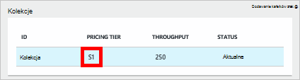
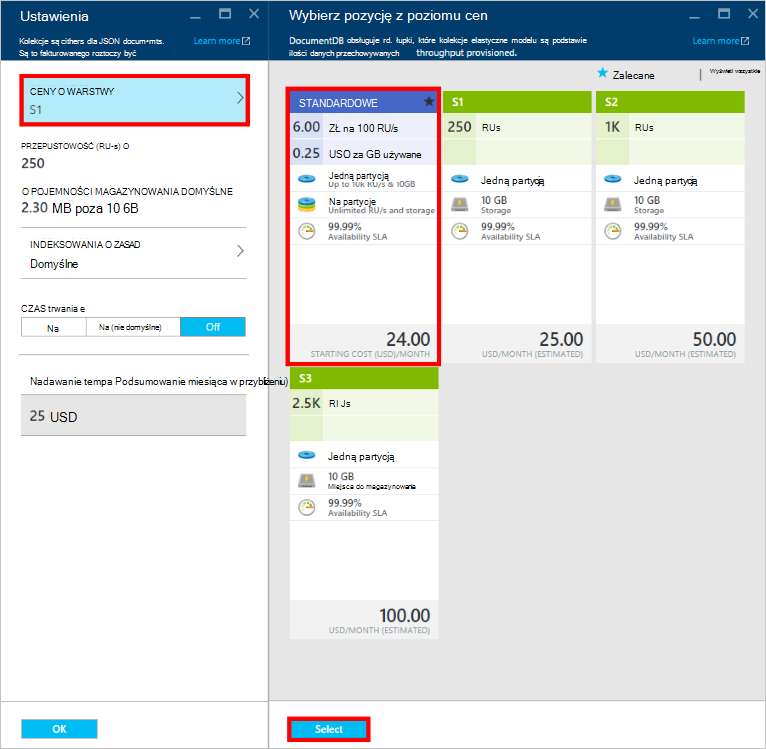
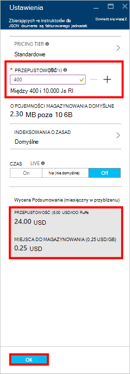
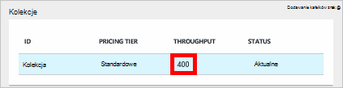

<properties
    pageTitle="Poziomy wydajności w DocumentDB | Microsoft Azure"
    description="Dowiedz się, jak poziomy wydajności w DocumentDB umożliwiają rezerwowanie przepustowość na podstawie jednego zbioru."
    services="documentdb"
    authors="mimig1"
    manager="jhubbard"
    editor="monicar"
    documentationCenter=""/>

<tags
    ms.service="documentdb"
    ms.workload="data-services"
    ms.tgt_pltfrm="na"
    ms.devlang="na"
    ms.topic="article"
    ms.date="08/26/2016"
    ms.author="mimig"/>

# Poziomy wydajności w DocumentDB

Ten artykuł zawiera omówienie poziomów wydajności w [Programie Microsoft Azure DocumentDB](https://azure.microsoft.com/services/documentdb/).

Po zapoznaniu się w tym artykule, będziesz mieć możliwość odpowiedzieć na następujące pytania:  

-   Co to jest poziom wydajności?
-   Jak przepustowość zarezerwowane dla konta bazy danych?
-   Jak pracować z poziomów wydajności?
-   Jak mam wystawiona dla poziomów wydajności?

## Wprowadzenie do poziomów wydajności

Każda z kolekcji DocumentDB utworzone w obszarze konto standardowe jest obsługi administracyjnej z poziomu wydajności skojarzone. Każdego zbioru w bazie danych mogą mieć uprawnienia na poziomie różnych wydajności pozwala określić więcej przepustowości dla często używanych zbiorów i mniej przepustowości dla zbiorów rzadko używane. DocumentDB obsługuje obu poziomów wydajności zdefiniowane przez użytkownika i wstępnie zdefiniowane poziomy wydajności.  

Każdy poziom wydajności ma limit szybkości skojarzone [jednostki żądania (RU)](documentdb-request-units.md) . To jest przepustowość, które zostaną zarezerwowane dla zbioru na podstawie poziomu wydajności i wyłącznie jest dostępne dla tej kolekcji.

<table border="0" cellspacing="0" cellpadding="0">
    <tbody>
        <tr>
            <td valign="top">

</td>
            <td valign="top">
Szczegóły
</td>
            <td valign="top">
Ograniczenia przepustowości
</td>
            <td valign="top">
Ograniczenia dotyczące magazynowania
</td>
            <td valign="top">
Wersja
</td>
            <td valign="top">
Interfejsy API
</td>            
        </tr>
        <tr>
            <td valign="top">
Wydajność zdefiniowanych przez użytkownika
</td>
            <td valign="top">
Miejsca do magazynowania taryfowe na podstawie zastosowania w GB.

Przepustowość w jednostkach miary 100 RU/s
</td>
            <td valign="top">
Nieograniczoną. 400 — 250 000 żądanie jednostki/s domyślnie (wyższa żądanie)
</td>
            <td valign="top">
Nieograniczoną. 250 GB domyślnie (wyższa żądanie) 
</td>
            <td valign="top">
W WERSJI 2
</td>
            <td valign="top">
Interfejs API 2015-12-16 i nowszy
</td>  
        </tr>
        <tr>
            <td valign="top">
Wstępnie zdefiniowane wydajności
</td>
            <td valign="top">
Miejsce do magazynowania 10 GB zastrzeżone.

S1 = 250 RU-s, S2 = RU 1000/s, S3 = 2500 RU/s
</td>
            <td valign="top">
2500 RU/s
</td>
            <td valign="top">
10 GB
</td>
            <td valign="top">
W WERSJI 1
</td>
            <td valign="top">
Dowolny
</td>  
        </tr>        
    </tbody>
</table>                

DocumentDB umożliwia bogatego zestawu operacji bazy danych, w tym kwerend, procedur kwerend za pomocą funkcje zdefiniowane przez użytkownika (UDF), przechowywane i wyzwalacze. Koszt przetwarzania związanych z każdym z tych operacji zależy od Procesora, Jo i pamięci wymagane do ukończenia tej operacji. Zamiast tego planowanie i zarządzanie zasobami sprzętu, możesz myśleć jednostki żądanie jako pojedynczy miary dla zasobów wymagane do wykonywania różnych operacji bazy danych i obsługi żądania aplikacji.

Kolekcje można tworzyć za pośrednictwem [portalu Microsoft Azure](https://portal.azure.com), [Interfejsu API usługi REST](https://msdn.microsoft.com/library/azure/mt489078.aspx) lub na dowolnej stronie [SDK DocumentDB](https://msdn.microsoft.com/library/azure/dn781482.aspx). Interfejsy API DocumentDB umożliwiają określenie poziomu wydajności zbioru.

> [AZURE.NOTE] Poziom wydajności zbioru można dostosować za pośrednictwem interfejsów API lub [portalu Microsoft Azure](https://portal.azure.com/). Zmiany na poziomie wydajności oczekuje się zakończyć w 3 minuty.

## Ustawianie poziomów wydajności zbierania danych
Po utworzeniu zbioru pełny przyznawania RUs oparte na poziom wydajności wyznaczonych są zarezerwowane dla kolekcji.

Należy zauważyć, że z obu poziomów wydajności zdefiniowane przez użytkownika i wstępnie zdefiniowanych DocumentDB działa oparte na rezerwacji przepustowości. Tworząc zbiór, aplikacja została zarezerwowana i jest wystawiona zastrzeżone przepustowości niezależnie od tego, jaka część tej przepustowość jest aktywnie używane. Miejsca do magazynowania jest taryfowe oparte na zużycie poziomy wydajności zdefiniowane przez użytkownika, ale o poziomach wstępnie zdefiniowanych wydajności 10 GB miejsca do magazynowania jest zastrzeżona w momencie tworzenia zbioru.  

Po utworzeniu zbiory można modyfikować poziom wydajności za pośrednictwem SDK DocumentDB lub Portal klasyczny Azure.

> [AZURE.IMPORTANT] Kolekcje standardowe DocumentDB są wystawiona stawki godzinowe i każdego zbioru, utworzony zostanie naliczony minimalne godzinę pracy.

Jeśli możesz dostosować poziom wydajności zbioru w ciągu godziny, będą naliczane najwyższego poziomu wydajności Ustawianie ciągu godziny. Na przykład jeśli zwiększysz poziom wydajności zbioru na 8:53 am zostaniesz obciążony nowego poziomu począwszy od 8:00 am. Analogicznie jeśli na 8:53 am poziom wydajności, Nowa stawka zostaną zastosowane o 9:00.

Żądanie jednostki są zarezerwowane dla każdego zbioru na podstawie zestawu poziom wydajności. Żądanie zużycia jest obliczana jako na drugim stawki. Aplikacje, które wykraczają poza liczby jednostek ustanawianie żądań (lub poziom wydajności) w zbiorze będzie ograniczenie, aż wskaźnik mniejsza niż poziom zarezerwowane dla tego zbioru. Jeśli aplikacja wymaga wyższy poziom wydajności, można zwiększyć poziom wydajności dla każdego zbioru.

> [AZURE.NOTE] Aplikacja przekroczenia poziomów wydajności dla jednej lub wielu zbiorów żądania będzie ograniczenie na podstawie jednego zbioru. Oznacza to, że niektóre żądania aplikacji może się niepowodzeniem, gdy inne osoby mogą być ograniczenie. Zalecane jest dodawanie małą liczbę prób, gdy ograniczenie w celu obsługi tych najwyższych wartościach w ruchu wezwanie.

## Korzystanie z poziomów wydajności
Kolekcje DocumentDB umożliwia grupowanie danych na podstawie wzorców kwerendy i wymagań wydajności aplikacji. Osoby DocumentDB automatyczne indeksowanie i obsługę kwerend jest dość często rozlokować niejednorodnymi dokumenty w obrębie tego samego zbioru. Kluczowe zagadnienia przy podejmowaniu decyzji, czy ma być używane oddzielne kolekcje obejmują:

- Kwerendy — zbioru jest zakresem wykonywania zapytań. Jeśli potrzebujesz kwerenda wykonywana zestawu dokumentów, najskuteczniejszą desenie odczytu pochodzą z collocating dokumentów w jednej kolekcji.
- Transakcje — wszystkie transakcje są ograniczone do w jednym zbiorze. Jeśli masz dokumenty, które muszą być aktualizowane w pojedynczej procedury składowanej lub wyzwalacza, muszą być przechowywane w tym samym zbiorze. Dokładniej klucz partition w zbiorze jest granicy transakcji. Aby uzyskać więcej informacji, zobacz [partycjonowanie w DocumentDB](documentdb-partition-data.md) .
- Wydajność izolacji — zbioru ma poziom wydajności skojarzone. Dzięki temu, że każdego zbioru ma przewidywalne wydajność dzięki RUs zastrzeżone. Dane można przypisać do różnych zbiorów, z różne poziomy wydajności, oparte na częstotliwość programu access.

> [AZURE.IMPORTANT] Jest ważne dowiedzieć się, że będą naliczane szybkością pełną listę standardowych na podstawie liczby zbiorów utworzone przez aplikację.

Zaleca się, że aplikacja umożliwia wykorzystanie niewielka liczba zbiorów, jeśli nie masz duże wymagań przechowywania lub przepustowość. Upewnij się, masz wzorców aplikacji do tworzenia nowych zbiorów również zrozumienie. Można zarezerwować Tworzenie zbioru jako akcja zarządzania obsługiwania spoza aplikacji. Podobnie dostosowując poziom wydajności dla zbioru zmieni stawkę godzinową, w którym jest wystawiona kolekcji. Jeśli aplikacja skoryguje tych dynamicznie należy monitorować poziomy wydajności zbioru.

## Zmienianie S1, S2, S3 na wydajność zdefiniowane przez użytkownika

Wykonaj poniższe czynności, aby zmienić przy użyciu wstępnie zdefiniowanych przepustowość poziomy poziomy przepustowość zdefiniowane przez użytkownika w portalu Azure. Za pomocą poziomów przepustowość zdefiniowane przez użytkownika, przepustowość sieci można dostosować do własnych potrzeb. A jeśli nadal używasz konta S1, można zwiększyć przepustowość Twojej domyślne z 250 RU-s 400 RU-s za pomocą kilku kliknięć.

Aby uzyskać więcej informacji na temat cennik przepustowość związane z zdefiniowane przez użytkownika i wstępnie zdefiniowanych zmiany Zobacz wpis w blogu [DocumentDB: wszystko, co należy wiedzieć o korzystaniu z nowych opcji cennik](https://azure.microsoft.com/blog/documentdb-use-the-new-pricing-options-on-your-existing-collections/).

> [AZURE.VIDEO changedocumentdbcollectionperformance]

1. W przeglądarce przejdź do [**portalu Azure**](https://portal.azure.com).
2. Kliknij przycisk **Przeglądaj,** -> **DocumentDB**, a następnie wybierz konto DocumentDB do modyfikacji.   
3. W soczewki **baz danych** wybierz bazę danych, aby zmodyfikować, a następnie w karta **bazy danych** wybierz zbiór do modyfikacji. W przypadku kont przy użyciu wstępnie zdefiniowanych przepustowość są cennik warstwa S1, S2 i S3.

      

4. W karta **zbiory** kliknij przycisk **więcej**, następnie **Ustawienia** na górnym pasku.   
5. W karta **Ustawienia** kliknij **Poziom ceny** i Zauważ, że miesięczny Szacowanie kosztów dla każdego planu jest wyświetlana w karta **Wybierz z poziomu cennik** . Aby zmienić przepustowość zdefiniowane przez użytkownika, kliknij pozycję **Standardowy**, a następnie kliknij **Wybierz** , aby zapisać zmiany.

      

6. W karta **Ustawienia** **Poziomu ceny** został zamieniony na **Standardowy** i z wartością domyślną 400 pojawia się okno dialogowe **przepustowości (RU-s)** . Ustawianie przepustowości między 400 do 10 000 [jednostek żądanie](documentdb-request-units.md)/second (RU-s). **Podsumowanie cennik** u dołu strony zostanie automatycznie zaktualizowany oszacowanie miesięcznych kosztów. Kliknij **przycisk OK** , aby zapisać zmiany.

    

7. Ponownie na karta **bazy danych** , można sprawdzić przepustowość nowej kolekcji.

    

Jeśli okaże się, że potrzebujesz więcej przepustowość (większe niż 10 000 RU/s) lub więcej miejsca do magazynowania (większe niż 10GB) możesz utworzyć zbiór podzielone na partycje. Aby utworzyć zbiór podzielone na partycje, zobacz [Tworzenie kolekcji](documentdb-create-collection.md).

>[AZURE.NOTE] Zmienianie poziomów wydajności zbioru może potrwać do dwóch minut.

## Zmienianie poziomów wydajności przy użyciu zestawu SDK .NET

Innym rozwiązaniem umożliwiające zmianę poziomów wydajności zbioru usługi jest przez naszych SDK. W tej sekcji omówiono tylko zmiana poziomu wydajności zbioru przy użyciu naszych [.NET SDK](https://msdn.microsoft.com/library/azure/dn948556.aspx), ale proces jest podobny dla naszych innych [SDK](https://msdn.microsoft.com/library/azure/dn781482.aspx). Jeśli jesteś nowym użytkownikiem naszych .NET SDK, odwiedź stronę nasz [Samouczek wprowadzający](documentdb-get-started.md).

Oto wstawkę kodu zmiany przepustowość oferty do 50 000 jednostek wezwanie na sekundę:

    //Fetch the resource to be updated
    Offer offer = client.CreateOfferQuery()
                      .Where(r => r.ResourceLink == collection.SelfLink)    
                      .AsEnumerable()
                      .SingleOrDefault();

    // Set the throughput to 5000 request units per second
    offer = new OfferV2(offer, 5000);

    //Now persist these changes to the database by replacing the original resource
    await client.ReplaceOfferAsync(offer);

    // Set the throughput to S2
    offer = new Offer(offer);
    offer.OfferType = "S2";

    //Now persist these changes to the database by replacing the original resource
    await client.ReplaceOfferAsync(offer);

> [AZURE.NOTE] Drugi zbiory obsługi administracyjnej z poniżej 10 000 jednostek wezwanie na możesz przeprowadzić migrację między ofert o przepustowości zdefiniowane przez użytkownika i wstępnie zdefiniowanych przepustowość (S1, S2, S3) w dowolnym momencie. Kolekcje, których zainicjowano obsługę administracyjną z ponad 10 000 jednostek wezwanie na drugi nie można przekonwertować przepustowość wstępnie zdefiniowanych poziomów.

Odwiedź witrynę [MSDN](https://msdn.microsoft.com/library/azure/microsoft.azure.documents.client.documentclient.aspx) , aby wyświetlić dodatkowe przykłady i Dowiedz się więcej o naszych metod oferty:

- [**ReadOfferAsync**](https://msdn.microsoft.com/library/azure/microsoft.azure.documents.client.documentclient.readofferasync.aspx)
- [**ReadOffersFeedAsync**](https://msdn.microsoft.com/library/azure/microsoft.azure.documents.client.documentclient.readoffersfeedasync.aspx)
- [**ReplaceOfferAsync**](https://msdn.microsoft.com/library/azure/microsoft.azure.documents.client.documentclient.replaceofferasync.aspx)
- [**CreateOfferQuery**](https://msdn.microsoft.com/library/azure/microsoft.azure.documents.linq.documentqueryable.createofferquery.aspx)

## Zmiana przepustowości kolekcji

Jeśli już używasz wydajności zdefiniowane przez użytkownika, możesz zmienić przepustowość zbioru, wykonując następujące czynności. Jeśli chcesz zmienić z poziomu wydajności S1, S2 i S3 (wydajność wstępnie zdefiniowane) na wydajności zdefiniowane przez użytkownika, zobacz [Zmienianie S1, S2 i S3 wydajność zdefiniowane przez użytkownika](#changing-performance-levels-using-the-azure-portal).

1. W przeglądarce przejdź do [**portalu Azure**](https://portal.azure.com).
2. Kliknij przycisk **Przeglądaj,** -> **DocumentDB**, a następnie wybierz konto DocumentDB do modyfikacji.   
3. Na karta **DocumentDB konta** , w soczewki **baz danych** wybierz bazę danych, aby zmodyfikować, a następnie w karta **bazy danych** wybierz zbiór do modyfikacji.
4. W karta **zbiory** na górnym pasku kliknij przycisk **Ustawienia** .   
5. W karta **Ustawienia** Zwiększ wartość w polu **przepustowości (RU/s)** , a następnie kliknij **przycisk OK** , aby zapisać zmiany. **Ceny podsumowania** w dolnej części karta zaktualizowane, aby wyświetlić nowy szacowany koszt miesięczny tego zbioru pojedynczego obszaru.

    

Jeśli nie masz pewności, ile zwiększyć przepustowość sieci, zobacz [musi Estimating przepustowość](documentdb-request-units.md#estimating-throughput-needs) i [żądanie Kalkulator jednostek](https://www.documentdb.com/capacityplanner).

## Następne kroki

Aby dowiedzieć się więcej na temat ceny i zarządzanie danymi z Azure DocumentDB, zapoznaj się z następujących zasobów:

- [Ceny DocumentDB](https://azure.microsoft.com/pricing/details/documentdb/)
- [Zarządzanie zdolności DocumentDB](documentdb-manage.md)
- [Modelowanie danych w DocumentDB](documentdb-modeling-data.md)
- [Podziału danych w DocumentDB](documentdb-partition-data.md)
- [Żądanie jednostki](http://go.microsoft.com/fwlink/?LinkId=735027)

Aby dowiedzieć się więcej na temat DocumentDB, zobacz Azure DocumentDB [dokumentacji](https://azure.microsoft.com/documentation/services/documentdb/).

Aby rozpocząć pracę przy użyciu skali i testowania z DocumentDB, zobacz [Wydajność i skali testowanie za pomocą Azure DocumentDB](documentdb-performance-testing.md).

[1]: ./media/documentdb-performance-levels/documentdb-change-collection-performance7-9.png
[2]: ./media/documentdb-performance-levels/documentdb-change-collection-performance10-11.png
