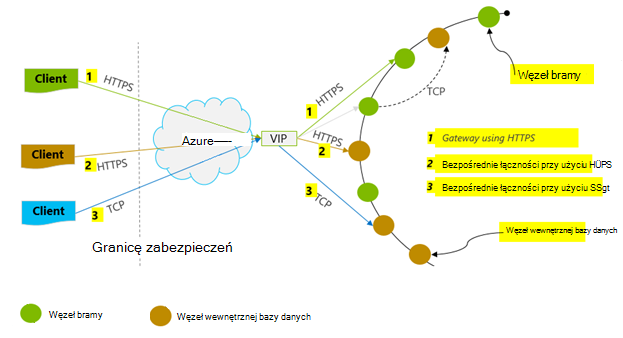
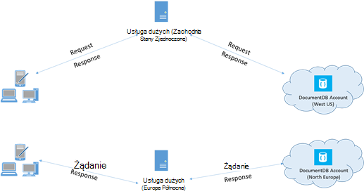

<properties 
    pageTitle="Porady dotyczące wydajności DocumentDB | Microsoft Azure" 
    description="Dowiedz się więcej opcji konfiguracji klienta w celu zwiększenia wydajności bazy danych Azure DocumentDB"
    keywords="jak zwiększyć wydajność bazy danych"
    services="documentdb" 
    authors="mimig1" 
    manager="jhubbard" 
    editor="" 
    documentationCenter=""/>

<tags 
    ms.service="documentdb" 
    ms.workload="data-services" 
    ms.tgt_pltfrm="na" 
    ms.devlang="na" 
    ms.topic="article" 
    ms.date="10/17/2016" 
    ms.author="mimig"/>

# Porady dotyczące wydajności dla DocumentDB

Azure DocumentDB jest to szybki i elastyczne rozkładem baza danych skale bezproblemowo z opóźnienie gwarantowanej i przepustowość. Nie musisz zmieniać architektura głównych i pisanie kodu złożonych przeskalować bazy danych przy użyciu DocumentDB. Skalowanie w górę lub w dół jest tak proste jak pojedyncze wywołanie interfejsu API lub [metody SDK połączeń](documentdb-performance-levels.md#changing-performance-levels-using-the-net-sdk). Ponieważ DocumentDB jest dostępna za pośrednictwem połączenia sieciowego istnieją optymalizacje po stronie klienta, które można wprowadzić, aby osiągnąć najwyższą wydajność.

Aby Jeśli prosisz "jak poprawić wydajność mojej bazy danych?" należy rozważyć następujące opcje:

## Sieci

1. **Zasady połączeń: Korzystanie z trybu bezpośredniego połączenia**
    
    Jak klient nawiązuje połączenie Azure DocumentDB ma istotny wpływ na wydajność, zwłaszcza w odniesieniu do obserwowanych opóźnienie po stronie klienta. Istnieją dwa ustawienia konfiguracji klucza dostępne w celu konfigurowania klienta zasad połączenia — połączenia *Tryb* i [połączenia *protokołu*](#connection-protocol).  Są dwa tryby dostępne:

    1. Tryb bramy (ustawienie domyślne)
    2. Tryb bezpośredni

    Ponieważ DocumentDB jest systemem magazynu rozłożone, DocumentDB zasobów, takich jak zbiory oddzielone od siebie na wielu komputerach i każdego partition są replikowane wysokiej dostępności. Logiczne do tłumaczenia fizyczny adres jest przechowywana w tabeli routingu, która jest również wewnętrznie dostępne jako zasobu.

    W trybie bramy na komputerach bramy DocumentDB wykonywanie tego routingu, umożliwiając kod klienta prosty i kompaktuj. Aplikacją kliencką problemy wezwań na komputerach bramy DocumentDB, które tłumaczenie logiczne identyfikator URI w wezwaniu na adres fizyczny węzła wewnętrznej bazy danych i odpowiednio przesłać dalej wezwanie.  I odwrotnie w trybie bezpośredni klientów musi zachować — i okresowo odświeżać — kopię tej tabeli routingu, a następnie bezpośrednio nawiązać węzły DocumentDB wewnętrznej bazy danych.

    Tryb bramy jest obsługiwane na wszystkich platformach SDK i jest skonfigurowany domyślny.  Jeśli aplikacja działa w sieci firmowej z ograniczeniami ściśle zapory, tryb bramy jest to najlepszy wybór, ponieważ użyto standardowy port HTTPS oraz jeden punkt końcowy. Z zależnościami wydajności jest jednak, że tryb bramy obejmuje przeskoku sieciowa każdorazowo danych jest odczytu lub zapisu do DocumentDB.   Z tego powodu trybu bezpośredniego oferuje lepszą wydajność z powodu mniejszej liczby przeskoków sieci.

2. **Zasady połączeń: za pomocą protokołu TCP**

    Używanie trybu bezpośredniego, istnieją dwie opcje Protocol (protokół):

    - PORT TCP
    - PROTOKÓŁ HTTPS

    DocumentDB oferuje prosty i otwórz RESTful model programowania za pomocą protokołu HTTPS. Ponadto oferuje wydajną obsługę protokołu TCP, która jest również RESTful w jego model komunikacji i jest dostępna za pośrednictwem klienta programu .NET SDK. Bezpośrednie TCP i HTTPS Użyj protokołu SSL dla uwierzytelniania i szyfrowania ruchu. Aby uzyskać optymalną wydajność za pomocą protokołu TCP, jeśli jest to możliwe. 

    Podczas używania TCP w trybie bramy, TCP Port 443 jest DocumentDB port, a 10250 jest port interfejsu API MongoDB. Korzystając z protokołu TCP w trybie bezpośredni, oprócz porty bramy, musisz zapewnić portu między 10000 a 20000 jest otwarty, ponieważ DocumentDB używa dynamiczne porty TCP. Jeśli nie są one otwarte i próbuj używać protokołu TCP, otrzymasz błędu 503 Usługa niedostępna. 

    Tryb łączności jest skonfigurowany w czasie tworzenia wystąpienia DocumentClient z parametrem ConnectionPolicy. Jeśli jest używany tryb bezpośredni, protokół można także ustawić w parametrze ConnectionPolicy.

        var serviceEndpoint = new Uri("https://contoso.documents.net");
        var authKey = new "your authKey from Azure Mngt Portal";
        DocumentClient client = new DocumentClient(serviceEndpoint, authKey, 
        new ConnectionPolicy
        {
            ConnectionMode = ConnectionMode.Direct,
            ConnectionProtocol = Protocol.Tcp
        });

    Ponieważ TCP jest obsługiwana tylko w trybie bezpośredni, jeśli jest używany tryb bramy protokołu HTTPS zawsze umożliwia komunikowanie się za pomocą bramy i wartości z pola Protokół w ConnectionPolicy jest ignorowana.

    

3. **Nawiązywanie połączenia OpenAsync, aby uniknąć opóźnienie uruchamiania na pierwsze żądanie**

    Domyślnie pierwsze żądanie będzie miało opóźnienie wyższą, ponieważ został do pobierania tabeli routingu adres. Aby uniknąć tego opóźnienie uruchamiania po pierwszym żądaniu, można zadzwonić OpenAsync() raz podczas inicjowania w następujący sposób.

        await client.OpenAsync();

4. **Rozlokować klientów w tym samym regionie Azure wydajności**

    Jeśli to możliwe, umieść wszystkie aplikacje, dzwoniąc DocumentDB w tym samym regionie jako DocumentDB bazy danych. Porównanie przybliżonego połączenia do DocumentDB w tym samym regionie zakończyła się w ciągu ms 1 i 2, ale jest opóźnienia między zachód oraz wschodniego wybrzeża Stanów Zjednoczonych > 50 ms. To opóźnienie prawdopodobnie zależy od do innego żądania trasę żądanie przesyłanych z klienta do granicy Azure centrum danych. Najniższe opóźnienie możliwe uzyskuje się przez zyskujemy pewność, że aplikacji wywołującej znajduje się w tym samym regionie Azure jako punkt końcowy ustanawianie DocumentDB. Aby uzyskać listę dostępnych regionów zobacz [Obszary Azure](https://azure.microsoft.com/regions/#services).

    

5. **Zwiększ liczbę wątków i zadania**

    Ponieważ połączenia do DocumentDB są wykonywane za pośrednictwem sieci, może być konieczne różnią się stopień podobieństwa wezwaniach na tak, aby z aplikacją kliencką spędza bardzo mało czasu oczekiwania między żądaniami. Na przykład, jeśli używasz. W sieci [Równoległe Biblioteka zadań](https://msdn.microsoft.com//library/dd460717.aspx), tworzenie kolejności 100s zadań odczytu lub zapisu do DocumentDB.

## Użycie zestawu SDK

1. **Instalowanie najnowszych SDK**

    Stale jest lepsza SDK DocumentDB aby zapewnić najlepszą wydajność. Zobacz stron [DocumentDB SDK](documentdb-sdk-dotnet.md) w celu określenia ostatnio SDK i przejrzyj ulepszenia. 

2. **Za pomocą klienta DocumentDB pojedynczych dla ważności aplikacji**
  
    Zauważ, że każde wystąpienie DocumentClient wątku palety i wykonuje Zarządzanie połączeniami wydajność i adres pamięci podręcznej podczas pracy w trybie bezpośredniego. Umożliwia zarządzanie połączeniami wydajność i lepszą wydajność przez DocumentClient, zaleca się używanie jedno wystąpienie DocumentClient na domeny aplikacji dla istnienia aplikacji.

3. **Zwiększanie System.Net MaxConnections na hosta**

    Żądania DocumentDB są wykonywane za pośrednictwem HTTPS-pozostałych domyślnie i podlegają domyślny limit połączenia na adres IP lub nazwa hosta. Może być konieczne ustawianie MaxConnections na wartość większą (100-1000), tak aby biblioteka klienta mogą korzystać z wielu połączenia DocumentDB. W zestawie SDK .NET 1.8.0 powyżej 50 jest wartością domyślną [ServicePointManager.DefaultConnectionLimit](https://msdn.microsoft.com/library/system.net.servicepointmanager.defaultconnectionlimit.aspx) oraz, aby zmienić wartość, należy ustawić na wartość większą [Documents.Client.ConnectionPolicy.MaxConnectionLimit](https://msdn.microsoft.com/en-us/library/azure/microsoft.azure.documents.client.connectionpolicy.maxconnectionlimit.aspx) .  

4. **Dostosowywanie zapytania równolegle podzielone na partycje zbierania danych**

     DocumentDB .NET SDK wersję 1.9.0 oraz powyżej zapytania równolegle pomocy technicznej, które umożliwiają kwerendy podzielone na partycje zbioru równolegle (zobacz [Praca z SDK](documentdb-partition-data.md#working-with-the-sdks) i w powiązanych [Przykłady kodu](https://github.com/Azure/azure-documentdb-dotnet/blob/master/samples/code-samples/Queries/Program.cs) , aby uzyskać więcej informacji). Zapytania równolegle mają zwiększyć opóźnienie kwerend i przepustowość w ich odpowiedników szeregowego. Kwerendy równoległe zapewniają dwa parametry, które użytkownicy mogą dostosować niestandardowe — Dopasuj wymagań, MaxDegreeOfParallelism (): do sterowania maksymalną liczbę podziałów, nie można wyszukiwać w równolegle i MaxBufferedItemCount (b): Aby sterować liczbą wstępnie pobranych wyników. 
    
    () ***dostrajania MaxDegreeOfParallelism\: *** 
    równoległa działa zapytania przez badanie wielu partycje równolegle. Jednak dane z poszczególnych zebrać podzielone na partycje pobieranych pojedynczo w odniesieniu do kwerendy. Tak ustawienie MaxDegreeOfParallelism liczbę podziałów przewiduje maksymalną szansę osiągnięcia większość kwerendy performant, wszystkie pozostałe warunki system nie zmieniają się. Jeśli nie wiesz, liczba partycje, można ustawić MaxDegreeOfParallelism wysoką liczbę, a system będzie wybierz minimalna (liczba partycje, wprowadzania podane przez użytkownika) jako MaxDegreeOfParallelism. 
    
    Należy pamiętać, zapytania równolegle warzywa najważniejsze korzyści, jeśli dane są równomiernie na wszystkie partycje w odniesieniu do kwerendy. Jeśli podzielone na partycje zbioru jest podzielona sposób wszystkich lub większości danych zwróconych przez kwerendę jest skoncentrowany w kilku partycje (jedną partycją w przypadku najgorszego), a następnie wydajności kwerendy czy bottlenecked przez te partycje. 
    
    (b) ***dostrajania MaxBufferedItemCount\: *** 
    równoległe kwerendy jest przeznaczony do wstępnie pobierania wyników podczas bieżącej partii wyników jest przetwarzana przez klienta. Pobierania pomaga usprawnień opóźnienie kwerendy. MaxBufferedItemCount jest parametr w celu ograniczenia ilości wstępnie pobranych wyników. Ustawienie MaxBufferedItemCount z numerem oczekiwane wyniki zwrócone (lub większa niż liczba) umożliwia zapytania, aby otrzymywać maksymalnych korzyści z pobierania. 
    
    Należy zauważyć, że pobierania działa tak samo, niezależnie od MaxDegreeOfParallelism i jest pojedynczego buforu danych z wszystkie partycje.  

5. **Włączanie ° c po stronie serwera**
    
    Zmniejszenie częstotliwości śmieci może pomóc w niektórych przypadkach. W .NET ustaw [gcServer](https://msdn.microsoft.com/library/ms229357.aspx) na PRAWDA.

6. **Implementowanie wycofywania w odstępach RetryAfter**
 
    Podczas testowania wydajności, można zwiększyć obciążenia, aż małych liczba żądań uzyskiwanie ograniczenie. Jeśli ograniczenie, z aplikacją kliencką powinna wycofywania na przepustowości dla interwału ponawiania określony przez serwer. Przestrzeganie wycofywania zapewnia poświęcanego minimum czas oczekiwania między kolejnymi próbami. Obsługa zasad ponów próbę znajduje się w wersji 1.8.0 i powyżej DocumentDB [.NET](documentdb-sdk-dotnet.md) i [języka Java](documentdb-sdk-java.md)oraz wersji 1.9.0 oraz powyżej [Node.js](documentdb-sdk-node.md) i [Python](documentdb-sdk-python.md). Aby uzyskać więcej informacji zobacz [limity Exceeding zastrzeżone przepustowość](documentdb-request-units.md#exceeding-reserved-throughput-limits) i [RetryAfter](https://msdn.microsoft.com/library/microsoft.azure.documents.documentclientexception.retryafter.aspx).

7. **Możliwość skalowania obciążenia klientami**

    Jeśli testujesz poziomie wysokiej wydajności (> RU 50 000-s), może stać się z aplikacją kliencką gardło ze względu na komputerze są takie same się na wykorzystanie Procesora lub sieci. Jeśli możesz uzyskać dostęp do tego punktu możesz nadal push konta DocumentDB dodatkowo przez Skalowanie zewnętrzne aplikacji klienta na wielu serwerach.

8. **Pamięć podręczna dokumentu identyfikatory URI mniejsze opóźnienia odczytu**

    Dokument pamięci podręcznej URI, o ile to możliwe w celu uzyskania najlepszej wydajności odczytu.

9. **Dostosowywanie rozmiaru strony źródeł kwerend/przeczytane w celu zwiększenia wydajności**

    Podczas wykonywania zbiorczej odczyt dokumentów przy użyciu odczytu kanału funkcjonalności (to znaczy ReadDocumentFeedAsync) lub podczas wydawania zapytania DocumentDB SQL, wyniki są zwracane w sposób segmentowany, jeśli zestaw wyników jest zbyt duża. Domyślnie zwracane wyniki są w fragmentów 100 elementów lub 1 MB, jednego z tych limitów trafienie pierwszego. 

    Aby zmniejszyć liczbę sieci wymaganą liczbę przekazywanych pobrać wszystkie stosowne wyniki, można zwiększyć rozmiar strony przy użyciu nagłówka żądania x-ms maks.-— liczba elementów do 1000. W przypadku której ma zostać wyświetlone tylko kilka wyniki np. Jeśli użytkownik API interfejsu lub aplikacji zwraca tylko 10 wyników czas, można także zmniejszyć rozmiar strony do 10, aby zmniejszyć przepustowość zużycia Odczyt i kwerend.

    Mogą również ustawić rozmiar strony przy użyciu dostępnych SDK DocumentDB.  Na przykład:
    
        IQueryable<dynamic> authorResults = client.CreateDocumentQuery(documentCollection.SelfLink, "SELECT p.Author FROM Pages p WHERE p.Title = 'About Seattle'", new FeedOptions { MaxItemCount = 1000 });

10. **Zwiększ liczbę wątków i zadania**

    Zobacz, [Zwiększ liczbę wątków i zadań](#increase-threads) w części "Networking".

## Indeksowanie zasad

1. **Indeksowanie z opóźnieniem dla szybsze Szczyt czasu spożyciu stawek za pomocą**

    DocumentDB umożliwia określenie — na poziomie zbioru — zasad indeksowania, który umożliwia wybranie dokumentów w zbiorze mają być automatycznie indeksowane, czy nie.  Ponadto można też między synchroniczne (spójne) i aktualizacje asynchroniczne indeks (opóźnieniem). Domyślnie indeks jest aktualizowana synchronicznie na każdym Wstawianie, Zamień lub Usuń dokument do kolekcji. Tryb umożliwia synchronicznie kwerend przestrzegać tego samego [poziomu spójności](documentdb-consistency-levels.md) , który odczytuje dokument bez zwłoki w indeksie "odnaleźć".
    
    Indeksowanie z opóźnieniem można rozważyć scenariusze, w których dane są zapisywane w seria, a chcesz agencyjnej pracy wymaganej do indeksu zawartości przez dłuższy czas. Indeksowanie z opóźnieniem umożliwia korzystanie z ustanawianie przepustowość efektywne i obsługiwać żądania zapisu w czasie Szczyt z minimalnymi opóźnienie. Należy jednak pamiętać, że po włączeniu indeksowanie z opóźnieniem wyniki kwerendy będą ostatecznie spójne niezależnie od poziomu spójności skonfigurowana dla konta DocumentDB.

    W związku z tym spójne tryb indeksowania (IndexingPolicy.IndexingMode jest ustawiona na spójne) ponosi najwyższe opłaty jednostki wezwanie na zapisu podczas opóźnieniem indeksowania tryb (IndexingPolicy.IndexingMode jest ustawiona na opóźnieniem) i nie indeksowania (IndexingPolicy.Automatic jest ustawiona na False) jest zero indeksowania koszt w momencie zapisu.

2. **Wykluczanie nieużywane ścieżki z indeksowania szybsze zapisów**

    Indeksowania zasady firmy DocumentDB umożliwia określenie ścieżki dokumentu, aby uwzględnić lub wykluczyć z indeksowania przez używanie ścieżek indeksowania (IndexingPolicy.IncludedPaths i IndexingPolicy.ExcludedPaths). Użyj indeksowania ścieżek mogą oferować wydajność zapisu ulepszone i dolnym miejsca do magazynowania indeksu dla scenariusze, w których desenie kwerendy są znane wcześniej, podczas indeksowania koszty są bezpośrednio powiązane liczba unikatowych ścieżek indeksowane.  Na przykład poniższy kod pokazano, jak wykluczyć całej sekcji dokumentów (alias drzewo podrzędne) możliwość korzystania z indeksowania "*" symboli wieloznacznych.

        var collection = new DocumentCollection { Id = "excludedPathCollection" };
        collection.IndexingPolicy.IncludedPaths.Add(new IncludedPath { Path = "/*" });
        collection.IndexingPolicy.ExcludedPaths.Add(new ExcludedPath { Path = "/nonIndexedContent/*");
        collection = await client.CreateDocumentCollectionAsync(UriFactory.CreateDatabaseUri("db"), excluded);

    Aby uzyskać więcej informacji zobacz [zasady indeksowania DocumentDB](documentdb-indexing-policies.md).

## Przepustowość

1. **Zmierz i dostosować żądania dolnym jednostki na sekundę zastosowania**

    DocumentDB oferuje bogatego zestawu operacji bazy danych, w tym kwerend relacyjnych i hierarchicznych przy użyciu funkcji zdefiniowanych przez użytkownika, procedur składowanych i wyzwalaczy — wszystkie pracy nad dokumentami w obrębie zbioru bazy danych. Koszt związany z każdego z tych operacji zależą od Procesora, Jo i pamięci wymagane do ukończenia tej operacji. Zamiast Myślę o i zarządzania zasobami sprzętu możesz myśleć jednostki żądania (RU) jako pojedynczy miara zasoby wymagane do różnych operacji bazy danych i świadczenie usług żądania aplikacji.

    [Żądanie jednostki](documentdb-request-units.md) zainicjowano obsługę administracyjną dla każdego konta bazy danych na podstawie liczby jednostek zdolności produkcyjnych zakupu. Żądanie zużycia jest szacowana jako szybkość na sekundę. Aplikacje, które wykraczają poza liczby jednostek ustanawianie żądań dla swojego konta jest ograniczona, aż wskaźnik pomija poniżej poziomu zarezerwowane dla konta. Jeśli aplikacja wymaga wyższy poziom wydajności, możesz kupić jednostki dodatkowe możliwości.

    Złożoność kwerendy wpływa na liczbę jednostek żądanie są używane dla operacji. Liczba orzeczenia, rodzaj orzeczenia, liczba funkcji zdefiniowanych przez użytkownika oraz rozmiar zbioru źródeł danych wszystkich wpływać koszt operacji kwerendy.

    Do pomiaru ogólnych o każdej operacji (Tworzenie, aktualizowanie i usuwanie), przeprowadź inspekcję nagłówku x-ms żądanie opłaty (lub równoważne właściwość RequestCharge w ResourceResponse<T> lub FeedResponse<T> w zestawie SDK .NET) do pomiaru liczby jednostek żądanie używanych przez te operacje.

        // Measure the performance (request units) of writes
        ResourceResponse<Document> response = await client.CreateDocumentAsync(collectionSelfLink, myDocument);
        Console.WriteLine("Insert of document consumed {0} request units", response.RequestCharge);
        // Measure the performance (request units) of queries
        IDocumentQuery<dynamic> queryable = client.CreateDocumentQuery(collectionSelfLink, queryString).AsDocumentQuery();
        while (queryable.HasMoreResults)
             {
                  FeedResponse<dynamic> queryResponse = await queryable.ExecuteNextAsync<dynamic>();
                  Console.WriteLine("Query batch consumed {0} request units", queryResponse.RequestCharge);
             }
        
    Żądanie zwrócone w ten nagłówek jest ułamek usługi ustanawianie przepustowości (to znaczy 2000 RUs / drugiej). Na przykład jeśli powyżej kwerenda zwraca 1000 1KB dokumentów, koszt operacji będzie 1000. Sposób w ciągu sekundy serwer uwzględnia zdefiniowane tylko dwa wniosek przed ograniczania kolejne żądania. Uzyskać więcej informacji zobacz [jednostki żądania](documentdb-request-units.md) i [Kalkulator jednostek wezwanie](https://www.documentdb.com/capacityplanner).

2. **Uchwyt stopa ograniczanie żądanie stopa jest za duży**

    Gdy klient próbuje przekracza zastrzeżone przepustowości dla konta, istnieje nie spadek wydajności na serwerze i nie użycia przepustowości poza poziomem zastrzeżone. Serwer będzie preemptively zakończyć wezwanie z RequestRateTooLarge (kod stanu HTTP 429) i nagłówek x-ms-ponów próbę po ms wskazujący czas (w milisekundach), które użytkownik musi upłynąć interwał ponawiania żądania zwrotu.
 
        HTTP Status 429,
        Status Line: RequestRateTooLarge
        x-ms-retry-after-ms :100

    Wszystkie niejawnie SDK efektywnej odpowiedź, przestrzegać serwer określony ponów próbę po nagłówek i ponów żądanie. Jeśli Twoje konto jest dostępny jednocześnie przez wielu klientów, następną próbą powiedzie.

    Jeśli masz więcej niż jednego klienta łącznie operacyjnym spójne powyżej stopy żądanie liczby powtórzeń domyślne ustawiony 9 wewnętrznie przez klienta mogą być niewystarczające; w tym przypadku klient zgłasza DocumentClientException z kodem stanu 429 do aplikacji. Licznik domyślne mogą być zmieniane przez ustawienie RetryOptions dla wystąpienia ConnectionPolicy. Domyślnie DocumentClientException z kodem stanu 429 jest zwracany po skumulowany czas 30 sekund, gdy żądanie będzie nadal działać powyżej stopy wezwanie. Dzieje się tak nawet jeśli bieżąca liczba ponów próbę jest mniejsza niż liczba maksymalna ponów próbę, jest to domyślne ustawienie 9 lub wartości zdefiniowane przez użytkownika.

    Podczas zachowanie automatycznego ponawiania pomaga zwiększyć elastyczność i użyteczności dla większości aplikacji, jej mogą okazać się w odds w trakcie wzorców wydajności, zwłaszcza w przypadku, gdy pomiaru opóźnienie.  Opóźnienie obserwowana klienta będzie zwiększyć, jeśli doświadczenia trafienia przepustowości serwera i powoduje, że klient SDK w trybie cichym próbować. Aby uniknąć tych najwyższych wartościach opóźnienie podczas doświadczeń wydajności, zmierzyć opłaty zwracany przy każdorazowym i upewnij się, czy żądania działają poniżej stawki zastrzeżone wezwanie. Aby uzyskać więcej informacji zobacz [żądanie jednostki](documentdb-request-units.md).
   
3. **Projektowanie dla mniejszych dokumentów dotyczących wyższej przepustowości**

    Opłaty żądanie (to znaczy przetwarzanie wezwania koszt) danego działania jest bezpośrednio powiązane rozmiar dokumentu. Operacje na duże dokumenty kosztu więcej niż operacje dla małych dokumentów.

## Poziomy zgodności

1. **Użyj słabsze spójności poziomy lepiej opóźnienia odczytu**

    Inny istotny czynnik wziąć pod uwagę podczas dostosowywania wydajności aplikacji DocumentDB jest poziom spójności. Wybór poziomu spójności nie ma wpływu na wydajność na zarówno Odczyt i zapis. Możesz skonfigurować domyślny poziom spójności na koncie bazy danych i poziomu spójności wybranym następnie dotyczy wszystkich zbiorów (we wszystkich baz danych) w ramach konta DocumentDB. Pod względem operacji zapisu wpływu zmiana poziomu spójności obserwuje się jako opóźnienie wezwanie. Jak silniejsze spójności służą, wzrośnie się opóźnienia zapisu. Z drugiej strony pod względem przepustowości obserwuje się wpływ poziomu spójności w operacji odczytu. W tym artykule słabsze spójności, których poziomy Zezwalaj na wyższy przepustowość być realizowana przez klienta.

    Domyślnie wszystkie Odczyt i kwerendach wydane przed zasobów zdefiniowane przez użytkownika będzie używany domyślny poziom spójności określony na koncie bazy danych. Można jednak obniżanie poziomu spójności żądanie określonych odczytu/kwerendy, określając nagłówku x-ms spójności poziom żądania. Aby uzyskać więcej informacji zobacz [poziomy spójności w DocumentDB](documentdb-consistency-levels.md).

## Następne kroki

Przykładowej aplikacji używane do analizowania DocumentDB scenariuszach wysokiej wydajności na kilku komputerach klienckich zobacz [Wydajność i skali testowanie za pomocą Azure DocumentDB](documentdb-performance-testing.md).

Aby dowiedzieć się więcej o projektowaniu aplikacji dla skali i Wysoka wydajność, zobacz też [partycjonowanie i skalowanie w Azure DocumentDB](documentdb-partition-data.md).
