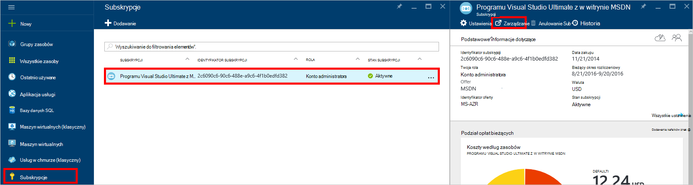

<properties
    pageTitle="Rozwiązywanie problemów z portalem DocumentDB | Microsoft Azure"
    description="Dowiedz się, aby rozwiązać problemy w portal DocumentDB Azure." 
    services="documentdb"
    documentationCenter=""
    authors="mimig1"
    manager="jhubbard"
    editor="monicar"/>

<tags
    ms.service="documentdb"
    ms.workload="data-services"
    ms.tgt_pltfrm="na"
    ms.devlang="na"
    ms.topic="article"
    ms.date="08/29/2016"
    ms.author="mimig"/>

# Azure portalu DocumentDB porady dotyczące rozwiązywania problemów

W tym artykule opisano rozwiązywanie problemów z DocumentDB w portalu Azure. 

## Brakuje zasobów

**Symptom**: bazy danych lub zbiory brakuje z portalu karty.

**Rozwiązanie**: Zmniejsz użycie aplikacji do pracy w obszarze przydział maksymalnej przepustowości dla zbioru. 

**Wyjaśnienie**: portalu to aplikacja podobne do innych, nawiązywanie połączeń do bazy danych DocumentDB i kolekcji. Jeśli wezwaniach są obecnie jest ograniczenie z powodu wywołań z innej aplikacji, portalu może również być ograniczenie, powoduje zasoby nie były wyświetlane w portalu. Aby rozwiązać ten problem, adres przyczyny zastosowania wysokiej wydajności, a następnie Odśwież karta portalu. Informacje na temat do pomiaru i dolnym użycia przepustowości można znaleźć w sekcji [przepustowość](documentdb-performance-tips.md#throughput) artykułu [porad dotyczących wydajności](documentdb-performance-tips.md) .
 
## Nie można załadować strony lub karty

**Symptom**: stron i karty w portalu nie są wyświetlane.

**Rozwiązanie**: Zmniejsz użycie aplikacji do pracy w obszarze przydział maksymalnej przepustowości dla zbioru. 

**Wyjaśnienie**: portalu to aplikacja podobne do innych, nawiązywanie połączeń do bazy danych DocumentDB i kolekcji. Jeśli wezwaniach są obecnie jest ograniczenie z powodu wywołań z innej aplikacji, portalu może również być ograniczenie, powoduje zasoby nie były wyświetlane w portalu. Aby rozwiązać ten problem, adres przyczyny zastosowania wysokiej wydajności, a następnie Odśwież karta portalu. Informacje na temat do pomiaru i dolnym użycia przepustowości można znaleźć w sekcji [przepustowość](documentdb-performance-tips.md#throughput) artykułu [porad dotyczących wydajności](documentdb-performance-tips.md) .

## Dodawanie zbioru jest wyłączona

**Symptom**: na karta bazy danych, przycisk **Dodaj kolekcji** jest wyłączony.

**Wyjaśnienie**: Jeśli Azure subskrypcji jest skojarzony z środków korzyści, takie jak bezpłatne środków oferowanych z subskrypcji MSDN i użyto wszystkich środków z miesiąca, to nie można utworzyć wszystkie kolekcje w DocumentDB.

**Rozwiązanie**: Usuń limit wydatków z Twojego konta.

1. W portalu Azure w Jumpbar kliknij pozycję **Subskrypcje**, kliknij subskrypcji związane z bazą danych DocumentDB, a następnie w karta **subskrypcji** kliknij pozycję **Zarządzaj**. 
    

2. W nowym oknie przeglądarki zobaczysz, że masz partiami. Kliknij przycisk **Usuń limit wydatków** , aby usunąć wydatków tylko bieżący okres rozliczeniowy lub czas nieokreślony. Następnie dokończ kroki Kreatora dodawania lub Potwierdź informacje dotyczące karty kredytowej. 
    

 
## Zapytania Eksploratora wykonuje z błędami

Zobacz [Rozwiązywanie problemów z Eksploratora kwerendy](documentdb-query-collections-query-explorer.md#troubleshoot).

## Dane nie są dostępne w monitorowaniu kafelków

Zobacz [Rozwiązywanie problemów z monitorowanie kafelków](documentdb-monitor-accounts.md#troubleshooting).

## Nie ma żadnych dokumentów zwracane w Eksploratorze dokumentu

Zobacz [Rozwiązywanie problemów Eksploratora dokumentu](documentdb-view-json-document-explorer.md#troubleshoot).

## Następne kroki

Jeśli nadal występują problemy w portalu, Wyślij wiadomość e-mail [askdocdb@microsoft.com](mailto:askdocdb@microsoft.com) o pomoc lub plik pomocy technicznej żądanie w portalu kliknąć przycisk **Przeglądaj**, **pomocy + pomocy technicznej**, a następnie klikając polecenie **Utwórz żądanie pomocy technicznej**.
