<properties
    pageTitle="Power BI samouczek łącznika DocumentDB | Microsoft Azure"
    description="Użyj tego samouczka Power BI do zaimportowania JSON, tworzyć raporty wnikliwi uczestnicy i wizualizowanie danych za pomocą łączników DocumentDB i usługi Power BI."
    keywords="Samouczek analizy biznesowej w programie Power, wizualizowanie danych, power łącznik analizy biznesowej"
    services="documentdb"
    authors="h0n"
    manager="jhubbard"
    editor="mimig"
    documentationCenter=""/>

<tags
    ms.service="documentdb"
    ms.workload="data-services"
    ms.tgt_pltfrm="na"
    ms.devlang="na"
    ms.topic="article"
    ms.date="09/22/2016"
    ms.author="hawong"/>

# Power BI samouczek dla DocumentDB: wizualizowanie danych za pomocą łączników Power BI

[PowerBI.com](https://powerbi.microsoft.com/) to usługa online, na którym można tworzyć i udostępniać dane, które są dla Ciebie ważne i organizacji pulpitów nawigacyjnych i raportów.  Power BI Desktop jest dedykowane narzędzie, które umożliwiają pobieranie danych z różnych źródeł danych, korespondencji seryjnej i przekształcania danych, tworzenie zaawansowanych raportów i wizualizacji i publikowanie raportów w usłudze Power BI do tworzenia raportów.  Do najnowszej wersji Power BI Desktop można teraz nawiązać konta DocumentDB złącze DocumentDB usługi Power BI.   

W tym samouczku Power BI firma Microsoft mógłby wykonać kroki, aby nawiązać połączenie z kontem DocumentDB w Power BI Desktop, przejdź do zbioru miejsce, w którym chcemy wyodrębnić dane przy użyciu nawigatora, przekształcania danych JSON w formacie tabelarycznym przy użyciu edytora zapytań Power BI Desktop i tworzenie i publikowanie raportu w PowerBI.com.

Ten samouczek Power BI, będziesz mieć możliwość odpowiedzieć na następujące pytania:  

-   Jak można utworzyć raporty z danymi z DocumentDB przy użyciu Power BI Desktop?
-   Jak można się łączyć z kontem DocumentDB w Power BI Desktop?
-   Jak pobrać dane z kolekcji w Power BI Desktop
-   Jak można przekształcać zagnieżdżonych danych JSON w Power BI Desktop
-   Jak publikowanie i udostępnianie moich raportów w PowerBI.com?

## Wymagania wstępne

Przed zgodnie z instrukcjami zawartymi w tym samouczku Power BI, upewnij się, że masz następujące czynności:

- [Najnowszą wersję programu Power BI Desktop](https://powerbi.microsoft.com/desktop).
- Dostęp do naszych pokaz konta lub danych na swoim koncie Azure DocumentDB.
    - Konto pokaz zostanie wypełniona danych swe dzieła przedstawiona w tym samouczku. To konto Pokaz nie jest powiązany przez dowolnego poziomu i jest przeznaczony tylko do celów pokaz.  Firma Microsoft zastrzega sobie prawo, aby wprowadzić zmiany do tej pokaz konta, w tym, ale nie są ograniczone do zakończenia konta, modyfikowania klucza, ograniczanie dostępu, zmienianie i usuwanie danych, w dowolnym momencie bez wcześniejszego zawiadomienia lub z powodu.
        - Adres URL: https://analytics.documents.azure.com
        - Klucz tylko do odczytu: MSr6kt7Gn0YRQbjd6RbTnTt7VHc5ohaAFu7osF0HdyQmfR + YhwCH2D2jcczVIR1LNK3nMPNBD31losN7lQ-fkw ==
    - Lub, aby utworzyć konta użytkownika, zobacz [Tworzenie konta DocumentDB bazy danych za pomocą portalu Azure](https://azure.microsoft.com/documentation/articles/documentdb-create-account/). Następnie Aby uzyskać swe dzieła przykładowe dane, które są podobne do czego jest używana w tym samouczku (ale nie zawiera bloków GeoJSON), można znaleźć w [witrynie NOAA](https://www.ngdc.noaa.gov/nndc/struts/form?t=102557&s=5&d=5) , a następnie zaimportuj dane przy użyciu [Narzędzia do migracji danych DocumentDB](https://azure.microsoft.com/documentation/articles/documentdb-import-data/).

Aby udostępnić raportów w PowerBI.com, musi mieć konto w PowerBI.com.  Aby dowiedzieć się więcej o usłudze Power BI dla wolnego i Power BI Pro, odwiedź stronę [https://powerbi.microsoft.com/pricing](https://powerbi.microsoft.com/pricing).

## Zaczynamy
W tym samouczku Przejdźmy Załóżmy jest geologist badania wulkany na świecie.  Dane swe dzieła są przechowywane na koncie DocumentDB i wygląd dokumentów JSON, taki jak przedstawiony poniżej.

    {
        "Volcano Name": "Rainier",
        "Country": "United States",
        "Region": "US-Washington",
        "Location": {
            "type": "Point",
            "coordinates": [
            -121.758,
            46.87
            ]
        },
        "Elevation": 4392,
        "Type": "Stratovolcano",
        "Status": "Dendrochronology",
        "Last Known Eruption": "Last known eruption from 1800-1899, inclusive"
    }

Chcesz pobrać dane swe dzieła z konta DocumentDB i wizualizowanie danych w raporcie programu Power BI interakcyjnych, taki jak przedstawiony poniżej.

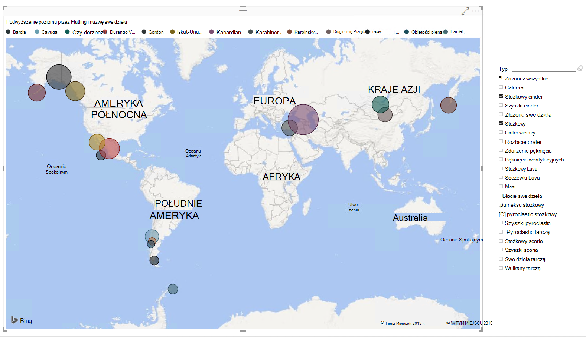

Wszystko gotowe do spróbuj? Rozpocznijmy pracę.

1. Uruchom Power BI Desktop w miejscu pracy.
2. Po uruchomieniu Power BI Desktop, zostanie wyświetlony ekran *powitalny* .

    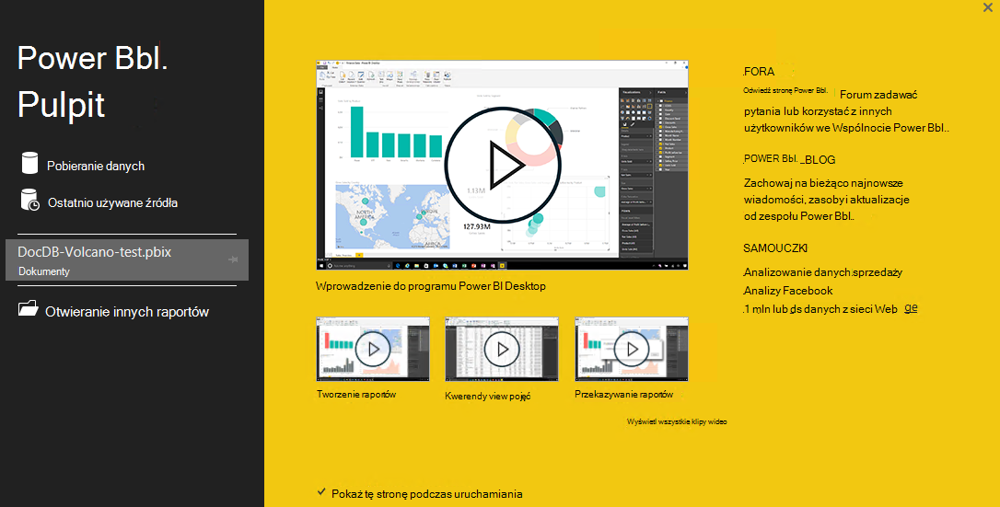

3. **Pobieranie danych**, zobacz **Ostatnio używane źródła**lub **Otwórz inne raporty** można bezpośrednio na ekranie *powitalnym* .  Kliknij przycisk X w prawym górnym rogu, aby zamknąć ekran. Zostanie wyświetlony widok **raportu** programu Power BI Desktop.

    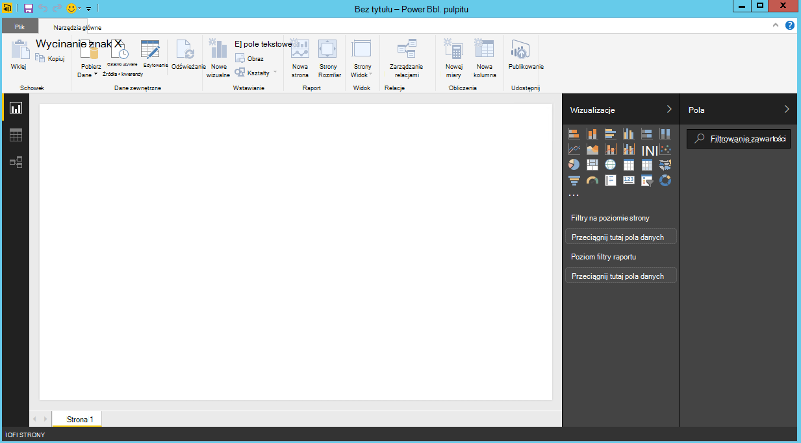

4. Wybierz na wstążce **Narzędzia główne** , a następnie wybierz polecenie **Pobierz dane**.  Okno **Pobieranie danych** powinien być wyświetlany.

5. Kliknij **Azure**, wybierz pozycję **Microsoft Azure DocumentDB (Beta)**, a następnie kliknij przycisk **Połącz**.  Okno **Programu Microsoft Azure DocumentDB łączenie** powinien być wyświetlany.

    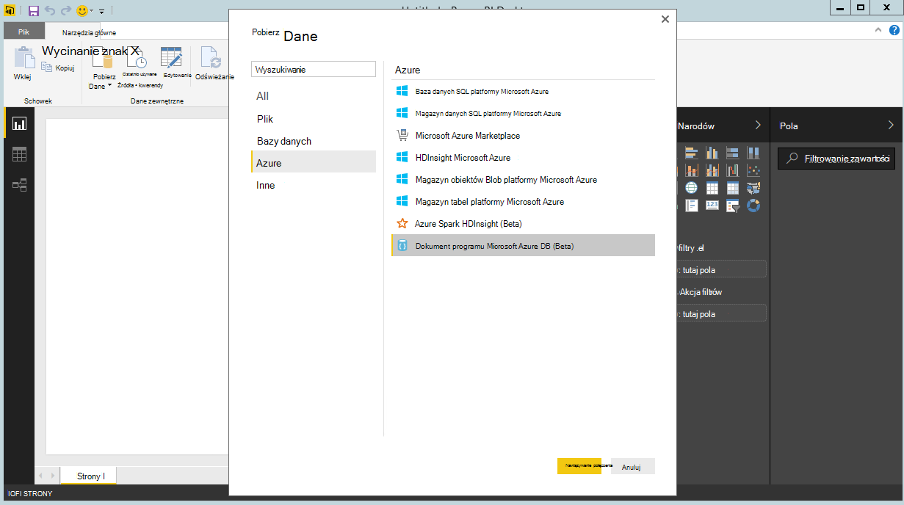

6. Określ adres URL punktu końcowego konta DocumentDB chcesz pobrać dane, tak jak pokazano poniżej, a następnie kliknij **przycisk OK**. Można pobrać adresu URL w polu Identyfikator URI w karta **[klawiszy](documentdb-manage-account.md#keys)** Azure portal lub można używać tego konta pokaz, w tym przypadku adres URL jest `https://analytics.documents.azure.com`. 

    Puste nazwy bazy danych, nazwa kolekcji i instrukcji SQL podczas te pola są opcjonalne.  Zamiast tego użyjemy Nawigatora do Wybieranie bazy danych i zbioru do identyfikowania, skąd pochodzą dane.

    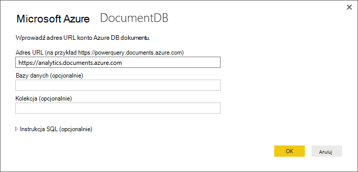

7. Jeśli łączysz tego punktu końcowego po raz pierwszy, zostanie wyświetlony monit o klucz konta.  W polu **Klucza podstawowego** w karta **[klucze tylko do odczytu](documentdb-manage-account.md#keys)** Azure portal, może pobrać klucz lub można użyć konta pokaz, w którym jest wielkość liter klucz `RcEBrRI2xVnlWheejXncHId6QRcKdCGQSW6uSUEgroYBWVnujW3YWvgiG2ePZ0P0TppsrMgscoxsO7cf6mOpcA==`. Wprowadź klucz konta i kliknij przycisk **Połącz**.

    Zalecamy, użyj klawisza tylko do odczytu, podczas tworzenia raportów.  Uniemożliwi to niepotrzebne narażenie klucza głównego potencjalne ryzyko związane z zabezpieczeniami. Klucz tylko do odczytu jest dostępna z karta [klawiszy](documentdb-manage-account.md#keys) portalu Azure lub można użyć informacji o koncie pokaz podanego powyżej.

    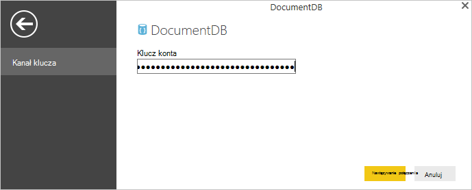

8. Po pomyślnym podłączeniu konta, pojawi się okno **Nawigator** .  **Nawigator** zostanie wyświetlona lista baz danych przy użyciu konta.
9. Kliknij i rozwiń w bazie danych dla raportu będzie skąd, jeśli korzystasz z konta pokaz, wybierz pozycję **volcanodb**.   

10. Teraz zaznacz zbiór, który pobiera dane z. Jeśli korzystasz z konta pokaz, wybierz pozycję **volcano1**.

    Okienko podglądu zawiera listę elementów **rekordu** .  Dokument jest reprezentowane jako typ **rekordu** w usłudze Power BI. Podobnie bloku JSON zagnieżdżone wewnątrz dokumentu jest również **rekordu**.

    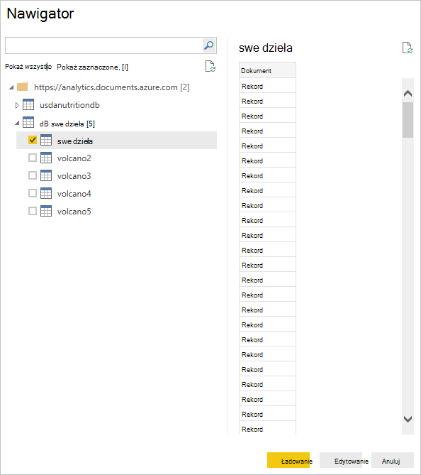

11. Kliknij przycisk **Edytuj** , aby uruchomić Edytor zapytań, więc możemy przekształcania danych.

## Spłaszczanie i przekształcanie JSON dokumentów
1. W Power BI Edytor zapytań, powinna być widoczna kolumny **dokumentu** w środkowym okienku.
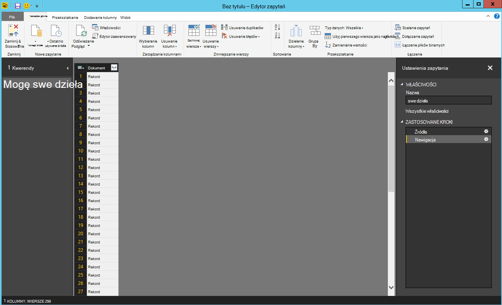

2. Polecenie rozwijania z prawej strony nagłówka kolumny **dokumentu** .  Menu kontekstowe z listą pól pojawi się.  Zaznacz pola, które są potrzebne do raportu, na przykład swe dzieła nazwę, kraju, regionu, lokalizację, podniesienie, typ, stan i ostatniego wybuchu wiedzieć, a następnie kliknij **przycisk OK**.

    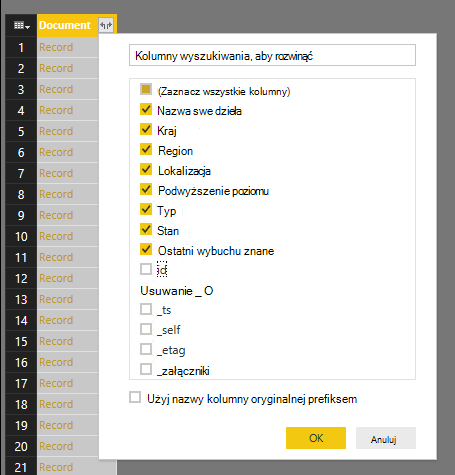

3. W okienku Centrum wyświetli podgląd wyników z polami zaznaczone.

    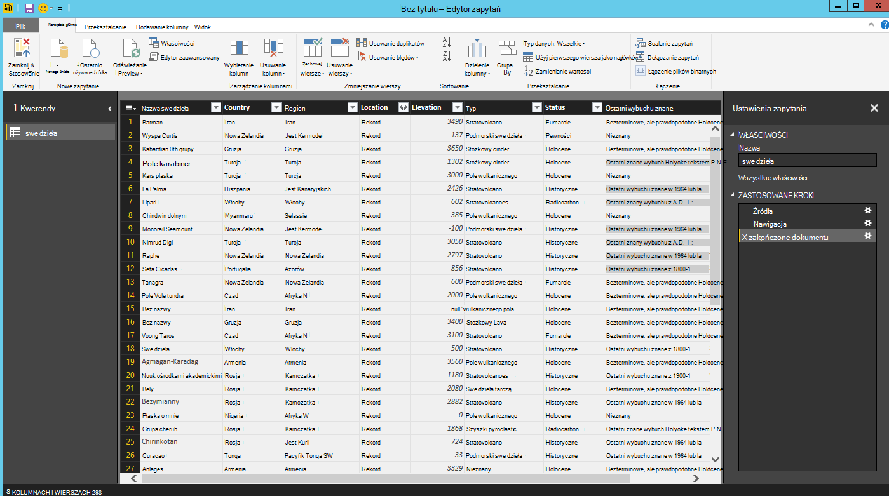

4. W naszym przykładzie właściwość lokalizacji jest blok GeoJSON w dokumencie.  Jak widać, lokalizacji jest reprezentowane jako typ **rekordu** w Power BI Desktop.  
5. Polecenie rozwijania z prawej strony nagłówka kolumny lokalizacji.  Menu kontekstowe z polami Typ i współrzędne pojawi się.  Załóżmy zaznacz pole współrzędnych i kliknij **przycisk OK**.

    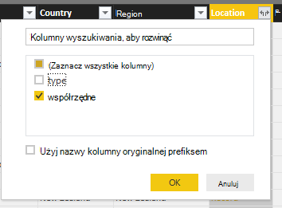

6. W okienku Centrum zawiera teraz współrzędne kolumny Typ **listy** .  Jak pokazano na początku samouczka, dane GeoJSON w ramach tego samouczka jest typu punkt wartości szerokości i długości geograficznej, rejestrowane w tablicy współrzędne.

    Element współrzędne [0] reprezentuje długości geograficznej podczas współrzędne [1] reprezentuje szerokości.
    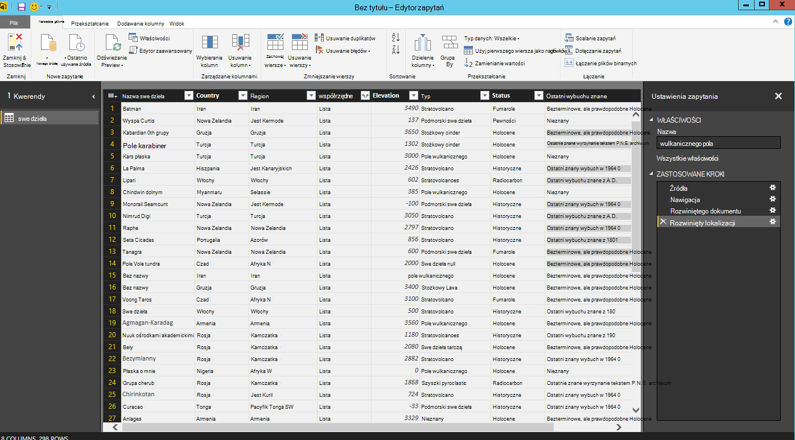

7. Aby spłaszczyć tablicy współrzędnych, zostanie utworzony **Niestandardowy kolumny** o nazwie LatLong.  Wybierz na wstążce **Dodaj kolumnę** i kliknij pozycję **Dodaj kolumnę niestandardową**.  Okno **Dodawanie kolumny niestandardowej** powinien być wyświetlany.

8. Podaj nazwę dla nowej kolumny, np. LatLong.

9. Następnie określ Formuła niestandardowa nowej kolumny.  W naszym przykładzie, możemy ZŁĄCZ.teksty wartości szerokości i długości geograficznej, oddzielając je spacją, tak jak pokazano poniżej za pomocą następującej formuły: `Text.From([Document.Location.coordinates]{1})&","&Text.From([Document.Location.coordinates]{0})`. Kliknij **przycisk OK**.

    Aby uzyskać więcej informacji na Data Analysis Expressions (DAX) w tym funkcje języka DAX odwiedź stronę [DAX podstawowe w Power BI Desktop](https://support.powerbi.com/knowledgebase/articles/554619-dax-basics-in-power-bi-desktop).

    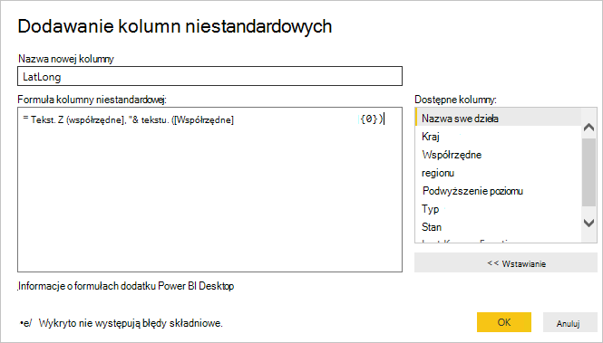

10. Teraz środkowym okienku zostanie wyświetlona nowa kolumna LatLong wypełnione wartościami szerokości i długości geograficznej, oddzielając je spacją.

    

    Jeśli zostanie wyświetlony komunikat o błędzie w nowej kolumnie, upewnij się, zgodność zastosowane kroki w obszarze Ustawienia zapytania poniższej ilustracji:

    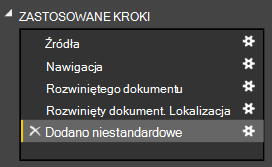

    Jeśli czynności do wykonania są różne, Usuń dodatkowe czynności i spróbuj ponownie dodać niestandardową kolumnę. 

11. Firma Microsoft zostało zakończone spłaszczanie dane w formacie tabelarycznym.  Możesz korzystać z wszystkich funkcji dostępnych w edytorze zapytań do kształtu i przekształcania danych w DocumentDB.  Jeśli korzystasz z próbki, Zmień typ danych o podniesienie uprawnień do **liczby całkowitej** , zmieniając **Typ danych** na wstążce **dla użytkowników domowych** .

    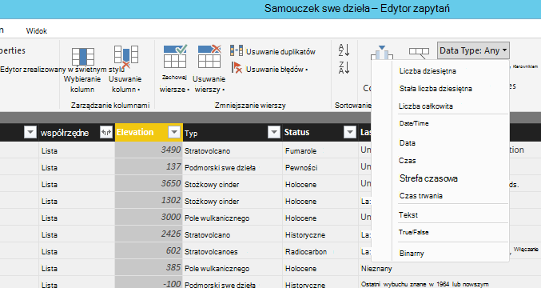

12. Kliknij pozycję **Zamknij i Zastosuj** do zapisania modelu danych.

    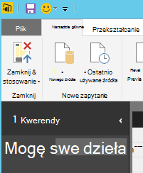

## Tworzenie raportów
Power BI Desktop raportu widoku to miejsce, w którym można utworzyć raporty wizualizowanie danych.  Można tworzyć raporty, przeciągając i upuszczając pola w obszarze roboczym **raportu** .

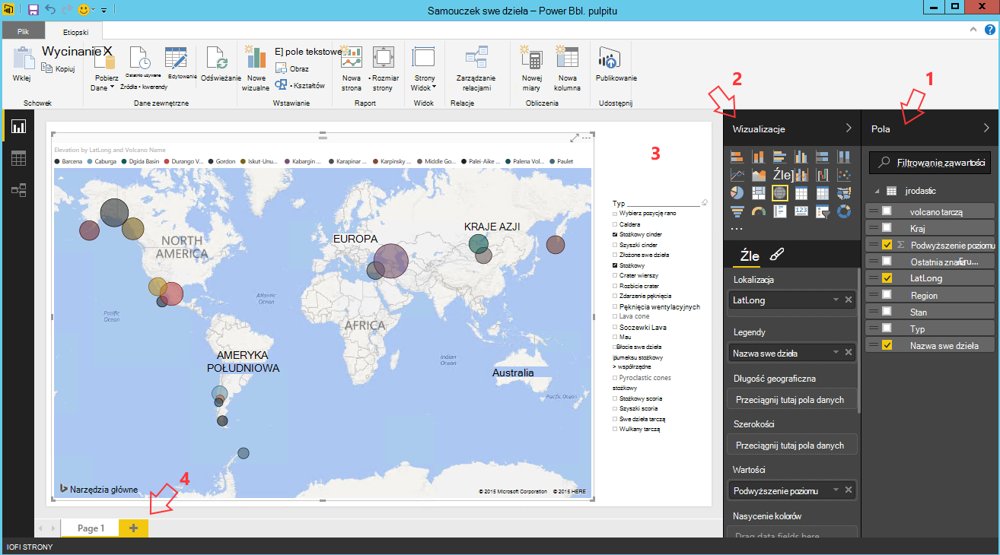

W widoku raportu powinien znajdować się:

 1. W okienku **pola** to miejsce, w którym będzie zostanie wyświetlona lista modeli danych z polami, które są dostępne dla raportów.

 2. Okienko **wizualizacji** . Raport może zawierać jednego lub wielu wizualizacji.  Wybierz typy wizualne dopasowanie do potrzeb z poziomu okienka **wizualizacji** .

 3. Obszar roboczy **raportu** to miejsce, w którym zostanie utworzona efekty wizualne raportu.

 4. Strony **raportu** . W Power BI Desktop, można dodać wiele stron raportu.

Poniżej przedstawiono podstawowe kroki tworzenia prostej interakcyjnych widoku raportu w formie mapy.

1. W naszym przykładzie zostanie utworzony widok mapy, przedstawiający położenie każdej swe dzieła.  W okienku **wizualizacje** kliknij typ wizualne mapy jako wyróżnione ekranu powyżej.  Powinien zostać wyświetlony typu wizualne mapy namalowane w obszarze roboczym **raportu** .  W okienku **wizualizacji** również powinien być wyświetlany zestaw właściwości powiązanych z typu wizualne mapy.

2. Teraz przeciągnij i upuść pola LatLong z poziomu okienka **pola** właściwość **lokalizacji** w okienku **wizualizacje** .
3. Następnie przeciągnij i upuść pola Nazwa swe dzieła właściwość **legendy** .  

4. Następnie przeciągnij i upuść pola podniesienie właściwość **rozmiar** .  

5. Powinien zostać wyświetlony mapy wizualne z zestawu bąbelki wskazujące położenie każdego swe dzieła Rozmiar bąbelka korelacji do podniesienia swe dzieła.

6. Utworzono teraz raportu podstawowego.  Możesz dostosować raport, dodając więcej wizualizacji.  W naszym przypadku dodana fragmentator typ swe dzieła nawiązać raportu interakcyjnego.  

    

## Publikowanie i udostępnianie raportu
Aby udostępnić raport, musi mieć konto w PowerBI.com.

1. W Power BI Desktop kliknij na wstążce **dla użytkowników domowych** .
2. Kliknij przycisk **Publikuj**.  Pojawi się wprowadź nazwę użytkownika i hasło do konta PowerBI.com.
3. Po uwierzytelnieniu poświadczeń, raport opublikowane do wybranego miejsca docelowego.
4. Kliknij pozycję **Otwórz "PowerBITutorial.pbix" w usłudze Power BI** , aby wyświetlić i udostępnić raport na PowerBI.com.

    

## Tworzenie pulpitu nawigacyjnego w PowerBI.com

Teraz, gdy masz raportu umożliwia, udostępnij go w usłudze PowerBI.com

Opublikowanie raportu z Power BI Desktop, aby PowerBI.com generuje **raport** i **zestawu danych** w dzierżawie PowerBI.com. Na przykład po opublikowaniu raportu o nazwie **PowerBITutorial** do PowerBI.com PowerBITutorial w sekcjach **raportów** i **zestawów danych** na pojawi PowerBI.com.

   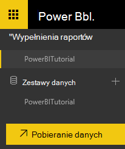

Aby utworzyć zabezpieczać pulpitu nawigacyjnego, kliknij przycisk **Strony Live numeru Pin** w raporcie PowerBI.com.

   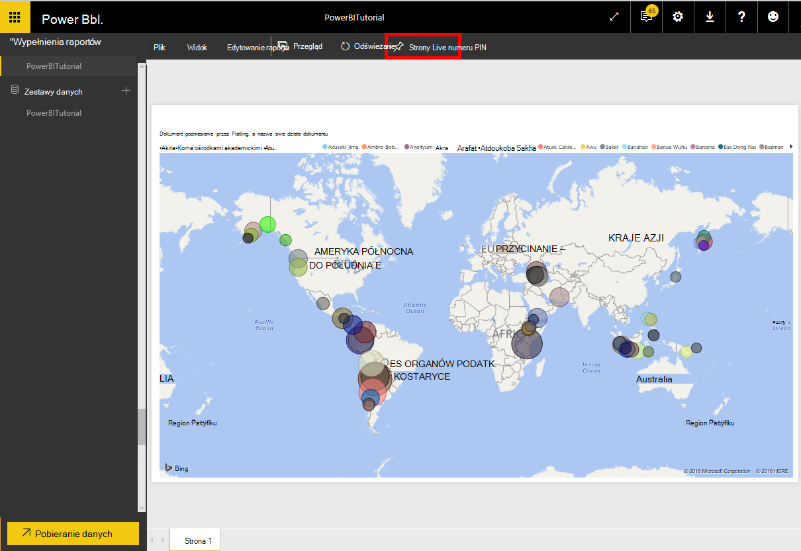

Następnie postępuj zgodnie z instrukcjami [Przypinanie kafelka z raportu](https://powerbi.microsoft.com/documentation/powerbi-service-pin-a-tile-to-a-dashboard-from-a-report/#pin-a-tile-from-a-report) , aby utworzyć nowy pulpit nawigacyjny. 

Spontaniczne modyfikacje do raportu można też wykonać przed utworzeniem pulpitu nawigacyjnego. Jednak zaleca się używanie Power BI Desktop do wykonywania zmian i ponowne publikowanie raportu do PowerBI.com.

## Odświeżanie danych w PowerBI.com

Istnieją dwa sposoby, aby odświeżyć dane, ad hoc i według harmonogramu.

Odświeżanie ad hoc po prostu kliknij eclipses (...), **zestawu danych**, np. PowerBITutorial. Należy wyświetlić listę działań w tym **Odśwież teraz**. Kliknij pozycję **Odśwież teraz** odświeżyć dane.

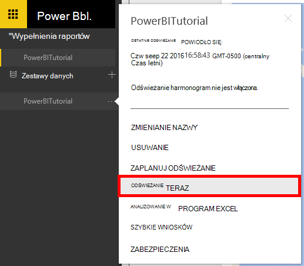

Zaplanowane odświeżanie wykonaj następujące czynności.

1. Kliknij pozycję **Zaplanuj odświeżanie** na liście akcji. 
    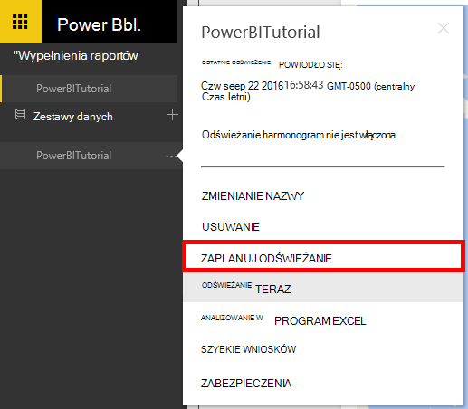

2. Na stronie **Ustawienia** rozwiń **poświadczeń źródła danych**. 

3. Kliknij pozycję Edytuj **poświadczenia**. 

    Zostanie wyświetlone menu podręczne Konfiguruj. 

4. Wprowadź klucz do nawiązania połączenia z kontem DocumentDB w tym zestawie danych, a następnie kliknij przycisk **Zaloguj**. 

5. Rozwiń pozycję **Zaplanuj odświeżanie** i ustaw harmonogram chcesz odświeżyć zestawu danych. 
  
6. Kliknij przycisk **Zastosuj,** a po zakończeniu konfigurowania zaplanowane odświeżanie.

## Następne kroki
- Aby dowiedzieć się więcej o usłudze Power BI, zobacz [Wprowadzenie do usługi Power BI](https://powerbi.microsoft.com/documentation/powerbi-service-get-started/).
- Aby dowiedzieć się więcej na temat DocumentDB, zapoznaj się z [dokumentacją DocumentDB strona początkowa](https://azure.microsoft.com/documentation/services/documentdb/).
