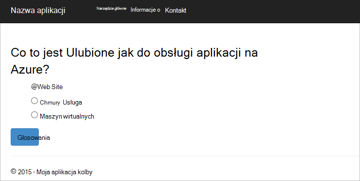

<properties
    pageTitle="Programowania aplikacji sieci Web kolby Python z DocumentDB | Microsoft Azure"
    description="Przejrzyj samouczek bazy danych przy użyciu DocumentDB do przechowywania i udostępniania danych z aplikacji sieci web kolby Python hostowanej Azure. Znajdowanie aplikacji rozwiązań." 
    keywords="Opracowywania aplikacji, baza danych — samouczek, kolby python, python aplikacji sieci web, tworzenia sieci web python, documentdb, azure, platformy Microsoft azure"
    services="documentdb"
    documentationCenter="python"
    authors="syamkmsft"
    manager="jhubbard"
    editor="cgronlun"/>

<tags
    ms.service="documentdb"
    ms.workload="data-management"
    ms.tgt_pltfrm="na"
    ms.devlang="python"
    ms.topic="hero-article"
    ms.date="08/25/2016"
    ms.author="syamk"/>

# <a name="python-flask-web-application-development-with-documentdb"></a>Programowania aplikacji sieci Web kolby Python z DocumentDB

> [AZURE.SELECTOR]
- [.NET](documentdb-dotnet-application.md)
- [Node.js](documentdb-nodejs-application.md)
- [Java](documentdb-java-application.md)
- [Python](documentdb-python-application.md)

Ten samouczek pokazano, jak używać Azure DocumentDB do przechowywania i danych programu access z Python hostowanej Azure aplikacji sieci web i przyjęto założenie, że niektóre wcześniejszego doświadczenia w korzystaniu Python i Azure witryn sieci Web.

Ten samouczek bazy danych obejmuje:

1. Tworzenie i inicjowania obsługi administracyjnej konta DocumentDB.
2. Tworzenie aplikacji Python MVC.
3. Nawiązywanie połączenia i przy użyciu Azure DocumentDB aplikacji sieci web.
4. Wdrażanie aplikacji sieci web z witryny sieci Web Azure.

Wykonując tego samouczka, zostanie utworzona prostych aplikacji głosowania, która pozwala głosu ankiety.


## <a name="database-tutorial-prerequisites"></a>Wymagania wstępne dotyczące samouczka bazy danych

Przed zgodnie z instrukcjami zawartymi w tym artykule, należy sprawdzić, czy masz zainstalowane następujące elementy:

- Konto Azure active. Jeśli nie masz konta, możesz utworzyć bezpłatne konto wersji próbnej na kilka minut. Aby uzyskać szczegółowe informacje zobacz [Azure bezpłatnej wersji próbnej](https://azure.microsoft.com/pricing/free-trial/).
- [Visual Studio 2013](http://www.visualstudio.com/) lub nowszym, lub [Program Visual Studio Express](), która jest bezpłatna wersja. Z instrukcjami podanymi w tym samouczku są napisane specjalnie dla programu Visual Studio 2015 r. 
- Narzędzia Python programu Visual Studio z [GitHub](http://microsoft.github.io/PTVS/). Ten samouczek używa narzędzia Python w PORÓWNANIU z 2015 r. 
- Zestaw SDK programu Visual Studio, wersji 2,4 lub nowszej Azure Python udostępniany przez firmę [azure.com](https://azure.microsoft.com/downloads/). Firma Microsoft na potrzeby Microsoft Azure SDK Python 2.7.
- Python 2.7 z [python.org][2]. Użyliśmy Python 2.7.11. 

> [AZURE.IMPORTANT] Jeśli instalujesz Python 2.7 po raz pierwszy, upewnij się, na ekranie Dostosowywanie Python 2.7.11 wybranym **Dodawanie python.exe do ścieżki**.
> 
>    

- Microsoft Visual C++ kompilatora dla Python 2.7 z [Centrum pobierania Microsoft][3].

## <a name="step-1-create-a-documentdb-database-account"></a>Krok 1: Utwórz konto DocumentDB bazy danych

Zacznijmy od Tworzenie konta DocumentDB. Jeśli masz już konto, możesz przejść do [Krok 2: Tworzenie nowej aplikacji sieci web Python kolby](#step-2:-create-a-new-python-flask-web-application).

[AZURE.INCLUDE [documentdb-create-dbaccount](../../includes/documentdb-create-dbaccount.md)]

<br/>
Teraz możemy przeprowadzi przez umożliwiające utworzenie nowej aplikacji sieci web kolby Python od podstaw w górę.

## <a name="step-2-create-a-new-python-flask-web-application"></a>Krok 2: Tworzenie nowej aplikacji sieci web kolby Python

1. W programie Visual Studio, w menu **plik** wskaż polecenie **Nowy**, a następnie kliknij **Projekt**.

    Zostanie wyświetlone okno dialogowe **Nowy projekt** .

2. W okienku po lewej stronie rozwiń **Szablony** , a następnie **Python**, a następnie kliknij **sieci Web**. 

3. Wybierz **Projekt Web kolby** w środkowym okienku, następnie w **nazwę** pola typu **Samouczek**, a następnie kliknij **przycisk OK**. Należy pamiętać, nazwy pakietu Python należy pisany wyłącznie małymi literami, zgodnie z opisem w [Stylu — przewodnik dotyczący Python kodu](https://www.python.org/dev/peps/pep-0008/#package-and-module-names).

    W przypadku tych nowych do kolby Python jest struktura opracowywania aplikacji sieci web, która ułatwia tworzenie aplikacji sieci web w Python szybciej.

    

4. W oknie **Narzędzia Python programu Visual Studio** kliknij przycisk **Zainstaluj do wirtualnego środowiska**. 

    

5. W oknie **Dodawanie środowisko wirtualne** można Zaakceptuj ustawienia domyślne i używać Python 2.7 jako podstawa środowiska, ponieważ PyDocumentDB nie obsługuje obecnie Python 3.x, a następnie kliknij przycisk **Utwórz**. Konfiguruje wymagane środowiska wirtualnego Python projektu.

    

    Wyświetlany w oknie output `Successfully installed Flask-0.10.1 Jinja2-2.8 MarkupSafe-0.23 Werkzeug-0.11.5 itsdangerous-0.24 'requirements.txt' was installed successfully.` po pomyślnym zainstalowaniu środowiska.

## <a name="step-3-modify-the-python-flask-web-application"></a>Krok 3: Modyfikowanie kolby Python aplikacji sieci web

### <a name="add-the-python-flask-packages-to-your-project"></a>Dodawanie pakietów Python kolby do projektu

Po skonfigurowaniu projektu, musisz dodać wymagane pakiety kolby do projektu, w tym pydocumentdb, pakiet Python DocumentDB.

1. W oknie Eksplorator rozwiązań Otwórz plik o nazwie **requirements.txt** i zastąpić zawartość z następujących czynności:

        flask==0.9
        flask-mail==0.7.6
        sqlalchemy==0.7.9
        flask-sqlalchemy==0.16
        sqlalchemy-migrate==0.7.2
        flask-whooshalchemy==0.55a
        flask-wtf==0.8.4
        pytz==2013b
        flask-babel==0.8
        flup
        pydocumentdb>=1.0.0

2. Zapisz plik **requirements.txt** . 
3. W oknie Eksplorator rozwiązań **Koperta** kliknij prawym przyciskiem myszy, a następnie kliknij opcję **Zainstaluj z requirements.txt**.

    

    Po pomyślnym zainstalowaniu okno dane wyjściowe wyświetli następujące informacje:

        Successfully installed Babel-2.3.2 Tempita-0.5.2 WTForms-2.1 Whoosh-2.7.4 blinker-1.4 decorator-4.0.9 flask-0.9 flask-babel-0.8 flask-mail-0.7.6 flask-sqlalchemy-0.16 flask-whooshalchemy-0.55a0 flask-wtf-0.8.4 flup-1.0.2 pydocumentdb-1.6.1 pytz-2013b0 speaklater-1.3 sqlalchemy-0.7.9 sqlalchemy-migrate-0.7.2

    > [AZURE.NOTE] Czasami może zostać wyświetlony błąd w oknie dane wyjściowe. W takim przypadku należy sprawdzić, jeśli komunikat o błędzie jest powiązana z oczyszczania. Czasami Oczyszczanie kończy się niepowodzeniem, ale instalacji nadal będzie pomyślnego (przewijania w górę w oknie dane wyjściowe, aby to sprawdzić). Możesz sprawdzić instalacji sprawdzając [wirtualnego środowiska](#verify-the-virtual-environment). Jeśli instalacja nie powiodła się, ale weryfikacja zakończy się powodzeniem, jest OK, aby kontynuować.

### <a name="verify-the-virtual-environment"></a>Sprawdź środowisko wirtualne

Załóżmy upewnij się, że wszystko zostało zainstalowane poprawnie.

1. Utworzyć rozwiązanie, naciskając klawisze **Ctrl**+**Shift**+**B**.
2. Po pomyślnym kompilowanie rozpocząć witryny sieci Web, naciskając klawisz **F5**. To uruchamianie serwera rozwoju kolby oraz uruchomienie przeglądarki sieci web. Zobacz następującą stronę.

    

3. Zatrzymaj debugowanie w witrynie sieci Web, naciskając klawisze **Shift**+**F5** w programie Visual Studio.

### <a name="create-database-collection-and-document-definitions"></a>Tworzenie bazy danych, zbioru i definicji dokumentu

Teraz tworzenie aplikacji głosowania przez dodanie nowych plików i zaktualizowanie innych osób.

1. W Eksploratorze rozwiązań kliknij prawym przyciskiem myszy **Samouczek** projektu, kliknij przycisk **Dodaj**, a następnie kliknij **Nowy element**. Wybierz **Pusty plik Python** i nazwę pliku **forms.py**.  
2. Dodaj następujący kod do pliku forms.py, a następnie zapisz ten plik.

```python
from flask.ext.wtf import Form
from wtforms import RadioField

class VoteForm(Form):
    deploy_preference  = RadioField('Deployment Preference', choices=[
        ('Web Site', 'Web Site'),
        ('Cloud Service', 'Cloud Service'),
        ('Virtual Machine', 'Virtual Machine')], default='Web Site')
```


### <a name="add-the-required-imports-to-viewspy"></a>Dodawanie wymaganych importowanie plików do views.py

1. W Eksploratorze rozwiązań rozwiń folder **samouczka** i Otwórz plik **views.py** . 
2. Dodaj następujące importować instrukcje na początek pliku **views.py** , a następnie zapisz plik. Zaimportować te osoby DocumentDB PythonSDK i pakietów kolby.

    ```python
    from forms import VoteForm
    import config
    import pydocumentdb.document_client as document_client
    ```


### <a name="create-database-collection-and-document"></a>Tworzenie bazy danych, zbioru i dokumentów

- Nadal w **views.py**Dodaj poniższy kod na końcu pliku. Przejście to istotnych tworzenia bazę danych używaną w formularzu. Nie usuwaj żadnych istniejących kodu w **views.py**. Po prostu dołączyć to na końcu.

```python
@app.route('/create')
def create():
    """Renders the contact page."""
    client = document_client.DocumentClient(config.DOCUMENTDB_HOST, {'masterKey': config.DOCUMENTDB_KEY})

    # Attempt to delete the database.  This allows this to be used to recreate as well as create
    try:
        db = next((data for data in client.ReadDatabases() if data['id'] == config.DOCUMENTDB_DATABASE))
        client.DeleteDatabase(db['_self'])
    except:
        pass

    # Create database
    db = client.CreateDatabase({ 'id': config.DOCUMENTDB_DATABASE })

    # Create collection
    collection = client.CreateCollection(db['_self'],{ 'id': config.DOCUMENTDB_COLLECTION })

    # Create document
    document = client.CreateDocument(collection['_self'],
        { 'id': config.DOCUMENTDB_DOCUMENT,
          'Web Site': 0,
          'Cloud Service': 0,
          'Virtual Machine': 0,
          'name': config.DOCUMENTDB_DOCUMENT 
        })

    return render_template(
       'create.html',
        title='Create Page',
        year=datetime.now().year,
        message='You just created a new database, collection, and document.  Your old votes have been deleted')
```

> [AZURE.TIP] Metoda **CreateCollection** pobiera opcjonalne **RequestOptions** jako trzeciego parametru. To pozwala określić typ oferują zbioru. Jeżeli wartość offerType nie jest podany, następnie kolekcji zostanie utworzony przy użyciu domyślnego typu oferty. Więcej informacji o typach oferują DocumentDB można znaleźć w temacie [poziomy wydajności w DocumentDB](documentdb-performance-levels.md).


### <a name="read-database-collection-document-and-submit-form"></a>Przeczytaj bazy danych, zbioru, dokumentów i przesyłanie formularza

- Nadal w **views.py**Dodaj poniższy kod na końcu pliku. Przejście to istotnych konfigurowania formularzu odczytu bazy danych, zbioru i dokument. Nie usuwaj żadnych istniejących kodu w **views.py**. Po prostu dołączyć to na końcu.

```python
@app.route('/vote', methods=['GET', 'POST'])
def vote(): 
    form = VoteForm()
    replaced_document ={}
    if form.validate_on_submit(): # is user submitted vote  
        client = document_client.DocumentClient(config.DOCUMENTDB_HOST, {'masterKey': config.DOCUMENTDB_KEY})

        # Read databases and take first since id should not be duplicated.
        db = next((data for data in client.ReadDatabases() if data['id'] == config.DOCUMENTDB_DATABASE))

        # Read collections and take first since id should not be duplicated.
        coll = next((coll for coll in client.ReadCollections(db['_self']) if coll['id'] == config.DOCUMENTDB_COLLECTION))

        # Read documents and take first since id should not be duplicated.
        doc = next((doc for doc in client.ReadDocuments(coll['_self']) if doc['id'] == config.DOCUMENTDB_DOCUMENT))

        # Take the data from the deploy_preference and increment our database
        doc[form.deploy_preference.data] = doc[form.deploy_preference.data] + 1
        replaced_document = client.ReplaceDocument(doc['_self'], doc)

        # Create a model to pass to results.html
        class VoteObject:
            choices = dict()
            total_votes = 0

        vote_object = VoteObject()
        vote_object.choices = {
            "Web Site" : doc['Web Site'],
            "Cloud Service" : doc['Cloud Service'],
            "Virtual Machine" : doc['Virtual Machine']
        }
        vote_object.total_votes = sum(vote_object.choices.values())

        return render_template(
            'results.html', 
            year=datetime.now().year, 
            vote_object = vote_object)

    else :
        return render_template(
            'vote.html', 
            title = 'Vote',
            year=datetime.now().year,
            form = form)
```


### <a name="create-the-html-files"></a>Tworzenie plików HTML

1. W oknie Eksplorator rozwiązań w folderze **Samouczek** kliknij prawym przyciskiem myszy folder **szablonów** , kliknij przycisk **Dodaj**, a następnie kliknij **Nowy element**. 
2. Wybierz **Stronę HTML**, a następnie w polu Nazwa wpisz **create.html**. 
3. Powtórz kroki 1 i 2, aby utworzyć dwa dodatkowe pliki HTML: results.html i vote.html.
4. Dodaj następujący kod do **create.html** w `<body>` elementu. Wyświetli komunikat z informacją, możemy utworzyć nowej bazy danych, zbioru i dokument.

    ```html
    
    
    <h2>{{ title }}.</h2>
    <h3>{{ message }}</h3>
    <p><a href="{{ url_for('vote') }}" class="btn btn-primary btn-large">Vote &raquo;</a></p>
    
    ```

5. Dodaj następujący kod do **results.html** w `<body`> element. Wyświetla wyniki ankiety.

    ```html
    
    
    <h2>Results of the vote</h2>
        <br />
        
    
    <div class="row">
        <div class="col-sm-5">{{choice}}</div>
            <div class="col-sm-5">
                <div class="progress">
                    <div class="progress-bar" role="progressbar" aria-valuenow="{{vote_object.choices[choice]}}" aria-valuemin="0" aria-valuemax="{{vote_object.total_votes}}" style="width: {{(vote_object.choices[choice]/vote_object.total_votes)*100}}%;">
                                {{vote_object.choices[choice]}}
                </div>
            </div>
            </div>
    </div>
    
    
    <br />
    <a class="btn btn-primary" href="{{ url_for('vote') }}">Vote again?</a>
    
    ```

6. Dodaj następujący kod do **vote.html** w `<body`> element. Wyświetla ankiety, a akceptuje głosów. Na rejestrowanie głosów i kontrolki są przekazywane do views.py miejsce, w którym możemy rozpozna cast głos i w związku z tym Dołączanie dokumentu.

    ```html
    
    
    <h2>What is your favorite way to host an application on Azure?</h2>
    <form action="" method="post" name="vote">
        {{form.hidden_tag()}}
            {{form.deploy_preference}}
            <button class="btn btn-primary" type="submit">Vote</button>
    </form>
    
    ```

7. W folderze **Szablony** Zamień zawartość **index.html** następujące czynności. To służy strona główna aplikacji.
    
    ```html
    
    
    <h2>Python + DocumentDB Voting Application.</h2>
    <h3>This is a sample DocumentDB voting application using PyDocumentDB</h3>
    <p><a href="{{ url_for('create') }}" class="btn btn-primary btn-large">Create/Clear the Voting Database &raquo;</a></p>
    <p><a href="{{ url_for('vote') }}" class="btn btn-primary btn-large">Vote &raquo;</a></p>
    
    ```

### <a name="add-a-configuration-file-and-change-the-initpy"></a>Dodawanie pliku konfiguracji i zmień \_ \_inicjowania\_\_.py

1. W Eksploratorze rozwiązań kliknij prawym przyciskiem myszy **Samouczek** projektu, kliknij przycisk **Dodaj**, kliknij przycisk **Nowy element**, wybierz **Pusty plik Python**i nadaj nazwę pliku **config.py**. Ten plik konfiguracji jest wymagany przez formularzy w kolbie. Umożliwia jego zapewniają również klucz tajny. Ten klucz nie jest jednak wymagany dla tego samouczka.

2. Dodaj następujący kod do config.py, musisz zmienić wartości **DOCUMENTDB\_hosta** i **DOCUMENTDB\_klucza** w następnym kroku.

    ```python
    CSRF_ENABLED = True
    SECRET_KEY = 'you-will-never-guess'
    
    DOCUMENTDB_HOST = 'https://YOUR_DOCUMENTDB_NAME.documents.azure.com:443/'
    DOCUMENTDB_KEY = 'YOUR_SECRET_KEY_ENDING_IN_=='
    
    DOCUMENTDB_DATABASE = 'voting database'
    DOCUMENTDB_COLLECTION = 'voting collection'
    DOCUMENTDB_DOCUMENT = 'voting document'
    ```

3. W [portalu Azure](https://portal.azure.com/)przejdź do karta **klawiszy** , klikając pozycję **Przeglądaj**, **DocumentDB kont**, kliknij dwukrotnie nazwę konta, aby użyć, a następnie kliknij przycisk **klawiszy** w obszarze **Essentials** . Karta **klawiszy** skopiuj wartość **identyfikatora URI** i wklej go do pliku **config.py** jako wartość **DOCUMENTDB\_hosta** właściwości. 
4. Ponownie w portalu Azure karta **klawiszy** skopiowanie wartości **Klucza podstawowego** lub **Klucza pomocniczego**i wklej je do pliku **config.py** jako wartość **DOCUMENTDB\_klucza** właściwości.
5. W ** \_ \_inicjowania\_\_.py** plików, Dodaj poniższy wiersz. 

        app.config.from_object('config')

    Tak, aby zawartość pliku:

    ```python
    from flask import Flask
    app = Flask(__name__)
    app.config.from_object('config')
    import tutorial.views
    ```

6. Po dodaniu wszystkich plików, Eksploratora rozwiązań powinna wyglądać następująco:

    


## <a name="step-4-run-your-web-application-locally"></a>Krok 4: Uruchamianie aplikacji sieci web lokalnie

1. Utworzyć rozwiązanie, naciskając klawisze **Ctrl**+**Shift**+**B**.
2. Po pomyślnym kompilacja rozpocząć witryny sieci Web, naciskając klawisz **F5**. Na ekranie, należy zapoznać się z następującymi.

    

3. Kliknij pozycję **Utwórz/wyczyszczenie głosowania bazy danych** do generowania bazy danych.

    

4. Następnie kliknij pozycję **głos** i wybierz odpowiednią opcję.

    

5. Dla każdej głos, które możesz zrzutowania go zwiększa odpowiedni licznik.

    

6. Zatrzymaj debugowanie projektu, naciskając klawisze Shift + F5.

## <a name="step-5-deploy-the-web-application-to-azure-websites"></a>Krok 5: Wdrażanie aplikacji sieci web z witryny sieci Web Azure

Teraz, gdy masz pełną aplikacji działają poprawnie przed DocumentDB, możemy zacząć wdrażanie to Azure witryn sieci Web.

1. Kliknij prawym przyciskiem myszy projektu w Eksploratorze rozwiązań (Upewnij się, że nie jest nadal uruchomiony lokalnie) i wybierz pozycję **Publikuj**.  

    

2. W oknie **Publikowanie sieci Web** wybierz pozycję **Microsoft Azure Web Apps**, a następnie kliknij **Dalej**.

    

3. W oknie **Okno aplikacji sieci Web programu Microsoft Azure** kliknij przycisk **Nowy**.

    

4. W oknie **Utwórz w witrynie Microsoft Azure** wprowadź **nazwę aplikacji sieci Web**, **plan usług aplikacji**, **Grupa zasobów**i **Region**, a następnie kliknij przycisk **Utwórz**.

    

5. W oknie **Publikowanie sieci Web** kliknij pozycję **Publikuj**.

    

3. W ciągu kilku sekund Visual Studio Zakończ publikowanie aplikacji sieci web i przeglądarki, w której są wyświetlane pod ręką pracy z platformy Azure!

## <a name="troubleshooting"></a>Rozwiązywanie problemów

Jeśli jest to pierwszy aplikacji Python uruchomienia na komputerze, upewnij się, że następujące foldery (lub lokalizacji instalacji równoważne) są uwzględniane w swojej zmiennej PATH:

    C:\Python27\site-packages;C:\Python27\;C:\Python27\Scripts;

Jeśli komunikat o błędzie na stronie głos i nazwę projektu, innej niż **Samouczek**, upewnij się, że ** \_ \_inicjowania\_\_.py** odwołuje się do nazwy poprawne projektu w wierszu: `import tutorial.view`.

## <a name="next-steps"></a>Następne kroki

Gratulacje! Masz tylko wykonane pierwszego Python aplikacji sieci web przy użyciu Azure DocumentDB i opublikowany go do Azure witryn sieci Web.

Firma Microsoft aktualizowania i ulepszania w tym temacie często na podstawie tych informacji.  Gdy koniec samouczka, należy za pomocą przycisków głosowania u góry i u dołu tej strony, a następnie należy uwzględnić opinie na temat wprowadzone ulepszenia, które mają być wyświetlane. Jeśli chcesz, abyśmy skontaktować się z Tobą bezpośrednio, zachęcamy do Podaj swój adres e-mail w komentarzach.

Aby dodać dodatkowe funkcje aplikacji sieci web, przejrzyj dostępne w zestawie [DocumentDB Python SDK](documentdb-sdk-python.md)API.

Aby uzyskać więcej informacji na temat Azure Visual Studio i Python, zobacz [Centrum deweloperów Python](https://azure.microsoft.com/develop/python/). 

Dodatkowe samouczki kolby Python, zobacz [kolby jakość-samouczka części I: Witaj, świecie!](http://blog.miguelgrinberg.com/post/the-flask-mega-tutorial-part-i-hello-world). 

  [Visual Studio Express]: http://www.visualstudio.com/products/visual-studio-express-vs.aspx
  [2]: https://www.python.org/downloads/windows/
  [3]: https://www.microsoft.com/download/details.aspx?id=44266
  [Microsoft Web Platform Installer]: http://www.microsoft.com/web/downloads/platform.aspx
  [Azure portal]: http://portal.azure.com
