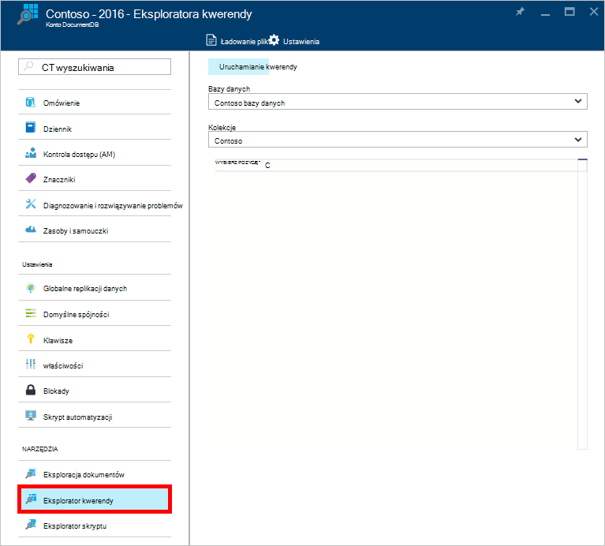
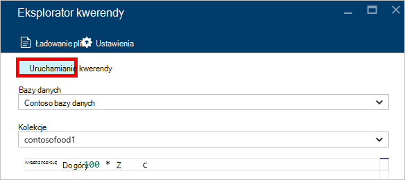
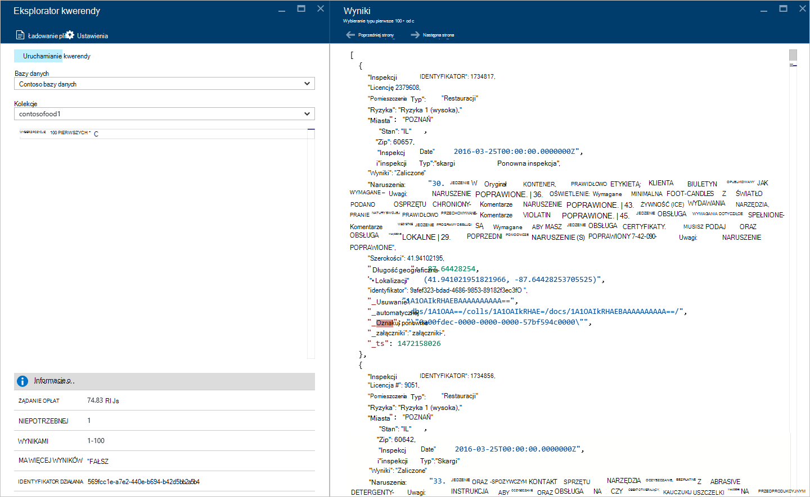
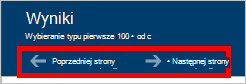
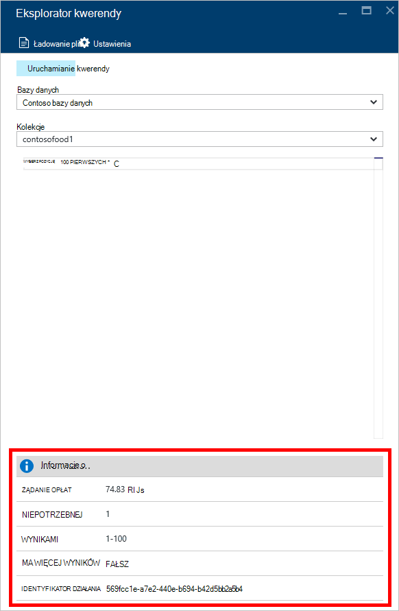
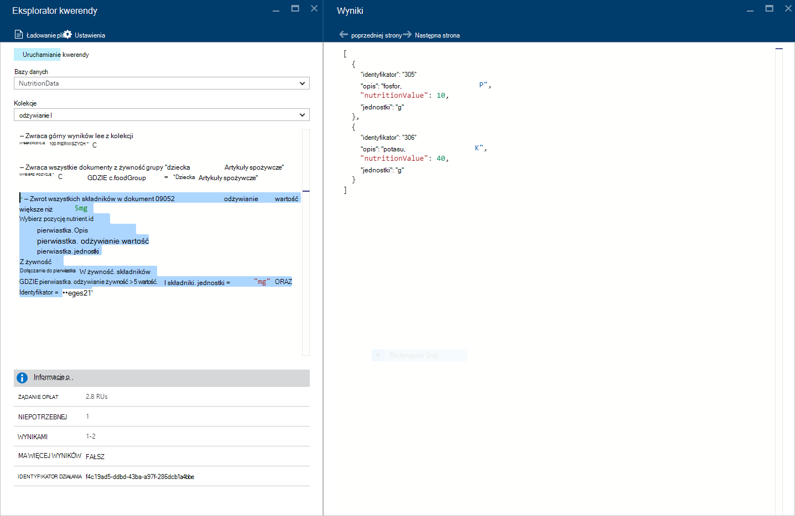
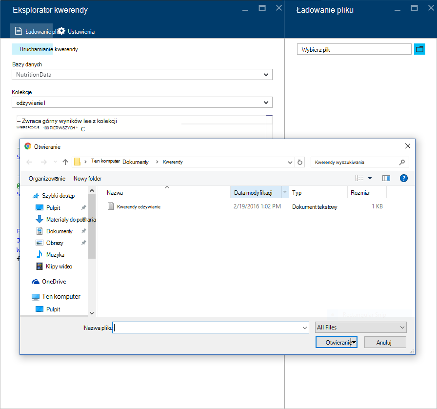
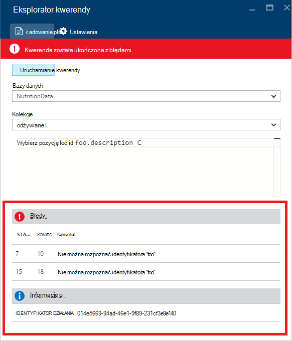

<properties
    pageTitle="Kwerendy DocumentDB Explorer: SQL edytora zapytań | Microsoft Azure"
    description="Informacje na temat Eksploratorze kwerendy DocumentDB edytora zapytań SQL, w portalu Azure pisania zapytania SQL i uruchamiania ich przed zbioru NoSQL DocumentDB."
    keywords="pisanie edytora zapytań sql kwerendy sql"
    services="documentdb"
    authors="kirillg"
    manager="jhubbard"
    editor="monicar"
    documentationCenter=""/>

<tags
    ms.service="documentdb"
    ms.workload="data-services"
    ms.tgt_pltfrm="na"
    ms.devlang="na"
    ms.topic="article"
    ms.date="08/30/2016"
    ms.author="kirillg"/>

# Pisanie, edytowanie i uruchamianie zapytania SQL dla DocumentDB za pomocą Eksploratora kwerendy 

Ten artykuł zawiera omówienie [Microsoft Azure DocumentDB](https://azure.microsoft.com/services/documentdb/) zapytania Eksploratora, narzędzie portal Azure umożliwia pisanie, edytowanie i uruchom na [zbioru DocumentDB](documentdb-create-collection.md)kwerendy SQL.

1. W portalu Azure w Jumpbar kliknij przycisk **DocumentDB (NoSQL)**. Jeśli **DocumentDB (NoSQL)** nie jest widoczne, kliknij przycisk **Więcej usług** , a następnie kliknij pozycję **DocumentDB (NoSQL)**.

2. W menu zasobów kliknij pozycję **Eksplorator kwerendy**. 

    

3. W karta **Eksploratora kwerendy** wybierz **baz danych** i **zbiorów** do kwerendy z list rozwijanych, a następnie wpisz zapytania, aby uruchomić. 

    List rozwijanych **baz danych** i **zbiorów** są wstępnie wypełnione w zależności od kontekstu, w którym uruchamiania Eksploratora kwerendy. 

    Kwerendę domyślną z `SELECT TOP 100 * FROM c` znajduje się.  Można zaakceptować kwerendę domyślną lub skonstruować własną kwerendę za pomocą języka kwerend SQL opisane w artykule [zapytania SQL i składni języka SQL](documentdb-sql-query.md) lub [kwerendy SQL cheat arkusza](documentdb-sql-query-cheat-sheet.md) .

    Kliknij przycisk **Uruchom kwerendę** , aby wyświetlić wyniki.

    

4. Karta **wyników** są wyświetlane wyniki kwerendy. 

    

## Praca z wyników

Domyślnie Eksploratora kwerenda zwraca wyniki zestawów 100.  Jeśli kwerenda tworzy więcej niż 100 wyniki, po prostu użyć polecenia **Następna strona** lub **Poprzednia strona** do nawigowania w zestawie wyników.

W celu pomyślnego kwerend okienko **informacji** zawiera metryki, takie jak opłaty żądanie, liczba niepotrzebnej kwerendy należy zestawu wyników aktualnie pokazywane, i czy istnieje więcej wyników, które mają dostęp za pomocą polecenia **Następna strona** , jak już wspomniano wcześniej.

## Używanie wielu zapytań

Jeśli korzystasz z wielu kwerend i chcesz szybko przełączać się między nimi, wprowadź wszystkie zapytania w polu tekstowym kwerendy karta **Eksploratora kwerendy** , a następnie zaznacz ten, który chcesz uruchomić, a następnie kliknij polecenie **Uruchom kwerendę** , aby wyświetlić wyniki.

## Dodawanie zapytania z pliku w edytorze zapytań SQL

Można załadować zawartość istniejącego pliku za pomocą polecenia **Ładowanie pliku** .

## Rozwiązywanie problemów

Po zakończeniu kwerendy z błędami, Eksplorator kwerendy jest wyświetlana lista błędów, które mogą pomóc w rozwiązywaniu problemów działań.

## Uruchom DocumentDB SQL kwerendy spoza portalu

Eksplorator kwerendy w portalu Azure jest tylko jeden sposób Uruchom na DocumentDB kwerendy SQL. Możesz również uruchomić zapytania SQL za pomocą [Interfejsu API usługi REST](https://msdn.microsoft.com/library/azure/dn781481.aspx) lub [klienta SDK](documentdb-sdk-dotnet.md). Aby uzyskać więcej informacji o korzystaniu z tych innych metod zobacz [Wykonywanie SQL kwerendy](documentdb-sql-query.md#executing-sql-queries)

## Następne kroki

Aby dowiedzieć się więcej na temat gramatyki DocumentDB SQL obsługiwane w Eksploratorze zapytania, zobacz artykuł [zapytania SQL i składni języka SQL](documentdb-sql-query.md) lub wydrukować [Arkusz cheat zapytania SQL](documentdb-sql-query-cheat-sheet.md).
Mogą również korzystać, Eksperymentując z [Playground kwerendy](https://www.documentdb.com/sql/demo) , w którym przetestowanie kwerend online przy użyciu zestawu danych przykładowych.
