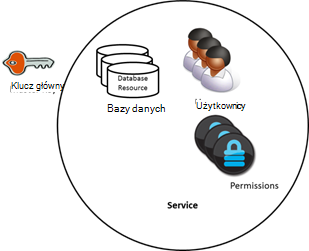

<properties 
    pageTitle="Dowiedz się, jak bezpieczny dostęp do danych w DocumentDB | Microsoft Azure" 
    description="Informacje na temat pojęć dotyczących kontroli dostępu w DocumentDB, łącznie z kluczy głównych, klucze tylko do odczytu, użytkownicy i uprawnienia." 
    services="documentdb" 
    authors="kiratp" 
    manager="jhubbard" 
    editor="monicar" 
    documentationCenter=""/>

<tags 
    ms.service="documentdb" 
    ms.workload="data-services" 
    ms.tgt_pltfrm="na" 
    ms.devlang="na" 
    ms.topic="article" 
    ms.date="09/19/2016" 
    ms.author="kipandya"/>

# Zabezpieczanie dostępu do danych DocumentDB

Ten artykuł zawiera omówienie bezpieczeństwo dostępu do danych zapisanych w [Programie Microsoft Azure DocumentDB](https://azure.microsoft.com/services/documentdb/).

Po zapoznaniu się to omówienie, będziesz mieć możliwość odpowiedzieć na następujące pytania:  

-   Co to są klucze główne DocumentDB?
-   Co to są klucze DocumentDB tylko do odczytu?
-   Co to są tokenów zasobów DocumentDB?
-   Jak używać DocumentDB użytkownicy i uprawnienia do bezpiecznego dostępu do danych DocumentDB?

## Pojęć dotyczących kontroli dostępu DocumentDB

DocumentDB zawiera pojęcia pierwszej klasie w celu kontrolowania dostępu do zasobów DocumentDB.  Na potrzeby tego tematu DocumentDB zasoby są podzielone na dwie kategorie:

- Zasoby administracyjne
    - Konta
    - Bazy danych
    - Użytkownika
    - Uprawnień
- Zasoby aplikacji
    - Kolekcja
    - Oferty
    - Dokument
    - Załącznik
    - Procedura składowana
    - Wyzwalacza
    - Funkcja zdefiniowana przez użytkownika

W kontekście te dwie kategorie DocumentDB obsługuje trzy typy personas kontroli dostępu: konto administratora, administrator tylko do odczytu i użytkownika bazy danych.  Uprawnienia dla poszczególnych persona kontroli dostępu są:
 
- Konto administratora: pełny dostęp do wszystkich zasobów (administracyjne i aplikacji) w ramach danego konta DocumentDB.
- Tylko do odczytu administrator: dostęp tylko do odczytu do wszystkich zasobów (administracyjne i aplikacji w ramach danego konta DocumentDB. 
- Użytkownik bazy danych: DocumentDB zasobu użytkownika skojarzonego z określonego zestawu DocumentDB zasoby bazy danych (zbiory, dokumentów, skryptów).  Może istnieć jeden lub więcej zasobów dla użytkowników skojarzone z danym bazy danych i każdemu zasobowi użytkownika mogą mieć uprawnienia co najmniej jeden skojarzone z nim.

Z wymienionych wyżej kategorii i zasobów na uwadze model kontroli dostępu DocumentDB definiuje trzy typy konstrukcji programu access:

- Klucze główne: podczas tworzenia konta DocumentDB są tworzone dwa klucze główne (głównego i pomocniczego).  Klucze włączyć administracyjnej pełny dostęp do wszystkich zasobów w ramach konta DocumentDB.

- Klucze tylko do odczytu: podczas tworzenia konta DocumentDB są tworzone dwa klucze tylko do odczytu (głównego i pomocniczego).  Klucze umożliwiają dostęp tylko do odczytu do wszystkich zasobów w ramach konta DocumentDB.

- Tokeny zasobu: token zasobów jest skojarzone z zasobem uprawnień DocumentDB i rejestruje relacji między użytkownik bazy danych oraz uprawnienie użytkownik ma dla określonego zasobu aplikacji DocumentDB (zbioru, dokumentu).

## Praca z klawiszami DocumentDB wzorca i tylko do odczytu

Jak wspomniano wcześniej, klucze główne DocumentDB Podaj administracyjnej pełny dostęp do wszystkich zasobów w ramach konta DocumentDB, gdy klucze tylko do odczytu włączyć dostęp do odczytu do wszystkich zasobów w ramach tego konta.  Poniższy fragment kodu przedstawia sposób wystąpienia DocumentClient i Utwórz nową bazę danych przy użyciu punktu końcowego konta DocumentDB i klucza głównego. 

    //Read the DocumentDB endpointUrl and authorization keys from config.
    //These values are available from the Azure Classic Portal on the DocumentDB Account Blade under "Keys".
    //NB > Keep these values in a safe and secure location. Together they provide Administrative access to your DocDB account.
    
    private static readonly string endpointUrl = ConfigurationManager.AppSettings["EndPointUrl"];
    private static readonly SecureString authorizationKey = ToSecureString(ConfigurationManager.AppSettings["AuthorizationKey"]);
        
    client = new DocumentClient(new Uri(endpointUrl), authorizationKey);
    
    // Create Database
    Database database = await client.CreateDatabaseAsync(
        new Database
        {
            Id = databaseName
        });

## Omówienie tokenów zasobów DocumentDB

Za pomocą tokenu zasobów (tworząc DocumentDB użytkownicy i uprawnienia) Jeśli chcesz udostępnić zasoby na swoim koncie DocumentDB do klienta, który nie może zostać uznany za zaufany z klucza głównego. Klucze wzorzec DocumentDB obejmuje zarówno klucz podstawowy i pomocniczy, każdy z nich udziela dostępu administracyjnego do Twoje konto i wszystkie zasoby w nim. Uwidacznianie albo kluczy wzorzec otwiera swoje konto, aby możliwość stosowania złośliwy lub tytułu. 

Analogicznie DocumentDB klucze tylko do odczytu udostępnia wszystkie zasoby — z wyjątkiem zasobów uprawnienia do odczytu, oczywiście — w ramach konta DocumentDB i nie można używać do bardziej szczegółowego dostęp do określonych zasobów DocumentDB.

Tokeny zasobów DocumentDB zapewniają bezpieczne alternatywny, który pozwala na odczytywanie, pisanie i usuwanie zasobów na swoim koncie DocumentDB według uprawnienia, które zostały przyznane i bez potrzeby wzorzec lub odczytu tylko kluczowe.

Oto wzór projektów, zgodnie z którą tokenów zasobów mogą być wymagane, wygenerowane i dostarczane do klientów:

1. Usługa dużych jest skonfigurowana do obsługi aplikacji mobilnej do udostępniania zdjęć użytkownika.
2. Usługa dużych ma klucza głównego konta DocumentDB.
3. Aplikacja zdjęcia jest zainstalowana na urządzeniach przenośnych użytkownika końcowego. 
4. Przy logowaniu aplikacja zdjęcia określa tożsamość użytkownika z usługą dużych. Ten mechanizm zakładu tożsamości jest wyłącznie do aplikacji.
5. Po nawiązaniu tożsamości uprawnień na podstawie tożsamości żądania obsługi dużych.
6. Usługa dużych wysyła token zasobu do aplikacji na telefonie.
7. Aplikacji na telefonie nadal korzystać token zasobów w celu bezpośredniego dostępu DocumentDB zasoby z uprawnieniami zdefiniowanych przez token zasobów i interwału zezwala na to token zasobów. 
8. Po wygaśnięciu token zasobów, kolejne żądania otrzymają 401 wyjątku nieautoryzowanych.  W tym momencie aplikacji na telefonie ponownie ustalenie tożsamości i żąda nowego tokenu zasobów.

## Praca z DocumentDB użytkownicy i uprawnienia
Zasób DocumentDB użytkownika jest skojarzony z DocumentDB bazy danych.  Każda baza danych może zawierać zero lub więcej użytkowników DocumentDB.  Poniższy fragment kodu pokazano, jak utworzyć zasób DocumentDB użytkownika.

    //Create a user.
    User docUser = new User
    {
        Id = "mobileuser"
    };

    docUser = await client.CreateUserAsync(UriFactory.CreateDatabaseUri("db"), docUser);

> [AZURE.NOTE] Każdy użytkownik DocumentDB ma właściwość PermissionsLink, które mogą być używane do pobierania listy uprawnień skojarzone z danym użytkownikiem.

Zasób uprawnień DocumentDB jest skojarzone z tym użytkownikiem DocumentDB.  Każdy użytkownik może zawierać zero lub więcej uprawnienia DocumentDB.  Zasób uprawnień zapewnia dostęp do tokenu zabezpieczającego, który użytkownik musi podczas próby uzyskania dostępu do zasobu określonej aplikacji.
Istnieją dwa poziomy dostępu, które mogą być przekazane przez zasób uprawnień:

- Wszystkie: Użytkownik ma uprawnienia Pełna zasobu
- Odczytu: Użytkownik mogą odczytywać tylko zawartość tego zasobu, ale nie można wykonać zapisu, aktualizacji lub operacji usuwania na zasób.

> [AZURE.NOTE] Aby uruchomić DocumentDB przechowywane procedury, użytkownik musi mieć uprawnienie wszystkich kolekcji, w której zostanie uruchomiona procedura składowana.

Poniższy fragment kodu pokazano, jak utworzyć zasób uprawnień, przeczytaj token zasobów zasobu, uprawnień i skojarzyć uprawnienia użytkownika utworzony w poprzednim przykładzie.

    // Create a permission.
    Permission docPermission = new Permission
    {
        PermissionMode = PermissionMode.Read,
        ResourceLink = documentCollection.SelfLink,
        Id = "readperm"
    };
            
  docPermission = poczekać na klienta. CreatePermissionAsync (UriFactory.CreateUserUri ("db", "użytkownika"), docPermission); Console.WriteLine (docPermission.Id + "ma token:" + docPermission.Token);
  
Po określeniu klucza partition do kolekcji, a następnie uprawnień dla zbioru dokumentu i załącznik zasoby musi również zawierać ResourcePartitionKey oprócz ResourceLink.

Aby można było łatwo uzyskać wszystkie zasoby uprawnień skojarzone z określonego użytkownika, ułatwia DocumentDB dostępne uprawnienia kanału dla każdego obiektu użytkownika.  Poniższy fragment kodu pokazano, jak pobrać uprawnienie skojarzone z danym użytkownikiem utworzony w poprzednim przykładzie, utworzenia listy uprawnień i wystąpienia nowego DocumentClient w imieniu użytkownika.

    //Read a permission feed.
    FeedResponse<Permission> permFeed = await client.ReadPermissionFeedAsync(
      UriFactory.CreateUserUri("db", "myUser"));

    List<Permission> permList = new List<Permission>();
      
    foreach (Permission perm in permFeed)
    {
        permList.Add(perm);
    }
            
    DocumentClient userClient = new DocumentClient(new Uri(endpointUrl), permList);

> [AZURE.TIP] Tokeny zasobów mają domyślne prawidłowych przedziału czasu 1 godzina.  Okres ważności tokenu, jednak mogą być jawnie określone, maksymalnie 5 godzin.

## Następne kroki

- Aby dowiedzieć się więcej na temat DocumentDB, kliknij [tutaj](http://azure.com/docdb).
- Aby uzyskać informacje o zarządzaniu klawiszy wzorca i tylko do odczytu, kliknij [tutaj](documentdb-manage-account.md).
- Aby dowiedzieć się, jak utworzyć DocumentDB autoryzacji tokenów, kliknij [tutaj](https://msdn.microsoft.com/library/azure/dn783368.aspx)
 
