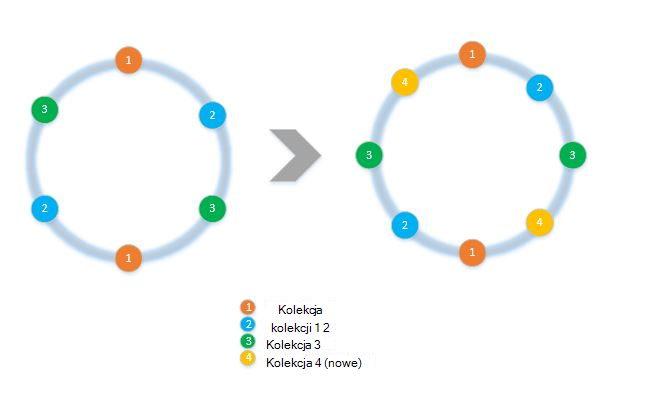
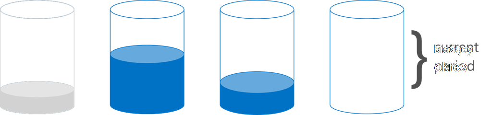

<properties 
    pageTitle="Jak wdrażać podziału po stronie klienta z SDK | Microsoft Azure" 
    description="Dowiedz się, jak używać SDK DocumentDB Azure na żądania danych i rozsyłania partition (shard) u wielu zbiorów" 
    services="documentdb" 
    authors="arramac" 
    manager="jhubbard" 
    editor="cgronlun" 
    documentationCenter=""/>

<tags 
    ms.service="documentdb" 
    ms.workload="data-services" 
    ms.tgt_pltfrm="na" 
    ms.devlang="na" 
    ms.topic="article" 
    ms.date="10/27/2016" 
    ms.author="arramac"/>

# <a name="how-to-partition-data-using-client-side-support-in-documentdb"></a>Sposobu dzielenia danych przy użyciu obsługę klienta DocumentDB

Azure DocumentDB obsługuje [automatycznego podziału zbiorów](documentdb-partition-data.md). Istnieją jednak przypadków użycia, gdzie jest korzystne cienki lub kolorów kontrolować zachowanie podziału. W celu zmniejszenia kodu formuły wymaganego do podziału zadań, dodaliśmy funkcji .NET, Node.js i SDK Java, który ułatwia tworzenie aplikacji, które są skalowania u wielu zbiorów.

W tym artykule firma Microsoft będzie zapoznaj się klasy i interfejsy .NET SDK i jak można używać ich do tworzenia aplikacji podzielone na partycje. Inne SDK, takich jak Java, Node.js i Python obsługę podobne metody i interfejsy podziału po stronie klienta.

## <a name="client-side-partitioning-with-the-documentdb-sdk"></a>Po stronie klienta podziału z zestawu SDK DocumentDB

Przed możemy wyświetlić elementy podrzędne podziału, Przejdźmy recap niektóre podstawowe pojęcia DocumentDB, które dotyczą podziału. Co konto bazy danych Azure DocumentDB zawiera zestaw baz danych, każdy zawiera wiele kolekcji, z których każdy może zawierać procedur składowanych wyzwalaczy, funkcji zdefiniowanych przez użytkownika oraz dokumenty powiązane załączniki. Kolekcje może być jedną partycją lub podzielone na partycje się i mają następujące właściwości:

- Kolekcje oferują izolacji wydajności. W związku z tym jest korzyścią wydajności w sortowanie podobne dokumenty w obrębie tego samego zbioru. Na przykład czas serii danych, można umieścić dane dla ostatni miesiąc, którego dotyczy często kwerenda, w obrębie zbioru z wyższej przepustowości ustanawianie starsze dane są wprowadzane w kolekcji o niskiej przepustowości ustanawianie.
- Transakcje kwasu to znaczy procedur składowanych i wyzwalaczy nie może obejmować zbioru. Transakcje są ograniczone w jedną partycją klucza wartości w zbiorze.
- Kolekcje wymusza schemat, aby można było używać dokumentów JSON tego samego typu lub różnych typów.

Począwszy od wersji [1.5.x SDK DocumentDB Azure](documentdb-sdk-dotnet.md), można wykonywać operacje dokumentu bezpośrednio na bazie danych. [DocumentClient](https://msdn.microsoft.com/library/azure/microsoft.azure.documents.client.documentclient.aspx) używa wewnętrznie PartitionResolver, która została wybrana dla bazy danych rozsyłanie żądań do odpowiedniego zbioru.

>[AZURE.NOTE] [Po stronie serwera podziału](documentdb-partition-data.md) wprowadzone w pozostałych interfejsu API 2015-12-16 i SDK 1.6.0+ deprecates przypadków użycia prosta metoda rozpoznawania nazw partition po stronie klienta. Jednak podziału po stronie klienta jest bardziej elastyczne i pozwala kontrolować wydajności izolacji między partycją klawiszy, kontrolować stopień równoległości podczas czytania wyników z wielu partycje i korzystania z zakresu przestrzenna podziału metod a skrótu.

Na przykład w .NET każdej klasy PartitionResolver jest wykonanie interfejs [IPartitionResolver](https://msdn.microsoft.com/library/azure/microsoft.azure.documents.client.ipartitionresolver.aspx) , który zawiera trzy metody - [GetPartitionKey](https://msdn.microsoft.com/library/azure/microsoft.azure.documents.client.ipartitionresolver.getpartitionkey.aspx), [ResolveForCreate](https://msdn.microsoft.com/library/azure/microsoft.azure.documents.client.ipartitionresolver.resolveforcreate.aspx) i [ResolveForRead](https://msdn.microsoft.com/library/azure/microsoft.azure.documents.client.ipartitionresolver.resolveforread.aspx). Zapytań LINQ i Iteratory ReadFeed metodę ResolveForRead wewnętrznie do przejść przez wszystkie zbiory zgodne klucz partition żądania. Tworzenie podobnie, użyj operacji, tworzonych przez metodę ResolveForCreate do kierowania do prawej partycją. Brak zmian wymagane dla Zamień, usuwanie i odczytać, ponieważ mogą używać dokumentów, które zawierają już odwołanie do odpowiedniej kolekcji.

SDK zawiera również dwóch klas, które obsługują dwa kanonicznych technik podziału, mieszania i zakres wyszukiwania, za pomocą [HashPartitionResolver](https://msdn.microsoft.com/library/azure/microsoft.azure.documents.partitioning.hashpartitionresolver.aspx) i [RangePartitionResolver](https://msdn.microsoft.com/library/azure/mt126047.aspx). Te klasy umożliwia łatwe dodawanie logiki podziału do aplikacji.  

## <a name="add-partitioning-logic-and-register-the-partitionresolver"></a>Dodawanie logiki podziału i zarejestrować PartitionResolver 

Oto fragment przedstawiający, jak utworzyć [HashPartitionResolver](https://msdn.microsoft.com/library/azure/microsoft.azure.documents.partitioning.hashpartitionresolver.aspx) i zarejestrować z DocumentClient dla bazy danych.

```cs
// Create some collections to partition data.
DocumentCollection collection1 = await client.CreateDocumentCollectionAsync(...);
DocumentCollection collection2 = await client.CreateDocumentCollectionAsync(...);

// Initialize a HashPartitionResolver using the "UserId" property and the two collection self-links.
HashPartitionResolver hashResolver = new HashPartitionResolver(
    u => ((UserProfile)u).UserId, 
    new string[] { collection1.SelfLink, collection2.SelfLink });

// Register the PartitionResolver with the database.
this.client.PartitionResolvers[database.SelfLink] = hashResolver;

```

## <a name="create-documents-in-a-partition"></a>Tworzenie dokumentów w partycją  

Po PartitionResolver jest zarejestrowany, można wykonać tworzy i kwerendy bezpośrednio w bazie danych, jak pokazano poniżej. W tym przykładzie zestawu SDK używa PartitionResolver aby wyodrębnić nazwa użytkownika, jego skrótu, a następnie użyj tej wartości do kierowania Operacja tworzenia do kolekcji poprawne.

```cs
Document johnDocument = await this.client.CreateDocumentAsync(
    database.SelfLink, new UserProfile("J1", "@John", Region.UnitedStatesEast));
Document ryanDocument = await this.client.CreateDocumentAsync(
    database.SelfLink, new UserProfile("U4", "@Ryan", Region.AsiaPacific, UserStatus.AppearAway));
```

## <a name="create-queries-against-partitions"></a>Tworzenie kwerend dla partycje  

Aby kwerendę, przy użyciu metody [CreateDocumentQuery](https://msdn.microsoft.com/library/azure/microsoft.azure.documents.linq.documentqueryable.createdocumentquery.aspx) przez przekazywanie z bazy danych oraz klucz partition. Kwerenda zwraca pojedynczy zestaw wyników dla wszystkich zbiorów w bazie danych, które mapowanie do klucza partycją.  

```cs
// Query for John's document by ID - uses PartitionResolver to restrict the query to the partitions 
// containing @John. Again the query uses the database self link, and relies on the hash resolver 
// to route the appropriate collection.
var query = this.client.CreateDocumentQuery<UserProfile>(
    database.SelfLink, null, partitionResolver.GetPartitionKey(johnProfile))
    .Where(u => u.UserName == "@John");
johnProfile = query.AsEnumerable().FirstOrDefault();
```

## <a name="create-queries-against-all-collections-in-the-database"></a>Tworzenie kwerend dla wszystkich zbiorów w bazie danych 

Można również kwerendy wszystkich zbiorów w bazie danych i wyliczanie wyników, jak wyświetlić poniżej, przez pominięcie argumentu klucza partycją.

```cs
// Query for all "Available" users. Here since there is no partition key, the query is serially executed 
// across each partition/collection and returns a single result-set. 
query = this.client.CreateDocumentQuery<UserProfile>(database.SelfLink)
    .Where(u => u.Status == UserStatus.Available);
foreach (UserProfile activeUser in query)
{
    Console.WriteLine(activeUser);
}
```

## <a name="hash-partition-resolver"></a>Rozwiązywanie problemów z mieszania Partition
Przy użyciu skrótu dzielony, partycje są przypisywane na podstawie wartości funkcji mieszania, umożliwiając równomierne żądania i danych przez liczbę podziałów. Tej metody używa się zazwyczaj do partycją danych wyprodukowano lub zużyte w wielu różnych klientów i są przydatne w przypadku przechowywania profilów użytkowników, elementów wykazu i dane telemetryczne IoT ("Internet z elementów"). Podziału mieszania jest również używana przez osoby DocumentDB po stronie serwera podziału pomocy technicznej w obrębie zbioru.

**Partycjonowanie mieszania:**


Prosta skrótu podziału schematu między zbiorami *N* będzie zabrać ze sobą dowolny dokument, oblicza *hash(d) mod N* , aby określić, które zbioru został umieszczony w. Ale problem z Ta prosta technika to, że działa również, podczas dodawania nowych zbiorów, lub usunąć zbiorów jest wymagany prawie wszystkie dane, których chcesz uzyskać reshuffled. [Mieszania spójne] (http://citeseerx.ist.psu.edu/viewdoc/summary?doi=10.1.1.23.3738) jest znane algorytmu, która rozwiązuje ten problem z zastosowaniem schematu mieszania, która minimalizuje liczbę przenoszenia danych wymagane podczas dodawania lub usuwania zbiorów.

Klasy [HashPartitionResolver](https://msdn.microsoft.com/library/azure/microsoft.azure.documents.partitioning.hashpartitionresolver.aspx) wykonuje logiki do utworzenia pierścień spójne mieszania przez funkcję mieszania określonego w interfejsie [IHashGenerator](https://msdn.microsoft.com/library/azure/microsoft.azure.documents.partitioning.ihashgenerator.aspx) . Domyślnie HashPartitionResolver używa funkcji mieszania MD5, ale możesz zamienić to się z mieszania implementacji. HashPartitionResolver tworzy wewnętrznie 16 mieszania lub "węzły wirtualnej" w ramach Dzwoń mieszania dla każdego zbioru w celu uzyskania bardziej spójny rozkładu dokumentów między zbiorami, ale można zmieniać tego numeru do handlu poza skośność danych z ilość obliczeń po stronie klienta.

**Spójne mieszania z HashPartitionResolver:**


## <a name="range-partition-resolver"></a>Rozwiązywanie problemów z zakresu Partition

W zakresie dzielony, partycje są przypisywane na podstawie tego, czy klucz partycją jest w pewnym. Często służy do podziału z właściwościami sygnaturę godziny (np eventTime między 1 kwietnia 2015 i 14 kwietnia 2015 r.). Pomaga Obsługa mapowania z zakresu w klasie [RangePartitionResolver](https://msdn.microsoft.com/library/azure/mt126047.aspx) \<T\> zbioru samodzielnie utworzyć łącze. 

[Zakres\<T\> ](https://msdn.microsoft.com/library/azure/mt126048.aspx) jest proste klasy, która zarządza zakresów dowolnego typu implementujących IComparable\<T\> i IEquatable\<T\> , takie jak ciągi lub liczb. Aby uzyskać odczytuje i tworzy, można przekazać wszelkie dowolnego zakresu, a program rozpoznawania nazw identyfikuje wszystkie zbiory candidate identyfikując zakresy partycje, które przecinają się z żądany zakres. Ta funkcja może być przydatne podczas wykonywania zapytań zakres czasu serie danych.

**Zakres podziału:**  

  

Specjalne przypadku podziału zakresu jest, gdy zakres jest po prostu pojedynczej osobne wartości, nazywane "odnośnika podziału". Często używany do podziału według regionów (np. partycją Skandynawii zawiera Norwegia, Dania i Szwecja) lub do podziału dzierżaw w aplikacji wielu dzierżawy.

## <a name="samples"></a>Przykłady 

Zapoznaj się [DocumentDB podziału próbki Github projektu](https://github.com/Azure/azure-documentdb-dotnet/tree/287acafef76ad223577759b0170c8f08adb45755/samples/code-samples/Partitioning) zawierający wstawki kodu programu w sposób używania tych PartitionResolvers i rozszerzyć je do wykonania własnego rozpoznawania nazw w celu dopasowania przypadków użycia określonych, podobnej do następującej: 

* Jak określić wyrażenie lambda dowolnego dla GetPartitionKey i używać go do wykonania złożonych kluczy podziału lub inaczej partycje różne typy obiektów.
* Jak utworzyć prosty [LookupPartitionResolver](https://github.com/Azure/azure-documentdb-dotnet/blob/287acafef76ad223577759b0170c8f08adb45755/samples/code-samples/Partitioning/Partitioners/LookupPartitionResolver.cs) korzystającego z tabeli odnośników ręcznego do wykonania podziału. Ten wzorzec jest często używanych do podziału na podstawie osobne wartości, takie jak region, identyfikator dzierżawy lub aplikacji nazwę.
* Jak utworzyć tworzy kolekcje automatycznie na podstawie szablonu, który definiuje schemat nazewnictwa, IndexingPolicy i procedur składowanych, które muszą być rejestrowane dla nowych zbiorów [ManagedPartitionResolver](https://github.com/Azure/azure-documentdb-dotnet/blob/287acafef76ad223577759b0170c8f08adb45755/samples/code-samples/Partitioning/Partitioners/ManagedHashPartitionResolver.cs) .
* Jak utworzyć schemat mniej [SpilloverPartitionResolver](https://github.com/Azure/azure-documentdb-dotnet/blob/287acafef76ad223577759b0170c8f08adb45755/samples/code-samples/Partitioning/Partitioners/SpilloverPartitionResolver.cs) po prostu tworzy nowe zbiory stare zbiory wypełnienie w górę.
* Jak szeregować i deserializacji swój stan PartitionResolver jako JSON, dzięki czemu można udostępniać między procesami i między zamknięcia. Może przechowywać te w plikach konfiguracji lub nawet w zbiorze DocumentDB.
* Klasę [DocumentClientHashPartitioningManager](https://github.com/Azure/azure-documentdb-dotnet/blob/287acafef76ad223577759b0170c8f08adb45755/samples/code-samples/Partitioning/Util/DocumentClientHashPartitioningManager.cs) dla dynamiczne dodawanie i usuwanie podziałów do bazy danych na partycje oparty na spójne mieszania. Wewnętrznie korzysta z [TransitionHashPartitionResolver](https://github.com/Azure/azure-documentdb-dotnet/blob/287acafef76ad223577759b0170c8f08adb45755/samples/code-samples/Partitioning/Partitioners/TransitionHashPartitionResolver.cs) do rozsyłania odczytuje i zapisuje podczas migracji w jednym z czterech trybów - przeczytaj ze starej podziału schematu (ReadCurrent), nowy (ReadNext), scalanie wyniki z obu (ReadBoth) lub być niedostępne podczas migracji (Brak).

Próbki są Otwórz źródło i zachęcamy do Przesyłaj żądania pobieraj z wpłaty korzystających inni deweloperzy DocumentDB. Zajrzyj do [udziału wskazówki](https://github.com/Azure/azure-documentdb-net/blob/master/Contributing.md) dla porady dotyczące współtworzenia.  

>[AZURE.NOTE] Tworzy zbioru są stopa ograniczone przez DocumentDB, aby niektóre z metod przykładowych pokazano w przykładzie może potrwać kilka minut.

##<a name="faq"></a>FAQ
**DocumentDB obsługuje podziału po stronie serwera?**

Tak, DocumentDB obsługuje [podziału po stronie serwera](documentdb-partition-data.md). DocumentDB obsługuje również po stronie klienta partycje za pośrednictwem rozpoznawania partition po stronie klienta dla bardziej zaawansowanych przypadków użycia.

**Kiedy należy używać po stronie serwera a podziału po stronie klienta**
Dla większości przypadków użycia zalecamy użycie podziału po stronie serwera, ponieważ obsługuje ona zadań administracyjnych podziału danych i routingu żądania. Jednak jeśli potrzebujesz zakresu podziału lub masz przypadek użycia specjalistyczne wydajności izolacji między różnych wartości kluczy partition, następnie podziału po stronie klienta może być najlepszym rozwiązaniem.

**Jak dodać lub usunąć zbiór do schematu podziału**

Zapoznaj się stosowania DocumentClientHashPartitioningManager w programie project próbki przykład jak zaimplementować ponownym partycjonowaniu.

**Jak utrzymują lub udostępnić innym klientom podziału konfigurację?**

Można szeregować Państwa partitioner jako JSON i przechowywać w plikach konfiguracyjnych lub nawet w kolekcji DocumentDB. Zapoznaj się z metodą RunSerializeDeserializeSample w programie project próbkach, na przykład.

**Jak rowerowy różnymi sposobami podziału?**

Tworzenia łańcucha PartitionResolvers wdrażając własne IPartitionResolver wewnętrznie korzystającego z co najmniej jeden istniejący rozpoznawania nazw. Zapoznaj się TransitionHashPartitionResolver w programie project próbkach, na przykład.

##<a name="references"></a>Odwołania
* [Serwerowa podziału w DocumentDB](documentdb-partition-data.md)
* [Kolekcje DocumentDB i poziomy wydajności](documentdb-performance-levels.md)
* [Przykłady kodu podziału na Github](https://github.com/Azure/azure-documentdb-dotnet/tree/287acafef76ad223577759b0170c8f08adb45755/samples/code-samples/Partitioning)
* [W dokumentacji DocumentDB .NET SDK w witrynie MSDN](https://msdn.microsoft.com/library/azure/dn948556.aspx)
* [Przykłady DocumentDB .NET](https://github.com/Azure/azure-documentdb-net)
* [Limity DocumentDB](documentdb-limits.md)
* [DocumentDB Blog porady dotyczące wydajności](https://azure.microsoft.com/blog/2015/01/20/performance-tips-for-azure-documentdb-part-1-2/)
 
