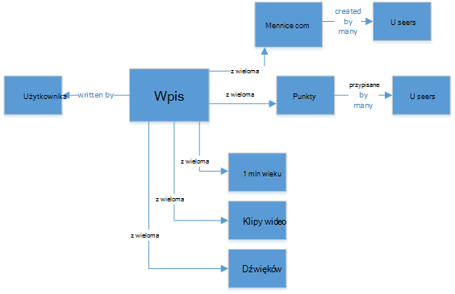
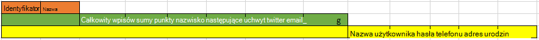
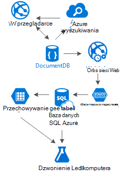

<properties 
    pageTitle="DocumentDB modelu: aplikacje społecznościowych | Microsoft Azure" 
    description="Informacje o modelu dla sieci społecznościowych wykorzystując możliwości magazynowania DocumentDB i inne usługi Azure." 
    keywords="aplikacje społecznościowych"
    services="documentdb" 
    authors="ealsur" 
    manager="jhubbard" 
    editor="" 
    documentationCenter=""/>

<tags 
    ms.service="documentdb" 
    ms.workload="data-services" 
    ms.tgt_pltfrm="na" 
    ms.devlang="na" 
    ms.topic="article" 
    ms.date="09/27/2016" 
    ms.author="mimig"/>

# Przechodzenie z DocumentDB społecznościowych

Mieszkających w znacznym stopniu połączone społeczeństwa oznacza, że w pewnym momencie w życiu staje się częścią **sieci społecznościowych**. Używamy sieci społecznościowych w celu utrzymywania kontaktu znajomym, współpracownikom, rodzinie lub czasem udostępnianie naszych męczennica osobom z wspólne zainteresowania.

Jako inżynierów lub programista, firma Microsoft może mieć zastanawiasz się, jak tych sieci przechowywanie i połączenie naszych danych lub może mieć nawet zostały podobne zadanie przypisane do tworzenia lub zaprojektować sieci społecznościowej nowego rynku określonych niszowych yourselves. Kiedy jest duży kwestia: jak te dane są przechowywane?

Załóżmy, że tworzenia nowych i błyszczące sieci społecznościowej, gdzie publikować artykułów zawierających pokrewne multimediów, takich jak obrazy, klipy wideo lub nawet muzyki naszych użytkowników. Użytkownicy mogą komentarz wpisy i nadaj punktów dla oceny. Będzie kanału informacyjnego wpisów, które użytkownicy widzą i mieć możliwość interakcję na strona początkowa głównym witryny sieci Web. Dźwięk nie to naprawdę złożonych (na początku), ale w celu uproszczenia Przyjrzyjmy się tam zatrzymać (Firma Microsoft może delve do źródła danych użytkownika niestandardowego dotyczy relacji, ale przekracza celem w tym artykule).

Tak jak firma Microsoft to przechowywanie i gdzie?

Wiele osób może masz doświadczenia w bazach danych programu SQL lub co najmniej mają pojęcia [modelowania danych relacyjnych](https://en.wikipedia.org/wiki/Relational_model) , a może być wydawać się rozpocząć rysowanie podobną do następującej:

 

Struktura danych doskonale znormalizowaną i łatwa... które nie skalowanie. 

Nie otrzymujesz mnie problem I pracował z bazy danych programu SQL moim życiu, doskonale nadają, ale jak każdej platformy deseniu, praktyki i oprogramowanie nie jest doskonałe dla każdego scenariusza.

Dlaczego SQL to najlepszy wybór, w tym scenariuszu? Przyjrzyjmy się struktury pojedynczy wpis, jeśli I chce wyświetlić ten wpis w witrynie sieci Web lub aplikacji, czy muszę zrobić kwerenda z... Chcę po prostu Pokaż jeden pojedynczy wpis, teraz obrazu strumienia wpisów dynamicznie ładowanie i są wyświetlane na ekranie i może zostać wyświetlony, gdy nacisnę 8 sprzężenia tabeli (!).

Firma Microsoft może oczywiście za pomocą ABC wystąpienie programu SQL za mało power rozwiązać tysiące kwerendy z tych wielu sprzężeń służyć nasze zawartość, ale naprawdę, dlaczego jak możemy podczas prostsze rozwiązania?

## Przewodnik po NoSQL

Istnieją specjalne wykresu baz danych, które można [uruchamiać na Azure](http://neo4j.com/developer/guide-cloud-deployment/#_windows_azure) , ale są niedrogie i wymaga usług IaaS (infrastruktury jako usługa, maszyn wirtualnych głównie) i konserwacja. Mam zamiar celem w tym artykule w dolnym rozwiązanie kosztów, które będą działać w przypadku większości scenariuszy uruchomionych dla bazy danych i Azure NoSQL [DocumentDB](https://azure.microsoft.com/services/documentdb/). Przy użyciu metody [NoSQL](https://en.wikipedia.org/wiki/NoSQL) , dane są przechowywane w formacie JSON i stosowania [denormalization](https://en.wikipedia.org/wiki/Denormalization)naszych wcześniej skomplikowane wpis może zostać zamieniony na pojedynczy [dokument](https://en.wikipedia.org/wiki/Document-oriented_database):

    {
        "id":"ew12-res2-234e-544f",
        "title":"post title",
        "date":"2016-01-01",
        "body":"this is an awesome post stored on NoSQL",
        "createdBy":User,
        "images":["http://myfirstimage.png","http://mysecondimage.png"],
        "videos":[
            {"url":"http://myfirstvideo.mp4", "title":"The first video"},
            {"url":"http://mysecondvideo.mp4", "title":"The second video"}
        ],
        "audios":[
            {"url":"http://myfirstaudio.mp3", "title":"The first audio"},
            {"url":"http://mysecondaudio.mp3", "title":"The second audio"}
        ]
    }

I można uzyskać z pojedynczą kwerendę i nie sprzężenia. To jest o wiele bardziej przejrzyste i proste, a budget-wise, wymaga mniejszej liczby zasoby, aby uzyskać lepszą jakość.

Azure DocumentDB służy do sprawdzenia, wszystkie właściwości są indeksowane z jego [Automatyczne indeksowanie](documentdb-indexing.md), które można nawet można [dostosować](documentdb-indexing-policies.md). Metody wolny schematu pozwoli przechowywanie dokumentów z innego dynamiczne struktur i, być może jutro chcemy wpisy, aby wyświetlić listę kategorii lub hashtags skojarzonych z nimi, DocumentDB będą obsługiwane nowe dokumenty z atrybutami dodane nie dodatkowego pracy wymagane przez.

Komentarzy do wpisu mogą być traktowane jako tylko inne wpisy z właściwością nadrzędny (upraszcza naszych mapowania obiektu). 

    {
        "id":"1234-asd3-54ts-199a",
        "title":"Awesome post!",
        "date":"2016-01-02",
        "createdBy":User2,
        "parent":"ew12-res2-234e-544f"
    }

    {
        "id":"asd2-fee4-23gc-jh67",
        "title":"Ditto!",
        "date":"2016-01-03",
        "createdBy":User3,
        "parent":"ew12-res2-234e-544f"
    }

I wszystkie interakcje społecznościowych mogą być przechowywane w oddzielnym obiekcie jako liczniki:

    {
        "id":"dfe3-thf5-232s-dse4",
        "post":"ew12-res2-234e-544f",
        "comments":2,
        "likes":10,
        "points":200
    }

Tworzenie źródła danych jest wystarczy tworzenie dokumentów, które mogą zawierać listę identyfikatorów wpisu z zamówienia danego istotności:

    [
        {"relevance":9, "post":"ew12-res2-234e-544f"},
        {"relevance":8, "post":"fer7-mnb6-fgh9-2344"},
        {"relevance":7, "post":"w34r-qeg6-ref6-8565"}
    ]

Firma Microsoft może mieć "najnowszą" strumienia z wpisów uporządkowanych według daty utworzenia, strumień "najnowszych" te wpisy z bardziej lubię w ciągu ostatnich 24 godzin, firma Microsoft może nawet zaimplementowania niestandardowych strumienia dla każdego użytkownika według warunków logicznych, takich jak obserwujących i zainteresowań i nadal będzie listę wpisów. Jest to kwestia sposobu tworzenia list, ale wydajność odczytu pozostaje swobodnego. Po możemy korzystać z jednej z tych list, możemy wydać pojedynczą kwerendę DocumentDB przy użyciu [IN operator](documentdb-sql-query.md#where-clause) uzyskanie stron wpisy w danej chwili.

Strumienie ranna może być utworzony przy użyciu [Usługi aplikacji Azure](https://azure.microsoft.com/services/app-service/) procesy w tle: [Webjobs](../app-service-web/web-sites-create-web-jobs.md). Po utworzeniu wpisu przetwarzania w tle może być uruchomiona za pomocą [Magazyn Azure](https://azure.microsoft.com/services/storage/) [kolejek](../storage/storage-dotnet-how-to-use-queues.md) i Webjobs wyzwalane przy użyciu [Zestawu SDK Webjobs Azure](../app-service-web/websites-dotnet-webjobs-sdk.md), implementacji propagowanie wpis wewnątrz strumieniami opartymi na własną logiki niestandardowej. 

Punkty i "Lubię to" na wpis mogą być przetwarzane w sposób odroczone w ten sam sposób, aby utworzyć ostatecznie spójne środowisko.

Obserwujących są trudniejszy. DocumentDB ma limit rozmiaru dokumentu 512 KB, więc może wziąć pod uwagę przechowywanie obserwujących jako dokumentu przy użyciu tej struktury:

    {
        "id":"234d-sd23-rrf2-552d",
        "followersOf": "dse4-qwe2-ert4-aad2",
        "followers":[
            "ewr5-232d-tyrg-iuo2",
            "qejh-2345-sdf1-ytg5",
            //...
            "uie0-4tyg-3456-rwjh"
        ]
    }

To może działać dla użytkownika z kilku tysięcy obserwujących, ale jeśli niektóre renomy łączy naszych pozycje tej metody zostanie po pewnym czasie trafienie zakończenie rozmiaru dokumentu.

Aby rozwiązać ten problem, firma Microsoft korzysta z podejście mieszanych. Część dokumentu statystyki użytkowników możemy przechowywanie Liczba obserwujących:

    {
        "id":"234d-sd23-rrf2-552d",
        "user": "dse4-qwe2-ert4-aad2",
        "followers":55230,
        "totalPosts":452,
        "totalPoints":11342
    }

I rzeczywisty wykres obserwujących mogą być przechowywane w tabelach miejsca do magazynowania Azure [rozszerzenia](https://github.com/richorama/AzureStorageExtensions#azuregraphstore) , która pozwala na przechowywanie "A-następujące B" prosty i pobieranie. Dzięki temu możemy pełnomocnika ten proces dokładnie obserwujących listy (jeśli administrator powinien) do tabel miejsca do magazynowania Azure, ale wyszukiwanie szybkie liczb, możemy korzystać DocumentDB.

## Duplikowanie wzorca i danych "Drabina"

Jak można zauważyć w dokumencie JSON, który odwołuje się do wpisu, istnieje wiele wystąpień użytkownika. I można będzie mieć odgadnąć prawy, oznacza to, że informacje, które reprezentuje użytkownika, podane ten denormalization mogą występować w więcej niż jednym miejscu.

W celu umożliwienia szybszego kwerend, poniesione przez firmę Microsoft Duplikowanie danych. Problem z efektu po stronie jest, że jeśli przy niektórych akcji zmiany danych użytkownika, trzeba znaleźć wszystkie działania kiedykolwiek zdobył i zaktualizuj je wszystkie. Nie dźwięk bardzo praktycznym, prawy?

Bazach danych dla wykresu rozwiązać go w sposób własne, chwilę rozwiązywać identyfikując atrybutami klucza użytkownika, pokazujące w naszym aplikacji dla każdej czynności. Jeśli firma Microsoft wizualnie wyświetlanie wpisu w naszym aplikacji i wyświetlić tylko jego twórcą nazwa i obraz, dlaczego przechowywać wszystkie dane użytkownika w atrybucie "createdBy"? Jeśli dla każdego komentarza możemy po prostu wyświetlić obrazu użytkownika, firma Microsoft nie wymagają pozostałą część jego informacje. To miejsce, w którym wejścia coś zadzwonić "wzorzec drabinę" odtwarzania.

Przyjrzyjmy się informacje o użytkowniku, na przykład:

    {
        "id":"dse4-qwe2-ert4-aad2",
        "name":"John",
        "surname":"Doe",
        "address":"742 Evergreen Terrace",
        "birthday":"1983-05-07",
        "email":"john@doe.com",
        "twitterHandle":"@john",
        "username":"johndoe",
        "password":"some_encrypted_phrase",
        "totalPoints":100,
        "totalPosts":24
    }
    
Sprawdzając te informacje, można szybko wykrywamy czyli ważnych informacji i które nie co powoduje utworzenie "Drabinie":

Najmniejsza kroku nosi UserChunk minimalnego fragment informacje identyfikujące użytkownika i jest on używany do Duplikowanie danych. Zmniejszając rozmiar zduplikowane dane do informacji "pokazano", możemy zmniejszyć ryzyko dużych aktualizacji.

Drugie imię kroku nosi nazwę użytkownika, jest pełny dane, które będą używane na większości kwerend zależne od wydajności na DocumentDB dostępu i krytyczne. Zawiera informacje reprezentowane przez UserChunk.

Największa jest rozszerzony użytkownika. Zawiera wszystkie informacje o użytkowniku krytycznych oraz inne dane, które nie wymagają naprawdę Szybkie czytanie lub jego zastosowania jest ewentualne (na przykład proces logowania). Te dane mogą być przechowywane poza DocumentDB bazy danych SQL Azure lub Azure magazyn tabel.

Dlaczego czy było podzielić użytkownika i nawet przechowywania tych informacji w różnych miejscach? Ponieważ [nie nieskończonej](documentdb-limits.md) ilości miejsca do magazynowania w DocumentDB i wydajności punkt widoku, rośnie dokumenty, costlier kwerend. Zachowaj cienki z odpowiednie informacje wszystkich swoich zapytań zależne od wydajności sieci społecznościowych i przechowywać dodatkowe informacje dla ostatecznej scenariuszy, takie jak zmiany profilu pełny, logowania do, a nawet wyszukiwania danych analizy użycia i inicjatywy Big Data dokumentów. Firma Microsoft naprawdę nie zwracać Jeśli zbierania do wyszukiwania danych danych jest mniejsza, ponieważ jest uruchomiony na bazy danych SQL Azure, firma Microsoft mają dotyczyć mimo że szybką i kompaktowy aparaty obsługi użytkowników. Użytkownik, przechowywane na DocumentDB, będzie miała następującą postać:

    {
        "id":"dse4-qwe2-ert4-aad2",
        "name":"John",
        "surname":"Doe",
        "username":"johndoe"
        "email":"john@doe.com",
        "twitterHandle":"@john"
    }

I wpis powinien wyglądać tak:

    {
        "id":"1234-asd3-54ts-199a",
        "title":"Awesome post!",
        "date":"2016-01-02",
        "createdBy":{
            "id":"dse4-qwe2-ert4-aad2",
            "username":"johndoe"
        }
    }

I podczas edycji wystąpi, gdzie jeden z atrybutów fragmencie ulega zmianie, łatwiej znaleźć dokumenty, którego dotyczy problem za pomocą kwerend, które wskazują atrybuty indeksowane (Wybierz * FROM wpisów p p.createdBy.id gdzie == "edited_user_id"), a następnie aktualizując fragmenty.

## Pole wyszukiwania

Użytkownicy będą generować szczęście dużej ilości zawartości. Będziemy mogli umożliwiają wyszukiwanie i znajdowanie zawartości, która może nie być bezpośrednio w ich strumienie zawartości, być może ponieważ nie możemy twórcy lub być może możemy po prostu próbujesz Dowiedz się, że stary wpis NAS 6 miesięcy temu.

Thankfully a ponieważ użyto Azure DocumentDB, możemy łatwo wdrożyć aparat wyszukiwania za pomocą [wyszukiwania Azure](https://azure.microsoft.com/services/search/) na kilka minut i bez wpisywania jednego wiersza kodu (innych niż oczywiście, proces wyszukiwania i interfejsu użytkownika).

Dlaczego jest to tak proste?

Wyszukiwanie Azure wykonuje co wywołują [indeksatory](https://msdn.microsoft.com/library/azure/dn946891.aspx), procesy w tle, które nawiązać w swojej repozytoria danych i automagically Dodawanie, aktualizowanie i usuwanie obiektów w indeksach. Obsługuje [indeksatory bazy danych SQL Azure](https://blogs.msdn.microsoft.com/kaevans/2015/03/06/indexing-azure-sql-database-with-azure-search/), [indeksatory obiektów blob platformy Azure](../search/search-howto-indexing-azure-blob-storage.md) i thankfully, [indeksatory Azure DocumentDB](../documentdb/documentdb-search-indexer.md). Przejścia informacji z DocumentDB do wyszukiwania Azure jest proste, jako obu magazynu informacji w formacie JSON, trzeba tylko [Tworzenie indeksu](../search/search-create-index-portal.md) mapy, które atrybuty z naszych dokumentów chcemy indeksowane i to wszystko, w ciągu kilku minut (zależy od rozmiaru naszych danych), Nasza zawartość będzie dostępny do przeszukiwanych na żądanie, najlepszym rozwiązaniem wyszukiwania jako usługa w chmurze infrastruktury. 

Aby uzyskać więcej informacji na temat wyszukiwania Azure mogą odwiedzić witrynę [firmy Hitchhiker przewodnika do wyszukiwania](https://blogs.msdn.microsoft.com/mvpawardprogram/2016/02/02/a-hitchhikers-guide-to-search/).

## Podstawowej wiedzy

Po zapisaniu tej zawartości, który powiększa się i rozwoju codziennie, firma Microsoft może jesteśmy zastanawiająca: co można zrobić z tym strumieniu informacji z moich użytkowników?

Odpowiedź jest proste: umieszczanie go do pracy i Dowiedz się z niego.

Ale co możemy dowiedzieć się więcej? Kilka przykładów łatwe zawiera [upodobania analizy](https://en.wikipedia.org/wiki/Sentiment_analysis), zalecenia zawartości według preferencji użytkownika lub nawet automatyczną zawartości moderatora, zapewniający opublikowania całej zawartości przez naszych sieci społecznościowej jest bezpieczne rodzinie.

Skonfigurowaniu możesz złapać, prawdopodobnie będzie traktować należy niektórych Praca matematyki przedmiotów, aby wyodrębnić te wzorce i informacji poza proste bazy danych i pliki, ale może być nieprawidłowy.

[Azure maszynowego uczenia](https://azure.microsoft.com/services/machine-learning/), część [Pakietu analizy Cortana](https://www.microsoft.com/en/server-cloud/cortana-analytics-suite/overview.aspx)jest usługa w chmurze w pełni zarządzane, umożliwiającego tworzenie przepływów pracy przy użyciu algorytmów w prosty interfejs przeciągania i upuszczania, kod algorytmy w [R](https://en.wikipedia.org/wiki/R_(programming_language)) lub użyj już zbudowane i gotowa do użycia interfejsów API, takie jak: [Analizy tekstu](https://gallery.cortanaanalytics.com/MachineLearningAPI/Text-Analytics-2), [Moderatora zawartości](https://www.microsoft.com/moderator) lub [zaleceń](https://gallery.cortanaanalytics.com/MachineLearningAPI/Recommendations-2).

Uzyskanie dowolnego z tych scenariuszy nauki komputera, firma Microsoft umożliwia [Lake danych Azure](https://azure.microsoft.com/services/data-lake-store/) mogły zjeść tej ostatniej informacje z innych źródeł i przetwarzania danych i generować dane wyjściowe mogą być przetwarzane przez naukę maszynowego Azure za pomocą [U-SQL](https://azure.microsoft.com/documentation/videos/data-lake-u-sql-query-execution/) .

Innym rozwiązaniem dostępna jest analizowanie zawartości naszych użytkowników; przy użyciu [Poznawcze usług firmy Microsoft](https://www.microsoft.com/cognitive-services) nie tylko można było zrozumienia ich lepiej (analizowanie zapisują z [Interfejsem API analizy tekstu](https://www.microsoft.com/cognitive-services/en-us/text-analytics-api)), ale firma Microsoft może również wykrywać niechciane lub dojrzałe zawartości i stosowne działania z [Interfejsem API wzroku komputera](https://www.microsoft.com/cognitive-services/en-us/computer-vision-api). Usługi poznawcze obejmują wiele rozwiązań w nowym polu, które nie wymagają dowolnego rodzaju maszynowego uczenia wiedzy umożliwia.

## Wnioski

W tym artykule próbuje pozostawia światło do rozwiązania alternatywne tworzenia sieciami społecznościowymi całkowicie Azure z usługami kosztach i ich dostarczania doskonałe wyniki według Zachęć wykorzystanie miejsca do magazynowania wielowarstwową rozkładu rozwiązanie i danych o nazwie "Drabina".

Prawdy to, że istnieje bez srebrny punktora do tego rodzaju scenariusze, jest współdziałania utworzone przez połączenie profesjonalnych usług, które zezwalają na tworzenie profesjonalnych środowiska: szybkości i swobody DocumentDB Azure zapewniające doskonałe aplikacji społecznościowej analiz za rozwiązanie najlepszych wyszukiwania, takich jak wyszukiwania Azure elastyczność usługi Azure aplikacji do hosta nie nawet niezależne od języka aplikacji, ale procesy w tle zaawansowane i można rozwinąć magazyn Azure i bazy danych SQL Azure przechowywanie dużych ilości danych i możliwości analityczne Azure maszynowego uczenia tworzenie wiedzy i analizy, który można przekazywać opinie naszych procesów i pomocy nam dostarczania zawartości po prawej stronie do odpowiednich użytkowników.

## Następne kroki

Dowiedz się, dlaczego modelowanie, czytając artykuł [Modelowanie danych w DocumentDB](documentdb-modeling-data.md) danych. Jeśli jesteś w innych przypadków użycia dla DocumentDB, zobacz [DocumentDB typowe przypadki użycia](documentdb-use-cases.md).

Lub Dowiedz się więcej na temat DocumentDB, wykonując [Ścieżka nauki DocumentDB](https://azure.microsoft.com/documentation/learning-paths/documentdb/).
