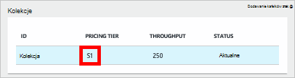
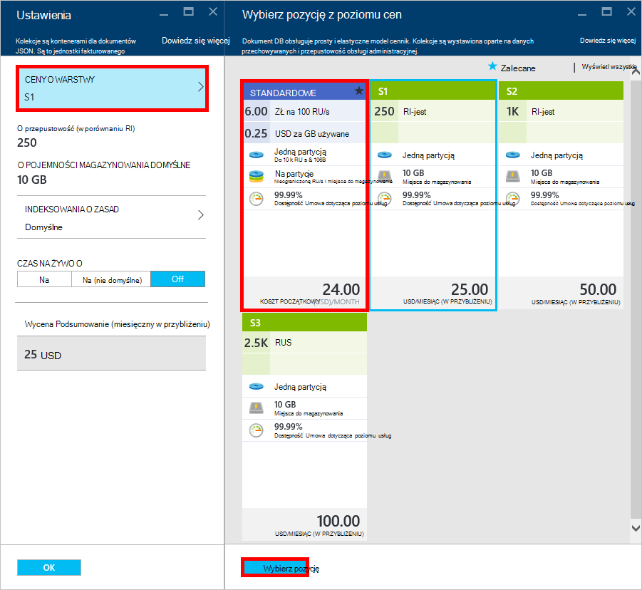
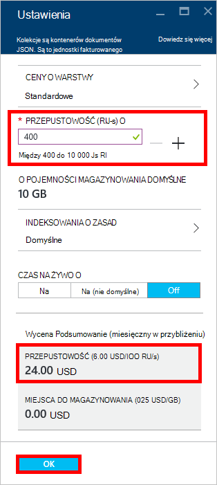
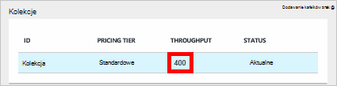

<properties 
    pageTitle="Supercharge konta DocumentDB S1 | Microsoft Azure" 
    description="Korzystać z zwiększać przepustowość na koncie DocumentDB S1, wykonując kilka prostych zmian w portalu Azure." 
    services="documentdb" 
    authors="mimig1" 
    manager="jhubbard" 
    editor="monicar" 
    documentationCenter=""/>

<tags 
    ms.service="documentdb" 
    ms.workload="data-services" 
    ms.tgt_pltfrm="na" 
    ms.devlang="na" 
    ms.topic="article" 
    ms.date="08/25/2016" 
    ms.author="mimig"/>

# Supercharge konta DocumentDB

Wykonaj poniższe czynności, aby można było korzystać zwiększać przepustowość dla Twojego konta Azure DocumentDB S1. Z dużego bez dodatkowych opłat można zwiększyć produktywność istniejącego konta S1 z 250 [RU/s](documentdb-request-units.md) do 400 RU-s lub więcej!  

> [AZURE.VIDEO changedocumentdbcollectionperformance]

## Zmienianie wydajności zdefiniowane przez użytkownika w portalu Azure

1. W przeglądarce przejdź do [**portalu Azure**](https://portal.azure.com). 
2. Kliknij przycisk **Przeglądaj,** -> **DocumentDB (NoSQL)**, a następnie wybierz konto DocumentDB do modyfikacji.   
3. W soczewki **baz danych** wybierz bazę danych, aby zmodyfikować, a następnie w karta **bazy danych** wybierz zbiór z poziomu cen S1.

      

4. W karta **zbioru** kliknij przycisk **więcej**, a następnie kliknij pozycję **Ustawienia**.   
5. W karta **Ustawienia** kliknij pozycję **Warstwy ceny** i zwróć uwagę, że miesięczny Szacowanie kosztów dla każdego planu jest wyświetlany. W karta **Wybierz z poziomu cen** kliknij **Standardowy**, a następnie kliknij przycisk **Wybierz** , aby zapisać zmiany.

      

6. W karta **Ustawienia** **Poziomu ceny** został zamieniony na **Standardowy** i z wartością domyślną 400 pojawia się okno dialogowe **przepustowości (RU-s)** . Kliknij **przycisk OK** , aby zapisać zmiany. 

    > [AZURE.NOTE] Można ustawić przepustowość między 400 do 10 000 [jednostek żądanie](../articles/documentdb/documentdb-request-units.md)/second (RU-s). **Podsumowanie cennik** u dołu strony automatycznie aktualizuje oszacowanie miesięcznych kosztów.
    
    

8. Ponownie na karta **bazy danych** , można sprawdzić z doładowaniem przepustowość kolekcji. 

    

Aby uzyskać więcej informacji o zmianach dotyczących przepustowość wstępnie zdefiniowane i zdefiniowane przez użytkownika, zobacz wpis w blogu [DocumentDB: wszystko, co należy wiedzieć o korzystaniu z nowych opcji cennik](https://azure.microsoft.com/blog/documentdb-use-the-new-pricing-options-on-your-existing-collections/).

## Następne kroki

Jeśli okaże się, że potrzebujesz więcej przepustowość (większe niż 10 000 RU/s) lub więcej miejsca do magazynowania (większe niż 10GB) możesz utworzyć zbiór podzielone na partycje. Aby utworzyć zbiór podzielone na partycje, zobacz [Tworzenie kolekcji](documentdb-create-collection.md).